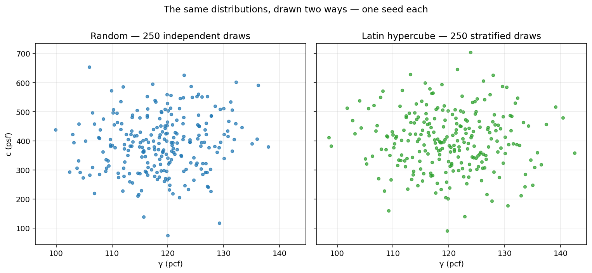
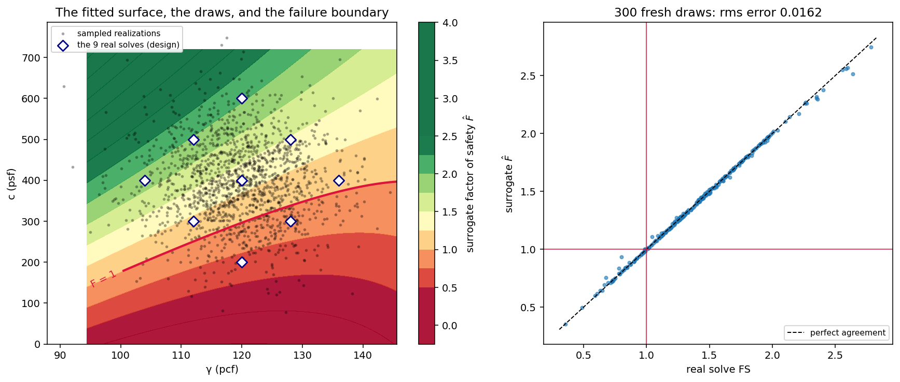

# Monte Carlo Reliability Analysis

The Monte Carlo method is a statistical technique that uses random sampling to estimate the probability of failure. It involves generating a large number of random samples for the uncertain parameters. Then we do the following steps:

1. Generate N random samples for the uncertain parameters (e.g., soil unit weight, cohesion, angle of internal friction) based on their probability distributions.
2. Combine random values for each uncertain parameter to create N "model instances". Each of these instances represents a unique combination of parameter values and is considered to be equally likely.
3. Calculate the factor of safety for each model instance using a limit equilibrium method (e.g., Bishop's method, Janbu's method, or Spencer's method).
4. Calculate the coefficient of variation of the factor of safety values obtained from the model instances.

While the Monte Carlo method is a powerful and flexible approach, it can be computationally expensive for slope stability problems as it requires a large number of model runs to obtain accurate results. The accuracy of the Monte Carlo method depends on the number of samples generated, and typically, thousands of model instances are needed to achieve a reliable estimate of the probability of failure.

## Monte Carlo in xslope

The `reliability_mc` function runs a Monte Carlo campaign directly from the same
inputs as the Taylor series: the material most-likely values and the standard
deviations already in the mat sheet. Nothing new is required — *"we just need a
number of runs, because we already have the standard deviations and the most-likely
values."*

**Sampling model.** Each uncertain parameter is drawn independently from a
distribution whose **mean is the material's base value** (the MLV in the mat sheet)
and whose **standard deviation is the matching s(·) column** — s(g) for $\gamma$,
s(c) for $c$, s(f) for $\phi$, s(c/p) for $c_p$. The default distribution is
**normal**, the same interpretation the Taylor series places on those columns; a
`distribution='lognormal'` option draws lognormal samples matched to the same mean
and standard deviation. Every draw is truncated at its physical floor — a strength
or unit weight cannot go negative — which is the one modelling assumption beyond the
raw mean and sigma. That truncation is exactly the $\phi \ge 0$ bound that governs
high-COV problems (see the VP34 worked example under
[When to use Monte Carlo versus the Taylor series](index.md#when-to-use-monte-carlo-versus-the-taylor-series));
at ordinary COVs it never activates and Monte Carlo and the [Taylor series](taylor.md)
agree closely.

**Number of runs and convergence.** The default is **10,000 samples**. The sample
mean and standard deviation of the factor of safety converge quickly (a few thousand
samples), but the empirical probability of failure — a count of the tail — converges
more slowly, so a small $P_f$ needs more samples to resolve. Increase `n_samples`
until the reported $P_f$ is stable to the precision you need.

**Sampling: random or Latin hypercube.** Realizations are drawn either
independently (**Random**, the default) or by **Latin hypercube**: each
parameter's distribution is cut into $n$ equal-probability bins with exactly one
draw per bin, so the sample covers the distribution by construction instead of
by luck. Both run through the same inverse CDFs, truncations and fixed seed.
The difference is visible in the draws themselves — the same two
distributions, one seed each:

{width=800}

Measured on the submerged-slope model (twenty repeated 1,000-realization
campaigns), Latin hypercube cut the across-campaign scatter of $P_f$ by a
factor of 1.84 — the information of roughly **3.4×** the sample count for the
same cost. One interaction to know: the convergence stop's confidence band
assumes independent draws, so under Latin hypercube it overstates the
uncertainty and the stop errs conservative — a converged LHS campaign is at
least as resolved as its band claims.

**Deterministic (seeded) sampling.** The random-number generator is seeded from a
fixed constant (never the clock), so a given input file reproduces the same $\beta$
and $P_f$ on every run — the results are regression-lockable. Pass a different
`rng_seed` to inspect sampling scatter.

**Outputs.** The function returns the sample **mean factor of safety**, its standard
deviation $\sigma_F$ and $COV_F$, the reliability index in **both conventions** — a
normal index $\beta_N = (\bar F - 1)/\sigma_F$ and the lognormal $\beta_{LN}$ from
the sample moments (same formula as the Taylor series) — and the **empirical
probability of failure**, the fraction of realizations with $F < 1$, alongside the
distribution-fitted normal and lognormal $P_f$ for comparison. In **XSLOPE Studio**
these samples are shown as an **FS histogram** with the FS = 1 line, the mean, and
fitted normal / lognormal overlays — see
[Reliability analysis](../studio/analysis.md#reliability-analysis).

**Limit-equilibrium only.** Monte Carlo is available on the limit-equilibrium
solvers only: a campaign of $10^4$ factor-of-safety evaluations is affordable with a
limit-equilibrium solve but not with the finite-element SSRM, so FEM reliability
stays on the Taylor series (1 + 2N solves — see
[Reliability Analysis (FEM)](fem.md)).

**Stopping on statistical convergence.** The number of realizations a campaign
needs is set by the answer, not the input: the 95% confidence half-width on an
empirical probability of failure is $1.96\sqrt{p(1-p)/n}$. The optional
convergence stop — `converge_rel` in the API, the **Stop when P_f converges**
checkbox and its tolerance in Studio's Reliability dialog — checks that
half-width every 100 realizations and ends the campaign once $P_f$ is known to
the stated fraction **of itself** (default ±5%), with the sample count as the
cap. The tolerance is relative because an absolute one is miscalibrated across
the $P_f$ range: half a percentage point is ±3% of a 17% probability of
failure but ±25% of a 2% one. Relative, the demanded sample count self-scales
as $(1-p)/p$ — the submerged-slope model below converges at the default ±5% in about
7,600 realizations at $P_f \approx 17$% (18 s), and the same rule would ask
roughly 75,000 of a 2% problem — raise the sample cap when a small $P_f$
meets a tight tolerance. The rule never fires before 500 realizations or before
10 failures have been observed, so a rare-event problem — where the normal
approximation behind the half-width is not yet credible — runs to its cap
instead of stopping on false confidence. Because the whole sample matrix is
drawn up front from the fixed seed, a converged run is exactly the first $n$
realizations of the full one: still bit-reproducible, and reported with its
stopping $n$ and its achieved resolution in the console summary.

The running estimate and its confidence band can be read off any Monte Carlo
result with `plot_reliability_convergence` — the sample-15 campaign, drawn in
full with the ±5% stop target it satisfies at n = 7,600:


### Worked example: VP34 (Clarence Cannon Dam)

**VP34** is the corpus case Monte Carlo was added for: Wolff & Harr (1987)'s Phase I
fill has $\phi = 6.34° \pm 7.87°$, a coefficient of variation of 124%. The Taylor
series cannot evaluate $F(\phi - \sigma)$ — MLV $-\sigma$ is negative — and
`reliability()` declines the input; `reliability_mc` handles it by truncating the
negative draws at $\phi = 0$, the same physical floor the published Monte Carlo
estimates apply (see [When to use Monte Carlo versus the Taylor
series](index.md#when-to-use-monte-carlo-versus-the-taylor-series)):

```python
from xslope.fileio import load_slope_data
from xslope.advanced import reliability_mc
from xslope.plot import plot_reliability_histogram

slope_data = load_slope_data("vp034.xlsx")
success, result = reliability_mc(slope_data, "spencer", circular=False,
                                  search=False, n_samples=10000, num_slices=40)
plot_reliability_histogram(result)
```

{width=800}

The distribution is strongly right-skewed, the signature of a large-COV input pushed
through a nonlinear factor-of-safety response: mean FS = 2.542, $\sigma_F$ = 0.809,
and an empirical probability of failure of 1.94% (9,874 of the 10,000 draws
converged to a valid Spencer solution; the rest are excluded rather than counted as
failures). That lands inside the 0.36%–6.2% band spanned by the three published
estimates for this problem — a case the Taylor series simply has no number for (see
[VP34](../verification/rocscience.md#vp34) for the full comparison). This is the same
plot XSLOPE Studio renders on the **Reliability · MC** result tab — see
[Reliability analysis](../studio/analysis.md#reliability-analysis).

## Sampling a fitted response surface

The resolution of a sampling campaign is set by its count: the 95% confidence
half-width on an empirical probability of failure is $1.96\sqrt{p(1-p)/n}$, so a
$P_f$ near 17% is known to ±1.6 percentage points after 2,000 realizations, ±0.7
after 10,000, and reaching ±0.01 would take about **53 million** real
factor-of-safety solves — a day of limit-equilibrium solving for one number.

The **response surface** engine — `reliability_rs`, or `reliability(...,
engine='rs')` — takes the count out of the cost. It fits a quadratic surrogate to a
few dozen real solves and samples that surrogate ten million times, which moves the
error budget from sampling noise, which no longer registers, to the fit, which is
measured and reported. Everything else is the campaign above: the same fixed
surface, the same uncertain parameters, and the same draws — both engines generate
their realizations through one routine, so the distributions, the physical floors
and the $\phi \le 89°$ cap are identical by construction.

**The design.** A central composite design about the most-likely values — the $2^d$
factorial corners at ±1σ, $2d$ axial points at ±2σ, and the centre, where $d$ is the
number of parameters carrying a standard deviation. That is 9 real solves for two
uncertain parameters, 15 for three, 25 for four. Each is solved with the full
pipeline on the fixed surface. A design point that lands below a parameter's
physical floor is solved *at* the floor and fitted at the coordinate that was
solved. The axial distance of 2σ is a measured choice: across four corpus models,
tried at 1.5, 2, 2.5 and 3σ, it gives the lowest fit error on every one of them.

**The fit.** A full quadratic in the $d$ parameters,

$$\hat F(x_1,\ldots,x_d) \;=\; \beta_0 \;+\; \sum_i \beta_i x_i \;+\; \sum_{i \le j} \beta_{ij}\, x_i x_j$$

— $1 + d + d(d+1)/2$ coefficients — by least squares. A design point with no analyzable solution ends the
run with a message naming it: the surrogate is fitted to the whole design, so a
corner that cannot be solved leaves the fit undefined over part of the sampled
range.

On the submerged-slope model the whole construction fits in one picture: the
nine design solves (diamonds), the surface they define, the ten-million-draw
cloud it is sampled with, and the $F = 1$ boundary the tail count happens
against — beside 300 fresh real solves scattered on the surrogate's own
prediction:



**The gate.** The surrogate answers nothing until it has been measured against the
real pipeline, in two places:

- **500 held-out realizations**, drawn from the sampling distributions on an
  independent stream of the same seed and never used in the fit, solved for real.
  The surrogate is accepted when its root-mean-square error is within 5% of the real
  spread of the factor of safety over those draws, its $R^2$ is at least 0.995, and
  at most 2% of the draws are put on the wrong side of $F = 1$.
- **200 realizations from the failure region** — draws the surrogate itself counted
  as $F < 1$ — solved for real. A gate drawn from the whole population barely visits
  that region, and the region is the entire answer. The run is refused when more
  than 5% of them have no analyzable solution, or the solver puts more than 10% of
  them back above $F = 1$.

Both thresholds are calibrated against what the fit error costs the answer, measured
by solving tens of thousands of realizations for real and predicting the same draws
with the surrogate. On the submerged-slope model below the surrogate fits to 0.042
of the real spread ($R^2$ = 0.9982) and its probability of failure differs from the
solver's, over the same 30,000 realizations, by **0.10 percentage points** — 0.6% of
its own value, well inside the sampling noise of the Monte Carlo campaign it
replaces. Every gate measurement is reported with the answer, in the console
summary and in the result dictionary.

**A refusal is the answer when the surrogate cannot be honest.** No result is
degraded silently: a failed gate returns a message naming the measured errors, and
the choice of what to run instead belongs to the caller. VP34 is refused for the
second gate — a third of the realizations its surrogate counts as failures have no
analyzable solution at all, so its $P_f$ would be a count of realizations the model
cannot solve. Monte Carlo reports that model, excluding those draws and counting
them separately.

**Sample 15 (the submerged slope), both engines, Spencer's method:**

| | Monte Carlo | Response surface |
|---|---:|---:|
| Real limit-equilibrium solves | 2,000 | 710 |
| Realizations counted | 2,000 | 10,000,000 |
| Wall time | 6.3 s | 4.2 s |
| Mean FS | 1.385 | 1.381 |
| $\sigma_F$ | 0.408 | 0.400 |
| $\beta_{LN}$ | 0.985 | 0.998 |
| $P_f$ | 16.85% | 16.56% |
| 95% sampling half-width on $P_f$ | ±1.64 pp | ±0.02 pp |

```python
from xslope.fileio import load_slope_data
from xslope.reliability import reliability

slope_data = load_slope_data("xslope_prob_submerged_KEY.xlsx")
success, result = reliability(slope_data, "spencer", engine="rs", search=True)
if success:
    print(result["pf_empirical"], result["beta_ln"], result["gate_r2"])
```

The result carries the Monte Carlo keys, so a histogram or a rank correlation reads
it unchanged; `fs_samples` and `param_samples` are a fixed-stride subsample of
10,000 realizations, for plotting, while every reported statistic comes from all ten
million. In **XSLOPE Studio** the engine is the third entry of the Reliability
dialog's **Method** selector, sharing the seed and distribution controls with Monte
Carlo — see [Reliability analysis](../studio/analysis.md#reliability-analysis).

## Surface treatment

The slip surface is a **decision variable, not a random variable** — its geometry is
therefore **never randomized**. Two treatments are meaningful:

- **Fixed-surface Monte Carlo (the default).** Every realization is evaluated on the
  *same* surface: the prescribed surface when `search=False`, or the
  most-likely-values critical surface when `search=True` (found once, then held
  fixed). This is the analogue of Slide2's **Global Minimum** probabilistic method,
  and it is what every published probabilistic benchmark did — Duncan's estimated
  LASH surface (VP29), Chowdhury & Xu's printed circles (VP28), Wolff & Harr's
  prescribed noncircular surface (VP34) — so it is the correct like-for-like basis
  for comparison. The honest caveat: a fixed-surface $P_f$ *understates* the
  slope-system probability of failure, because for some sampled parameter sets the
  true critical surface lies elsewhere.
- **Per-realization minimum (a follow-up mode).** The system-level analogue of
  Slide2's *Overall Slope* method re-evaluates, for each realization, the **ensemble
  of candidate surfaces already found by the deterministic search** and takes the
  minimum — *not* a fresh search per realization, which would be prohibitive. This
  mode is a documented follow-up and is not yet shipped; the fixed-surface campaign
  above is what the corpus comparisons use.

The Taylor-series side has the same distinction, already exercised in the corpus: on
the Cannon Dam benchmark (VP35, Hassan & Wolff 1999) the **surface of minimum
reliability index is not the surface of minimum factor of safety**, so a design
screened on FS alone examines the wrong surface. Randomizing geometry is never the
answer; searching on $\beta$ (or on FS) is.
