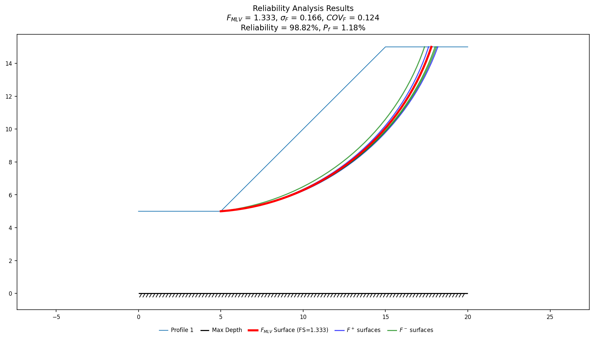

# Taylor Series Probability Method (TSPM)

The Taylor Series Probability Method (TSPM) is a more efficient approach for calculating the coefficient of variation of the factor of safety as it requires a much smaller set of model runs. It uses the first-order Taylor series expansion to approximate the factor of safety as a function of the uncertain parameters. The TSPM can be summarized in the following steps:

1. Determine the standard deviation ($\sigma_i$) for each uncertain parameter using the guidelines described in [Parameter Uncertainty](index.md#parameter-uncertainty).
2. Find $F_i^+$ and $F_i^-$, for each parameter where:

>>$F_i^+$ = the factor of safety calculated using the parameter value = $MLV + \sigma_i$ with all other parameters held at the most likely value<br>
> $F_i^-$ = the factor of safety calculated using the parameter value = $MLV - \sigma_i$ with all other parameters held at the most likely value

3. Compute $\Delta F_i = |F_i^+ - F_i^-|$ for each parameter.
4. Compute $\sigma_F$ and $COV_F$ using the following equations:


>>$\sigma_F = \sqrt{\left(\dfrac{\Delta F_1}{2} \right)^2 + \left(\dfrac{\Delta F_2}{2} \right)^2 + \ldots + \left(\dfrac{\Delta F_n}{2} \right)^2}$

>>$COV_F = \dfrac{\sigma_F}{F_{MLV}}$

$\sigma_F$ and $COV_F$ then feed the lognormal reliability index $\beta_{LN}$ and the
reliability $R$ from the [Reliability Equation](index.md#reliability-equation). Each
parameter is evaluated at exactly two points — $MLV + \sigma_i$ and $MLV - \sigma_i$ —
so TSPM is, per parameter, a two-point (Rosenblueth-style) point-estimate method; see
[How commercial software does it](index.md#how-commercial-software-does-it) for how
that compares with the finite-element vendors' own point-estimate options.

## Data Input

To perform reliability analysis using the **xslope** package, we simply need to provide standard deviations for the uncertain parameters in the input data. This is done in the Materials table of the input data file. The main values of the parameters in the table are treated as the most likely values. We can then call the `reliability` function to perform the analysis. The function will automatically calculate the factor of safety based on the most likely values ($F_{MLV}$) of the parameters using an automated search. It will then perturb each parameter by the standard deviation using the Taylor Series Method described above to calculate the coefficient of variation of the factor of safety ($COV_F$). Finally, it will compute the reliability of the slope based on the calculated values.

The strength parameters that are perturbed depend on each material's strength model: for Mohr-Coulomb (`mc`) materials the cohesion $c$ and friction angle $\phi$ are perturbed, while for the depth-varying undrained (`cp`) model the cohesion $c$ and the rate $c_p$ are perturbed. The unit weight $\gamma$ is perturbed in both cases. If a standard deviation exceeds its mean — so that mean $-\sigma$ would be negative — the Taylor-series analysis stops with an error, since a negative strength parameter is non-physical. This is the boundary of the Taylor-series method's domain; when a parameter's COV is that large, use the Monte Carlo function instead (`reliability_mc`, described in [Monte Carlo in xslope](monte_carlo.md#monte-carlo-in-xslope)), which handles the negative draw by truncating it at zero.

The Monte Carlo campaign is called the same way through `reliability_mc`, which reads the identical MLV and standard-deviation inputs and adds only the sampling controls (`n_samples`, `distribution`, `rng_seed`). It is a limit-equilibrium path only, for the compute reason discussed in [Monte Carlo in xslope](monte_carlo.md#monte-carlo-in-xslope).

One of the arguments to the function is `method`, which specifies the limit equilibrium method to be used for the analysis. The available methods are 'bishop', 'janbu', and 'spencer'. The function will return the probability of failure ($P_f$) and reliability ($R$) of the slope. Either a circular or non-circular slope can be analyzed. If a circular slope is analyzed, care should be taken to select a set of starting circles in the circles table of the input file to ensure that the automated search finds the global minimum factor of safety for each analysis. It is good practice to include a circle that touches the bottom each material zone and perhaps a circle that passes through the toe of the slope.

## Visualizing the perturbation surfaces

`plot_reliability_results()` draws the $F_{MLV}$ surface together with every
$F_i^+$/$F_i^-$ perturbation surface from step 2 above, so the effect of each
$\pm\sigma_i$ swing is visible in the geometry, not just the factor of safety. It
takes the `slope_data` and the `result` dict `reliability_taylor` returns:

```python
from xslope.fileio import load_slope_data
from xslope.advanced import reliability_taylor
from xslope.plot import plot_reliability_results

slope_data = load_slope_data("vp036.xlsx")
success, result = reliability_taylor(slope_data, "bishop")
plot_reliability_results(slope_data, result)
```

{width=800}

**VP36** (Li & Lumb 1987 / Hassan & Wolff 1999) is a homogeneous slope with standard
deviations on $\gamma$, $c$ and $\phi$. With `search=True` (the default) the critical
surface is re-searched at each of the $2N=6$ perturbed states, so the red $F_{MLV}$
surface and the six blue/green $F^+$/$F^-$ surfaces fan out slightly rather than
coincide — visible confirmation that the search, not only the factor of safety,
shifts under each $\pm\sigma$ perturbation. XSLOPE Studio renders this same plot on
the **LEM · Reliability** result tab — see
[Reliability analysis](../studio/analysis.md#reliability-analysis).

## Console summary

`reliability()` prints a running summary as it works through the critical-surface
search, each parameter's $F^+$/$F^-$ perturbation searches, and the final
statistics — pass `debug_level=1` to see it. Below is that summary for the same
VP36 run behind the plot above (`reliability(slope_data, "bishop", debug_level=1)`).
The per-iteration search progress is elided for length; everything else,
including the tabulated $\Delta F$ breakdown and the summary statistics, is
printed verbatim:

```text
=== RELIABILITY ANALYSIS ===
Method: bishop
Rapid drawdown: False
Circular search: True
Performing circular search...
  ... (search iterations) ...
[✅ converged] Iter=9, FS=1.3334 (ΔFS<0.0005) at (x=3.92, y=19.55, depth=4.96), elapsed time=1.73 seconds
Critical factor of safety (F_MLV): 1.3334
Found 3 parameters with standard deviations:
  Material 1: gamma = 18.000 ± σ=0.900
  Material 1: c = 18.000 ± σ=3.600
  Material 1: phi = 30.000 ± σ=3.000

Processing parameter 1/3: Material 1, gamma
  ... (search iterations) ...
[✅ converged] Iter=13, FS=1.2993 (ΔFS<0.0005) at (x=3.97, y=19.47, depth=4.96), elapsed time=2.15 seconds
  ... (search iterations) ...
[✅ converged] Iter=9, FS=1.3710 (ΔFS<0.0005) at (x=3.88, y=19.92, depth=4.96), elapsed time=1.78 seconds
  F+ = 1.2993, F- = 1.3710, ΔF = 0.0717

Processing parameter 2/3: Material 1, c
  ... (search iterations) ...
[✅ converged] Iter=15, FS=1.4752 (ΔFS<0.0005) at (x=3.88, y=20.16, depth=4.96), elapsed time=2.35 seconds
  ... (search iterations) ...
[✅ converged] Iter=10, FS=1.1886 (ΔFS<0.0005) at (x=3.31, y=19.74, depth=4.90), elapsed time=1.87 seconds
  F+ = 1.4752, F- = 1.1886, ΔF = 0.2867

Processing parameter 3/3: Material 1, phi
  ... (search iterations) ...
[✅ converged] Iter=16, FS=1.4098 (ΔFS<0.0005) at (x=3.84, y=19.43, depth=4.95), elapsed time=2.66 seconds
  ... (search iterations) ...
[✅ converged] Iter=10, FS=1.2602 (ΔFS<0.0005) at (x=3.88, y=20.04, depth=4.96), elapsed time=1.74 seconds
  F+ = 1.4098, F- = 1.2602, ΔF = 0.1496

σ_F = 0.1656
COV_F = 0.1242
β_ln = 2.2635
Reliability = 98.82%
Probability of failure = 1.18%

=== RELIABILITY ANALYSIS RESULTS ===
+-------------+-------+-----+---------+---------+-------+-------+-------+
| Parameter   |  MLV  |  σ  |  MLV+σ  |  MLV-σ  |  F+   |  F-   |  ΔF   |
+=============+=======+=====+=========+=========+=======+=======+=======+
| Mat 1 gamma |  18   | 0.9 |  18.9   |  17.1   | 1.299 | 1.371 | 0.072 |
+-------------+-------+-----+---------+---------+-------+-------+-------+
| Mat 1 c     |  18   | 3.6 |  21.6   |  14.4   | 1.475 | 1.189 | 0.287 |
+-------------+-------+-----+---------+---------+-------+-------+-------+
| Mat 1 phi   |  30   |  3  |   33    |   27    | 1.41  | 1.26  | 0.15  |
+-------------+-------+-----+---------+---------+-------+-------+-------+

Summary Statistics:
F_MLV: 1.333
σ_F: 0.166
COV_F: 0.124
β_ln: 2.263
Reliability: 98.82%
Probability of failure: 1.18%

Reliability analysis completed in 14.29 seconds.
```

$F_{MLV}$ = 1.333 and $\beta_{ln}$ = 2.263 match the values quoted for VP36 in the
[verification corpus](../verification/rocscience.md#vp36).
