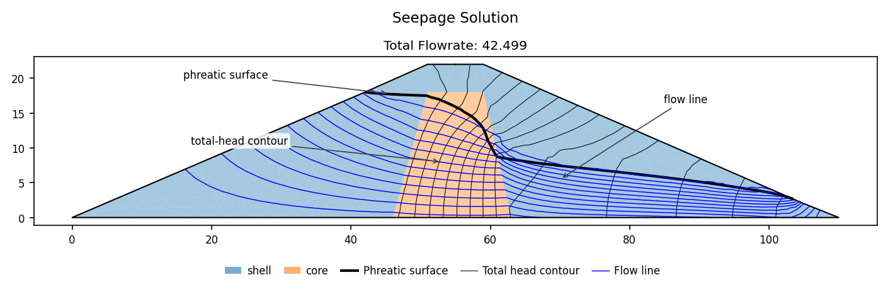
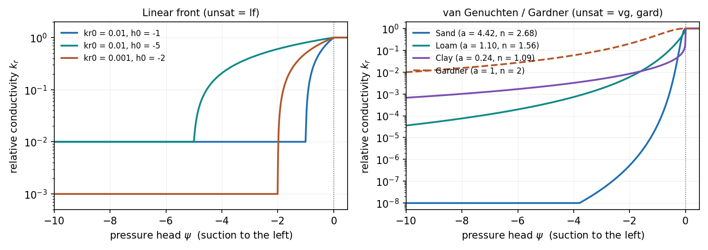
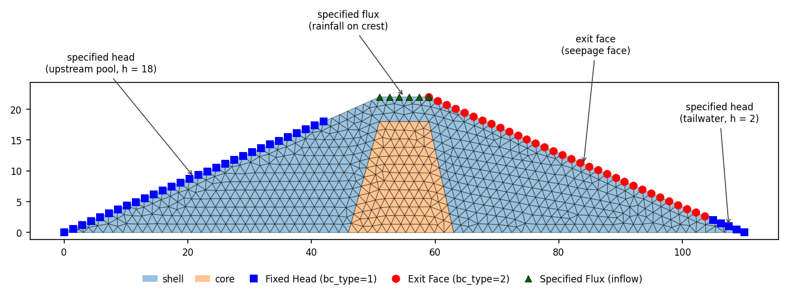
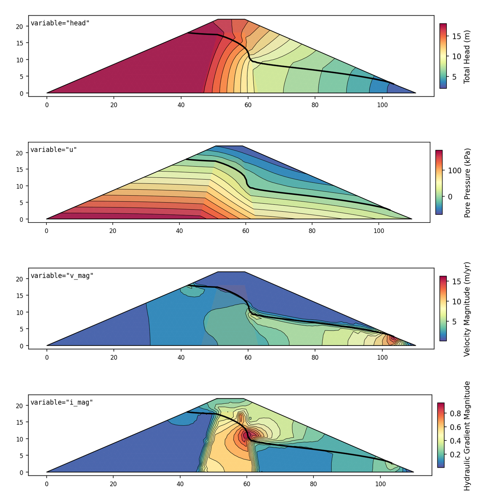

# Seepage Analysis in XSLOPE

XSLOPE solves two-dimensional groundwater flow by finite elements and hands the resulting
pore-pressure field straight to the limit-equilibrium and finite-element stability analyses.
Both read the same Excel input file, so one model carries the geometry, the material
properties, the seepage boundary conditions and the stability inputs together.

{width=1000px}

*A steady solution on a zoned earth dam: total-head contours, flow lines, and the phreatic
surface separating the saturated soil from the unsaturated zone above it.*

The tools also work as a stand-alone 2D seepage program — confined or unconfined, saturated
or unsaturated — and can import SEEP2D input files (the US Army Corps of Engineers FORTRAN
code). Seepage can be run point-and-click in [XSLOPE Studio](../studio/index.md): build a
mesh, set boundary conditions, and view head contours, the phreatic surface and flow lines.
See [Studio → Running Analyses](../studio/analysis.md#seepage).

## Governing Equations

### Saturated flow

Darcy's law relates the specific discharge to the hydraulic gradient,

>>$\vec{v} = -[K] \nabla h$

and combining it with continuity for incompressible flow, $\nabla \cdot \vec{v} = 0$, gives
the governing equation for steady saturated flow:

>>$\nabla \cdot ([K] \nabla h) = 0$

Conductivity is entered per material as a major and minor principal value $k_1$ and $k_2$ and
a rotation $\alpha$ of the principal axes from the x-axis:

{width=300px}

The conductivity tensor is assembled from those three numbers by rotation,
$[K] = [R]^T [K_{principal}] [R]$, which expands to

>>$[K] = \begin{bmatrix}
k_1 \cos^2\alpha + k_2 \sin^2\alpha & (k_1 - k_2) \cos\alpha \sin\alpha \\
(k_1 - k_2) \cos\alpha \sin\alpha & k_1 \sin^2\alpha + k_2 \cos^2\alpha
\end{bmatrix}$

With $\alpha = 0$ this is $\mathrm{diag}(k_1, k_2)$, and for an isotropic material
($k_1 = k_2$) it is $k[I]$ at any rotation. For the aligned case the governing equation
reduces to

>>$k_1 \dfrac{\partial^2 h}{\partial x^2} + k_2 \dfrac{\partial^2 h}{\partial y^2} = 0$

!!! note "Time units on seepage quantities"
    Conductivity, specified flux and the computed flowrate all carry a length/time (or
    volume/time) dimension. When the model declares both a unit system and a **Time** unit on
    the main sheet, XSLOPE labels these quantities with that time unit — on the input forms,
    on the flow-net title (e.g. *Total Flowrate: 38.776 m³/yr per m* on the earth dam below)
    and colorbar, and in a
    `# units:` header on the exported `_seep.csv`. The one declared time unit governs them all
    together, because XSLOPE never converts. Leave it blank and these quantities stay
    unlabeled.

### Unsaturated flow {#unsaturated-flow-formulation}

Above the phreatic surface the conductivity falls with suction, and the governing equation
carries a relative conductivity $k_r(\psi)$ that depends on the pressure head $\psi = h - z$:

>>$\nabla \cdot (k_r(\psi) [K] \nabla h) = 0$

Three models for $k_r$ are available, selected per material through the `unsat` column
(`lf`, `vg`, `gard`). The van Genuchten and Gardner models share one pair of law-agnostic
input columns, `a` and `n`.

{width=1000px}

*The three relative-conductivity models, evaluated by the solver's own `kr_relative_vec`
(log scale). The van Genuchten and Gardner curves are floored at
$k_{r,\min} = 10^{-4}$; the linear front is floored at its own $kr_0$.*

#### Linear front (`lf`)

The default, and the recommended model for slope-stability work:

>>$k_r(\psi) = \begin{cases}
1.0 & \psi \geq 0 \\
kr_0 + (1 - kr_0) \left[ \dfrac{\psi - h_0}{-h_0} \right] & h_0 < \psi < 0 \\
kr_0 & \psi \leq h_0
\end{cases}$

with $kr_0$ the relative conductivity at the reference suction head $h_0$ (negative,
typically −1 to −10). Two parameters, no special functions, and a smooth transition across
the phreatic surface.

For slope stability the precise shape of the curve has little influence on the result.
Suction is conservatively neglected in both the limit-equilibrium and finite-element strength
calculations, so the unsaturated zone never enters the strength; and in a steady solve the
pore pressures *below* the phreatic surface — the ones that drive stability — are largely
insensitive to the unsaturated curve. The other two models are offered for compatibility with
models imported from other software, and for user preference.

#### van Genuchten (`vg`) {#van-genuchten-model}

The van Genuchten–Mualem function, the standard model in unsaturated soil mechanics, from
$\alpha$ (the `a` column) and $n$:

>>$S_e = \left[\,1 + (\alpha\,|\psi|)^{\,n}\,\right]^{-m}, \qquad m = 1 - \dfrac{1}{n}$

>>$k_r(\psi) = \begin{cases} 1.0 & \psi \geq 0 \\ S_e^{\,1/2}\left[\,1 - \left(1 - S_e^{\,1/m}\right)^{m}\,\right]^{2} & \psi < 0 \end{cases}$

Only $\alpha$ and $n$ are needed for a steady solve: the residual and saturated water contents
affect storage, not relative conductivity. (They matter for [transient](transient.md) runs,
which take $S_y$ as the drainable water content.)

**Typical parameters** by USDA soil-texture class, after
**[Carsel & Parrish (1988)](https://doi.org/10.1029/WR024i005p00755)** — the standard
reference dataset, the same source HYDRUS and most unsaturated-flow codes use:

| Soil texture | `a` = α (1/cm) | `n` | | Soil texture | `a` = α (1/cm) | `n` |
| --- | --- | --- | --- | --- | --- | --- |
| Sand | 0.145 | 2.68 | | Sandy clay loam | 0.059 | 1.48 |
| Loamy sand | 0.124 | 2.28 | | Clay loam | 0.019 | 1.31 |
| Sandy loam | 0.075 | 1.89 | | Silty clay loam | 0.010 | 1.23 |
| Loam | 0.036 | 1.56 | | Sandy clay | 0.027 | 1.23 |
| Silt | 0.016 | 1.37 | | Silty clay | 0.005 | 1.09 |
| Silt loam | 0.020 | 1.41 | | Clay | 0.008 | 1.09 |

!!! note "Units of α"
    These α values are in **1/cm**, the units Carsel & Parrish tabulate. XSLOPE is
    unit-agnostic, so convert to the model's length unit: for **metres** multiply by 100, for
    **feet** by 30.48. $n$ is dimensionless. Larger α and $n$ mean a coarser, more freely
    draining soil; small α with $n \to 1$ means a fine, slowly draining one.

#### Gardner (`gard`)

The [Gardner (1958)](https://doi.org/10.1097/00010694-195804000-00006) power form, the legacy
option in SEEP/W and Slide, so models imported from those packages carry $a$ and $n$ in exactly
this form:

>>$k_r(\psi) = \begin{cases} 1.0 & \psi \geq 0 \\ \dfrac{1}{1 + a\,|\psi|^{\,n}} & \psi < 0 \end{cases}$

This is the *power* form, not the exponential form $k_r = e^{\alpha\psi}$ that also carries
Gardner's name. There is no $m = 1 - 1/n$ coupling, so $n$ need only be positive.

**Fitted parameters** by USDA soil-texture class. Gardner has no published texture table of
its own — its parameters normally arrive with an imported SEEP/W or Slide model, or from
fitted measurements. The values below are least-squares fits (in $\log_{10} k_r$ over 0.01
to 100 ft of suction, with $k_r$ floored at $10^{-4}$) to each texture's van Genuchten curve
from the Carsel & Parrish table above, so the underlying dataset is the same; the RMS column
is the misfit of the power form to that curve — small for coarse textures, about a quarter
of a decade for the clays. They are produced by `tools/fit_gardner_table.py`:

| Soil texture | `a` (ψ in m) | `a` (ψ in ft) | `n` | RMS log₁₀k_r |
| --- | --- | --- | --- | --- |
| Sand | 4.38e+06 | 1.39e+04 | 4.84 | 0.07 |
| Loamy sand | 3.18e+05 | 2.7e+03 | 4.01 | 0.08 |
| Sandy loam | 1.14e+04 | 261 | 3.18 | 0.10 |
| Loam | 760 | 41.9 | 2.44 | 0.13 |
| Silt | 154 | 15 | 1.96 | 0.18 |
| Silt loam | 220 | 18.9 | 2.07 | 0.16 |
| Sandy clay loam | 2.24e+03 | 155 | 2.25 | 0.14 |
| Clay loam | 255 | 30.4 | 1.79 | 0.19 |
| Silty clay loam | 130 | 20.9 | 1.54 | 0.23 |
| Sandy clay | 602 | 95.4 | 1.55 | 0.21 |
| Silty clay | 255 | 77.1 | 1.01 | 0.27 |
| Clay | 408 | 119 | 1.04 | 0.25 |

!!! note "Units of Gardner's `a`"
    Because $a\,|\psi|^n$ must be dimensionless, `a` carries units of $(1/\text{length})^n$ —
    so unlike van Genuchten's α, it does not convert between unit systems with a single
    factor. The exact rule is $a_{\text{ft}} = a_{\text{m}} \times 0.3048^{\,n}$, which is why
    the table lists both columns rather than a conversion. $n$ is unit-invariant. One more
    caution: `a` and `n` trade off along a flat valley in the fit, so two quite different
    $(a, n)$ pairs can describe nearly the same curve — when comparing parameters from
    different sources, compare the drawn $k_r$ curves rather than the coefficients.

### Transient flow

The formulation above is steady: a single head field in equilibrium with fixed boundaries, in
a medium that stores nothing. When the boundaries change with time — a reservoir drawn down, a
storm, an embankment shedding excess pressure — a storage term must be added and the answer
depends on *when* the slope is examined. XSLOPE solves that problem when the input file
carries a filled-in [**tseep** sheet](../usage/input_template.md#worksheet-tseep) and the
materials carry $S_s$ / $S_y$. With no tseep sheet the analysis is steady and the results are
exactly those described here.

See [**Transient Seepage**](transient.md) for the storage physics, the time stepping, the
time-series boundary conditions, the saved frames, and the coupling to
[rapid drawdown](../lem/rapid.md).

## Boundary Conditions

XSLOPE supports three boundary-condition types, all defined on the
[**seep bc** sheet](../usage/input_template.md#worksheet-seep-bc).

{width=1000px}

*The three types on one section, in the symbology `plot_seep_data(show_bc=True)` draws:
specified head (blue squares), exit face (red circles), specified flux (green triangles,
pointing up for inflow and down for outflow). The sample carries the two head boundaries and
the exit face; the crest flux is added here so all three appear together.*

### Specified head (Dirichlet)

A specified-head boundary prescribes $h = h_0$ along a polyline. Its nodes are eliminated from
the system rather than solved for. Two **types** are available per block:

| Type | Behaviour |
|------|-----------|
| `head` | A plain Dirichlet: every node of the polyline is held at the value at all times. It can hold a negative-pressure (suction) head and never converts to an exit face |
| `reservoir` | A **submerged-only** Dirichlet: a node is held at the level only while it is submerged (elevation at or below the level). A node the water line leaves above it becomes an **exit face** node, free to seep |

For a level drawn at or above the whole polyline the two are identical, which is the usual
steady case. They differ when part of the boundary stands above the water — the situation a
[transient drawdown](transient.md#head-types-head-and-reservoir) creates, and one a constant
`reservoir` level reproduces too if the polyline is drawn above the level.

### Exit face (seepage face)

An exit face is a boundary where water may discharge to the atmosphere — a downstream slope,
an excavation wall — and where the position of the discharge point is not known in advance.
On it,

>>$\psi = 0$ (total head = elevation) wherever seepage is occurring, and

>>$\partial h / \partial n = 0$ (no flow) above the discharge point.

Which nodes are in which state is found by an **active set** iteration following SEEP2D: a
boundary node is held saturated at atmospheric pressure unless its head would fall below its
own elevation, or the boundary reaction would have to push water *into* the domain — either of
which releases it to no-flow. An inactive node is taken back into the face when its pressure
climbs back to zero and the sweep is no longer pushing water in. The iteration repeats until
the set stops changing, which is also one of the convergence conditions below.

On quadratic meshes (`tri6`, `quad8`, `quad9`) the active set is tracked **per boundary
edge** rather than per node: a quadratic side is active only when both corners and the midside
node satisfy the criterion. This keeps the seepage transition at element corners and keeps the
quadratic head solution consistent with the flow net near the exit point.

### Specified flux (Neumann) {#specified-flux-boundary-conditions-neumann}

A specified-flux boundary prescribes the rate at which water crosses a boundary instead of the
head on it — rainfall infiltration or recharge, where the water-table position is an *output*
and so cannot be imposed:

>>$-k \dfrac{\partial h}{\partial n} = q$

$q$ is the **normal Darcy velocity** (length/time), positive **into** the domain. It is a flow
per unit area of boundary, not a total discharge over the segment.

The flux enters as a boundary load, $f_i = \int_\Gamma N_i \, q \, ds$, which for a straight
edge of length $L$ with uniform $q$ gives $qL/2$ at each node of a linear edge and
$qL/6,\ qL/6,\ 2qL/3$ at the corners and midside of a quadratic edge. Each set sums to $qL$,
so the water entering through an edge is exactly $qL$ at any element order. Flux nodes remain
unknowns in the solve, since a flux is a natural boundary condition.

Four consequences are worth knowing:

**A model with only flux boundaries is singular.** A flux constrains the gradient of the head,
not the head, so the solution is determined only up to an additive constant. At least one
specified-head boundary or exit face must be present, and XSLOPE refuses the model if none is.

**A flux boundary can be over-specified.** Nothing prevents forcing in more water than the
soil can transmit; the solver simply raises the pressure until the flow balances, producing
positive pore pressure at the ground surface. Physically the surface would pond and the excess
would run off. XSLOPE does not model that runoff, but warns when any flux node finishes with
$\psi > 0$ on an unconfined problem — the signal that the specified rate exceeds what the soil
can accept and the result should not be trusted.

**A flux boundary may overlap an exit face**, which is the natural way to pose rain falling on
a slope that also seeps. The two interact node by node. Where the exit face is *inactive* the
node is a free unknown, so the rain lands on it, infiltrates, and counts toward the reported
inflow. Where the exit face is *active* the head is prescribed and the load is discarded: rain
falling on an already-draining face runs off, counted neither as inflow nor outflow. As the
water table rises, nodes cross from the first regime to the second. The one posing XSLOPE
cannot resolve is an inflow onto a seepage face larger than the face can drain — such a node
has no steady answer under either condition, so the iteration oscillates and the run reports
`converged = False` rather than a plausible-looking number.

**A flux boundary may also overlap a specified head**, which is what happens wherever rain
falling on a slope meets the reservoir: the same node is on both polylines. The specified head
wins. The load is assembled onto that node like any other and then discarded when the head is
enforced, so none of the water that load stood for enters the domain — the reservoir already
fixes the head at that node, and a flux cannot move a prescribed head.

Draw a flux boundary on the **geometry** — corner to corner of the surface the water falls on —
rather than on the extent some mesh happens to have nodes at. The mesher pins a node at every
vertex of every boundary polyline, so a boundary drawn on the section is honored to its stated
length whatever element size is used. A boundary drawn to fit one mesh is not: an edge carries
load only when *both* its corner nodes lie on the polyline, so an endpoint that lands part-way
along an element edge drops that edge whole, and the model quietly takes less water than it
was given. XSLOPE warns when the matched length misses the specified length by more than one
element.

Zero flux is the natural (do-nothing) condition that an unspecified boundary already carries,
so a flux boundary is needed only where the flux is non-zero.

## Solution

### Finite element formulation

The weak form of the governing equation, with $N_i$ the shape functions and $\Gamma_q$ the
flux boundary,

>>$\int_\Omega [K] \nabla N_i \cdot \nabla h \, d\Omega = \int_{\Gamma_q} N_i q \, d\Gamma$

discretizes to $[K_{global}]\{h\} = \{Q\}$, where the element conductivity matrix is
integrated numerically as $[K_e] = \int_{A_e} [B]^T [K] [B] \, dA$.

Five element types are supported:


Linear triangles (`tri3`) are efficient and accurate enough for most seepage problems, and are
the usual choice for a stand-alone seepage analysis. Quadratic elements (`tri6`, `quad8`,
`quad9`) resolve gradients near boundaries and material interfaces better, and are
**required** when the same mesh will carry a
[FEM stability analysis](seep_slope.md#element-type-considerations-for-fem), where linear
elements lock volumetrically and overestimate the factor of safety.

### Confined and unconfined problems

`run_seepage_analysis` picks the solution path from the boundary conditions: a problem with
any exit-face nodes is **unconfined** and is solved iteratively; one without them is
**confined** and is solved directly.

**Confined** — a single linear solve of $[K]\{h\} = \{Q\}$ by sparse factorization, with no
iteration and no relative conductivity. The domain is saturated by construction, so negative
pore pressures in a confined solution are not a water table and no phreatic surface is drawn.

**Unconfined** — the conductivity depends on the head through $k_r$, so each iteration
recomputes the pressure head, evaluates $k_r$ at the element's Gauss points, scales that
element's saturated stiffness by the quadrature-weighted average, solves, and updates the
exit-face active set. (Averaging $k_r$ over the element's integration points, rather than
switching it node by node, is what smears the phreatic transition over one element instead of
snapping it.) The iteration is under-relaxed progressively if it needs many sweeps.

Convergence is a **hybrid** test — all three conditions must hold at once:

1. **Head change.** $||h_{new} - h_{old}||_\infty$ below a tolerance scaled to the domain
   height. This alone is not sufficient: how a given head tolerance maps to mass-balance error
   varies from problem to problem.
2. **Flow closure.** The unsigned nodal flow residual at the free nodes, evaluated with the
   conductivity rebuilt from the current unrelaxed heads, below `closure_tol` (default 0.1%)
   of the inflow. This measures the remaining $k_r$ lag directly in flow units — it is not a
   mass balance on the reported flowrate — so a run does not stop until the conductivity field
   has stopped lagging the head field to within `closure_tol` of the inflow, which is what
   makes the converged discharge tolerance-independent.
3. **Exit-face stability.** The active set unchanged from the previous iteration — the
   flowrate is not meaningful while exit nodes are still switching.

A run that hits `max_iter` (default 400) without satisfying all three returns
`converged = False` and says so.

### Input checks

`build_seep_data` runs the model through [preflight](../usage/preflight.md) and
`run_seepage_analysis` refuses to solve on an error — a conductivity of zero, a boundary set
that drives no flow, a mesh built against a different material table. The gate is on the
solve rather than the build, because building a `seep_data` is not always a run: importing a
stored solution for re-plotting uses one purely as the shape of the mesh. Pass
`check_inputs=False` to bypass the checks.

## Inputs

### Material properties

Seepage properties are entered per material on the **mat** sheet, alongside the strength
properties used for stability:

| Column | Meaning |
|--------|---------|
| `k1` | Major principal conductivity — the direction of maximum permeability, typically horizontal or bedding-parallel |
| `k2` | Minor principal conductivity. Equal to `k1` for an isotropic material |
| `alpha` | Rotation of the principal directions from the x-axis, in degrees |
| `unsat` | Relative-conductivity model: `lf` (linear front, the default), `vg` (van Genuchten), `gard` (Gardner) |
| `kr0`, `h0` | Linear-front parameters: the relative conductivity `kr0` (> 0) at the reference suction head `h0` (< 0) |
| `a`, `n` | van Genuchten α and n (n > 1), or Gardner a and n (both > 0) — read according to `unsat` |
| `Ss`, `Sy` | Specific storage and specific yield, used only by a [transient](transient.md#storage) run |

An unconfined problem needs valid unsaturated parameters for the selected model on every
material; the run reports which materials are missing them rather than solving with defaults.

### Boundary conditions

The **seep bc** sheet carries the boundary geometry: up to five head or flux blocks, each with
a type cell (`head`, `reservoir` or `flux`), a value, and a coordinate sequence; plus one
exit-face polyline. A second sheet, **seep bc (2)**, carries the drawn-down
boundary set for a [rapid drawdown](seep_slope.md#workflow) analysis. Values on
either sheet may name a [tseep series](transient.md#time-series) instead of a number, which is
what makes the run transient.

!!! note "The boundary conditions also place the water load"
    From template version 22, with **Water loads** set to `auto`, the engine derives the weight
    of water standing on the slope from the model's own water definition at solve time — the
    seepage boundary conditions wherever a seepage analysis is defined, otherwise the
    piezometric line. The dloads sheets then carry non-water loads only. One definition of
    where the pool stands therefore drives both the seepage field and the surface load. See
    [Automatic water loads](../usage/preflight.md#automatic-water-loads).

## Results

A solution carries the nodal fields — total head, pore pressure $u = \gamma_w (h - z)$,
velocity and hydraulic gradient vectors and their magnitudes, the stream function, and the
total flowrate. `plot_seep_solution` contours any of the four scalar fields through its
`variable` argument:

{width=1000px}

*The same solution as total head, pore pressure, velocity magnitude and hydraulic gradient
magnitude. The phreatic surface is drawn on each.*

**Flow nets.** Flow lines are **not** integrated particle paths: they are iso-contours of a
**stream function** $\phi$, obtained from a companion finite-element solve on the same mesh
using $[K]/\det[K]$ (with the same $k_r$ field on an unconfined problem). The number of flow
channels drawn follows the flow-net rule $q = k \, \Delta h \, N_f / N_d$: with $N_d$ = the
number of head drops requested through `levels`, the equivalent conductivity
$k = \sqrt{k_1 k_2}$ of the material named by `base_mat`, and the computed flowrate $q$, the
renderer draws the $N_f$ that makes the count consistent. So the flow net reads as
curvilinear squares in the base material, and choosing a different `base_mat` re-scales the
channel count to that material.

A stream function exists only for divergence-free flow, so flow lines are available for steady
solutions only. A [transient frame](transient.md#outputs) exchanges water with storage, has no
stream function, and is read with velocity vectors instead.

**Phreatic surface.** The $\psi = 0$ contour, drawn on unconfined solutions where the pore
pressure goes negative somewhere. It is the boundary between the saturated and unsaturated
zones and is what a stability analysis effectively sees as the water table.

## Usage

A complete steady analysis — mesh, solve, plot, export:

```python
from pathlib import Path
from xslope.fileio import load_slope_data
from xslope.mesh import build_polygons, build_mesh_from_polygons, export_mesh_to_json
from xslope.seep import build_seep_data, run_seepage_analysis, export_seep_solution
from xslope.plot_seep import plot_seep_data, plot_seep_solution

input_file = Path("docs/seep/files/xslope_earth_dam1.xlsx")
slope_data = load_slope_data(input_file)

# Mesh the material polygons. Use a quadratic type (tri6) if the same mesh will
# carry a FEM stability analysis.
polygons = build_polygons(slope_data)
mesh = build_mesh_from_polygons(polygons, target_size=2.0, element_type="tri3")

# Boundary conditions and material properties, checked by preflight
seep_data = build_seep_data(mesh, slope_data)
plot_seep_data(seep_data, show_bc=True)

solution = run_seepage_analysis(seep_data, tol=1e-4)
print(f"Flowrate: {solution['flowrate']:.4g}, converged: {solution['converged']}")

plot_seep_solution(seep_data, solution, levels=15, base_mat=2,
                   fill_contours=False, phreatic=True, mesh=False)

# Export for a stability run: the mesh and the nodal solution, named after the
# input file (see the Seep-Slope Integration page for the naming convention).
export_mesh_to_json(mesh, input_file.parent / f"{input_file.stem}_mesh.json")
export_seep_solution(seep_data, solution,
                     input_file.parent / f"{input_file.stem}_seep.csv")
```

A SEEP2D input file builds the same `seep_data` directly, mesh and boundary conditions
included:

```python
from xslope.seep import import_seep2d, run_seepage_analysis, print_seep_data_diagnostics

seep_data = import_seep2d("docs/inputs/seep/seep2d/lface.s2d")
print_seep_data_diagnostics(seep_data)
solution = run_seepage_analysis(seep_data)
```

Worked examples with downloadable input files are on the
[Sample Problems](samples.md) page; the solver's benchmarks are in
[Verification → FE Seepage](../verification/seep.md).

## References

Carsel, R.F., & Parrish, R.S. (1988). Developing joint probability distributions of soil water retention characteristics. *Water Resources Research*, 24(5), 755-769. <https://doi.org/10.1029/WR024i005p00755>

Gardner, W.R. (1958). Some steady-state solutions of the unsaturated moisture flow equation with application to evaporation from a water table. *Soil Science*, 85(4), 228-232. <https://doi.org/10.1097/00010694-195804000-00006>

van Genuchten, M.Th. (1980). A closed-form equation for predicting the hydraulic conductivity of unsaturated soils. *Soil Science Society of America Journal*, 44(5), 892-898. <https://doi.org/10.2136/sssaj1980.03615995004400050002x>
