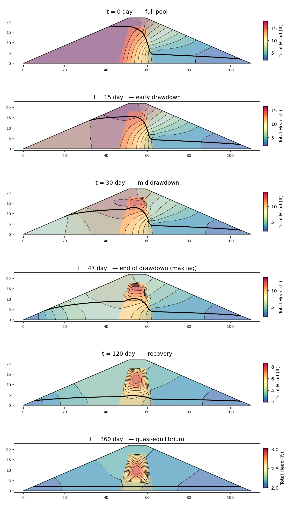
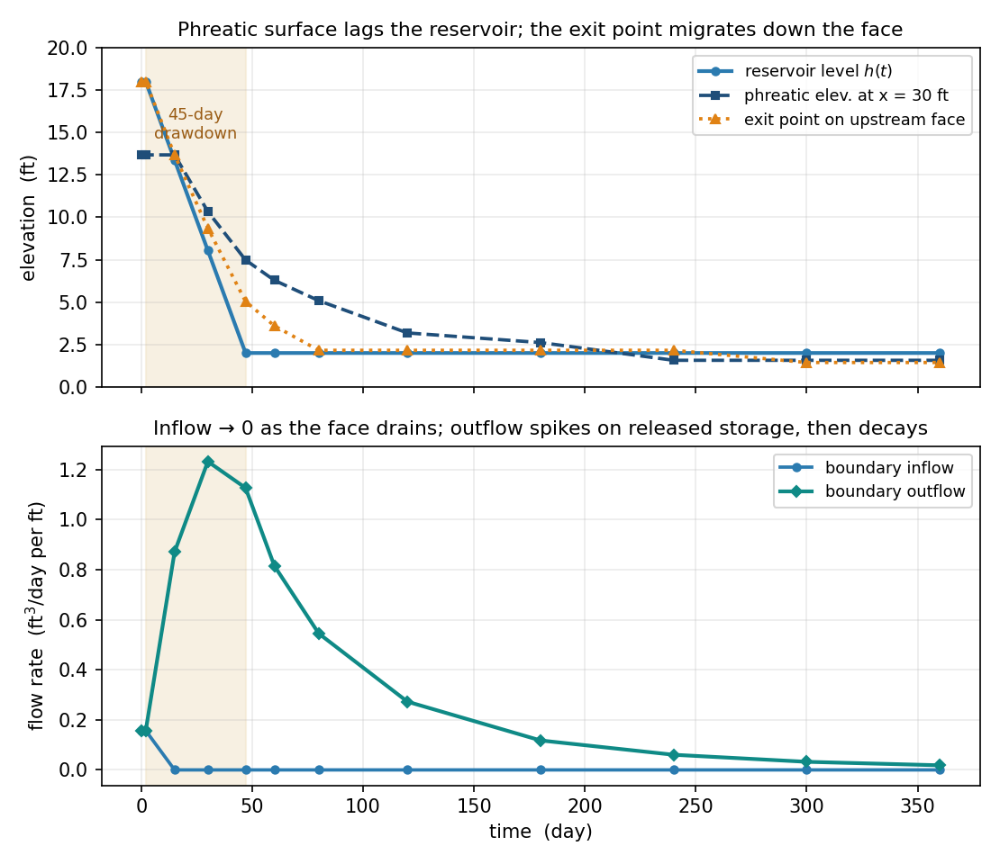

# Sample Problems - Seepage Analysis

> **Verification benchmarks** (the analytical anchors and the SEEP2D cross-check) are documented on the [seepage verification page](../verification/seep.md).

The following examples illustrate how to use XSLOPE to perform seepage analysis. The problems feature both saturated and unsaturated conditions. Each of the Excel input files below can be used with the following notebook which has been set up specifically for running seepage analyses:

These problems feature standalone seepage analyses. For instructions on how to run an integrated seepage analysis with slope stability analysis, see the [Integrated Seepage and Slope Stability Analysis](seep_slope.md) page.

### 1. Sheetpile with Clay Blanket

This is a saturated problem with a partially penetrating sheetpile and a clay blanket. It should have an upstream head BC = 13m up 
to the tip of the blanket and a downstream head BC = 10m. The profile line should follow the edge of the sheetpile (down 
and then back up) with a small gap to ensure that there is a crack in the resulting mesh. 

The following Excel file illustrates how the inputs should be structured. Since this is a fully saturated problem, 
the kr0 and h0 material parameters are ignored. 

Excel input file: [xslope_clay_blanket.xlsx](files/xslope_clay_blanket.xlsx)

The solution should look something like this:

{width=1200px}

<!-- test: file=files/xslope_clay_blanket.xlsx, type=seep, expected_flowrate=40.062, tolerance=0.05 -->
<!-- Element-type coverage (saturated/confined): solve with tri3, tri6, quad4, quad8, quad9. -->
<!-- test: file=files/xslope_clay_blanket.xlsx, type=seep_elements, expected_flowrate=40.062, tolerance=0.05, target_size=1.5 -->

### 2. Sea Trench

This is another saturated problem representing the excavation of a trench in a harbor supported by a parallel set of sheetpile walls. The sheetpiles pass through an upper silt layer down to a lower permeability silty clay layer.

The properties of the soil layers are as follows:

| Soil Layer | K1  | K2  |
|:----------:|:---:|:---:|
|    Silt    | 0.5 | 0.5 |
| Silty Clay | 0.1 | 0.1 |

Since this is a fully saturated problem, the kr0 and h0 material parameters are ignored. The problem set up requires 3 profile lines: 1 at the top of the silt layer on the left side, 1 at the top of the silt layer on the right, and 1 at the top of the silty clay layer that goes all the way from the left side to the right side of the problem. This profile line includes a small gap at the location of each sheetpile penetration to create a no-flow boundary along the edge of the sheetpile. The following Excel file illustrates how the inputs should be structured.

Excel input file: [xslope_sea_trench.xlsx](files/xslope_sea_trench.xlsx)

Solution:

{width=1000px}

<!-- test: file=files/xslope_sea_trench.xlsx, type=seep, expected_flowrate=4.347, tolerance=0.05 -->

### 3. Earth Dam with Core

The following diagram illustrates a simple earth dam with a clay core and a granular shell:

This problem requires an upstream head BC, a small downstream head BC, and a downstream exit face BC from the crest 
of the dam down to the tailwater. The conductivities used in the input file are: shell k1 = 56, k2 = 18; core k1 = 4.5, k2 = 1.8 (ft/yr — the sketch's "46 m/yr" shell label is superseded by these values). To build the input file, the following list of coordinates can be used:

In this case, the solution is partially saturated, so the kr0 and h0 parameters must be specified for each material. 
The following Excel file contains a complete set of inputs for this problem:

[xslope_earth_dam1.xlsx](files/xslope_earth_dam1.xlsx)

The solution should look something like this:

{width=1200px}

<!-- test: file=files/xslope_earth_dam1.xlsx, type=seep, expected_flowrate=42.44, tolerance=0.05 -->
<!-- Element-type coverage (unsaturated/unconfined, linear-front): tri3, tri6, quad4, quad8, quad9. -->
<!-- test: file=files/xslope_earth_dam1.xlsx, type=seep_elements, expected_flowrate=42.44, tolerance=0.05, target_size=2.0 -->

### 4. Earth Dam with Core — van Genuchten Unsaturated Model

This is the same earth dam as [Problem 3](#3-earth-dam-with-core) — identical geometry, conductivities, and boundary conditions — but the unsaturated zone is modeled with the **van Genuchten** relative-conductivity function (`unsat = "vg"`) rather than the linear front. Only the per-material unsaturated parameters change: the `a` column (van Genuchten α) and the `n` column, set to representative values for the shell (sandy loam) and core (loam), converted to the model's length unit (1/ft). See the [van Genuchten Model](overview.md#van-genuchten-model) section for the typical-value table and the unit convention for α.

[xslope_earth_dam1_vg.xlsx](files/xslope_earth_dam1_vg.xlsx)

The solution should look something like this:

{width=1200px}

The computed flow rate (≈40.4) is close to the linear-front result of Problem 3 (≈42.4): with both models calibrated to the same soils, the unsaturated conductivity curve has little influence on the through-flow — consistent with the modeling guidance in the [seepage overview](overview.md#unsaturated-flow-formulation).

<!-- test: file=files/xslope_earth_dam1_vg.xlsx, type=seep, expected_flowrate=40.37, tolerance=0.05 -->

### 5. Johnson Reservoir {#johnson-reservoir}

This is another earth dam problem with a shell, a core, and a foundation. 

In this case, there is an upstream head BC = 160 ft and a downstream head BC = 100 ft on the flat part of the 
downstream foundation. The entire back side of the dam is an exit face BC. Again, this is a partially saturated problem.

The following file illustrates how to prepare the inputs:

[xslope_johnson_res.xlsx](files/xslope_johnson_res.xlsx)

The solution should look something like this:

{width=1200px}

**Verification — SEEP2D cross-check.** This problem doubles as a verification
benchmark against an established code: it was exported to a SEEP2D input file
with the **exact same tri3 mesh topology, boundary conditions, and material
parameters** (`benchmarks/run_seep2d_compare.py`) and solved with the original
USACE/WES SEEP2D Fortran program (Tracy, USACE Waterways Experiment Station).
Identical-mesh comparison over all 2,604 nodes:

| Quantity | XSLOPE | SEEP2D | Diff |
|---|---|---|---|
| Total discharge q (ft³/day per ft) | 1.9575 | 1.9603 | -0.14% |
| Nodal heads | RMS Δh = 0.105 ft | (60-ft head range) | 0.18% |

The largest local head difference (~2 ft) occurs adjacent to the free surface,
where the two codes' unsaturated relative-permeability treatments differ in
detail; the bulk flow field agrees to about 0.1 ft. See the
[Verification](../verification/seep.md) page.

<!-- test: file=files/xslope_johnson_res.xlsx, type=seep, expected_flowrate=1.958, tolerance=0.05, benchmark=SEEP-2 -->

### 6. Earth Dam with Core and Filter

This problem has the following cross-section:

In this case, there is a single upstream head BC = 60ft and the entire backside of the dam is an exit face BC. 

The following Excel file contains the problem inputs:

[xslope_earth_dam2.xlsx](files/xslope_earth_dam2.xlsx)

The solution should look something like this:

{width=1200px}

<!-- test: file=files/xslope_earth_dam2.xlsx, type=seep, expected_flowrate=1.275, tolerance=0.05 -->

### 7. Levee with Grouted Foundation

The following problem represents a levee underlain by a foundation with a grout curtain. 

The material properties of the soil layers are as follows:

|  Soil Layer   | K1 [m/day] | K2 [m/day] | $\alpha$   | kr0    | h0 |
|:-------------:|:----------:|:----------:|:----------:|:----------:|:----------:|
|     Levee     |    0.5     |    0.2     |    0       |   0.001 | -1 |
| Grout Curtain |    0.2     |    0.2     |    0       |   0.001 | -1 |
|  Foundation   |     2      |     1      |    0       |   0.001 | -1 |

The coordinate geometry is shown here (the foundation spans elevations 0 to 10, and the
grout curtain extends the full foundation depth — the coordinates labeled along the bottom
edge are at elevation 0):

The following file illustrates how to prepare the inputs. Unlike the other
samples, this one defines the geometry with the **`polygon` sheet** — each
material zone (levee, grout curtain, foundation) is entered as a closed polygon
rather than as profile lines:

[xslope_levee_poly.xlsx](files/xslope_levee_poly.xlsx)

Inputs plotted with the XSLOPE plot_inputs() function:

{width=1200px}

!!! note
    The finite-element mesh is shown overlaid on the material zones above because
    this model has already been run — the mesh is generated during the seepage
    solve and stored with the model. `plot_inputs()` draws the mesh whenever one is
    present; for a model that has not yet been meshed, only the polygon geometry is
    shown.

Solution:

{width=1200px}

<!-- test: file=files/xslope_levee_poly.xlsx, type=seep, expected_flowrate=1.431, tolerance=0.05 -->

### 8. Earth Dam — Reservoir Drawdown (Transient)

This is a **transient** seepage problem: the earth dam of [Problem 3](#3-earth-dam-with-core) —
the same cross-section, the same shell and clay core — with its upstream reservoir **drawn down**
and the pore-pressure field followed through time. Where the steady problems above answer *what does
the flow field settle to?*, this one answers *what does it look like while it is still changing?* —
the question a [rapid-drawdown](../lem/rapid.md) stability check depends on. The full formulation
(storage, the theta time-stepper, the boundary types, and the coupling to rapid drawdown) is
described on the [Transient Seepage](transient.md) page; this entry is a worked example.

**What makes it transient.** Two things are added to the steady model, both documented on the
[template's tseep sheet](../usage/input_template.md#worksheet-tseep):

- **Storage properties** on the `mat` sheet. Each material carries a specific storage `Ss` and a
  specific yield `Sy` (see the [storage tables](transient.md#storage)): shell (sand)
  `Ss = 1e-4` /ft, `Sy = 0.22`; core (clay) `Ss = 1e-3` /ft, `Sy = 0.03`. With the linear-front
  law the drainable-band storage is about `Sy`, so the water table drains at the unconfined rate
  `k/Sy`.
- A **tseep sheet** carrying the reservoir schedule and run controls. The upstream boundary is
  retyped from a fixed head to a submerged-only **`reservoir`** boundary (see
  [head types](transient.md#head-types-head-and-reservoir)) bound to a `pool` series: the pool is
  held at the crest level (el 18) briefly, drawn down to the tailwater datum (el 2) over **45 days**,
  then held. The run lasts **360 days** — long enough that the field reaches quasi-equilibrium (by
  the end the boundary outflow has decayed to about 1.5% of its drawdown peak). Twelve frames are
  saved, and the `stage_1` (full pool, t = 0) / `stage_2` (end of drawdown, t = 47) pair marks the
  critical states a rapid-drawdown analysis would draw on.

Because a **day** time base is declared, the conductivities are given in **ft/day** (the storage
march balances against `div(k grad h)`, so `k` must share the schedule's time unit): shell
`k1 = 0.75`, `k2 = 0.25`; core `k1 = 0.012`, `k2 = 0.005` — a fine-sand shell over a much less
permeable compacted-clay core.

[xslope_earth_dam_tseep.xlsx](files/xslope_earth_dam_tseep.xlsx)

Solving this model writes the per-frame results to a `{base}_tseep.csv` sidecar (with a
`{base}_tseep_meta.json` ledger); each saved frame is a full flow-net solution that plots exactly
like a steady one. The time-stamped series looks like this:

{width=760px}

**What to observe:**

- **The phreatic surface lags the reservoir.** At the end of the 45-day drawdown (t = 47) the pool
  is already at el 2, but the interior water table is still perched high — the shell cannot drain as
  fast as the pool falls. This lag is the pore pressure a rapid-drawdown check must account for.
- **The exit point migrates down the upstream face.** As the level falls, face nodes the water
  leaves behind convert from held reservoir head to a free-draining exit face, and the point where
  the phreatic surface meets the face walks down the slope, trailing the pool.
- **The low-permeability core holds its pressure.** As the core desaturates its relative
  conductivity collapses, so it drains far slower than the shell and retains an elevated total-head
  pocket long after the shell has emptied — the zoned-dam reason rapid drawdown is hazardous.
- **The field approaches a new steady state.** By the late frames the water table has settled to a
  low mound between the drawn-down pool and the tailwater, nearly stationary.

The history plot summarizes the same run — the phreatic and exit-point lag (top), and the boundary
flows (bottom). Note that **inflow and outflow differ**: once the upstream face becomes an exit face
the inflow falls to zero, while the outflow spikes on the water released from storage and then
decays as the dam empties. This difference *is* the storage change — a single steady "total
flowrate" no longer applies (see [Per-frame flow net](transient.md#outputs)).

{width=720px}

---

The remaining problems are **verification benchmarks**: analytically-anchored
cases used to validate the seepage implementation. Each is locked into the
automated regression suite. See also the [Verification](../verification/index.md) page.
