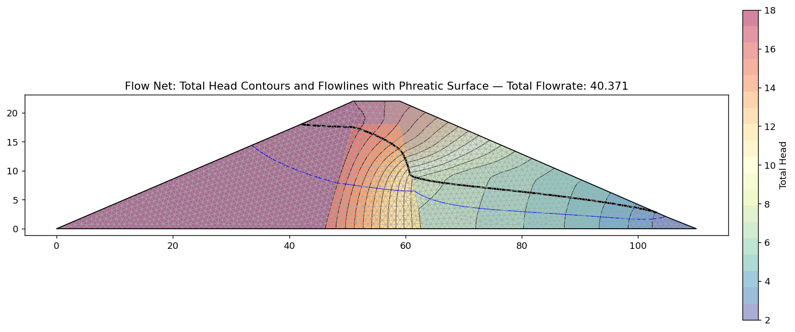
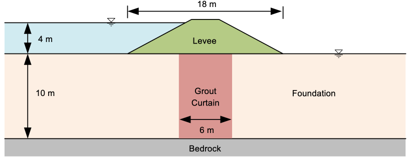
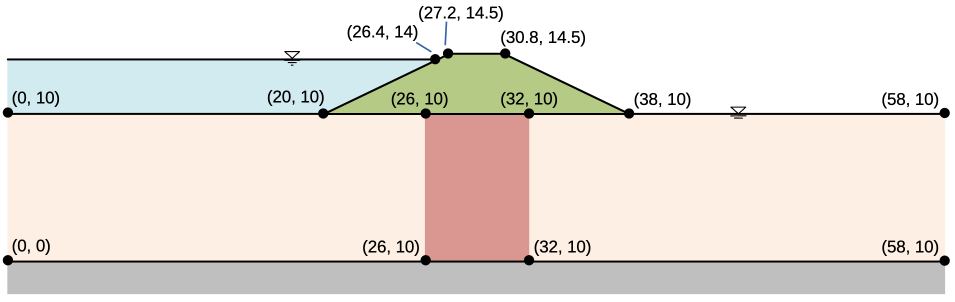
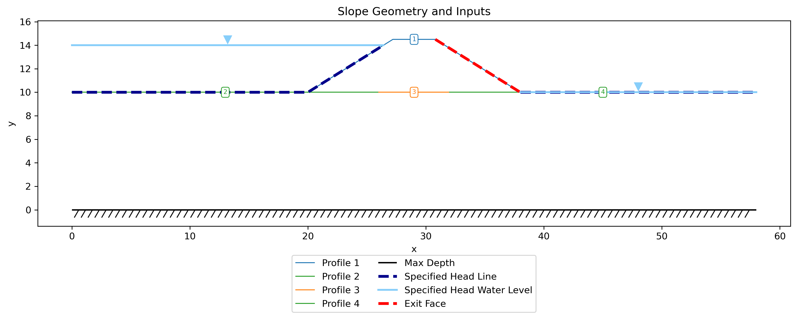
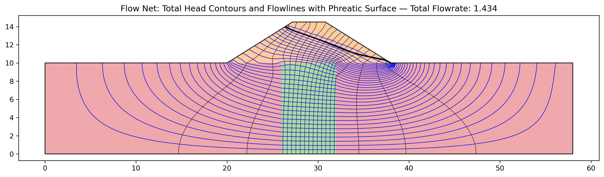

# Sample Problems - Seepage Analysis

The following examples illustrate how to use XSLOPE to perform seepage analysis. The problems feature both saturated and unsaturated conditions. Each of the Excel input files below can be used with the following notebook which has been set up specifically for running seepage analyses:

These problems feature standalone seepage analyses. For instructions on how to run an integrated seepage analysis with slope stability analysis, see the [Integrated Seepage and Slope Stability Analysis](seep_slope.md) page.

### 1. Sheetpile with Clay Blanket

This is a saturated problem with a partially penetrating sheetpile and a clay blanket. It should have an upstream head BC = 13m up 
to the tip of the blanket and a downstream head BC = 10m. The profile line should follow the edge of the sheetpile (down 
and then back up) with a small gap to ensure that there is a crack in the resulting mesh. 

The following Excel file illustrates how the inputs should be structured. Since this is a fully saturated problem, 
the kr0 and h0 material parameters are ignored. 

Excel input file: [xslope_clay_blanket.xlsx](files/xslope_clay_blanket.xlsx)

The solution should look something like this:

{width=1200px}

<!-- test: file=files/xslope_clay_blanket.xlsx, type=seep, expected_flowrate=40.062, tolerance=0.05 -->

### 2. Sea Trench

This is another saturated problem representing the excavation of a trench in a harbor supported by a parallel set of sheetpile walls. The sheetpiles pass through an upper silt layer down to a lower permeability silty clay layer.

The properties of the soil layers are as follows:

| Soil Layer | K1  | K2  |
|:----------:|:---:|:---:|
|    Silt    | 0.5 | 0.5 |
| Silty Clay | 0.1 | 0.1 |

Since this is a fully saturated problem, the kr0 and h0 material parameters are ignored. The problem set up requires 3 profile lines: 1 at the top of the silt layer on the left side, 1 at the top of the silt layer on the right, and 1 at the top of the silty clay layer that goes all the way from the left side to the right side of the problem. This profile line includes a small gap at the location of each sheetpile penetration to create a no-flow boundary along the edge of the sheetpile. The following Excel file illustrates how the inputs should be structured.

Excel input file: [xslope_sea_trench.xlsx](files/xslope_sea_trench.xlsx)

Solution:

{width=1000px}

<!-- test: file=files/xslope_sea_trench.xlsx, type=seep, expected_flowrate=4.347, tolerance=0.05 -->

### 3. Earth Dam with Core

The following diagram illustrates a simple earth dam with a clay core and a granular shell:

This problem requires an upstream head BC, a small downstream head BC, and a downstream exit face BC from the crest 
of the dam down to the tailwater. To build the input file, the following list of coordinates can be used:

In this case, the solution is partially saturated, so the kr0 and h0 parameters must be specified for each material. 
The following Excel file contains a complete set of inputs for this problem:

[xslope_earth_dam1.xlsx](files/xslope_earth_dam1.xlsx)

The solution should look something like this:

{width=1200px}

<!-- test: file=files/xslope_earth_dam1.xlsx, type=seep, expected_flowrate=42.44, tolerance=0.05 -->

### 4. Earth Dam with Core — van Genuchten Unsaturated Model

This is the same earth dam as [Problem 3](#3-earth-dam-with-core) — identical geometry, conductivities, and boundary conditions — but the unsaturated zone is modeled with the **van Genuchten** relative-conductivity function (`unsat = "vg"`) rather than the linear front. Only the per-material unsaturated parameters change: `vg_a` (van Genuchten α) and `vg_n` (n), set to representative values for the shell (sandy loam) and core (loam), converted to the model's length unit (1/ft). See the [van Genuchten Model](overview.md#van-genuchten-model) section for the typical-value table and the unit convention for α.

[xslope_earth_dam1_vg.xlsx](files/xslope_earth_dam1_vg.xlsx)

The solution should look something like this:

{width=1200px}

The computed flow rate (≈40.4) is close to the linear-front result of Problem 3 (≈42.4): with both models calibrated to the same soils, the unsaturated conductivity curve has little influence on the through-flow — consistent with the modeling guidance in the [seepage overview](overview.md#unsaturated-flow-formulation).

<!-- test: file=files/xslope_earth_dam1_vg.xlsx, type=seep, expected_flowrate=40.37, tolerance=0.05 -->

### 5. Johnson Reservoir {#johnson-reservoir}

This is another earth dam problem with a shell, a core, and a foundation. 

In this case, there is an upstream head BC = 160 ft and a downstream head BC = 100 ft on the flat part of the 
downstream foundation. The entire back side of the dam is an exit face BC. Again, this is a partially saturated problem.

The following file illustrates how to prepare the inputs:

[xslope_johnson_res.xlsx](files/xslope_johnson_res.xlsx)

The solution should look something like this:

{width=1200px}

**Verification — SEEP2D cross-check.** This problem doubles as a verification
benchmark against an established code: it was exported to a SEEP2D input file
with the **exact same tri3 mesh topology, boundary conditions, and material
parameters** (`benchmarks/run_seep2d_compare.py`) and solved with the original
USACE/WES SEEP2D Fortran program (Tracy, USACE Waterways Experiment Station).
Identical-mesh comparison over all 2,604 nodes:

| Quantity | XSLOPE | SEEP2D | Diff |
|---|---|---|---|
| Total discharge q (ft³/day per ft) | 1.9575 | 1.9603 | -0.14% |
| Nodal heads | RMS Δh = 0.105 ft | (60-ft head range) | 0.18% |

The largest local head difference (~2 ft) occurs adjacent to the free surface,
where the two codes' unsaturated relative-permeability treatments differ in
detail; the bulk flow field agrees to about 0.1 ft. See the
[Verification](../verification.md#finite-element-seepage) page.

<!-- test: file=files/xslope_johnson_res.xlsx, type=seep, expected_flowrate=1.958, tolerance=0.05, benchmark=SEEP-2 -->

### 6. Earth Dam with Core and Filter

This problem has the following cross-section:

In this case, there is a single upstream head BC = 60ft and the entire backside of the dam is an exit face BC. 

The following Excel file contains the problem inputs:

[xslope_earth_dam2.xlsx](files/xslope_earth_dam2.xlsx)

The solution should look something like this:

{width=1200px}

<!-- test: file=files/xslope_earth_dam2.xlsx, type=seep, expected_flowrate=1.275, tolerance=0.05 -->

### 7. Levee with Grouted Foundation

The following problem represents a levee underlain by a foundation with a grout curtain. 

The material properties of the soil layers are as follows:

|  Soil Layer   | K1 [m/day] | K2 [m/day] | $\alpha$   | kr0    | h0 |
|:-------------:|:----------:|:----------:|:----------:|:----------:|:----------:|
|     Levee     |    0.5     |    0.2     |    0       |   0.001 | -1 |
| Grout Curtain |    0.2     |    0.2     |    0       |   0.001 | -1 |
|  Foundation   |     2      |     1      |    0       |   0.001 | -1 |

The coordinate geometry is shown here:

The following file illustrates how to prepare the inputs. Unlike the other
samples, this one defines the geometry with the **`polygon` sheet** — each
material zone (levee, grout curtain, foundation) is entered as a closed polygon
rather than as profile lines:

[xslope_levee_poly.xlsx](files/xslope_levee_poly.xlsx)

Inputs plotted with the XSLOPE plot_inputs() function:

{width=1200px}

!!! note
    The finite-element mesh is shown overlaid on the material zones above because
    this model has already been run — the mesh is generated during the seepage
    solve and stored with the model. `plot_inputs()` draws the mesh whenever one is
    present; for a model that has not yet been meshed, only the polygon geometry is
    shown.

Solution:

{width=1200px}

<!-- test: file=files/xslope_levee_poly.xlsx, type=seep, expected_flowrate=1.431, tolerance=0.05 -->

---

The remaining problems are **verification benchmarks**: analytically-anchored
cases used to validate the seepage implementation. Each is locked into the
automated regression suite. See also the [Verification](../verification.md) page.

### 8. Verification: Confined Radial Flow {#verification-confined-radial}

A quarter-annulus confined flow problem: inner arc (r = 10) at head 30, outer arc
(r = 30) at head 10, straight radial edges as no-flow streamlines. This is best read
as a **plan-view** model — it is one quadrant of the classic Thiem problem of radial
flow to a well in a confined aquifer, not a vertical cross-section. Confined,
fully saturated flow is governed by Laplace's equation in total head alone, with no
gravity term, so the orientation of the model plane is mathematically irrelevant —
which is exactly what makes this a clean test of the FE Laplacian operator,
conductivity handling, and discharge integration. Steady flow has the exact solution
`q = k*(pi/2)*(h1-h2)/ln(r2/r1) = 28.596` (k = 1) and a logarithmic head profile.
Built via the **polygon** input by `benchmarks/build_seep.py::build_confined_radial`;
this is the analytical anchor for the seepage verification suite.

[xslope_confined_radial.xlsx](files/xslope_confined_radial.xlsx)

{width=800}

Results against the exact solution:

| Quantity | XSLOPE (tri6) | Exact | Diff |
|---|---|---|---|
| Discharge q | 28.5961 | 28.5960 | <0.01% |
| Max nodal head error | 0.004 | 0 | 0.02% of total drop |

The result is mesh-converged (identical at 2k and 6k nodes; quad8 gives the
same value), and tri3 linear elements agree to +0.01%. The only error source
is faceting of the curved arcs by the polygon boundary. See the
[Verification](../verification.md#finite-element-seepage) page.

**Source:** standard exact solution of Laplace's equation in polar coordinates
(e.g. Bear, *Dynamics of Fluids in Porous Media*).

<!-- test: file=files/xslope_confined_radial.xlsx, type=seep, expected_flowrate=28.596, element_type=tri6, target_size=2.0, tolerance=0.01, benchmark=SEEP-1 -->

### 9. Verification: Partially Penetrating Sheetpile {#verification-sheetpile}

A single sheetpile cutoff of depth s = 10 in a homogeneous confined stratum of
thickness T = 20, head loss H = 10 across the wall, k = 1. The boundary heads
are 30 upstream and 20 downstream: the downstream head equals the stratum top,
so the section is physically consistent as a vertical cross-section (pressure
is non-negative everywhere, with 10 units of ponded water upstream); only the
difference H = 10 enters the confined solution. Pavlovsky's exact
conformal-mapping solution gives `q = k*H*K(lam')/(2*K(lam))` with
`lam = sin(pi*s/(2T))`; at s/T = 1/2 the modulus is self-dual so **q = k*H/2 = 5.0
exactly**. A second exact check: the head on the wall plane below the tip is
exactly (H1+H2)/2 by antisymmetry. The wall uses the same V-notch crack idiom as
the clay-blanket sample. Built by `benchmarks/build_seep.py::build_sheetpile`
(s/T = 0.75 companion file also available, exact q = 3.4032).

[xslope_sheetpile_s50.xlsx](files/xslope_sheetpile_s50.xlsx)

The flow net (head contours and flowlines) for the s/T = 0.5 case:

{width=1100}

Results against the exact form factor (tri6, two mesh densities):

| Case | XSLOPE q | Exact q | Diff | Head below wall tip |
|---|---|---|---|---|
| s/T = 0.50 (59k nodes) | 5.010 | 5.000 | +0.20% | 25.0000 (exact: 25) |
| s/T = 0.75 (59k nodes) | 3.412 | 3.403 | +0.27% | 25.0000 (exact: 25) |

The error halves with mesh refinement (set by the r^-1/2 singularity at the
wall tip) and converges to the exact value from above. The head on the wall
plane below the tip equals (h1+h2)/2 exactly — an antisymmetry property of the
exact solution that the FE solution reproduces to four decimals. The
Pavlovsky form factor itself was additionally confirmed by an independent
finite-difference solution of the same boundary-value problem (~0.4-0.5%
agreement at three penetration ratios). See the
[Verification](../verification.md#finite-element-seepage) page.

**Sources:** Harr, M.E. (1962), *Groundwater and Seepage*, McGraw-Hill;
Polubarinova-Kochina, P.Ya. (1962), *Theory of Ground Water Movement*,
Princeton University Press.

<!-- test: file=files/xslope_sheetpile_s50.xlsx, type=seep, expected_flowrate=5.0, element_type=tri6, target_size=1.0, tolerance=0.01, benchmark=SEEP-1c -->