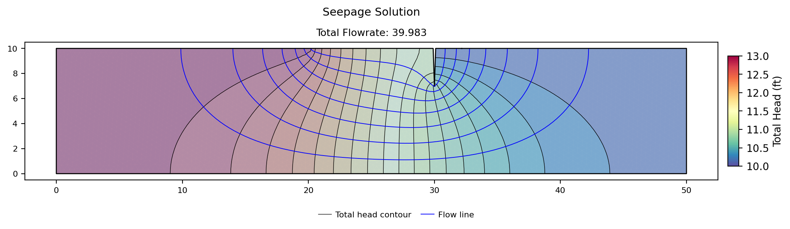
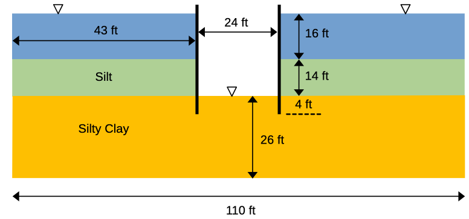
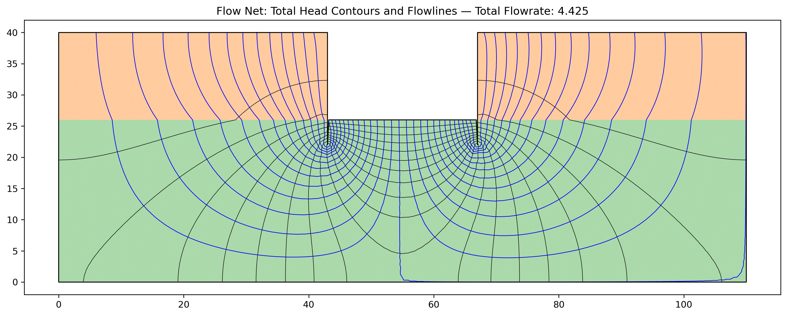
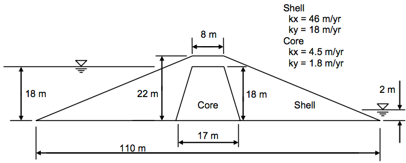
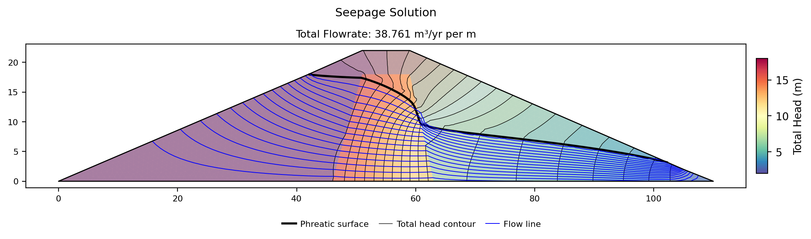
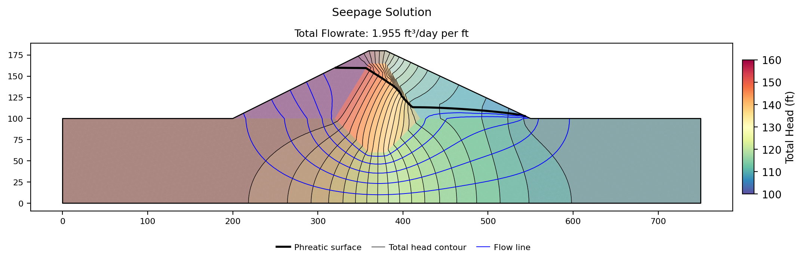
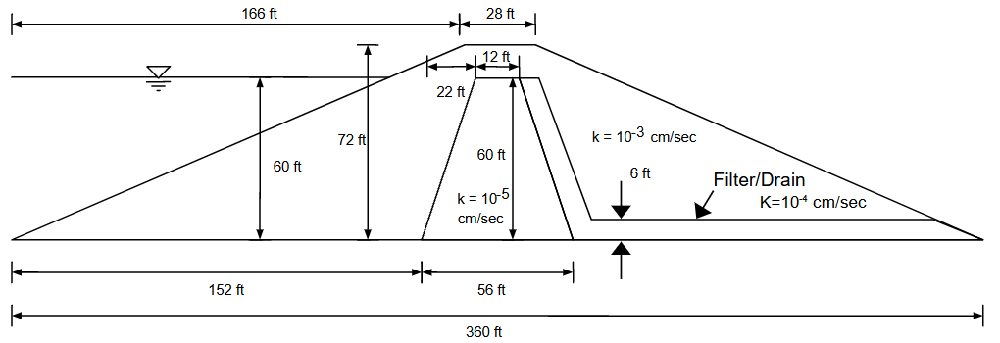
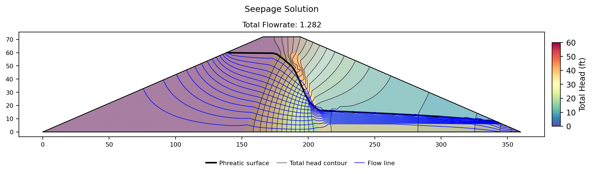

# Sample Problems - Seepage Analysis

The following examples illustrate how to use XSLOPE to perform seepage analysis. The problems feature both saturated and unsaturated conditions. Each of the Excel input files below can be used with the following notebook which has been set up specifically for running seepage analyses:

These problems feature standalone seepage analyses. For instructions on to run an integrated seepage analysis with slope stability analysis, see the [Integrated Seeapage and Slope Stability Analysis](seep_slope.md) page.

### 1. Sheetpile with Clay Blanket

This is a saturated problem with a partially penetrating sheetpile and a clay blanket. It should have an upstream head BC = 13m up 
to the tip of the blanket and a downstream head BC = 10m. The profile line should follow the edge of the sheetpile (down 
and then back up) with a small gap to ensure that there is a crack in the resulting mesh. 

The following Excel file illustrates how the inputs should be structured. Since this is a fully saturated problem, 
the kr0 and h0 material parameters are ignored. 

Excel input file: [xslope_clay_blanket.xlsx](files/xslope_clay_blanket.xlsx)

The solution should look something like this:

{width=1200px}

### 2. Sea Trench

This is another saturated problem representing the excavation of a trench in a harbor supported by a parallel set of sheetpile walls. The sheetpiles pass through an upper silt layer down to a lower permeability silty clay layer.

The properties of the soil layers are as follows:

| Soil Layer | K1  | K2  |
|:----------:|:---:|:---:|
|    Silt    | 0.5 | 0.5 |
| Silty Clay | 0.1 | 0.1 |

Since this is a fully saturated problem, the kr0 and h0 material parameters are ignored. The problem set up requires 3 profile lines: 1 at the top of the silt layer on the left side, 1 at the top of the silt layer on the right, and 1 at the top of the silty clay layer that goes all the way from the left side to the right side of the problem. This profile line includes a small gap at the location of each sheetpile penetration to create a no-flow boundary along the edge of the sheetpile. The following Excel file illustrates how the inputs should be structured.

Excel input file: [xslope_sea_trench.xlsx](files/xslope_sea_trench.xlsx)

Solution:

{width=1000px}

### 3. Earth Dam with Core

The following diagram illustrates a simple earth dam with a clay core and a granular shell:

This problem requires an upstream head BC, a small downstream head BC, and a downstream exit face BC from the crest 
of the dam down to the tailwater. To build the input file, the following list of coordinates can be used:

In this case, the solution is partially saturated, so the kr0 and h0 parameters must be specfied for each material. 
The following Excel file contains a complete set of inputs for this problem:

[xslope_earth_dam1.xlsx](files/xslope_earth_dam1.xlsx)

The solution should look something like this:

{width=1200px}

### 4. Johnson Reservoir

This is another earth dam problem with a shell, a core, and a foundation. 

In this case, there is an upstream head BC = 160 ft and a downstream head BC = 100 ft on the flat part of the 
downstream foundation. The entire back side of the dam is an exit face BC. Again, this is a partially saturated problem.

The following file illustrates how to prepare the inputs:

[xslope_johnson_res.xlsx](files/xslope_johnson_res.xlsx)

The solution should look something like this:

{width=1200px}

### 5. Earth Dam with Core and Filter

This problem has the following cross-section:

In this case, there is a single upstream head BC = 60ft and the entire backside of the dam is an exit face BC. 

The following Excel file contains the problem inputs:

[xslope_earth_dam2.xlsx](files/xslope_earth_dam2.xlsx)

The solution should look something like this:

{width=1200px}