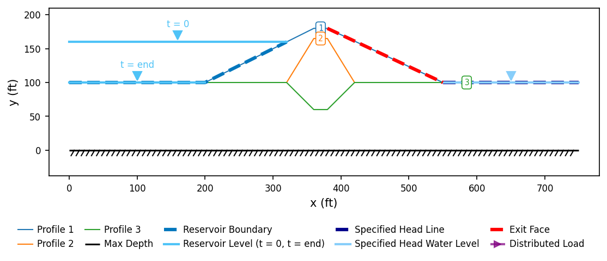
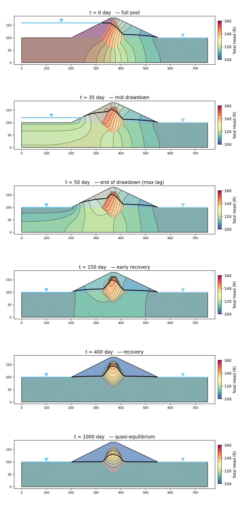
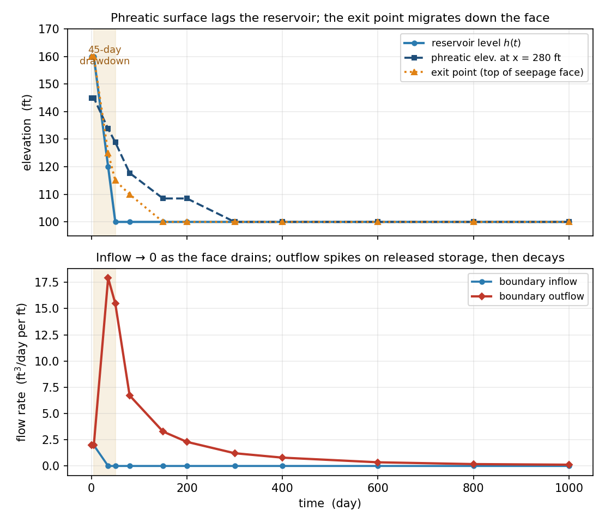

# Sample Problems - Seepage Analysis

> **Verification benchmarks** (the analytical anchors and the SEEP2D cross-check) are documented on the [seepage verification page](../verification/seep.md).

The following examples illustrate how to use XSLOPE to perform seepage analysis. The problems feature both saturated and unsaturated conditions. Each of the Excel input files below can be used with the following notebook which has been set up specifically for running seepage analyses:

These problems feature standalone seepage analyses. For instructions on how to run an integrated seepage analysis with slope stability analysis, see the [Integrated Seepage and Slope Stability Analysis](seep_slope.md) page.

### 1. Sheetpile with Clay Blanket

Built and run step by step in [SEEP-1](../tutorials/seep01_sheetpile.md).

Excel input file: [xslope_clay_blanket.xlsx](files/xslope_clay_blanket.xlsx)

{width=1200px}

<!-- test: file=files/xslope_clay_blanket.xlsx, type=seep, expected_flowrate=39.983, tolerance=0.05 -->
<!-- Element-type coverage (saturated/confined): solve with tri3, tri6, quad4, quad8, quad9. -->
<!-- test: file=files/xslope_clay_blanket.xlsx, type=seep_elements, expected_flowrate=39.983, tolerance=0.05, target_size=1.5 -->

### 2. Sea Trench

This is another saturated problem representing the excavation of a trench in a harbor supported by a parallel set of sheetpile walls. The sheetpiles pass through an upper silt layer down to a lower permeability silty clay layer.

The properties of the soil layers are as follows:

| Soil Layer | K1  | K2  |
|:----------:|:---:|:---:|
|    Silt    | 0.5 | 0.5 |
| Silty Clay | 0.1 | 0.1 |

Since this is a fully saturated problem, the kr0 and h0 material parameters are ignored. The problem set up requires 3 profile lines: 1 at the top of the silt layer on the left side, 1 at the top of the silt layer on the right, and 1 at the top of the silty clay layer that goes all the way from the left side to the right side of the problem. This profile line includes a small gap at the location of each sheetpile penetration to create a no-flow boundary along the edge of the sheetpile. The following Excel file illustrates how the inputs should be structured.

Excel input file: [xslope_sea_trench.xlsx](files/xslope_sea_trench.xlsx)

Solution:

{width=1000px}

<!-- test: file=files/xslope_sea_trench.xlsx, type=seep, expected_flowrate=4.283, tolerance=0.05 -->

### 3. Earth Dam with Core

The following diagram illustrates a simple earth dam with a clay core and a granular shell:

The dam is 22 m high and 110 m long at the base, with an 18 m pool upstream and 2 m of tailwater downstream.
This problem requires an upstream head BC, a small downstream head BC, and a downstream exit face BC from the crest 
of the dam down to the tailwater. The conductivities used in the input file are the sketch's: shell k1 = 46, k2 = 18; core k1 = 4.5, k2 = 1.8, all in m/yr. To build the input file, the following list of coordinates can be used:

In this case, the solution is partially saturated, so the kr0 and h0 parameters must be specified for each material. 
The following Excel file contains a complete set of inputs for this problem:

[xslope_earth_dam1.xlsx](files/xslope_earth_dam1.xlsx)

The solution should look something like this:

{width=1200px}

<!-- test: file=files/xslope_earth_dam1.xlsx, type=seep, expected_flowrate=38.761, tolerance=0.05 -->
<!-- Element-type coverage (unsaturated/unconfined, linear-front): tri3, tri6, quad4, quad8, quad9. -->
<!-- The linear front spans |h0| = 0.3 m, so the element size has to resolve it: at a 2 m -->
<!-- target the quad8 solve stalls on the unresolved front. 0.6 m is two elements across it -->
<!-- and all five types converge to within 0.3% of each other. -->
<!-- test: file=files/xslope_earth_dam1.xlsx, type=seep_elements, expected_flowrate=38.754, tolerance=0.05, target_size=0.6 -->

### 4. Earth Dam with Core — van Genuchten Unsaturated Model

This is the same earth dam as [Problem 3](#3-earth-dam-with-core) — identical geometry, conductivities, and boundary conditions — but the unsaturated zone is modeled with the **van Genuchten** relative-conductivity function (`unsat = "vg"`) rather than the linear front. Only the per-material unsaturated parameters change: the `a` column (van Genuchten α) and the `n` column, set to representative values for the shell (sandy loam, α = 0.075 /cm) and core (loam, α = 0.036 /cm), converted to the model's length unit — α = 7.5 /m and 3.6 /m. See the [van Genuchten Model](overview.md#van-genuchten-model) section for the typical-value table and the unit convention for α.

[xslope_earth_dam1_vg.xlsx](files/xslope_earth_dam1_vg.xlsx)

The solution should look something like this:

{width=1200px}

The computed flow rate (≈37.8 m³/yr per m) is within 3% of the linear-front result of Problem 3 (≈38.8): with both models calibrated to the same soils, the unsaturated conductivity curve has little influence on the through-flow — consistent with the modeling guidance in the [seepage overview](overview.md#unsaturated-flow-formulation).

<!-- test: file=files/xslope_earth_dam1_vg.xlsx, type=seep, expected_flowrate=37.848, tolerance=0.05 -->

### 5. Johnson Reservoir {#johnson-reservoir}

Built and run step by step in [SEEP-2](../tutorials/seep02_johnson_dam.md).

Excel input file: [xslope_johnson_res.xlsx](files/xslope_johnson_res.xlsx)

{width=1200px}

**Verification — SEEP2D cross-check.** This problem doubles as a verification
benchmark against an established code: it was exported to a SEEP2D input file
with the **exact same tri3 mesh topology, boundary conditions, and material
parameters** (`benchmarks/run_seep2d_compare.py`) and solved with the original
USACE/WES SEEP2D Fortran program (Tracy, USACE Waterways Experiment Station).
Identical-mesh comparison over all 2,913 nodes:

| Quantity | XSLOPE | SEEP2D | Diff |
|---|---|---|---|
| Total discharge q (ft³/day per ft) | 1.9546 | 1.9544 | +0.01% |
| Nodal heads | RMS Δh = 0.037 ft | (60-ft head range) | 0.06% |

The largest local head difference (0.56 ft) occurs adjacent to the free surface,
where the two codes' unsaturated relative-permeability treatments differ in
detail. Both codes release the free surface from the downstream face at the same
elevation, el. 102.58. See the
[Verification](../verification/seep.md) page.

<!-- test: file=files/xslope_johnson_res.xlsx, type=seep, expected_flowrate=1.955, tolerance=0.05, benchmark=SEEP-2 -->

A **transient drawdown** variant of this dam — the same zones followed through a 45-day reservoir
drawdown — is worked in [Problem 9](#9-johnson-reservoir-zoned-drawdown-transient) below.

### 6. Earth Dam with Core and Filter

This problem has the following cross-section:

In this case, there is a single upstream head BC = 60ft and the entire backside of the dam is an exit face BC. 

The following Excel file contains the problem inputs:

[xslope_earth_dam2.xlsx](files/xslope_earth_dam2.xlsx)

The solution should look something like this:

{width=1200px}

<!-- test: file=files/xslope_earth_dam2.xlsx, type=seep, max_iter=1000, expected_flowrate=1.282, tolerance=0.05 -->

### 7. Levee with Grouted Foundation

The following problem represents a levee underlain by a foundation with a grout curtain. 

The material properties of the soil layers are as follows:

|  Soil Layer   | K1 [m/day] | K2 [m/day] | $\alpha$   | kr0    | h0 |
|:-------------:|:----------:|:----------:|:----------:|:----------:|:----------:|
|     Levee     |    0.5     |    0.2     |    0       |   0.001 | -1 |
| Grout Curtain |    0.2     |    0.2     |    0       |   0.001 | -1 |
|  Foundation   |     2      |     1      |    0       |   0.001 | -1 |

The coordinate geometry is shown here (the foundation spans elevations 0 to 10, and the
grout curtain extends the full foundation depth — the coordinates labeled along the bottom
edge are at elevation 0):

The following file illustrates how to prepare the inputs. Unlike the other
samples, this one defines the geometry with the **`polygon` sheet** — each
material zone (levee, grout curtain, foundation) is entered as a closed polygon
rather than as profile lines:

[xslope_levee_poly.xlsx](files/xslope_levee_poly.xlsx)

Inputs plotted with the XSLOPE plot_inputs() function:

{width=1200px}

!!! note
    The finite-element mesh is shown overlaid on the material zones above because
    this model has already been run — the mesh is generated during the seepage
    solve and stored with the model. `plot_inputs()` draws the mesh whenever one is
    present; for a model that has not yet been meshed, only the polygon geometry is
    shown.

Solution:

{width=1200px}

<!-- test: file=files/xslope_levee_poly.xlsx, type=seep, expected_flowrate=1.430, tolerance=0.05 -->

### 8. Earth Dam — Reservoir Drawdown (Transient)

Built and run step by step in [SEEP-3](../tutorials/seep03_reservoir_drawdown.md).

[xslope_earth_dam_tseep.xlsx](files/xslope_earth_dam_tseep.xlsx)

This copy sets `stage_1` (full pool, t = 0) and `stage_2` (end of drawdown,
t = 47) — the two states a [rapid drawdown](../lem/rapid.md) analysis reads —
where SEEP-3's copy leaves them blank.

{width=760px}

<!-- Transient regression: total head sampled at interior stations at three saved times (early drawdown / end of drawdown / quasi-equilibrium), re-solved through the run_tests tseep_head path (tri3, target_size=2.0). -->
<!-- test: file=files/xslope_earth_dam_tseep.xlsx, type=tseep_head, target_size=2.0, time=15, points=30:6:13.647;40:8:13.970;55:5:10.776, tolerance=0.05 -->
<!-- test: file=files/xslope_earth_dam_tseep.xlsx, type=tseep_head, target_size=2.0, time=47, points=30:6:6.355;40:8:7.014;55:5:7.272, tolerance=0.05 -->
<!-- test: file=files/xslope_earth_dam_tseep.xlsx, type=tseep_head, target_size=2.0, time=360, points=30:6:2.011;40:8:2.012;55:5:2.027, tolerance=0.05 -->

### 9. Johnson Reservoir — Zoned Drawdown (Transient)

This is the **transient** companion to the [Johnson Reservoir dam](#johnson-reservoir) of Problem 5 —
the same zoned cross-section (a granular shell over a low-permeability clay core carried down into the
foundation) with its upstream reservoir **drawn down** and the pore-pressure field followed through
time. Where [Problem 8](#8-earth-dam-reservoir-drawdown-transient) drew down a homogeneous dam, this
one adds the feature that makes rapid drawdown hazardous in a real embankment: **zones of contrasting
permeability**. The full transient formulation (storage, the theta time-stepper, the boundary types,
and the coupling to [rapid drawdown](../lem/rapid.md)) is described on the
[Transient Seepage](transient.md) page; this entry is the worked zoned example.

**What makes it transient.** Two things are added to the steady Johnson model:

- **Per-zone storage** on the `mat` sheet, assigned by material (see the
  [storage tables](transient.md#storage)): shell (sand) `Ss = 1e-4` /ft, `Sy = 0.22`; core (clay)
  `Ss = 1e-3` /ft, `Sy = 0.03`; foundation (silty sand) `Ss = 2e-4` /ft, `Sy = 0.15`. With the
  linear-front law the drainable-band storage is about `Sy`, so each zone's water table drains at
  its own unconfined rate `k/Sy`. Because the core's `k` is a thousandfold smaller than the shell's
  while its `Sy` is smaller by less than a factor of ten, the core drains far slower than the shell —
  the crux of the zoned-drawdown problem.
- A **tseep sheet** carrying the drawdown schedule and run controls. The upstream boundary is retyped
  from a fixed head to a submerged-only **`reservoir`** boundary (see
  [head types](transient.md#head-types-head-and-reservoir)) bound to a `pool` series: the pool is
  held at full pool (el 160) briefly, drawn down to the tailwater datum (el 100) over **45 days**,
  then held. The run lasts **1000 days** — the low-permeability core paces the relaxation, so the
  field takes far longer to settle than the homogeneous dam did (by the end the boundary outflow has
  decayed to under 1% of its drawdown peak). Twelve frames are saved, and the `stage_1` (full pool,
  t = 0) / `stage_2` (end of drawdown, t = 50) pair marks the critical rapid-drawdown states.

The conductivities are **already in ft/day** in the base file — the steady Johnson model's discharge
is the 1.955 ft³/day per ft SEEP2D benchmark of Problem 5 — so they need no conversion and already
share the day time base: shell `k = 1.0`, core `k = 0.001`, foundation `k = 0.1` ft/day. Only the
storage columns and the `tseep` sheet are new.

[xslope_johnson_res_tseep.xlsx](files/xslope_johnson_res_tseep.xlsx)

Inputs plotted with the XSLOPE `plot_inputs()` function. The upstream **reservoir**
boundary (submerged-only) is drawn distinctly from the downstream fixed-head boundary and the exit
face, and its `tseep`-series level shows as two waterlines — the full-pool level at `t = 0` and the
drawn-down level at `t = end` — each carrying the standard apex-down water symbol:

{width=1000px}

As before, solving writes the per-frame results to a `{base}_tseep.csv` sidecar (with a
`{base}_tseep_meta.json` ledger). The material zone fills are drawn under the head contours and the
phreatic surface, so the core stands out against the shells, and each panel carries the instantaneous
reservoir water level for that frame so the pool drop reads directly. Flow lines are not shown — a
transient state has no flow net (see [Transient outputs](transient.md#outputs)):

{width=760px}

**What to observe — the zones are the story:**

- **The low-permeability core holds its head up.** As the shells drain, the core desaturates only at
  its edges and its relative conductivity collapses, so it bleeds off pressure far slower than the
  material around it. Long after the shells and foundation have equilibrated to the drawn-down pool
  (essentially uniform at el 100–105 by t = 400), the core is still a distinct high-head pocket —
  peaking near el 149 at t = 400 and still el 131 at t = 1000, a hot island of trapped total head
  straddling the crest. This retained core pressure is precisely why rapid drawdown is dangerous in
  a zoned dam.
- **The shells drain quickly and the phreatic surface lags the falling pool.** The high-permeability
  shell empties within days, but not instantly: at the end of the 45-day drawdown (t = 50) the pool
  is already at el 100 while the interior water table is still perched well above it. That lag is the
  pore pressure a rapid-drawdown check must carry.
- **The exit point migrates down the upstream face.** As the level falls, face nodes the water leaves
  convert from held reservoir head to a free-draining exit face, and the point where the phreatic
  surface meets the face walks down the slope from el 160 to the tailwater datum, trailing the pool.
- **The field approaches a new steady state — slowly, and unevenly.** By a few hundred days the
  shells and foundation are essentially stationary at the low tailwater level, yet the core is still
  slowly relaxing at t = 1000 — the zoned dam reaches equilibrium zone by zone, on each zone's own
  `k/Sy` clock.

The history plot summarizes the same run — the phreatic and exit-point lag (top), and the boundary
flows (bottom, inflow blue, outflow a contrasting dark red). The **exit-point** trace
reports the top of the upstream seepage face and clamps to the pool waterline once upstream seeping
stops. **Inflow and outflow differ**: once the upstream face becomes an
exit face the inflow falls to zero, while the outflow spikes on the water released from storage and
then decays as the dam empties — the storage change a single steady "total flowrate" cannot capture
(see [Per-frame outputs](transient.md#outputs)).

{width=720px}

<!-- Transient regression: total head sampled at interior stations at end of drawdown and quasi-equilibrium, re-solved through the run_tests tseep_head path (tri3, target_size=15.0). -->
<!-- test: file=files/xslope_johnson_res_tseep.xlsx, type=tseep_head, target_size=15.0, time=50, points=300:115:130.528;350:115:148.797;400:110:122.059, tolerance=0.05 -->
<!-- test: file=files/xslope_johnson_res_tseep.xlsx, type=tseep_head, target_size=15.0, time=1000, points=300:115:100.769;350:115:118.513;400:110:112.545, tolerance=0.05 -->

---

The remaining problems are **verification benchmarks**: analytically-anchored
cases used to validate the seepage implementation. Each is locked into the
automated regression suite. See also the [Verification](../verification/index.md) page.
