# Seepage - Slope Stability Integration

## Why pore pressure governs

The shear strength of soil — and therefore the stability of a slope — is governed by
**effective stress**, not total stress. Terzaghi's principle gives $\sigma' = \sigma - u$, and
substituting it into the Mohr-Coulomb criterion,

>>$\tau_f = c' + (\sigma_n - u) \tan \phi'$

so pore water pressure directly reduces the effective normal stress on a potential failure
surface, and with it the available shear strength. As pore pressures rise — rainfall
infiltration, a rising reservoir, seepage through an embankment — the factor of safety falls.

Pore pressures can be estimated from a **piezometric line** for simple groundwater conditions.
For slopes with real seepage — earth dams, levees, slopes beside a reservoir — a finite-element
seepage analysis produces a spatially varying pore-pressure field that honours the actual flow
and the material conductivities. The conversion from the seepage solution to what stability
needs is

>>$u = \gamma_w (h - z)$

where $h$ is the total head and $z$ the elevation. Positive values are pressure below the
phreatic surface; zero or negative values are the unsaturated zone above it.

## Workflow

Seepage and stability use the same Excel input file, the same materials and the same geometry.
The seepage analysis is run first and its results are saved beside the input file; loading the
input file for a stability run picks them up automatically.

1. **Run the seepage analysis** and export two files: the mesh as JSON, and the nodal solution
   as CSV.
2. **Name them after the input file.** For `myfile.xlsx`, export `myfile_mesh.json` and
   `myfile_seep.csv`, in the same folder. A rapid-drawdown model adds `myfile_seep2.csv` for
   the drawn-down boundary set.
3. **Set the pore-pressure option** to `seep` on the materials that should read the field.
4. **Load the input file** for the LEM or FEM run — `load_slope_data()` finds the companion
   files by name and stores them in `slope_data` under `"mesh"`, `"seep_u"` and `"seep_u2"`.

```python
from pathlib import Path
from xslope.fileio import load_slope_data
from xslope.mesh import build_polygons, build_mesh_from_polygons, export_mesh_to_json
from xslope.plot_seep import plot_seep_data, plot_seep_solution
from xslope.seep import build_seep_data, run_seepage_analysis, export_seep_solution

input_path = Path("docs/seep/files/xslope_johnson_res.xlsx")
slope_data = load_slope_data(input_path)

# Reuse the mesh that came with the file, or build one. Use a quadratic element
# type (tri6) whenever the same mesh will also carry a FEM stability analysis.
re_mesh = True
if slope_data.get("mesh") is not None and not re_mesh:
    mesh = slope_data["mesh"]
else:
    polygons = build_polygons(slope_data)
    xs = [x for x, _ in slope_data["ground_surface"].coords]
    mesh = build_mesh_from_polygons(polygons, (max(xs) - min(xs)) / 60, "tri6")
    export_mesh_to_json(mesh, input_path.parent / f"{input_path.stem}_mesh.json")

seep_data = build_seep_data(mesh, slope_data)
plot_seep_data(seep_data, show_bc=True)

solution = run_seepage_analysis(seep_data, tol=1e-4)
plot_seep_solution(seep_data, solution, phreatic=True)

export_seep_solution(seep_data, solution,
                     input_path.parent / f"{input_path.stem}_seep.csv")

# Rapid drawdown: solve the second boundary set on the SAME mesh
if slope_data.get("has_seepage_bc2"):
    seep_data2 = build_seep_data(mesh, slope_data, seep_bc=2)
    solution2 = run_seepage_analysis(seep_data2, tol=1e-4)
    export_seep_solution(seep_data2, solution2,
                         input_path.parent / f"{input_path.stem}_seep2.csv")
```

`has_seepage_bc2` is set by `load_slope_data()` when the workbook carries a **seep bc (2)**
sheet with valid data, and `seep_bc=2` tells `build_seep_data` to bake that second set. Both
solutions must use the same mesh, since one mesh file serves both.

!!! note "Transient runs read a frame instead of a file"
    A [transient](transient.md) analysis produces a sequence of pore-pressure fields rather
    than one. Its frames are placed directly into `slope_data['seep_u']` (and `['seep_u2']` for
    the two rapid-drawdown stages) in memory, with no intermediate CSV, and take precedence
    over the `_seep.csv` files when both exist. Which instant a stability run reads is covered
    under [Stability time](transient.md#stability-time).

!!! note "The seepage boundary conditions also place the water load"
    With **Water loads** set to `auto` (the default from template version 22), the engine
    derives the weight of water standing on the slope from the seepage boundary conditions at
    solve time — so the same definition of where the pool stands drives both the pore-pressure
    field and the surface load, and the dloads sheets carry non-water loads only. See
    [Automatic water loads](../usage/preflight.md#automatic-water-loads).

!!! note "Colab: upload a zip"
    The [Colab seepage notebook](https://colab.research.google.com/github/njones61/xslope/blob/main/notebooks/xslope_seep.ipynb)
    accepts a **zip archive** in place of a bare `.xlsx`, so a workbook can be uploaded
    together with a pre-built mesh (and existing solution files) in one step: the notebook
    extracts the archive, finds the `.xlsx` inside, and the naming convention above does the
    rest. It packages the run's outputs back into a results zip for download, which can be
    re-uploaded next session to skip the meshing.

### Pore-pressure options

Each material carries its own pore-pressure option, so a model can mix them:

| Option | Description |
|------- |-------------|
| none   | No pore pressures — dry soils, or a total stress analysis |
| piezo  | Derived from a piezometric line defined on the `piezo` sheet |
| seep   | Interpolated from the finite-element seepage solution |
| ru     | A pore-pressure ratio applied to the vertical total stress |

Materials that are not set to `seep` are unaffected by the seepage data.

### Negative pore pressures

A seepage solution carries negative pore pressures (suction) above the phreatic surface. For
the **effective normal stress**, XSLOPE clamps them to zero before use in both the LEM and the
FEM. Suction above the water table is neither reliable nor persistent under loading, and
counting it would raise the factor of safety on the strength of an uncertain unsaturated
parameter.

The raw signed field is not thrown away: a material that opts into
[matric-suction strength](../lem/overview.md#matric-suction-apparent-cohesion-above-the-water-table)
(the `phi_b` column, capped by `s_cap`) draws its apparent cohesion from the *signed* pressure,
while the effective normal stress still uses the clamped value. Leaving `phi_b` blank — the
default — gives the fully conservative treatment.

## Using the field in a LEM analysis

Pore pressures are interpolated from the seepage mesh nodes to the **base centre of each
slice**: the element containing the point is found by spatial search, and the nodal values are
interpolated with that element's shape functions,

>>$u(x,y) = \sum_{i=1}^{n} N_i(x,y) \cdot u_i$

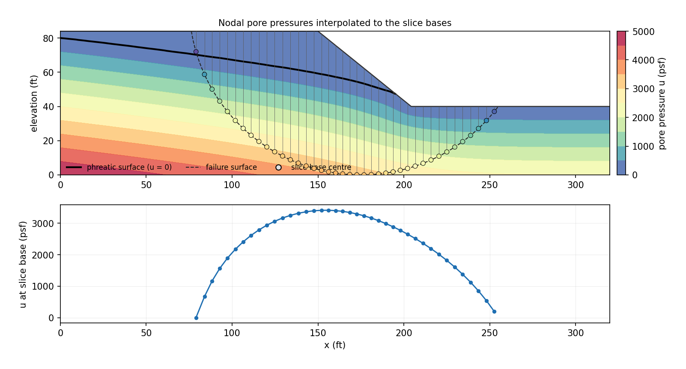{width=1000px}

*The nodal pore-pressure field, the circle, and the value picked up at each slice base — a
smooth traverse of the field, not a lookup against a drawn line.*

A slice base that falls **outside** the seepage mesh is assigned $u = 0$ and a warning is
issued: below the phreatic surface that over-predicts the factor of safety, so the warning is
telling you the mesh does not span the full depth of the failure surface.

## Using the field in a FEM analysis

An SSRM analysis takes two things from the seepage run:

1. **The mesh.** The seepage mesh *is* the FEM mesh — it should not be rebuilt. Both analyses
   must share one mesh so the pore-pressure field and the stress domain coincide.
2. **The pore pressures.** For every material set to `seep`, the nodal pore pressures are
   interpolated to each Gauss point with the same shape functions used for displacement,
   $u_{gp} = \sum N_i u_i$, once during `build_fem_data` rather than inside the viscoplastic
   loop.

At each Gauss point the Mohr-Coulomb yield function is evaluated on the effective mean stress
$\bar{\sigma}' = \bar{\sigma} - u_{gp}$:

>>$F = \tau_{max} - \bar{\sigma}' \sin\phi - c \cos\phi$

with $\bar{\sigma} = (\sigma_x + \sigma_y)/2$ the total mean normal stress and $\tau_{max}$ the
maximum shear stress. Positive $F$ means the stress state has passed the yield surface. By
reducing the effective stress, positive pore pressures shrink the elastic domain and make
yielding more likely — the physical effect of pore pressure on strength.

### Element type matters for FEM {#element-type-considerations-for-fem}

Build the seepage mesh with **quadratic elements** (`tri6`, `quad8`, `quad9`) whenever it will
also carry an SSRM analysis. Linear elements (`tri3`, `quad4`) lock volumetrically in the
elastic-plastic solution and significantly overestimate the factor of safety. Because both
analyses share one mesh, the element type has to be chosen for the FEM's requirements. See
[Element Type Selection and Volumetric Locking](../fem/overview.md#element-type-selection-and-volumetric-locking).

## Worked example

The Johnson Reservoir dam from the [Sample Problems](samples.md) page, carried through all
three analyses on one input file:

[xslope_johnson_res.xlsx](files/xslope_johnson_res.xlsx)

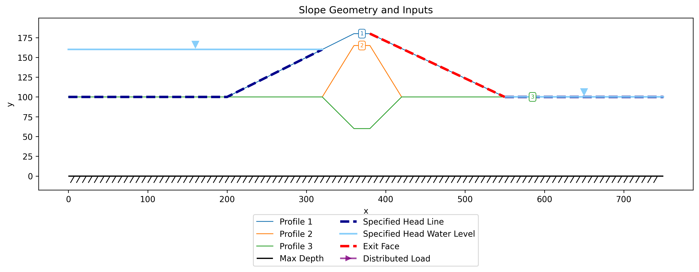{width=1200px}

The inputs build a quadratic (`tri6`) mesh, and the seepage solution is:

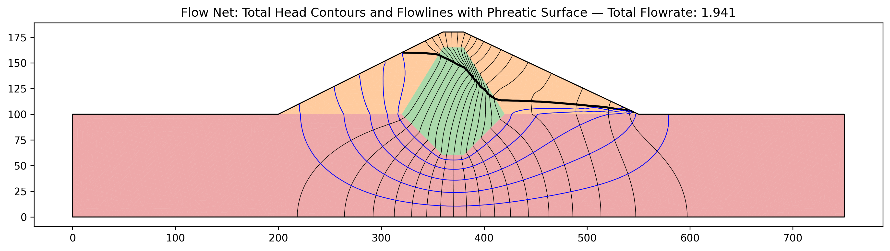{width=1200px}

Two files fall out of the run and travel with the workbook:

[xslope_johnson_res_mesh.json](files/xslope_johnson_res_mesh.json) — the mesh<br>
[xslope_johnson_res_seep.csv](files/xslope_johnson_res_seep.csv) — the nodal solution

Loading the same workbook for a LEM run picks both up automatically, which is why the mesh
appears behind the inputs plot:

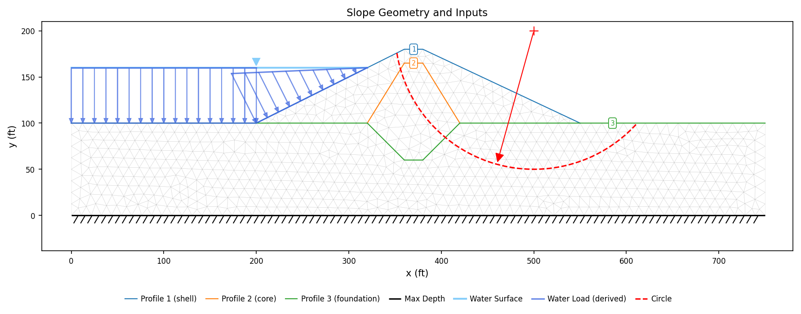{width=1200px}

All three materials use the `seep` option, so every slice base reads the field. A
critical-circle search with Spencer's method gives **FS = 1.25**:

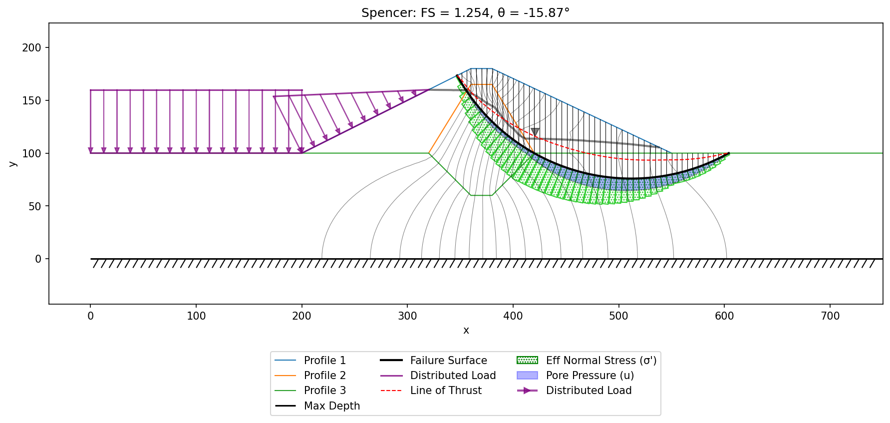{width=1200px}

<!-- test: file=files/xslope_johnson_res.xlsx, type=circular_search, method=spencer, expected_fs=1.25, num_slices=50, tolerance=0.02 -->

The same workbook, mesh and solution then run an SSRM analysis with the default
non-convergence criterion. The pore pressures reach the Gauss points through the effective
stress formulation and the reservoir water above the submerged upstream face is applied as a
consistent boundary pressure, so the FEM sees exactly the same water as the LEM. The result is
**FS = 1.25**:

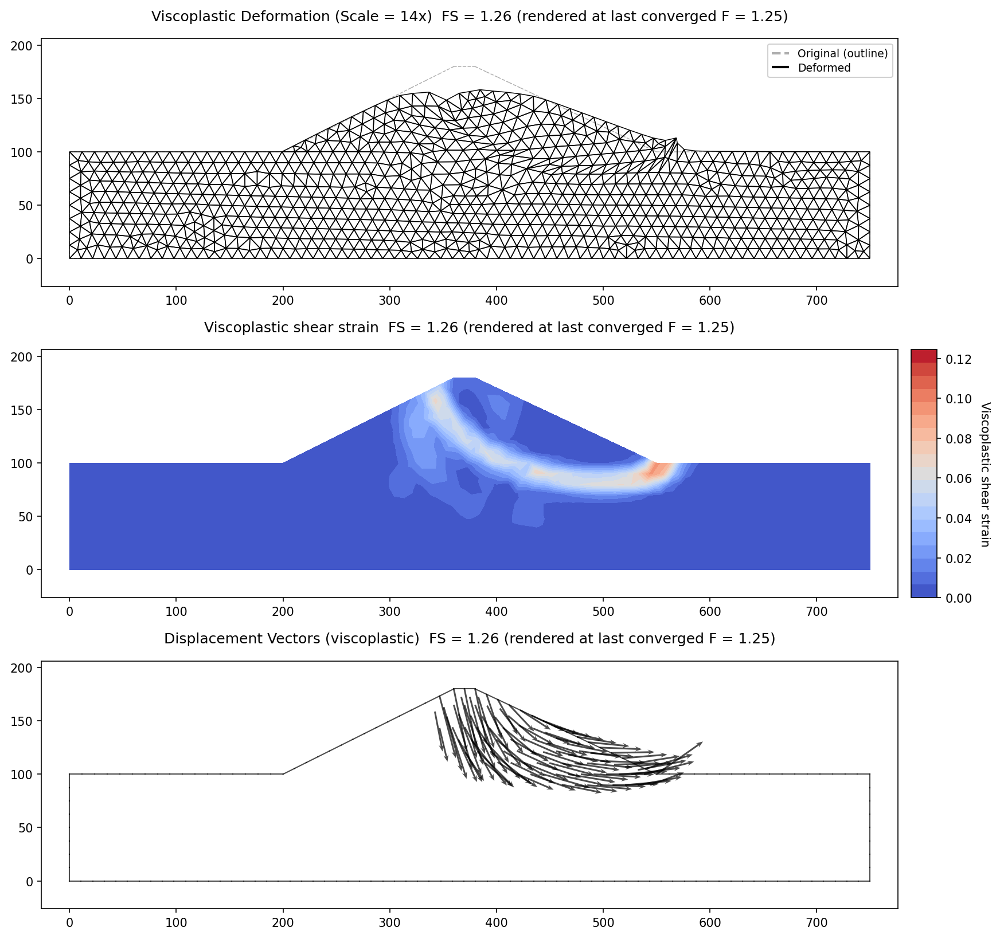{width=1200px}

<!-- test: file=files/xslope_johnson_res.xlsx, type=fem_ssrm, expected_fs=1.25, tolerance=0.01, f_min=1.0, f_max=1.6, max_iter=16000 -->

The deformed mesh and displacement vectors show a deep-seated mechanism through the embankment
and into the foundation, consistent with the critical circle the LEM search found. Neither
method depends on the other — the LEM prescribes a circular surface, the FEM develops the
mechanism from the stress field — so the agreement is a mutual check on the combined seepage
and stability workflow.

## Piezometric line vs. seepage-derived pore pressures

A piezometric line is a drawn estimate of the phreatic surface; a seepage solution honours the
flow field and the conductivities. The right-facing slope below (a three-layer silt / sand /
clay profile) is solved both ways on the **same single circle** ($X_0 = 175$, $Y_0 = 100$), so
the pore-pressure model is the only difference between the two runs.

### Part a — piezometric line

All three materials use the `piezo` option, with the surface entered on the **piezo** sheet.
Input file: [xslope_rface_PIEZO_KEY.xlsx](files/xslope_rface_PIEZO_KEY.xlsx)

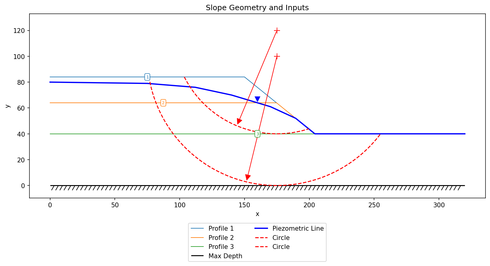{width=900}

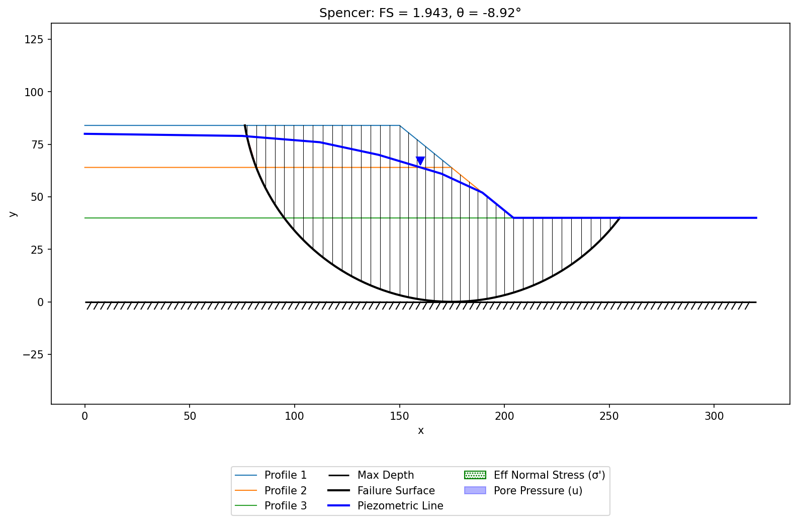{width=900}

Spencer's method gives **FS = 1.94**.

<!-- test: file=files/xslope_rface_PIEZO_KEY.xlsx, type=single_circle, num_slices=40, fs_oms=1.298, fs_bishop=1.928, fs_janbu=1.716, fs_corps=2.649, fs_lowe=2.105, fs_spencer=1.943, fs_mprice=1.943 -->

### Part b — seepage-derived pore pressures

The same model with all three materials switched to `seep`. A seepage analysis (specified head
$H = 80$ ft upstream, exit face downstream) is run first; its mesh and nodal pore pressures are
bundled with the workbook, imported automatically, and interpolated to each slice base. Input
file: [xslope_rface_SEEP_KEY.xlsx](files/xslope_rface_SEEP_KEY.xlsx)

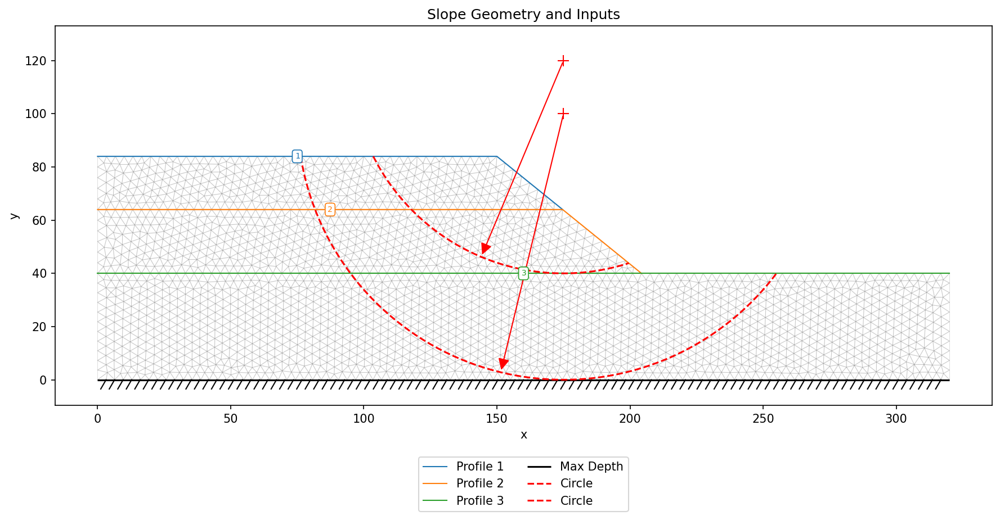{width=900}

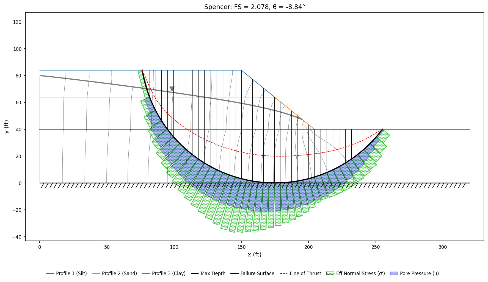{width=900}

Spencer's method gives **FS = 2.08**.

<!-- test: file=files/xslope_rface_SEEP_KEY.xlsx, type=single_circle, num_slices=40, fs_oms=1.473, fs_bishop=2.068, fs_janbu=1.863, fs_corps=2.798, fs_lowe=2.258, fs_spencer=2.080, fs_mprice=2.081 -->

### Comparison

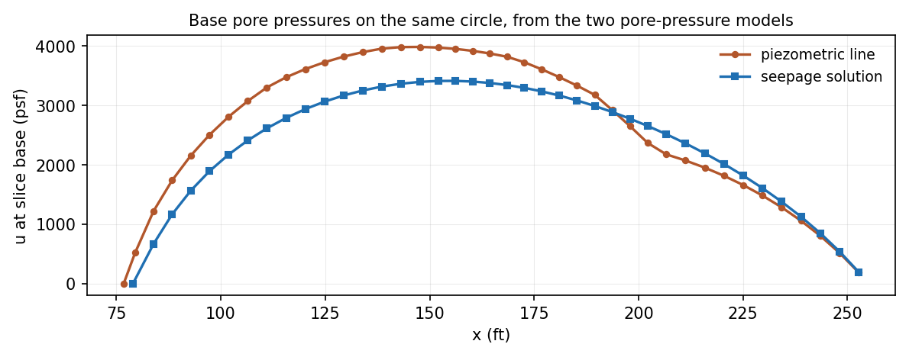{width=900px}

*Base pore pressures along the same circle. The drawn line implies more water over the body of
the slope than the flow field does, and slightly less near the toe.*

| Pore-pressure model | OMS | Bishop | Janbu | Corps | Lowe | Spencer | M-P |
|:--|--:|--:|--:|--:|--:|--:|--:|
| Piezometric line | 1.298 | 1.928 | 1.716 | 2.649 | 2.105 | 1.943 | 1.943 |
| Seepage | 1.473 | 2.068 | 1.863 | 2.798 | 2.258 | 2.080 | 2.081 |

For this slope the piezometric line returns a modestly **lower (more conservative)** factor of
safety — the two agree within about 7%, consistently across all methods. The difference is not
always this small nor always in this direction: where seepage is routed through the more
permeable layers and exits along the downstream face, the computed pore pressures near the toe
can be far higher than any reasonable piezometric line, dropping the factor of safety
dramatically. That is why a seepage analysis is preferred wherever seepage is actually
occurring.
