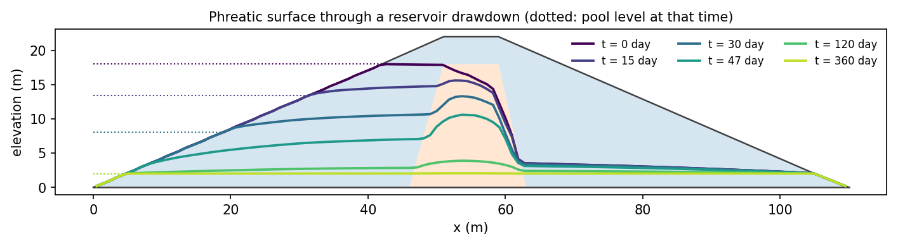
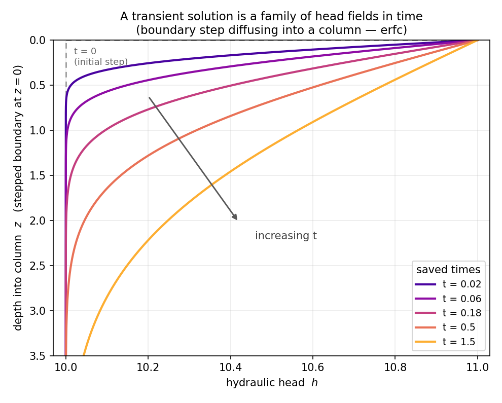
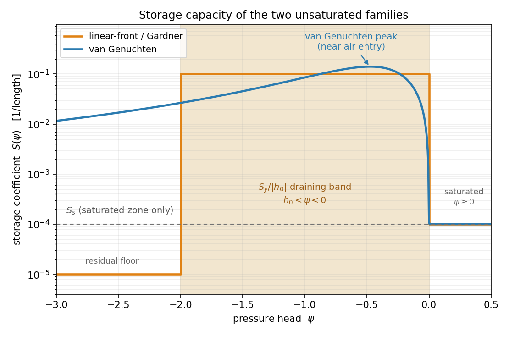
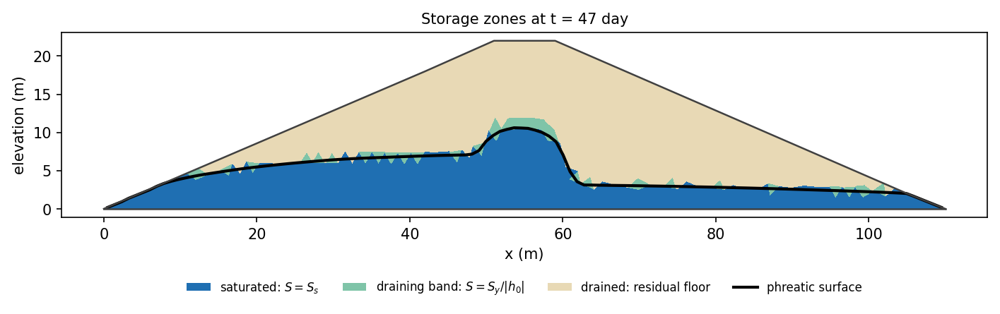
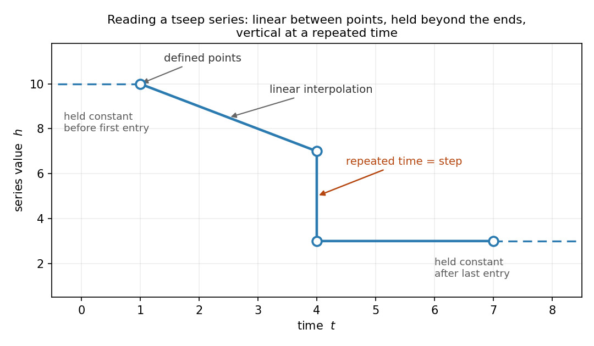
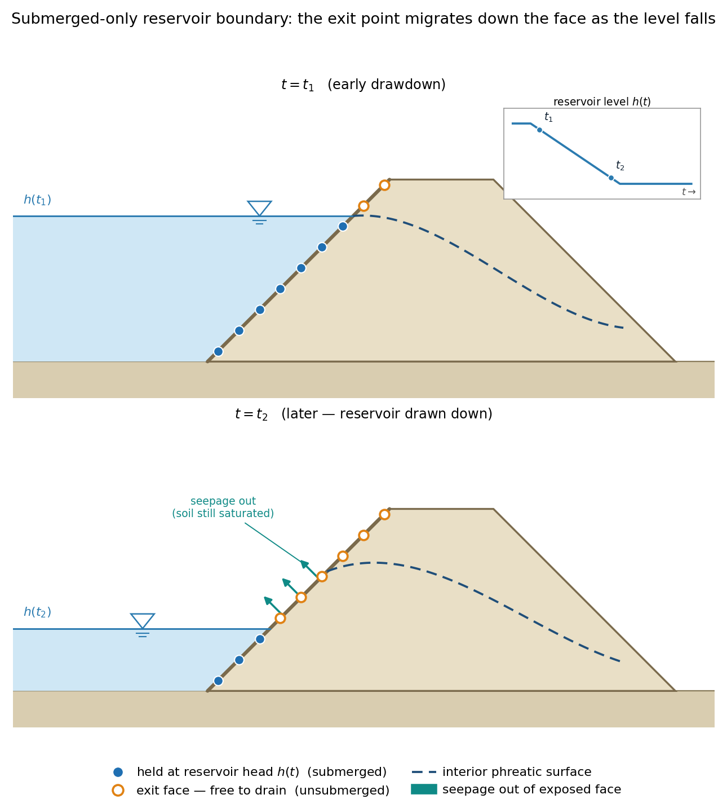
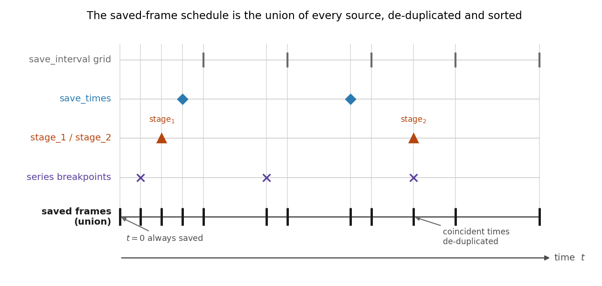
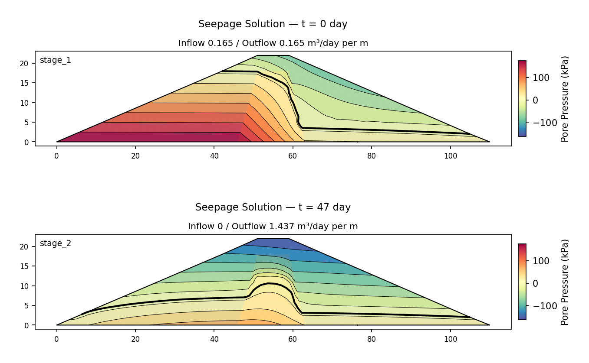

# Transient Seepage in XSLOPE

The [steady](overview.md) seepage analysis answers *what does the flow field look like once it
has settled?* Many slope-stability problems are governed by conditions that are still
changing: a reservoir drawn down over days, a storm that falls and stops, an embankment
shedding excess pore pressure over weeks. In each case the pore pressures that drive stability
depend on *when* the slope is examined.

A transient analysis solves the same finite-element flow problem repeatedly through time,
marching a head field forward from an initial condition under boundary conditions that vary on
a prescribed schedule, and storing the pore-pressure field at a series of saved times. Any one
of those frames can feed a limit-equilibrium or finite-element stability analysis exactly as a
steady solution does, and two of them together drive a [rapid-drawdown](../lem/rapid.md)
calculation.

{width=1000px}

*The phreatic surface in an earth dam through a reservoir drawdown, at successive saved times
against the pool level at each (dotted). The water table lags the pool — most of all in the
low-conductivity core — which is the whole reason the instant matters.*

An analysis becomes transient when the input file carries a filled-in **tseep** sheet and the
materials carry storage properties. With no tseep sheet the analysis is steady and the results
are bit-for-bit those of the [Overview](overview.md); the transient machinery is an additive
path that leaves the steady solve untouched.

Transient runs can also be launched point-and-click in [XSLOPE Studio](../studio/index.md) —
see [Studio](#studio) below.

## Formulation {#formulation}

The steady equation balances the divergence of the Darcy flux against any distributed source,
with no accumulation term: whatever flows into a control volume flows straight back out.
A transient problem relaxes exactly that. When the head at a point changes, the water content
of the surrounding soil changes with it, and the rate at which water is stored or released
enters the continuity balance:

>>$\nabla \cdot (k_r(\psi)\,[K]\,\nabla h) + Q = S(\psi)\,\dfrac{\partial h}{\partial t}$

$S(\psi)$ is the storage coefficient — specific storage where the soil is saturated, the
specific moisture capacity of the retention curve where it is not (see
[Storage properties](#storage)) — $Q$ is any distributed source, and $\partial h/\partial t$
the local rate of change of head. Setting $S = 0$ recovers the steady equation, so the
transient solver is a strict generalization of the steady one.

The standard Galerkin treatment, with the storage term discretized by the same shape
functions, gives the semi-discrete system

>>$[M]\,\dfrac{d\{h\}}{dt} + [K(\{h\})]\,\{h\} = \{Q\}$

where $[K(\{h\})]$ is the head-dependent (through $k_r$) conductivity matrix of the steady
solve and $[M]$ is the **mass**, or **storage**, matrix,

>>$M_{ij} = \displaystyle\int_\Omega S(\psi)\,N_i\,N_j\,d\Omega$

Both are assembled build-once: the saturated element stiffnesses and the $k_r$ sampling
operators are formed a single time and reused every step, and the storage matrix is assembled
once in unit (density-one) form and rescaled by the current storage coefficient each
iteration, exactly parallel to the way $k_r$ rescales the stiffness.

{width=720px}

*The dissipation picture in its simplest form: a sudden head change at the boundary spreading
into a column, each curve one instant. A transient solution is a family of head fields like
this, marched through time.*

## Storage properties {#storage}

The storage coefficient is what makes a transient solve differ from a steady one, and its
value depends on whether the soil is saturated. XSLOPE builds it from two per-material inputs
on the **mat** sheet, `Ss` and `Sy`.

### Specific storage $S_s$

Below the phreatic surface the storage that matters is **specific storage** — the volume of
water released from (or taken into) a unit volume of saturated soil per unit decline (or rise)
in head. It combines the compressibility of the soil skeleton and of the pore water and has
dimensions of inverse length.

| Material | $S_s$ (1/m) | | Material | $S_s$ (1/m) |
| --- | --- | --- | --- | --- |
| Plastic / soft clay | $10^{-3}$ – $10^{-2}$ | | Dense sand and gravel | $10^{-5}$ – $10^{-4}$ |
| Stiff clay, dense silt | $10^{-4}$ – $10^{-3}$ | | Fissured / jointed rock | $10^{-6}$ – $10^{-5}$ |
| Sand | $10^{-4}$ – $10^{-3}$ | | | |

!!! note "Units of $S_s$"
    $S_s$ must be entered in the model's length unit. The values above are in **1/m**; for a
    model in **feet** multiply by 0.3048. As with every XSLOPE input the number is used
    exactly as entered — nothing is converted.

$S_s$ is **required for every material** in a transient run, because even a fully saturated,
always-confined problem stores water through skeletal and fluid compressibility alone. It acts
only where the material is saturated, so on a problem whose water table never reaches a given
zone its value has no effect there.

### Specific yield $S_y$

Above the phreatic surface the dominant mechanism is not compressibility but **drainage** —
water leaving or filling the pore space as the water table moves. This is governed by
**specific yield**, the drainable porosity: dimensionless, and always well below the total
porosity because some water is held against gravity.

| Material | $S_y$ (–) | | Material | $S_y$ (–) |
| --- | --- | --- | --- | --- |
| Clean sand and gravel | 0.15 – 0.35 | | Silt | 0.03 – 0.19 |
| Fine sand | 0.10 – 0.28 | | Clay | 0.01 – 0.05 |

The finer the soil the more of its pore water is held by capillarity and the lower its $S_y$ —
note the contrast with $S_s$, which *rises* for softer, finer materials. For van Genuchten
materials $S_y$ doubles as the drainable water content $\theta_s - \theta_r$, so a
retention-curve fit is the better source when one exists. $S_y$ enters only through the
unsaturated model, so it is needed only on unconfined (exit-face) problems; an always-saturated
confined transient problem may leave it blank.

### The specific moisture capacity $C(\psi)$

The two mechanisms apply in **separate zones**, not together: below the phreatic surface the
storage is the elastic $S_s$, above it the retention curve's capacity alone. Compressibility
is not added to the unsaturated zone. This matters because the storage term sets the *timing*
of the whole solution and the two coefficients can be orders of magnitude apart — a stiff soil
with a flat retention curve has an $S_s$ that would swamp its true drainage capacity and slow
the march several-fold if both were counted. RS2 and SEEP/W both apply their $m_v$ in the
saturated zone only, so this is also the convention their published transient results are
computed on (see [GW18](../verification/rocscience_groundwater.md#gw18)).

$S(\psi)$ is evaluated per element at the same Gauss points used for $k_r$ and averaged with
the quadrature weights, so storage and conductivity are sampled consistently and an element
straddling the phreatic surface carries a blend of the two branches — the switch is spread
over one element rather than snapping node by node. Its form follows the material's `unsat`
model.

**Linear-front and Gardner materials.** The drainage capacity is spread uniformly across the
same pressure-head band the linear front spans (Gardner, being a conductivity curve rather
than a retention curve, reuses it):

>>$S(\psi) = \begin{cases}
S_s & \psi \ge 0 \quad\text{(saturated)} \\
\dfrac{S_y}{|h_0|} & h_0 < \psi < 0 \quad\text{(draining band)} \\
0 & \psi \le h_0 \quad\text{(drained)}
\end{cases}$

**van Genuchten materials.** The analytic derivative of the effective-saturation function,
with $S_y := \theta_s - \theta_r$:

>>$S(\psi) = \begin{cases}
S_s & \psi \ge 0 \\
S_y\,\dfrac{dS_e}{d\psi} & \psi < 0
\end{cases}, \qquad
S_e = \left[\,1 + (\alpha|\psi|)^{n}\,\right]^{-m}, \quad m = 1 - \dfrac{1}{n}$

The capacity peaks near the air-entry pressure and falls away both deep in the dry zone and as
saturation is approached.

Because both retention curves decay to zero far from saturation, the unsaturated branch
carries a **residual floor** at $10^{-4}$ of the material's own capacity scale — the storage
counterpart of the $k_r$ floor. A node with no storage at all is elliptic: its $[M]/\Delta t$
term vanishes, so shortening the step no longer restrains its head and the
[exit-face](#exit-face-behavior) active set can cycle with no way for the stepper to recover.
Four orders below the material's own capacity the floor stores no meaningful water; it only
keeps step reduction effective.

{width=720px}

*The storage coefficient $S(\psi)$: the elastic $S_s$ in the saturated zone, and above it a
drainage capacity — a boxcar band for the linear-front / Gardner model, a smooth peak near air
entry for van Genuchten — over a residual floor.*

{width=1000px}

*The same three branches on a section, at the end of a drawdown: each element classified by
the pressure head the solver samples in it. The draining band is the thin zone the falling
water table is passing through — the only place $S_y$ acts.*

## Time stepping {#time-stepping}

### The theta method

The semi-discrete system is advanced with the **theta method**. Over a step from $t$ to
$t + \Delta t$,

>>$\left(\dfrac{[M]}{\Delta t} + \theta[K]\right)\{h\}_{t+\Delta t}
   = \dfrac{[M]}{\Delta t}\{h\}_{t} + \{Q\} - (1-\theta)[K]\{h\}_{t}$

**$\theta = 1$ is backward Euler**, the default — unconditionally stable and free of the
oscillations that dog explicit and centered schemes on sharp infiltration fronts.
**$\theta = 0.5$ is Crank–Nicolson**, second-order accurate in time but more prone to ringing
on rapidly switching boundaries. Backward Euler is recommended for slope-stability work.

### Picard iteration

Because both $[K]$ (through $k_r$) and $[M]$ (through $S$) depend on the head field being
solved for, each step is nonlinear and is resolved by **Picard iteration**: rebuild $[K]$ from
the current iterate's $k_r$, rescale $[M]$ by the current $S$, solve, and repeat until the
maximum nodal head change falls below a tolerance scaled by a characteristic head span. On an
unconfined problem the exit-face active set must also settle before the step is accepted.

### Adaptive time stepping

The step size is chosen adaptively, so the solver takes small steps through rapid transients
and large ones through quiescent periods:

- **Head-change limiter.** A step is rejected and halved when the largest head change at any
  *free* node exceeds a fraction (default 5%) of the characteristic head span. The change at
  Dirichlet nodes is deliberately excluded — a stepped reservoir level jumps by its full amount
  regardless of $\Delta t$, and counting it would drive the step size to its floor for nothing.
- **Convergence-based growth.** After a step that converges easily the next step grows by a
  fixed factor; after one that needed many iterations it shrinks. A step that fails to converge
  is halved and retried down to a minimum size, at which point the last iterate is
  force-accepted (and the run flagged non-converged) so the march always makes progress.
- **Schedule clamping.** The step is always clamped so the stepper lands *exactly* on every
  saved time. Saved frames are therefore computed states, never interpolated between steps.

### Lumped mass

The storage matrix is **lumped** (diagonalized) rather than kept in consistent form. A
consistent mass matrix couples neighbouring nodes and can produce non-physical overshoot ahead
of a steep wetting front; lumping suppresses this. XSLOPE uses HRZ (special lumping) diagonal
scaling, which coincides with row-summing on linear elements and stays strictly positive on
quadratic ones. Lumped mass is the default and only option.

## Boundary conditions {#boundary-conditions}

A transient run reuses the steady boundary-condition types — [specified
head](overview.md#specified-head-dirichlet), [exit
face](overview.md#exit-face-seepage-face), and [specified
flux](overview.md#specified-flux-boundary-conditions-neumann) — and adds the ability to drive any of them from a
**time series** rather than a constant.

### Time series

A specified-head or specified-flux value on the **seep bc** sheet may be a number or the *name*
of a series defined on the [**tseep** sheet](../usage/input_template.md#worksheet-tseep). The
tseep sheet holds a single shared time column and up to **five named series** (default headers
`t1`…`t5`, renamable). One series can drive several boundaries, and each referencing block's
own **type** — `head`, `reservoir` or `flux` — decides whether its numbers are read as a plain
Dirichlet head, a submerged-only reservoir level, or a specified flux.

A series-bound value also commits the model to a transient solve: a **steady** run has no time
axis to read a series at, so it refuses to run and says so (the steady solution at the initial
series values is the transient run's own first frame, at t = 0). For a steady run, replace the
series name with a number.

Each series is a curve of value versus time with these **breakpoint semantics**:

- Values are interpolated **linearly** between the times at which the series has entries.
- The series is **held constant** before its first entry and after its last.
- A **blank cell** between entries means "no breakpoint here" — the series interpolates
  straight through it — so independent series with different breakpoints share one time column.
- A **step change** is entered by repeating a time on two consecutive rows with different
  values; the new value applies from that time onward.

{width=720px}

*A tseep series runs linearly between its defined points, holds constant beyond the first and
last, and steps vertically wherever a time is repeated.*

Numeric fluxes are baked into the load vector once; a series-driven flux is assembled once as a
unit-flux load vector for its polyline and scaled by the series value each step, since the flux
load is linear in its value.

### Head types: `head` and `reservoir` {#head-types-head-and-reservoir}

The two Dirichlet types differ only in how a node **above** the applied level is treated; at or
below the level they are identical.

A **head** boundary is a plain Dirichlet: every node of the polyline is held at the value —
constant or series $h(t)$ — at **all times**. It can hold a negative-pressure (suction) head
and never converts to an exit face. This is the type for a drained face, a specified-suction
laboratory boundary, or any imposed head that should be enforced regardless of elevation.

A **reservoir** boundary is the submerged-only Dirichlet used for a pool or tailwater whose
level rises and falls. A node is held at the level $h(t)$ only while its elevation is at or
below it; a node the falling water has left above the line becomes an **exit-face** node, free
to seep. The physical motivation is that a freshly exposed face does not become a no-flow
boundary — the soil behind it is still saturated, and that water can seep back out. Pinning
such nodes to the now-lower level, or sealing them, would both misstate the physics. As the
level moves, nodes cross between the two regimes and the exit point migrates up and down the
face, which is precisely what a drawdown demands. (A constant numeric reservoir level behaves
the same way, so draw the face only up to the level unless that migration is intended.)

{width=860px}

*As the reservoir level falls from $h(t_1)$ to $h(t_2)$, face nodes the water leaves above the
line switch from held reservoir head to exit face, and the still-saturated soil drains back out
through the newly exposed surface.*

### Exit-face behaviour {#exit-face-behavior}

The exit face — present statically as a downstream seepage face, or appearing dynamically as a
reservoir level falls below a node — is resolved each step with the same SEEP2D-style
active-set rule the steady solver uses: a boundary node is held saturated at atmospheric
pressure unless the head would fall below its elevation or the boundary reaction would have to
push water *into* the domain, in which case it is released to no-flow. On quadratic meshes each
seepage-face edge is tracked all-or-nothing across its corner and midside nodes — the same edge
treatment the steady solver applies — so the transition lands cleanly on a corner and the
element order of a transient run is unrestricted.

**Partly wet quadratic edges.** All-or-nothing has one state it cannot express: the edge the
exit point is passing *through*, wet below and dry above. Both available states are
inadmissible there — held wet the edge over-drains and the rule sheds it, held dry the pressure
climbs above the face and the rule takes it back — so the active set alternates and the step's
set-stability test can never close, collapsing $\Delta t$ to its floor. When a step fails with
the set revisiting a state it had already left, the offending edge is therefore resolved from
each node's *own* saturation test instead — the per-node rule linear elements always use, which
can carry a wet lower half and a dry upper half — and held there for the rest of the step, so
the transition lands at the midside node. Edges that are not cycling keep the all-or-nothing
rule, and a step that converges the ordinary way never reaches this path.

## Initial conditions {#initial-conditions}

Marching in time needs a head field at $t = 0$. By default XSLOPE computes it as a **steady
solve at the $t = 0$ boundary configuration**: the series are evaluated at $t = 0$ and the
ordinary steady solver is run — one linear solve for a confined problem, the steady exit-face
Picard solver for an unconfined one. The march therefore begins from a genuine steady state
rather than a guess. An explicit initial head field may be supplied instead when one is known.

Because of that rule, the way to start from a particular steady state — a full reservoir before
drawdown, say — is simply to give the driving series that value at $t = 0$. To hold it briefly
and then change it, use a **step** (a repeated time): the series sits at the initial value
through $t = 0$, so the initial condition is unaffected, and then steps or ramps to the new
value later. This is the standard drawdown setup.

## Outputs {#outputs}

### Saved-frame schedule

The solver stores a curated set of **saved frames**, not every computed step. The saved times
are the **union** of

- the **save_interval** grid (defaults to roughly 50 frames over the duration when blank),
- any explicit **save_times**,
- the rapid-drawdown **stage_1** / **stage_2** times,
- the **stability_time**, and
- every **series breakpoint**,

clamped to $(0, \text{duration}]$, de-duplicated and sorted. The $t = 0$ initial condition is
always the first frame. Because the stepper is clamped to land exactly on each of these times,
every saved frame is a computed state.

{width=720px}

*The saved-frame schedule is the union of the save_interval grid, explicit save_times, the
stage times, and every series breakpoint — de-duplicated, sorted, and always including
$t = 0$.*

Since the schedule is what a stability run can read, a time that has to be available later has
to be on it. A time that is **not** a saved frame is served by re-marching with that time added
to `save_times` — never by interpolating between two frames, since a field blended from two
solutions is not itself a solution of anything.

### Files

`export_transient_solution` writes two files:

- **`{base}_tseep.csv`** — a long-format table with one block of *n_nodes* rows per saved
  frame: `time, node_id, head, u`. Velocities are derived on load (below) rather than stored,
  and no stream function is stored either, since a transient frame has no flow net.
- **`{base}_tseep_meta.json`** — the frame ledger: saved times, node count, unit system and
  time unit, the theta/lumped provenance, the `dt` history, the per-frame inflow/outflow, the
  mass-balance ledger, the stage times, and the source input/mesh file names.

### Per-frame outputs, and why inflow ≠ outflow

Each saved frame reports separate **inflow** and **outflow** totals. Under storage exchange
these **differ** — the difference is exactly the water being stored in, or released from, the
soil at that instant. A steady solution's single "Total Flowrate" no longer applies; a frame
reports both rates, and its plot title carries them beneath the frame time.

!!! note "Transient frames have no flow net — read direction with velocity vectors"

    Flow lines are iso-contours of a **stream function**, which exists only when the flow field
    is **divergence-free**. A transient state breaks that: the storage term makes the field
    divergent, $\nabla\cdot\mathbf{q} = -S\,\partial h/\partial t \neq 0$ wherever heads are
    changing, so water appears from and disappears into storage throughout the domain. Flow
    "channels" have no meaning there, which is why the flow-line display — and the base-material
    control that only sets its channel count — is offered **only for steady solutions**. Turn on
    **velocity vectors** to read a transient frame's flow, including the reversal back into the
    emptied reservoir as the pool draws down.

### Derive-on-load velocities

When a saved frame is read back (`import_transient_solution`), the **velocity** and **hydraulic
gradient** fields are recomputed from the stored head, the mesh, and the (possibly
$k_r$-scaled) conductivity — the same derivation the steady solver uses. Storing only head and
pressure keeps the file compact, and each reconstructed frame is a full solution dict that
[`plot_seep_solution`](overview.md#results) renders unchanged.

### Mass-balance ledger

The meta file records a running **mass-balance ledger**. The cumulative net boundary inflow —
the discrete storage change the solve actually applied — is compared at each saved frame
against an independent **secant** estimate of the change in stored water: the integral of a
storage-potential function $\Phi(\psi)$ over the domain, in the mass-conservative mixed-form
spirit of [Celia et al. (1990)](https://doi.org/10.1029/WR026i007p01483). Their difference,
normalized to the storage scale, is the reported **closure**. For a saturated linear problem
the two agree to machine precision; a growing closure error on a strongly nonlinear run is the
signal to tighten the step controls.

## Stability time {#stability-time}

A transient run produces a *sequence* of pore-pressure fields, but a stability analysis with
`u = seep` consumes exactly **one**. The tseep controls carry an optional **stability_time**
naming which instant that is. It is a consumption time, not a control on the march: it selects
which frame is read out and changes nothing about how the march is solved. Like the stage times
it is forced into the saved-frame schedule, so the instant it names is always a computed frame.

Which instant a run reads, in order of precedence:

1. a `time` passed explicitly to the run — in Studio, the Run dialog's seepage-time selector,
   which governs that run only;
2. the model's `stability_time`;
3. with both absent, the **last saved frame** — usually the drained end state, which is often
   but not always the critical one. A run says which of the three it used.

`select_transient_frame_u(slope_data, solution, time=...)` places the chosen frame's pore
pressures into `slope_data['seep_u']`; `apply_transient_stability_frame` wraps the whole
resolution — precedence, rapid-drawdown staging, and the optional re-march:

```python
from xslope.seep import apply_transient_stability_frame

# Reads the model's stability_time; with none set, the last saved frame.
info = apply_transient_stability_frame(slope_data, solution)
print(info["times"], info["source"])       # e.g. [47.0] 'file'

# An explicit instant overrides the file for this run.
apply_transient_stability_frame(slope_data, solution, time=30.0)
```

A time with no saved frame is refused by default, listing the times that do exist. Passing
`remarch=True` together with the run's `seep_data` re-marches instead, with the requested
instant injected into `save_times`:

```python
apply_transient_stability_frame(slope_data, solution, time=100.0,
                                seep_data=seep_data, remarch=True)
```

`remarch_for_times(seep_data, slope_data, times)` does the re-march on its own and returns the
new solution. A re-march is a full re-solve — seconds on a short march, minutes on a long one.

Selecting a frame also records *which moment* those pore pressures belong to, so under
[automatic water loads](../usage/preflight.md#automatic-water-loads) the weight of the
standing water is derived from the reservoir as it stood at that instant — not as it stood at
$t = 0$. The water pressing on the slope and the pore-pressure field inside it therefore always
describe the same moment.

## Rapid drawdown staging {#rapid-drawdown-staging}

A transient run couples directly to a [rapid-drawdown](../lem/rapid.md) stability analysis. The
tseep controls carry two optional stage times, **stage_1** and **stage_2** (with
`stage_1 < stage_2`) — typically the full-reservoir state and the drawn-down state. Both are
forced into the saved-frame schedule, so each is a computed frame.

{width=1000px}

*The two frames a rapid-drawdown analysis consumes, on a common pressure scale: the full-pool
state at `stage_1`, and the drawn-down state at `stage_2` where the pool has gone but the core
still holds pressure. The frame titles carry the boundary inflow and outflow — equal at the
steady start, and inflow zero while the dam drains.*

`stage_transient_for_drawdown` pulls those two frames **in memory** — no intermediate files —
and places their pore-pressure fields into `slope_data['seep_u']` and `slope_data['seep_u2']`,
which are exactly the structures the classic two-steady-file drawdown path produces. The
existing three-stage machinery then runs unchanged. A transient solution with stage times takes
precedence over the classic `{base}_seep.csv` / `{base}_seep2.csv` files; a model without stage
times continues to use the classic path.

See [Rapid Drawdown Analysis](../lem/rapid.md#transient-solution) for the stability methodology
the staged pore pressures feed.

## Studio {#studio}

Transient seepage can be prepared and run without writing code: edit the time series, save
schedule and stage times in the [Transient inputs
editor](../studio/editing.md#transient-seepage) (Inputs → Transient), set the storage
properties, build a mesh, run the analysis from the seepage tools — the run reports determinate
progress and can be cancelled — then step through the saved frames in the solution view. See
[Studio → Running Analyses → Seepage](../studio/analysis.md#seepage).

The Run LEM and Run FEM dialogs carry a **seepage-time selector** when a transient solution is
loaded, so the instant a stability run reads is named where the run is started rather than
inherited from the play bar. It offers the saved frames, the frame the results viewer is
showing, and free entry of any other time (which re-marches); the choice can be written back to
`stability_time`. The rapid-drawdown stage times are edited in the same dialog. See
[Studio → Running Analyses → Seepage time](../studio/analysis.md#seepage-time).

## Usage

```python
from xslope.fileio import load_slope_data
from xslope.mesh import build_polygons, build_mesh_from_polygons
from xslope.seep import (build_seep_data, build_tseep_data, run_transient_seepage,
                         export_transient_solution, import_transient_solution,
                         transient_frame_index, stage_transient_for_drawdown)
from xslope.plot_seep import plot_seep_solution

# A workbook with a filled-in tseep sheet and Ss/Sy storage properties
input_file = "docs/seep/files/xslope_earth_dam_tseep.xlsx"
slope_data = load_slope_data(input_file)

polygons = build_polygons(slope_data)
mesh = build_mesh_from_polygons(polygons, target_size=2.0, element_type="tri3")

seep_data = build_seep_data(mesh, slope_data)    # storage + BC series bindings
tseep_data = build_tseep_data(slope_data)        # None if the file has no tseep sheet

solution = run_transient_seepage(seep_data, tseep_data)   # backward Euler by default
print(f"{len(solution['frames'])} frames over {solution['duration']}")
print(f"Mass-balance closure: {solution['mass_balance']['final_closure']:.2e}")

# Plot one saved frame (velocity vectors, not flow lines)
i = transient_frame_index(solution, 47.0)
frame = solution["frames"][i]
plot_seep_solution(seep_data, frame, variable="u", levels=15,
                   flowlines=False, vectors=True, phreatic=True)

# Write the run to {base}_tseep.csv (+ _tseep_meta.json), and read it back
export_transient_solution(seep_data, solution, "earth_dam", input_file=input_file)
reloaded = import_transient_solution(seep_data, "earth_dam")

# Stage the two rapid-drawdown frames into slope_data['seep_u'] / ['seep_u2']
slope_data = stage_transient_for_drawdown(slope_data, solution)
```

## Verification and Examples {#verification-and-examples}

**Verification** — transient rows in the corpus, each page entered at its transient section:

- [Rocscience Slide2 groundwater — transient problems](../verification/rocscience_groundwater.md#transient): the Terzaghi / Ferris / Pyrah consolidation columns and the earth-dam and lagoon seepage runs (GW15–GW21, all built), locked against closed-form or recomputed-analytical targets.
- [GeoStudio SEEP/W transient seepage](../verification/geostudio.md#transient-seepage): the consolidation, infiltration, reservoir-drawdown, clay-lined-pond, leach-column, and stepped-suction examples (SEEPW-T01–T05 and T07 built), with the multi-layer infiltration case (T06) documented as blocked and why.
- [RS2 earth dam under transient unsaturated seepage](../verification/rs2.md#rs2-67): the RS2-67 SSRM family, driven both by RS2's own imported 90 h drawdown pore-pressure field and by XSLOPE's own steady reconstruction of the vendor's boundary conditions.
- [Rocscience Slide2 — VP102](../verification/rocscience.md#vp102): a rapid-drawdown earth dam whose factor of safety is tracked across the 60–1500 h drawdown from a single uncoupled transient seepage solve.

**Worked examples** — complete input files you can download and open:

- [Earth Dam — Reservoir Drawdown](samples.md#8-earth-dam-reservoir-drawdown-transient): a shell-and-core dam followed through a drawdown driven by a falling `reservoir` series.
- [Johnson Reservoir — Zoned Drawdown](samples.md#9-johnson-reservoir-zoned-drawdown-transient): the zoned Johnson Reservoir dam drawn down over 45 days, with `stage_1` / `stage_2` set.
- [Rapid drawdown from a transient solution](../lem/rapid.md#worked-example): that drawdown carried into a three-stage rapid-drawdown stability analysis.

## References

Celia, M.A., Bouloutas, E.T., & Zarba, R.L. (1990). A general mass-conservative numerical solution
for the unsaturated flow equation. *Water Resources Research*, 26(7), 1483-1496.
<https://doi.org/10.1029/WR026i007p01483>

Freeze, R.A., & Cherry, J.A. (1979). *Groundwater*. Prentice-Hall.

Gardner, W.R. (1958). Some steady-state solutions of the unsaturated moisture flow equation with
application to evaporation from a water table. *Soil Science*, 85(4), 228-232.

van Genuchten, M.Th. (1980). A closed-form equation for predicting the hydraulic conductivity of
unsaturated soils. *Soil Science Society of America Journal*, 44(5), 892-898.
<https://doi.org/10.2136/sssaj1980.03615995004400050002x>
