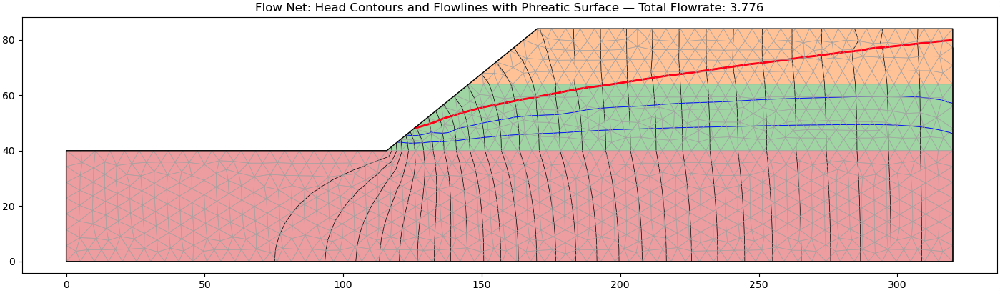
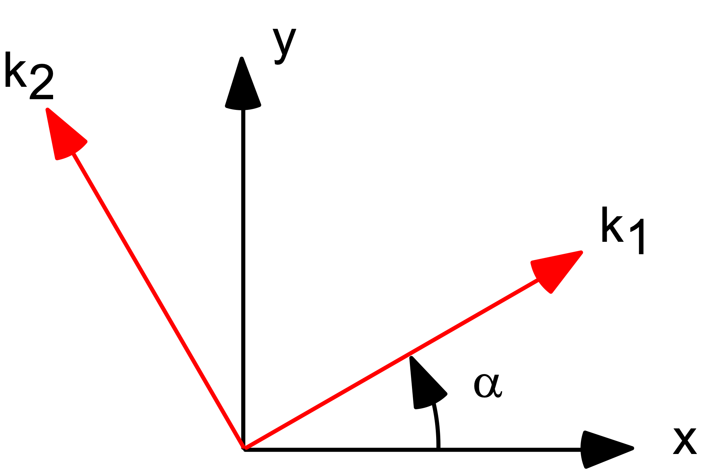
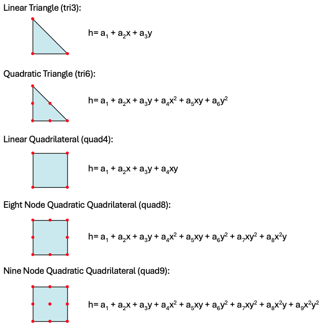

# Seepage Analysis in XSLOPE

## Introduction

Seepage analysis in XSLOPE provides comprehensive groundwater flow modeling capabilities specifically designed for slope stability applications. The system combines robust finite element seepage analysis with seamless integration into both limit equilibrium and finite element slope stability calculations, enabling rigorous assessment of slopes under varying groundwater conditions. This integration is critical for understanding slope behavior during rainfall events, reservoir drawdown, rapid construction, and other groundwater conditions that significantly affect slope stability.

{width=1200px}

The seepage analysis framework in XSLOPE addresses the fundamental challenge that pore water pressures are rarely uniform or static in natural slopes. Traditional approaches such as estimating pore pressures using depth below a piezometric line often fail to capture the complex groundwater flow patterns that develop in heterogeneous soil profiles with varying permeabilities and complex boundary conditions. The finite element approach implemented in XSLOPE solves the complete groundwater flow equation throughout the slope domain, producing spatially varying pore pressure fields that accurately reflect site-specific hydrogeological conditions. Furthermore, the seepage analysis tooks share the same input structure (Excel input template) used by the limit equilibrium and finite element methods, ensuring that the seepage analysis uses the same soil profile and site geometry and ensuring simple and seemless integration of the calculated pore pressures with the slope stability analysis.

Beyond the slope stability integration, the seepage tools in XSLOPE can be used as a stand-alone 2D seepage analysis tool, as long as the problem geometry and inputs are obtained from the Excel input template. Both saturated and unsaturated problems can be simulated. Furthermore, the system can directly import input files associated with the SEEP2D code. SEEP2D is a 2D finite element seepage program written in FORTRAN and originally producted by the US Army Corps of Engineers.

## Governing Equations

### Saturated Seepage Flow

The foundation of seepage analysis in XSLOPE rests on the fundamental equation governing groundwater flow in porous media. For saturated flow conditions, this equation combines Darcy's law with the continuity equation to produce the governing differential equation for hydraulic head distribution.

Darcy's law describes the relationship between groundwater velocity and hydraulic gradient:

>>$\vec{v} = -[K] \nabla h$

where $\vec{v}$ is the specific discharge vector, $[K]$ is the hydraulic conductivity tensor, and $\nabla h$ is the hydraulic gradient. For anisotropic soils, the hydraulic conductivity tensor takes the form:

>>$[K] = \begin{bmatrix} k_x & k_{xy} \\ k_{xy} & k_y \end{bmatrix}$

In most practical applications, the principal axes of permeability align with the coordinate system, simplifying the conductivity tensor to:

>>$[K] = \begin{bmatrix} k_x & 0 \\ 0 & k_y \end{bmatrix}$

In XSLOPE, the hydraulic conductivity values are input as $k_1$ and $k_2$ which are the major and minor principal permeabilities, and an angle $\alpha$ representing the rotation of the principal axes as follows:

{width=300px}

where $k_1$ and $k_2$ are the major and minor principal permeabilities respectively. 

When the principal permeability directions are rotated by angle $\alpha$ from the coordinate axes, the full conductivity tensor is computed using coordinate transformation:

>>$[K] = [R]^T [K_{principal}] [R]$

where $[R]$ is the rotation matrix:

>>$[R] = \begin{bmatrix} \cos\alpha & \sin\alpha \\ -\sin\alpha & \cos\alpha \end{bmatrix}$

This transformation yields the complete anisotropic conductivity tensor:

>>$[K] = \begin{bmatrix} 
k_1 \cos^2\alpha + k_2 \sin^2\alpha & (k_1 - k_2) \cos\alpha \sin\alpha \\
(k_1 - k_2) \cos\alpha \sin\alpha & k_1 \sin^2\alpha + k_2 \cos^2\alpha 
\end{bmatrix}$

where:<br>
>>$k_1$ = the major principal permeability (typically horizontal for sedimentary soils)<br>
$k_2$ = the minor principal permeability (typically vertical for layered soils)<br>
$\alpha$ = the angle in degrees from the positive x-axis to the major permeability direction

If $/alpha=0$, the K tensor reduces to:

>>$[K] = \begin{bmatrix} k_1 & 0 \\ 0 & k_2 \end{bmatrix}$

For isotropic materials ($k_1 = k_2 = k$), the tensor reduces to $[K] = k[I]$ regardless of the rotation angle. In other words:

>>$[K] = \begin{bmatrix} k & 0 \\ 0 & k \end{bmatrix}$

The continuity equation for incompressible flow in incompressible porous media requires that:

>>$\nabla \cdot \vec{v} = 0$

Combining Darcy's law with the continuity equation yields the governing equation for steady-state saturated flow:

>>$\nabla \cdot ([K] \nabla h) = 0$

Expanding this equation for two-dimensional flow with the full anisotropic conductivity tensor yields:

>>$\dfrac{\partial}{\partial x}\left(k_{xx} \dfrac{\partial h}{\partial x} + k_{xy} \dfrac{\partial h}{\partial y}\right) + \dfrac{\partial}{\partial y}\left(k_{xy} \dfrac{\partial h}{\partial x} + k_{yy} \dfrac{\partial h}{\partial y}\right) = 0$

which expands to:

>>$k_{xx} \dfrac{\partial^2 h}{\partial x^2} + 2k_{xy} \dfrac{\partial^2 h}{\partial x \partial y} + k_{yy} \dfrac{\partial^2 h}{\partial y^2} = 0$

When the principal permeability directions align with the coordinate axes (i.e., $\alpha = 0°$ or $k_{xy} = 0$), this simplifies to:

>>$k_1 \dfrac{\partial^2 h}{\partial x^2} + k_2 \dfrac{\partial^2 h}{\partial y^2} = 0$

where $k_{xx} = k_1$ and $k_{yy} = k_2$. This elliptic partial differential equation governs the hydraulic head distribution throughout the seepage domain and forms the foundation for the finite element formulation implemented in XSLOPE.

### Transient Flow Conditions

For completeness, transient flow analysis would require the governing equation:

>>$\nabla \cdot ([K] \nabla h) = S_s \dfrac{\partial h}{\partial t}$

where $S_s$ is the specific storage coefficient. Such analysis would enable modeling of reservoir drawdown, rainfall infiltration, and construction dewatering scenarios.

!!! Note
    Transient flow analysis is not currently implemented in XSLOPE. The current implementation focuses on steady-state seepage problems only. 

### Unsaturated Flow Formulation

Unsaturated flow analysis becomes necessary when analyzing slopes with significant vadose zones above the phreatic surface. XSLOPE implements unsaturated flow using a **linear front method** for the relative conductivity function, which provides a simplified but effective approach for modeling partially saturated conditions.

The governing equation for steady-state unsaturated flow is:

>>$\nabla \cdot (k_r(\psi) [K] \nabla h) = 0$

where $k_r(\psi)$ is the relative conductivity that varies with pressure head $\psi = h - z$.

#### Linear Front Method for Relative Conductivity

XSLOPE uses a linear front method to define the relative conductivity function, implemented through the `kr_frontal` function. This method uses a simple piecewise linear relationship:

>>$k_r(\psi) = \begin{cases}
1.0 & \text{if } \psi \geq 0 \text{ (saturated zone)} \\
kr_0 + (1 - kr_0) \left[ \dfrac{\psi - h_0}{-h_0} \right] & \text{if } h_0 < \psi < 0 \text{ (transition zone)} \\
kr_0 & \text{if } \psi \leq h_0 \text{ (dry zone)}
\end{cases}$

where:
- $\psi = h - z$ is the pressure head (negative in unsaturated zone)
- $kr_0$ is the relative conductivity at the reference suction head $h_0$
- $h_0$ is the reference suction head (negative value, typically -1.0 to -10.0)

The front can be visualized as follows:

{width=400px}

This linear front approach provides several advantages:

- **Computational Efficiency:** Simple linear relationship avoids complex exponential functions
- **Numerical Stability:** Smooth transitions between saturated and unsaturated zones
- **Physical Reasonableness:** Captures the essential reduction in conductivity above the phreatic surface
- **Parameter Simplicity:** Only two parameters ($kr_0$ and $h_0$) needed per material

The iterative solution process adjusts the relative conductivity at each element based on the computed pressure head at the element centroid, creating a spatially varying conductivity field that reflects the degree of saturation throughout the domain.

## Boundary Conditions

Proper specification of boundary conditions is essential for obtaining physically meaningful solutions to the seepage problem. XSLOPE supports the two primary types of boundary conditions commonly encountered in groundwater flow problems.

### Specified Head Boundary Conditions (Dirichlet)

Specified head boundary conditions prescribe the hydraulic head value along portions of the domain boundary:

>>$h = h_0$ on $\Gamma_h$

These conditions are appropriate for boundaries where the hydraulic head is known or can be reasonably estimated. Common applications include:

**Reservoir Boundaries:** Where the seepage domain interfaces with bodies of standing water such as reservoirs, lakes, or retention ponds. The hydraulic head equals the water surface elevation.

**Constant Head Sources:** Boundaries representing infinite sources of water at known elevations, such as large rivers or maintained water levels in drainage systems.

**Impermeable Boundaries at Depth:** Deep boundaries where groundwater is assumed to be at hydrostatic equilibrium, with hydraulic head equal to the elevation of the boundary.

The mathematical implementation of specified head conditions in the finite element system involves direct substitution of known head values into the global system of equations. Nodes lying on specified head boundaries have their hydraulic head values prescribed directly, reducing the size of the system that must be solved.

### Exit Face Boundary Conditions (Seepage Face)

Exit face boundary conditions represent boundaries where groundwater can freely discharge to the atmosphere, such as slope faces or excavation walls. These boundaries present a more complex mathematical condition because the location of the phreatic surface (where pressure head equals zero) is not known a priori.

On an exit face boundary, the boundary condition is:

>>$\psi = 0$ (pressure head = 0) for nodes where seepage occurs (i.e, total head = elevation)

>>$\dfrac{\partial h}{\partial n} = 0$ (no flow) for nodes above the seepage zone

The challenge lies in determining which nodes along the potential exit face actually experience seepage discharge versus those above the phreatic surface where no flow occurs. This requires an iterative solution process where the position of the phreatic surface is updated based on the computed hydraulic head distribution.

XSLOPE implements a robust algorithm for handling exit face conditions:

1. **Initial Assumption:** All nodes on potential exit faces are assumed to be seepage nodes with $\psi = 0$.
2. **Solution and Check:** The system is solved and the resulting hydraulic heads are examined.
3. **Boundary Update:** Nodes where the computed head would result in $\psi > 0$ (tension) are converted to no-flow boundaries.
4. **Iteration:** The process repeats until the seepage face configuration stabilizes.

This iterative approach ensures that the final solution satisfies the correct boundary conditions while accurately locating the phreatic surface.

## Solution Process

### Finite Element Formulation

The finite element implementation of the seepage problem in XSLOPE follows standard Galerkin procedures for elliptic partial differential equations. The weak form of the governing equation is derived by multiplying by a test function and integrating by parts:

>>$\int_\Omega [K] \nabla N_i \cdot \nabla h \, d\Omega = \int_{\Gamma_q} N_i q \, d\Gamma$

where $N_i$ are the finite element shape functions, $\Omega$ is the seepage domain, and $\Gamma_q$ represents boundary segments where flow is prescribed.

The discretized system results in the global matrix equation:

>>$[K_{global}] \{h\} = \{Q\}$

where $[K_{global}]$ is the global conductivity matrix, $\{h\}$ is the vector of nodal hydraulic heads, and $\{Q\}$ represents boundary flow conditions and source terms.

### Element Types and Integration

XSLOPE supports multiple finite element types optimized for different accuracy and computational requirements:



**Linear Triangular Elements (TRI3):** Provide computational efficiency and robust performance for most seepage problems. The constant hydraulic gradient within each element is well-suited for representing the smooth head distributions typical of groundwater flow.

**Quadratic Triangular Elements (TRI6):** Offer improved accuracy for problems with curved boundaries or complex head distributions. The quadratic head variation within elements better captures gradients near boundaries and interfaces.

**Linear Quadrilateral Elements (QUAD4):** Suitable for problems with regular geometric features where structured meshing is possible. Generally provide improved computational efficiency compared to triangular elements.

**Higher-Order Quadrilateral Elements (QUAD8, QUAD9):** Enable high-accuracy solutions for demanding applications, particularly those involving complex boundary geometries or strong material property contrasts.

The conductivity matrix for each element is computed using numerical integration:

>>$[K_e] = \int_{A_e} [B]^T [K] [B] \, dA$

where $[B]$ is the strain-displacement matrix relating nodal heads to hydraulic gradients within the element.

!!! Note
    In most cases, linear triangles (tri3) are sufficiently accurate for seepage anlysis. 

### Saturated vs Unsaturated Solution Algorithms

XSLOPE automatically determines whether to use saturated (confined) or unsaturated (unconfined) analysis based on the presence of exit face boundary conditions in the input. The solution approach differs significantly between these two cases:

#### Saturated Analysis (Linear Solution)

When **no exit face boundary conditions** are specified (i.e., no nodes with `bc_type = 2`), XSLOPE performs saturated analysis using the `solve_confined` function. This approach features:

- **Linear System:** Solves a single linear system $[K]\{h\} = \{Q\}$ where the conductivity matrix is constant
- **Direct Solution:** Uses sparse matrix factorization (typically < 10,000 nodes) or iterative methods for larger problems
- **Computational Efficiency:** Single solution step with guaranteed convergence
- **Applicable When:** The phreatic surface lies above or very close to the entire analysis domain

#### Unsaturated Analysis (Iterative Solution)

When **exit face boundary conditions are present** (i.e., any nodes with `bc_type = 2`), XSLOPE performs unsaturated analysis using the `solve_unsaturated` function. This iterative approach features:

- **Nonlinear System:** Requires iterative solution because conductivity varies with pressure head
- **Iterative Process:** <br>
  1. Initialize hydraulic head distribution (usually from saturated solution)<br>
  2. Compute pressure head at each element centroid: $\psi = h - z$<br>
  3. Evaluate relative conductivity using linear front method: $k_r = kr_{frontal}(\psi, kr_0, h_0)$<br>
  4. Assemble modified conductivity matrix: $[K_{modified}] = k_r [K]$<br>
  5. Solve linear system with current conductivity matrix<br>
  6. Check convergence: $||h_{new} - h_{old}|| < tolerance$<br>
  7. Repeat steps 2-6 until convergence or maximum iterations reached

- **Convergence Criteria:** Based on change in hydraulic head between iterations, with tolerance scaled to domain size
- **Exit Face Handling:** Iteratively determines which nodes experience seepage discharge vs. no-flow conditions
- **Computational Cost:** Significantly higher than saturated analysis due to nonlinear iterations

#### Solution Algorithm Selection

The `run_seepage_analysis` function automatically selects the appropriate solution method:

```python
# Check if this is an unconfined (unsaturated) problem based on exit face BCs
is_unconfined = np.any(bc_type == 2)

if is_unconfined:
    # Use iterative unsaturated solver
    head, A, q, total_flow = solve_unsaturated(...)
else:
    # Use direct saturated solver  
    head, A, q, total_flow = solve_confined(...)
```

This automatic selection ensures that users get the most appropriate solution method based on their problem setup without manual intervention.

## Integration with Excel Input Templates

A seepage analysis in XSLOPE uses the profile line data in the Excel input template to define the problem geometry. In addition, hydraulic properties input as part of the materials table and there is also a dedicated tab (sheet) for seepage boundary conditions.

### Material Properties Definition

Seepage analysis in XSLOPE leverages the existing material property framework established for limit equilibrium analysis, extending it to include the hydraulic parameters needed for groundwater flow calculations. The material properties are defined in the Excel input template on the "mat" (materials) worksheet, where each soil layer includes both mechanical and hydraulic property definitions. 

The hydraulic properties for each material include:

**k1 (Major Principal Permeability):** The hydraulic conductivity in the direction of maximum permeability, typically corresponding to the horizontal direction in sedimentary deposits or the direction parallel to bedding planes. Units are typically m/s, ft/s, cm/s, or equivalent.

**k2 (Minor Principal Permeability):** The hydraulic conductivity in the direction of minimum permeability, often the vertical direction in layered soils. For isotropic materials, k2 equals k1, while anisotropic materials exhibit k2 < k1.

**alpha (Permeability Angle):** The angle (in degrees) by which the principal permeability directions are rotated from the coordinate axes. A value of 0° indicates that k1 aligns with the x-axis (horizontal), while 90° indicates that k1 aligns with the y-axis (vertical).

**kr0 (Relative Permeability at Reference Suction):** For unsaturated analysis, this parameter defines the relative conductivity (k_rel = k_unsat/k_sat) at a reference pressure head h0. This parameter enables modeling of partially saturated hydraulic behavior above the phreatic surface.

**h0 (Reference Suction Head):** The reference pressure head (negative value representing suction) at which the relative conductivity kr0 is defined. Together with kr0, this parameter defines a simplified two-point approximation of the unsaturated conductivity function.

### Boundary Conditions Specification

The seepage boundary conditions are defined in the "seep bc" worksheet of the Excel template, providing a structured approach for specifying the complex boundary conditions typical of slope seepage problems.

**Specified Head Boundaries:** Up to three separate specified head boundary conditions can be defined, each consisting of:

- **Head Value:** The hydraulic head to be maintained along the boundary (in length units consistent with the coordinate system)
- **Coordinate Sequence:** A series of (x,y) coordinate pairs that define the geometric extent of the specified head boundary

The system automatically interpolates the specified head value along the line segments connecting the coordinate points, enabling representation of complex boundary geometries while maintaining constant head conditions.

**Exit Face Boundaries:** A single exit face boundary is defined through a sequence of coordinate pairs representing the potential seepage discharge locations. The system automatically determines which portions of this boundary actually experience seepage discharge based on the computed hydraulic head distribution.

### Seepage Solution Integration

For problems requiring seepage analysis coupled with either limit equilibrium or finite element slope stability calculations, XSLOPE provides seamless integration through pre-computed seepage solutions. This approach separates the computationally intensive seepage analysis from the slope stability analysis, enabling efficient parameter studies and optimization workflows.

In the materials table on the `materials` sheet of the Excel input template, the user can select one of three options for pore pressures used in an effective stress analysis for each material:

| Option | Description |
|------- |-------------|
| none   | No pore pressures. This is appropriate for dry soils or total stress analysis |
| piezo  | Pore presssure are derived from a piezometric line defined on the `piezo` tabl |
| seep   | Pore pressures are derived from the results of a 2D finite element seepage analysis |

 For the `seep` option, the user first performs a seepage analysis and exports the resulting finite element mesh and solution file. These files are then referenced for a subsequent slope stability analysis using the three input variables just below the materials table in the Excel template:

**Mesh File (JSON format):** Contains the finite element mesh used for seepage analysis, including node coordinates, element connectivity, and material zone assignments. This mesh is generated using the automated mesh generation capabilities documented in the mesh generation section.

**Primary Solution File (CSV format):** Contains the seepage analysis results for the primary groundwater condition, typically steady-state conditions or the most critical transient condition. The file includes hydraulic head and pore pressure values at each mesh node.

**Secondary Solution File (CSV format, optional):** A second solution can be used for rapid drawdown scenarios where slopes are analyzed under both full reservoir and drawn-down conditions.

The pore pressure values from these solution files are automatically interpolated to slice locations during limit equilibrium analysis, ensuring that the slope stability calculations properly account for the complex pore pressure distributions computed by the seepage analysis.

It is also possible to generate the mesh and solution after importing the Excel input template. In other words, the seepage anlysis can be performed at the same time as the slope stability analysis, eliminating the need to save and then reference the mesh and solution files. Example code is shown below. 

## Seepage Results for Pore Pressures

### Pore Pressure Calculation

The primary output of seepage analysis is the hydraulic head distribution throughout the analysis domain. However, slope stability analysis requires pore pressure values rather than hydraulic heads. The conversion between these quantities follows the fundamental relationship:

>>$u = \gamma_w (h - z)$

where:
- $u$ is the pore water pressure
- $\gamma_w$ is the unit weight of water (typically 9.81 kN/m³ or 62.4 lbf/ft³)
- $h$ is the hydraulic head from seepage analysis
- $z$ is the elevation coordinate

This relationship automatically accounts for the effect of elevation on pore pressure while preserving the hydraulic gradients computed by the seepage analysis. Positive pore pressures indicate groundwater under pressure (below the phreatic surface), while zero or negative values indicate conditions above the groundwater table.

### Conservative Treatment of Negative Pore Pressures

In certain situations, the seepage analysis may compute negative pore pressures (tensions) in portions of the domain, particularly in unsaturated zones or regions with strong capillary effects. While these negative pore pressures may be physically realistic, their inclusion in slope stability analysis can lead to unconservative results by artificially increasing effective stresses and apparent slope stability.

XSLOPE implements a conservative approach by automatically setting any computed negative pore pressures to zero before transferring them to slope stability calculations. This treatment ensures that:

**Conservative Assessment:** Slope stability calculations do not benefit from potentially unreliable tensile strength in pore water
**Physical Realism:** Avoids dependence on soil-water tension effects that may not persist under loading conditions
**Robustness:** Eliminates sensitivity to uncertain unsaturated soil parameters that may not be well-characterized

### Interpolation to Slice Locations

The integration of seepage analysis results with limit equilibrium slope stability calculations requires interpolation of pore pressures from the seepage mesh nodes to the slice centroids used in limit equilibrium analysis. XSLOPE implements a robust interpolation scheme that preserves the accuracy of the computed pore pressure field while ensuring computational efficiency.

The interpolation process follows these key steps:

**Spatial Search:** For each slice centroid, the system identifies the seepage analysis element containing that point using efficient spatial search algorithms.

**Shape Function Evaluation:** The pore pressure at the slice centroid is computed using the finite element shape functions and the nodal pore pressure values of the containing element:

>>$u(x,y) = \sum_{i=1}^{n} N_i(x,y) \cdot u_i$

where $N_i$ are the element shape functions and $u_i$ are the nodal pore pressures.

### Flow Net Generation and Visualization

Beyond pore pressure calculation, XSLOPE provides comprehensive visualization capabilities for interpreting seepage analysis results through flow net generation and contour plotting.

**Hydraulic Head Contours:** Iso-head lines showing the spatial distribution of hydraulic head throughout the seepage domain. These contours are analogous to topographic contours and indicate the direction of groundwater flow (perpendicular to contour lines).

**Flow Lines:** Streamlines showing the paths followed by groundwater particles as they flow through the porous medium. These lines are generated by integrating the velocity field computed from the hydraulic head gradients using Darcy's law.

**Phreatic Surface:** The free groundwater surface where pore pressure equals zero (pressure head = 0). This surface represents the boundary between saturated and unsaturated zones and is critical for understanding groundwater behavior.

**Velocity Vectors:** Arrow plots showing the magnitude and direction of groundwater flow velocity at selected points throughout the domain. These vectors provide direct visualization of flow patterns and identify regions of high or low groundwater velocity.

The flow net generation algorithm computes streamlines by numerical integration of the flow velocity field:

>>$\dfrac{dx}{dt} = -k_x \dfrac{\partial h}{\partial x}$

>>$\dfrac{dy}{dt} = -k_y \dfrac{\partial h}{\partial y}$

where the velocity components are computed from the hydraulic head gradients using Darcy's law. The integration produces smooth streamlines that provide intuitive visualization of groundwater flow patterns and help identify potential seepage problems or areas requiring special attention in slope stability analysis.

## Code Examples and Usage

### Basic Seepage Analysis Workflow

The following example demonstrates the complete workflow for performing seepage analysis using XSLOPE's integrated mesh generation and solution capabilities:

```python
from fileio import load_slope_data
from mesh import build_polygons, build_mesh_from_polygons
from seep import build_seep_data, run_seepage_analysis
from plot_seep import plot_seep_data, plot_seep_solution
import numpy as np

# Load slope geometry and material properties
slope_data = load_slope_data("inputs/slope/input_template_lface5.xlsx")

# Generate material zone polygons from profile lines
polygons = build_polygons(slope_data, debug=True)

# Create finite element mesh optimized for seepage analysis
mesh = build_mesh_from_polygons(
    polygons=polygons,
    target_size=2.0,        # Element size in model units
    element_type='tri6',    # Quadratic triangles for accuracy
    debug=True
)

print(f"Generated mesh: {len(mesh['nodes'])} nodes, {len(mesh['elements'])} elements")

# Build seepage analysis data structure
seep_data = build_seep_data(mesh, slope_data)

# Visualize mesh and boundary conditions
plot_seep_data(
    seep_data, 
    show_nodes=True, 
    show_bc=True, 
    material_table=True,
    alpha=0.4
)

# Solve seepage problem
solution = run_seepage_analysis(seep_data)

print(f"Seepage analysis complete!")
print(f"Head range: {np.min(solution['head']):.2f} to {np.max(solution['head']):.2f}")
if 'flowrate' in solution:
    print(f"Total flow rate: {solution['flowrate']:.6f}")

# Visualize results with flow net
plot_seep_solution(
    seep_data, 
    solution, 
    levels=20,              # Number of head contour levels
    base_mat=1,             # Material for flow line scaling
    fill_contours=True,     # Color-filled contours
    phreatic=True,          # Show phreatic surface
    show_mesh=True          # Overlay element edges
)
```

### Import and Analysis of SEEP2D Files

For users with existing SEEP2D input files, XSLOPE provides direct import capabilities:

```python
from seep import import_seep2d, run_seepage_analysis, print_seep_data_diagnostics
from plot_seep import plot_seep_data, plot_seep_solution

# Import SEEP2D format input file
seep_data = import_seep2d("inputs/seep/lface.s2d")

# Print diagnostic information about the imported data
print_seep_data_diagnostics(seep_data)

# Visualize imported mesh and boundary conditions
plot_seep_data(
    seep_data,
    show_nodes=False,
    show_bc=True,
    material_table=True,
    label_elements=False,
    label_nodes=False
)

# Run seepage analysis
solution = run_seepage_analysis(seep_data)

# Plot results with customized visualization
plot_seep_solution(
    seep_data, 
    solution,
    levels=25,
    base_mat=2,
    fill_contours=False,    # Line contours only
    phreatic=True,
    show_mesh=False,        # Clean visualization
    alpha=0.6
)
```

### Advanced Analysis with Material Property Variations

This example demonstrates how to perform parametric studies by varying material properties:

```python
from copy import deepcopy
import matplotlib.pyplot as plt

def parametric_seepage_study():
    """Perform parametric study of permeability effects on seepage."""
    
    # Base case setup
    slope_data = load_slope_data("inputs/slope/input_template_lface5.xlsx")
    polygons = build_polygons(slope_data)
    mesh = build_mesh_from_polygons(polygons, target_size=1.5, element_type='tri6')
    
    # Define permeability ratios to study
    k_ratios = [0.1, 0.5, 1.0, 2.0, 5.0, 10.0]
    
    results = {}
    
    for k_ratio in k_ratios:
        # Modify material properties
        modified_data = deepcopy(slope_data)
        
        # Increase permeability of first material
        if modified_data['materials']:
            modified_data['materials'][0]['k1'] *= k_ratio
            modified_data['materials'][0]['k2'] *= k_ratio
        
        # Build seepage data and solve
        seep_data = build_seep_data(mesh, modified_data)
        solution = run_seepage_analysis(seep_data)
        
        results[k_ratio] = {
            'head': solution['head'].copy(),
            'flowrate': solution.get('flowrate', 0.0)
        }
        
        print(f"k_ratio = {k_ratio}: Flowrate = {results[k_ratio]['flowrate']:.6f}")
    
    # Plot flowrate vs permeability ratio
    plt.figure(figsize=(10, 6))
    flowrates = [results[k]['flowrate'] for k in k_ratios]
    plt.semilogx(k_ratios, flowrates, 'o-', linewidth=2, markersize=8)
    plt.xlabel('Permeability Ratio')
    plt.ylabel('Total Flow Rate')
    plt.title('Seepage Flow Rate vs Material Permeability')
    plt.grid(True, alpha=0.3)
    plt.show()
    
    return results

# Run parametric study
parametric_results = parametric_seepage_study()
```

### Integration with Limit Equilibrium Analysis

This example shows how to integrate seepage results with slope stability analysis:

```python
from slice import generate_slices
from solve import bishop, spencer
from plot import plot_solution

def coupled_seepage_stability_analysis():
    """Perform coupled seepage-stability analysis."""
    
    # Load and prepare slope data
    slope_data = load_slope_data("inputs/slope/input_template_lface5.xlsx")
    
    # Generate seepage mesh and solve
    polygons = build_polygons(slope_data)
    mesh = build_mesh_from_polygons(polygons, target_size=1.5, element_type='tri6')
    seep_data = build_seep_data(mesh, slope_data)
    seepage_solution = run_seepage_analysis(seep_data)
    
    # Store seepage results in slope_data for limit equilibrium analysis
    slope_data['seep_mesh'] = mesh
    slope_data['seep_u'] = seepage_solution['head']  # Will be converted to pore pressures
    
    # Define circular failure surface for analysis
    failure_surface = {
        'xc': 25.0,     # Center x-coordinate
        'yc': 45.0,     # Center y-coordinate  
        'radius': 35.0  # Radius
    }
    
    # Generate analysis slices
    slice_df = generate_slices(
        slope_data, 
        failure_surface, 
        num_slices=20
    )
    
    print(f"Generated {len(slice_df)} slices for stability analysis")
    
    # Solve using multiple limit equilibrium methods
    methods = ['bishop', 'spencer']
    results = {}
    
    # Bishop's method
    success_bishop, result_bishop = bishop(slice_df)
    if success_bishop:
        results['bishop'] = result_bishop['FS']
        print(f"Bishop's Method: FS = {result_bishop['FS']:.3f}")
    
    # Spencer's method  
    success_spencer, result_spencer = spencer(slice_df)
    if success_spencer:
        results['spencer'] = result_spencer['FS']
        print(f"Spencer's Method: FS = {result_spencer['FS']:.3f}")
    
    # Plot stability analysis results
    if success_bishop:
        plot_solution(slice_df, result_bishop, slope_data, failure_surface, 
                     title="Coupled Seepage-Stability Analysis (Bishop)")
    
    # Plot seepage solution for comparison
    plot_seep_solution(seep_data, seepage_solution, 
                      title="Seepage Analysis - Pore Pressures for Stability Analysis")
    
    return results, seepage_solution

# Run coupled analysis
stability_results, seepage_results = coupled_seepage_stability_analysis()
```

### Export and Visualization of Results

```python
from seep import export_seep_solution, save_seep_data_to_json
from mesh import export_mesh_to_json

def export_seepage_results():
    """Complete workflow with result export capabilities."""
    
    # Standard analysis workflow
    slope_data = load_slope_data("inputs/slope/input_template_lface5.xlsx")
    polygons = build_polygons(slope_data)
    mesh = build_mesh_from_polygons(polygons, target_size=2.0, element_type='tri6')
    seep_data = build_seep_data(mesh, slope_data)
    solution = run_seepage_analysis(seep_data)
    
    # Export mesh for reuse
    export_mesh_to_json(mesh, "outputs/seepage_mesh.json")
    print("Exported mesh to outputs/seepage_mesh.json")
    
    # Export seepage solution for limit equilibrium analysis
    export_seep_solution(seep_data, solution, "outputs/seepage_solution.csv")
    print("Exported solution to outputs/seepage_solution.csv")
    
    # Save complete seepage data structure
    save_seep_data_to_json(seep_data, "outputs/seep_data.json")
    print("Exported complete seepage data to outputs/seep_data.json")
    
    # Plot 1: Mesh with boundary conditions
    plot_seep_data(seep_data, show_bc=True, material_table=True)
    
    # Plot 2: Solution with flow net
    plot_seep_solution(seep_data, solution, levels=25, phreatic=True, 
                      fill_contours=True, show_mesh=True)
    
# Export complete analysis
export_seepage_results()
```

These examples demonstrate the full range of seepage analysis capabilities available in XSLOPE, from basic analysis workflows to advanced parametric studies and integration with limit equilibrium slope stability calculations. The modular design enables users to adapt these workflows to their specific analysis requirements while maintaining computational efficiency and solution accuracy.