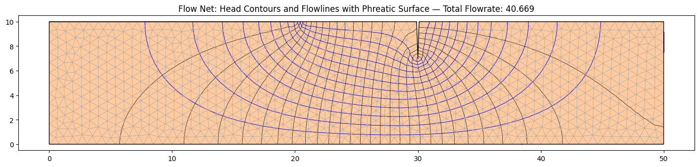
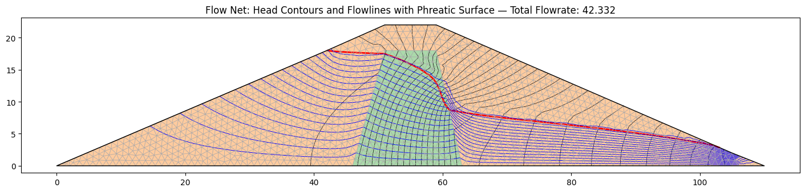
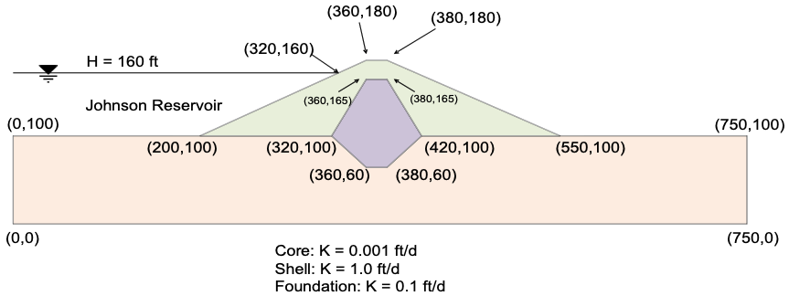
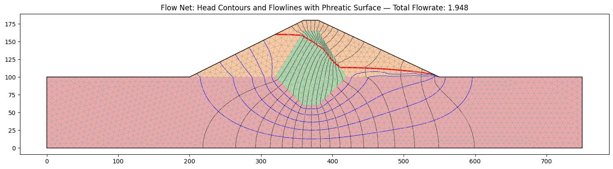

# Sample Problems - Seepage Analysis

## 1. Basic Analysis

This notebook is for running basic seepage analysis without a slope stability analysis.

The following sample problems can be used with this notebook

### (a) Sheetpile with Clay Blanket

Saturated problem with a partially penetrating sheetpile and a clay blanket. Should have upstream head BC = 13m up 
to the tip of the blanket. Downstream head BC = 10m. The profile line should follow th edge of the sheetpile (down 
and then back up) with a small gap to ensure that there is a crack in the resulting mesh. 

The following Excel file illustrates how the inputs should be structured. Since this is a fully saturated problem, 
the kr0 and h0 material parameters are ignored. 

Sample excel template for testing: [xslope_clay_blanket.xlsx](files/xslope_clay_blanket.xlsx)

The solution should look something like this:

{width=1200px}

### (b) Earth Dam with Core

The following diagram illustrates a simple earth dam with a clay core and a granular shell:

This problem requires an upstream head BC, a small downstream head BC, and a downstream exit face BC from the crest 
of the dam down to the tailwater. To build the input file, the following list of coordinates can be used:

In this case, the solution is partially saturated, so the kr0 and h0 parameters must be specfied for each material. 
The following Excel file contains a complete set of inputs for this problem:

[xslope_earth_dam1.xlsx](files/xslope_earth_dam1.xlsx)

The solution should look something like this:

{width=1200px}

### (c) Johnson Reservoir

This is another earth dam problem with a shell, a core, and a foundation. 

In this case, there is an upstream head BC = 160 ft and a downstream head BC = 100 ft on the flat part of the 
downstream foundation. The entire back side of the dam is an exit face BC. Again, this is a partially saturated problem.

The following file illustrates how to prepare the inputs:

[xslope_johnson_res.xlsx](files/xslope_johnson_res.xlsx)

The solution should look something like this:

{width=1200px}

### (d) Earth dame with core and filter

This problem has the following cross-section:

In this case, there is a single upstream head BC = 60ft and the entire backside of the dam is an exit face BC. 

The following Excel file contains the problem inputs:

[xslope_earth_dam2.xlsx](files/xslope_earth_dam2.xlsx)

Hey Norm.