# Running Analyses

Studio runs the same LEM, seepage, and FEM analyses as the `xslope` library, each
behind a run-options dialog. Long solves run on a background thread, so the window
stays responsive, with live output in the [Log pane](interface.md#the-log-pane)
and a Cancel button.

Pick the analysis type with the **Mode** selector, then click **Run** (its label
follows the mode: **Run LEM…**, **Run Seep…**, **Run FEM…**).

---

## Limit equilibrium (LEM)

In **LEM** mode, **Run LEM…** opens a dialog with:

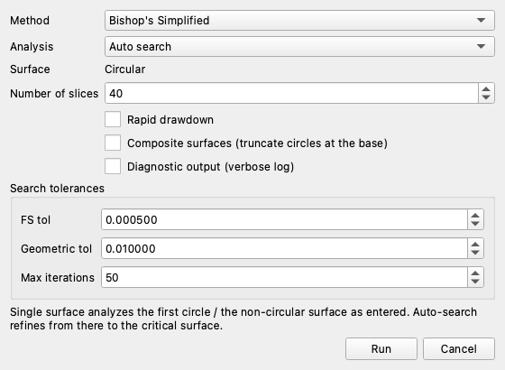

- **Method** — OMS, Bishop, Janbu, Corps of Engineers, Lowe & Karafiath, Spencer,
  or Morgenstern–Price.
- **Analysis** — single surface or automated search. (Probabilistic
  **reliability** analysis has its own toolbar button — see
  [Reliability analysis](#reliability-analysis) below.)
- **Surface** — circular or non-circular (shown only when the file has both).
- **Number of slices**, the **rapid drawdown** flag, and a **diagnostic** toggle.
- **Composite surfaces** — lets a circle deeper than the bottom of the model be
  truncated at it and run along the base between the two crossings (see
  [Composite Failure Surfaces](../lem/overview.md#composite-failure-surfaces)).
  Off by default, and only available for circular surfaces. Turn it on when the
  base of the model is a real impenetrable boundary — bedrock, or a weak seam
  resting on it — because the critical mechanism there follows the base and no
  ordinary circle can reach it. Leave it off when the bottom of the model is
  simply how deep you chose to look.
- **Grid search** — seeds the circular search from an automatic
  grid-and-tangent sweep instead of (only) the circles sheet (see
  [Grid Seeding](../lem/search.md#grid-seeding-global-search)). Off by default,
  available for circular auto-search. Turn it on to protect
  against the local-minimum trap of a single starting circle — a seed in the
  wrong family can converge 20% or more too high with no warning — or when you
  have no idea where the critical circle is (the circles sheet may even be
  empty). It reports the most critical surface anywhere in the model; leave it
  off to interrogate a specific mechanism with your own circles.
- **Search tolerances** (`fs_tol`, `tol`, `max_iter`) — enabled for the
  search-driven analyses.

The result depends on the analysis type:

| Analysis | Result tabs |
| --- | --- |
| **Single surface** | **LEM · Solution** — the surface with slices, base stresses, and thrust line. |
| **Automated search** | **LEM · Search** (all trial surfaces + critical + search path) *and* **LEM · Solution** (the critical surface). |

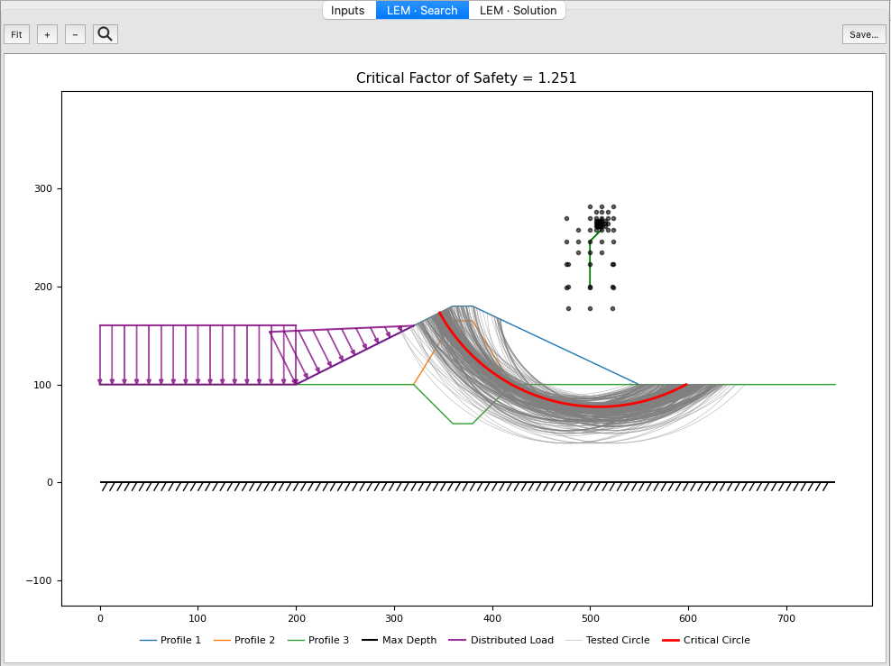

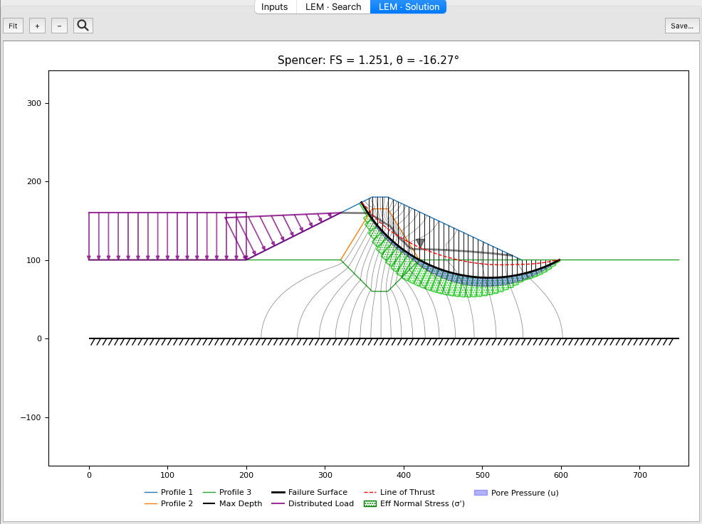

When the accepted solution carries admissibility defects — base tension on a
cohesionless slice, interslice tension, or a line of thrust that leaves the
slices — an amber strip across the top of the **LEM · Solution** view lists
them, so an inadmissible FS is never mistaken for a clean success:

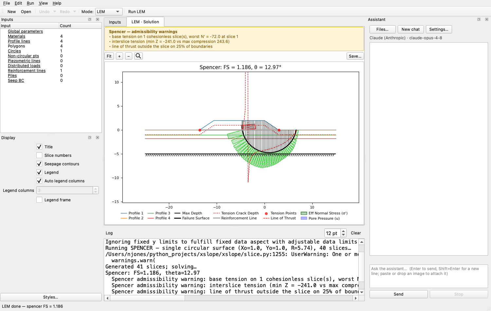

The warnings never change the factor of safety — they say the internal force
distribution behind it is strained, and not all of them are equally alarming —
see [Interpreting the Admissibility
Warnings](../lem/spencer.md#interpreting-the-admissibility-warnings). A clean
solution shows no strip.

Both circular and non-circular surfaces are supported for single solves and
searches. Search iteration progress streams to the Log pane, and a search can be
**cancelled** from the status bar.

---

## Parametric study

A second entry point sits beside Run — **Parametric…** — on both the **Run menu**
and the main **toolbar**, in all three modes (LEM, Seepage, FEM). It is available whenever
a model is open — in Seepage and FEM mode it additionally needs a built mesh, exactly like
Run — and is disabled while another analysis is running. Every version of it drives the
same sweep engine as the library — see
[Parametric Studies](../parametric/index.md) for the engine, and the
[`/xslope` skill](../usage/claude/index.md) for the scripted recipes.

One dialog covers three study modes, chosen by its **Mode** selector — **Sensitivity**,
**Design**, and **Back-Analysis**. In **LEM** three controls are shared by all of them:
**Method** (any of the seven LEM methods), **Number of slices**, and a **Parameter** picker —
a **Material** dropdown (each material plus a *k_seismic (global)* entry) and a **Property**
dropdown listing that material's option-aware sweepable fields (both drawn from the engine's
`list_params`). A **Re-search the critical surface at each step** checkbox applies throughout:
on by default — the honest setting, since the critical surface moves as the parameter changes
— and off re-solves the entered surface only (much faster, but right only for that prescribed
surface).

**Sensitivity** sweeps several parameters and visualizes how FS responds. A **Plot type**
selector chooses the view — a **tornado** (the default), **scaled-sensitivity bars** (with a
**Scaling** sub-choice: elasticity, per-1%, or per-σ), a **spider** plot, and — only when the
model carries reliability standard deviations — a **variance Pareto** and a **Monte Carlo rank
correlation** (with an **MC samples** count). The tornado, scaled, and spider plots sweep the
parameters listed in the table; the variance and rank plots instead use every σ-carrying
material automatically. The plots themselves are shown, with worked examples, on the
[Sensitivity](../parametric/sensitivity.md#sensitivity-plots) engine page.

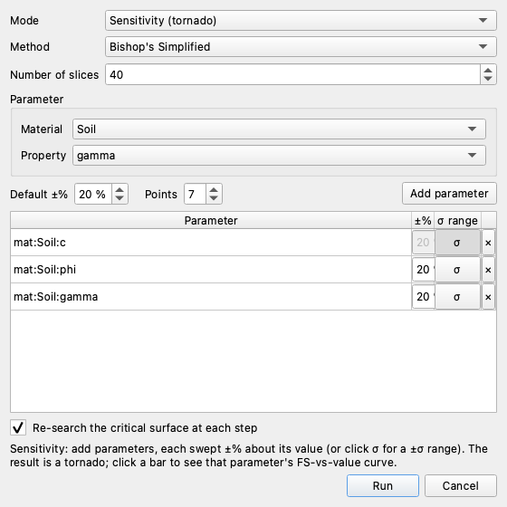

- A **Default ±%** and a **Points** count (points per parameter's FS-vs-value curve; the
  tornado uses only the curve's two endpoints, the spider draws the whole curve).
- **Add parameter** appends the currently picked material/property to the table. Each row
  shows the parameter reference, an editable **±%** overriding the default for that row, a
  **σ** button, and a remove (✕) button.
- The **σ** preset swaps that row's ±% range for a ±one-standard-deviation range built from
  the model's reliability `sigma_*` columns — the same standard deviations the
  [reliability analysis](../reliability/index.md) uses — so a sweep can mirror a reliability
  input band with one click. The button is disabled for a property that carries no `sigma_*`.

**Design** sweeps the one picked parameter toward a target FS:

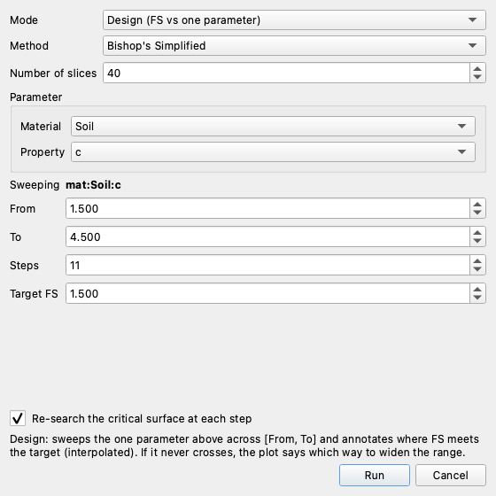

- **From** / **To** bound the swept value (seeded to ±50% of the current value the first time
  you pick a property), **Steps** sets the number of solves, and **Target FS** is the factor
  of safety to locate.

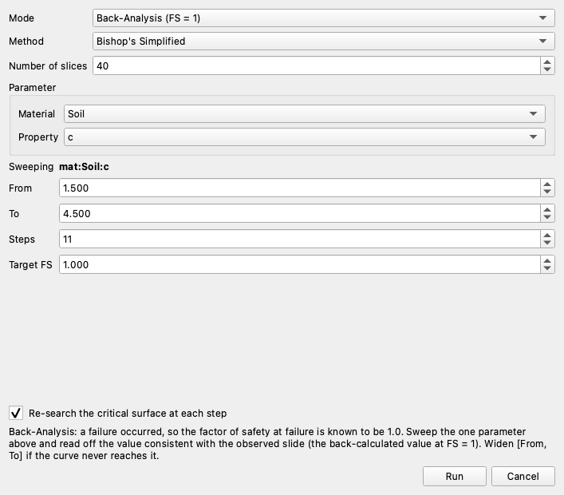

**Back-Analysis** is the same single-parameter sweep as Design, framed for a failure
investigation: because a slide has occurred, the target defaults to **FS = 1.0**, and the
result is read as the parameter value consistent with the observed failure (the
back-calculated strength, most commonly). The controls are identical to Design.

### Running and cancelling

Clicking **Run** launches the sweep on a background thread, so the window stays responsive.
The progress bar tracks each solve (`done/total`, with the current swept value echoed in the
status bar), the sweep log streams to the [Log pane](interface.md#the-log-pane), and the
status-bar **Cancel** button aborts cooperatively — the in-flight solve finishes, then the
sweep stops and the app is left consistent, with no partial result stored.

### Results

**Sensitivity** opens a **Sensitivity** tab with the selected plot. For the default
**tornado** — one horizontal bar per parameter, widest on top, with the base-case FS drawn as
a labelled vertical reference line:

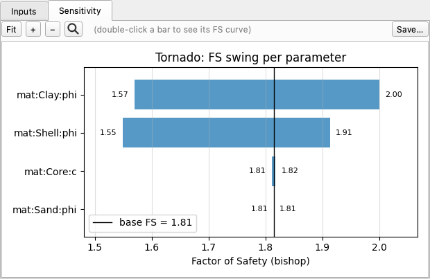

On the tornado, **double-click a bar** to open a companion **Sensitivity · Curve** tab
showing that parameter's full FS-vs-value curve (the base case marked, and any
critical-surface jump drawn as an open circle):

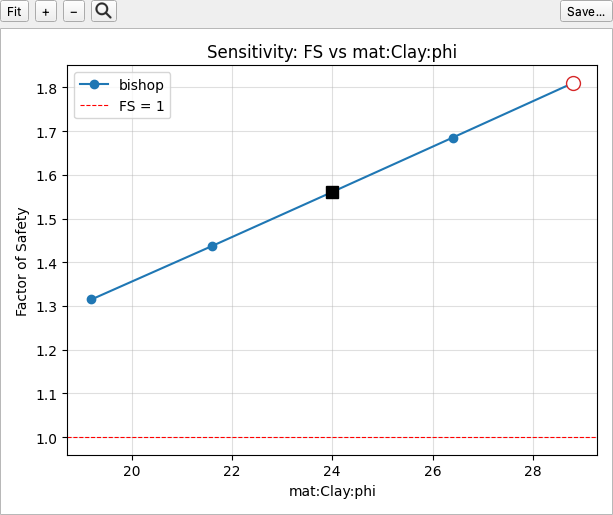

The other plot types render into the same **Sensitivity** tab — the scaled-sensitivity bars,
the spider plot, the variance-contribution Pareto, and the Monte Carlo rank-correlation bars
(the [Sensitivity](../parametric/sensitivity.md#sensitivity-plots) page shows each with a
worked example). The double-click click-through is a tornado affordance; the other plots do
not offer it.

**Design** opens a **Design** tab with the FS-vs-value curve, the FS = 1 and target-FS guide
lines, and — when the target is bracketed — the interpolated crossing marked with a green
diamond and annotated *property = value for FS = target* (a **Back-Analysis** run renders the
same tab, with the target at FS = 1.0):

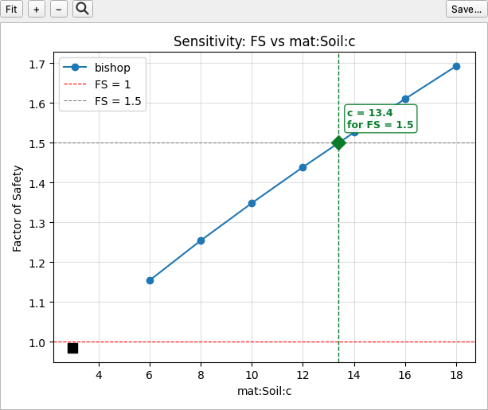

When the swept range never reaches the target, the result is honest about it: no crossing is
drawn, and an amber note reports the FS span and which way to widen the range — the GUI face
of the engine's
[never-extrapolate discipline](../parametric/design.md#honest-about-misses):

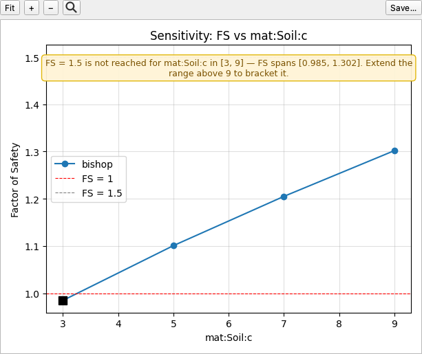

### Sweeps in FEM and Seepage mode

The Parametric dialog has a version for every mode. In **LEM** it sweeps the
limit-equilibrium analyses, and the swept output is the factor of safety. In **FEM**
each swept point is a full SSRM solve (output: factor of safety) — expect minutes per
step, so it runs in the background and is cancellable. In **Seepage** the output is
the **total discharge q** through the section. FEM and seepage sweeps run on the mesh,
so build one first. The variance Pareto and Monte Carlo rank plots reuse the LEM
Taylor-series and Monte-Carlo reliability, so they are offered only for an LEM study
that carries sigmas.

The dialog's solver rows follow the app mode: in **FEM** they become the SSRM knobs
(`F_min` / `F_max`, tolerance, failure criterion), and in **Seepage** they become the BC
set and convergence tolerance, with the design target a discharge **q** rather than an FS:

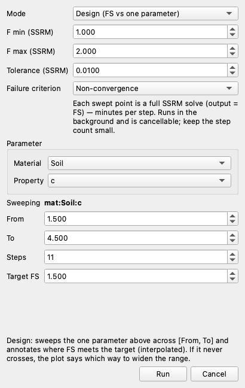

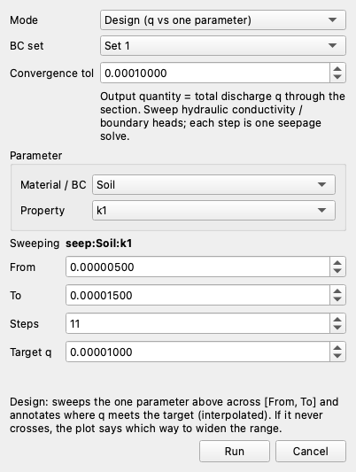

---

## Reliability analysis

A **Reliability…** button sits beside **Parametric…** on the **Run menu** and the
**toolbar** — its probabilistic sibling. Where the Parametric study answers
deterministic what-ifs, Reliability turns the material standard deviations (the
`s(·)` columns of the mat sheet) into a reliability index **β** and a **probability
of failure**. It is available in **LEM** and **FEM** modes (not Seepage); the FEM run
needs a built mesh, like Run.

The dialog offers a **Method** selector with two engines:

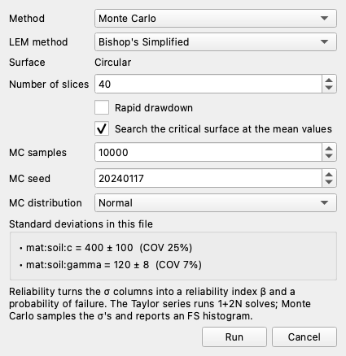

- **Taylor series (TSPM)** — the mean-value factor of safety plus a ±σ perturbation
  of each uncertain parameter (`1 + 2N` solves). Available in both modes; in **FEM**
  each factor of safety comes from an SSRM solve.
- **Monte Carlo** — samples every uncertain parameter and evaluates the factor of
  safety of each realization on a fixed surface, reported as an FS histogram. Monte
  Carlo needs ~10⁴ solves, which is affordable with a limit-equilibrium solve but not
  with the finite-element SSRM, so it is **disabled in FEM mode** (a one-line note
  explains why, and FEM reliability stays on the Taylor series):

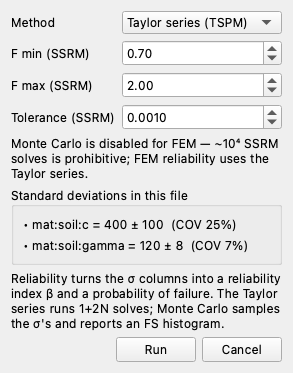

Below the engine controls, a read-only **Standard deviations in this file** summary
lists every `s(·)` column with its value, σ, and COV, so you can confirm what the run
will vary. **LEM** adds the solver method, surface, slice count, rapid-drawdown flag,
and a *search the critical surface at the mean values* toggle; **Monte Carlo** adds an
**MC samples** count, a **seed** (fixed by default, so the result is reproducible), and
a normal / lognormal **distribution** choice. **FEM** shows the SSRM `F_min` / `F_max`
bracket and a tight reliability tolerance. Settings are remembered for the session.

The run reports β, the probability of failure, and the mean / σ of the factor of
safety in a summary, with the per-parameter table in the Log pane. The result view
follows the engine:

| Engine | Result tab |
| --- | --- |
| **Taylor series (LEM)** | **LEM · Reliability** — the most-likely-value surface with the F⁺/F⁻ perturbation surfaces. |
| **Monte Carlo (LEM)** | **Reliability · MC** — the FS histogram with the FS = 1 line, the mean, and fitted normal / lognormal overlays (a display-panel toggle). β in both conventions and the probability of failure are in the title. |
| **Taylor series (FEM)** | **FEM · Results** — the deformation at the most-likely values; β and the probability of failure are in the run summary. |

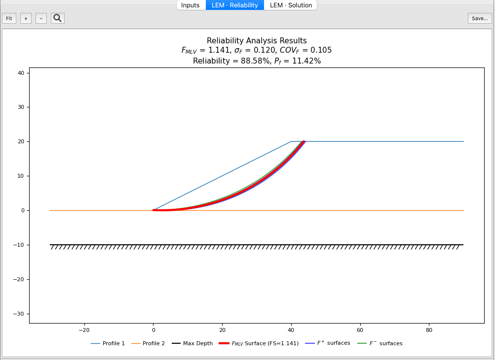

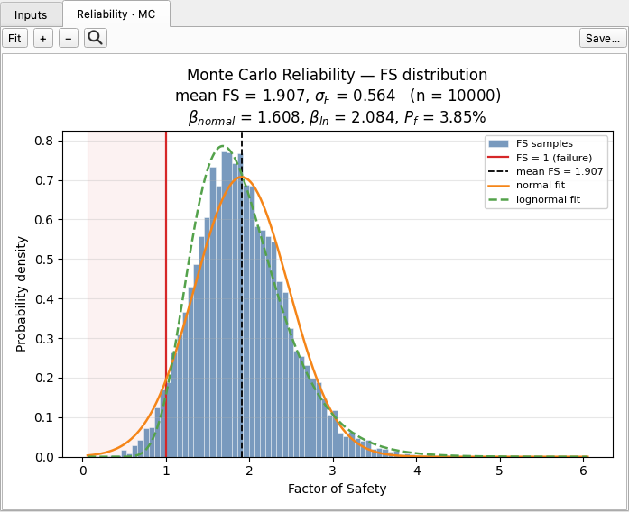

The engines are the same ones the library exposes — `reliability` (the front door),
`reliability_taylor`, `reliability_mc`, and `reliability_fem`; see
[Reliability Analysis](../reliability/index.md) for the theory and worked examples.

---

## Building a mesh

Seepage and FEM run on a finite-element mesh, which you build explicitly. In
**Seepage** or **FEM** mode, **Build Mesh** opens a dialog with:

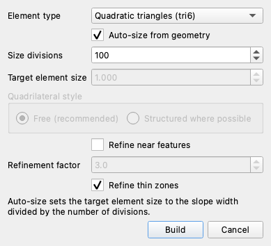

- **Element type** — `tri3`, `tri6`, `quad4`, `quad8`, or `quad9`.
- **Target size** — entered directly, or auto-sized as the slope width divided by a
  number of divisions.
- **Refine near features** — off by default. When checked, elements shrink near model
  features (reinforcement/pile lines, crack tips, thin material zones) and grow back to
  the target size away from them; the **Refinement factor** spinbox (default 3.0) sets
  the local size to *target size ÷ factor*. Leaving it off builds exactly the mesh
  earlier versions did. Refinement is detected automatically from the geometry — there
  is nothing to place by hand. (Selecting individual feature classes is available in the
  Python API via `refine_features`; the dialog refines near all of them.)

The mesh is built on a background thread (it includes reinforcement and pile
constraint lines, so it serves FEM too), shown in a **Mesh** tab, and written to a
`{stem}_mesh.json` sidecar. Seep/FEM **Run** stays disabled until a mesh exists; a
geometry edit that invalidates the mesh clears it and re-gates Run.

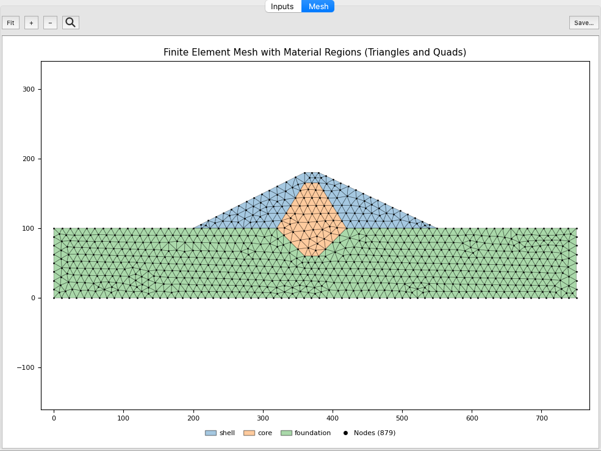

Mesh generation uses **gmsh**, which is installed by the `fem` extra
(`pip install "xslope[gui,fem]"`) — see [Installation](index.md#installation).

---

## Seepage

In **Seepage** mode, **Run Seep…** opens a dialog with just the solve parameters:
the **BC set** (set 1, set 2, or both — the extra choices appear when the file
defines a second set) and the **convergence tolerance**. Display choices — the
plotted variable, contour levels, flow lines, vectors, fill, the phreatic
surface — are not run options; they live on the
[Display panel](#display-options-per-view) of the solution view and re-render
the cached solution without re-solving.

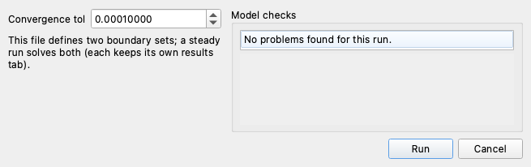

The run produces two tabs — **Seep · Data** (mesh + boundary conditions) and
**Seep · Solution** (the chosen variable, contours, phreatic surface, flow lines /
vectors) — and writes the solution to `{stem}_seep.csv` (`_seep2.csv` for BC 2).
The convergence trace streams to the Log pane. Each BC set keeps its own tab pair,
so rapid-drawdown problems show BC 1 and BC 2 together.

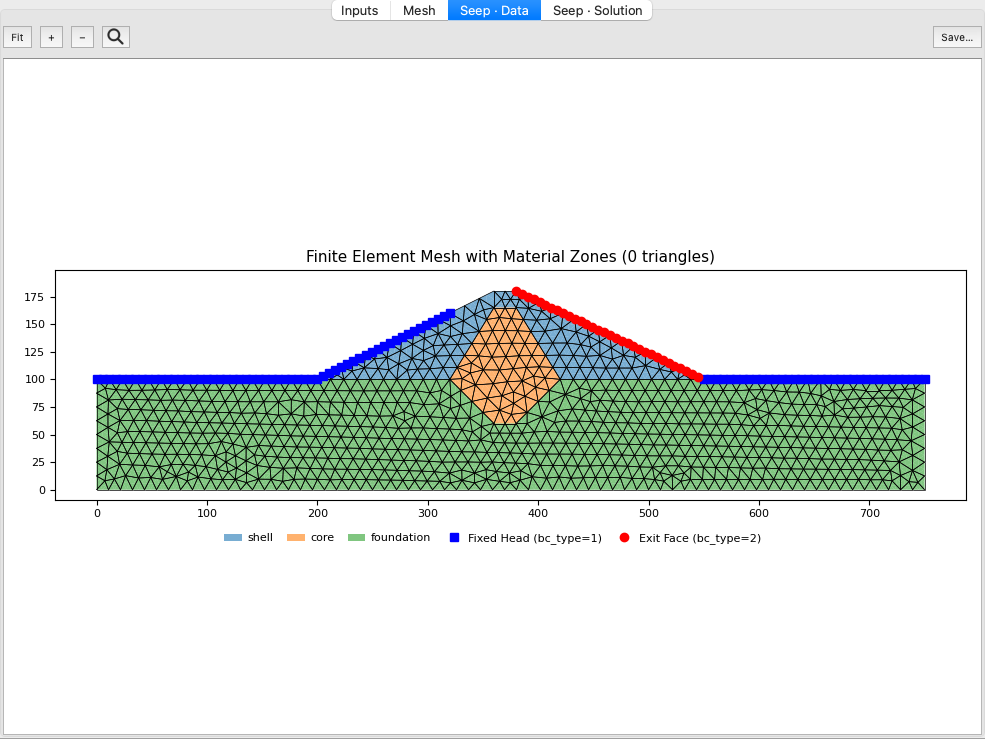

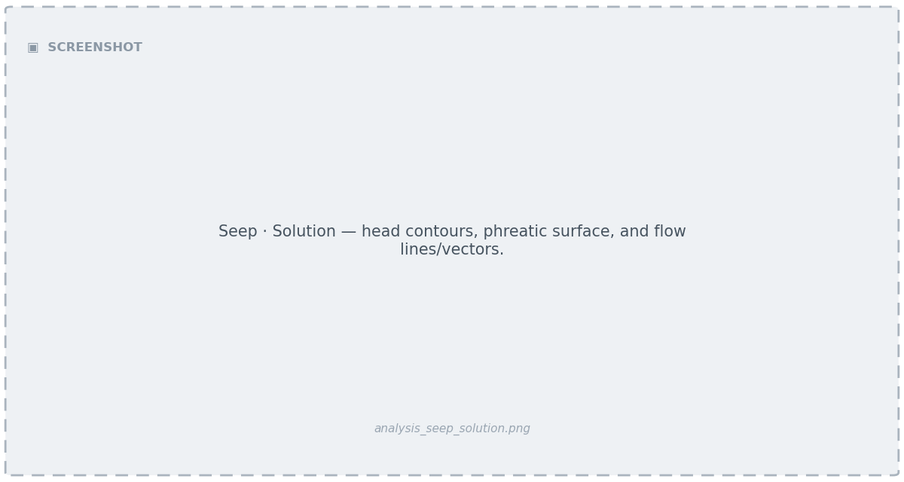

---

## Transient seepage

When the open file carries a **tseep** sheet (a transient-seepage time series —
see the [Input Template](../usage/input_template.md)), the **Run Seep…** dialog
grows a **Run type** selector with a **Transient (time-dependent)** choice
alongside **Steady**. A transient solve marches the variably-saturated flow
equation through time and saves a sequence of frames, each a full seepage
solution at one instant. The theory — the storage formulation, time-stepping, the
submerged-only boundary rule, and the initial condition — is on the
[Transient Seepage](../seep/transient.md) page, whose
[Studio](../seep/transient.md#studio) section walks the same workflow from the
theory side.

Because a transient run drives the flow with BC set 1's time series, the **BC set**
selector disables for it. The run's other parameters — the duration, save schedule,
rapid-drawdown stage times, and the time series themselves — are model inputs, edited
under **Inputs → Transient** (the [Transient editor](editing.md#transient-seepage)),
so the dialog carries no stage fields, only a caption pointing there.

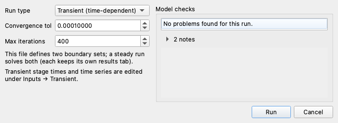

Because the march covers a known duration, the run reports **determinate progress** —
the status bar's progress bar tracks the simulated-time fraction (`t / duration`) —
and a **Cancel** button beside it stops the march cleanly; a cancelled run stores no
partial result and returns the UI to idle.

The run produces a single **Seep · Transient** tab that shows one frame at a time
through the *same* solution renderer as the steady **Seep · Solution** view — so
contours, flow lines, velocity vectors, the phreatic surface, and the colorbar all
look identical. Each frame's title reads **Seepage Solution — t = … ** with a smaller
second line carrying the frame's boundary **Inflow / Outflow** (they differ under
transient storage exchange). A pure storage-release frame — a drawdown instant with no
through-flow — has no flow net, so its flow lines are omitted and the second line
reads *no through-flow — flow lines undefined* instead. Along the bottom of the plot
sits a **play bar**:

- **Transport buttons** — first, previous, play/pause, next, and last frame.
- A **frame slider** to scrub the saved frames.
- A **t =** readout that shows the current frame time and doubles as a
  **jump-to-time** entry — type a time, press Enter, and the view snaps to the
  nearest saved frame.
- A **Speed** selector (0.5× – 4×) for playback, which advances the frames in order.

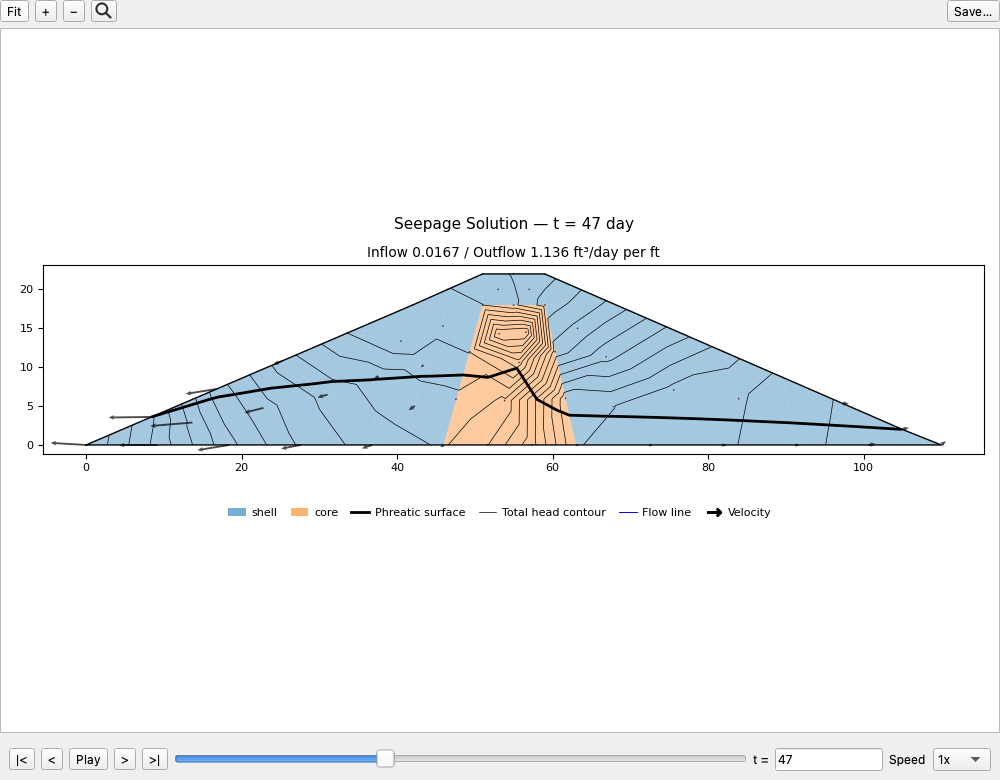

The frame bundle is written next to the model as a `{stem}_tseep.csv` (plus a
`{stem}_tseep_meta.json` ledger) and restored into the Seep · Transient tab on the
next Open, so a saved transient run reloads without re-solving. Its
[Display panel](#display-options-per-view) is the seep-solution panel tailored for a
frame series: **Water levels** default on (the pool visibly drops as it plays), and
the flow-net-only **Flow lines** and **Base material** controls are omitted — a
transient state has no flow net (see the note below). Changing an option re-renders
the shown frame.

An **LEM** or **FEM** run consumes the selected frame: with `u = seep`, the play
bar's current frame supplies the pore pressures for a solve at that instant. A
**rapid-drawdown** LEM run with both stage times set (under Inputs → Transient)
instead stages the `stage_1` and `stage_2` frames into the drawdown analysis. See
[Rapid Drawdown from a Transient Solution](../lem/rapid.md#transient-solution) for
how the staged frames enter the three-stage calculation.

---

## Finite element (FEM)

In **FEM** mode, **Run FEM…** offers a **single trial** or an **SSRM** run (the
Shear Strength Reduction Method), with `F` (or `F_min`/`F_max`), a tolerance, and
the failure criterion.

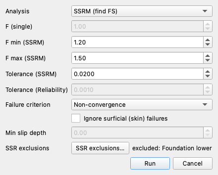

**Side BC** chooses what holds the left and right edges of the model. **Rollers** —
the default, and what every model that does not say otherwise means — fixes the
horizontal component and leaves the vertical free, so the truncated ground can still
settle under its own weight. **Fixed** clamps both components, which is what RS2 does
on its side boundaries. Fixed is a vendor-parity option rather than a better model: it
adds shear restraint the real ground does not have, and stiffens a domain truncated
close to the slope. The setting is part of how the model is restrained rather than
part of the strength reduction, so it applies to a single trial and an SSRM alike. Like
the other run options it is seeded from the open file (`main!D22`) and remembered for
the session, but a choice made here is not written back into the file.

For an SSRM run, the **SSR exclusions…** button opens a checkbox picker — one row per
material zone in the model, checked (included) by default:

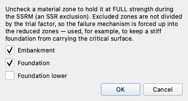

Unchecking a zone holds it at full strength through every trial factor instead of
dividing its c and tan(φ) like the rest of the model — RS2's per-material *Apply_SSR*
flag / SSR Exclusion Area. The mechanism is pushed up and out of an excluded zone, which
is useful for keeping a non-participating zone (a stiff foundation, say) from carrying
the failure, and for reproducing a vendor analysis that constrains the mechanism the same
way — see [SSR Exclusion Zones](../fem/overview.md#ssr-exclusion-zones) for the
engineering rationale and a worked comparison against RS2. The button and the summary
label next to it are gated to the SSRM analysis; the choice is a run option, not a model
property, so it lives with the rest of the dialog's settings (remembered for the session
to prefill the next run) rather than being saved into the input file.

An SSRM run also offers **failure-state capture**. Once the factor-of-safety
bracket resolves, **Capture failure-state mechanism** (on by default) re-solves
once just beyond the critical factor with the displacement cap off, so the
unconverged field develops the actual collapse *mechanism* the deformation and
displacement-vector figures render — rather than the diffuse settlement of the last
converged trial. **Capture margin** sets how far beyond critical that snapshot is
solved (a fraction of FS), and an optional **capture iteration budget** overrides
the automatic ceiling. Turning capture off skips the extra solve; the factor of
safety and the bracket are unaffected either way. The controls are gated to the
SSRM analysis, since a single trial has no bracket to capture beyond.

The run produces **FEM · Data** (mesh + boundary conditions + reinforcement) and
**FEM · Results** (deformation, shear strain, displacement vectors). An SSRM run
reports the factor of safety and can be **cancelled** mid-run. The solution is
exported alongside the model so it can be restored on the next Open without
re-solving — including the at-failure mechanism snapshot (a second CSV pair) and,
for a model with reinforcement or piles, the per-element structural results
(`{stem}_fem_reinf.csv` / `{stem}_fem_piles.csv`), so a reloaded solution redraws
the reinforcement-force and pile-shear plots without solving again.

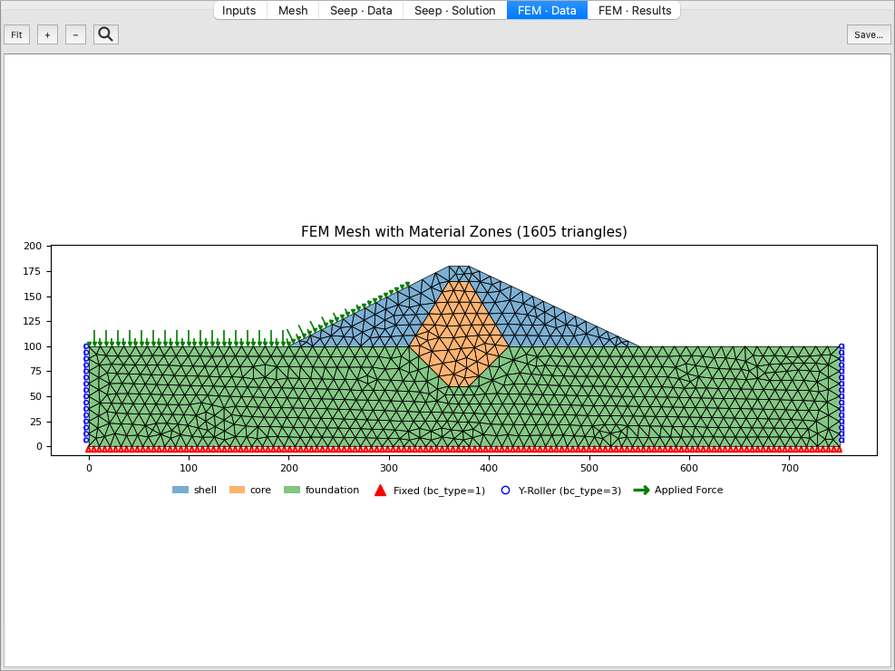

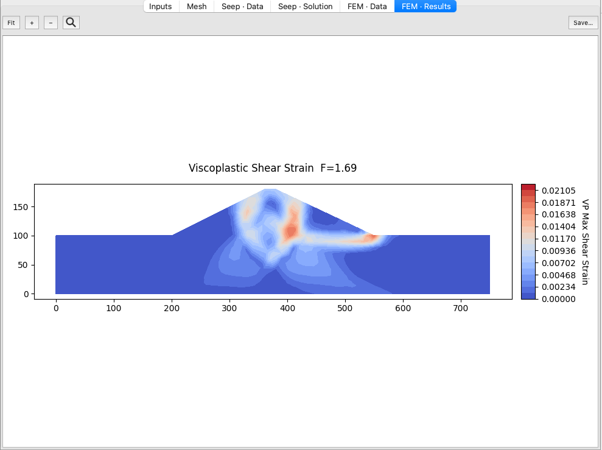

The FEM · Results [Display panel](#display-options-per-view) carries the controls
that shape these plots. When SSRM captured an at-failure mechanism, a **Field
state** switch chooses which field every panel renders — **At failure** (the
default: the developed collapse mechanism) or **Last converged** (the sub-critical
converged solution) — and it applies to the deformation, shear-strain, and
displacement-vector plots alike, so they always tell the same story. The
deformation plot adds its own controls: the **Original mesh** reference (dashed
outline, full grid, or off), the **Deformed color** of the displaced grid, a
**Deform** exaggeration percent, and an explicit **Displ. ×** multiplier that
overrides it. The displacement-vector plot can **color arrows by magnitude** (with
a colorbar) instead of solid black.

---

## Display options per view

Each result view has its own **Display** panel (in the left dock) exposing the
options the underlying plot accepts — slice numbers and seep contours on the LEM
solution; nodes / labels / padding on the mesh; variable, levels, vector scale,
flow-line toggles, and a **Water levels** overlay (each head/reservoir boundary's
level for the shown frame) on the seep solution; plot type, deformation controls, and
the converged/at-failure **Field state** switch on FEM results; legend column layout
on every view. Changing an option re-renders the
**cached** result instantly — there's no re-solve. See
[The Display dock](interface.md#the-display-dock).

One option is steady-only: **Flow lines**. A flow net requires divergence-free
through-flow, so it exists only for a **steady** seepage solution; a **transient**
frame is a storage-release state with no stream function, so its Display panel omits
the **Flow lines** and **Base material** controls and turns **Water levels** on by
default. Read a transient frame's flow direction with **velocity vectors** instead.
See [Transient outputs](../seep/transient.md#outputs).

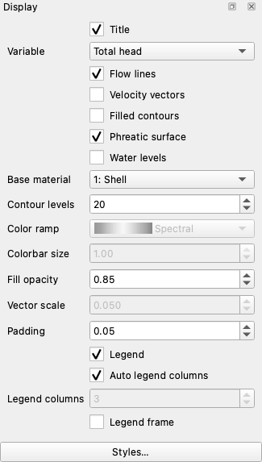

---

## Exporting views: images and DXF

Every canvas has a **Save…** button that exports the **current view**:

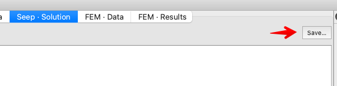

- **Image** — PNG, PDF, or SVG. PNG prompts for a DPI; vector formats don't. The
  figure is saved at its true inch size, so resolution is independent of the
  on-screen zoom.
- **DXF (rendered view)** — the drawn picture as a layered DXF, good for dropping
  into a CAD document. This is *lossy* as a re-import source; for that, use the
  structured geometry export below.

---

## DXF import and export

Studio exchanges model geometry with CAD through DXF.

**Export geometry** — **File → Export Geometry (DXF)…** writes the structured,
layered DXF: material zones on per-material layers, and profile lines, circles,
reinforcement, distributed loads, and piezo lines on reserved feature layers. This
is the clean companion the importer reads (distinct from the per-view *rendered*
DXF above).

**Import** — **File → Import DXF…** opens a wizard that lists every layer in the
drawing and lets you map each one to an input feature — material zone, profile
line, piezo line, distributed load, reinforcement, failure circles, or *ignore* —
with a material column for zones and profiles.

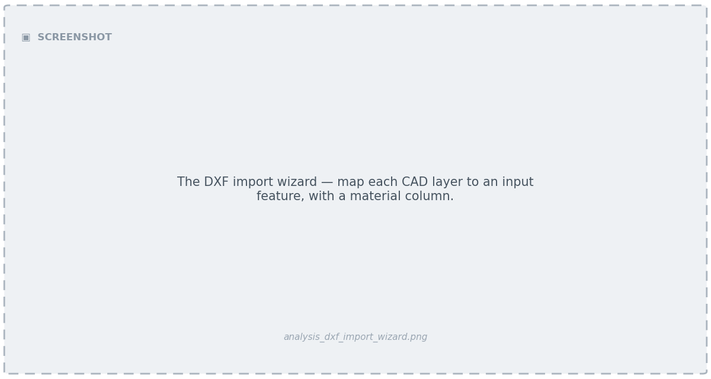

Defaults are seeded from xslope's own export layer names and the geometry kind, but
you can override anything, so a DXF drawn in external CAD with arbitrary layer names
maps just as well. Geometry populates the features; non-geometric properties (load
magnitudes, reinforcement strengths, material properties, circle depth) come in as
editable **placeholders** to fill in afterward. The import replaces the current
project (you're prompted to discard first) and is left unsaved so you can complete
it and Save As.

The layer naming and entity conventions are shared with the library's `xslope.cad`
module — see [DXF Import/Export](../usage/dxf.md) for the full layer table and format
details. Reading and writing DXF uses the **ezdxf** package, installed with the `gui`
extra; if it's missing, the import/export actions show an actionable install message.

---

## GeoStudio (SLOPE/W) import and export

Studio also exchanges whole models — not just geometry — with other slope-stability
packages: GeoStudio SLOPE/W in both directions, and Rocscience Slide2 and RS2 as imports.

**Import** — **File → Import GeoStudio (SLOPE/W)…** reads a `.gsz`. Unlike DXF, there
is no mapping wizard to work through: a `.gsz` already knows what its geometry means, so
material zones, strengths, water conditions and the seismic coefficient all arrive
identified. The one prompt is **which analysis** to import, because a GeoStudio file
usually holds several over the same geometry — and they can differ in *materials*, not
just in slip surface, so the choice changes the model you get:

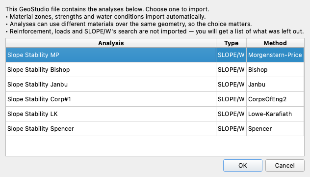

The other two vendor importers follow the same shape. **File → Import Slide2…** reads a
Rocscience Slide2 model (`.sli` / `.slim` / `.slmd`) and asks the same one question with a
scenario chooser, since a `.slmd` routinely bundles several scenarios over the same
geometry:

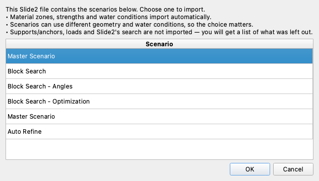

**File → Import RS2 (.fez)…** reads a Rocscience RS2 finite-element model. A `.fez` holds
exactly one model, so the only prompt is the file picker; geometry, materials and water
conditions import directly — including RS2's distributed and ponded-water loads, which
arrive as XSLOPE distributed loads with the
[Direction](../usage/input_template.md#worksheet-dloads) RS2 gave them: a *normal* load
perpendicular to the loaded surface, a *vertical* one (a dead-weight surcharge) straight
down. A load RS2 aims straight down by *global angle* is vertical too, and crosses only
when the model's own solved edge tractions confirm which way it points — RS2 writes that
same downward load two contradictory ways, so the file's solved answer settles it, and a
model that was never solved leaves the load out rather than guessing. Materials bring
their Young's modulus and Poisson's ratio across as well, for the FEM. Whatever RS2
defines that cannot cross (its SSR settings, joints, reinforcement, line loads, and loads
at an arbitrary angle or reversed to pull away from the boundary) comes back in the
post-import notes dialog, named one by one.
Each material's pore-pressure source (piezometric line,
ru ratio, pressure grid, or a groundwater analysis) is read per material — see
[the mat worksheet's pore-pressure options](../usage/input_template.md#worksheet-mat) for exactly what
each source becomes and which ones import as zero with a warning. RS2's stability
result is an SSR field rather than a slip surface, so the import never carries a failure
surface — you define circles afterward.

**Export** — **File → Export to GeoStudio (SLOPE/W)…** writes the current model out as a
`.gsz`. It needs a polygon-based model (material zones), since a profile-line model has
no regions to map onto.

Both directions replace nothing silently: whatever cannot cross the format boundary —
SLOPE/W's search definition, reinforcement, piles, loads, non-Mohr-Coulomb strengths — is
listed in a notes dialog and in the Log pane, so you know exactly what to re-create by
hand.

Units are one thing a `.gsz` does not carry: the format has no unit-system field, so
XSLOPE infers it from the unit weight of water and refuses to guess when that value is
neither metric nor imperial. See
[GeoStudio Import/Export](../usage/geostudio.md) for the full mapping table, the
per-analysis materials wrinkle, and the limits of export.
