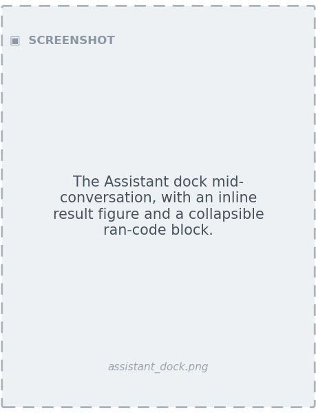
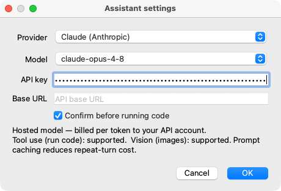
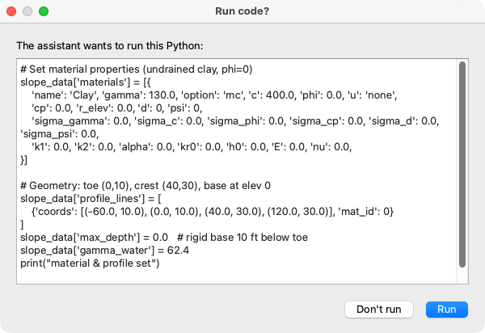
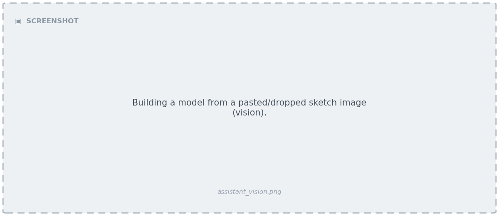

# AI Assistant

Studio includes a dockable **chat assistant** that drives the app and the engine
with natural language (and images). It goes well beyond the standalone
[Claude Code skill](../usage/claude/index.md): rather than only building an input
file from a sketch, it can perform *any* interaction with the project and the
`xslope` Python API — build or edit inputs, run analyses, script parameter studies,
post-process results, and explain or debug what happened.

Examples of what you can ask:

- *"Add a piezo line 2 ft below the crest and re-run Spencer."*
- *"Vary the slope angle from 20° to 30° and plot FS vs. angle."*
- *"Why did the SSRM not converge?"*
- *"Build this slope from the attached sketch."* (with an image)



---

## Ask it anything

The assistant is also a **tutor**. Not every request is a model: you can ask why a
method behaves the way it does, whether XSLOPE can handle a particular case, where
an input lives, or what a result means — and it answers in conversation, without
building or running anything unless the question needs it. Theory and how-to answers
end with a link into this documentation, and links in the transcript **open in your
browser**, so a chat reply is a starting point rather than the last word. When a
question matches a topic the [verification corpus](../verification/index.md) covers,
it points at the worked problems too.

*The exchanges below are representative, not screenshots. Wording varies with the
model you select; answers are grounded in this documentation and in the model's own
knowledge, and are shortened here to show the pattern rather than to stand in for
the answer you will get.*

**Theory** — *"Why does raising the water table lower my factor of safety?"*

> Strength on the slip surface is effective-stress based: τ_f = c' + (σ_n − u)·tan φ'.
> Pore water carries part of the normal load but contributes no shear strength, so
> raising u shrinks the frictional term. Take a slice with σ_n = 2000 psf, c' = 100 psf,
> φ' = 30°. Dry (u = 0): τ_f = 100 + 2000(0.577) = 1255 psf. Put the water table 10 ft
> above that slice base (u = 62.4 × 10 = 624 psf) and τ_f = 100 + 1376(0.577) = 894 psf
> — 29% less resistance, with the driving weight essentially unchanged. Cohesion is
> untouched, which is why a φ = 0 undrained analysis barely responds to the water table
> at all.
>
> Slice forces and the full derivation:
> [LEM overview](https://xslope.readthedocs.io/en/latest/lem/overview/)

**Capability** — *"Can I run Bishop on a non-circular surface?"*

> No, and it isn't an implementation gap. `capabilities(slope_data)["lem_method"]["bishop"]`
> comes back unavailable with the reason: Bishop sums moments about a circle center, so
> it needs a circular surface — the same is true of OMS. The other five methods (Janbu,
> Corps of Engineers, Lowe & Karafiath, Spencer, Morgenstern-Price) take either family.
> Spencer is the usual choice on a non-circular surface, since it satisfies force and
> moment equilibrium both.
>
> Theory: [Bishop's method](https://xslope.readthedocs.io/en/latest/lem/bishop/)

**How-to** — *"Where do I set a tension crack?"*

> **Global parameters** in Studio, or cells `main!D11` (crack depth) and `main!D12`
> (water depth in the crack) in the workbook; from a script,
> `slope_data['tcrack_depth']` and `['tcrack_water']`. It is a limit-equilibrium
> construction only — the finite element engine ignores it and represents tension
> constitutively, through the material tensile cutoff `t_cut`, so one file with a crack
> depth poses two different problems to the two engines. The input checks warn when a
> crack is entered but no failure surface intersects it while its water thrust still
> applies.
>
> Input checks:
> [preflight](https://xslope.readthedocs.io/en/latest/usage/preflight/)

**Worked problems** — *"How do I model a tieback wall?"*

> Each tieback is a line in the reinforcement table with `Type = tieback`, which presets
> the direction to **axial** (force along the bar, not tangent to the slip surface) and
> the application to **active** (an allowable force, not divided by F). Its capacity is
> the smallest of the bar tension `Tmax`, the pullout developed over the bond length,
> and the connection capacity at the wall face (`Tend1`); soldier piles or a facing that
> carry shear go in the piles table instead. Enter per-element capacities plus a spacing
> and the loader divides to per-unit-width.
>
> The verification corpus has worked tieback problems verified against published
> results:
> [VP49 — retaining wall, grouted tiebacks, soldier piles](https://xslope.readthedocs.io/en/latest/verification/rocscience/#vp49),
> [VP58 — tied-back wall in layered soil](https://xslope.readthedocs.io/en/latest/verification/rocscience/#vp58),
> [VP59 — tieback wall in sand with a drawdown water table](https://xslope.readthedocs.io/en/latest/verification/rocscience/#vp59).
> Theory:
> [reinforcement](https://xslope.readthedocs.io/en/latest/lem/reinforcement/)

**Interpretation** — *"Why did my FS drop when the reservoir drew down?"*

> Drawdown removes the water load that was helping hold the upstream slope up, but pore
> pressures inside a low-permeability fill do not dissipate at the same rate — the slope
> carries something close to its old pore pressures under the new, smaller external
> load. XSLOPE handles this with the three-stage Duncan-Wright-Wong procedure: stage 1
> recovers the pre-drawdown effective stresses on the slip surface, stage 2 computes FS
> after drawdown with undrained strengths derived from those stresses, and stage 3
> re-checks with drained strengths; the reported FS is the lower of stages 2 and 3. So a
> drop is the expected behavior, not a defect — what is worth checking is whether rapid
> drawdown applies at all, via the time factor T = c_v·t/D².
>
> Procedure and the T rubric:
> [rapid drawdown](https://xslope.readthedocs.io/en/latest/lem/rapid/)

---

## Getting the assistant

The assistant needs the provider library, which ships in the `ai` extra. How you get
it depends on how you installed Studio. In the **packaged app** (`.dmg` / `.msi`) the
provider library is bundled in the installer, so the assistant works out of the box
and there is nothing to add. **From Python / pip**, add the `ai` extra:
`pip install "xslope[gui,ai]"`.

Either way you still choose a provider and enter credentials in **Settings…**
(below). Without the library, Studio runs normally but the dock reports that the
dependency is missing. See [Installation](index.md#installation).

---

## How it works

The assistant is an **agent with code execution**, not a chatbot. Its core tool is
an in-process Python kernel: the model writes small Python snippets, and Studio runs
them with `xslope` imported and the **live project in scope** — `doc` (the project),
`slope_data` (its inputs), and `results` are all preloaded. Most requests reduce to
"write and run a little Python, show me the figure or number," exactly like the
notebook workflow.

The pipelines a request usually needs are preloaded as helpers, so the model calls
one rather than reassembling the engine by hand:

| Helper | What it does |
| --- | --- |
| `run_lem(search=True)` | One limit-equilibrium solve. `search=True` searches for the critical surface for that method, exactly as [Run LEM](analysis.md) does; `search=False` solves the surface already on the project. The method defaults to the one the **model** declares (the `main` sheet's LEM method, which is what the Run LEM dialog opens on), so the assistant and the dialog run the same method unless you name another. The result carries the surface it was solved on — `Xo`, `Yo`, `R`, `Depth`, and the `x_entry`/`x_exit` ends of the trace — and the run is stored where a dialog run is stored, so the results tabs show it and the report documents it. |
| `run_seep(bc=1)` | One steady seepage solve. The solved pore pressures are attached to the model, so a later stability run with `u = seep` reads them. |
| `run_tseep()` | The transient march, on the project's own transient sheet — the same run as [Run Seep](analysis.md) with **Transient** ticked. Its frames are stored where Studio stores them, so the **Seep · Transient** tab plays them and a stability run can read one. It hands back a march already loaded (a project opened with its `_tseep.csv` sidecar has one) rather than repeating it. |
| `run_lem(seep_time=t)` | One instant of that march as the run's pore pressure; with `rapid=True`, the transient sheet's two drawdown stages. Which instant was used is stated in the log. |
| `fs_vs_time()` | The factor of safety at every saved instant — the curve the **FS vs Time** tab shows, with its lowest point and the time it falls at. |
| `run_fem(analysis='ssrm')` | One finite element run — the SSRM factor of safety, or a single trial. Minutes, not seconds. |
| `generate_report(path=None)` | The [Analysis Report](reports.md), built and finished exactly as the Report dialog builds it — over every engine the session has solved, and stamped with the project file and its SHA-256 where the project has been saved. With no path it is written to the assistant's output folder as `<project>_report.docx`, so it opens from **Files…** with everything else the conversation produced. |
| `suggest_elastic('Clay')` | Soil-type `E` and `ν` for a material that carries none, classified from its strength. A last resort, never a substitute for a stated value. |
| `sensitivity()`, `design_sweep()`, `parametric_sweep()`, `reliability_*()` | The parameter-study and probabilistic families. |
| `corpus_index('rapid drawdown')` | Worked examples from the [verification corpus](../verification/index.md) matching a topic, with their page URLs. |

`run_seep`, `run_tseep` and `run_fem` build the mesh from the file's own declared
settings (`main!D18`, `main!D19`) when the project has none, so none of them needs a
mesh built first, and all attach their results where Studio attaches them — the
results tab opens as it would after a Run.

Because edits go through the same path as the editors, anything the assistant changes:

- renders **immediately** on the canvas,
- lands on the **[undo stack](editing.md#undo-and-redo)** as a labeled step
  (*"Assistant: materials, dloads"*), so you can revert it, and
- invalidates stale results/mesh just like a manual edit.

The assistant **builds into the live document**, not a file. Review the result on
the canvas, then persist it with **Save As**. (An empty project is opened
automatically if none is, so the first snippet works.)

### What it knows before it runs anything

Two things arrive with every conversation, so the assistant does not have to spend
model calls discovering them. The first is a **Studio reference** — the kernel and
every preloaded helper with its signature, the `slope_data` record schemas, the
modeling rules (extents, starting circles, water as loads, units), and the
documentation links — carried in the system prompt and served from the provider's
prompt cache after the opening call. The second is a **summary of your model**:
materials, geometry extents, the water definition, the failure surfaces, the load
and reinforcement counts, the analysis settings, and what has been solved so far.
That summary is given at the start of the conversation and refreshed the first time
you write after an edit has changed the model, so what the assistant is looking at
is never out of date and never has to be re-read out of `slope_data`.

The practical effect is that a question about the open model is usually answered in
a single snippet: compute, then answer.

### What a turn costs

Tokens are reported live under the input box, and the numbers are small enough to
plan around. A one-question turn against Claude Opus on a built model — *"What is
the factor of safety of this model with Spencer?"*, which runs a full critical-surface
search — measures **two model calls and about 26,000 input tokens** (roughly half of
them served from the prompt cache) for around 450 tokens of reply. The reference and
the model summary are what keep it there: the same question used to take six model
calls and roughly 356,000 tokens. Building a model from a sketch costs more, because
it is more turns; a long autonomous build is the case to watch, and the running
turn total is on screen while it works.

---

## Choosing a model

The assistant is **bring-your-own-model**. A **Settings…** button in the dock opens
a dialog to pick the provider and model and store credentials:

| Provider | Models offered | Notes |
| --- | --- | --- |
| **Claude** (Anthropic) | The current Claude family | Tool use + vision; prompt caching keeps the large system prompt cheap on repeat turns. |
| **OpenAI / GPT** | The current GPT family | Tool use + vision; the prompt prefix is cached server-side. |
| **Kimi** (Moonshot AI) | The K-series vision models (`kimi-k2.6`, `kimi-k2.5`, `kimi-k3`, `kimi-latest`) and the `moonshot-v1` vision previews | Tool use + vision, with server-side prefix caching, so it gets the full system prompt. |
| **Z.ai (GLM)** | The GLM-**V** models only (`glm-4.6v`, `glm-5v-turbo`, …) | Tool use + vision. The text GLMs are not offered — see below. |
| **Ollama** (local) | Vision models only (`llava`, `llama3.2-vision`, `gemma3`, `qwen2.5vl`, `minicpm-v`, …) | Runs on your machine — free, no API key, fully offline. Whether a given local model can run code depends on the model. |

**Every model on offer can read an image.** Building a model from a photograph or a
sketch of a cross section is one of the things the assistant is for, and a text-only
model turns that request into a conversation about what the picture shows. So a
provider whose API takes no images is not listed, and where a provider's catalogue is
mixed — Z.ai's text GLMs beside its V models, a local library that is mostly text —
the list is filtered to the part of it that can see, and the caption under the box
says so. The model box still accepts free text, so a text-only id can be typed in if
you want one.



API keys are stored in the **OS keychain** (not in plaintext), and the base URL is
configurable for Kimi, Z.ai and Ollama. The dock shows the active provider · model,
and a caption warns when the selected model can't (or may not) run code or accept
images, so the UI degrades gracefully.

**A local model with no tool calling** — many Ollama tags have none — has no
separate channel for asking Studio to run something, so it asks in its reply, by
marking the fence `run`:

````text
```python run
print(slope_data['max_depth'])
```
````

That block is executed and its output goes back to the model. A plain
`` ```python `` fence is prose and is only displayed: a signature quoted to
explain a call, or a snippet written for you to read, is never run. Every other
provider on the list uses tool calling, where the request to run a snippet is a
message of its own — so on those, code that appears in a reply is text, whatever
it looks like.

### Models

The model list is not fixed when Studio is installed. Opening the dialog — and
pressing **Refresh** — asks the selected provider for its own list of models,
using the key you have stored, and shows what comes back. If the provider can't
be reached, the list falls back to the last one it returned, and then to the
models this version shipped with, so there is always something to choose offline.
A caption under the box says which of the three you are looking at.

A curated set of recommendations is published alongside XSLOPE releases and read
at most once a day. It marks one model per provider as **recommended** — the one
a new install starts on — sorts a few good choices to the top with a one-line
label, and marks models the provider has superseded. Superseded models stay in
the list and can still be chosen.

The box also accepts free text: type any model id the provider takes, including
one released after your copy of Studio, and it is remembered like any other
choice.

---

## Every edit is checked

When the assistant changes the model, the change is validated before you see the
reply. Studio rebuilds the derived geometry and runs the same
[input checks](../usage/preflight.md) the Run dialogs use, then hands the findings
back to the assistant as part of its own result — errors and warnings both. The
assistant is required to resolve what comes back, or to tell you why it stands,
before it reports the model ready.

This matters most for the changes whose consequences are somewhere else. Correct
the base elevation of a model and the circles that were tangent to the old base
are now underneath the new one; nothing about editing that one field says so, and
the model would otherwise look finished until a run failed on it. The checks run
on the edit that caused it, so the stranded circles are named in the same reply.

Each finding is quoted in full once, in the first block with room for it: a block
quotes at most six paragraphs and names any others on a line carrying the command
that prints them, so nothing is filed as reported before it has been read. From
then on the block quotes what is new or has changed and names the rest by rule on
a single line — a long build on a model that carries standing faults does not
re-read the same paragraphs after every edit. Findings an edit can answer are the
exception: they stay quoted in every block until they are resolved. A finding
whose cure is an analysis rather than an edit collapses like the rest, onto a
line that keeps saying it is staged by that run. A new chat, or a newly opened
project, starts the reporting over.

A read-only question — anything that reads the model without changing it — skips
the checks entirely.

### How the assistant itself is tested

What a model does with a sentence of instruction cannot be settled by asserting
it, so the assistant is measured rather than asserted. A scored suite of
conversations (`tools/assistant_suite.py`) plays thirty tasks against real models
taken from the sample, tutorial and verification files — building from a written
description and from a drawing, editing geometry, loads, materials, reinforcement
and piles, running each engine, the parametric and reliability modes, answering
questions that change nothing, and diagnosing models broken on purpose — and
grades each one by reloading the workbook the conversation left behind and
re-solving it independently: a factor of safety it reported has to match a run
made without it, an edit has to be present in the saved file, a planted fault has
to be named while nothing sound is accused, and every number in the answer has to
be one a snippet actually printed. A second mode of the same tool (`--corpus`)
sweeps every workbook the project ships instead of thirty chosen tasks, asking
each one to run the analysis its file declares and grouping what comes back by the
input columns that file uses — piles, reinforcement, a tension crack, seepage
boundary conditions — so a weakness that shows on one kind of input reads as a
pattern rather than an anecdote. The suite's own plumbing is a standing check in
`run_tests.py`, where a dry run exercises the whole path — window, chat dock,
transcript, scoring — with canned replies and reaches no provider at all. A
recording run states its provider, model and autonomy in a store of its own rather
than in Studio's, so two runs at once neither collide nor leave anything of yours
changed.

---

## Autonomy: confirm vs. auto

Running model-written code is powerful and carries the same trust model as any
coding agent — the code runs as you, and can read and write files. Studio gives you
an **autonomy mode**, switchable in the dock:

- **Confirm** (default) — you review and approve each code run before it executes.
- **Auto** — the assistant runs code without prompting.



Every action is visible in the transcript as a collapsible "ran code" block, and a
**Stop** button halts the agent at any time. The kernel runs in Studio's own process,
so a snippet that never returns would otherwise take the window with it: one snippet
may run for **ten minutes** before it is stopped, and the assistant is told what
happened and left to try something narrower. The limit is generous because a real
SSRM run or a long sweep is minutes of honest work; raise or lower it with the
`ai/run_timeout` setting, or switch it off with a zero.

!!! warning "Network egress"
    Hosted models (Claude, OpenAI, Kimi, Z.ai) send your prompts and any
    attached images off your machine. **Ollama stays local.** Choose accordingly
    for sensitive work.

---

## Vision and chat UX



- **Images** — paste or drop an image into the chat (e.g. a hand sketch or a screen
  capture). Every model the dialog lists can read one.
- **Inline figures** — plots the assistant produces appear inline in the transcript.
- **Files** — everything else a snippet writes (a CSV, an exported drawing, a
  generated report) goes to one output folder for the session, is listed in the
  transcript as a link that opens it, and the **Files…** button opens the folder
  itself. A snippet's own working directory is that folder, so a plain
  `savefig('face.png')` lands there too.
- **New chat** — starts a fresh conversation and resets the kernel.
- **What it cost** — a line under the input reports the tokens the provider read and
  wrote: `this turn: 26,292 in (12,522 cached) / 443 out · session: 26,292 in / 443 out`.
  One agentic turn is several model calls and every one of them counts, so the turn
  figure keeps climbing while the assistant works. *Cached* is the part of the input
  the provider served from its prompt cache — a subset of the input count, not an
  addition to it. A new chat starts the count over; see
  [What a turn costs](#what-a-turn-costs) for the figures to plan around.
- Press **Enter** to send. The transcript renders the assistant's markdown —
  headings, tables, bullet lists and fenced code blocks all display as such, so a
  set of numbers arrives as a table rather than as rows of pipes. Equations
  arrive as plain text (`tan φ / tan β = 0.066`) — the dialect renders no math,
  so LaTeX written anyway is converted rather than shown as its source. Code the
  assistant *ran* and its output stay in their own monospaced **Ran code** block.

---

## Relationship to the Claude Code skill

The standalone [`/xslope` Claude Code skill](../usage/claude/index.md) is a
first-class, **file-first** workflow for the CLI or an IDE: it builds an `.xlsx`
input file from a description or a sketch and runs it from a script. Studio's
assistant is **document-first** — it populates the live `slope_data` of the open
project and never writes an input file, so the two carry different references and
neither is a subset of the other. They are two front ends to the same engine, and
which one fits depends on where you are working rather than on what you are asking
for.
