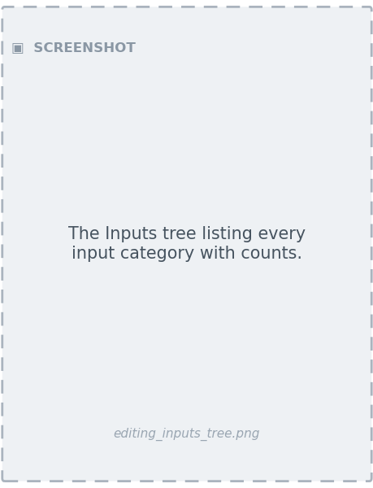
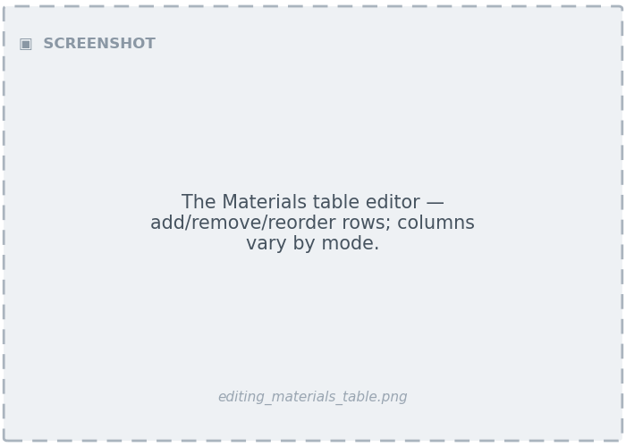
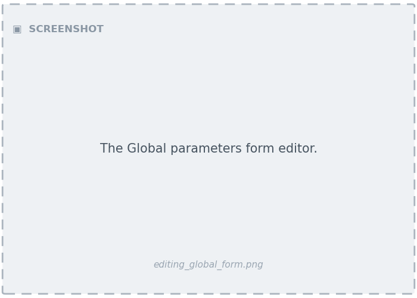
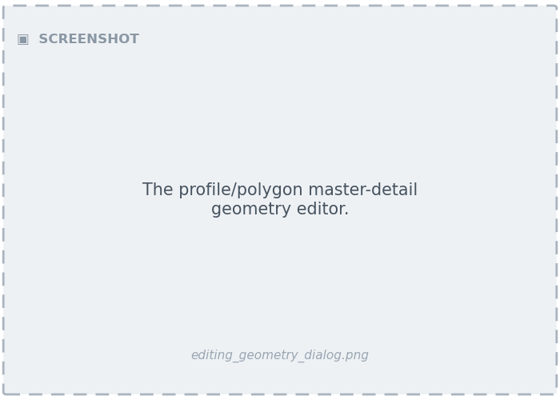
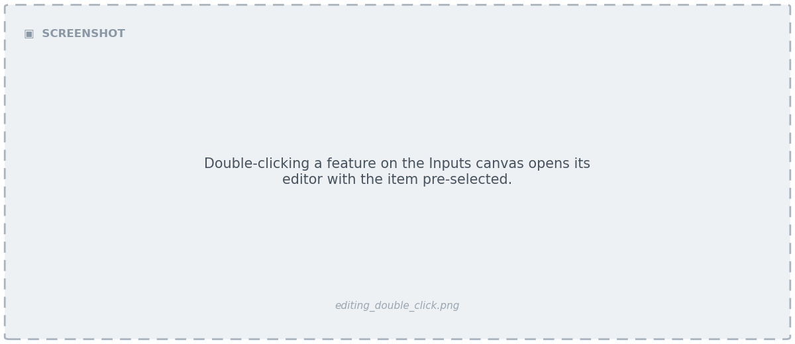
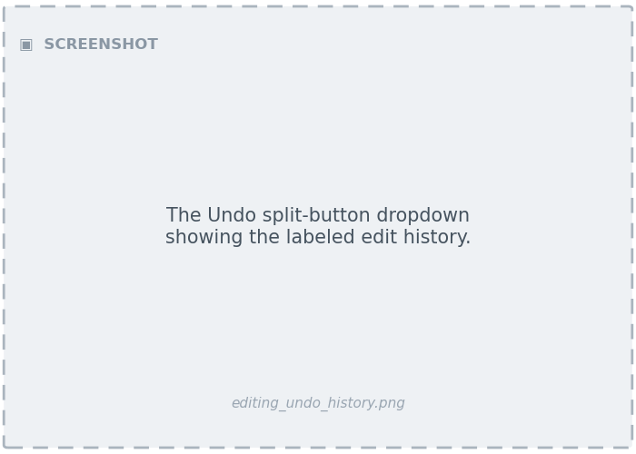
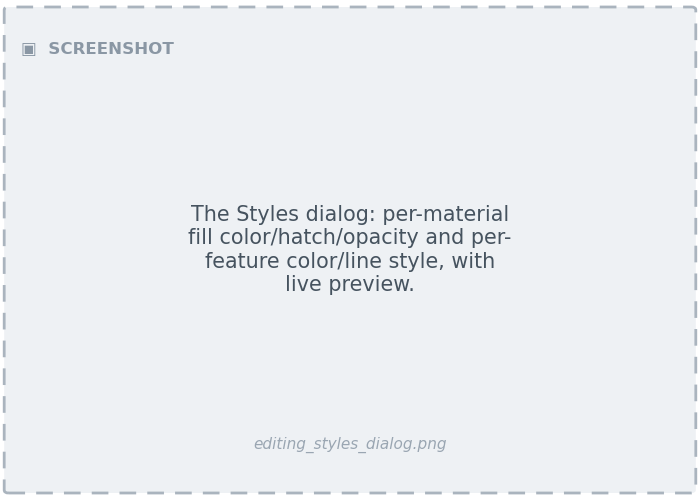

# Editing Inputs

Studio is, at heart, a structured editor over the model's inputs. Every edit you
make updates the in-memory model and re-renders the canvas immediately. This page
covers the editors, double-click-to-edit, undo/redo, styles, and the file
lifecycle.

---

## The Inputs tree and the editors

The **Inputs tree** (left dock) lists every input category. Click a category to
open its editor:

{width="360"}

| Category | What you edit |
| --- | --- |
| **Global parameters** | Unit weight of water, tension-crack depth/water, seismic coefficient, max depth. |
| **Materials** | The material table — name, unit weight, strength option and parameters, and (by mode) hydraulic and elastic properties. |
| **Profile lines** | The profile-line geometry (master/detail); rebuilds the ground surface and material zones. |
| **Polygons** | Material-zone polygons (for polygon-based models). |
| **Piezometric lines** | The two piezometric lines. |
| **Failure surfaces** | Circles (center, radius/depth/intercept) or the non-circular surface (vertex table). |
| **Distributed loads** | The two distributed-load sets. |
| **Reinforcement** | Reinforcement lines (rebuilt into the engine's display format). |
| **Piles** | Pile lines. |
| **Seepage BC** | Specified-head lines and exit faces (two BC sets). |

Editors are forms (for scalars) or tables (for tabular data). Tabular editors let
you add, remove, and reorder rows.

{width="760"}

{width="520"}

Edits are validated, applied to the model, mark the document **dirty** (an asterisk
in the title bar), and re-render the affected layers. Records preserve fields that
aren't shown in a given editor, so editing one column never drops the others.

The geometry editors (profile lines and polygons) use a master/detail layout — pick
a line on the left, edit its vertices on the right:

{width="760"}

!!! note "Profile-based vs. polygon-based models"
    A model defines its geometry either through **profile lines** (stacked
    surfaces, with zones derived from them) or directly as **polygons**. The
    Inputs tree marks **Polygons** editable only when there are no profile lines;
    otherwise edit the **Profile lines**. Both use the same master/detail geometry
    dialog.

---

## Double-click to edit

On the **Inputs** view, double-clicking a feature on the canvas opens the right
editor with the picked item pre-selected — no need to find it in the tree first.

{width="1100"}

Studio maps the click to the drawing's coordinates and hit-tests the geometry, so
this works on:

- profile and polygon lines (opens the geometry editor at that line),
- the max-depth line, piezometric lines, distributed loads, reinforcement, piles,
- failure circles and non-circular points,
- seepage boundary conditions (specified-head lines and exit faces),
- a material-zone interior (falls back to the materials editor).

The hit-test is **mode-aware** — seepage BCs are only pickable in Seepage mode,
distributed loads only outside it — matching what the plot draws. Result views are
view-only; double-click-to-edit is the Inputs view only.

---

## Undo and redo

Every edit — whether from an editor, a canvas pick, or the [AI assistant](assistant.md)
— is captured on a snapshot **undo stack**. Undo and redo are on the toolbar (and
the **Edit** menu, with the usual Ctrl/Cmd+Z and Shift+Ctrl/Cmd+Z shortcuts).

Each toolbar button is a **split-button**: clicking it undoes or redoes one step,
while the **dropdown arrow** shows the labeled history — *"Edit Materials"*,
*"Edit Profile Lines"*, *"Assistant: materials, dloads"* — and selecting an entry
jumps straight to that point in one action (an Office/Photoshop-style history).

{width="520"}

A few behaviors worth knowing:

- **Assistant edits are undoable** just like manual ones — if the assistant changes
  something you didn't want, undo reverts it. A failed assistant snippet rolls back
  automatically and leaves nothing on the stack.
- Undoing or redoing back to the **last-saved state** clears the dirty flag (the
  title asterisk disappears).
- The history is capped (the most recent 100 steps are kept).

---

## Stale results and the mesh

Results are derived from the inputs, so editing an input that a result depended on
makes that result stale. Studio handles this automatically:

- Editing any input clears a stale **LEM solution** (its tab is removed).
- Editing the **geometry** (profile/polygon lines, max depth, reinforcement, piles)
  also clears the **mesh**, so Seepage and FEM re-gate on a fresh **Build Mesh**.
- Undo/redo apply the same rule — stale solution tabs are dropped, and the mesh
  follows the restored geometry.

This is why an edit visibly refreshes the Inputs view: Studio always leaves you on
a valid picture.

---

## Styles

**Styles** are the persistent, project-global visual identity of each feature —
material fill color/hatch/opacity, and line color/style/width for features like
piezo lines, circles, and reinforcement. Open the **Styles…** button at the bottom
of the [Display dock](interface.md#the-display-dock) to edit them, with a live
preview.

{width="760"}

- **Materials** are styled by their `mat_id`: a fill color from an earth-tone
  palette, a soil-ish hatch, and an opacity.
- **Features** carry a color, line style (where conventional), and width.
- **Restore Defaults** clears all customizations in one click.

Styles are saved per project in a `{stem}_styles.json` sidecar next to the Excel
file, holding only the differences from the built-in defaults. A project with no
customizations writes no sidecar, and opening a project loads its styles
automatically.

!!! info "Styles vs. Display options"
    Styles are *how a feature looks* and persist with the project. The
    [Display options](interface.md#the-display-dock) in the dock are *what a plot
    shows* — per-view and not saved. Visibility toggles (show/hide a feature) are a
    display concern and live with the display options, not the styles.

---

## File lifecycle

Studio reads and writes the same Excel format as the `xslope` library, so files
round-trip between Studio, scripts, and notebooks.

| Action | What happens |
| --- | --- |
| **New** | Creates an empty project — every category present but blank, a blank canvas. Build it up with the editors (start with a material and a profile line) or the [assistant](assistant.md), then Save As. |
| **Open** | Loads an Excel file and renders the Inputs view. Auto-loads any `{stem}_mesh.json`, `{stem}_seep.csv`, FEM, and `{stem}_styles.json` sidecars, restoring saved seep/FEM solutions without re-solving. |
| **Save** | Writes back to the same file, preserving the template formatting, and reconciles the mesh/seep/FEM/style sidecars against the current model. |
| **Save As** | Writes a new file through the bundled blank template. |

Studio keeps a **Recent files** list, and prompts to save unsaved changes before
New, Open, or closing.

!!! tip "Importing geometry from CAD"
    A model can also be started from a DXF drawing via **File → Import DXF…** — a
    wizard maps each CAD layer to an input feature. See
    [Importing and exporting DXF](analysis.md#dxf-import-and-export).
