# Editing Inputs

Studio is, at heart, a structured editor over the model's inputs. Every edit you
make updates the in-memory model and re-renders the canvas immediately. This page
covers the editors, double-click-to-edit, undo/redo, styles, and the file
lifecycle.

---

## The Inputs tree and the editors

The **Inputs tree** (left dock) lists every input category. Click a category to
open its editor:

| Category | What you edit |
| --- | --- |
| **Global parameters** | The project's units and time unit, unit weight of water, tension-crack depth/water, seismic coefficient, and the FEM-only tension SRF and K0 initial stress. |
| **Materials** | The material table — name, unit weight, strength option and parameters, and (by mode) hydraulic and elastic properties. |
| **Profile lines** | The profile-line geometry (master/detail); rebuilds the ground surface and material zones. |
| **Polygons** | Polygon regions (for polygon-based models) — material zones, SSR overlays, and mesh refinement regions. |
| **Piezometric lines** | The two piezometric lines. |
| **Failure surfaces** | Circles (center, radius/depth/intercept) or the non-circular surface (vertex table). |
| **Distributed loads** | The two distributed-load sets, each load with its direction. |
| **Reinforcement** | Reinforcement lines (rebuilt into the engine's display format). |
| **Line loads** | Concentrated line loads (force per unit width) on the ground surface. |
| **Piles** | Pile lines. |
| **Seepage BC** | Specified-head lines, specified-flux lines, and exit faces (two BC sets). |
| **Transient** | The transient-seepage run controls and time series (see [Transient seepage](#transient-seepage)); the row reads *on* or *off*. |

Editors are forms (for scalars) or tables (for tabular data). Tabular editors let
you add, remove, and reorder rows.

The materials editor has two interchangeable views. **Table view** mirrors the
`mat` worksheet row-for-row, with **Show columns for** toggles (LEM / Seepage /
FEM / Reliability) that hide the columns an analysis doesn't use:

**List view** edits one material at a time as a grouped form — Identity, Unit
weights, Strength, Pore pressure, Conductivity — showing only the fields the
selected strength and conductivity options use. Turning on the **Reliability**
toggle here reveals the **± σ** field next to each value instead of hiding
columns. Two confirmation plots on the right — the strength envelope and the
unsaturated-conductivity curve — redraw as you type, so a wrong option choice is
obvious at a glance:

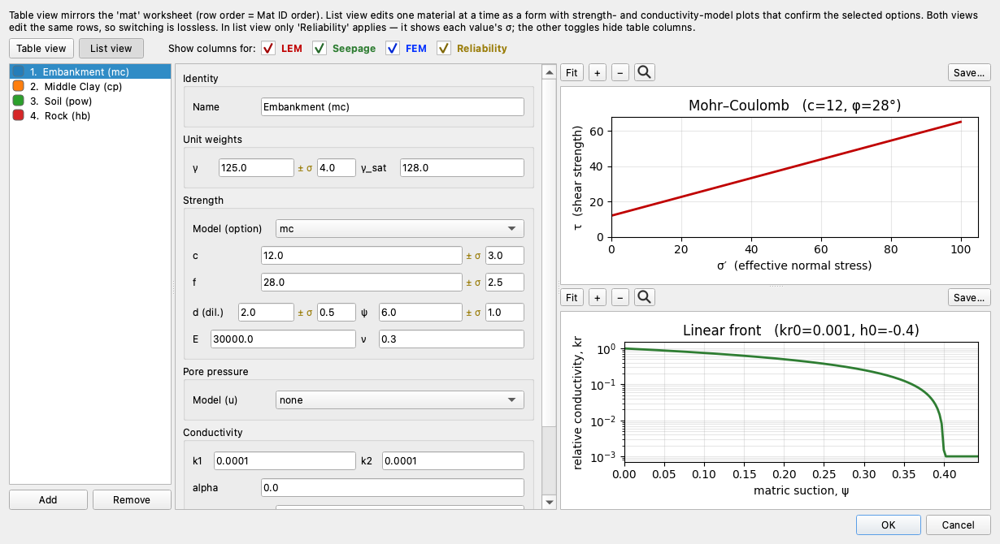

A **blank property stays blank**. Leaving a unit weight, cohesion, friction angle,
`d`/`ψ`, `E`, `ν`, `r_u` or `k₁` cell empty reads back as unset, not as zero, in both
views — so a cohesionless material and one nobody has filled in are different models,
and the [model checks](analysis.md#model-checks-before-a-run) can tell you which one
you have. Saving writes an unset property as an empty cell rather than inventing a
zero for it.

The **Display color** swatch under Identity sets the material's color on the
plots (**Reset** returns it to the default palette); the same swatch is the first
column of the table view. Both views edit the same rows, so switching is
lossless.

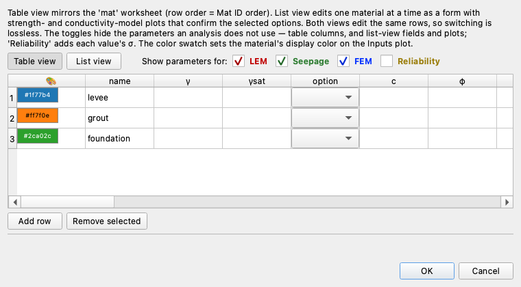

The **Global parameters** form opens with two dropdowns above the numeric fields.
**Units** declares the model's unit system — **SI**, **Imperial**, or blank
(undeclared) — and **Time** declares the time base (`sec`, `min`, `hr`, `day`, or
blank) that seepage conductivities and transient times are measured in. Picking a
Units system **autofills** the unit weight of water with that system's canonical
value (9.81 for SI, 62.4 for Imperial); it is typeable-over, so a seawater or brine
override still stands, and a blank Units selection leaves the entered value
untouched. xslope never converts numbers between systems — the declaration only
drives labeling and load-time sanity checks — so it is a statement of what the
entered numbers already mean.

Once a system is declared, **unit suffixes** appear where a value has a natural
unit: editor field and column headers read *Unit weight of water (pcf)*, *c (kPa)*,
and so on, and the plots label their axes (*x (m)*, *y (ft)*). A model that declares
no system keeps the bare, unit-less labels. The time-bearing units (conductivity,
flow rate) stay unlabeled until a Time base is also declared, so a time unit is
never guessed.

Edits are validated, applied to the model, mark the document **dirty** (an asterisk
in the title bar), and re-render the affected layers. Records preserve fields that
aren't shown in a given editor, so editing one column never drops the others.

The geometry editors (profile lines and polygons) use a master/detail layout — pick
a line on the left, edit its vertices on the right. A **live preview** pane redraws
the section as you type, with the selected line highlighted, so a mistyped vertex
is visible before you commit:

The polygons editor is the same dialog for polygon-based models — the preview
fills the selected zone and dims the rest:

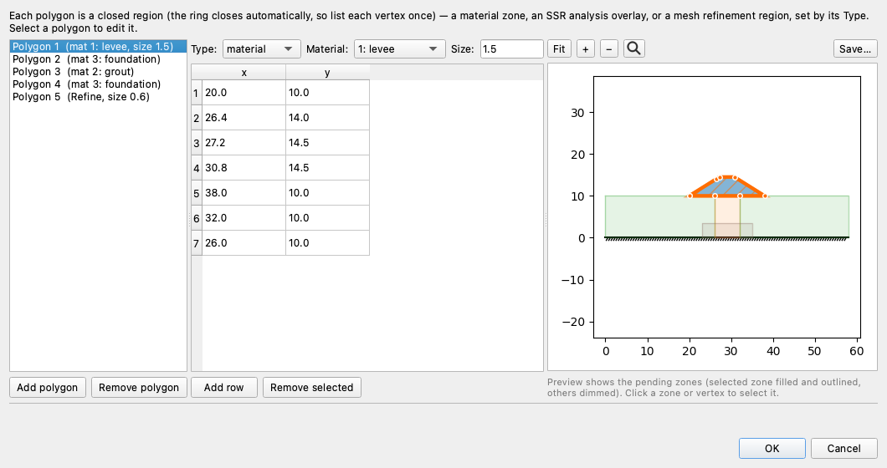

A model defines its geometry either through **profile lines** (stacked surfaces, with
zones derived from them) or directly as **polygons** — never both. The Inputs tree
marks **Polygons** editable only when there are no profile lines; otherwise edit the
**Profile lines**. Both use the same master/detail geometry dialog.

**Size** is an optional local mesh size, available on every profile line and every
polygon. Leave it blank and the region meshes at the global target size set on the
[Build Mesh](analysis.md#building-a-mesh) dialog; enter a value and the elements inside that
polygon, or along that line, are built to it instead. It has no effect on a
limit-equilibrium run, which does not mesh, and it only ever refines — a value at or
above the global size cannot make the mesh coarser there. A declared Size shows in the
item list, so a refinement is visible without opening each polygon in turn.

**Type** (polygons only) says what kind of region a polygon is. `material` — the
default — is a soil zone. The three `ssr` types are
[SSR overlays](analysis.md#finite-element-fem): analysis regions that constrain a
strength-reduction run and are never meshed or sliced. `refine` is neither: it is a
pure meshing region that carries no material and no analysis meaning, so a `refine`
polygon must have a Size, and the dialog will not close until it does. Choosing any
Type other than `material` greys out **Mat ID** and the material name, because an
overlay is not a soil zone and has no material:

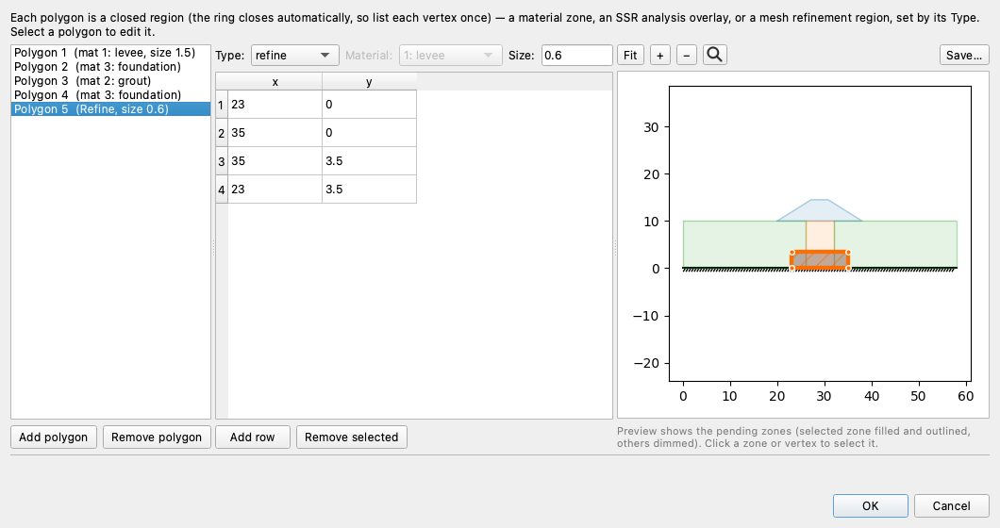

Use a refine region to resolve something the geometry does not already mark out — the
ground beneath a footing, the zone a slip surface is expected to cross, the tip of a
cutoff wall (above). Where a Size is what you want on a layer that already exists,
put it on that material zone or profile line instead. Refine regions may overlap
anything, including each other; where several apply, the smallest size wins.

The remaining feature editors follow the same pattern — a table (or master/detail
list) plus a live preview of the feature on the section.

**Distributed loads** are pressures spread along a line on the ground surface. Each
load is a left→right series of points carrying a stress, and each has its own
**Direction**. *Normal* — the default — applies the stress perpendicular to the load's
own line, which is what a pressure does. *Vertical* applies it straight down whatever
the line's slope, which is what the dead weight of a surcharge does. The two are
identical on level ground and diverge on a slope, where a normal load carries a
horizontal thrust that a surcharge does not; the preview draws each load its own way,
so the difference is visible while you set it:

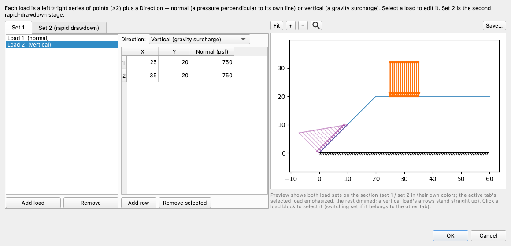

Direction belongs to the load, not to the set, so a model may mix the two, and
deleting or re-picking loads never moves a direction onto a different load. **Set 2**
is the second rapid-drawdown stage and works the same way.

**Line loads** are concentrated forces per unit width acting at a point on the
ground surface (a facing plate, a crane pad). Each row is a point, a magnitude
**P**, and an **Angle** (−90° = straight down); loads are snapped onto the ground
surface on save:

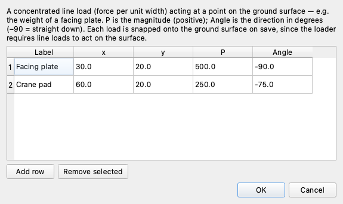

Like the materials editor, the **reinforcement** and **pile** editors each offer
two interchangeable views. The default **List view** edits one line at a time as a
grouped form beside the live section preview; **Table view** is available for bulk
entry of many lines. Both views edit the same rows, so switching is lossless, and
the **Show columns for** (LEM / FEM) toggles hide the columns an analysis doesn't
use in the table.

**Reinforcement** lines are grouped as **Geometry** (endpoints), **Capacity**
(Tmax, Tres, E, Area), **Anchorage** (Lp1/Lp2 pullout lengths, Tend1/Tend2 end
capacities, Spacing), and **Type** — picking a Type (geosynthetic, nail, tieback,
anchor) defaults **Dir** and **Appl**, and a blank Type means a generic tensile
line. The preview draws the lines on the section with the selected one emphasized
and its pullout breakpoints marked:

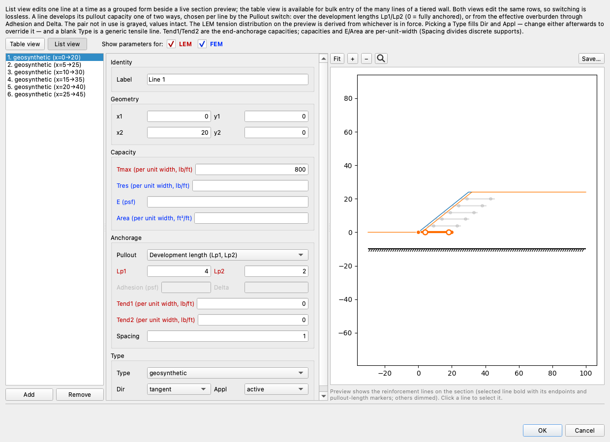

Table view lays every column out at once — the bulk-entry path for the fifteen-plus
lines of a tiered wall:

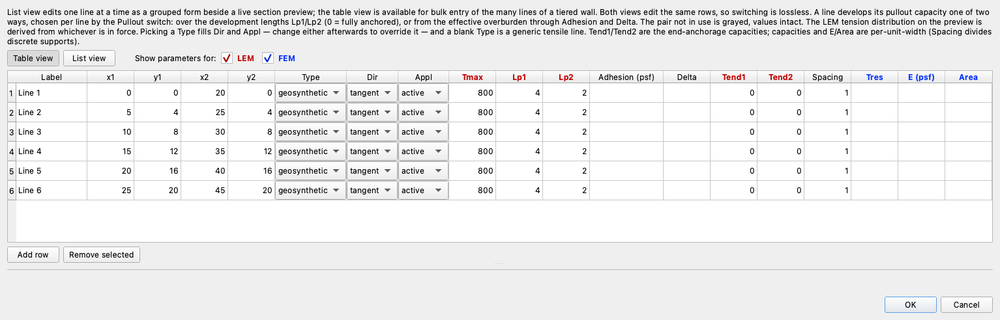

**Piles** group their fields as **Geometry**, **Capacity / design** (H, D, S, Vcap,
Mcap, and the FEM E/I/Area), and **Behavior** — the **Appl** dropdown chooses how
the pile resistance enters the analysis (active = allowable force; passive =
ultimate capacity ÷ FS), and leaving **H** blank auto-computes the Ito & Matsui
force. A model rarely has more than a few piles, so the list view is usually all
you need; the table is there for the exceptions:

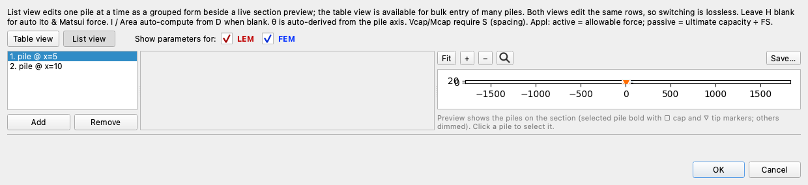

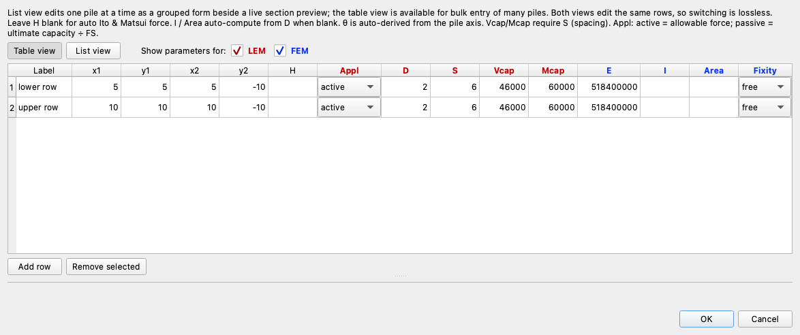

**Seep BC** is a master/detail editor over the two BC sets (Set 2 drives rapid
drawdown): specified-**head** lines (a head value plus its points),
specified-**flux** lines (**Add flux**, a **Flux value** plus its points), and
the **exit face**:

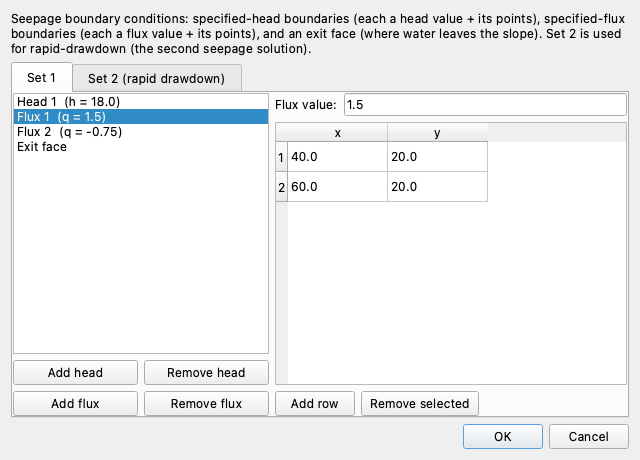

### Transient seepage

**Transient** edits the model's transient-seepage inputs — the data that a
[transient run](analysis.md#transient-seepage) marches through. There is no on/off
toggle: leaving every field blank keeps the model steady (the steady-vs-transient
*run* choice lives on the Run Seepage dialog). It gathers:

- the **run controls** — **Duration**, **Save interval**, the rapid-drawdown
  **Stage 1** / **Stage 2** times (set both or neither; Stage 1 earlier than Stage 2),
  and the **Stability time**, which names the instant a single-time LEM or FEM run
  reads its pore pressures from (blank means the last saved frame). The stage times
  and the stability time can also be set at their point of use, in the
  [Run LEM and Run FEM dialogs](analysis.md#seepage-time) — both places write the same
  values;
- the **time-series table** — a shared **time** axis and up to five named series. A
  seep BC head/flux **value** cell that contains a series name is driven by that
  series (a time-varying boundary condition). A blank cell is no breakpoint (the
  series is linearly interpolated between its own points), and a **repeated time** is
  an instantaneous step;
- an **Extra save times** list — a column immediately to the right of the series
  table — for saving frames at specific instants beyond the save-interval grid.

The left column is one time-data block (series names, the series table, and the
save-times list side by side); the run controls sit at the top of the right column
with a live plot beneath them that draws every named series against time — markers at
the defined breakpoints, the stage times as dashed reference lines — updating as you
edit, so the drawdown curve is visible while you build it. Every field carries hover
help, and the strip at the bottom explains the field you are in.

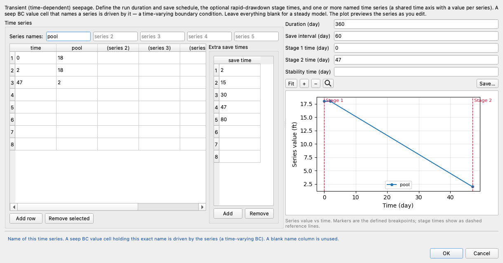

---

## Double-click to edit

On the **Inputs** view, double-clicking a feature on the canvas opens the right
editor with the picked item pre-selected — no need to find it in the tree first.

Studio maps the click to the drawing's coordinates and hit-tests the geometry, so
this works on:

- profile and polygon lines (opens the geometry editor at that line),
- the max-depth line, piezometric lines, distributed loads, line loads,
  reinforcement, piles,
- failure circles and non-circular points,
- seepage boundary conditions (specified-head lines, specified-flux lines, and exit faces),
- a material-zone interior (falls back to the materials editor).

The hit-test is **mode-aware** — seepage BCs are only pickable in Seepage mode,
distributed loads only outside it — matching what the plot draws. Result views are
view-only; double-click-to-edit is the Inputs view only.

---

## Undo and redo

Every edit — whether from an editor, a canvas pick, or the [AI assistant](assistant.md)
— is captured on a snapshot **undo stack**. Undo and redo are on the toolbar (and
the **Edit** menu, with the usual Ctrl/Cmd+Z and Shift+Ctrl/Cmd+Z shortcuts).

Each toolbar button is a **split-button**: clicking it undoes or redoes one step,
while the **dropdown arrow** shows the labeled history — *"Edit Materials"*,
*"Edit Profile Lines"*, *"Assistant: materials, dloads"* — and selecting an entry
jumps straight to that point in one action (an Office/Photoshop-style history).

A few behaviors worth knowing:

- **Assistant edits are undoable** just like manual ones — if the assistant changes
  something you didn't want, undo reverts it. A failed assistant snippet rolls back
  automatically and leaves nothing on the stack.
- Undoing or redoing back to the **last-saved state** clears the dirty flag (the
  title asterisk disappears).
- The history is capped (the most recent 100 steps are kept).

---

## Stale results and the mesh

Results are derived from the inputs, so editing an input that a result depended on
makes that result stale. Studio handles this automatically:

- Editing any input clears a stale **LEM solution** (its tab is removed).
- Editing the **geometry** (profile/polygon lines, max depth, reinforcement, piles)
  also clears the **mesh**, so Seepage and FEM re-gate on a fresh **Build Mesh**.
- Undo/redo apply the same rule — stale solution tabs are dropped, and the mesh
  follows the restored geometry.

This is why an edit visibly refreshes the Inputs view: Studio always leaves you on
a valid picture.

---

## Styles

**Styles** are the persistent, project-global visual identity of each feature —
material fill color/hatch/opacity, and line color/style/width for features like
piezo lines, circles, and reinforcement. Open the **Styles…** button at the bottom
of the [Display dock](interface.md#the-display-dock) to edit them, with a live
preview.

- **Materials** are styled by their `mat_id`: a fill color from an earth-tone
  palette, a soil-ish hatch, and an opacity.
- **Features** carry a color, line style (where conventional), and width.
- **Restore Defaults** clears all customizations in one click.

Styles are saved per project in a `{stem}_styles.json` sidecar next to the Excel
file, holding only the differences from the built-in defaults. A project with no
customizations writes no sidecar, and opening a project loads its styles
automatically.

Styles are *how a feature looks*, and they persist with the project. The
[Display options](interface.md#the-display-dock) in the dock are *what a plot shows* —
per-view and not saved. Visibility toggles (show/hide a feature) are therefore a
display concern and live with the display options, not the styles.

---

## File lifecycle

Studio reads and writes the same Excel format as the `xslope` library, so files
round-trip between Studio, scripts, and notebooks.

| Action | What happens |
| --- | --- |
| **New** | Creates an empty project — every category present but blank, a blank canvas. Build it up with the editors (start with a material and a profile line) or the [assistant](assistant.md), then Save As. A new project takes its [water loads](../usage/input_template.md#worksheet-main) automatically, like the template it will be saved into: draw the piezometric line or the seepage boundaries and the engine supplies the weight of the standing water itself. |
| **Open** | Loads an Excel file and renders the Inputs view. Auto-loads any `{stem}_mesh.json`, `{stem}_seep.csv`, FEM, and `{stem}_styles.json` sidecars, restoring saved seep/FEM solutions without re-solving. |
| **Save** | Writes back to the same file, preserving the template formatting, and reconciles the mesh/seep/FEM/style sidecars against the current model. |
| **Save As** | Writes a new file through the bundled blank template. |

Studio keeps a **Recent files** list, and prompts to save unsaved changes before
New, Open, or closing.

A model can also be started from a DXF drawing, via **File → Import DXF…** — a wizard
maps each CAD layer to an input feature. See
[Importing and exporting DXF](analysis.md#dxf-import-and-export).
