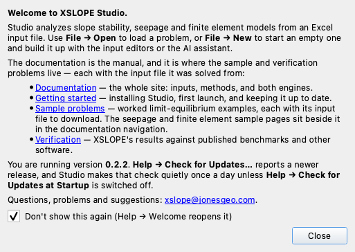

# XSLOPE Studio

**XSLOPE Studio** is a cross-platform desktop application that wraps the `xslope`
engine in a graphical interface. It lets you open a problem, view and edit every
input graphically, run limit-equilibrium (LEM), seepage, and finite-element (FEM)
analyses, and view the results — without writing code or running a notebook.

Studio is a *front end to the same `xslope` package* documented elsewhere on this
site: it loads and saves the standard Excel input format, and every plot you see
is produced by the same `plot_*` functions used from scripts. Anything you can do
in Studio you can also do from Python; Studio simply makes the common workflow
point-and-click.

Throughout these pages, *Studio* means the desktop application and *`xslope`* means
the Python engine it wraps (the import is still `import xslope`). The engine and the
file format are documented under the **Usage Guide**, **Limit Equilibrium Method**,
**Seepage Analysis**, and **Finite Element Method** sections of this site.

{width="1200"}

---

## What you can do

- **Open** a filled-out Excel problem and see its geometry and inputs rendered.
- **Edit** every input through forms and tables; the canvas updates after each edit.
- **Double-click** a feature on the canvas to open its editor directly.
- **Undo / redo** any edit, with a labeled history of every change.
- **Run** LEM (single surface, automated search, or reliability), build a mesh, and
  run seepage and FEM analyses, each with a run-options dialog.
- **View** results across dedicated tabs (search, solution, reliability, seepage,
  FEM), with a context-sensitive **Display** panel for per-view plot options.
- **Export** any view as a PNG/PDF/SVG image or as a DXF.
- **Report** the whole analysis as a formal Word document — title page, contents,
  figures, the slice table and the model checks — from
  [File → Generate Report…](reports.md).
- **Import** models from other tools — DXF, GeoStudio (SLOPE/W), Slide2, and
  RS2 (`.fez`) — and export back to DXF or GeoStudio.
- **Ask** the built-in AI assistant to build inputs, run analyses, and script
  parameter studies in natural language.
- **Save** back to the same Excel format (and the `{stem}_mesh.json` /
  `{stem}_seep.csv` / style sidecars alongside it).

---

## Installation

Studio installs from a native installer — a `.dmg` for macOS, a setup `.exe` for
Windows — that carries the whole engine, including **gmsh** for meshing and the
[AI assistant](assistant.md). Nothing else is needed, and no Python has to be
installed. See **[Install](../getting_started/install.md)** for the downloads,
system requirements, first launch, and uninstalling.

Once installed, **Help → Check for Updates…** tells you when a newer version is
released, and can install it for you — see [App management](app_management.md).

### Install with pip

If you already work in Python, Studio also ships inside the `xslope` package
behind the `gui` extra, which adds **PySide6** (the Qt GUI toolkit):

```bash
pip install "xslope[gui]"
```

To also run seepage and FEM analyses from Studio, include the `fem` extra (which
adds **gmsh** for meshing). The two extras combine:

```bash
pip install "xslope[gui,fem]"
```

To enable the [AI assistant](assistant.md), add the `ai` extra (which pulls the
provider library). Studio runs without it — the assistant dock simply reports
that the dependency is missing:

```bash
pip install "xslope[gui,fem,ai]"
```

On Debian/Ubuntu Linux, as with the base package, gmsh needs system OpenGL libraries:
run `apt-get update && apt-get install -y libgl1 libglu1-mesa` once before installing
the `fem` extra. macOS and Windows need no extra step. This is also the route for
Intel Macs, which the installer does not cover.

### Launch

An installed Studio launches from Applications or Launchpad on macOS, and from the
Start menu on Windows. A `pip` install registers a console command instead:

```bash
xslope-studio
```

Either way you get the same window. From there, use **File → Open** to load an
Excel problem, or **File → New** to start an empty project and build it up with the
editors (or the assistant).


---

## The welcome window

The first launch opens a welcome window over the empty canvas: what Studio is, the
version it is running, the address to write to, and links into this documentation —
**Documentation**, **Getting started**, **Sample problems**, and **Verification**.
Each link opens in your browser.



**Don't show this again** is ticked when the window opens, so the welcome appears on
the first launch and not on later ones. Untick it to be greeted every time.
**Help → Welcome** reopens the window whenever you want it, whichever way the box is
set — and unticking it there brings the launch greeting back.

Starting Studio by opening something — double-clicking an input file or a project
package, or following an **Open in Studio** link — opens that project and no welcome
over it. The next launch with nothing to open is greeted as usual.

The rest of the Help menu is **Documentation**, which opens the documentation root
in your browser, the two update items described under
[App management](app_management.md), and **About**.

---

## How the documentation is organized

- **[The interface](interface.md)** — the window layout: the canvas and its
  zoom/pan, the Inputs tree, the Display and Log docks, the result tabs, and the
  analysis-mode switch.
- **[Editing inputs](editing.md)** — the input editors, double-click-to-edit on
  the canvas, undo/redo with labeled history, and the file lifecycle (New / Open /
  Save / Save As).
- **[Running analyses](analysis.md)** — building a mesh and running LEM, seepage,
  and FEM; the result views and their Display options; and image / DXF export.
- **[AI assistant](assistant.md)** — the chat panel: choosing a model, autonomy
  modes, vision, and what it can do.
- **[App management](app_management.md)** — the update check and what it installs,
  and managing a `pip` install.
