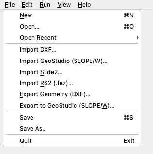

# XSlope Studio

**XSlope Studio** is a cross-platform desktop application that wraps the `xslope`
engine in a graphical interface. It lets you open a problem, view and edit every
input graphically, run limit-equilibrium (LEM), seepage, and finite-element (FEM)
analyses, and view the results — without writing code or running a notebook.

Studio is a *front end to the same `xslope` package* documented elsewhere on this
site: it loads and saves the standard Excel input format, and every plot you see
is produced by the same `plot_*` functions used from scripts. Anything you can do
in Studio you can also do from Python; Studio simply makes the common workflow
point-and-click.

{width="1200"}

---

## What you can do

- **Open** a filled-out Excel problem and see its geometry and inputs rendered.
- **Edit** every input through forms and tables; the canvas updates after each edit.
- **Double-click** a feature on the canvas to open its editor directly.
- **Undo / redo** any edit, with a labeled history of every change.
- **Run** LEM (single surface, automated search, or reliability), build a mesh, and
  run seepage and FEM analyses, each with a run-options dialog.
- **View** results across dedicated tabs (search, solution, reliability, seepage,
  FEM), with a context-sensitive **Display** panel for per-view plot options.
- **Export** any view as a PNG/PDF/SVG image or as a DXF.
- **Import** models from other tools — DXF, GeoStudio (SLOPE/W), Slide2, and
  RS2 (`.fez`) — and export back to DXF or GeoStudio.
- **Ask** the built-in AI assistant to build inputs, run analyses, and script
  parameter studies in natural language.
- **Save** back to the same Excel format (and the `{stem}_mesh.json` /
  `{stem}_seep.csv` / style sidecars alongside it).

---

## Installation

!!! warning "Native installers — coming with Phase 7"
    Packaged native installers (`.dmg` for macOS, `.msi` for Windows) are planned
    but **not yet available**. This section, and the [App management](app_management.md)
    page (updates, uninstall, where files live), will be completed when the
    installers ship. Until then, install Studio with `pip` as below.

### Install with pip

Studio ships inside the `xslope` package behind the `gui` extra, which adds
**PySide6** (the Qt GUI toolkit):

```bash
pip install "xslope[gui]"
```

To also run seepage and FEM analyses from Studio, include the `fem` extra (which
adds **gmsh** for meshing). The two extras combine:

```bash
pip install "xslope[gui,fem]"
```

To enable the [AI assistant](assistant.md), add the `ai` extra (which pulls the
provider library). Studio runs without it — the assistant dock simply reports
that the dependency is missing:

```bash
pip install "xslope[gui,fem,ai]"
```

!!! note "Linux"
    As with the base package, gmsh on Debian/Ubuntu Linux needs system OpenGL
    libraries. Run `apt-get update && apt-get install -y libgl1 libglu1-mesa`
    once before installing the `fem` extra. macOS and Windows need no extra step.

### Launch

Installing the `gui` extra registers a console command:

```bash
xslope-studio
```

This opens the Studio window. From there, use **File → Open** to load an Excel
problem, or **File → New** to start an empty project and build it up with the
editors (or the assistant).



---

## How the documentation is organized

- **[The interface](interface.md)** — the window layout: the canvas and its
  zoom/pan, the Inputs tree, the Display and Log docks, the result tabs, and the
  analysis-mode selector.
- **[Editing inputs](editing.md)** — the input editors, double-click-to-edit on
  the canvas, undo/redo with labeled history, and the file lifecycle (New / Open /
  Save / Save As).
- **[Running analyses](analysis.md)** — building a mesh and running LEM, seepage,
  and FEM; the result views and their Display options; and image / DXF export.
- **[AI assistant](assistant.md)** — the chat panel: choosing a model, autonomy
  modes, vision, and what it can do.
- **[App management](app_management.md)** — *(placeholder)* installing updates,
  uninstalling, and where Studio stores files.

!!! info "Studio vs. the `xslope` library"
    Throughout these pages, *Studio* means the desktop application; *`xslope`*
    means the Python engine it wraps (the import is still `import xslope`). The
    engine and the file format are documented under the **Usage Guide**, **Limit
    Equilibrium Method**, **Seepage Analysis**, and **Finite Element Method**
    sections of this site.
