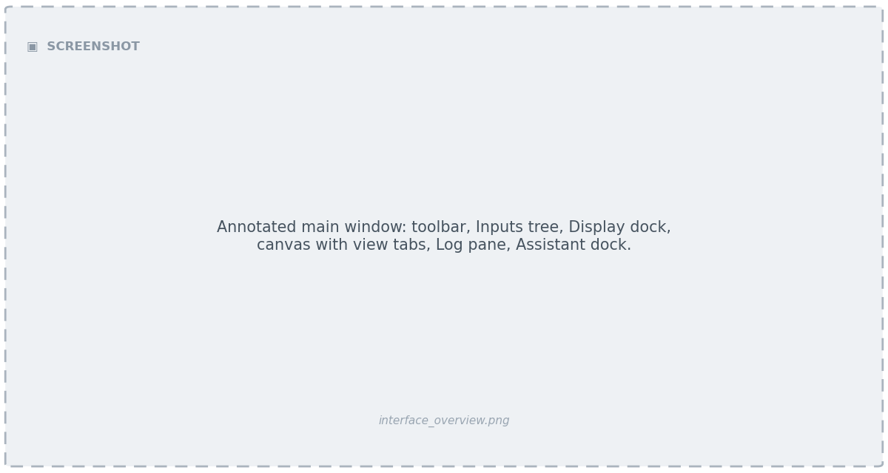
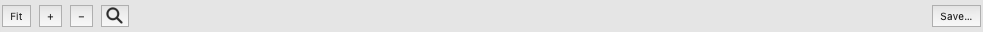
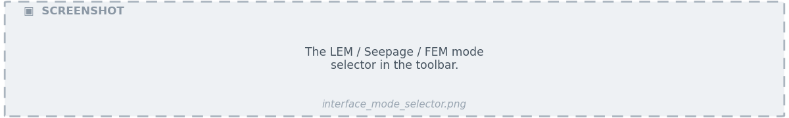
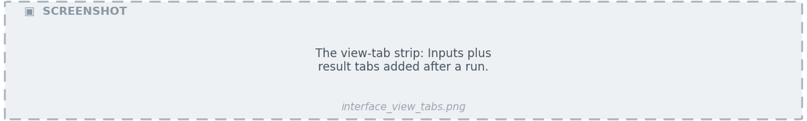
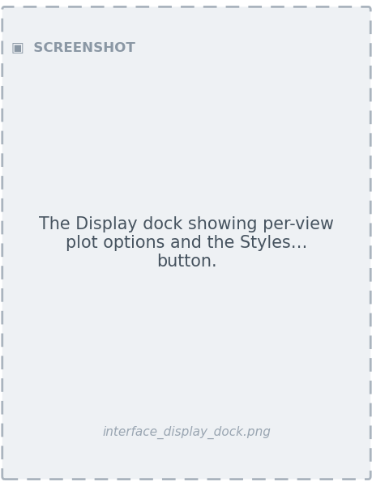
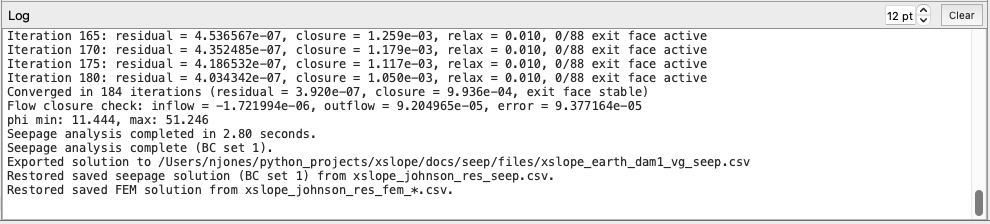

# The Interface

This page is a tour of the Studio window. Later pages cover
[editing](editing.md), [running analyses](analysis.md), and the
[AI assistant](assistant.md) in depth.

{width="1200"}

---

## Layout at a glance

The window is organized around a central **canvas** with docks on each side:

| Region | Purpose |
| --- | --- |
| **Toolbar** (top) | New / Open, Undo / Redo, the analysis-mode switch, Build Mesh, Run, and Parametric. |
| **Inputs tree** (left, top) | A list of every input category; click one to edit it. |
| **Display dock** (left, bottom) | Per-view plot options for the active result tab, plus the **Styles…** button. |
| **Canvas + view tabs** (center) | The plots. The **Inputs** tab is always present; result tabs are added as you run analyses. |
| **Log pane** (bottom) | Live engine output — convergence traces, search progress, warnings. |
| **Assistant dock** (right) | The [AI chat panel](assistant.md). |

Docks can be moved, stacked, floated, or closed; the **View** menu toggles each
one back on.

---

## The canvas

Every view — Inputs and all result tabs — is an image of a Matplotlib figure shown
in a zoomable, pannable canvas. Each canvas has a small toolbar:

{width="900"}

| Control | Action |
| --- | --- |
| **Fit** | Frame the drawing to the window. |
| **+** / **−** | Zoom in / out. |
| **Zoom to box** | A checkable mode — drag a rectangle to zoom into it (otherwise drag pans). |
| **Save…** | Export the current view as a PNG / PDF / SVG image, or as a DXF (see [Export](analysis.md#exporting-views-images-and-dxf)). |

You can also **wheel-zoom** anchored at the cursor and **drag to pan**. The whole
figure — axes, title, labels, margins — zooms together like an image viewer. Text
stays crisp because the figure is re-rendered at a resolution matched to the zoom
level rather than scaled as pixels.

On the **Inputs** view, double-clicking a feature opens its editor with the item
pre-selected. That view shows a select (arrow) cursor and a *"(double-click on a
feature to edit)"* hint as a reminder. See
[Editing inputs](editing.md#double-click-to-edit).

---

## Analysis mode (LEM / Seepage / FEM)

A **Mode** switch in the toolbar selects the analysis type. It is a strip of three
buttons, one per type, with the current mode highlighted — one click switches:

- **LEM** — limit-equilibrium slope stability. `Ctrl+1` (`⌘1` on macOS).
- **Seepage** — finite-element groundwater flow. `Ctrl+2` (`⌘2`).
- **FEM** — finite-element slope stability (SSRM). `Ctrl+3` (`⌘3`).

The mode controls two things:

1. **What the Inputs view emphasizes** — the material table shows the columns
   relevant to that mode (strength columns for LEM, hydraulic for seepage, elastic
   for FEM).
2. **What Run does** — the **Run** button is mode-driven, reading **Run LEM…**,
   **Run Seep…**, or **Run FEM…**. **Build Mesh** appears only in Seepage and FEM
   mode, and Seep/FEM runs stay disabled until a mesh has been built.

---

## The view tabs

The central area is a tab strip. The **Inputs** tab is always first; running an
analysis adds the relevant result tab(s) and switches to them:

| Tab | Shown after | Content |
| --- | --- | --- |
| **Inputs** | always | The model geometry and inputs. |
| **LEM · Search** | an automated search | All trial surfaces, the critical surface, and the search path. |
| **LEM · Solution** | any LEM solve | The critical surface with slices, base stresses, and thrust line. |
| **LEM · Reliability** | a reliability run | The reliability results, plus the MLV surface in the Solution tab. |
| **Mesh** | Build Mesh | The finite-element mesh. |
| **Seep · Data** / **Seep · Solution** | a seepage run | Mesh + boundary conditions, and the head/flow solution. |
| **Seep · Transient** | a transient seepage run | The saved-frame sequence with a play bar (see [Transient seepage](analysis.md#transient-seepage)). |
| **FEM · Data** / **FEM · Results** | an FEM run | Mesh + BCs + reinforcement, and the deformation / shear-strain results. |

Opening or creating a project clears the result tabs. Editing an input that
invalidates a result removes the now-stale tab (see
[Stale results](editing.md#stale-results-and-the-mesh)).

For rapid-drawdown seepage, each boundary-condition set keeps its own tab pair
(**Seep · Data 2** / **Seep · Solution 2**), so you can compare BC 1 and BC 2 side by
side.

---

## The Display dock

The **Display** dock (under the Inputs tree) holds *per-view* plot options that
follow the active result tab — what to show, not how to solve. Examples: material
table placement and legend columns on the Inputs view; slice numbers and seep
contours on the LEM · Solution view; the variable to plot, contour levels, and
flow lines/vectors on the Seep · Solution view; plot type, deformation controls, and
the converged/at-failure field-state switch on FEM · Results. Changing an option
re-renders the cached result immediately — no re-solve.

At the bottom of the dock, the **Styles…** button opens the project-wide
[Styles dialog](editing.md#styles) for per-feature colors, hatches, and line
styles.

The two live in different places because they are different things. *Display options*
are per-view and ephemeral — what a plot shows. *Styles* are project-global and
persistent — how a feature looks, its color, hatch, and line style.

---

## The Log pane

Long-running solves stream their engine output to the **Log pane** live — Bishop
iteration counts, search refinement steps, seepage convergence traces, SSRM factor
brackets. A progress bar and a **Cancel** button appear at the right of the status
bar during a run; cancelling aborts cleanly and leaves no partial result tab.

