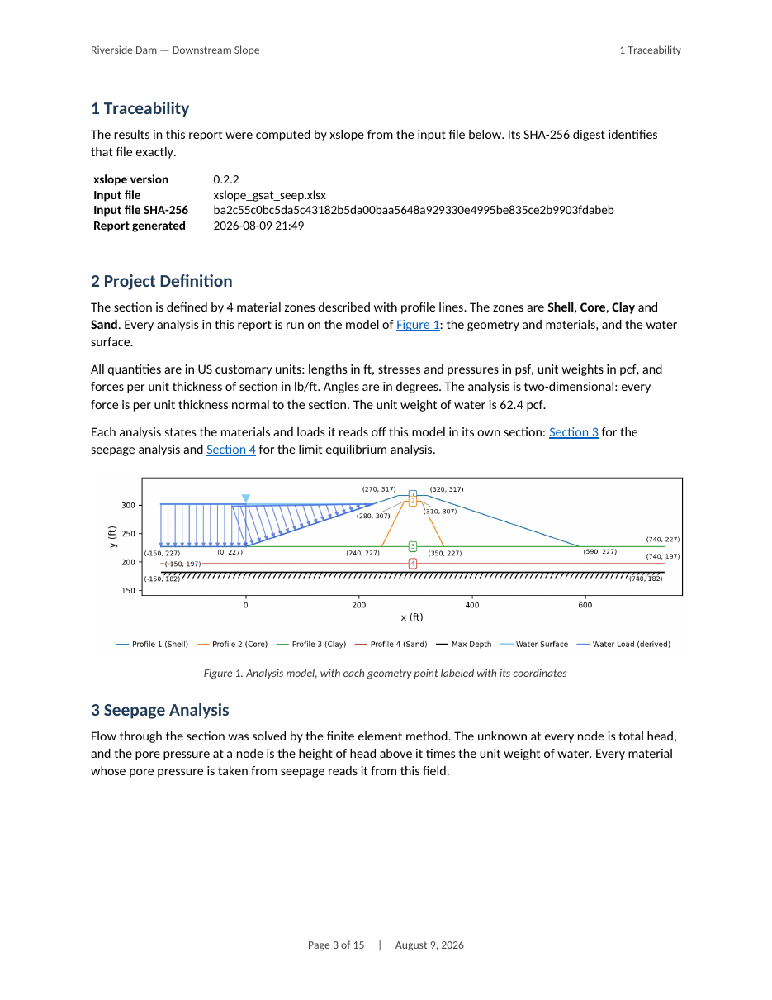
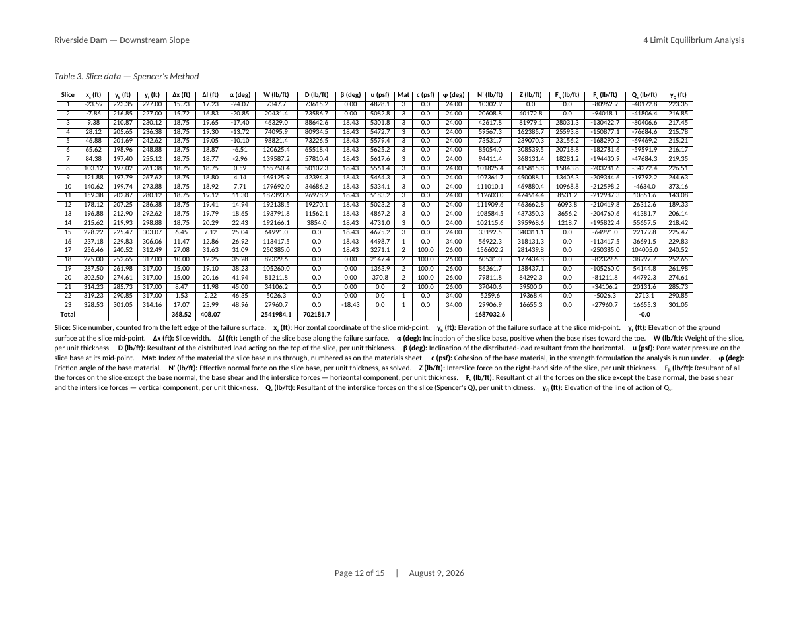
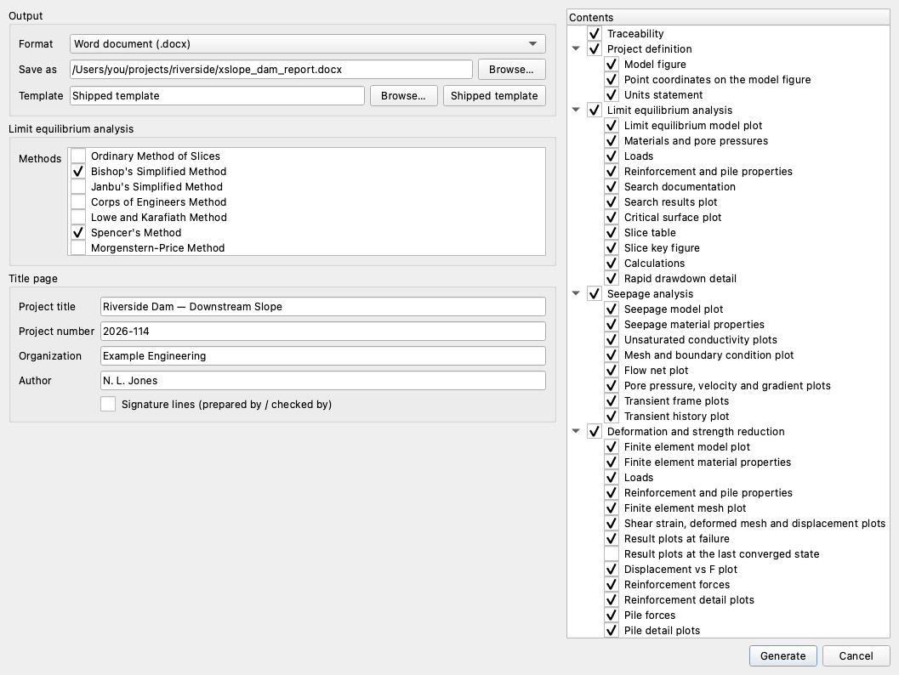

# Analysis Report

**File → Generate Report…** (also on the toolbar) turns the open model and its
results into a Word document: a title page, a table of contents, running heads
and footers, numbered figures and tables, and a section for every engine that
was run. The action becomes available once something has been solved — a report
documents results, and any engine's solution counts.

Nothing in it is a screenshot. The plots are rendered at 300 dpi by the same
plotting code the canvas draws with, and every table is built from the same
DataFrames the solvers produce. The figures are embedded, so a report is one
file.

{width="620"}

---

## What is in a report

Sections are numbered by Word, in this order. Each one is written from the model
and the run: a feature the model does not have is not mentioned, and an engine
that was not run gets no section.

### Traceability

The reproducibility stamp: the xslope version, the input file's name and its
SHA-256 digest, when the analysis was run where the run's own record says, the
mesh where no analysis section counts it out, and when the report was generated.
The digest identifies the exact inputs the numbers came from. A run whose record
carries no solve time gets no row rather than a guessed one.

### Project definition

The model every analysis in the report shares, and only what they share:

- **The section** — how many material zones it is defined by, how they are
  described, and what they are called.
- **A units statement** — the unit system every number in the report is in.
- **The model figure** — geometry with material colors, and whatever else the
  model carries: water surfaces, distributed loads, reinforcement lines, piles.
  Every geometry point is labeled with its coordinates; **Point coordinates on
  the model figure** turns the labels off for a model whose points sit close
  enough together to crowd the plot. Trial surfaces and analysis meshes are
  deliberately absent — they appear with the analyses that use them.
- **A pointer** to the section that states the properties. Materials, water and
  loads belong to the engine that reads them: the strength and pore-pressure
  table under the stability analysis, the conductivities under the seepage
  analysis, the moduli under the finite element analysis. The same material is
  read differently by each, so each states its own.

### Seepage analysis

Written where a flow solution is present, and placed ahead of the analyses that
consume it. See [Seepage Analysis](../seep/overview.md) for the formulation.

**Analysis inputs** — the seepage model plot, the mesh, the unit weight of
water, and the material table: major and minor saturated conductivity and the
angle of the major axis, plus the unsaturated model, its dry relative
conductivity and its fall-off where the problem is unconfined. A confined
problem is solved saturated throughout and prints none of that apparatus. Where
a material carries an unsaturated model, its curve is drawn twice — against
matric suction and against the pressure head the solver works in — with every
material on one set of axes. Then the mesh colored by material with the
specified-head and exit-face nodes marked, one figure per boundary condition set
solved.

**Results**, per set — whether the problem was solved confined or unconfined,
how many nodes carry each boundary type, the computed flow through the section,
and four plots: the flow net, pore pressure, velocity magnitude with the
velocity vectors over it, and hydraulic gradient magnitude. Only the fields the
saved solution carries are drawn.

A model solved for two boundary condition sets — a rapid drawdown's full and
drawn-down pools — gets a subsection each, and every variable is held to **one
range across the pair**, with both flow nets scaled to one zone. A contour then
means the same head in both, a flow channel the same flow, and the drawdown is
the difference between the two figures.

**A transient march** ([Transient Seepage](../seep/transient.md)) is documented
at a few of its saved states — four by default. The first and the last are two
of them; the rest are weighted onto the interval the reservoir level falls over,
so a drawdown report shows the drawdown happening rather than its two ends, and
a march no level falls in is spaced evenly through the states it saved. Each
state is drawn for the same four fields, on one colour scale across every state
so the march can be read down the page. A history figure closes the
section: the level the reservoir boundary is held at, the phreatic elevation and
the top of the seepage face above it, and the boundary inflow and outflow below.

### Limit equilibrium analysis

See [Limit Equilibrium Method](../lem/overview.md).

**Analysis inputs** — the limit equilibrium model plot, the method or methods
documented, the number of slices, the surface family and its defining geometry,
whether the surface was searched for or entered, the seismic coefficient, the
tension crack and the maximum surface depth.

**Materials** — every referenced material with the strength option it is
analyzed under, the properties that option uses, and where its pore pressure
comes from, followed by a statement of the water conditions. A model with no
groundwater and no external water collapses to one sentence saying the section
is analyzed dry. Where the water surface comes from computed heads, the sentence
sends the reader to the seepage section rather than restating it.

**Loads**, and **Reinforcement** and **Piles** where the model carries them —
the properties the method of slices reads, which are not the ones the finite
element analysis reads.

**Factors of safety** — one table of the factor of safety each documented method
reported, with its solution parameters, under a sentence saying where those
surfaces came from. A report of a single method has no such table: one row is
the number that method's own section states.

Then **one block per method**, under that method's own heading:

- **Search for the critical surface**, where that method searched — how many
  trial surfaces it evaluated, over how many refinement stages, the range of
  factors of safety it saw, the window it worked in, and a plot of every trial
  with the critical one highlighted. The search belongs to the method, not to
  the section: two methods searched separately settle on different surfaces.
- **Results** — the factor of safety, the surface plot with its slices and base
  stresses, and any admissibility notes the solution reported. A surface that
  was entered rather than searched for says so, and is not called critical.
- **Rapid drawdown** — the three stage factors of safety and which one governs,
  for a [rapid drawdown](../lem/rapid.md) run.
- **The slice table** — geometry, forces and strengths on a landscape page, with
  column totals at the foot and a legend beneath defining every column. Columns
  that carry nothing for the model are left out. Above it, a slice key: the
  sliced mass with every slice numbered, printed at whatever width puts its
  smallest number at a readable size.
- **Calculations** — the factor of safety worked through.

{width="620"}

#### Calculations

The section prints the equation the solver evaluated and the converged numbers
in it. The equation is the one published for that method — the derivation on its
documentation page, in that page's own symbols, which the section links — with a
force diagram above it and a nomenclature table below.

It is compact by design. Each slice's contribution to the two sums is a column
of the slice table, and the section links that table rather than walking through
every slice. What it prints is the published equation with its named sums under
it, one sentence naming the forces this model does not carry and the reduced
equation they leave, then each named sum evaluated and the division — for
Bishop's method on a dry section with no loads on it:

$$F = \dfrac{N_S}{D_W}, \qquad
N_S = \sum \dfrac{c\, \Delta\ell \cos\alpha + N_v \tan\phi}{\cos\alpha + \sin\alpha \tan\phi / F}, \qquad
D_W = \sum W \sin\alpha$$

$$N_S = 21752.1, \qquad D_W = 17941, \qquad
F = \dfrac{21752.1}{17941} = 1.212$$

The iterative methods show what they iterate on: Bishop and Janbu print the base
normal with the factor of safety in it, so the quotient visibly closes on
itself; Janbu adds the f₀ correction; the force-equilibrium methods state the
interslice inclination; Spencer prints its per-slice resultant Q and both
equilibrium sums evaluating to their residuals at the converged (F, θ), as
Morgenstern–Price does at its (F, λ).

Every number is printed at a precision the factor of safety can be rebuilt from:
divide the two sums as printed and the printed factor of safety comes back. That
reproduction is a test, so the section cannot drift away from the solver. Where
a model uses a feature the compact form cannot show — passive support in a
force-equilibrium method, whose capacity mobilizes with the soil and so carries
1/F on both sides — the section says so rather than printing an equation that
does not reproduce.

### Deformation and strength reduction

See [Finite Element Method](../fem/overview.md).

**Analysis inputs** — the finite element model plot, the mesh, how the initial
stresses were established, the mesh colored by material with its boundary
conditions, and a material table of unit weight, Mohr-Coulomb strength, Young's
modulus and Poisson's ratio. Where the materials take a pore pressure, where it
was read from is stated too, as is a caution on a mesh of low-order elements —
which carry too few degrees of freedom for Mohr-Coulomb yielding and overstate
the factor of safety. **Loads** and the members' finite element properties
follow, in a section each.

**Results** — the factor of safety and how it was reached, then the viscoplastic
shear strain, the deformed mesh and the displacement vectors: the same three
plots the results view offers, in the same order. Which field they are drawn
from is a choice:

| Field state | Default | What is drawn |
| --- | --- | --- |
| **Result plots at failure** | on | The mechanism at failure — the trial that could not reach equilibrium |
| **Result plots at the last converged state** | off | The last trial that did reach equilibrium |
| Both | — | Each state in turn, every variable on one scale across the pair |

A run that captured no at-failure snapshot falls back to the converged field and
the report says so, rather than printing the same three panels twice under two
headings. Where a strength reduction run kept a record of its trials, a search
figure follows: every trial at the factor it was solved at, marked by whether
the section stood under it, with the interval still open after each.

**Reinforcement forces** and **Pile forces** are written where the run solved
members of that kind and its saved fields carry their forces — a solution that
records none says so and reports none. Each subsection carries a locator figure
naming the members in the section, a table of what the analysis put in them, and
a detail plot per member: axial force over the capacity envelope with the bond
transfer beneath it for a reinforcement line, and displacement, shear, moment
and mobilized soil reaction against depth for a pile. Utilization is measured
against the capacity available *at that point* — a line's capacity ramps up over
its pullout length, so the most utilized point is generally not the point of
greatest force. The band marked across a member is where the failure mechanism
crosses it, read from the shear strain field; on a run that converged under
gravity there is no failure, and the same mark is where the computed shear
strain concentrates, named that way.

### Model checks

The [model-check](../usage/preflight.md) findings, in the checker's own words,
scoped to the report: every check declares which analyses it applies to, so a
limit equilibrium report never prints a finding about the finite element engine.
The section is **off by default** — turn it on for a submittal where the checks
belong on the record. Switched on with nothing to report, it says the checks
raised no findings, which is the statement a reviewer came for.

---

## Composing the report

{width="920"}

**Output.** The format and where the file goes. Word (`.docx`) is what is
available; PDF is listed and dimmed. The path defaults to `<model>_report.docx`
beside the model.

**Analysis.** Which methods the report documents in full — each ticked method
gets its own block, and the factor of safety table lists exactly those. Every
method xslope offers is listed, run or not: one that was not run is solved on
the critical surface the report documents, which costs milliseconds on a slice
table that already exists. A method that cannot apply to the surface family — a
moment method on a non-circular surface — is listed and dimmed with the reason
on it. At least one method is always ticked.

**Title page.** Project title, project number, organization and author. These
become Word document properties, so the title page, the running head and any
company template read the same values. A field left empty prints no row on the
title page. Ruled **prepared by / checked by** signature lines are available from
a checkbox and are off by default.

**Contents.** A checkbox tree of everything the report can contain, one box per
section. Turning a parent off dims and disables its whole branch. Each box opens
on that section's own default, which is on for everything except **Result plots
at the last converged state** and **Model checks**.

What is remembered between sessions is what belongs to the person rather than to
the project: the organization, the author, the format, the signature-line
choice, the ticked methods and every content box. The project title is filled in
from the model's own file name, never from the last project reported on.

Generating runs off the GUI thread, so the window stays live: the progress bar
counts the figures by name, Cancel stops the build at the next figure, and the
report action dims until it is finished.

---

## Reporting a model that is already solved

Solving again to write a report would be a waste of a strength reduction
bisection. It is never necessary:

- **In Studio**, opening a model restores the seepage solutions saved beside it,
  steady and transient, and the finite element solution. A restored solution is
  a solved one as far as the report is concerned, and the whole record the run
  kept of itself comes back with it, so the document says how the answer was
  reached and not only what it was.
- **From Python**, `solutions_from_sidecars()` assembles the same bundles from
  the same companion files.

A limit equilibrium solution is not saved beside the model, so a report that
documents one is written from a run in the current session — or, from Python,
from a bundle the caller solved.

---

## Finishing in Word

The contents page is a real Word `TOC` field, and page numbers only exist once a
page layout engine has laid the document out. Rather than guess them, the
written document is handed to the one program that knows: Word opens a **copy**,
updates every field and every table of contents, saves, and closes. The copy
takes the report's place when it comes back, so a finish that fails or is killed
halfway leaves the report exactly as it was written and never puts a Word lock
file beside it. macOS drives Word over Apple events; Windows over COM from
PowerShell. Either way it is a labelled stretch of the progress bar.

Every way this can fail is ordinary — no Word, no permission to drive it, a Word
that does not answer within a minute — and each one leaves a complete report
whose contents page lists the headings without page numbers. A line under that
list says how to fill them in (right-click → **Update Field**, or select all and
press F9), and it sits inside the field result, so Word's first update replaces
it along with the rest. The page numbers in the footer keep themselves current
regardless.

The finish can be switched off on a machine where driving Word is unwelcome:

```
defaults write XSlope "XSlope Studio" report.finalize -bool NO
```

Report generation itself never calls Word — a script that writes fifty reports
must not open fifty documents — so a script that wants the same finish asks for
it:

```python
from xslope.report_finalize import finalize_with_word
ok, msg = finalize_with_word("north_levee_report.docx")
```

---

## Page layout

The document is built on a Word template shipped with xslope, which owns the
page size and margins, the Title, Heading, Body Text and Caption styles, the
rule under the title, and the header and footer frames; the report supplies only
content. Body text is 10.5 pt, a first-level heading 14 pt and the title 24 pt
ranged left, on one-inch margins — sized for a submittal rather than a
presentation. A company template can be used in its place by passing it to
`generate_report`; the metadata already maps onto Word document properties, so
such a template can place them wherever it likes.

The header carries the project title and the section being read; the footer
carries *page N of M* and the report date. Both are live fields.

Tables are fitted to the template's own text width. Each column is measured
against what it has to print — its header and every cell, in the template's font
— so a `#` column stays narrow and a `Material` column does not. A column is
never made narrower than its longest word, except where that word is wider than
an equal share of the page (a file digest, say), which wraps instead. The slice
table takes a landscape page of its own, at a narrower font size, with its
header row repeating on every page it spans; the report returns to portrait
immediately after, so no heading ever opens on a rotated page.

A figure is sized to leave room for the sentence above it, which is kept on the
figure's page: a lead line orphaned at the foot of one page with its figure at
the top of the next wastes most of both. A caption is bound to the figure above
it and to nothing after it.

---

## From Python

The same report, without Studio:

```python
from xslope.fileio import load_slope_data
from xslope.report import generate_report, solutions_from_sidecars
from xslope.slice import generate_slices
from xslope.solve import solve_selected

xlsx = "levee.xlsx"
slope_data = load_slope_data(xlsx)

# Whatever was solved and saved beside the model — seepage, transient, FEM.
solutions = solutions_from_sidecars(xlsx, slope_data)

ok, (slice_df, surface) = generate_slices(slope_data,
                                          circle=slope_data["circles"][0])
solutions["lem"] = [{"slice_df": slice_df, "failure_surface": surface,
                     "results": solve_selected("spencer", slice_df),
                     "search": None, "method": "spencer"}]

ok, out = generate_report(
    slope_data, solutions,
    {"title": "North Levee", "author": "A. Engineer",
     "organization": "Example Engineering", "input_path": xlsx},
    "north_levee_report.docx")
```

`generate_report` returns the package's usual `(success, result)` pair; on
success the result carries the document path, the content tree, and the caption
of every figure the document embeds. The PNGs are drawn in a temporary directory
that goes away with the call — pass `figure_dir` to keep them.

The options dictionary is the dialog's checkbox tree, one key per box. Every key
and its default is declared in `xslope.report.DEFAULT_OPTIONS`, including a few
the dialog does not offer:

- `method` — which methods get a full block. A name or a list of them.
- `seep_transient_frames` — how many saved states of a transient march are
  documented. Four by default.
- `progress` — a callable, called `progress(done, total, label)` once per
  figure; `planned_figures()` gives the same total up front.
- `preflight` — a `PreflightReport` captured at solve time, for the model-checks
  section. Without one, the checks are run against the model as the report is
  built.

`generate_report` reads one option of its own, `template`: the Word template to
build the document on, in place of the one shipped with xslope.

Report generation is headless: it renders through the Agg backend, opens no
windows, and never opens the finished document.

### The slice-table columns

The slice table's columns are declared in `xslope.columns`, which states each
column's label, definition, physical quantity and format, and whether it belongs
in a report. The table headers, the legend printed beneath the table, the column
totals and the choice of which columns to print all come from that one
declaration. A few columns are the report's own — the per-slice terms of the
factor of safety equation, which the calculations section computes and adds to
the table it prints.
