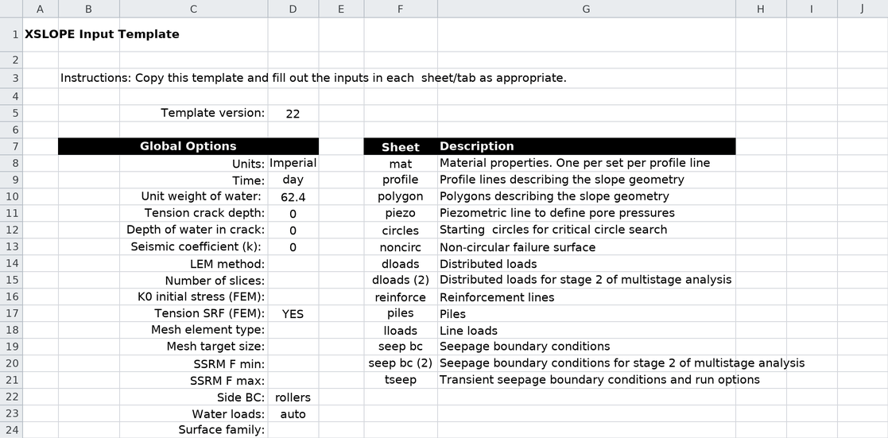
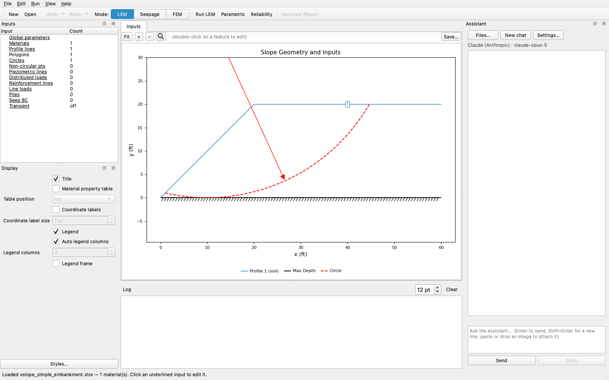
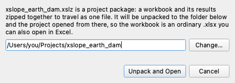
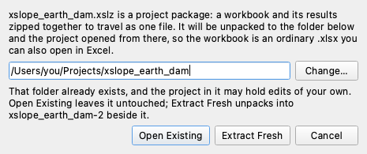

# Tutorial 0 — Building Models Three Ways

An XSLOPE model is an Excel workbook. Three things write that workbook — you, in a
spreadsheet; XSLOPE Studio's editors; and Studio's AI assistant — and they produce
the same model, so a file one of them starts, another can finish.

Every tutorial in this suite is therefore written three times, once per path. What
follows is the machinery all three share.

<div class="tut-glance" markdown>
<div class="tgt-row">
<div class="tgt-tile"><span class="tg-label">Analysis</span><p>All</p></div>
<div class="tgt-tile"><span class="tg-label">Reading time</span><p>~10 min</p></div>
</div>
<div class="tgm-obj" markdown>
**Objectives** — Know what the Excel template is, what Studio's editors and its
assistant do to a model, what **Save As** actually writes, which files a project
collects beside its workbook, and how to send a whole project to somebody else.
</div>
<p><span class="tg-pill">Excel template</span><span class="tg-pill">Studio editors</span><span class="tg-pill">AI assistant</span><span class="tg-pill">Save As</span><span class="tg-pill">project packages</span></p>
</div>

---

## One model, three ways in

| Path | You work in | Reach for it when |
|---|---|---|
| **The Excel template** | a spreadsheet, cell by cell | you want to see exactly what the file holds |
| **Studio's editors** | forms and tables, beside a redrawing section | you are drawing geometry, or auditing a model |
| **The AI assistant** | a chat box, inside Studio | you have a sketch or a description to start from |

The three are entry points, not commitments. The assistant builds into the project
Studio has open, Studio saves that project as an ordinary `.xlsx`, and the `.xlsx`
opens in Excel — so a model started in chat can be finished by hand, and a
spreadsheet built by hand can be handed to the assistant to extend.

---

## The Excel template

The template is the blank master input file. It carries one worksheet per aspect of
the problem — geometry, materials, water, loads, reinforcement, failure surfaces,
seepage boundaries — and a `main` sheet of global options that apply to all of them:



Download it here: [input_template.xlsx](../inputs/input_template.xlsx). Save a copy
under a name of your own before you fill anything in — the template is a blank to
work from, not a file to work in.

Most models use a handful of the sheets and leave the rest empty. A blank cell means
*unset*, which is not the same as zero: a material with no cohesion entered and one
with `c = 0` are different models, and only the second one is claiming anything.
The same goes for the run options on `main` — a blank **LEM method** means *use the
default*, chosen when you run.

Every cell of every sheet is catalogued in the
[Input Template reference](../usage/input_template.md).

---

## Studio's editors

Studio is a structured editor over the same workbook. The **Inputs** tree lists every
input category, most of them with a count of what the model holds; clicking a
category — **Global parameters**, **Materials**, **Profile lines**, **Circles** —
opens its editor.



Three behaviors are worth knowing before your first build:

- **The canvas is always current.** An edit is validated, applied to the model and
  redrawn immediately, so a mistyped vertex shows up as a wrong-looking section
  rather than as a wrong answer later. The geometry editors go further and preview
  the section *while* you type, before you commit.
- **Every edit is undoable.** Edits land on an undo stack as labeled steps — *"Edit
  Materials"*, *"Edit Profile Lines"* — reachable from the toolbar's undo and redo
  buttons and the **Edit** menu. The dropdown beside each button lists the history,
  so you can jump back several steps in one action.
- **Unsaved changes are marked.** An edited project shows an asterisk in the title
  bar until it is written out, and undoing back to the last-saved state clears it.

**File → New** starts an empty project — every category present and blank — which is
where a from-scratch Studio build begins. The full tour of the editors is
[Editing Inputs](../studio/editing.md).

---

## The AI assistant

Studio's assistant is a dockable chat that drives the app and the `xslope` API in
plain language: build a model from a sketch, edit one, run an analysis, explain a
result.


It is **bring-your-own-model** — it does nothing until you give it a provider and
credentials. Press **Settings…** in the dock to choose a provider and enter an API
key, which is stored in your operating system's keychain; see
[Choosing a model](../studio/assistant.md#choosing-a-model) for what each provider
can do. With no API key to be had, choose **Ollama**, which runs a model on your own
machine. The provider library ships in the packaged app; a `pip` install needs the
`ai` extra — see
[Getting the assistant](../studio/assistant.md#getting-the-assistant).

What matters for building models is where its work lands:

- It **edits the open project**, not a file. Its changes appear on the canvas
  immediately, exactly as if you had typed them into the editors.
- Its edits go on the **same undo stack**. It works by running one small snippet at
  a time, and each snippet that changes the model becomes its own labeled step
  (*"Assistant: materials, dloads"*) — so a single request usually leaves several,
  each named for what it touched, and you can undo back to any one of them. A
  snippet that only reads the model leaves no step at all.
- **Nothing is saved until you use Save As.** The assistant writes no file.

An assistant draft is a draft. Read what it built against what you gave it, and
correct it in the same conversation — [LEM-1](lem01_simple_embankment.md) walks that
audit on a real model, and the checking is most of what that path teaches.

---

## Nothing is saved until Save As

**Save As** writes a new `.xlsx` through the bundled blank template, which is what
turns an in-memory project — however it was built — into a file. **Save** writes back
to the same file afterwards, and on a project that has never been saved it routes to
**Save As**, since there is no file to write back to. Until that first write, a new
project exists only in Studio: closing it, or opening something else, prompts you to
save, discard or cancel.

That workbook is the model. Everything an analysis *produces* is written beside it,
in files named after it:

| File | Written by |
|---|---|
| `{base}.xlsx` | you, or Studio — the model itself |
| `{base}_mesh.json` | Build Mesh |
| `{base}_seep.csv` | a steady seepage run |
| `{base}_seep2.csv` | a rapid-drawdown run |

There is no list of these anywhere in the workbook: they are found by the naming
convention, so opening `slope1.xlsx` picks up `slope1_mesh.json` automatically, in
Studio and in Python alike. Rename or move the workbook alone and its results stop
following it. [Project Packaging](../usage/packaging.md) has the complete list of
sidecars.

---

## Sending a project: `.xslz` packages

A **project package** is a `.xslz` file: a plain zip holding the workbook and all of
its sidecars, and nothing else. It exists so a project can be emailed or archived as
one file, with everything in it guaranteed to agree — a project sent as loose
attachments can arrive with a workbook from Tuesday and a mesh from Monday.

**File → Export Project Package…** opens a save dialog with `{base}.xslz` filled in
beside the current project; where it actually goes is yours to choose. The package
is built from the files **on disk**, so Studio offers to save first whenever the
session is holding something that has not been written out — unsaved edits, or a
mesh or a solution whose sidecar does not exist yet.

A package is transport, not a place to work. **File → Open** accepts `.xslz`
alongside `.xlsx`, and opening one unpacks it to loose files first. The dialog shows
where they will go — a folder named for the package, beside it — and **Change…**
picks somewhere else:



Studio then opens the extracted workbook through its ordinary open path, so
everything afterwards refers to that loose workbook rather than to the package.

If the folder is already there it may hold edits of your own, so the dialog asks
rather than guessing:



**Open Existing** leaves that folder untouched and opens the project already in it;
**Extract Fresh** unpacks into a numbered folder beside it.

The next tutorial's completed model is published as a package:

[xslope_simple_embankment.xlsx](../lem/files/xslope_simple_embankment.xlsx)

From Python, `load_slope_data` reads a package directly, unpacking it on the way:

```python
from xslope.fileio import load_slope_data

slope_data = load_slope_data("slope1.xslz")   # unpacks to slope1/, loads slope1.xlsx
```

---

## Your first real build

[**Tutorial LEM-1 — Simple Embankment**](lem01_simple_embankment.md) builds the
smallest complete XSLOPE model down all three of these paths, searches it for a
critical failure surface, and reads what the result says about the model. Pick one
path; the other two are there when you want to see what the same model looks like
from the other side.
