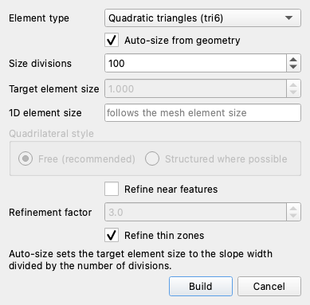
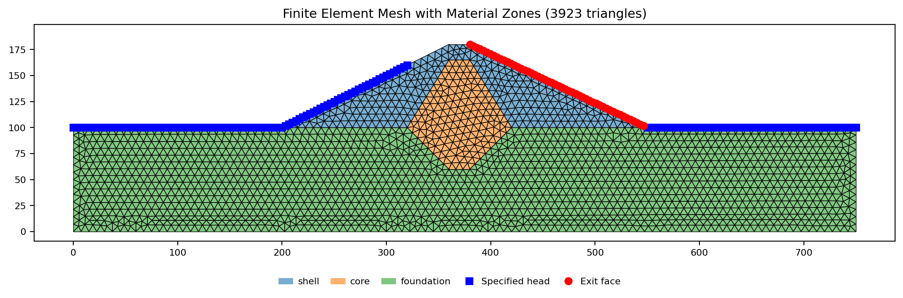
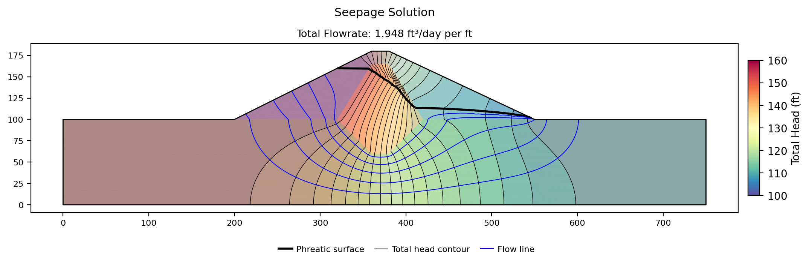
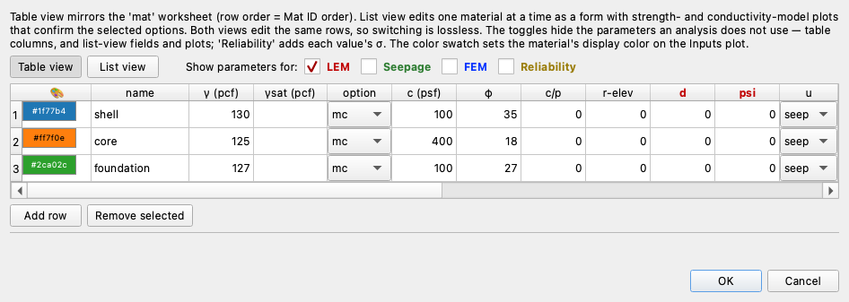
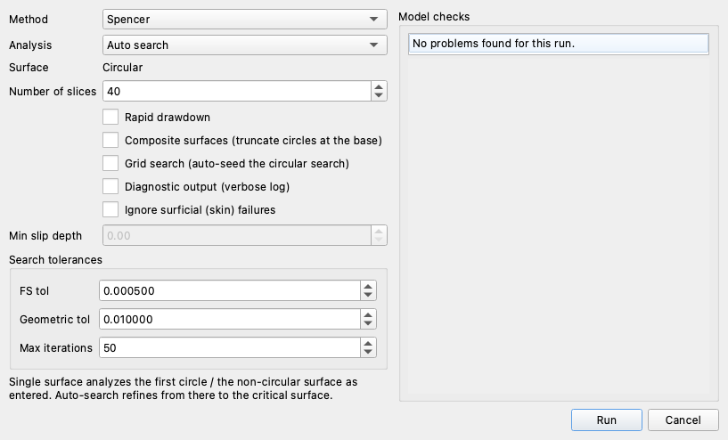
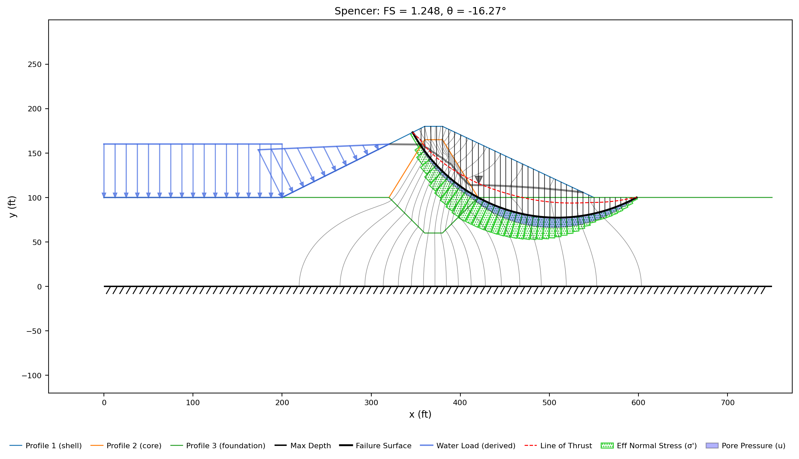
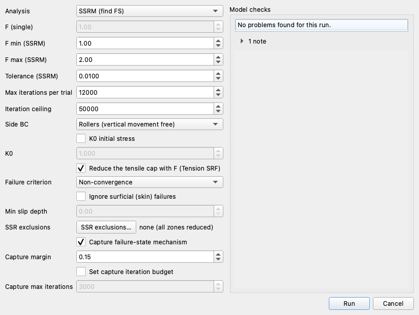
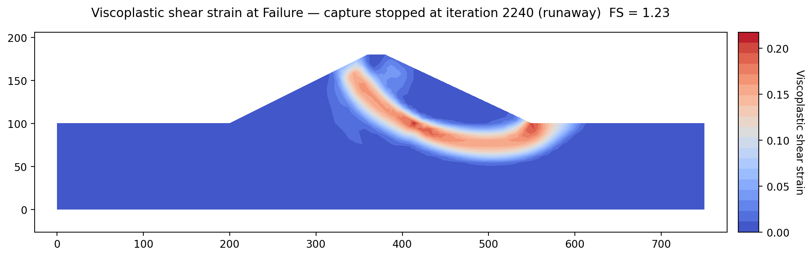

# Tutorial COMBO-1 — Seepage → LEM → FEM

The tutorials before this one work one analysis at a time: the limit equilibrium
pages find a factor of safety, the seepage pages find a head field, the finite
element pages find a factor of safety a second way. Here we run all three from
a single file, in the order a real analysis runs them — seepage first, because
its answer is what the other two need.

A seepage analysis produces a pore pressure at every node of a mesh. Both
stability engines want exactly that, and neither one re-enters it: the limit
equilibrium search reads the field at every slice base, the strength reduction
reads it at every Gauss point, and both read it off the same mesh the seepage
run was solved on. No file is exported, no value is retyped, and nothing about
the water is stated twice.

We work on the Johnson Reservoir dam, already built. In
[SEEP-2](seep02_johnson_dam.md) we construct this model from nothing and work
the seepage physics through in detail; here we open the finished workbook and
spend the page on the three runs and the one column that connects them.

<div class="tut-glance" markdown>
<div class="tgt-row">
<div class="tgt-tile"><span class="tg-label">Analysis</span><p>Seepage + limit equilibrium + finite element</p></div>
<div class="tgt-tile"><span class="tg-label">Open &amp; run</span><p>~20 min</p></div>
</div>
<div class="tgm-obj" markdown>
**Objectives** — Learn how one model carries three analyses: how to mesh once
for all of them, how a seepage solution reaches a stability run, what each
material's pore-pressure option decides, and what keeps the three results
consistent with the inputs they came from.
</div>
<p><span class="tg-pill">three materials</span><span class="tg-pill">unconfined seepage</span><span class="tg-pill">quadratic triangles</span><span class="tg-pill">shared mesh</span><span class="tg-pill">pore-pressure option</span><span class="tg-pill">u = seep</span><span class="tg-pill">Spencer</span><span class="tg-pill">circular search</span><span class="tg-pill">strength reduction</span><span class="tg-pill">shear strain</span><span class="tg-pill">stale results</span></p>
<div class="tgm-model" markdown>
**Model** — [xslope_johnson_res.xlsx](files/xslope_johnson_res.xlsx), the
completed Johnson Reservoir dam, built in [SEEP-2](seep02_johnson_dam.md) and
opened here as it stands. It carries no mesh and no solution, so we make all
three runs below from scratch
</div>
</div>

---

## The dam

{width=1000}

The section is 750 ft long. A 100 ft foundation runs its whole length on rock at
elevation 0, and an 80 ft embankment sits on that foundation: a shell rising at
2:1 upstream to a 20 ft crest at elevation 180 and falling at about 2.1:1
downstream, with a clay **core** through the middle of it that is continued
downward as a **cutoff key** 40 ft into the foundation. The reservoir stands at
elevation 160 and the tailwater at elevation 100.

The three zones carry both problems' properties on one materials table. Their
conductivities are what the seepage run reads — the shell at 1 ft/day, the core a
thousand times tighter at 0.001, the foundation between them at 0.1 — and their
strengths and stiffnesses are what the two stability runs read: the shell at
c = 100 psf and φ = 35°, the core at 400 psf and 18°, the foundation at 100 psf
and 27°, with Young's modulus E and Poisson's ratio ν beside them for the finite
element run. The geometry and the boundary conditions are covered in full in
[SEEP-2](seep02_johnson_dam.md).

We open the file with **File → Open…**. The toolbar's mode strip reads
LEM | Seepage | FEM, and we make the three runs below in that strip's three
positions, in the order Seepage, LEM, FEM. Switch it to **Seepage** and the
Inputs plot draws what the file carries for that mode:

{width=1000}

Three profile lines carve the section into shell, core and foundation; the dark
dashed segments are the two specified-head boundaries with the water levels they
stand for above them, 160 ft upstream and 100 ft downstream; the heavy red dashed
line down the whole downstream slope is the exit face; and the hatched line at
elevation 0 is the maximum depth, the rock the foundation rests on. The strengths
and stiffnesses the two stability runs read are on the same file, on the
materials table, and we never enter them a second time.

---

## The seepage run

The seepage analysis comes first because the other two read its answer. Three
steps: we build the mesh every engine will share, solve the steady flow through
the dam on it, and see where the solution lands so the stability runs can find
it.

### One mesh for all three analyses

Switch the mode strip to **Seepage** (`Ctrl+2`) and click **Run → Build Mesh…**



Leave every control as it is and click **Build**. Two of the defaults matter
enough to name:

**Element type** is **Quadratic triangles (tri6)**. On a seepage run alone the
element order is a trade — head is a scalar field, and a linear mesh solves it
faster for a little less accuracy, which is what we build in
[SEEP-2](seep02_johnson_dam.md). Here it is not a trade. The same mesh goes on to
carry the strength reduction, and linear elements lock volumetrically in an
elastic-plastic solution and report a factor of safety that is too high — in
[FEM-1](fem01_strength_reduction.md#building-the-mesh) we measure the error at
+21% for tri3. Because both analyses share one mesh, the element type has to be
chosen for the stricter of the two, which is why quadratic is both the default
and the requirement here.

**Auto-size from geometry** is ticked at **100** size divisions, so the target
element size is the width of the section divided by that: 750/100 = 7.5 ft, which
the grayed **Target element size** box shows.

The mesh comes out at **8,082 nodes and 3,923 triangles**, with the seepage
boundary conditions marked on it:

{width=1000}

The blue squares are the specified-head nodes at elevations 160 and 100, and the
red circles down the downstream slope are the exit face — the boundary where
water may leave the dam, and the one that makes this an unconfined problem.
The three material zones are drawn in their own colors, so the core and its key
are visible in the mesh rather than only in the answer.

### Solving it

The boundary conditions are on the mesh, so the flow solution is one run of the
seepage dialog. Click **Run → Run Seep…**


The **Model checks** panel carries the preflight report for this run, and on this
model it reports **No problems found for this run.** Leave **Convergence tol** at
`0.0001` and **Max iterations** at `400`, and click **Run**. The unconfined
iteration settles in **26 sweeps**, and the run is over almost as soon as it
starts. The Log pane's closing lines carry the last sweep and the convergence it
reached:

```text
Iteration 25: residual = 9.822325e-04, closure = 1.038e-03, relax = 0.500, 0/52 exit face active
Converged in 26 iterations (residual = 6.971e-04, closure = 6.404e-04, exit face stable)
Flow closure check: inflow = 1.525146e-08, outflow = -0.000000e+00, error = 1.525146e-08
```

{width=1000}

**The total discharge is 1.925 ft³/day per ft** — per foot of dam measured along
its axis, the convention every quantity a two-dimensional analysis reports
carries. (In [SEEP-2](seep02_johnson_dam.md#running-the-analysis) the same model
on a linear mesh at 6.25 ft gives 1.9546; the 1.5% between the two is the mesh,
not the physics.) The head runs from 100.000 ft to 160.000 ft, the two boundary
values and nothing outside them, and the heavy black line is the **phreatic
surface** — the locus of points where the pore pressure passes through zero,
which is drawn from the solved field rather than entered.

<!-- test: file=files/xslope_johnson_res.xlsx, type=seep, element_type=tri6, size_divisions=100, expected_flowrate=1.925, tolerance=0.005 -->

Everything that follows uses that solved field. It is now attached to the
model in the session, as a pore pressure at each of the 8,082 mesh nodes, and it
is written beside the workbook as `xslope_johnson_res_mesh.json` and
`xslope_johnson_res_seep.csv` so that re-opening the file picks both up by name.

---

## The column that connects the modes

With a seepage solution in hand, we next make sure the stability runs use it.
Neither the Run LEM nor the Run FEM dialog has a control for that; the
connection is made once, on the materials table, by each material's
**pore-pressure option** — the `u` column. Click **Materials** in the Inputs
tree and set the **Show parameters for:** toggles to **LEM** alone, which
narrows the table to the columns the two stability engines read:



The column takes four values, and it is set per material rather than once for the
model, so a section can mix them:

| `u` | Where the pore pressure comes from |
| --- | --- |
| `none` | Nowhere — a dry material, or a total stress analysis |
| `piezo` | A piezometric line drawn on the `piezo` sheet |
| `seep` | The finite element seepage solution |
| `ru` | A pore-pressure ratio applied to the vertical total stress |

**All three of this dam's materials read `seep`**, which is what sends the field
solved above to every slice base and every Gauss point. It is a stability input,
not a seepage one: it says what the two stability engines do with a field the
seepage run produced, and it has no effect on the seepage run itself.

Leaving a material on anything else costs a measurable amount, because the
seepage run computes the same field either way and says nothing about who reads
it. With all three materials set to `none` instead, on this same mesh and this
same solved field, the Spencer search below returns **FS = 1.618** against the
1.248 it returns at `seep` — 29.7% higher, on a shallower circle the search
prefers once the water is gone. The seepage analysis still ran, converged and
reported its discharge; the stability run never read it, and every slice base
took zero pore pressure.

The model checks catch the omission both ways. A material set to `seep` on a
model that carries no solved field is an **error** that blocks the run — *"takes
pore pressure from a seepage solution (u = seep), but this model carries no
pore-pressure field"* — so the sequence cannot be run backwards. A solved field
that no material reads raises a **warning** — *"This model carries a solved
seepage field, but no material takes its pore pressure from it"* — and the run
is allowed, because a total stress analysis on a wet section is a legitimate
thing to ask for. Setting the column is the modeler's decision; the warning
makes sure it was a decision.

<!-- test: file=files/xslope_johnson_res.xlsx, type=circular_search, method=spencer, u_option=none, num_slices=40, expected_fs=1.618, tolerance=0.005 -->

---

## The limit equilibrium run

Switch the mode strip to **LEM** (`Ctrl+1`) and click **Run → Run LEM…**



**Method** opens on **Spencer**, the dialog's default. Spencer satisfies both
force and moment equilibrium, which makes it the closest limit equilibrium
statement of what the strength reduction run solves, so it is the method we
compare the two engines on. Leave **Analysis** on **Auto search** and **Number
of slices** at 40, and click **Run**.

The checks column reads **No problems found for this run**, which is itself the
handover working: the three materials read `u = seep`, and the field they need is
in the model because the seepage run put it there.

The Log pane follows the search. Its last two refinement steps and its closing
lines read:

```text
[🔁 iteration 11] center=(508.96, 262.80), FS=1.2481, grid=1.4927
[🔁 iteration 12] center=(508.96, 262.80), FS=1.2481, grid=0.7463
[✅ converged] Iter=12, FS=1.2481 (ΔFS<0.0005) at (x=508.96, y=262.80, depth=77.28)
Critical FS = 1.248
Sliding mass = 1,284,328.7 lb/ft over 290.62 ft of failure surface
```

{width=1000}

**Spencer's method gives FS = 1.248** on a circle centered at (508.96, 262.80)
with a radius of 185.52 ft. It enters the upstream face at x = 346.5, elevation
173.2 — above the reservoir and 6.8 ft below the crest — cuts down through the
core, crosses into the foundation where the core pinches out at x = 420, bottoms
at elevation 77.3, and comes out on the foundation surface at x = 597.9, about
48 ft beyond the downstream toe. The search evaluated 71 candidate circles over
the 12 refinement steps the log counts.

The seepage solution shows up twice on this figure. The thin gray contours
behind the section are the solved total head, and the pale blue band under the
failure surface is the **pore pressure on each slice base**, interpolated from
that field: read off the slice table's `u` column it runs from 0 to 2,044 psf
across the 40 slices, largest where the surface is deepest and zero on the slices
that lie above the phreatic surface. The green hatched band above it is the
effective normal stress the strength was computed from, which is that base's
total normal stress less the blue.

<!-- test: file=files/xslope_johnson_res.xlsx, type=circular_search, method=spencer, seep=steady, element_type=tri6, size_divisions=100, num_slices=40, expected_fs=1.248, tolerance=0.005 -->

---

## The finite element run

Switch the mode strip to **FEM** (`Ctrl+3`). The mesh is already built — the same
one the seepage run was solved on — so **Run → Run FEM…** is available
immediately.



**Model checks — 1 warning**, and **Run** is enabled. The warning is about
`t_cut`, the tensile cutoff left blank on all three materials, which lets each
one carry tension up to its Mohr-Coulomb apex; in
[FEM-1](fem01_strength_reduction.md#running-the-strength-reduction) we work
through what that cap is and when it matters.

Everything else opens on the defaults this run wants. **Analysis** is **SSRM
(find FS)**, the strength reduction: it divides both Mohr-Coulomb strength
parameters by a trial factor *F*, solves the whole slope for equilibrium under
its own weight, and reports the largest *F* the slope still stands at.
**F min (SSRM)** and **F max (SSRM)** are 1.00 and 2.00, the ends of the bracket
to search, and **Tolerance (SSRM)** is 0.0100, the width the bracket is bisected
down to. All of them are covered in
[FEM-1](fem01_strength_reduction.md). Leave everything as it is and click
**Run**. This is the long run of the page, taking far longer than the seepage
solve and the search before it.

{width=1000}

**Strength reduction gives FS = 1.2305**, the midpoint of the final bracket
[1.2266, 1.2344] after seven bisection steps. The shear strain field above is the
mechanism the run found, and nothing about a surface was assumed to find it: the
band of straining soil is wherever the model put it.

The band starts at the upstream face just below the crest, curves down through
the core and the downstream shell into the foundation, and comes out beyond the
toe — the mechanism the Spencer search found, arrived at without a surface being
prescribed.

<!-- test: file=files/xslope_johnson_res.xlsx, type=fem_ssrm, seep=steady, element_type=tri6, size_divisions=100, expected_fs=1.2305, tolerance=0.01, f_min=1.0, f_max=2.0, benchmark=COMBO-1-ssrm -->

The pore pressures reached this run the same way they reached the search: off the
materials' `u` column, interpolated from the same mesh nodes to each Gauss point,
where they reduce the effective mean stress and with it the strength available.
The Run FEM dialog has no water control of its own, and the mesh underneath it
was never rebuilt — the run read the seepage answer because the materials say
to, not because anything was pointed at it.

---

## What integration means here

One definition produced three results. We entered the geometry once, the
materials once and the reservoir level once, and built the mesh once; the
seepage run turned that into a head field, and both stability engines read the
pore pressures out of it without a single input being restated.

What keeps the three consistent is that a result is derived from the inputs it
was computed on, and Studio drops it when those inputs change. Editing any input
clears a stale LEM solution, and editing the **geometry** — a profile line, the
maximum depth, the endpoints of a reinforcement or pile row — also clears the
**mesh**, so the seepage and finite element modes re-gate on a fresh **Build
Mesh** and the seepage solution has to be re-run before either stability engine
will read it again. [Stale results and the mesh](../studio/editing.md#stale-results-and-the-mesh)
states the rule in full. The practical effect is that the three answers on this
page cannot silently belong to three different models.

The two factors of safety are 1.248 and 1.2305, 1.4% apart, on the same
mechanism: a deep surface from the upstream face just below the crest, down
through the core and the downstream shell, into the foundation and out beyond the
toe. They are independent routes to it — the search prescribes a circular surface
and checks the equilibrium of the soil above it, while the strength reduction
develops the mechanism out of the stress field and never chooses a surface — so
their agreement is a check on the combined workflow rather than a restatement of
one result.

---

## Conclusion

This tutorial covered:

- One quadratic mesh for all three analyses, chosen for the strictest of them.
- A seepage run that leaves a pore pressure at every mesh node.
- The materials table's `u` column: `seep` reads that field, `none` ignores it
  (Spencer 1.618 instead of 1.248).
- Spencer 1.248 and strength reduction 1.2305 from the same model and field,
  with nothing exported or retyped.
- Results go stale when the inputs they depend on change.

**Where to go next:** [Seepage and Slope Stability](../seep/seep_slope.md)
carries the interpolation, the negative-pressure treatment and the element-type
requirement in full. [SEEP-2](seep02_johnson_dam.md) is where we build this dam
and work its seepage physics; [FEM-1](fem01_strength_reduction.md) is where strength
reduction and the Run FEM dialog's controls are covered. The
[tutorials index](index.md) lists the series.
