# Tutorial COMBO-2 — Rapid Drawdown

[COMBO-1](combo01_seepage_stability.md) ran the Johnson Reservoir dam under a
standing reservoir. This page lowers that reservoir 50 ft over 45 days, after
five days at full pool, so the pool reaches its residual level at day 50.

Lowering a pool removes the water pressing on the upstream face, which was
holding the slope up. If the soil behind the face could shed its own pore water
just as fast, nothing much would happen: the driving weight and the resisting
strength would fall together. A compacted clay core cannot. It keeps the pore
pressure the full reservoir put into it while the load that balanced that
pressure disappears, and the upstream slope is left carrying its own weight
against a strength it no longer has. Rapid drawdown is the analysis of that
window.

The procedure needs two states of the water — before the drawdown and after —
and there are three ways to say where the water was in each. This page runs all
three on one dam, one set of strengths and one starting circle, so the only
thing that changes between the answers is the statement about the water. The
page is
in three parts, one per statement: **Part 1** draws the two states as two
piezometric lines and runs no seepage at all; **Part 2** replaces the lines with
two steady-state seepage solutions, one at each pool; **Part 3** replaces those
with a single transient seepage run and reads the two states out of it. The
three answers are then set side by side.

<div class="tut-glance" markdown>
<div class="tgt-row">
<div class="tgt-tile"><span class="tg-label">Analysis</span><p>Limit equilibrium + seepage</p></div>
<div class="tgt-tile"><span class="tg-label">Build &amp; run</span><p>~35 min</p></div>
</div>
<div class="tgm-obj" markdown>
**Objectives** — Learn what the three-stage rapid-drawdown procedure computes and
what it needs on the inputs; how to supply its two water states from a
piezometric pair, from two steady seepage solutions and from two frames of a
transient march; how to read which stage governed; and what changes the answer
between the three sources.
</div>
<p><span class="tg-pill">three materials</span><span class="tg-pill">rapid drawdown</span><span class="tg-pill">three-stage procedure</span><span class="tg-pill">Kc = 1 envelope</span><span class="tg-pill">d and ψ</span><span class="tg-pill">piezometric lines</span><span class="tg-pill">second boundary set</span><span class="tg-pill">transient seepage</span><span class="tg-pill">stage times</span><span class="tg-pill">automatic water loads</span><span class="tg-pill">Spencer</span><span class="tg-pill">circular search</span><span class="tg-pill">parametric sweep</span></p>
<div class="tgm-model" markdown>
**Starter file** — [xslope_johnson_rapid_start.xlsx](files/xslope_johnson_rapid_start.xlsx),
the dam with its strengths, its undrained core envelope and a sketched
piezometric pair; no seepage boundary sets and no schedule, which is what the
build below adds

**Completed model** — [xslope_johnson_rapid.xlsx](files/xslope_johnson_rapid.xlsx),
the same dam with both seepage boundary sets and the pool schedule on it; open it
to skip the construction and start at [Part 2](#part-2-two-steady-state-seepage-solutions)
</div>
</div>

---

## What rapid drawdown is

A reservoir standing against an upstream slope does two things at once. Its
weight presses on the face, and that pressure is a stabilizing load. And it
holds a head inside the embankment, which raises the pore pressure and lowers
the effective stress the strength is computed from. Drawing the pool down
removes the first immediately and the second only as fast as the soil can drain.

How fast that is comes from the dimensionless time factor
$T = c_v t / D^2$, where $c_v$ is the coefficient of consolidation, $t$ the time
over which the pool falls and $D$ the longest path pore water has to travel to
get out. [Rapid drawdown analysis](../lem/rapid.md#when-does-rapid-drawdown-apply)
carries the rubric and the $c_v$ table: above $T = 3$ the material drains as fast
as the pool falls and the drawdown is not rapid for it; below 3 it does not, and
the material has to be carried through the drawdown at an undrained strength.

The test is applied per material, not per dam, which is what makes a zoned
embankment the interesting case. This dam's sand shell and silty-sand foundation
drain freely over a 45-day drawdown; its compacted-clay core does not. So the
core is the one zone that arrives at the end of the drawdown still holding the
reservoir's head, and it is the zone that governs.

### The three-stage procedure

XSLOPE uses the three-stage procedure of Duncan, Wright and Wong (1990),
documented in full on the [rapid drawdown](../lem/rapid.md) page. In outline:

**Stage 1 — full pool, drained.** An ordinary effective-stress analysis of the
slope before the drawdown, with the reservoir load on the face and the
pre-drawdown pore pressures inside. Its factor of safety is not the answer. What
it produces is the effective normal stress $\sigma'_{fc}$ and the mobilized shear
stress $\tau_{fc}$ on the base of every slice — the consolidation stress state
the soil arrives at the drawdown in. The slope has to be stable here: at
$FS < 1$ the mobilized stress lies above the failure envelope, there is no
equilibrium consolidation state to read, and the run is
[refused](../lem/rapid.md#the-stage-1-slope-must-be-stable) rather than answered.

**Stage 2 — drawn down, undrained.** The same surface with the drawn-down water
— the reservoir load gone and the post-drawdown pore pressures inside — and, in
every material carrying a $K_c = 1$ envelope, an undrained shear strength
$\tau_{ff}$ computed from that material's stage-1 stresses. The envelope is
entered as two numbers, an intercept $d$ and a slope $\psi$, and the strength
actually used is interpolated between it and the drained envelope according to
the stress ratio $K_1$ the slice consolidated at. Materials with no $d$ / $\psi$
keep their drained $c'$ and $\phi'$ through this stage.

**Stage 3 — drawn down, drained.** The same drawn-down section again, with the
drained strength substituted on every slice where the drained strength turns out
to be *lower* than the undrained one stage 2 used. Because stage 3 only ever
lowers a strength, its factor of safety can never exceed stage 2's, and the
reported answer is the lower of the two. If no slice qualifies, stage 3 is not
run and stage 2 is the answer.

Which of the two governs is a result rather than bookkeeping. Stage 2 governing
says the undrained strengths control: on every slice crossing the core the
undrained strength is the lower of the two, and the drawdown is a strength
problem. Stage 3 governing says the opposite — on at least some of those slices
the undrained strength assigned in stage 2 came out *higher* than the drained
strength at the same stresses, so what limits the slope is the ordinary drained
strength at the drawn-down pore pressures. The
[flip section](#the-governing-stage-flip) below moves this dam from one to the
other and reports what it takes. Duncan, Wright and Brandon (2014) work the whole
procedure by hand in their Table 9.2, on two slip planes in one submerged infinite
slope that are governed by different stages — the shallow one by stage 3 and the
deep one by stage 2 — for the same reason: the stress each plane consolidated at.

### What the procedure needs on the inputs

Each of the three stages reads something an ordinary limit equilibrium model
does not carry: stage 1 needs the reservoir load on the face, stage 2 needs the
undrained envelope for the materials that hold their consolidation stresses, and
stages 2 and 3 both need the pore pressures of the drawn-down state. That comes
to three additions to the input file:

**$d$ and $\psi$** on the materials table — the $K_c = 1$ envelope, on every
material that does not drain during the drawdown. Both or neither: one alone
reverts silently to drained.

**A second water state** — Piezometric Line 2, a second seepage solution, or a
transient frame; the pore pressures stages 2 and 3 read.

**Water loads** = `auto` (`main!D23`) — the reservoir load on the face at stage
1, and whatever is left of it at stage 2.

The second and third are the same statement seen twice, which is why leaving
**Water loads** on `auto` matters here more than anywhere else: the engine reads
the pool from the same place at both stages, so the water pressing on the face
and the pore pressure inside the dam can never disagree about where it stood.

---

## The dam

{width=1000}

The section is 750 ft long: a 100 ft foundation on rock at elevation 0, and an
80 ft embankment on it with a crest at elevation 180. A sand shell rises 2:1
upstream and falls at about 2.1:1 downstream, with a compacted-clay core through
the middle carried 40 ft into the foundation as a cutoff key. The reservoir
stands at elevation 160 and the tailwater at 100. The drawdown this page runs
lowers the pool 50 ft, to a residual reservoir 10 ft deep at elevation 110.
[SEEP-2](seep02_johnson_dam.md) builds the model and covers the geometry in full.

Download [xslope_johnson_rapid_start.xlsx](files/xslope_johnson_rapid_start.xlsx)
and open it with **File → Open…**. The toolbar's mode strip reads
LEM | Seepage | FEM; leave it on **LEM** for now.

### The materials, and the one undrained zone

The first of the three additions is the undrained envelope, and the place to
see which material carries it is the materials table. Click **Materials** in
the Inputs tree and set the **Show parameters for:** toggles to **LEM** alone,
which narrows the table to the columns the drawdown run reads:

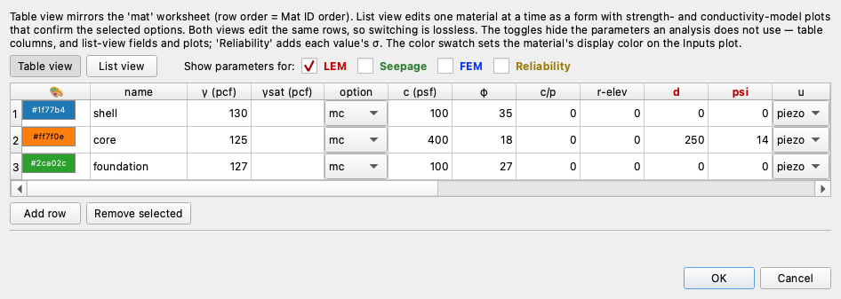

| mat | name | γ (pcf) | c′ (psf) | φ′ (deg) | d (psf) | ψ (deg) | u |
|:---:|---|:---:|:---:|:---:|:---:|:---:|:---:|
| 1 | `shell` | 130 | 100 | 35 | — | — | `piezo` |
| 2 | `core` | 125 | 400 | 18 | 250 | 14 | `piezo` |
| 3 | `foundation` | 127 | 100 | 27 | — | — | `piezo` |

The **d** and **psi** columns are what make this a drawdown model, and only the
core carries them. Its $K_c = 1$ envelope is $d = 250$ psf and $\psi = 14°$, well
under its drained envelope of $c' = 400$ psf and $\phi' = 18°$. Over most of the
core that makes the undrained strength the lower of the two and stage 2 governs,
but the margin is thin: on the transient route below, five core slices come out
stronger undrained than drained and hand the answer to stage 3.
[The sweep](#the-governing-stage-flip) at the end of the page finds the value of
$d$ that separates the two. The shell and the foundation are left blank on both
columns, which declares them free-draining: they keep 100 psf and 35°, and
100 psf and 27°, through every stage.

The model checks report this. Every run on this page carries one warning —
*"2 of 3 material(s) a failure surface can cross carry no d / psi and are treated
as free-draining through the drawdown, keeping their drained strength"* — so a
blank left by mistake is easy to catch. A material carrying **d** without
**psi**, or the reverse, is an error rather than a warning: the checks refuse the
run rather than let a half-entered envelope pass.

---

## Part 1 — Two piezometric lines

The first way to describe the two water states is also the simplest: a
piezometric line for each, one at full pool and one drawn down, sketched from
the piezometers or from judgment, with no seepage run behind either. The file
already carries both lines; Part 1 looks at them and then runs the procedure on
the pair.

### The two lines

The drawn-down water state is the second of the three additions, and here it is
a second piezometric line. Click **Piezometric lines**. The editor has two tabs,
and both are filled:

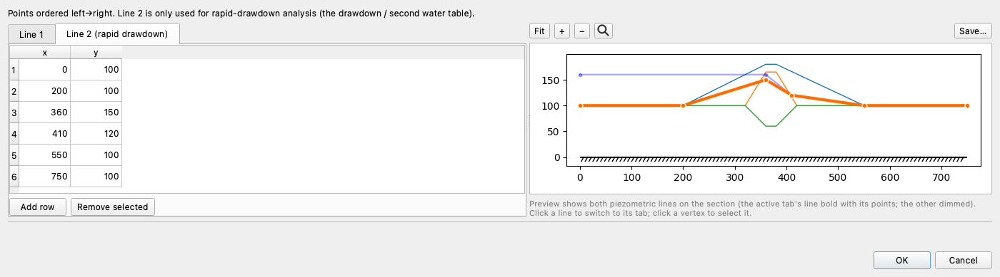

**Line 1 — the full-pool surface.** Five points, running from the reservoir
surface at elevation 160, across the upstream shell at that level, down through
the core, and out to the tailwater at 100:

| x | y |
|---:|---:|
| 0 | 160 |
| 360 | 160 |
| 410 | 120 |
| 550 | 100 |
| 750 | 100 |

**Line 2 — the surface at the end of the drawdown.** Six points, and the shape is
the drawn-down dam after its pore pressures have caught up with the pool: the
residual reservoir at elevation 110 out to where it meets the upstream face, a
long shallow fall through the shell and the core, and the tailwater at 100 from
x = 550 out:

| x | y |
|---:|---:|
| 0 | 110 |
| 220 | 110 |
| 360 | 107 |
| 410 | 103 |
| 550 | 100 |
| 750 | 100 |

Each line is only five or six points, and that is all a piezometric line
usually is: **a statement about where the water table is, not a trace of a solved
head field.** The engine reads it the way [LEM-4](lem04_water_in_the_slope.md)
describes: the pore pressure at a slice base is the vertical distance from the
base up to the line times the unit weight of water, 62.4 pcf, and zero where the
base lies above the line. In practice Line 1 comes from piezometers in a dam that has been standing at full
pool, and Line 2 comes from judgment about where those readings will settle once
the pool is down and the dam has come back to equilibrium — a straightedge sketch
between a few readings and a few assumptions. Where a seepage solution is available it
replaces them, and the rest of this page measures what that replacement changes.

The model checks hold the pair to the rest of the model: Line 2 may not stand
above Line 1 anywhere, and each line has to leave the upstream face at the pool
elevation the seepage boundaries use — 160 and 110 here.

Both lines run the full width of the section, and both tails from x = 550 out to
750 sit exactly on the ground surface. That matters for the water load: with
**Water loads** on `auto` the engine measures each line against the ground and
turns whatever stands above it into a distributed load, so a tail a few feet high
over the downstream foreshore would invent a pond that is not there. Upstream the
same measurement is doing the work it is meant to: Line 1 stands 60 ft above the
foreshore and Line 2 stands 10 ft above it, and those two heights are the
reservoir before the drawdown and the residual pool after it.

Click **OK**, and the Inputs plot draws the whole model:

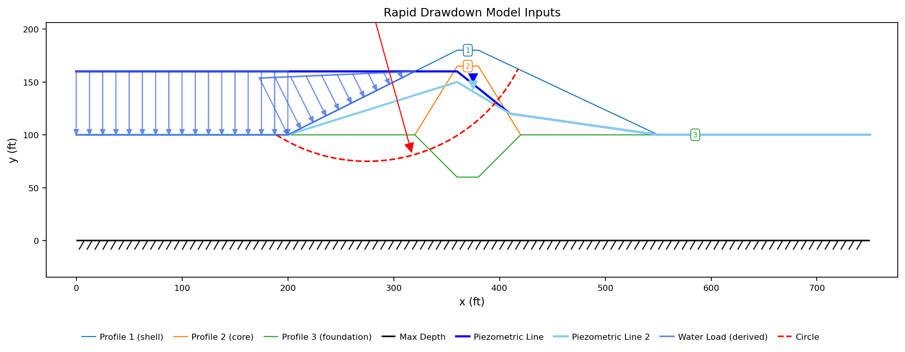{width=1000}

Three profile lines carve the section into shell, core and foundation. The heavy
dark blue line is Piezometric Line 1 and the pale one Line 2, each carrying the
inverted-triangle water-table symbol at its midpoint: 50 ft apart over the
upstream foreshore, 53 ft apart above the core, and the same line from x = 550
out.

Two sets of arrows come off them, both marked **derived**, because the two lines
are two pools and the engine turns each into its own load. The dark set is
stage 1's: the reservoir standing against the slope, 3744 psf at the toe under
60 ft of water and tapering to zero at the elevation-160 waterline. The pale set
is stage 2's: the residual pool, 624 psf under its 10 ft of water and tapering to
zero where it meets the face at elevation 110. Neither was entered anywhere: with
**Water loads** = `auto` on the main sheet, the engine measures both off the
piezometric lines where they stand above the ground surface. The difference between them, 3120 psf at
the toe, is the load the drawdown takes away, and that removal is what the whole
analysis is about. The red dashed arc is the starting circle, and every search on
this page begins from it.

### Running the drawdown on the pair

With the envelope, the second line and the water load all on the file, the
three-stage procedure can run. Switch to **LEM** (`Ctrl+1`) if the mode strip
is elsewhere, and click **Run → Run LEM…**

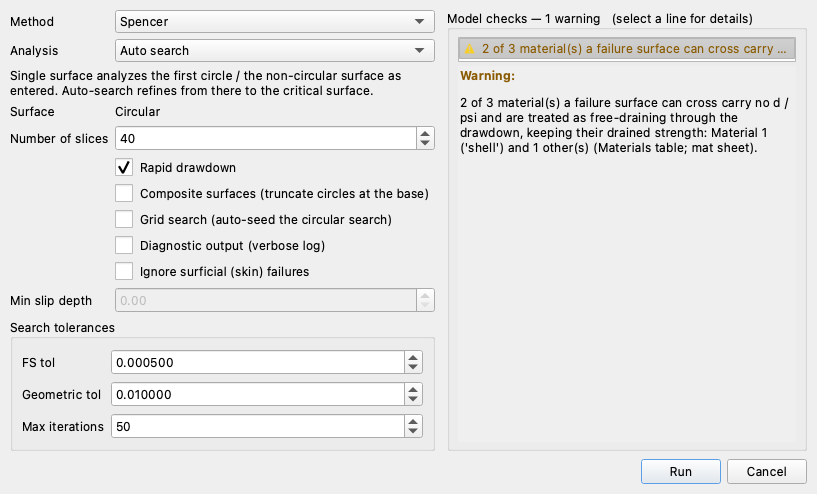

**Method** opens on **Spencer**, which satisfies both force and moment
equilibrium, and every number on this page is Spencer's. One field changes from
the dialog's defaults:

**Analysis** stays on **Auto search**, which the dialog opens on. The search
starts from the circle the file carries — center (275, 235), radius 160 ft,
tangent at elevation 75 — and moves the center and the tangent depth until the
factor of safety stops falling.

Leave **Number of slices** at 40.

**Rapid drawdown → ticked.** This is the control that runs the three-stage
procedure instead of a single solve, and puts the run through the drawdown checks
as well as the ordinary limit equilibrium ones.

Click **Run**. The search takes about half a minute, and the Log pane follows
it:

```text
Searching for the critical circular surface with SPENCER (rapid drawdown)…
[🔁 iteration 1] center=(251.00, 235.00), FS=1.1869, grid=22.7578
[🔁 iteration 8] center=(248.16, 239.27), FS=1.1818, grid=1.4224
[🔁 iteration 17] center=(247.09, 241.58), FS=1.1805, grid=0.1778
[✅ converged] Iter=17, FS=1.1805 (ΔFS<0.0005) at (x=247.09, y=241.58, depth=82.33)
Critical FS = 1.181
Rapid drawdown stages on the critical surface: Stage 1 FS = 1.4835, Stage 2 FS = 1.1805, Stage 3 FS = not required
Sliding mass = 1,101,634.4 lb/ft over 256.56 ft of failure surface
```

Every trial surface in that search carried a full three-stage analysis, and the
last lines of the log give the three stages of the winning surface:

| Stage | | FS |
|---|---|---:|
| 1 | full pool, drained | 1.4835 |
| 2 | drawn down, undrained core | **1.1805** |
| 3 | drawn down, drained | not required |

**The rapid-drawdown factor of safety is 1.181**, on a circle centered at
(247.09, 241.58) with a radius of 159.25 ft — 28 ft upstream of where the search
started, with its tangent 7 ft higher, at elevation 82.3 rather than 75. It
daylights just past the crest at x = 392 and toes on the upstream foreshore at
x = 174.

**Stage 3 was not required.** On all 12 core slices the drained strength at the
stage-2 stresses came out higher than the undrained strength stage 2 used, so
there was nothing lower to substitute. Stage 2 governs, and the drawdown costs
this slope 0.30 against its own full-pool stage-1 figure of 1.484.

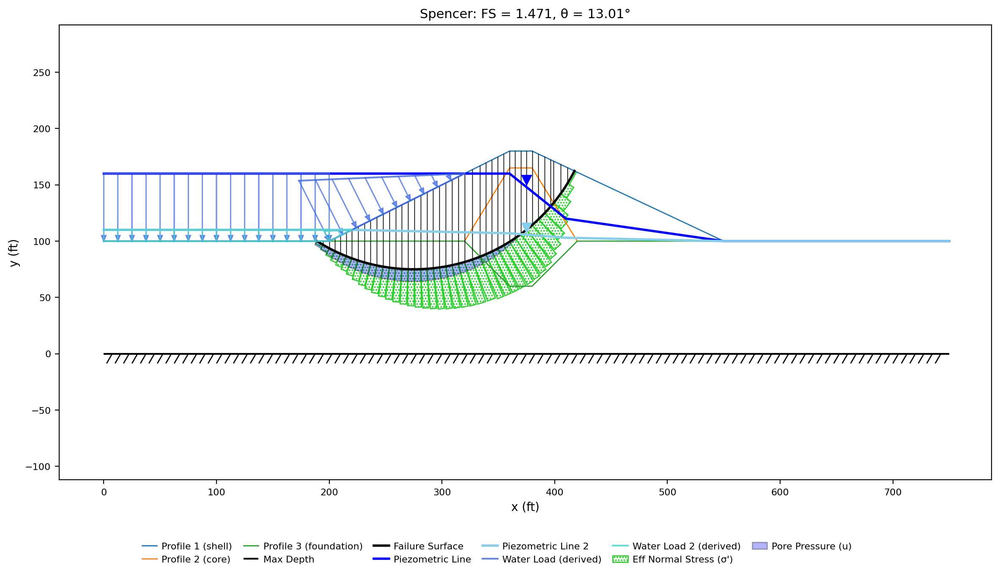{width=1000}

The figure is the governing stage's own state, not stage 1's: the pale blue band
under the failure surface is the stage-2 pore pressure on each slice base,
reaching 1692 psf, and the green hatched band above it is the effective normal
stress the stage-2 strengths were computed from. Both water loads are drawn on
the upstream face — the stage-1 reservoir as well as the residual pool — because
the consolidation stresses stage 2 reads its strengths from came from the first
of them.

---

## Part 2 — Two steady-state seepage solutions

A piezometric line says where the water table is. A seepage solution says what
the head is everywhere, which is a stronger statement: it accounts for the flow
through the core, the anisotropy of the zones, and the seepage face on the
downstream slope, none of which a line drawn between piezometers knows about.
Rapid drawdown can be given two of them — one at full pool and one at the
drawn-down pool — and that is what Part 2 builds.

### Clearing the piezometric lines

The two lines have done their work, and Part 2 replaces both of the jobs they
did. Where a seepage analysis is defined, its head boundaries outrank the
piezometric line for the water loads, and the `u` column set to `seep` outranks
it for pore pressure — a line answers only for a model that has neither. Left on
the file, the pair would be read by nothing, so delete it before building the
boundary sets.

Click **Piezometric lines**. On **Line 1**, select every row and click **Remove
selected**; do the same on **Line 2 (rapid drawdown)**. Click **OK**. The
**Piezometric lines** row in the Inputs dock falls to 0, and the section redraws
without either line.

### The second boundary set

The two water states are described to the seepage engine as two sets of
boundary conditions. Switch the mode strip to **Seepage** (`Ctrl+2`) and click
**Seep BC** in the Inputs dock. The editor has two tabs.

**Set 1** is the ordinary boundary set: it describes the dam under the full
reservoir. Press **Add head** twice, then select the **Exit face** entry already
in the list.

*Head 1 — the reservoir*, at **Head value (ft)** `160`, along the upstream
foreshore and up the submerged part of the face:

| x | y |
|---:|---:|
| 0 | 100 |
| 200 | 100 |
| 320 | 160 |

*Head 2 — the tailwater*, at `100`, along the downstream foreshore:

| x | y |
|---:|---:|
| 550 | 100 |
| 750 | 100 |

*Exit face*, over the whole downstream slope, from the crest to the tailwater:

| x | y |
|---:|---:|
| 380 | 180 |
| 550 | 100 |

[SEEP-2](seep02_johnson_dam.md#4-boundary-conditions) is where the three boundary
types and the no-flow default are worked through, and it solves this same set.

**Set 2 (rapid drawdown)** is a second, independent boundary set on the same
section. Its job is to describe the dam under the drawn-down pool, so that a
second steady solve can be made from it. It is the same three entries Set 1
carries, with the reservoir 50 ft lower. Press **Add head** twice, then select the
**Exit face** entry already in the list:

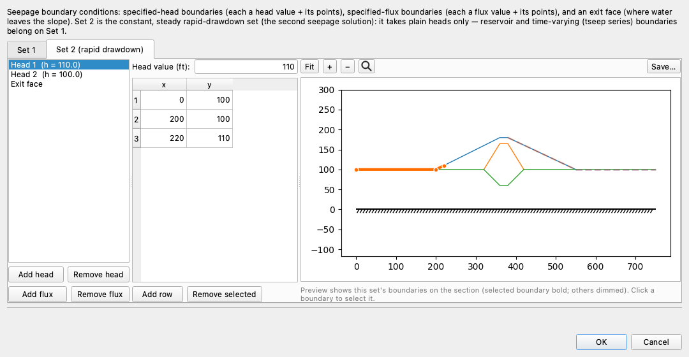

*Head 1 — the residual pool*, at **Head value (ft)** `110`, along the upstream
foreshore and up the face as far as the lowered pool wets it:

| x | y |
|---:|---:|
| 0 | 100 |
| 200 | 100 |
| 220 | 110 |

*Head 2 — the tailwater*, at `100`, unchanged:

| x | y |
|---:|---:|
| 550 | 100 |
| 750 | 100 |

*Exit face*, over the whole downstream slope, unchanged:

| x | y |
|---:|---:|
| 380 | 180 |
| 550 | 100 |

Click **OK**.

### Meshing, and both solves

Both sets solve on one mesh, which has to be built first. Click
**Run → Build Mesh…** and set **Element type** to **Linear triangles
(tri3)**. Head is a scalar field, so there is nothing for a linear element to
lock up on, and no strength reduction runs on this page — the
[quadratic requirement COMBO-1 meets](combo01_seepage_stability.md#one-mesh-for-all-three-analyses)
comes from the finite element stability engine, not from seepage. Element order
also sets the cost of the transient march below, which takes thousands of steps
on whatever mesh it is given.

Leave **Auto-size from geometry** ticked at **100** size divisions, which makes
the target element size the width of the section over that number,
750/100 = 7.5 ft. Click **Build**. The mesh comes out at **2,080 nodes and 3,923
triangles**:

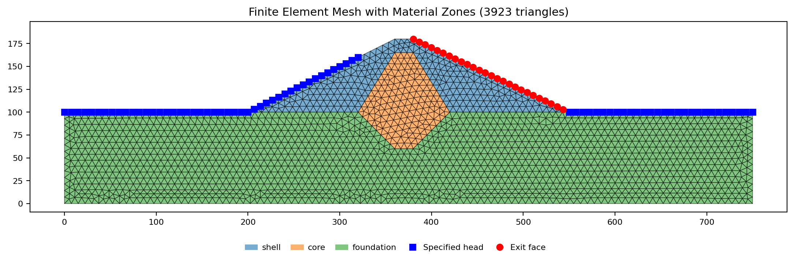{width=1000}

The blue squares are Set 1's specified-head nodes — along the upstream foreshore
and up the face to elevation 160, and along the downstream foreshore at 100 —
and the red circles down the downstream slope are the exit face.

Click **Run → Run Seep…**. Opened from the completed model rather than built up
from the starter, the dialog carries a **Run type** selector at the top, because
that file already has the schedule the next section adds; leave it on **Steady**.
Leave **Convergence tol** at `0.0001` and **Max iterations** at `400`, and click
**Run**. Because the file defines two boundary sets, one steady run solves
**both** of them, each keeping its own results tab — **Seep · Solution** for
Set 1 and **Seep · Solution 2** for Set 2 — and each writing a companion file
beside the workbook, `_seep.csv` for Set 1 and `_seep2.csv` for Set 2, so that
reopening the file picks them up by name.

The **Seep · Solution** tab:

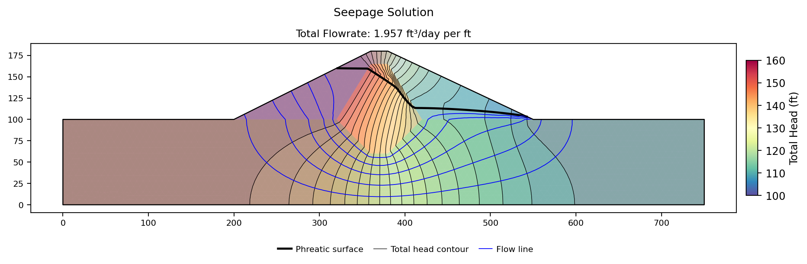{width=1000}

**Set 1** settles in **22 unconfined sweeps** to a total discharge of
**1.9566 ft³/day per ft** of dam, printed on the figure as 1.957. The head runs
from 100.000 to 160.000 ft, the two boundary values and nothing outside them.
The heavy black line traces the phreatic surface: nearly
flat across the upstream shell at reservoir level, falling almost the whole 60 ft
inside the core, and running low across the downstream shell to the tailwater.
A flow net covers the rest of the section: thin black total head contours, and
blue flow lines running from the upstream face through the section to the exit
face. The contours crowd where head falls fastest, and each channel between two
flow lines carries an equal share of the discharge. Almost the entire head loss
is in the core, which is what a cutoff key is for.
([COMBO-1](combo01_seepage_stability.md#solving-it) reports 1.925 for the same
boundary set on a quadratic mesh at the same 7.5 ft target — 8,082 nodes rather
than 2,080, because quadratic elements add a node on every edge. The 1.6%
between the two answers is that discretization, not the physics.)

The **Seep · Solution 2** tab:

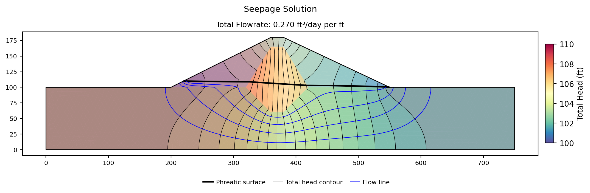{width=1000}

**Set 2** settles in **8 sweeps** to **0.2695 ft³/day per ft**, a seventh of
Set 1's discharge on a sixth of the head difference. The head runs from 100.000 to
110.000 ft, and the phreatic surface leaves the residual pool at elevation 110,
gives up about a foot crossing the upstream shell, drops 6 ft through the core,
and runs the last 3 ft out to the tailwater. The core still takes the largest
single share, but nothing like the share it took in Set 1: with the water table
down at foundation level, the saturated part of the section is mostly foundation,
and the head loss spreads through it instead of concentrating in the clay. Above
that surface the embankment is unsaturated, and
the negative pressures there are
[clamped to zero](../seep/seep_slope.md#negative-pore-pressures) before any slice
reads them.

Each tab scales its colorbar to its own field, so color does not carry from one
figure to the other: the ramp spans 60 ft of head in Set 1 and 10 ft in Set 2.

### Pointing the materials at the fields

The seepage solutions exist, and nothing reads them yet. Switch back to **LEM**
(`Ctrl+1`), open **Materials**, and set the **u** column to `seep` on all three
rows. That column is what sends a solved field to every slice base, and it is set
per material rather than once for the model;
[COMBO-1](combo01_seepage_stability.md#the-column-that-connects-the-modes)
covers its four values and what each one costs.

A drawdown run reads **two** fields through that one column: `seep_u` from Set 1
for stage 1, and `seep_u2` from Set 2 for stages 2 and 3. The checks refuse the
run if either field is missing.

Run **Run → Run LEM…** again with the same settings — Spencer, Auto search,
40 slices, Rapid drawdown ticked. The search leaves the same starting circle and
settles a little upstream of where the pair's did, at (245.31, 243.53) with a
radius of 161.82 ft:

| Stage | | FS |
|---|---|---:|
| 1 | full pool, drained | 1.5514 |
| 2 | drawn down, undrained core | **1.1949** |
| 3 | drawn down, drained | not required |

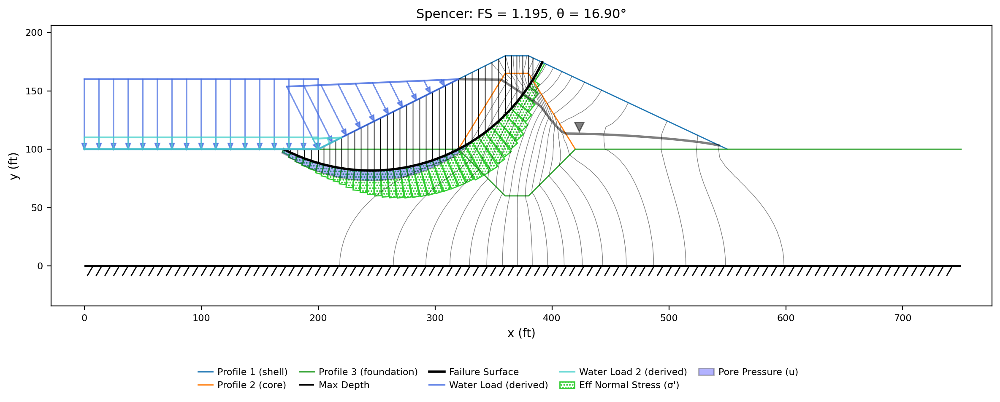{width=1000}

**The rapid-drawdown factor of safety is 1.195**, against 1.181 from the
piezometric pair. Stage 2 governs again, on all 12 core slices, and the pale blue
band under the surface peaks at 1727 psf against the pair's 1692.

The two surfaces sit about 3 ft apart. Both daylight just past the crest at
x = 392 and toe on the upstream foreshore within 4 ft of each other, at x = 171 against
x = 174 for the pair, so only the water separates the two answers. Dropping the
undrained envelope shows that most clearly. Run as ordinary drained problems —
**Rapid drawdown** unticked, each searching for itself — the drawn-down state
gives 1.3125 from Line 2 and 1.3105 from Set 2, the same model to within two
thousandths, because Line 2 was traced off Set 2's own phreatic surface. At full
pool the same pair of runs gives 1.4670 and 1.5098, and the sketch comes out 2.8%
lower: a static column measured down from Line 1 puts more pore pressure deep in
the section than the solved field does. That full-pool difference reaches the
drawdown answer, because stage 2 computes its undrained strengths from the
stage-1 effective stresses — and 1.181 against 1.195 is what is left of it.

---

## Part 3 — A transient seepage run

Two independent steady solutions describe two equilibrium states. What they do
not describe is the passage between them: Set 2 is the dam *long after* the
drawdown, when the core has finished giving up the head the full reservoir left
in it. On a core with a conductivity of 0.001 ft/day that is a long time, and the
drawdown itself is over by day 50 — five days at full pool, then 45 days of
lowering. A
transient seepage run resolves that directly — it is a history of pore-pressure
fields as the reservoir is lowered on a schedule, so the two stage fields are two
frames read out of one march rather than two independent solves assembled by
hand.

[SEEP-3](seep03_reservoir_drawdown.md) builds a transient model from nothing and
covers the storage properties, the time series, the initial condition and the
saved-frame schedule. The build below is the same shape on this dam, and the
storage properties it needs are already on the materials table:
*S<sub>s</sub>* and *S<sub>y</sub>* of 1 × 10<sup>−4</sup> /ft and 0.22 on the
shell, 1 × 10<sup>−3</sup> /ft and 0.03 on the core, 2 × 10<sup>−4</sup> /ft and
0.15 on the foundation.

### Clearing boundary set 2

The schedule built below states where the reservoir stands at every instant,
including the stage 2 time the drawdown reads its second field at, so Set 2 has
nothing left to say and the transient route does not consult it.

Click **Seep BC** and open the **Set 2 (rapid drawdown)** tab. With the top entry
selected, click **Remove head** twice, which takes out both heads. Select **Exit
face**, select its rows and click **Remove selected**. Click **OK**. Set 1 is
untouched: it carries the reservoir boundary the schedule drives, and the march
starts from its steady solution.

### The pool schedule and the stage times

The storage properties say how the dam responds; the schedule says what the
reservoir does. Switch to **Seepage** and click **Transient** in the Inputs
dock.

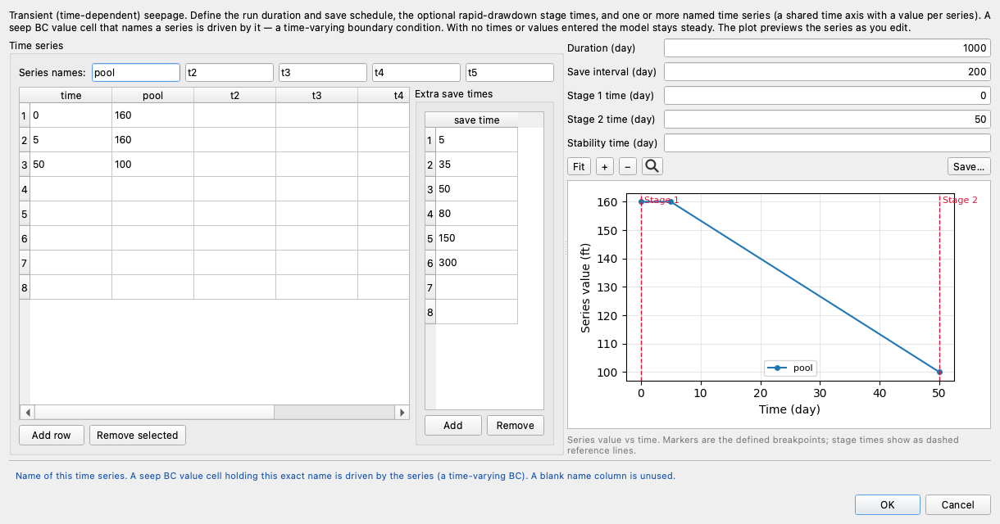

**Series names.** Type `pool` over the first column's default name `t1`. A
boundary becomes time-varying by having this exact name typed into its value
cell, which is the last step of this section.

**The breakpoints.** Three rows: the reservoir holds at full pool for five days,
then falls to the residual pool over the following 45.

| time | pool |
|---:|---:|
| 0 | 160 |
| 5 | 160 |
| 50 | 110 |

**Extra save times** `5`, `35`, `50`, `80`, `150`, `300`, in the list beside the
series table. Then, in the controls above the preview, **Duration (day)** `1000`
and **Save interval (day)** `200`. The duration carries the run well past the
drawdown so the dam's recovery toward its new steady state is in the answer too;
the extra times put frames where the regular grid would miss them.

**Stage 1 time (day)** `0` and **Stage 2 time (day)** `50`. These two fields are
what a drawdown run reads, and SEEP-3 leaves them deliberately blank because a
seepage page has no use for them. Stage 1 at t = 0 is the full-pool state the
march starts from; stage 2 at t = 50 is the instant the pool reaches elevation
110 and stops falling. Both are forced into the saved-frame schedule, so each is a
*computed* frame rather than a blend of two neighbors. Set both or neither, and
stage 1 must come before stage 2.

The preview draws them as red dashed reference lines across the schedule, which
is the quickest check that they land where they were meant to. Click **OK**.

### Binding the reservoir boundary

The schedule is on the file, and no boundary follows it yet. Reopen **Seep BC**,
select **Head 1** on **Set 1**, and change two fields. Set
**Type:** to `reservoir` — a boundary that holds a node only while that node is
at or below the water level, and releases any node the falling pool has left
standing above it. Then clear **Head value (ft)** and type `pool` in its place. A
value cell holding the name of a series is driven by that series instead of by a
constant, and that is the whole of what makes a boundary time-varying.

Nothing about the numbers already computed changes. A steady solve reads a
series-bound value at t = 0, so Set 1 with `pool` bound to it solves at 160 and
returns the same 1.9566 ft³/day per ft as before, and says so in its log —
*"Series 'pool' read at t = 0 for the steady solve: reservoir value 160"*.

### Marching it

With the schedule and the stage times on the file, the transient solve is one
more run of the seepage dialog. Click **Run → Run Seep…**. The dialog has grown
a **Run type** selector, which appears only on a file carrying a schedule; set it
to **Transient (time-dependent)**. **Convergence tol** and **Max iterations** gray
out — they belong to the steady solve, and the march sets its own step size from
how fast the field is moving. Click **Run**.

The march solves its initial condition first — the same unconfined iteration as
the steady run — and then prints a line per saved frame:

```text
  t=5: frame saved (steps so far=6, mass-balance closure=1.39e-05)
  t=35: frame saved (steps so far=272, mass-balance closure=7.28e-02)
  t=50: frame saved (steps so far=440, mass-balance closure=6.79e-02)
  t=80: frame saved (steps so far=846, mass-balance closure=6.87e-02)
  t=150: frame saved (steps so far=1320, mass-balance closure=2.04e-02)
  t=200: frame saved (steps so far=1394, mass-balance closure=2.02e-02)
  t=300: frame saved (steps so far=1466, mass-balance closure=5.67e-02)
  t=400: frame saved (steps so far=1507, mass-balance closure=5.43e-02)
  t=600: frame saved (steps so far=1569, mass-balance closure=3.43e-02)
  t=800: frame saved (steps so far=1617, mass-balance closure=2.82e-02)
  t=1000: frame saved (steps so far=1671, mass-balance closure=2.41e-02)
```

This is the long run of the page — a few minutes, where every other run here has
been seconds. **Twelve frames** come out of it, at t = 0, 5, 35, 50, 80, 150,
200, 300, 400, 600, 800 and 1000: the union of the save-interval grid, the extra
save times, the schedule's own breakpoints, and the two stage times. **1,671
steps** sit behind them, and where the solver spent them is itself a reading:
**440 of them, 26%, are inside the first 50 days**, which are 5% of the run's
duration. The field moves while the pool is falling and barely at all afterward.

The two frames the drawdown will read are the first and the fourth. The
**Seep · Transient** tab holds one frame at a time; step its play bar back to
t = 0:

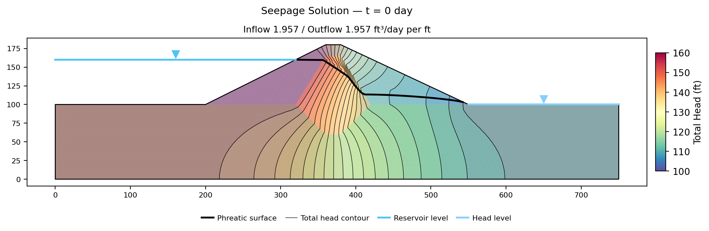{width=1000}

then forward to t = 50:

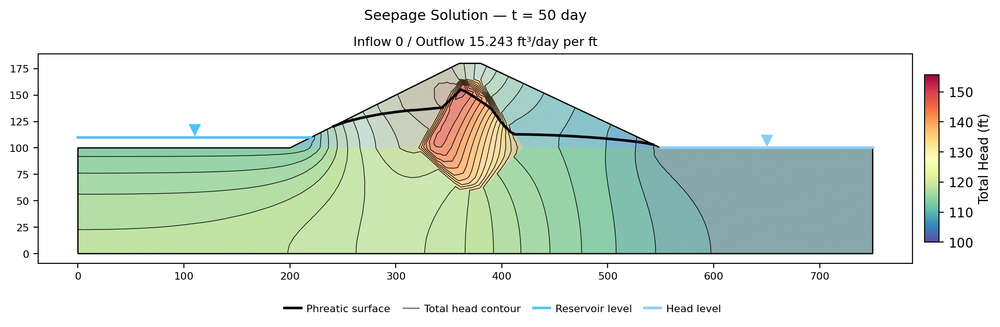{width=1000}

A transient frame carries no flow net — a flow net needs steady through-flow, and
a draining section is releasing storage instead — so these two figures draw head
contours and the phreatic surface without flow lines, and the title reports
boundary inflow and outflow separately rather than one discharge. Pale blue
waterlines with apex-down markers give the reservoir and tailwater levels the
frame stands at.

At **stage 1**, t = 0, the reservoir is full and the frame reproduces the steady
solution above: inflow and outflow both read 1.957 ft³/day per ft, Set 1's
discharge. At **stage 2**, t = 50, the pool has reached elevation 110 — the
upstream water level marker has dropped 50 ft — and inflow has fallen to zero
while 15.243 ft³/day per ft still leaves the section, every bit of it drained
storage. The upstream shell has followed the pool partway down, with the
foundation beneath the upstream slope beginning to unload. The core has barely
moved. It still holds a pocket of head near 150 ft, in the middle of the section,
exactly where every critical surface on this page crosses it. That pocket is the
whole difference between this route and the two steady solves, where the same
region has come back to within a few feet of the pool.

### The third answer

That pocket is what the drawdown run reads next. Switch to **LEM** and run
**Run → Run LEM…** once more — Spencer, Auto search, 40 slices, Rapid drawdown
ticked. The form has grown the group the schedule adds:

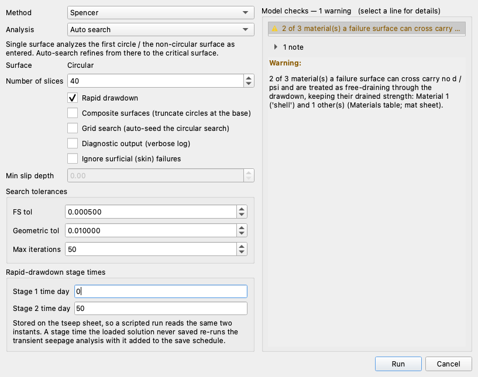

**Stage 1 time** and **Stage 2 time** hold 0 and 50, read from the tseep sheet
where the Transient editor stored them, and editing them here changes the model
the same way editing them there does. They replace the single seepage-time
selector an ordinary run on a transient model gets, because a drawdown reads two
instants rather than one; a stage time the solved march never saved re-marches
with it added to the save schedule.

Click **Run**. The two named frames come out of the solved march and their pore
pressures go to the three stages in memory — no `_seep.csv` files are written or
read, and staged frames take precedence over any that are sitting beside the
workbook.

| Stage | | FS |
|---|---|---:|
| 1 | full pool, drained | 1.5546 |
| 2 | drawn down, undrained core | 1.0164 |
| 3 | drawn down, drained | **1.0158** |

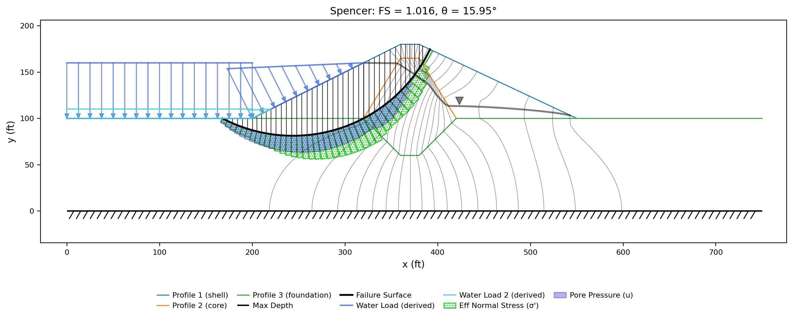{width=1000}

**The rapid-drawdown factor of safety is 1.016**, on a circle at (243.93, 244.90)
with a radius of 163.64 ft — 2 ft again from the two-steady route's. Stage 1
reads 1.5546 against that route's 1.5514, on the same field: the frame at t = 0
*is* the steady solution of Set 1, and the three thousandths between the two
numbers are the two searches settling on two circles.

The gap between the two answers opens at stage 2, where the peak pore pressure on
the slice bases reaches **2692 psf** against the two-steady route's 1727 — the
core's undissipated head, read straight off the frame.

**Stage 3 ran here, and it governs.** Five of the 12 core slices came out
stronger undrained than drained at these stresses, so the drained strength was
substituted on them and the reported answer is stage 3's 1.0158 rather than
stage 2's 1.0164. Six ten-thousandths separate the two. The
[sweep below](#the-governing-stage-flip) finds why they are this close: the core's
own $d$ of 250 psf sits 27 psf above the value at which the first slice crosses
over.

---

## The three answers, and what brackets them

The three parts used the same dam, the same strengths, the same Spencer solver
and the same starting circle. Only the statement about the water changed, and
each run searched from that circle for the surface its own water made critical:

| Part | Two water states from | Critical circle | Stage 1 | Stage 2 | Stage 3 | **FS** |
|:---:|---|---|---:|---:|---:|---:|
| 1 | Piezometric Lines 1 and 2 | (247.1, 241.6) R 159.2 | 1.4835 | 1.1805 | not required | **1.181** |
| 2 | Two steady seepage solutions | (245.3, 243.5) R 161.8 | 1.5514 | 1.1949 | not required | **1.195** |
| 3 | Two frames of a transient march | (243.9, 244.9) R 163.6 | 1.5546 | 1.0164 | 1.0158 | **1.016** |

The three centers span 5 ft and the three radii 4 ft; all three surfaces daylight
just past the crest at x = 392 and toe on the upstream foreshore between x = 168 and
x = 174. So the spread across the answers — 0.179, 18% of the lowest — comes from
the water and not from the geometry, and almost all of it separates the transient
route from the other two. Ordinary drained searches at each end of the drawdown
put that spread in context:

| Run | Core strength | Pore pressures | FS |
|---|---|---|---:|
| Full pool | drained | full-pool field | 1.510 |
| Drawn down, long term | drained | re-equilibrated field | 1.311 |
| Drawn down, long term | **undrained** | re-equilibrated field | **1.195** |
| Drawn down, day 50 | drained | transient frame | 1.035 |
| Drawn down, day 50 | **undrained** | transient frame | **1.016** |

The two bold rows are the two-steady and transient drawdown answers; the other
three are ordinary drained runs from the same starting circle, each reporting a
critical surface of its own, and between them they separate the drawdown into its
parts.

**The load removal alone costs 0.20.** Taking 50 ft of reservoir off a dam whose
pore pressures have fully caught up moves the slope from 1.510 to 1.311, at
drained strength throughout. That is the long-term condition the dam settles into
months after the drawdown.

**The core's retained water costs a further 0.28.** Holding the day-50 pore
pressures instead of the re-equilibrated ones, still at drained strength, moves
1.311 to 1.035. Nothing about the strengths differs between those two runs.

**The undrained strength costs 0.12 — or 0.02.** On the re-equilibrated field
it moves 1.311 to 1.195; on the day-50 field it moves 1.035 to only 1.016. The
same envelope, and six times the effect on one field as on the other, because
the retained pore pressure has already cut the effective stress the *drained*
strength is computed from, bringing the two strengths close together. Where the
water is decides how much the strength choice changes, which is why the three
sources cannot be compared without saying which field each was read on.

---

## The governing-stage flip

Stage 2 governed the first two runs above. On the transient route stage 3 took
over, on five of the twelve core slices, and lowered the answer by six
ten-thousandths. Where that handover falls is a property of this core's
envelopes, not of the method, and it moves.

Hold the transient route fixed — same fields, same starting circle, same
everything — and sweep the core's undrained cohesion intercept $d$ across its
250 psf, with $\psi$ held at 14°. Raising $d$ raises the undrained strength
stage 2 assigns, which raises the stage-2 factor of safety. It does nothing to
the drained strength. So each step up makes it likelier that on some slice the
drained strength is the lower of the two, which is exactly the test stage 3
applies. Every row below is a search of its own.

| d (psf) | Stage 2 | Stage 3 | Core slices on drained strength | Reported FS | Governs |
|---:|---:|---:|:---:|---:|:---:|
| 100 | 1.0015 | 1.0015 | 0 of 12 | 1.0015 | stage 2 |
| 150 | 1.0065 | 1.0065 | 0 of 12 | 1.0065 | stage 2 |
| 200 | 1.0114 | 1.0114 | 0 of 12 | 1.0114 | stage 2 |
| 225 | 1.0139 | 1.0139 | 1 of 12 | 1.0139 | stage 3 |
| 250 | 1.0164 | 1.0158 | 5 of 12 | 1.0158 | stage 3 |
| 275 | 1.0189 | 1.0172 | 6 of 12 | 1.0172 | stage 3 |
| 300 | 1.0214 | 1.0183 | 7 of 12 | 1.0183 | stage 3 |
| 350 | 1.0264 | 1.0202 | 8 of 12 | 1.0202 | stage 3 |
| 400 | 1.0314 | 1.0220 | 8 of 12 | 1.0220 | stage 3 |
| 500 | 1.0414 | 1.0247 | 9 of 12 | 1.0247 | stage 3 |
| 600 | 1.0524 | 1.0276 | 10 of 12 | 1.0276 | stage 3 |
| 800 | 1.0727 | 1.0313 | 10 of 12 | 1.0313 | stage 3 |
| 1000 | 1.0931 | 1.0331 | 11 of 12 | 1.0331 | stage 3 |
| 1200 | 1.1136 | 1.0350 | 11 of 12 | 1.0350 | stage 3 |

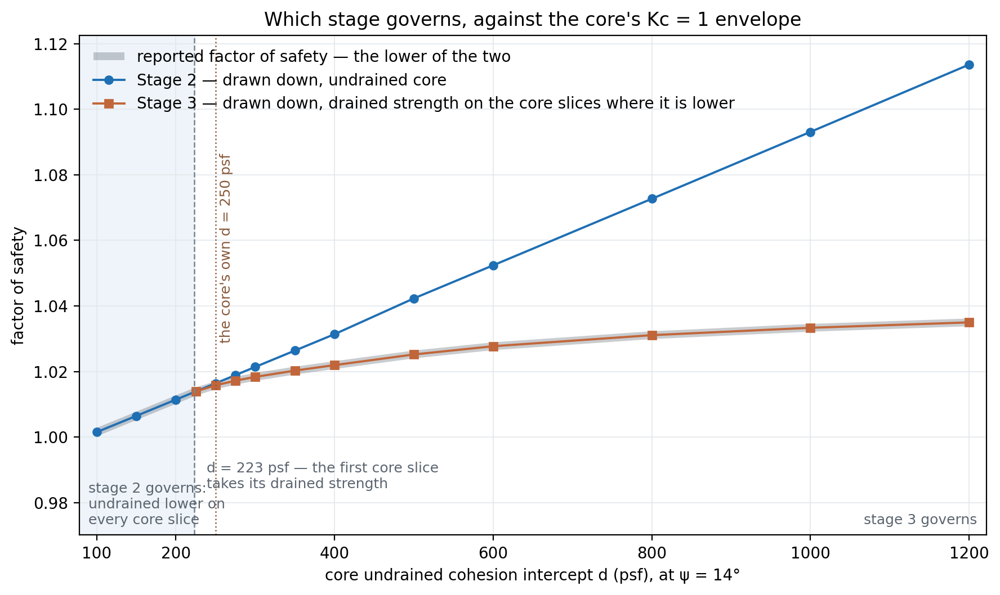{width=1000}

**The handover is at d = 223 psf**, 27 psf *below* the value on the file — which
is why the model as shipped already reports stage 3. Below 223 every one of the
12 core slices is stronger undrained than drained, stage 3 is not run at all, and
the two curves are the same line. Above it the crossover spreads slice by slice —
1 slice at 225 psf, 5 at 250, 8 at 350, 10 at 600, 11 by 1200 — and the two curves
separate, with the reported answer following the lower one. That first slice
changes the answer by less than a ten-thousandth, which is why the 225 psf row
reads the same on both stages.

The shapes of the two curves are the reason the handover does not reverse.
Stage 2 climbs in a straight line, because $d$ enters the undrained strength
directly. Stage 3 flattens, because it can only ever *substitute* the drained
strength, and once a slice has taken the drained value more $d$ changes nothing
on it. Its plateau at **1.0350** closes on the ordinary drained factor of safety
at the same day-50 pore pressures, 1.0354 — the fourth row of the bracket table
above. Stage 3 cannot buy the slope anything past that, however strong the
undrained envelope is declared to be.

The engineering reading is that the $K_c = 1$ envelope is not a safety margin.
Overstating it does not make the drawdown answer better; past 223 psf a further
thousand psf of $d$ buys two hundredths and then nothing, because the drained
strength has become the limit. What the envelope decides is *which* mechanism is
being checked, and a drawdown run that reports stage 3 as its governing stage is
reporting that the undrained strengths never mattered.

---

## Which source to use

Three answers on one dam, and they are not equally good.

**The transient frames are the most faithful statement of a drawdown.** They
carry the actual lowering rate and the actual elapsed time, so the stage-2 field
is how far dissipation has genuinely progressed by day 50 rather than an
assumption about it. Everything the time factor $T$ estimates at the top of this
page is resolved directly by the solve. On this dam that moves the factor of
safety by 0.179 against the two-steady route, and all of it is the core's
retained head.

**Two steady solutions state a limiting case, and on this model it is the
optimistic one.** Set 2 is the dam after the pore pressures have fully caught up
with the pool — the long-term condition, arrived at instantaneously. That is a
legitimate thing to compute and it is the classic hand-calculation route, but on
a section whose whole difficulty is a core that does not drain, assuming the core
has drained answers a different question. Here it reads **1.195** where the
transient reads **1.016**, 18% high. Where the two-steady route is right is on a
section with no low-conductivity zone to hold water — where the re-equilibrated
field is very nearly what exists a day after the drawdown.

**The piezometric pair inherits whatever state Line 2 was sketched from.** Line 2
on this file follows the re-equilibrated surface, so the pair reads **1.181**,
1% under the two-steady answer it was drawn from and 16% over the transient one.
Nothing about that is a defect in the pair: it is the drawdown the line describes,
which is the long-term one. Redraw Line 2 with the core still holding 150 ft of
head — the day-50 state — and the same file reads **1.036**, within 0.02 of the
transient answer. Flatten it onto the residual pool instead and it reads 1.185,
barely moved, because the surface it replaces is nearly flat already. The whole
sensitivity sits in what the line claims about the core, which is the one judgment
the sketch is really making. The pair's real use is where there is no seepage
model to solve: an existing dam with piezometers in it, a preliminary check, or a
section that cannot be meshed. It should not be preferred to a solution when one
can be had.

None of which makes the drawdown check itself a matter of taste. The procedure
being run is the same in all three cases, and it is verified against published
answers on four dams:
[VP96](../verification/rocscience.md#vp96) is the USACE EM 1110-2-1902 Appendix G
example (1.434 against the manual's 1.44),
[VP97](../verification/rocscience.md#vp97) is Pilarcitos Dam, which failed in
drawdown (1.044 against 1.05),
[VP98](../verification/rocscience.md#vp98) is the Walter Bouldin Dam failure
(1.046 against 1.04), and
[VP99](../verification/rocscience.md#vp99) is the pumped-storage dam of Duncan,
Wright and Wong's own paper (1.527 against 1.56). All four supply their two water
states as piezometric pairs, which is how their sources published them.

---

## Conclusion

This tutorial covered:

- The three-stage rapid-drawdown procedure and what each stage is for —
  consolidation stresses at full pool, undrained strengths under the drawn-down
  water, and a drained re-check that can only lower the answer.
- The three inputs the procedure needs: a $d$ / $\psi$ pair on every material
  that does not drain during the drawdown, a second statement of where the water
  is, and **Water loads** on `auto` so the load on the face and the pressure
  inside the dam come from the same place at both stages.
- Three ways to supply the two water states on one dam — a sketched piezometric
  pair, two steady seepage solutions from two boundary sets, and two frames of a
  transient march — each searched from the same starting circle, reading 1.181,
  1.195 and 1.016 on three circles whose centers span 5 ft.
- The bracket those sit in, and the parts it separates the drawdown into: 0.20
  for the load removal alone (1.510 to 1.311), a further 0.28 for the water the
  core has not released by day 50 (1.311 to 1.035), and 0.12 or 0.02 for the
  undrained strength depending on which of the two fields it is applied to.
- The governing stage as a property of the material, not the method: control
  passes from stage 2 to stage 3 at an undrained intercept of 223 psf, below the
  250 psf this core carries, and past that point a stronger undrained envelope
  buys nothing, because the drained strength has become the limit at 1.035.

**Where to go next:** [Rapid drawdown analysis](../lem/rapid.md) carries the
equations, the time-factor rubric and the interpolation between the two envelopes
in full. [SEEP-3](seep03_reservoir_drawdown.md) builds a transient drawdown model
from nothing and reads it as frames, histories and a water budget;
[SEEP-2](seep02_johnson_dam.md) builds this dam;
[COMBO-1](combo01_seepage_stability.md) runs it under a standing pool. The
[tutorials index](index.md) lists the series.
