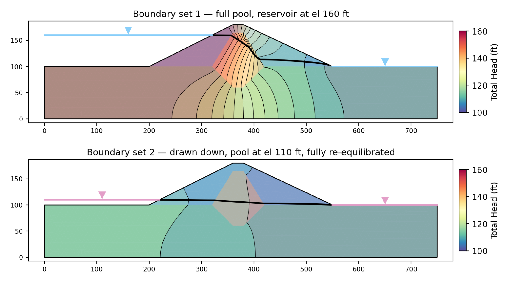
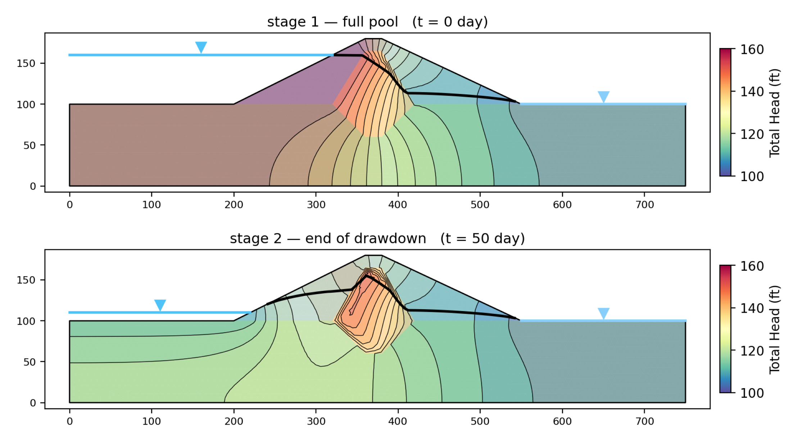

# Tutorial COMBO-2 — Rapid Drawdown

[COMBO-1](combo01_seepage_stability.md) ran the Johnson Reservoir dam under a
standing reservoir. This page lowers that reservoir 50 ft in 45 days.

Lowering a pool removes the water pressing on the upstream face, which was
holding the slope up. If the soil behind the face could shed its own pore water
just as fast, nothing much would happen: the driving weight and the resisting
strength would fall together. A compacted clay core cannot. It keeps the pore
pressure the full reservoir put into it while the load that balanced that
pressure disappears, and the upstream slope is left carrying its own weight
against a strength it no longer has. Rapid drawdown is the analysis of that
window.

The procedure needs two states of the water — before the drawdown and after —
and there are three ways to say where the water was in each. This page runs all
three on one dam, one slip circle and one set of strengths, so the only thing
that changes between the answers is the statement about the water.

<div class="tut-glance" markdown>
<div class="tgt-row">
<div class="tgt-tile"><span class="tg-label">Analysis</span><p>Limit equilibrium + seepage</p></div>
<div class="tgt-tile"><span class="tg-label">Build &amp; run</span><p>~35 min</p></div>
</div>
<div class="tgm-obj" markdown>
**Objectives** — Learn what the three-stage rapid-drawdown procedure computes and
what it needs on the inputs; how to supply its two water states from a
piezometric pair, from two steady seepage solutions and from two frames of a
transient march; how to read which stage governed; and what changes the answer
between the three sources.
</div>
<p><span class="tg-pill">three materials</span><span class="tg-pill">rapid drawdown</span><span class="tg-pill">three-stage procedure</span><span class="tg-pill">Kc = 1 envelope</span><span class="tg-pill">d and ψ</span><span class="tg-pill">piezometric lines</span><span class="tg-pill">second boundary set</span><span class="tg-pill">transient seepage</span><span class="tg-pill">stage times</span><span class="tg-pill">automatic water loads</span><span class="tg-pill">Spencer</span><span class="tg-pill">parametric sweep</span></p>
<div class="tgm-model" markdown>
**Starter file** — [xslope_johnson_rapid_start.xlsx](files/xslope_johnson_rapid_start.xlsx),
the dam with its strengths, its undrained core envelope and a sketched
piezometric pair; no seepage boundary sets and no schedule, which is what the
build below adds

**Completed model** — [xslope_johnson_rapid.xlsx](files/xslope_johnson_rapid.xlsx),
the same dam with both seepage boundary sets and the pool schedule on it; open it
to skip the construction and start at [Two steady solutions](#two-steady-solutions)
</div>
</div>

---

## What rapid drawdown is

A reservoir standing against an upstream slope does two things at once. Its
weight presses on the face, and that pressure is a stabilizing load. And it
holds a head inside the embankment, which raises the pore pressure and lowers
the effective stress the strength is computed from. Drawing the pool down
removes the first immediately and the second only as fast as the soil can drain.

How fast that is comes from the dimensionless time factor
$T = c_v t / D^2$, where $c_v$ is the coefficient of consolidation, $t$ the time
over which the pool falls and $D$ the longest path pore water has to travel to
get out. [Rapid drawdown analysis](../lem/rapid.md#when-does-rapid-drawdown-apply)
carries the rubric and the $c_v$ table: above $T = 3$ the material drains as fast
as the pool falls and the drawdown is not rapid for it; below 3 it does not, and
the material has to be carried through the drawdown at an undrained strength.

The test is applied per material, not per dam, which is what makes a zoned
embankment the interesting case. This dam's sand shell and silty-sand foundation
drain freely over a 45-day drawdown; its compacted-clay core does not. So the
core is the one zone that arrives at the end of the drawdown still holding the
reservoir's head, and it is the zone that governs.

### The three-stage procedure

XSLOPE uses the three-stage procedure of Duncan, Wright and Wong (1990),
documented in full on the [rapid drawdown](../lem/rapid.md) page. In outline:

**Stage 1 — full pool, drained.** An ordinary effective-stress analysis of the
slope before the drawdown, with the reservoir load on the face and the
pre-drawdown pore pressures inside. Its factor of safety is not the answer. What
it produces is the effective normal stress $\sigma'_{fc}$ and the mobilized shear
stress $\tau_{fc}$ on the base of every slice — the consolidation stress state
the soil arrives at the drawdown in. The slope has to be stable here: at
$FS < 1$ the mobilized stress lies above the failure envelope, there is no
equilibrium consolidation state to read, and the run is
[refused](../lem/rapid.md#the-stage-1-slope-must-be-stable) rather than answered.

**Stage 2 — drawn down, undrained.** The same surface with the drawn-down water
— the reservoir load gone and the post-drawdown pore pressures inside — and, in
every material carrying a $K_c = 1$ envelope, an undrained shear strength
$\tau_{ff}$ computed from that material's stage-1 stresses. The envelope is
entered as two numbers, an intercept $d$ and a slope $\psi$, and the strength
actually used is interpolated between it and the drained envelope according to
the stress ratio $K_1$ the slice consolidated at. Materials with no $d$ / $\psi$
keep their drained $c'$ and $\phi'$ through this stage.

**Stage 3 — drawn down, drained.** The same drawn-down section again, with the
drained strength substituted on every slice where the drained strength turns out
to be *lower* than the undrained one stage 2 used. Because stage 3 only ever
lowers a strength, its factor of safety can never exceed stage 2's, and the
reported answer is the lower of the two. If no slice qualifies, stage 3 is not
run and stage 2 is the answer.

Which of the two governs is a result rather than bookkeeping. Stage 2 governing
says the undrained strengths control: on every slice crossing the core the
undrained strength is the lower of the two, and the drawdown is a strength
problem. Stage 3 governing says the opposite — on at least some of those slices
the undrained strength assigned in stage 2 came out *higher* than the drained
strength at the same stresses, so what limits the slope is the ordinary drained
strength at the drawn-down pore pressures. The
[flip section](#the-governing-stage-flip) below moves this dam from one to the
other and reports what it takes. Duncan, Wright and Brandon (2014) work the whole
procedure by hand in their Table 9.2, on two slip planes in one submerged infinite
slope that are governed by different stages — the shallow one by stage 3 and the
deep one by stage 2 — for the same reason: the stress each plane consolidated at.

### What the procedure needs on the inputs

Three things, beyond an ordinary limit equilibrium model:

**$d$ and $\psi$** on the materials table — the $K_c = 1$ envelope, on every
material that does not drain during the drawdown. Both or neither: one alone
reverts silently to drained.

**A second water state** — Piezometric Line 2, a second seepage solution, or a
transient frame; the pore pressures stages 2 and 3 read.

**Water loads** = `auto` (`main!D23`) — the reservoir load on the face at stage
1, and whatever is left of it at stage 2.

The second and third are the same statement seen twice, which is why leaving
**Water loads** on `auto` matters here more than anywhere else: the engine reads
the pool from the same place at both stages, so the water pressing on the face
and the pore pressure inside the dam can never disagree about where it stood.

---

## The dam

{width=1000}

The section is 750 ft long: a 100 ft foundation on rock at elevation 0, and an
80 ft embankment on it with a crest at elevation 180. A sand shell rises 2:1
upstream and falls at about 2.1:1 downstream, with a compacted-clay core through
the middle carried 40 ft into the foundation as a cutoff key. The reservoir
stands at elevation 160 and the tailwater at 100. The drawdown this page runs
lowers the pool 50 ft, to a residual reservoir 10 ft deep at elevation 110.
[SEEP-2](seep02_johnson_dam.md) builds the model and covers the geometry in full.

Download [xslope_johnson_rapid_start.xlsx](files/xslope_johnson_rapid_start.xlsx)
and open it with **File → Open…**. The toolbar's mode strip reads
LEM | Seepage | FEM; leave it on **LEM** for now.

### The materials, and the one undrained zone

Click **Materials** in the Inputs tree and set the **Show parameters for:**
toggles to **LEM** alone:


| mat | name | γ (pcf) | c′ (psf) | φ′ (deg) | d (psf) | ψ (deg) | u |
|:---:|---|:---:|:---:|:---:|:---:|:---:|:---:|
| 1 | `shell` | 130 | 100 | 35 | — | — | `piezo` |
| 2 | `core` | 125 | 400 | 18 | 250 | 14 | `piezo` |
| 3 | `foundation` | 127 | 100 | 27 | — | — | `piezo` |

The **d** and **psi** columns are what make this a drawdown model, and only the
core carries them. Its $K_c = 1$ envelope is $d = 250$ psf and $\psi = 14°$, well
under its drained envelope of $c' = 400$ psf and $\phi' = 18°$: at the stresses
this circle produces it makes the core weaker undrained than drained, which is
why stage 2 is the stage that governs every run below.
[The sweep](#the-governing-stage-flip) at the end of the page finds the value of
$d$ that reverses it. The shell and the foundation are left blank on both
columns, which declares them free-draining: they keep 100 psf and 35°, and
100 psf and 27°, through every stage.

That declaration is reported back rather than assumed. Every run on this page
carries one warning — *"2 of 3 material(s) a failure surface can cross carry no
d / psi and are treated as free-draining through the drawdown, keeping their
drained strength"* — which is the model saying what it understood. The neighboring
case is an error rather than a warning: a material carrying **d** without
**psi**, or the reverse, would be treated as free-draining with nothing said, so
the checks refuse the run rather than let a half-entered envelope pass.

### The two piezometric lines

Click **Piezometric lines**. The editor has two tabs, and both are filled:


**Line 1 — the full-pool surface.** Five points, running from the reservoir
surface at elevation 160, across the upstream shell at that level, down through
the core, and out to the tailwater at 100:

| x | y |
|---:|---:|
| 0 | 160 |
| 360 | 160 |
| 410 | 120 |
| 550 | 100 |
| 750 | 100 |

**Line 2 — the surface at the end of the drawdown.** Six points, and the shape is
the drawn-down dam after its pore pressures have caught up with the pool: the
residual reservoir at elevation 110 out to where it meets the upstream face, a
long shallow fall through the shell and the core, and the tailwater at 100 from
x = 550 out:

| x | y |
|---:|---:|
| 0 | 110 |
| 220 | 110 |
| 360 | 107 |
| 410 | 103 |
| 550 | 100 |
| 750 | 100 |

Five and six points is the whole of it, and the coarseness is deliberate. **A
piezometric line is a statement about the water, not a trace of a solved field.**
In practice Line 1 comes from piezometers in a dam that has been standing at full
pool, and Line 2 comes from judgment about where those readings will settle once
the pool is down and the dam has come back to equilibrium — a straightedge sketch
between a few readings and a few assumptions. The two above were sketched from the
solved seepage fields further down this page and then rounded to something a
designer would draw, which is why they follow those fields in shape without
matching them anywhere in particular. Where a seepage solution is available it
replaces them, and the rest of this page measures what that replacement changes.

Two rules govern the pair. Line 2 may not stand above Line 1 anywhere — a
drawdown that raised the pool is not a drawdown, and the checks say so. And each
line has to describe the same pool the rest of the model does. Line 1 leaves the
upstream shell at exactly elevation 160, which is where the first seepage boundary
set puts the reservoir when it is built later, and the checks measure the two
against each other: a line that came off the shell a foot low would put two
different pools on one model, and it is flagged. Line 2 leaves the face at exactly
110 for the same reason, matched against the second boundary set by hand.

Both lines run the full width of the section, and both tails from x = 550 out to
750 sit exactly on the ground surface. That matters for the water load: with
**Water loads** on `auto` the engine measures each line against the ground and
turns whatever stands above it into a distributed load, so a tail a few feet high
over the downstream foreshore would invent a pond that is not there. Upstream the
same measurement is doing the work it is meant to: Line 1 stands 60 ft above the
foreshore and Line 2 stands 10 ft above it, and those two heights are the
reservoir before the drawdown and the residual pool after it.

Click **OK**, and the Inputs plot draws the whole model:

{width=1000}

Three profile lines carve the section into shell, core and foundation. The heavy
dark blue line is Piezometric Line 1 and the pale one Line 2, each carrying the
inverted-triangle water-table symbol at its midpoint: 50 ft apart over the
upstream foreshore, 53 ft apart above the core, and the same line from x = 550
out.

Two sets of arrows come off them, both marked **derived**, because the two lines
are two pools and the engine turns each into its own load. The dark set is
stage 1's: the reservoir standing against the slope, 3744 psf at the toe under
60 ft of water and tapering to zero at the elevation-160 waterline. The pale set
is stage 2's: the residual pool, 624 psf under its 10 ft of water and tapering to
zero where it meets the face at elevation 110. Neither was entered anywhere — both
are measured off the piezometric lines. The difference between them, 3120 psf at
the toe, is the load the drawdown takes away, and that removal is what the whole
analysis is about. The red dashed arc is the circle every run below uses.

---

## The drawdown from the piezometric pair

Switch to **LEM** (`Ctrl+1`) if the mode strip is elsewhere, and click
**Run → Run LEM…**


**Method** opens on **Spencer**, which satisfies both force and moment
equilibrium, and every number on this page is Spencer's. Two fields change from
the dialog's defaults:

**Analysis → Single surface.** The dialog opens on **Auto search**, which finds
each run its own critical circle. That is the right setting for a design check
and the wrong one here: this page compares three statements about the water, and
if each run is allowed to move to its own surface the comparison carries a change
of geometry as well. **Single surface** runs the circle the file carries — center
(275, 235), radius 160 ft, tangent to elevation 160 — which was located by a
rapid-drawdown search on this dam and sits on the upstream face, toeing near the
upstream base and daylighting just past the crest. All three runs below use it.

**Rapid drawdown → ticked.** This is the control that runs the three-stage
procedure instead of a single solve, and puts the run through the drawdown checks
as well as the ordinary limit equilibrium ones. On this file the checks report
one warning, the free-draining declaration read back off the materials table.

There is no **stage time** field on the form yet. Those belong to a model that
carries a transient schedule, and appear when
[one is built](#the-pool-schedule-and-the-stage-times).

Leave **Number of slices** at 40 and click **Run**. The run returns immediately,
and the Log pane carries the three-stage report:

```text
Running SPENCER — single circular surface (Xo=275.0, Yo=235.0, R=160), 40 slices (rapid drawdown)…
Generated 42 slices; solving…
=== RAPID DRAWDOWN ANALYSIS ===
Stage 1: Pre-drawdown conditions...
Stage 1 FS = 1.9351
Stage 2: Post-drawdown conditions with undrained strengths...
Stage 2 FS = 1.4708
Stage 3: Checking drained strengths...
Stage 3: No drained strength adjustments needed
Final rapid drawdown FS = 1.4708
=== END RAPID DRAWDOWN ANALYSIS ===
Spencer: FS=1.471, theta=13.01
FS = 1.471
Sliding mass = 1,553,766.6 lb/ft over 266.45 ft of failure surface
```

**42 slices, not the 40 asked for.** The slicer puts a boundary wherever a
feature crosses the surface, and the piezometric lines' own vertices are
features, so two extra boundaries appear. The same 42 slices come out of every
run on this page, 13 of them cutting the core.

**Stage 3 was not run.** *"No drained strength adjustments needed"* means that on
all 13 core slices the drained strength at the stage-2 stresses came out higher
than the undrained strength stage 2 used, so there was nothing lower to
substitute. Stage 2 governs, and **the rapid-drawdown factor of safety is 1.471**
against a full-pool 1.935.

{width=1000}

The figure is the governing stage's own state, not stage 1's: the pale blue band
under the failure surface is the stage-2 pore pressure on each slice base,
reaching 2112 psf, and the green hatched band above it is the effective normal
stress the stage-2 strengths were computed from. Both water loads are drawn on
the upstream face — the stage-1 reservoir as well as the residual pool — because
the consolidation stresses stage 2 reads its strengths from came from the first
of them.

The analysis report writes the same three stages under **Rapid Drawdown**,
together with which of the two drawn-down stages the reported factor came from.

---

## Two steady solutions

A piezometric line says where the water table is. A seepage solution says what
the head is everywhere, which is a stronger statement: it accounts for the flow
through the core, the anisotropy of the zones, and the seepage face on the
downstream slope, none of which a line drawn between piezometers knows about.
Rapid drawdown can be given two of them — one at full pool and one at the
drawn-down pool — and that is what this section builds.

### The second boundary set

Switch the mode strip to **Seepage** (`Ctrl+2`) and click **Seep BC** in the
Inputs dock. The editor has two tabs.

**Set 1** is the ordinary boundary set: it describes the dam under the full
reservoir. Press **Add head** twice, then select the **Exit face** entry already
in the list.

*Head 1 — the reservoir*, at **Head value (ft)** `160`, along the upstream
foreshore and up the submerged part of the face:

| x | y |
|---:|---:|
| 0 | 100 |
| 200 | 100 |
| 320 | 160 |

*Head 2 — the tailwater*, at `100`, along the downstream foreshore:

| x | y |
|---:|---:|
| 550 | 100 |
| 750 | 100 |

*Exit face*, over the whole downstream slope, from the crest to the tailwater:

| x | y |
|---:|---:|
| 380 | 180 |
| 550 | 100 |

[SEEP-2](seep02_johnson_dam.md#4-boundary-conditions) is where the three boundary
types and the no-flow default are worked through, and it solves this same set.

**Set 2 (rapid drawdown)** is a second, independent boundary set on the same
section. Its job is to describe the dam under the drawn-down pool, so that a
second steady solve can be made from it. It is the same three entries Set 1
carries, with the reservoir 50 ft lower. Press **Add head** twice, then select the
**Exit face** entry already in the list:


*Head 1 — the residual pool*, at **Head value (ft)** `110`, along the upstream
foreshore and up the face as far as the lowered pool wets it:

| x | y |
|---:|---:|
| 0 | 100 |
| 200 | 100 |
| 220 | 110 |

*Head 2 — the tailwater*, at `100`, unchanged:

| x | y |
|---:|---:|
| 550 | 100 |
| 750 | 100 |

*Exit face*, over the whole downstream slope, unchanged:

| x | y |
|---:|---:|
| 380 | 180 |
| 550 | 100 |

Two things about Set 2 decide what it computes.

**It carries plain heads only.** The `reservoir` type — the submerged-only
boundary built for a pool that moves — and any value bound to a time series both
belong on Set 1, because there is one timeline in a model and it is Set 1's. Set
2 is a constant, steady state by construction, and the editor refuses the other
kinds. That is why Head 1 is entered as a plain head along the wetted perimeter
the residual pool reaches, ending at (220, 110) where elevation 110 meets the 2:1
face, rather than as a reservoir the solver would trim for itself.

**Ten feet of head still cross the section.** The pool stops at 110 and the
tailwater is at 100, so water still flows through the dam and still leaves it
through the downstream slope — which is why the exit face is on this set as well.
What makes Set 2 the fully re-equilibrated limiting case is not that it is dry
but that it is steady: it is the dam long after the drawdown, when every pore
pressure has finished adjusting to the pool that is left.

Click **OK**.

### Meshing, and both solves

Click **Run → Build Mesh…** and set **Element type** to **Linear triangles
(tri3)**. Head is a scalar field, so there is nothing for a linear element to
lock up on, and no strength reduction runs on this page — the
[quadratic requirement COMBO-1 meets](combo01_seepage_stability.md#one-mesh-for-all-three-analyses)
comes from the finite element stability engine, not from seepage. Element order
also sets the cost of the transient march below, which takes thousands of steps
on whatever mesh it is given.

Leave **Auto-size from geometry** ticked at **100** size divisions, which makes
the target element size the width of the section over that number,
750/100 = 7.5 ft. Click **Build**. The mesh comes out at **2,080 nodes and 3,923
triangles**:

{width=1000}

The blue squares are Set 1's specified-head nodes — along the upstream foreshore
and up the face to elevation 160, and along the downstream foreshore at 100 —
and the red circles down the downstream slope are the exit face.

Click **Run → Run Seep…**, leave **Convergence tol** at `0.0001` and **Max
iterations** at `400`, and click **Run**. Because the file defines two boundary
sets, one steady run solves **both** of them, each keeping its own results tab,
and each writing a companion file beside the workbook — `_seep.csv` for Set 1 and
`_seep2.csv` for Set 2 — so that reopening the file picks them up by name.

(Opened from the completed model rather than built up from the starter, this
dialog also carries a **Run type** selector, because that file already has the
schedule the next section adds. Leave it on **Steady** for this run.)

{width=1000}

**Set 1** settles in **22 unconfined sweeps** to a total discharge of
**1.9566 ft³/day per ft** of dam. The head runs from 100.000 to 160.000 ft, the
two boundary values and nothing outside them, and the heavy black line is the
phreatic surface: nearly flat across the upstream shell at reservoir level,
falling almost the whole 60 ft inside the core, and running low across the
downstream shell to the tailwater. Almost the entire head loss is in the core,
which is what a cutoff key is for.
([COMBO-1](combo01_seepage_stability.md#solving-it) reports 1.925 for the same
boundary set on a quadratic mesh at the same 7.5 ft target — 8,082 nodes rather
than 2,080, because quadratic elements add a node on every edge. The 1.6%
between the two answers is that discretization, not the physics.)

**Set 2** settles in **8 sweeps** to **0.2695 ft³/day per ft**, a seventh of
Set 1's discharge on a sixth of the head difference. The head runs from 100.000 to
110.000 ft, and the phreatic surface leaves the residual pool at elevation 110,
gives up about a foot crossing the upstream shell, drops 6 ft through the core,
and runs the last 3 ft out to the tailwater. The core still takes the largest
single share, but nothing like the share it took in Set 1: with the water table
down at foundation level, the saturated part of the section is mostly foundation,
and the head loss spreads through it instead of concentrating in the clay. Above
that surface the embankment is unsaturated, and
the negative pressures there are
[clamped to zero](../seep/seep_slope.md#negative-pore-pressures) before any slice
reads them.

Both panels are drawn on one color scale, so Set 2's whole field sits in the
bottom band of it — the section that carried 60 ft of head now carries 10.

### Pointing the materials at the fields

The seepage solutions exist, and nothing reads them yet. Switch back to **LEM**
(`Ctrl+1`), open **Materials**, and set the **u** column to `seep` on all three
rows. That column is what sends a solved field to every slice base, and it is set
per material rather than once for the model;
[COMBO-1](combo01_seepage_stability.md#the-column-that-connects-the-modes)
covers its four values and what each one costs.

A drawdown run reads **two** fields through that one column: `seep_u` from Set 1
for stage 1, and `seep_u2` from Set 2 for stages 2 and 3. The checks hold the run
to both. A material on `seep` with no solved field at all is an error; a material
on `seep` with only Set 1 solved is a second error, naming the missing
drawn-down field by the file name it would arrive under — because a stage-2 pore
pressure that reads zero everywhere is a drawdown that removed the water *and*
its pressure, and it returns a factor of safety that is too high.

Run **Run → Run LEM…** again with the same three settings — Spencer, Single
surface, Rapid drawdown ticked:

| Stage | | FS |
|---|---|---:|
| 1 | full pool, drained | 2.0537 |
| 2 | drawn down, undrained core | **1.4987** |
| 3 | drawn down, drained | not required |

{width=1000}

**The rapid-drawdown factor of safety is 1.499**, against 1.471 from the
piezometric pair. Stage 2 governs again.

The two routes agree at stage 2 about where the water is and disagree at stage 1.
The peak pore pressure on the 42 slice bases after the drawdown is 2118 psf here
against the pair's 2112 — a sketch drawn from this field reproduces the field to
within a few psf, which is what makes the comparison a fair one. At stage 1 the
peak is 5110 psf against the pair's 5303, because the solved full-pool field puts
less pore pressure on the deep part of the surface than a static column measured
down from Line 1 does, and the stage-1 answer moves with it: 2.054 against 1.935.
That difference propagates into stage 2, whose undrained strengths are computed
from the stage-1 effective stresses — higher consolidation stresses, higher
undrained strength, and 1.499 against 1.471. Run as an ordinary drained problem on
the drawn-down water instead, the two routes land on 1.6329 and 1.6334: with the
undrained envelope out of the picture, the sketch and the solution are the same
model.

---

## A transient march

Two independent steady solutions describe two equilibrium states. What they do
not describe is the passage between them: Set 2 is the dam *long after* the
drawdown, when the core has finished giving up the head the full reservoir left
in it. On a core with a conductivity of 0.001 ft/day that is a long time, and the
drawdown itself takes 45 days. A
transient seepage run resolves that directly — it is a history of pore-pressure
fields as the reservoir is lowered on a schedule, so the two stage fields are two
frames read out of one march rather than two independent solves assembled by
hand.

[SEEP-3](seep03_reservoir_drawdown.md) builds a transient model from nothing and
covers the storage properties, the time series, the initial condition and the
saved-frame schedule. The build below is the same shape on this dam, and the
storage properties it needs are already on the materials table:
*S<sub>s</sub>* and *S<sub>y</sub>* of 1 × 10<sup>−4</sup> /ft and 0.22 on the
shell, 1 × 10<sup>−3</sup> /ft and 0.03 on the core, 2 × 10<sup>−4</sup> /ft and
0.15 on the foundation.

### The pool schedule and the stage times

Switch to **Seepage** and click **Transient** in the Inputs dock.


**Series names.** Type `pool` over the first column's default name `t1`. A
boundary becomes time-varying by having this exact name typed into its value
cell, which is the last step of this section.

**The breakpoints.** Three rows: the reservoir holds at full pool for five days,
then falls to the residual pool over the following 45.

| time | pool |
|---:|---:|
| 0 | 160 |
| 5 | 160 |
| 50 | 110 |

**Duration (day)** `1000`, **Save interval (day)** `200`, and **Extra save
times** `5`, `35`, `50`, `80`, `150`, `300`. The duration carries the run well
past the drawdown so the dam's recovery toward its new steady state is in the
answer too; the extra times put frames where the regular grid would miss them.

**Stage 1 time (day)** `0` and **Stage 2 time (day)** `50`. These two fields are
what a drawdown run reads, and SEEP-3 leaves them deliberately blank because a
seepage page has no use for them. Stage 1 at t = 0 is the full-pool state the
march starts from; stage 2 at t = 50 is the instant the pool reaches elevation
110 and stops falling. Both are forced into the saved-frame schedule, so each is a
*computed* frame rather than a blend of two neighbors. Set both or neither, and
stage 1 must come before stage 2.

The preview draws them as red dashed reference lines across the schedule, which
is the quickest check that they land where they were meant to. Click **OK**.

### Binding the reservoir boundary

Reopen **Seep BC**, select **Head 1** on **Set 1**, and change two fields. Set
**Type:** to `reservoir` — a boundary that holds a node only while that node is
at or below the water level, and releases any node the falling pool has left
standing above it. Then clear **Head value (ft)** and type `pool` in its place. A
value cell holding the name of a series is driven by that series instead of by a
constant, and that is the whole of what makes a boundary time-varying.

Set 2 is untouched by any of this, and cannot follow the series even if asked:
it is the constant-steady set.

Nothing about the numbers already computed changes. A steady solve reads a
series-bound value at t = 0, so Set 1 with `pool` bound to it solves at 160 and
returns the same 1.9566 ft³/day per ft as before, and says so in its log —
*"Series 'pool' read at t = 0 for the steady solve: reservoir value 160"*.

### Marching it

Click **Run → Run Seep…**. The dialog has grown a **Run type** selector, which
appears only on a file carrying a schedule; set it to **Transient
(time-dependent)** and click **Run**. **Convergence tol** and **Max iterations**
gray out — they belong to the steady solve, and the march sets its own step size
from how fast the field is moving.

The march solves its initial condition first — the same unconfined iteration as
the steady run — and then prints a line per saved frame:

```text
  t=5: frame saved (steps so far=6, mass-balance closure=1.39e-05)
  t=35: frame saved (steps so far=272, mass-balance closure=7.28e-02)
  t=50: frame saved (steps so far=440, mass-balance closure=6.79e-02)
  t=80: frame saved (steps so far=846, mass-balance closure=6.87e-02)
  t=150: frame saved (steps so far=1320, mass-balance closure=2.04e-02)
  t=200: frame saved (steps so far=1394, mass-balance closure=2.02e-02)
  t=300: frame saved (steps so far=1466, mass-balance closure=5.67e-02)
  t=400: frame saved (steps so far=1507, mass-balance closure=5.43e-02)
  t=600: frame saved (steps so far=1569, mass-balance closure=3.43e-02)
  t=800: frame saved (steps so far=1617, mass-balance closure=2.82e-02)
  t=1000: frame saved (steps so far=1671, mass-balance closure=2.41e-02)
```

This is the long run of the page — a few minutes, where every other run here has
been seconds. **Twelve frames** come out of it, at t = 0, 5, 35, 50, 80, 150,
200, 300, 400, 600, 800 and 1000: the union of the save-interval grid, the extra
save times, the schedule's own breakpoints, and the two stage times. **1,671
steps** sit behind them, and where the solver spent them is itself a reading:
**440 of them, 26%, are inside the first 50 days**, which are 5% of the run's
duration. The field moves while the pool is falling and barely at all afterward.

The two frames the drawdown will read are the first and the fourth:

{width=1000}

At **stage 1** the reservoir is full and the field is the steady one solved
above. At **stage 2** the pool has reached elevation 110 — the upstream water
level marker has dropped 50 ft — and the upstream shell has followed it partway
down, with the foundation beneath the upstream slope beginning to unload. The core
has barely moved. It still holds a pocket of head near 150 ft, in the middle
of the section, exactly where the slip circle crosses it. That pocket is the whole
difference between this route and the two steady solves, where the same region has
come back to within a few feet of the pool.

### The third answer

Switch to **LEM** and run **Run → Run LEM…** once more — Spencer, Single surface,
Rapid drawdown ticked. The form has grown the group the schedule adds:


**Stage 1 time** and **Stage 2 time** hold 0 and 50, read from the tseep sheet
where the Transient editor stored them, and editing them here changes the model
the same way editing them there does. They replace the single seepage-time
selector an ordinary run on a transient model gets, because a drawdown reads two
instants rather than one; a stage time the solved march never saved re-marches
with it added to the save schedule.

Click **Run**. The two named frames come out of the solved march and their pore
pressures go to the three stages in memory — no `_seep.csv` files are written or
read, and staged frames take precedence over any that are sitting beside the
workbook.

| Stage | | FS |
|---|---|---:|
| 1 | full pool, drained | 2.0537 |
| 2 | drawn down, undrained core | **1.3192** |
| 3 | drawn down, drained | not required |

{width=1000}

**The rapid-drawdown factor of safety is 1.319.** Stage 1 is identical to the
two-steady run's 2.0537, because the frame at t = 0 *is* that steady solution.
Everything that separates the two answers is at stage 2, where the peak pore
pressure on the slice bases is **3426 psf** against the two-steady route's 2118 —
the core's undissipated head, read straight off the frame.

---

## The three answers, and what brackets them

All three runs used the same dam, the same circle, the same 42 slices, the same
strengths and the same Spencer solver. Only the statement about the water
changed:

| Where the two water states came from | Stage 1 | Stage 2 | Stage 3 | **Rapid drawdown FS** |
|---|---:|---:|---:|---:|
| Piezometric Lines 1 and 2 | 1.9351 | 1.4708 | not required | **1.471** |
| Two steady seepage solutions | 2.0537 | 1.4987 | not required | **1.499** |
| Two frames of a transient march | 2.0537 | 1.3192 | not required | **1.319** |

The spread is 0.18, 14% of the lowest answer, and almost all of it separates the
transient route from the other two. The same circle solved as an ordinary drained
problem at each end of the drawdown puts that spread in context:

| Run | Core strength | Pore pressures | FS |
|---|---|---|---:|
| Full pool | drained | full-pool field | 2.054 |
| Drawn down, long term | drained | re-equilibrated field | 1.633 |
| Drawn down, long term | **undrained** | re-equilibrated field | **1.499** |
| Drawn down, day 50 | drained | transient frame | 1.350 |
| Drawn down, day 50 | **undrained** | transient frame | **1.319** |

The two bold rows are the two-steady and transient drawdown answers; the other
three are ordinary drained runs on the same circle, and between them they separate
the drawdown into its parts.

**The load removal alone costs 0.42.** Taking 50 ft of reservoir off a dam whose
pore pressures have fully caught up moves the slope from 2.054 to 1.633, at
drained strength throughout. That is the long-term condition the dam settles into
months after the drawdown.

**The core's retained water costs a further 0.28.** Holding the day-50 pore
pressures instead of the re-equilibrated ones, still at drained strength, moves
1.633 to 1.350. Nothing about the strengths differs between those two runs.

**The undrained strength costs 0.13 — or 0.03.** On the re-equilibrated field
it moves 1.633 to 1.499; on the day-50 field it moves 1.350 to only 1.319. The
same envelope, and four times the effect on one field as on the other, because
the retained pore pressure has already cut the effective stress the *drained*
strength is computed from, bringing the two strengths close together. Where the
water is decides how much the strength choice changes, which is why the three
sources cannot be compared without saying which field each was read on.

---

## The governing-stage flip

Stage 2 governed all three runs above, and stage 3 never had a lower strength to
substitute. That is a property of this core's envelopes, not of the method, and
it moves.

Hold the transient route fixed — same fields, same circle, same everything — and
sweep the core's undrained cohesion intercept $d$ upward from its 250 psf, with
$\psi$ held at 14°. Raising $d$ raises the undrained strength stage 2 assigns,
which raises the stage-2 factor of safety. It does nothing to the drained
strength. So each step up makes it likelier that on some slice the drained
strength is the lower of the two, which is exactly the test stage 3 applies.

| d (psf) | Stage 2 | Stage 3 | Core slices on drained strength | Reported FS | Governs |
|---:|---:|---:|:---:|---:|:---:|
| 250 | 1.3192 | 1.3192 | 0 of 13 | 1.3192 | stage 2 |
| 300 | 1.3251 | 1.3251 | 0 of 13 | 1.3251 | stage 2 |
| 325 | 1.3280 | 1.3280 | 0 of 13 | 1.3280 | stage 2 |
| 350 | 1.3310 | 1.3310 | 0 of 13 | 1.3310 | stage 2 |
| 375 | 1.3339 | 1.3337 | 3 of 13 | 1.3337 | stage 3 |
| 400 | 1.3369 | 1.3358 | 4 of 13 | 1.3358 | stage 3 |
| 450 | 1.3428 | 1.3393 | 6 of 13 | 1.3393 | stage 3 |
| 500 | 1.3487 | 1.3418 | 8 of 13 | 1.3418 | stage 3 |
| 600 | 1.3605 | 1.3449 | 10 of 13 | 1.3449 | stage 3 |
| 700 | 1.3724 | 1.3466 | 11 of 13 | 1.3466 | stage 3 |
| 800 | 1.3843 | 1.3478 | 12 of 13 | 1.3478 | stage 3 |
| 1000 | 1.4080 | 1.3495 | 12 of 13 | 1.3495 | stage 3 |
| 1200 | 1.4319 | 1.3503 | 13 of 13 | 1.3503 | stage 3 |

{width=1000}

**The handover is at d = 355 psf**, 105 psf above the value on the file. Below it
every one of the 13 core slices is stronger undrained than drained, stage 3 is
not run at all, and the two curves are the same line. Above it the crossover
spreads slice by slice — 3 slices at 375 psf, 6 at 450, 8 at 500, all 13 by
1200 — and the two curves separate, with the reported answer following the lower
one.

The shapes of the two curves are the reason the handover does not reverse.
Stage 2 climbs in a straight line, because $d$ enters the undrained strength
directly. Stage 3 flattens, because it can only ever *substitute* the drained
strength, and once a slice has taken the drained value more $d$ changes nothing
on it. Its plateau at **1.3503** is the answer with the whole core drained — and
it is exactly the ordinary drained factor of safety on the same circle at the
same day-50 pore pressures, the fourth row of the bracket table. Stage 3 cannot
buy the slope anything past that, however strong the undrained envelope is
declared to be.

The engineering reading is that the $K_c = 1$ envelope is not a safety margin.
Overstating it does not make the drawdown answer better; past 355 psf it makes no
difference at all beyond a hundredth or two, because the drained strength has
become the limit. What the envelope decides is *which* mechanism is being
checked, and a drawdown run that reports stage 3 as its governing stage is
reporting that the undrained strengths never mattered.

---

## Which source to use

Three answers on one dam, and they are not equally good.

**The transient frames are the most faithful statement of a drawdown.** They
carry the actual lowering rate and the actual elapsed time, so the stage-2 field
is how far dissipation has genuinely progressed by day 50 rather than an
assumption about it. Everything the time factor $T$ estimates at the top of this
page is resolved directly by the solve. On this dam that moves the factor of
safety by 0.18 against the two-steady route, and all of it is the core's
retained head.

**Two steady solutions state a limiting case, and on this model it is the
optimistic one.** Set 2 is the dam after the pore pressures have fully caught up
with the pool — the long-term condition, arrived at instantaneously. That is a
legitimate thing to compute and it is the classic hand-calculation route, but on
a section whose whole difficulty is a core that does not drain, assuming the core
has drained answers a different question. Here it reads **1.499** where the
transient reads **1.319**, 14% high. Where the two-steady route is right is on a
section with no low-conductivity zone to hold water — where the re-equilibrated
field is very nearly what exists a day after the drawdown.

**The piezometric pair inherits whatever state Line 2 was sketched from.** Line 2
on this file follows the re-equilibrated surface, so the pair reads **1.471**,
2% under the two-steady answer it was drawn from and 12% over the transient one.
Nothing about that is a defect in the pair: it is the drawdown the line describes,
which is the long-term one. Redraw Line 2 with the core still holding 150 ft of
head — the day-50 state — and the same file reads **1.302**, within 0.02 of the
transient answer. Flatten it onto the residual pool instead and it reads 1.476,
barely moved, because the surface it replaces is nearly flat already. The whole
sensitivity sits in what the line claims about the core, which is the one judgment
the sketch is really making. The pair's real use is where there is no seepage
model to solve: an existing dam with piezometers in it, a preliminary check, or a
section that cannot be meshed. It should not be preferred to a solution when one
can be had.

None of which makes the drawdown check itself a matter of taste. The procedure
being run is the same in all three cases, and it is verified against published
answers on four dams:
[VP96](../verification/rocscience.md#vp96) is the USACE EM 1110-2-1902 Appendix G
example (1.434 against the manual's 1.44),
[VP97](../verification/rocscience.md#vp97) is Pilarcitos Dam, which failed in
drawdown (1.044 against 1.05),
[VP98](../verification/rocscience.md#vp98) is the Walter Bouldin Dam failure
(1.046 against 1.04), and
[VP99](../verification/rocscience.md#vp99) is the pumped-storage dam of Duncan,
Wright and Wong's own paper (1.527 against 1.56). All four supply their two water
states as piezometric pairs, which is how their sources published them.

---

## Conclusion

This tutorial covered:

- The three-stage rapid-drawdown procedure and what each stage is for —
  consolidation stresses at full pool, undrained strengths under the drawn-down
  water, and a drained re-check that can only lower the answer.
- The three inputs the procedure needs: a $d$ / $\psi$ pair on every material
  that does not drain during the drawdown, a second statement of where the water
  is, and **Water loads** on `auto` so the load on the face and the pressure
  inside the dam come from the same place at both stages.
- Three ways to supply the two water states on one dam and one circle — a
  sketched piezometric pair, two steady seepage solutions from two boundary sets,
  and two frames of a transient march — reading 1.471, 1.499 and 1.319.
- The bracket those sit in, and the parts it separates the drawdown into: 0.42
  for the load removal alone (2.054 to 1.633), a further 0.28 for the water the
  core has not released by day 50 (1.633 to 1.350), and 0.13 or 0.03 for the
  undrained strength depending on which of the two fields it is applied to.
- The governing stage as a property of the material, not the method: raising the
  core's undrained intercept past 355 psf hands control from stage 2 to stage 3,
  and past that point a stronger undrained envelope buys nothing, because the
  drained strength has become the limit at 1.350.

**Where to go next:** [Rapid drawdown analysis](../lem/rapid.md) carries the
equations, the time-factor rubric and the interpolation between the two envelopes
in full. [SEEP-3](seep03_reservoir_drawdown.md) builds a transient drawdown model
from nothing and reads it as frames, histories and a water budget;
[SEEP-2](seep02_johnson_dam.md) builds this dam;
[COMBO-1](combo01_seepage_stability.md) runs it under a standing pool. The
[tutorials index](index.md) lists the series.
