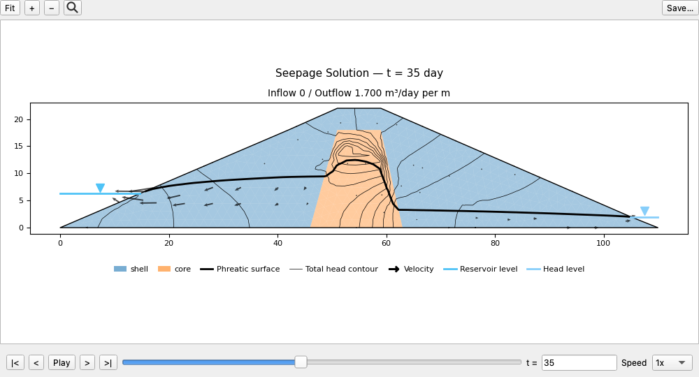
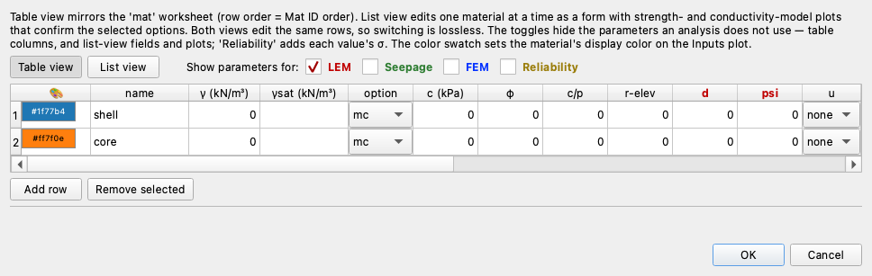
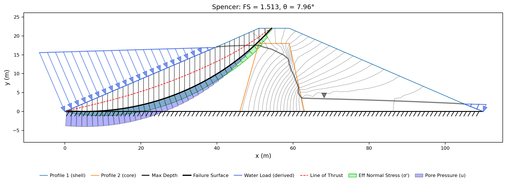
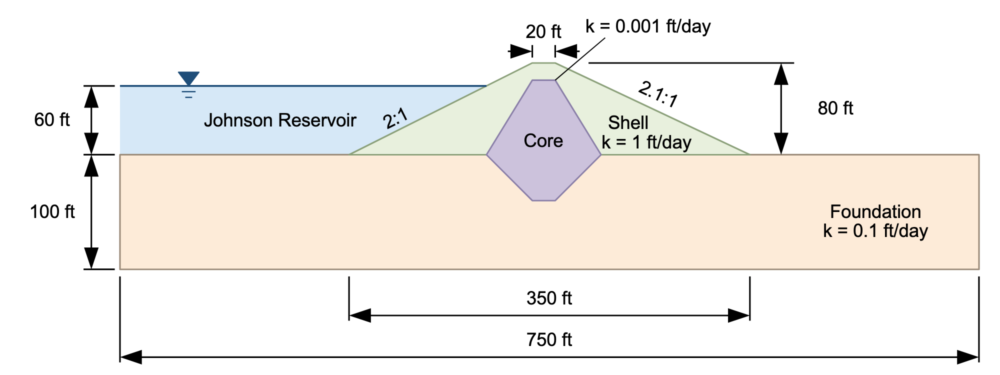

# Tutorial COMBO-3 — Factor of Safety vs Time

A steady seepage analysis produces one pore-pressure field, so a stability run on
it has one answer. A transient analysis produces a field at every saved instant,
and the stability question can be asked at each of them. Plotting those answers
against time shows *when* the slope is weakest, not just how weak.

In [Tutorial SEEP-3](seep03_reservoir_drawdown.md) we built a small earth dam
with a granular shell and a clay core and lowered its reservoir 16 m over
45 days, stopping at the pore pressures. **Part 1** picks that solution up, puts
drained strengths on it and runs one analysis per saved frame, searching both
faces — a falling pool weakens the upstream face, but a full reservoir loads it
and leaves the downstream slope weaker. In **Part 2** we repeat the exercise as
a rapid drawdown at every instant on [COMBO-2](combo02_rapid_drawdown.md)'s
Johnson Reservoir dam, whose clay core needs an undrained treatment.

<div class="tut-glance" markdown>
<div class="tgt-row">
<div class="tgt-tile"><span class="tg-label">Analysis</span><p>Seepage + limit equilibrium (drained, and rapid drawdown)</p></div>
<div class="tgt-tile"><span class="tg-label">Open &amp; run</span><p>~35 min</p></div>
</div>
<div class="tgm-obj" markdown>
**Objectives** — Run a stability analysis at every saved instant of a transient
seepage analysis, choose the saved times and the starting circles, read which face
governs, and repeat the run as a rapid drawdown for a dam with a clay core.
</div>
<p><span class="tg-pill">two materials</span><span class="tg-pill">three materials</span><span class="tg-pill">transient seepage</span><span class="tg-pill">u = seep</span><span class="tg-pill">saved frames</span><span class="tg-pill">seepage time</span><span class="tg-pill">FS vs time</span><span class="tg-pill">rapid drawdown</span><span class="tg-pill">three-stage procedure</span><span class="tg-pill">Kc = 1 envelope</span><span class="tg-pill">d and ψ</span><span class="tg-pill">stage times</span><span class="tg-pill">Spencer</span><span class="tg-pill">circular search</span><span class="tg-pill">starting circles</span><span class="tg-pill">minimum slip depth</span><span class="tg-pill">automatic water loads</span></p>
<div class="tgm-model" markdown>
**Part 1 starter file** — [xslope_earth_dam_fs_time_start.xlsx](files/xslope_earth_dam_fs_time_start.xlsx),
SEEP-3's dam with a starting circle on each face and a minimum slip depth, and no
strengths on its materials table — those are the three values per zone we type in
below. The download includes the mesh and the transient seepage solution (nineteen
time steps) that we sweep in Part 1; we build the seepage side of it in
[SEEP-3](seep03_reservoir_drawdown.md)

**Part 1 completed model** — [xslope_earth_dam_fs_time.xlsx](files/xslope_earth_dam_fs_time.xlsx),
the same dam with the strength band filled in; open it to skip the typing

**Part 2 model** — [xslope_johnson_fs_time.xlsx](files/xslope_johnson_fs_time.xlsx),
COMBO-2's Johnson Reservoir dam — an undrained envelope on the core, `u = seep`
on all three zones, the pool schedule and both stage times. The download includes
the mesh and the transient seepage solution (twenty-one time steps) that we sweep
in Part 2; we build both in [COMBO-2](combo02_rapid_drawdown.md)
</div>
</div>

---

## Part 1 — Drained analysis at each time step

For Part 1 we will use the SEEP-3 dam. Both of its zones will take drained
strengths (c′ and φ′), so at each saved time we will run an ordinary
effective-stress analysis with the pore pressures from that time step. The download
includes the mesh and the transient seepage solution (all nineteen time steps),
so the seepage work is already done; only the strengths are missing. We will open the file, look at what came with it,
type the strengths in, run one instant, and then sweep all nineteen.

### The dam and the drawdown

{width=1000}

The section is 110 m long and 22 m tall at the crest, on rock at elevation 0,
both faces sloping at about 2.3:1. A clay **core** runs from the rock to 4 m
below the crest, 17 m wide at its base and 8 m at its top; the granular **shell**
is everything else. The reservoir stands at elevation 18, the tailwater at
elevation 2 at the toe.

The pool holds at 18 for 2 days, falls 16 m to elevation 2 over the next 45 days,
and holds there for the remaining 253 days of a 300-day run. The shell follows
the pool down and the core does not, and the head the core keeps after the pool
has gone is what makes a drawdown a stability problem.
We built that model in [SEEP-3](seep03_reservoir_drawdown.md); only the save
schedule differs here.

#### How the curve is built

Each saved frame carries a pore pressure at every node of the mesh. A run with
`u = seep` reads that field at every slice base, so each frame gives one factor
of safety. We compute one for each of the nineteen frames and plot them against
time. Between one point and the next, only two things change: the pore
pressures and the reservoir load on the face.

This has two consequences. **The curve can only be as fine as the save
schedule**, because a time that is not a saved frame has no field to read. And
**the critical surface
moves** — the mechanism that governs under a full reservoir is not the one that
governs half drained, and on this dam not even on the same slope, so each instant
gets its own search.

### Opening the model

Download
[xslope_earth_dam_fs_time_start.xlsx](files/xslope_earth_dam_fs_time_start.xlsx)
and open it with **File → Open…**, leaving the mode strip (LEM | Seepage | FEM) on
**LEM**.

Three companion files carry the seepage work and travel with the workbook:
`xslope_earth_dam_fs_time_start_mesh.json` holds the mesh,
`xslope_earth_dam_fs_time_start_tseep.csv` the head and pore pressure at every
node of every saved frame, and `xslope_earth_dam_fs_time_start_tseep_meta.json`
the ledger naming the frames. Studio finds them in the same folder as the workbook and reads them
on open, so the mesh and the seepage solution are already loaded.

[xslope_earth_dam_fs_time.xlsx](files/xslope_earth_dam_fs_time.xlsx) carries the
same dam with the strengths already on it, and its own copies of the three
companions; open that one to skip the typing below.

### The mesh and the seepage solution shipped with the file

Every pore pressure the runs below read comes from the seepage engine, and the
file arrives with those fields solved, so the first thing to do with it is look
at what it carries. Switch the mode strip to **Seepage** (`Ctrl+2`) and click the
**Seep · Transient** tab. The play bar steps through **nineteen** instants —
t = 0, 2, 5, 10, 15, 20, 25, 30, 35, 40, 47, 55, 65, 80, 100, 130, 180, 240 and
300 — and every run below reads one of them.



The schedule is uneven on purpose: five-day frames through the fall, which ends
on day 47, and widening steps after, because the answer moves fastest while the
pool is dropping. Only a saved frame can carry a point of the curve, so the
schedule is a modeling decision taken before the stability question is asked.

Those fields were solved on **614 nodes and 1,089 triangles**, linear triangles
auto-sized at 64 divisions across the 110 m section, a target element size of
110/64 = 1.72 m. Head is a scalar field, so linear elements are enough. We build
[that mesh in SEEP-3](seep03_reservoir_drawdown.md#building-the-mesh), solve
[the full-pool state the transient run starts from](seep03_reservoir_drawdown.md#the-steady-solution-at-full-pool)
and [lower the pool on it](seep03_reservoir_drawdown.md#running-the-transient-seepage-analysis);
the file downloaded above arrives past all three.

### Entering the soil properties

In the starter file the unit weight γ, the saturated unit weight γsat, the
cohesion c′, the friction angle φ′ and the pore-pressure option u are blank for
both zones — the seepage analysis never needed them. We will enter the five
missing values for each zone now.

Switch back to **LEM** (`Ctrl+1`) and click **Materials** in the Inputs tree. Set
the **Show parameters for:** toggles to **LEM** alone, which hides the
conductivity and finite element columns.



Working across each row in the order the table lists its columns, enter
**γ 20**, **γsat 21**, **c 0**, **φ 32** and **u = seep** for the `shell`, and
**γ 19**, **γsat 20**, **c 10**, **φ 25** and **u = seep** for the `core`:


These are typical values for a granular shell and a compacted clay core, chosen
for the exercise rather than measured on this dam. Three things about them
matter for the runs below:

**Two unit weights per row.** γ applies above the water table and γsat below it;
the slicer splits each slice's weight where the two meet, so the shell gets
lighter as the pool drains it.

**Both strengths are drained.** c′ and φ′ are effective-stress parameters under
`option` `mc`, the Mohr-Coulomb envelope the file already selects, so each slice
base needs a pore pressure to form an effective normal stress from.

**We set `u` to `seep` on both rows.** That column decides where a slice base
gets its pore pressure, and `seep` sends it to a solved seepage field;
[COMBO-1](combo01_seepage_stability.md#the-column-that-connects-the-modes) covers
its four values. With a transient solution loaded, `seep` means one frame of it,
chosen at the run rather than here.

Click **OK**.

### Starting circles

With the strengths in, the last input a search needs is somewhere to start
from. Click **Circles**. The file carries two, one on each face of the dam:

| Xo | Yo | Option | Depth |
| :---: | :---: | --- | :---: |
| 7 | 56 | `Depth` | 0 |
| 103 | 59 | `Depth` | 0 |

The file carries one starting circle for each face, because the critical face
changes with the pool: a drawdown weakens the upstream slope, while a full
reservoir loads it and leaves the downstream side weaker. Each circle is drawn
deep — center beyond the heel or the toe, **Depth** = 0 so the bottom of the
circle sits on the rock — because a search settles near where it starts, and a
shallow seed would refine into a small mechanism. The upstream circle runs from
(0.80, 0.34) to the crest edge at (51.50, 22.00); the downstream one from
(57.04, 22.00) to (109.19, 0.33).

In most zoned dams the critical circle cuts the core and the starting circle
should too. This dam is small and its core narrow — 8 m wide at the top, its
crown 4 m below the crest — so the critical circles stay in the shell, and
neither starting circle cuts the core.

Under the table, the **Search window** group holds ten limits on where a searched
surface may run; a blank field is a limit that is not applied, and
[the template page](../usage/input_template.md#search-window-optional) lists all
ten. The file sets one:

| Limit | Value | What it does |
| --- | :---: | --- |
| Min slip depth | 8 | The surface must reach at least 8 m below the ground surface |

That limit sets a minimum size for the failure surface. With c′ = 0 the factor of
safety of a shallow surface parallel to the face is the same at any depth, so
without the limit the search settles on a very thin surface layer just under the
face — a skin failure, not a slide. A minimum of 8 m on a 22 m dam keeps the
search on embankment slides; the Run LEM dialog offers the same limit as
**Ignore surficial (skin) failures**.

The entry and exit ranges are left blank on purpose. Filling them would confine
the trace to one slope, and which slope governs at a given instant is what we
are measuring.


Click **OK** on the Circles editor. The Inputs plot draws the model:

{width=1000}

The blue arrows on the upstream face are the reservoir pressing on the slope,
marked *derived* because nothing entered them. **Water loads** on the main sheet
is `auto`, so the engine reads the pool elevation from the specified-head
boundary conditions of the seepage model and turns the water standing above the
ground into a distributed load, re-derived at every instant from the pool as it
stood then. The
two red dashed arcs are the starting circles, both centers sitting above the
frame.

### Stability at one time step

Before sweeping every time step, we will run the analysis at a single one. This
shows what one point on the curve is — an ordinary limit equilibrium search,
with the pore pressures read from one saved time step of the transient
solution — and it lets us check that the model behaves before we ask for
nineteen of them. We will start at t = 0, the full reservoir, which is also
the first point of the curve.

Click **Run → Run LEM…** **Method** opens on **Spencer**, which satisfies both
force and moment equilibrium and is the method behind every factor of safety on
this page; **Analysis** opens on **Auto search**, which finds the run its own
critical circle, and **Number of slices** on 40.
Leave all three as they are, with **Grid search** unticked.

Because the file carries a transient seepage solution, the dialog shows a
**Seepage time** group. It picks which time step this run reads its pore
pressures from, and offers three ways to choose: **Saved frame** (one of the
nineteen saved time steps), **Frame shown in the results viewer** (whatever the
play bar is on; this option appears only while a transient results tab is open),
or **Another time (reruns the analysis)** (any time in the run — the transient
seepage analysis is re-solved with that time added to the saved steps, so the
pore pressures are always computed, never interpolated between two frames).

Leave **Time** on **Saved frame**. The frame list below it opens on
the last saved time step, t = 300; set it to `t = 0 day`, the full reservoir
the transient run starts from. Leave **Save as the model's stability time**
unticked (ticked, it stores the chosen time in the file for later runs):


**Model checks** finds no problem and carries one note, which restates the
dependency:

> Pore pressures come from the transient seepage solution, at t = 0 day. That
> frame is read into the model when the run starts, in place of any stored field.

Click **Run**. The Log reports the limit it read off the file, then the
refinement:

```text
Applying the file's search window: min_slip_depth.
Searching for the critical circular surface with SPENCER…
[🔁 iteration 1] center=(103.00, 59.00), FS=1.5372, grid=8.8500
[🔁 iteration 4] center=(103.00, 56.79), FS=1.5311, grid=2.2125
[🔁 iteration 7] center=(103.00, 56.79), FS=1.5311, grid=0.2766
[✅ converged] Iter=7, FS=1.5311 (ΔFS<0.0005) at (x=103.00, y=56.79, depth=0.00)
Critical FS = 1.531
Sliding mass = 5,580.9 kN/m over 57.93 m of failure surface
```

The first line names the one limit the file sets. The search screens both
starting circles, takes the downstream one, and steps its center down in halving
increments until the factor of safety stops moving by more than 0.0005.

**The factor of safety at full pool is 1.531, on the downstream face.** The
critical circle is centered at (103.00, 56.79), tangent to the rock at elevation
0, breaking at the crest at (58.12, 22.00) and daylighting at the toe at
(109.16, 0.34), carrying 5,580.9 kN/m of dam over 57.93 m of surface.

{width=1000}

The reservoir is on the other side. Its blue arrows reach **176.6 kPa** at the
heel under 18 m of water and taper to zero at the waterline; that stabilizing
load is why the upstream face is not critical here. Under the failure surface the
pale blue band is the pore pressure on each slice base and the green hatched band
above it the effective normal stress.

Now we will ask the same question a few days into the fall, at t = 5 — the pool
has just started down. Reopen **Run → Run LEM…**, set **Saved frame** to
`t = 5 day` and click **Run**:

```text
Applying the file's search window: min_slip_depth.
Searching for the critical circular surface with SPENCER…
[🔁 iteration 9] center=(5.20, 65.90), FS=1.5132, grid=0.2996
[🔁 iteration 10] center=(5.20, 65.90), FS=1.5132, grid=0.1498
[✅ converged] Iter=10, FS=1.5132 (ΔFS<0.0005) at (x=5.20, y=65.90, depth=0.02)
Critical FS = 1.513
Sliding mass = 6,237.2 kN/m over 60.20 m of failure surface
```

**1.513, and the circle has crossed to the other side of the dam** — center
(5.20, 65.90) against the full-pool run's (103.00, 56.79). Three days of fall
have taken the pool from elevation 18 to 16.93, and that one meter of water is
enough to hand the answer to the upstream slope: the reservoir load that held it
down is coming off, while the pore pressures inside it have barely begun to
drain.

{width=1000}

The blue arrows still reach the heel, at **166.1 kPa** against the full-pool
**176.6 kPa**, and they now taper out at elevation 16.9 instead of 18. The
critical surface runs from the crest edge at (54.33, 22.00) down to the heel at
(0.44, 0.19), bottoming at elevation 0.02 on the rock. The sweep will show where
the factor of safety goes from here.

### Sweeping all time steps

Repeating the last step nineteen times by hand would draw the curve, but the
Parametric dialog can do it in one run: it steps through every saved time
step, runs the same search at each one with that step's pore pressures, and
plots the factors of safety against time. We will run that sweep now. Click
**Run → Parametric…** and set **Mode** to **Factor of safety vs time**:


Leave **Method** on **Spencer** and **Number of slices** at 40. The parameter
picker the other three modes use is gone, because nothing is substituted — every
point solves *this* model against a different instant's pore pressures. In its
place is a **Saved frames** list holding the nineteen the run stored, all
ticked, and unticking samples a long one. **Rapid drawdown at each time** is
grayed out, because neither zone on this dam carries the $d$ / $\psi$ pair that
analysis reads; Part 2 runs it on a dam that does. Leave **Grid search (auto-seed
the circular search)** off, and leave **Re-search the critical surface at each
step** ticked, because the mechanism moves.

Click **Run**. Nineteen searches report their factors of safety to the Log:

```text
Factor of safety vs time (lem): 19 instant(s) of the transient solution, spencer, re-searching at each…
  t = 0 day      spencer   FS = 1.5311
  t = 2 day      spencer   FS = 1.5311
  t = 5 day      spencer   FS = 1.5132
  t = 10 day     spencer   FS = 1.4572
  ...
Lowest factor of safety 1.3313 at t = 35 day (19 instant(s), 0 without a result).
```

The run opens an **FS vs Time** tab with the curve, its lowest instant ringed and
the pool schedule drawn faintly behind.

**Day 0 and day 5 repeat the two single runs, at 1.5311 and 1.5132** — the
sweep reads the same minimum slip depth and searches from the same two circles as
the dialog runs. An instant that produces no result comes back as a row carrying
its reason rather than as a gap in the curve.

<!-- test: file=files/xslope_earth_dam_fs_time.xlsx, type=fs_vs_time, method=spencer, march=file, num_slices=40, expected_first=1.5311, critical_time=35, min_fs=1.3313, tolerance=0.005, benchmark=COMBO-3-drained -->

### The factor of safety vs time curve

Every circle above bottoms at, or within a tenth of a meter of, the rock at
elevation 0. The **face** column is read off the center: the crest runs from
x = 51 to x = 59, so a center left of it is an upstream mechanism and a center
right of it a downstream one. The curve below colors each point by that column,
shades the days the pool is falling, and carries the full-pool 1.531 across as a
dashed reference.

{width=1000}

This is the plot the **FS vs Time** result tab draws, exactly as Studio shows it.
The same nineteen instants, with the critical circle the search found at each
and the face it sits on, read from the tab's **Table** sub-tab:

| t (day) | pool (m) | FS | center | R (m) | face |
| :---: | :---: | :---: | :---: | :---: | --- |
| 0 | 18.00 | 1.5311 | (103.00, 56.79) | 56.79 | downstream |
| 2 | 18.00 | 1.5311 | (103.00, 56.79) | 56.79 | downstream |
| 5 | 16.93 | 1.5132 | (5.20, 65.90) | 65.88 | upstream |
| 10 | 15.16 | 1.4572 | (5.20, 65.90) | 65.88 | upstream |
| 15 | 13.38 | 1.4128 | (5.20, 65.90) | 65.88 | upstream |
| 20 | 11.60 | 1.3773 | (6.25, 60.58) | 60.58 | upstream |
| 25 | 9.82 | 1.3509 | (7.00, 57.81) | 57.75 | upstream |
| 30 | 8.04 | 1.3344 | (7.00, 56.91) | 56.91 | upstream |
| 35 | 6.27 | **1.3313** | (7.00, 56.91) | 56.91 | upstream |
| 40 | 4.49 | 1.3436 | (7.00, 56.91) | 56.91 | upstream |
| 47 | 2.00 | 1.3813 | (7.00, 57.16) | 57.16 | upstream |
| 55 | 2.00 | 1.4386 | (7.00, 57.16) | 57.16 | upstream |
| 65 | 2.00 | 1.4828 | (7.00, 57.16) | 57.16 | upstream |
| 80 | 2.00 | 1.5187 | (7.00, 57.16) | 57.16 | upstream |
| 100 | 2.00 | 1.5482 | (103.00, 56.79) | 56.79 | downstream |
| 130 | 2.00 | 1.5516 | (103.00, 56.79) | 56.79 | downstream |
| 180 | 2.00 | 1.5550 | (103.00, 56.79) | 56.79 | downstream |
| 240 | 2.00 | 1.5566 | (103.00, 56.79) | 56.79 | downstream |
| 300 | 2.00 | 1.5572 | (103.00, 56.79) | 56.79 | downstream |

**Day 2 repeats day 0 exactly**, at 1.5311 on the same downstream circle, because
the pool has not moved and neither has the field.

**The lowest of the nineteen is 1.3313, on day 35** — 13% below the full-pool
1.5311, and **12 days before the drawdown ends**, with the pool at elevation 6.27
and 4.3 m of the 16 m drawdown still to come.

**Day 47, the end of the drawdown, reads 1.3813** — 0.05 *above* the minimum and
still upstream. The instant the pool stops falling is not the instant the dam is
weakest.

**After the fall the curve climbs, then flattens.** From 1.3813 it rises to
1.4386 by day 55, 1.4828 by day 65 and 1.5187 by day 80, all upstream; the answer
passes to the downstream mechanism at day 100 and levels out at 1.5482, 1.5516,
1.5550, 1.5566 and 1.5572 through day 300.

#### Which face governs

The face column does not move with the factor of safety.

**At full pool the downstream face governs, at 1.5311**, because 18 m of water
press the upstream slope into the dam.

**From the first frame of the drawdown the upstream face governs, and it holds
the answer for two thirds of the run.** By day 5 the pool has dropped about a
meter and the critical circle is already at (5.20, 65.90) at 1.5132; it stays
upstream through the fall, the minimum and the recovery, down to 1.3313 on day 35
and back to 1.5187 on day 80.

**At day 100 the downstream face takes it back**, at 1.5482, and keeps it to the
end, once the upstream slope has climbed past a downstream mechanism that has
barely moved all run.

So the reported curve is two mechanisms in sequence, not one surface moving, and
the figure marks each point by the face it came out on. The handover falls
between day 80 and day 100, where the two cross at about 1.55. A run given one
starting circle on one face would draw a smooth curve through one mechanism and
miss the other.

**The mechanism also grows.** At full pool the critical circle carries 5,580.9
kN/m over 57.93 m of surface; the day-35 circle carries 5,722.8 kN/m over
58.01 m of the other slope. Neither is the surface the other run would have
reported, which is why **Re-search the critical surface at each step** matters.

#### The critical time step

{width=1000}

The failure surface is on the other slope from the full-pool figure. The
reservoir load has fallen from **176.6 kPa** at the heel to **61.5 kPa** and
reaches only to elevation 6.3 instead of 18. The contours are still crowded over
the core, which holds head the pool no longer balances. The surface runs from the
heel at (0.80, 0.34) to the crest edge at (51.94, 22.00), tangent to the rock.

### Reading the curve

Two things happen to the upstream slope when the pool is lowered, at different
speeds.

**The stabilizing load leaves immediately.** The reservoir's pressure on the face
resists the slide directly and tracks the pool exactly — 176.6 kPa at the heel on
day 0, 61.5 on day 35, and 19.6 from day 47 on — because a load is a boundary
condition, not something the soil has to release.

**The pore pressure inside leaves slowly.** The shell can follow the pool, its
vertical conductivity over drainable porosity being 0.5 / 0.22 = 2.3 m/day
against the pool's 0.36 m/day; the core cannot, at 0.005 / 0.03 = 0.17 m/day, and
still holds 8.6 m of head on day 47, as we measured
[in SEEP-3](seep03_reservoir_drawdown.md#reading-the-frames).

The factor of safety falls while the load is ahead of the drainage and rises once
the drainage catches up, so day 35 marks that crossover rather than the end of
the drawdown. Over the next 12 days the pool gives up its last 4.3 m while the
shell keeps draining, and the strength recovers faster than the load falls —
1.3436 by day 40, 1.3813 by day 47, 1.5187 by day 80.

---

## Part 2 — Rapid drawdown analysis at each time step

Every point on the Part 1 curve is a drained analysis: the strength at each time
step is the effective-stress strength of the shell and the core, with the pore
pressures from the seepage solution at that step. That is right when the soil
drains as fast as the pool drops. Over a short drawdown period, a low-permeability
zone does not, and undrained strengths govern instead. For that case the drawdown
should be analyzed as a rapid drawdown, with the three-stage Duncan, Wright and
Wong procedure of [COMBO-2](combo02_rapid_drawdown.md). The Part 1 model carries
no $d$ / $\psi$ pair, so it cannot be used for that.

The Johnson Reservoir dam from COMBO-2 can. Its core carries a $K_c = 1$
envelope, and in COMBO-2 we ran the three-stage procedure on it three times, once
per statement of where the water is, reading 1.181, 1.195 and 1.016 — the last
from a transient run, stage 1 at t = 0 and stage 2 at t = 50. Here we will run it
at **every** saved instant, and then run Part 1's kind of curve on the same
twenty-one frames for comparison.

### The dam

{width=1000}

The section is 750 ft long, a 100 ft foundation on rock at elevation 0 with an
80 ft embankment on it, a sand **shell** on both faces and a compacted-clay
**core** carried 40 ft into the foundation as a cutoff key. The reservoir stands
at elevation 160 and the tailwater at 100, and the drawdown lowers the pool 50 ft
to 110. That geometry is [SEEP-2](seep02_johnson_dam.md)'s, and in COMBO-2 we put
the seepage boundary sets, the pool schedule and the stage times on it.

### Opening the model

Download [xslope_johnson_fs_time.xlsx](files/xslope_johnson_fs_time.xlsx) and
open it with **File → Open…**, leaving the mode strip on **LEM**. Its three
companions — `xslope_johnson_fs_time_mesh.json`, `xslope_johnson_fs_time_tseep.csv`
and `xslope_johnson_fs_time_tseep_meta.json` — sit in the same folder as the workbook and Studio
reads them on open, so the mesh and the seepage solution are already loaded. In
**LEM** the inputs
view draws that mesh behind the zones.

{width=1000}

### What the file carries

Nothing on this dam has to be built, so before running anything we go through
what came with it. Five things the file carries decide what the sweep can do.

**The undrained envelope.** Click **Materials** and set the **Show parameters
for:** toggles to **LEM** alone. Only the core carries a $K_c = 1$ envelope —
$d = 250$ psf and $\psi = 14°$, under its drained $c' = 400$ psf and
$\phi' = 18°$ — and blanks on the shell and the foundation declare them
free-draining through the drawdown.

| mat | name | γ (pcf) | c′ (psf) | φ′ (deg) | d (psf) | ψ (deg) | u |
| :---: | --- | :---: | :---: | :---: | :---: | :---: | --- |
| 1 | `shell` | 130 | 100 | 35 | — | — | `seep` |
| 2 | `core` | 125 | 400 | 18 | 250 | 14 | `seep` |
| 3 | `foundation` | 127 | 100 | 27 | — | — | `seep` |

We cover the procedure itself
[in COMBO-2](combo02_rapid_drawdown.md#the-three-stage-procedure) — what each
stage computes, and how stage 2's strength is interpolated between the undrained
and drained envelopes by the stress ratio each slice consolidated at.

**`u` is `seep` on all three rows**, so every slice base takes its pore pressure
from a solved seepage field. In COMBO-2 we deleted the file's two piezometric
lines when we replaced them, which is why the figure above draws a water surface
and a derived load and no piezometric line.

**One starting circle, on the upstream face.** Click **Circles**: the file carries
a single one, center (275, 235) with a radius of 160 ft, tangent at elevation 75.
Every search below starts from it. One circle is enough here because which face
governs is not in question — lowering the pool takes the water off the upstream
slope and leaves it inside the embankment — where Part 1's dam needed a circle on
each face. Click **OK**.

**The schedule and the stage times.** Switch the mode strip to **Seepage**
(`Ctrl+2`) and click **Transient** in the Inputs dock. The `pool` series holds at
elevation 160 for five days and falls to 110 over the following 45, the run lasts
500 days, and the save times are listed outright, a frame every five days to the
end of the fall and widening steps after. **Stage 1 time** is `0` and **Stage 2
time** is `50`. Click **OK**.

That schedule is this file's own; the [COMBO-2](combo02_rapid_drawdown.md)
workbook keeps a coarser one and a 1,000-day run. Its instants are packed where
the answer moves, and the run stops at day 500 because the curve has flattened
before then. Every point below reads its consolidation stresses at stage 1, which
stays at t = 0 for the whole sweep; what moves is stage 2.

**The mesh and the transient solution.** Still in **Seepage**, click the **Seep · Transient**
tab. The play bar steps through **twenty-one** instants — t = 0, 5, 10, 15, 20,
25, 30, 35, 40, 45, 50, 60, 70, 80, 100, 130, 170, 220, 300, 400 and 500 — and
every pore pressure the runs below read comes from one of them.

Those fields were solved on **2,080 nodes and 3,923 triangles**, linear triangles
auto-sized at 100 divisions across the 750 ft section, a target element size of
750/100 = 7.5 ft. We built
[that mesh in COMBO-2](combo02_rapid_drawdown.md#meshing-and-both-solves) and
[ran the transient seepage analysis on it](combo02_rapid_drawdown.md#running-the-transient-seepage-analysis);
both are already done in the file downloaded above.

### Running the rapid drawdown sweep

That is everything a run reads, so we can sweep the whole transient solution in one go. Switch back
to **LEM** (`Ctrl+1`) and click **Run → Parametric…**


Set **Mode** to **Factor of safety vs time**. **Method** opens on **Spencer** and
**Number of slices** on 40; leave both. **Saved frames** lists the twenty-one this
run stored. Tick **Rapid drawdown at each time**, and t = 0 unticks and dims:
stage 1 of every drawdown is read there, so that frame is the state the others
fall from and cannot be a drawdown of its own. Leave the other twenty ticked,
because the comparison at the end of this part needs all of them.

**Rapid drawdown at each time → ticked.** Left off, each instant is one
single-stage analysis of that instant's water. Ticked, each instant becomes stage
2 of a three-stage drawdown whose stage 1 is the transient run's initial state, so the
curve gives the factor of safety if the pool falls from full to where it stands
at that moment.

**Re-search the critical surface at each step** goes gray and is held on, because
a drawdown's critical surface is not the drained one and moves as the field does.
Every point searches from the starting circle described above.

The **Model checks** panel repeats COMBO-2's one warning: two of the three
materials carry no $d$ / $\psi$ and keep their drained strength through the
drawdown. Boundary set 2 raises nothing, because
[we cleared it in COMBO-2](combo02_rapid_drawdown.md#clearing-boundary-set-2)
before that run; a transient run solves boundary set 1 only.

Click **Run**. Each of the twenty instants is a drawdown searched in full, so the
table lands when the last search finishes:

```text
Rapid drawdown vs time (lem): 20 instant(s) of the transient solution, spencer, re-searching at each…
Rapid drawdown versus time (stage 1 at t = 0)
t (day)  stage 1  stage 2       stage 3      FS  governs      Xo      Yo       R
      5   1.5109   1.4563  not required  1.4563        2  242.74  256.34  165.90
     10   1.5142   1.3496  not required  1.3496        2  244.06  253.05  164.14
     15   1.5248   1.2704  not required  1.2704        2  246.78  250.47  163.54
     20   1.5352   1.2036  not required  1.2036        2  249.59  244.90  159.60
     25   1.5414   1.1489  not required  1.1489        2  249.59  243.48  159.38
     30   1.5440   1.1051  not required  1.1051        2  249.59  243.48  159.76
     35   1.5453   1.0711  not required  1.0711        2  248.17  244.19  161.02
     40   1.5465   1.0457  not required  1.0457        2  247.47  244.90  162.02
     45   1.5525   1.0279        1.0278  1.0278        3  244.64  244.19  162.68
     50   1.5545   1.0163        1.0157  1.0157        3  243.93  244.90  163.64
     60   1.5518   1.0523        1.0522  1.0522        3  245.35  242.07  160.48
     70   1.5506   1.0743  not required  1.0743        2  245.31  246.38  164.30
     80   1.5512   1.0902  not required  1.0902        2  245.31  244.96  163.08
    100   1.5514   1.1159  not required  1.1159        2  245.31  243.53  161.82
    130   1.5514   1.1414  not required  1.1414        2  245.31  243.53  161.82
    170   1.5514   1.1612  not required  1.1612        2  245.31  243.53  161.82
    220   1.5514   1.1744  not required  1.1744        2  245.31  243.53  161.82
    300   1.5514   1.1848  not required  1.1848        2  245.31  243.53  161.82
    400   1.5514   1.1893  not required  1.1893        2  245.31  243.53  161.82
    500   1.5514   1.1912  not required  1.1912        2  245.31  243.53  161.82
Lowest factor of safety 1.0157 at t = 50 day (20 instant(s), 0 without a result).
```

### The rapid drawdown curve

The run opens a **Drawdown vs Time** tab, the same tab a single-stage sweep
uses:

{width=1000}

One curve is drawn, carrying the rapid drawdown factor of safety at each instant,
the lower of stages 2 and 3; the three stages are in the table below, where the
governing one is named per row. Behind it, on the right axis, runs the pool
schedule, with the forty-five days it falls over shaded and the pre-drawdown
1.456 carried across as a dashed full-pool reference. The lowest instant is
ringed and labeled, and the red guide marks FS = 1. Each point is colored by the stage that governs it —
orange where stage 2's undrained strength gave the lower factor of safety, green
where stage 3's drained strength did — so the three drained instants at the
bottom of the dip stand out on the curve.

The same twenty instants, read from the tab's **Table** sub-tab — the three
stage factors of safety, the one that governs, and the critical circle at each:

| t (day) | stage 1 | stage 2 | stage 3 | FS | governs | center | R (ft) |
| :---: | :---: | :---: | :---: | :---: | :---: | :---: | :---: |
| 5 | 1.5109 | 1.4563 | — | 1.4563 | 2 | (242.74, 256.34) | 165.90 |
| 10 | 1.5142 | 1.3496 | — | 1.3496 | 2 | (244.06, 253.05) | 164.14 |
| 15 | 1.5248 | 1.2704 | — | 1.2704 | 2 | (246.78, 250.47) | 163.54 |
| 20 | 1.5352 | 1.2036 | — | 1.2036 | 2 | (249.59, 244.90) | 159.60 |
| 25 | 1.5414 | 1.1489 | — | 1.1489 | 2 | (249.59, 243.48) | 159.38 |
| 30 | 1.5440 | 1.1051 | — | 1.1051 | 2 | (249.59, 243.48) | 159.76 |
| 35 | 1.5453 | 1.0711 | — | 1.0711 | 2 | (248.17, 244.19) | 161.02 |
| 40 | 1.5465 | 1.0457 | — | 1.0457 | 2 | (247.47, 244.90) | 162.02 |
| 45 | 1.5525 | 1.0279 | 1.0278 | 1.0278 | 3 | (244.64, 244.19) | 162.68 |
| 50 | 1.5545 | 1.0163 | 1.0157 | **1.0157** | 3 | (243.93, 244.90) | 163.64 |
| 60 | 1.5518 | 1.0523 | 1.0522 | 1.0522 | 3 | (245.35, 242.07) | 160.48 |
| 70 | 1.5506 | 1.0743 | — | 1.0743 | 2 | (245.31, 246.38) | 164.30 |
| 80 | 1.5512 | 1.0902 | — | 1.0902 | 2 | (245.31, 244.96) | 163.08 |
| 100 | 1.5514 | 1.1159 | — | 1.1159 | 2 | (245.31, 243.53) | 161.82 |
| 130 | 1.5514 | 1.1414 | — | 1.1414 | 2 | (245.31, 243.53) | 161.82 |
| 170 | 1.5514 | 1.1612 | — | 1.1612 | 2 | (245.31, 243.53) | 161.82 |
| 220 | 1.5514 | 1.1744 | — | 1.1744 | 2 | (245.31, 243.53) | 161.82 |
| 300 | 1.5514 | 1.1848 | — | 1.1848 | 2 | (245.31, 243.53) | 161.82 |
| 400 | 1.5514 | 1.1893 | — | 1.1893 | 2 | (245.31, 243.53) | 161.82 |
| 500 | 1.5514 | 1.1912 | — | 1.1912 | 2 | (245.31, 243.53) | 161.82 |

**Day 50 reads 1.0157, the answer we got in COMBO-2.** The transient route there
reports **1.0158** on a circle at (243.93, 244.90) with a radius of 163.64 ft,
and the day-50 row lands on that circle at 1.0157. At t = 50 this sweep poses the
drawdown we posed in COMBO-2 — stage 1 at 0, stage 2 at 50, the same transient run and
the same starting circle — so the curve passes through that answer.

<!-- test: file=files/xslope_johnson_fs_time.xlsx, type=fs_vs_time, method=spencer, rapid=true, march=file, num_slices=40, expected_first=1.4563, critical_time=50, min_fs=1.0157, tolerance=0.005, benchmark=COMBO-3-rapid -->

**Stage 3 runs on three rows, all of them at the bottom of the dip.** Days 45, 50
and 60 read 3 in the **governs** column, by a single ten-thousandth on days 45
and 60 and six on day 50 — 1.0279 / 1.0278, 1.0163 / 1.0157, 1.0523 / 1.0522.
Every other row reads `not required`, meaning no core slice came out weaker
drained than undrained. The margins are thin because the handover falls at
$d = 223$ psf, 27 psf under the 250 psf this core carries.

**Day 5 costs 0.05 with no drawdown in it.** The pool holds at elevation 160
until day 5, so stage 2's water is stage 1's water. The reported
1.4563 still sits 0.055 below the 1.5109 stage 1 reads on the same circle, and
that gap is the undrained envelope alone, measured with the water held still.

**The minimum, 1.0157, falls on day 50, the instant the pool stops falling.**
That is not a rule. Two effects compete while the pool drops: the reservoir's
support keeps falling until the pool stops, and the core's pore pressures start
dissipating from the moment the drop begins. On this dam the drawdown is fast
against a core at 0.001 ft/day, so the pore pressures barely move and the worst
instant is the one with the least load. Part 1's dam drained fast enough for
dissipation to overtake the load loss mid-fall, and its minimum came 12 days
*before* its drawdown ended.

Day 45 reads 1.0278 and day 60 reads 1.0522, so the saved times bracket that
minimum and the curve turns at a frame rather than between two.

**The recovery climbs toward COMBO-2's two-steady answer.** From 1.0157 the curve
rises to 1.0902 by day 80 and 1.1414 by day 130, then slows to 1.1612, 1.1744,
1.1848, 1.1893 and 1.1912 through day 500, the last two frames together moving it
by 0.0019. COMBO-2's **two-steady-solution**
answer is **1.195**, and the curve is still 0.004 under it at day 500, because by
then the core has not quite finished draining.

**The stage 1 column is not constant, even though stage 1 is the same full-pool
state on every row.** It ranges from 1.5109 on day 5 to 1.5545 on day 50 because
each row searches for the circle that gives the lowest *drawdown* factor of
safety at that time step, and then reports the stage 1 factor of safety on that
circle. The circle moves from row to row, so the stage 1 value on it moves too.

### The same time steps with drained strengths

We can run the same twenty-one frames at drained strengths. Open
**Run → Parametric…** again, untick **Rapid drawdown at each time**, keep every
other field, and click **Run**; **Re-search the critical surface at each step**
comes back live and stays ticked.

Each point now runs about three times faster, solving the section once rather
than three times:

```text
Factor of safety vs time (lem): 21 instant(s) of the transient solution, spencer, re-searching at each…
Factor of safety versus time
t (day)      FS      Xo      Yo       R
      0  1.5097  240.00  261.13  169.97
      5  1.5097  240.00  261.13  169.97
     10  1.3944  242.71  254.34  164.71
     15  1.3093  244.00  250.40  162.76
     20  1.2374  248.18  242.77  157.49
     25  1.1779  249.59  242.07  157.77
     30  1.1301  249.59  239.24  155.60
     35  1.0930  248.88  239.24  156.31
     40  1.0656  246.76  241.36  159.20
     45  1.0469  246.76  241.01  158.89
     50  1.0350  243.89  244.96  163.73
     60  1.0765  245.31  242.11  160.55
     70  1.1037  245.31  244.96  163.08
     80  1.1244  245.31  243.53  161.82
    100  1.1587  245.31  243.53  161.82
    130  1.1949  245.31  243.53  161.82
    170  1.2252  245.31  243.53  161.82
    220  1.2475  244.60  244.60  163.07
    300  1.2684  245.67  243.18  161.32
    400  1.2802  244.60  242.82  161.51
    500  1.2870  244.60  244.25  162.76
```

Every instant produces a result here, including t = 0, an ordinary full-pool
analysis rather than a fall from itself. **Day 0 and day 5 read 1.5097 on the
same circle**, the pool not having moved between them.

Two of these rows repeat the drained bracket runs from COMBO-2: **day 0's
1.5097** is the full-pool drained figure of **1.510** there, and **day 50's
1.0350** the day-50 figure of **1.035**. The third of those, the long-term
**1.311**, is not on this curve — day 500 reads 1.2870 and is still climbing,
because a run of this length leaves the core part drained.

<!-- test: file=files/xslope_johnson_fs_time.xlsx, type=fs_vs_time, method=spencer, march=file, num_slices=40, times=0;50;500, expected=1.5097;1.0350;1.2870, tolerance=0.005, benchmark=COMBO-3-single -->

Studio's result tab holds one curve at a time, so the figure below plots both
results on one pair of axes:

{width=1000}

**The rapid drawdown curve runs below the single-stage curve at every instant**,
and the distance between them is not constant:

| t (day) | drawdown | single-stage | difference |
| :---: | :---: | :---: | :---: |
| 5 | 1.4563 | 1.5097 | 0.0534 |
| 10 | 1.3496 | 1.3944 | 0.0448 |
| 15 | 1.2704 | 1.3093 | 0.0389 |
| 20 | 1.2036 | 1.2374 | 0.0338 |
| 25 | 1.1489 | 1.1779 | 0.0290 |
| 30 | 1.1051 | 1.1301 | 0.0250 |
| 35 | 1.0711 | 1.0930 | 0.0219 |
| 40 | 1.0457 | 1.0656 | 0.0199 |
| 45 | 1.0278 | 1.0469 | 0.0191 |
| 50 | **1.0157** | **1.0350** | **0.0193** |
| 60 | 1.0522 | 1.0765 | 0.0243 |
| 70 | 1.0743 | 1.1037 | 0.0294 |
| 80 | 1.0902 | 1.1244 | 0.0342 |
| 100 | 1.1159 | 1.1587 | 0.0428 |
| 130 | 1.1414 | 1.1949 | 0.0535 |
| 170 | 1.1612 | 1.2252 | 0.0640 |
| 220 | 1.1744 | 1.2475 | 0.0731 |
| 300 | 1.1848 | 1.2684 | 0.0836 |
| 400 | 1.1893 | 1.2802 | 0.0909 |
| 500 | 1.1912 | 1.2870 | 0.0958 |

**The gap is narrowest where the slope is weakest.** Across the bottom of the dip
— days 40 to 50 — the two analyses run 0.019 apart, about 1.9% of the rapid
drawdown answer; by day 500 they are 0.096 apart, 8.0% of it.

The pore pressure in the core explains both halves. At day 50 the core still
holds the head the full reservoir put into it, so the *drained* strength there is
already cut by that pore pressure and lands close to the undrained strength stage
2 assigns, the same reading
[we take in COMBO-2](combo02_rapid_drawdown.md#the-three-answers-and-what-brackets-them)
from its bracket table, where the same envelope moves one field by 0.12 and the
other by 0.02. Afterward the two separate: the drained strength recovers as the
core drains, and the undrained one cannot, because stage 2 computes it from
stage-1 consolidation stresses that never change. One curve climbs to 1.29 and
the other levels off near 1.19.

### Which curve to use

The two curves answer two questions, and neither is the other's conservative
version.

**Through the fall and just after it, read the rapid drawdown curve.** Its number
for this dam is **1.016, on day 50**. During those 45 days the core cannot shed
the reservoir's head, so the strength it can mobilize is the undrained one, and a
single-stage drained analysis credits it with strength it does not have. That the
single-stage curve reads only 0.019 higher is a property of this dam — on this
core the two strengths sit close together at the stresses the surface sees. A
more contractive core or a faster drawdown would open that gap well beyond
0.02.

**Long after the fall, read the single-stage curve.** By day 500 the core has
largely drained and 1.2870 is what the slope actually has. The rapid drawdown
curve's 1.1912 at that instant still answers "what if the pool fell from full to
here", the long-term drawdown state COMBO-2's two steady solutions compute, which
applies only if the reservoir is filled and drawn down again.

For a zoned dam with a core that does not drain, the design number is the rapid
drawdown curve's minimum and the long-term number is the single-stage curve's
plateau.

---

## Conclusion

In this tutorial we covered:

- Running a stability analysis at one time step of a transient seepage solution,
  and sweeping every saved time step with **Run → Parametric… → Factor of safety
  vs time**.
- Reading the curve: on Part 1's dam the minimum falls mid-drawdown, before the
  pool stops moving, and the governing face changes as the pool falls.
- Repeating the sweep as a rapid drawdown at each time step, for a dam whose core
  carries an undrained envelope.
- Comparing the two curves: the rapid drawdown curve governs through the fall and
  just after it, the drained curve the long-term condition.

**Where to go next:** [SEEP-3](seep03_reservoir_drawdown.md) builds Part 1's
transient seepage model, and [COMBO-2](combo02_rapid_drawdown.md) builds Part 2's
and runs the three-stage procedure at one instant.
[Factor of safety versus time](../parametric/sensitivity.md#factor-of-safety-versus-time)
covers the sweep mode, [Transient seepage](../seep/transient.md) the formulation,
and [Rapid drawdown analysis](../lem/rapid.md) the three-stage procedure. The
[tutorials index](index.md) lists the series.
