# Tutorial FEM-1 — Strength Reduction Basics

Every stability tutorial before this one found a factor of safety by choosing a
failure surface and checking the equilibrium of the soil above it. This one never
chooses a surface. A finite element analysis meshes the whole slope, gives the
soil a stiffness as well as a strength, and solves for the stress and the
displacement at every point of it. The **strength reduction method** (SSRM on the
dialogs) turns that solver into a stability analysis: it weakens the soil, step
by step, until the slope can no longer hold itself up. Where it fails, and on
what shape, is something the run reports rather than something you supply.

The example is a 50 ft embankment on a rigid base — one soil, no water, no
loads — which is the simplest slope the method can be shown on. It is
solved twice. First with **Spencer's method**, on its own search, and that
answer is the reference everything after it is read against. Then the same
model is meshed and run by **strength reduction**, and the two numbers are put
side by side. In between are the three things a finite element stability run
needs that a limit equilibrium run does not: two elastic properties, a mesh,
and a set of convergence controls that decide whether the answer you are given
is the answer the model has.

[LEM-1](lem01_simple_embankment.md) built a slope of this kind from nothing and
covers the geometry, the material and the circular search, and
[SEEP-1](seep01_sheetpile.md#building-the-mesh) covers mesh building and element
order; this page does not repeat either. It starts from a **starter file** that
already carries the section, the soil strength and one starting circle, so the
only inputs added here are the ones the finite element side needs.

Analysis
Finite element

Build &amp; explore
~25 min

**Objectives** — Learn how to find a factor of safety by strength reduction:
what the two elastic properties a mesh needs do and do not change, how to mesh a
slope for a stability run and what the boundaries of the mesh are held by, how
the search brackets and bisects the critical factor and how far to let each
trial run before believing the number, and how to read the mechanism it finds
out of shear strain, a deformed mesh and displacement vectors.

one materialMohr-Coulombfinite elementstrength reductionYoung's modulusPoisson's ratioquadratic trianglesside boundary conditionstensile cutoffbisection bracketiteration budgetshear straindeformed meshdisplacement vectors

**Starter file** — [xslope_ssrm_embankment_start.xlsx](files/xslope_ssrm_embankment_start.xlsx),
the section, the soil strength and one starting circle, with no elastic
properties and no mesh settings; this is the file the page starts from

**Completed model** — [xslope_ssrm_embankment.xlsx](files/xslope_ssrm_embankment.xlsx),
the same model with E and ν filled in and the element type and target size
declared; open it to skip [the elastic properties](#youngs-modulus-and-poissons-ratio) —
its Build Mesh dialog opens with auto-sizing already off at 3.5 ft, and its Run
FEM dialog opens with one warning rather than two errors. Neither file carries a
mesh, so the meshing step below is done on either one

---

## What strength reduction does

The method asks the slope the same question over and over, with the soil made
weaker each time. At a trial reduction factor *F*, both Mohr-Coulomb strength
parameters are divided by it:

>>*c*r = *c* / *F* &nbsp;&nbsp;&nbsp; tan φr = tan φ / *F*

It is tan φ that is divided, not φ, so the scheme stays well behaved as the
friction angle approaches zero. If the material carries a tensile cutoff and
**Tension SRF** is on, that cap is divided by *F* as well, so the whole envelope
weakens at one rate rather than the shear part weakening while the tensile part
stands still.

The weakened soil is then handed to the finite element solver, which iterates
until the stress everywhere is both in equilibrium with gravity and inside the
weakened envelope. That loop is the **viscoplastic** iteration: wherever the
stress has strayed outside the envelope it is pulled back onto it, the part that
could not be carried is shed to the surrounding soil as permanent strain, and
the pass repeats until nothing is left outside. Every iteration count on this
page is a count of those passes. At a low *F* the solver finds that state in a
few dozen of them.
As *F* rises, more of the slope yields, the state takes longer to reach, and
past some value it does not exist at all: the iteration never settles and the
displacements simply keep growing. **The factor of safety is the largest *F* the
slope still stands at**, and finding it is a search over *F* rather than a
search over surfaces.

Two consequences are worth holding on to before the first run. Failure here is
**the solver failing to find equilibrium**, not a surface reaching a limit
state, so how long each trial is allowed to iterate is part of the answer. And
because nothing about a surface was assumed, the mechanism comes out of the
solution: the band of soil that is straining is wherever the model put it.
[Shear strength reduction](../fem/overview.md#shear-strength-reduction-method-ssrm)
carries the formulation, the four failure criteria and the viscoplastic
iteration underneath all of it.

---

## The problem

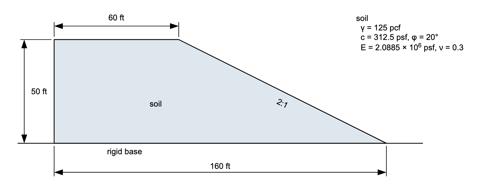{width=1000}

The embankment stands **50 ft** high on a rigid base at elevation 0, with a
60 ft crest platform and a **2:1** face running down to a toe at x = 160. It is
one soil throughout, Mohr-Coulomb, with the unit weight, cohesion and friction
angle shown above. There is no water in the model and nothing on the crest, so
the only load is the soil's own weight.

E and ν are on the sketch because the finished model carries them, but they are
not in the starter file and the limit equilibrium run below does not want them.
They are added
[further down](#youngs-modulus-and-poissons-ratio), at the point where the
finite element run refuses to start without them.

The section, the soil and the answer are
[Griffiths & Lane's (1999) Example 1](../verification/ssrm.md#verification-griffiths1),
so both runs on this page have a published number to be checked against.

---

## Opening the starter file

Download [xslope_ssrm_embankment_start.xlsx](files/xslope_ssrm_embankment_start.xlsx)
and open it with **File → Open…**. The toolbar's mode strip reads
LEM | Seepage | FEM, and it opens on **LEM**, which is where the first run
happens.

Its global parameters are already set: **Units** `imperial`, so lengths read in
feet, unit weights in pcf, and stresses, strengths and stiffnesses in psf.
[SEEP-1](seep01_sheetpile.md#1-global-parameters) covers those fields.

The Inputs plot shows what the file carries:

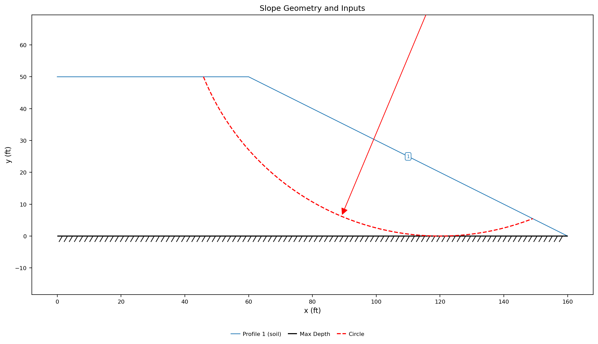{width=1000}

One profile line for the single soil, the hatched maximum-depth line at
elevation 0 standing for the rigid base, and one starting circle as a red dashed
arc with its radius arrow — centered at (120, 80) with a radius of 80 ft, a
base-tangent circle that touches the rigid base and leaves the face about 11 ft
short of the toe, roughly where a slope of this shape is expected to fail.
[LEM-1](lem01_simple_embankment.md) is where starting circles and what a search
does with them are worked through.

---

## The limit equilibrium answer

Click **Run → Run LEM…**

The dialog opens on **Spencer**, **Auto search** and 40 slices, which is what
this run wants, so there is nothing to change. Spencer is the method to compare
against later because it satisfies both force and moment equilibrium, which
makes it the closest limit equilibrium statement of what a finite element run
solves.

Note the **Model checks** column: **No problems found for this run.** The file
has no Young's modulus and no Poisson's ratio, and limit equilibrium does not
care. Strength, geometry and weight are the whole of what it reads. Click
**Run**.

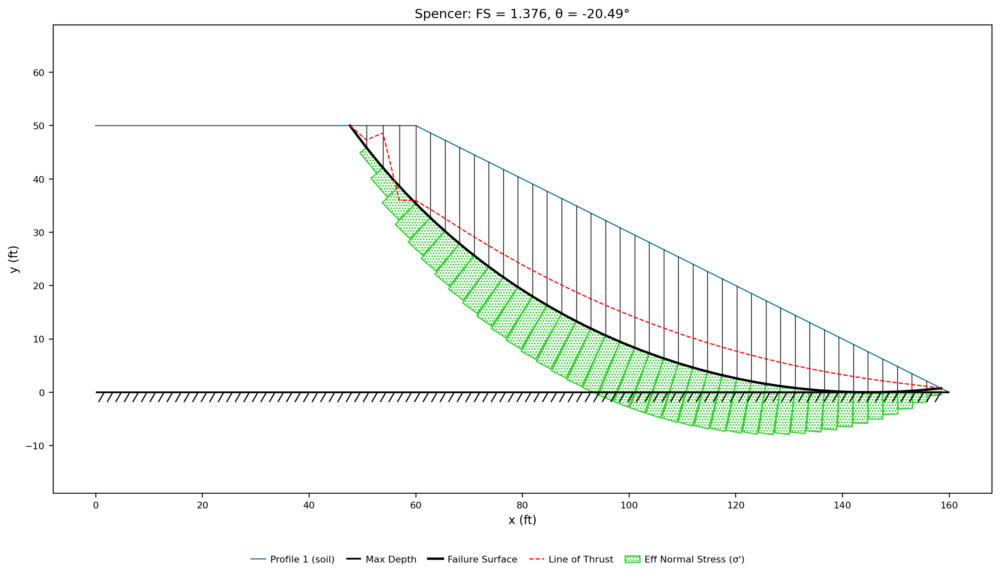{width=1000}

**Spencer's method gives FS = 1.376** on a toe circle centered at (144.94,
119.60) with a radius of 119.60 ft, entering the crest at x = 47.7 and leaving
at x = 158.5, just short of the toe. The search evaluated 77 candidate circles
and took about three seconds. Bishop's simplified method (1.378) and
Morgenstern-Price (1.375) settle on the **same circle**, within a quarter of a
percent of Spencer — one mechanism, found three ways.

That number is the target. Everything below is a second, independent route to
it.

---

## Building the mesh

Switch the mode strip to **FEM**. The Run menu changes with it: **Build Mesh…**
appears in the seepage and finite element modes, and the Run item becomes **Run
FEM…** in this one. It stays disabled until a mesh exists — *"Build a mesh first
(Build Mesh…)."*

Click **Run → Build Mesh…**

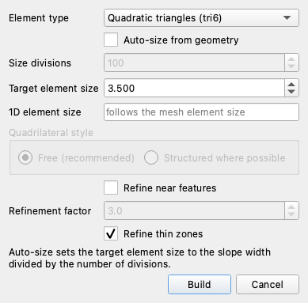

Set **Element type** to **Quadratic triangles (tri6)**. On a seepage run element
order trades accuracy against cost; on a stability run it is not a trade.
Linear elements cannot represent the constant-volume shearing a Mohr-Coulomb
mechanism develops, so they **lock**, carrying load they should not and
reporting a factor of safety that is too high. Measured on this embankment, tri3
reads **+21%** high and quad4 **+11%**, while tri6, quad8 and quad9 all land
within 1% of the reference —
[element type and volumetric locking](../fem/overview.md#element-type-selection-and-volumetric-locking)
carries the comparison. XSLOPE defaults to tri6 and prints a boxed warning if a
run starts on a linear mesh anyway.

Untick **Auto-size from geometry**, which enables the **Target element size**
box below it, and set that box to `3.5` — the size the verification page's own
element-type comparison meshes this model at. Auto-sizing instead divides the
section width by the size divisions, 160 ft over 100, for a 1.6 ft element, and
the mesh that follows carries 10,313 nodes against 2,286 at 3.5 ft. The *F* = 1
trial on it takes **7.0 s against 0.7 s**, and every trial in the run pays that
multiple, for detail this mechanism does not need. Leave the rest of the dialog
alone and click **Build**.

The mesh comes out at **2,286 nodes and 1,087 triangles**:

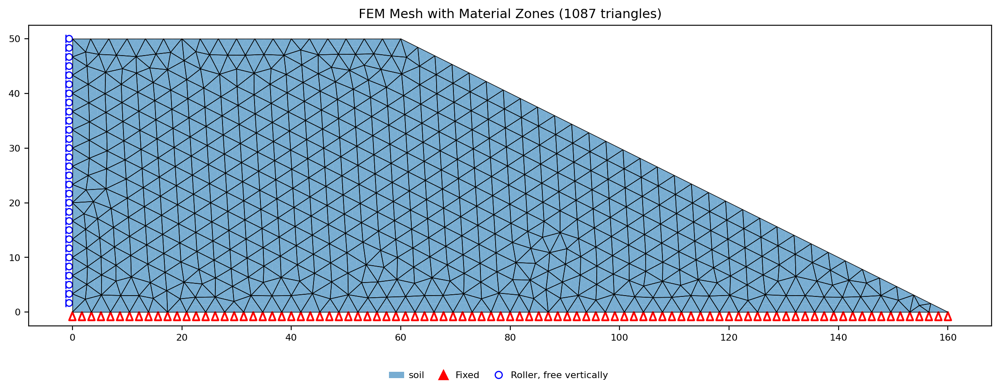{width=1000}

The red triangles along the whole base are **fixed** nodes, clamped in both
directions — that is the rigid base the maximum-depth line stood for, and it is
assigned automatically to the boundary that is neither ground surface nor side
edge. The blue circles up the left face are **rollers**: horizontally fixed,
free to move up and down, so the truncated ground can still settle under its own
weight.

There are rollers on the left side only. The right-hand end of this domain is
the toe point at (160, 0), which is already a base node — the section runs out
to nothing rather than being cut off, so there is no right-hand edge to hold.
Which of the two conditions the sides take is a choice, made on the Run FEM
dialog rather than here: **Rollers (vertical movement free)** is the default and
what every file that declares nothing gets, and **Fixed (both components
clamped)** clamps them instead, which is what RS2 does on its side boundaries.
On this model the choice is inert — both settings return the same factor of
safety on the same bracket, trial for trial — because the mechanism is nowhere
near the left boundary and the extra restraint has nothing to bite on. On a
domain truncated close to the slope it would not be inert, and fixing the sides
adds shear restraint the real ground does not have.
[What XSLOPE assigns automatically](../fem/overview.md#what-xslope-assigns-automatically)
states the rules the mesh was marked up by.

---

## Young's modulus and Poisson's ratio

The mesh exists, so **Run → Run FEM…** is available. Click it.

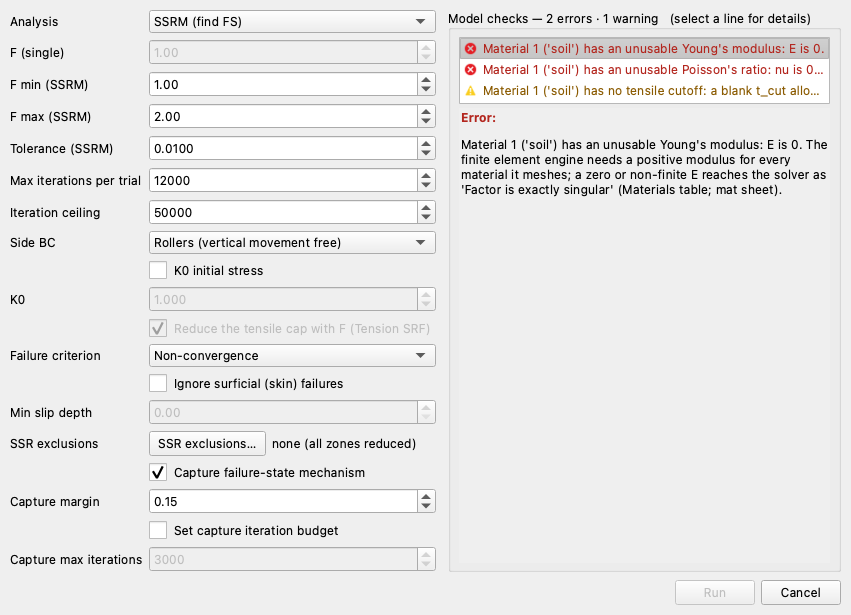

**Model checks — 2 errors · 1 warning**, and the **Run** button is disabled. The
two errors name the missing elastic properties: the finite element engine needs
a positive Young's modulus for every material it meshes, and a Poisson's ratio
of zero is not a soil. This is the difference between the two analyses: the same
file that limit equilibrium called clean is one the finite element side will not
start on. A limit equilibrium method balances forces on a body it has already
decided the shape of. A finite element method has to compute the displacement
field first and get the stresses from it, and there is no displacement field
without a stiffness.

Click **Cancel**, then **Materials** in the Inputs dock. On **Table view**, set
the **Show parameters for:** toggles to **FEM** alone.

Both elastic columns read **`0`**. Nothing was typed there — the cells are
blank, and a blank numeric cell loads as zero, which is what the run gate
reported back. Enter the two values, in the columns headed `E (psf)` and `n`
(the Poisson's ratio column is labeled with a plain `n`):

| E (psf) | n |
|---:|---:|
| 2088500 | 0.3 |

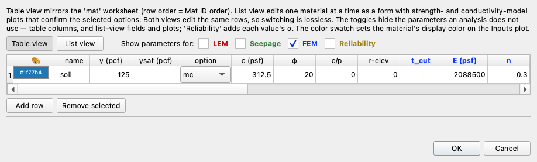

The FEM toggle shows the unit weight and strength parameters the finite element
run reads alongside `t_cut`, `E` and `n`. `γsat` and `t_cut` stay blank. Click
**OK** and save the model with **File → Save As…** under a name of your own.

### Where E comes from, and what it changes

E = 2,088,500 psf is Griffiths and Lane's own nominal value, 1 × 105
kPa converted, and the paper says outright that it picked it — and ν = 0.3 with
it — because the problem gave it nothing better: *"in the absence of meaningful
data for E′ and ν′, they can be given nominal values, e.g. E′ = 105
kN/m2 and ν′ = 0.3."* Neither is a measurement of this soil and
neither comes from a soil classification. When a real problem gives you nothing
better either,
[typical elastic parameters](../fem/overview.md#typical-elastic-parameters)
tabulates ranges by soil type in both kPa and psf.

What a nominal stiffness costs, on this model and for the factor of safety, is
nothing at all. The same mesh and the same bracket, all three at the default
iteration budget, run at a tenth of the file's modulus, at it, and at ten times
it:

| E (psf) | vs. the file | SSRM FS | Largest displacement at *F* = 1 (ft) |
|:---:|:---:|:---:|:---:|
| 208,850 | ×0.1 | 1.3477 | 0.5699 |
| 2,088,500 | ×1 | 1.3477 | 0.05699 |
| 20,885,000 | ×10 | 1.3477 | 0.005699 |

**The factor of safety is identical to every printed digit across a hundredfold
sweep**, and so is the bracket it came from — and the first trial took the same
56 iterations at all three moduli. **The displacements scale exactly as 1/E**:
ten times the stiffness, a tenth of the movement, to four decimals, in every
field the run reports.

That is the whole of what E does here. It sets the scale of the deformation
picture and it has no vote in the stability answer, because the answer turns on
whether an equilibrium state exists, not on how far the slope had to move to
reach it. A rough E is therefore fine when a factor of safety is what you want.
A real one starts to matter the moment a displacement is read as a prediction of
ground movement.

ν is not in the same category. Setting it to 0 — the value a blank cell loads
as — moved the reference model's factor of safety by a third, which is why the
run gate raises it as an error rather than a warning. 0.3 is the paper's nominal
value too, but unlike E it is not inert, so a real problem is worth a real one.

---

## Running the strength reduction

Click **Run → Run FEM…** again.

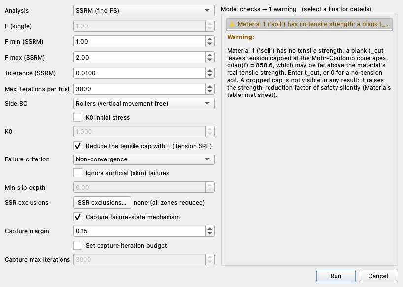

**Model checks — 1 warning**, and **Run** is enabled. The warning is about
`t_cut`, the tensile cutoff left blank on the materials table, and it is
expected here. A Mohr-Coulomb envelope extended into the tensile quadrant closes
at an apex of *c*/tan φ, which for this soil is 312.5 / tan 20° = **858.6 psf**,
and with no cutoff entered that is the tensile strength the material implicitly
carries. Griffiths and Lane's example has no cutoff and this model transcribes
it, so the run proceeds as posed. On a real soil, and especially where a
mechanism has to open a tension crack at the crest to develop, that implicit
capacity acts like a member holding the crack shut and raises the factor of
safety silently — enter a `t_cut` on the materials table, or `0` for a
no-tension soil.
[Tensile strength in the SSRM](../fem/overview.md#tensile-strength-in-ssrm)
is where the cap and its effects are worked through. The **Reduce the tensile
cap with F (Tension SRF)** checkbox above is on, and on this model it has
nothing to act on: with no cap entered there is nothing to reduce. Turned off,
it holds each authored cap fixed through the bisection instead of reducing it
along with the strength — so the choice only starts to matter once a real cap is
entered.

The rest of the dialog opens on the defaults this run wants. **Analysis** is
**SSRM (find FS)**. **F min** and **F max** are 1.00 and 2.00, the ends of the
bracket to search. **Tolerance** is 0.0100 and **Max iterations per trial** is
3000, both of which the next section is about. **Failure criterion** is
**Non-convergence** — the plain reading, that a trial which cannot reach
equilibrium has failed. The list offers three others, among them **Hybrid**,
which weighs displacement evidence alongside the convergence verdict; on this
model the two agree on every trial, including the marginal one, and return the
same factor of safety.
[SSRM failure criteria](../fem/overview.md#ssrm-failure-criteria) compares all
four. **K0 initial stress** is off, so the model is brought to its initial state
by turning gravity on rather than by an at-rest stress ratio.

Leave everything as it stands and click **Run**.

### How the search finds the answer

It is not a scan across a range of *F*, and it is not quite a plain bisection
either. It is **two checks and then a bisection**. Before halving anything, the search
has to know that the bracket it was given actually contains the transition, so
it solves at both ends: *F* min has to converge, and *F* max has to fail. (If
either check comes back the wrong way the search widens that end and tries
again, so a bracket that misses is repaired rather than fatal.) With the bracket
validated, every step after that solves the midpoint, and the verdict moves one
end in: a converged trial raises the lower end, a failed trial lowers the upper
one.

That is what the Log reports, trial by trial:

| Trial | *F* | Verdict | Iterations | Bracket after it |
|---|:---:|:---:|:---:|:---:|
| lower bound | 1.0000 | converged | 56 | — |
| upper bound | 2.0000 | failed | 1,503 | [1.0000, 2.0000] |
| 1 | 1.5000 | failed | 1,504 | [1.0000, 1.5000] |
| 2 | 1.2500 | converged | 124 | [1.2500, 1.5000] |
| 3 | 1.3750 | failed | 3,000 | [1.2500, 1.3750] |
| 4 | 1.3125 | converged | 490 | [1.3125, 1.3750] |
| 5 | 1.3438 | converged | 2,790 | [1.3438, 1.3750] |
| 6 | 1.3594 | failed | 3,000 | [1.3438, 1.3594] |
| 7 | 1.3516 | failed | 3,000 | [1.3438, 1.3516] |

**FS = 1.3477**, the midpoint of the final bracket [1.3438, 1.3516], reached in
nine solves and about 25 seconds. Seven bisection steps is not luck: each one
halves the bracket, so from a starting width of 1.0 it takes seven halvings to
get under the 0.01 tolerance, and seven is what it took.

**The iteration column is where the physics is.** Trials well below the critical
factor settle almost immediately — 56 iterations at *F* = 1.00, 124 at 1.25.
Nearer the transition the slope has to redistribute stress through more and more
yielded soil before it can balance, and the count climbs steeply: 490 at 1.3125,
and **2,790** at 1.3438, the highest trial that made it. Past the transition the
count stops meaning anything, because there is nothing to converge to — those
trials run until the iteration ceiling stops them. Read down that column and the
method's definition of failure stops being an abstraction: the slope does not
snap at some *F*, it takes longer and longer to find equilibrium until there is
no equilibrium to find.

---

## The two convergence controls

Two fields on that dialog decide how hard the search works, and they are easy to
mix up, because both look like knobs for how carefully the run works. They are
not the same kind of thing.

### Tolerance is the width of the bracket

**Tolerance (SSRM)** is the stopping width of the bisection: how narrow
[*F* min, *F* max] has to get before the search quits and reports the midpoint.
It is not a solver convergence tolerance — the per-trial displacement and force
tests live in the engine and are not on this dialog. Tightening it buys
resolution on the answer and costs one more trial per halving:

| Tolerance | FS | Final bracket | Trials | Wall time |
|:---:|:---:|:---:|:---:|:---:|
| 0.05 | 1.3594 | [1.3438, 1.3750] | 7 | 17 s |
| 0.01 (default) | 1.3477 | [1.3438, 1.3516] | 9 | 25 s |
| 0.005 | 1.3457 | [1.3438, 1.3477] | 10 | 28 s |

All three brackets share the same lower edge, **1.3438** — the highest trial
that reached equilibrium in any of them. Tightening the tolerance only walks the
upper edge down toward it, which is why the answer moves less at each halving
than it did at the one before. The default is a sensible place to leave it.

### Max iterations per trial decides which trials are allowed to finish

**Max iterations per trial** is the viscoplastic iteration ceiling for each
trial *F*. A trial that has not reached equilibrium by then is recorded as
failed — and on a model whose near-critical trials creep for thousands of
iterations, that is a decision about the answer, not just about the run time.
The walk above shows the symptom already: three of its nine trials ended at
exactly 3,000.

Raise the field and re-run to see what those three were doing:

| Max iterations per trial | FS | Final bracket | Wall time |
|:---:|:---:|:---:|:---:|
| 3000 (default) | 1.3477 | [1.3438, 1.3516] | 25 s |
| 6000 | 1.3555 | [1.3516, 1.3594] | 38 s |
| 12000 | 1.3633 | [1.3594, 1.3672] | 70 s |
| 24000 | 1.3633 | [1.3594, 1.3672] | 117 s |

At 6,000 the trial at *F* = 1.3516 turns out to reach equilibrium after
**4,637** iterations — it was never failing, it was still working. At 12,000 the
trial at 1.3594 does the same at **11,904**. And then it stops: 24,000 returns
the identical bracket, so there is no further trial waiting to be rescued. The
answer has **plateaued at 1.363**, and the default budget was reading about
0.015 low, entirely because near-critical trials were cut off rather than
because of anything physical.

That gives a rule worth carrying to every model, not just this one: **raise the
budget until the answer stops moving.** A factor of safety that climbs when you
give the trials more room is a factor of safety that has not converged yet; one
that stays put through a doubling has.

**Set Max iterations per trial to `12000` and run again.** That run — 70
seconds, the same seven bisection steps — returns **FS = 1.363**.

---

## The two answers side by side

| Reading | FS |
|---|:---:|
| Spencer's method, searched on this page | 1.376 |
| Strength reduction, this page's run at a 12,000-iteration budget | 1.363 |
| Strength reduction, as [the FEM overview reports it](../fem/overview.md#what-to-expect) for this model | 1.366 |
| Griffiths & Lane's own finite element result | 1.4 |

The strength reduction answer sits **0.2% below** the documented value for this
model and **about 1% below** Spencer's — two methods that share almost none of
their machinery, within a percent of each other.

They agree because they are answering the same question about the same soil.
Both define the factor of safety as the ratio by which the available strength
exceeds what is needed for equilibrium, and on a homogeneous slope with a single
clean rotational mechanism there is not much room for them to disagree: the
finite element run finds the same band of soil that Spencer's critical circle
traces, so the two are weighing nearly the same material. Where they part
company is what each one is willing to assume. Spencer imposes a circular
surface, divides the mass above it into slices and needs an assumption about the
forces between them to close the equations. Strength reduction imposes nothing —
no surface, no slices, no interslice assumption — but in exchange it needs a
mesh, a stiffness and an iteration budget, each of which is a modeling decision
of its own, as the element type and the budget sweep above both measured. On a
slope like this one the limit equilibrium assumptions cost almost nothing, which
is why the numbers agree. On a slope with a weak seam, a wall, or a mechanism
that is not a circle, they cost more, and that is where a run like this one
earns the extra minute it takes.

---

## Reading the failed state

The run leaves its results on the **FEM · Results** tab. Its **Plot type**
selector offers three panels, one at a time, and the **Field state** switch
beside it applies to all three at once, so a figure never mixes states. It opens
on **At failure**.

### Viscoplastic shear strain

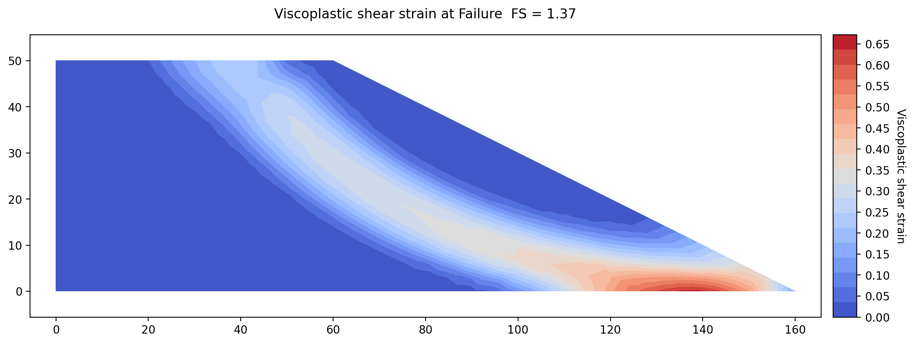{width=1000}

This is the panel to read first, because it is the one that shows where the
slope failed. The contours are the viscoplastic shear strain — the shearing
that is left after the elastic response is subtracted — and the band they draw
is the failure mechanism. It runs from the crest at about x = 50, down through
the body of the slope, to a hot spot at the toe between x = 120 and x = 150,
where the strain reaches 0.646.

Nothing about that shape was entered. There was no circle and no surface in this
run; the band is where the soil chose to shear, and it emerges in the same place
Spencer's search put its critical circle — leaving the crest near x = 50 and
running out along the toe. That is the same agreement the factor of safety
showed, drawn instead of tabulated. On a layered slope, or one with a
weak seam, this is the panel that shows a mechanism a circular search would
never have found.

### Deformed mesh

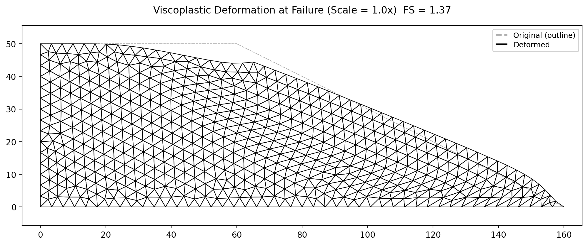{width=1000}

The deformed panel draws the mesh at its displaced position over a dashed
outline of where it started: the crest settled, the face bulged out, and the toe
pushed forward, which together are the rotation the vectors below make explicit.

Two boxes on the Display panel control the exaggeration, which most fields need
because at true scale their movement would be invisible. **Scale ×** is the
multiplier itself — the number the plot prints in its own title — and its
default reads **Auto**. On Auto, the multiplier is whatever draws the field's
largest displacement at the **Auto size** percentage of the mesh height,
default 15: here 15% of 50 ft is 7.5 ft, the largest viscoplastic displacement
is 7.64 ft, and Auto lands on **1.0×** — this collapse has developed far enough
to draw at true scale. Type a number into **Scale ×** to pin the exaggeration
instead, which is worth doing when two figures have to be compared at one
setting; Auto size dims while an explicit value holds. The box's spin arrows
redraw the view at every step, and that turns the control into something better
than a setting: start at Auto and hold the up arrow, and the mesh deforms a
step at a time — the crest dropping and the toe bulging in what amounts to an
animation of the slope failing. The reason Auto exists is on display in the
next section — the same 15% asks for 131× on the converged state, because the
two states differ by more than a hundredfold in how far the slope moved.

### Displacement vectors

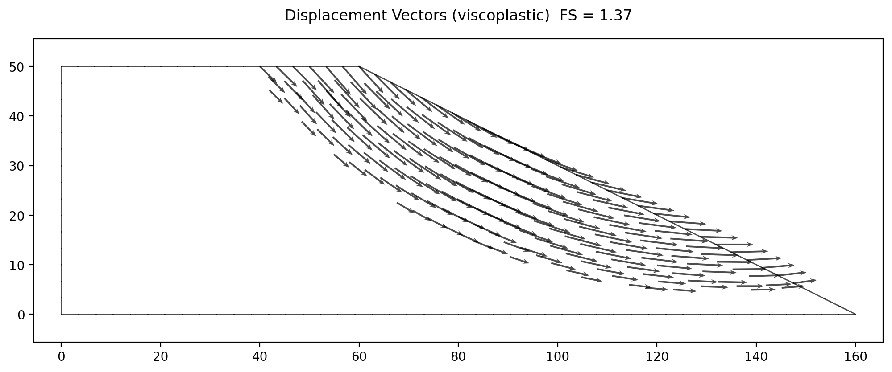{width=1000}

The vectors are the direction the same field moved in, drawn at the corner
nodes, with arrows below half the maximum hidden so the figure stays readable.
They point down and outward at about 45° at the crest, swing through the body of
the slope, and come out nearly horizontal at the toe. That is a rotational collapse
and nothing else — soil dropping at the back, moving out at the front, turning
about a center somewhere above the face. What makes it read that cleanly is that
the field drawn is the viscoplastic part, total displacement minus the elastic
response, so what is left is the mechanism rather than the settlement the slope
had under its own weight before anything yielded.

### What failure actually looked like

The run kept two fields, and putting them side by side is where the method's
definition of failure becomes concrete. Switch **Field state** to **Last
converged** to see the other one. The panel that comes up is as fully colored as
the one before it, because Studio scales each field state to its own range. The
number to read is the color bar beside it: it tops out around **0.008** instead
of 0.646, about eighty times smaller. That range, not the colors, is what says
the converged state has barely moved.

| | Last converged trial | Captured failed state |
|---|:---:|:---:|
| *F* | 1.3594 | 1.5678 |
| Equilibrium reached | yes | no |
| Viscoplastic iterations | 11,904 | 12,000 — the ceiling |
| Elements that have yielded, of 1,087 | 210 | 609 |
| Largest displacement (ft) | 0.106 | 7.646 |
| Relative to the elastic response | 1.9× | 134.8× |

An element counts as yielded once it has accumulated permanent strain — shearing
that stays in the soil rather than springing back when the stress is relieved.

At *F* = 1.3594 the slope is not intact — 210 elements have yielded and the
crest has moved 0.106 ft, about 1.9 times its own elastic response — but it
**stops**. The stresses redistribute onto soil that has strength left, the
iteration settles, and there is an equilibrium state to report. At *F* = 1.57
there is none: 609 elements yield, the movement passes a hundred and thirty
times the elastic response, and it is still growing when the iteration budget
runs out. Nothing broke in the model. It simply never stopped moving, and that
is the whole of what the method means by failure.

That second field is captured deliberately. Right at the critical factor the
collapse develops too slowly to draw, so once the bracket resolves the run
re-solves once at FS × 1.15 — the **Capture margin** on the dialog, 1.3633 ×
1.15 = 1.57 — with the displacement cap and the early exit off, purely to
develop the mechanism the figures show. The factor of safety, the bracket and
the converged field are unaffected either way.

The figure below is the converged state at *F* = 1.3594, drawn the way Studio
draws it, on its own range:

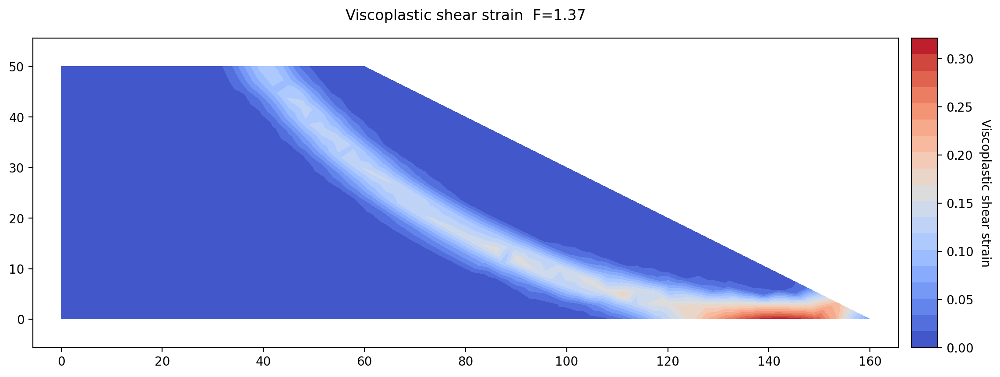{width=1000}

The band is already there. The strain concentrates along the same crest-to-toe
path the failed state develops, hot spot at the base near the toe and all — but
the color bar tops out near 0.008 where the failed state's reached 0.646.
Below the critical factor the embankment strains along the eventual surface and
stops; past it, the same band runs away eightyfold. The transition the
bisection spent nine solves locating is the transition between these two
pictures.

---

## Conclusion

This tutorial covered:

- Strength reduction as a search over *F* rather than over surfaces: *c*/*F* and
  tan φ/*F* at every trial, and the factor of safety as the largest *F* the
  slope still finds equilibrium at.
- The two elastic properties a mesh needs, where a nominal E comes from, and the
  measurement that E fixes the scale of every displacement while changing the
  factor of safety not at all.
- Quadratic elements as a requirement rather than a preference, a target element
  size chosen against what the mechanism needs, and the base and side conditions
  the mesh is held by.
- The bracket the search validates and bisects, and the iteration count climbing
  from 56 to 2,790 as the trials approach the critical factor.
- Two controls that look alike and are not: the tolerance that sets the
  bracket's stopping width, and the per-trial iteration budget that decides
  which trials are allowed to finish — raised until the answer plateaued at
  1.363.
- Reading the mechanism out of shear strain, a deformed mesh and displacement
  vectors, and the converged state against the failed one on a single color
  scale.

**Where to go next:** the [tutorials index](index.md) lists the series.
[Finite Element Analysis](../fem/overview.md) carries the formulation, the
viscoplastic iteration, the four failure criteria, K0 initial stress, exclusion
zones and the rest of the plot types;
[the SSRM benchmarks](../verification/ssrm.md#verification-griffiths1) run this
embankment and five more Griffiths & Lane problems against their published
answers. [LEM-1](lem01_simple_embankment.md) is the same kind of slope solved by
limit equilibrium from nothing, and
[SEEP-1](seep01_sheetpile.md#building-the-mesh) works through mesh generation and
element order on a problem where that choice is a trade rather than a
requirement. [FEM-2](fem02_reinforcement.md) takes the method to a reinforced
slope, where the bars carry a stiffness of their own and the two engines'
answers begin to diverge, for reasons FEM-2 measures.
