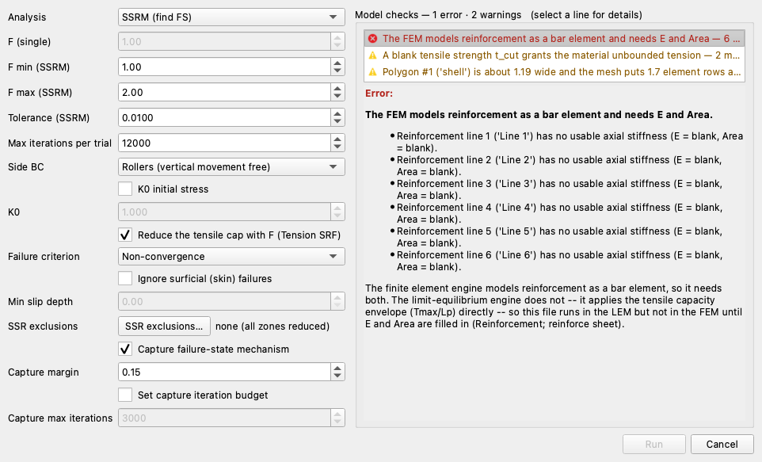

# Tutorial FEM-2 — Reinforcement: LEM vs FEM

This tutorial shows how a finite element analysis models soil reinforcement and
how its answer differs from the limit equilibrium answer for the same slope.
Both engines read the same reinforcement lines out of the same file, and they do
different things with them. A limit equilibrium method has no strain in it:
wherever a trial surface crosses a line it adds the tensile force that line can
develop at the crossing point, and the rest of the line does not enter the
calculation. A finite element method meshes each line into a row of bar elements
sharing nodes with the soil around them, and the force in every one of those
elements comes out of how far the soil beside it has moved.

The example is the geogrid-reinforced sand fill from
[LEM-8](lem08_reinforced_slope.md) — six layers of geogrid in a 24 ft fill under
a crest surcharge — and it is solved three times. Spencer's method gives the
reference answer. Then the same model is meshed and run by **strength
reduction** twice: once with the bars elastic-perfectly-plastic, which is what
every mainstream finite element code assumes unless told otherwise, and once
with a residual capacity that takes effect after the bar ruptures.

[LEM-8](lem08_reinforced_slope.md) built this model and covers reinforcement
lines, the capacity envelope and pullout lengths, and
[FEM-1](fem01_strength_reduction.md) covers strength reduction, meshing for a
stability run and the controls that decide whether a trial is allowed to finish.
This page does not repeat either. It starts from a **starter file** that carries
the whole LEM-8 model plus the soils' elastic properties, so the only inputs
added here are the three columns the finite element engine needs on a
reinforcement line.

Analysis
Finite element (strength reduction)

Build &amp; explore
~30 min

**Objectives** — Learn how reinforcement enters a finite element stability
analysis: the two limits a reinforcement model carries, the axial stiffness the
run needs, how to read what each layer is doing at the factor of safety, and how
much the post-peak assumption is worth.

two materialsreinforcement linescapacity envelopepullout lengthbar elementsaxial stiffnesselastic-perfectly-plasticresidual capacitystrength reductionquadratic trianglesthin zonesiteration budget1D detailsshear strain

**Starter file** — [xslope_reinforced_slope_start.xlsx](files/xslope_reinforced_slope_start.xlsx),
the LEM-8 model with Young's modulus and Poisson's ratio already on both soils,
and with `Tres`, `E (psf)` and `Area` blank on all six reinforcement lines; this
is the file the page starts from

**Completed model** — [xslope_reinforced_slope.xlsx](files/xslope_reinforced_slope.xlsx),
the same model with the three reinforcement columns filled in and the element
type and target size declared; open it to skip to
[the runs](#the-iteration-budget). Neither file carries a mesh, so the meshing
step below is done on either one

---

## The problem

{width=1000}

The fill stands **24 ft** high at **1.25:1** on a foundation that runs 10 ft
below the toe, with a **240 psf** surcharge over the 70 ft of crest behind it.
Two Mohr-Coulomb soils at the same unit weight: the fill itself is clean sand
with no cohesion at all, and the face is wrapped in a band of cohesive fill —
the `shell` — 2 ft measured horizontally, which on a 1.25:1 face is 1.25 ft
perpendicular to it; its 300 psf of cohesion keeps the search off the face. Six geogrid layers, each **20 ft** long and 4 ft apart vertically, start at
the face. Each develops **800 lb/ft** of tension over a pullout length
of **4 ft** at either end.

The soils' elastic properties, E = 1.0 × 106 psf and ν = 0.3, are
already in the starter file. The sketch also shows the geogrid's axial
stiffness, *EA* = 80,000 lb/ft, and its residual capacity, 600 lb/ft. Neither is
in the starter file; both are entered on this page when the finite element run
calls for them. The geometry, the soils and the reinforcement are Example 5 from
the UTEXASED user manual, and [LEM-8](lem08_reinforced_slope.md) builds all of
it from nothing.

---

## Opening the starter file

Download [xslope_reinforced_slope_start.xlsx](files/xslope_reinforced_slope_start.xlsx)
and open it with **File → Open…**. The toolbar's mode strip opens on **LEM**,
which is where the first run happens. Units are `imperial`, so lengths read in
feet, unit weights in pcf, and stresses, strengths and stiffnesses in psf.

{width=1000}

The Inputs plot shows the face band and the fill as two profile lines, the
hatched maximum-depth line at elevation −10, the crest surcharge as purple
arrows, and the six reinforcement lines as gray bars stepping up the face. Each
bar carries two red **tension points**, 4 ft in from either end — the points
where its capacity envelope first reaches the full 800 lb/ft. The two dashed red
arcs are the starting circles the search begins from.

---

## The limit equilibrium answer

The limit equilibrium run comes first because it gives the reference the two
finite element runs are read against, and because the starter file is already
complete for it.

Click **Run → Run LEM…**, choose **Method** = `Spencer` and **Analysis** =
`Auto search`, and leave the slice count at 40. The **Model checks** column
reads *No problems found for this run* — the three reinforcement columns the
next section is about are empty, and limit equilibrium does not read them.
Spencer is the method to compare against because it satisfies both force and
moment equilibrium, which makes it the closest limit equilibrium statement of
what a finite element run solves. Click **Run**.

{width=1000}

**Spencer's method gives FS = 1.587**, on a circle centered at (−5.13, 46.98)
with a radius of 47.26 ft. The surface daylights at the toe, cuts up through the
reinforced block and comes out on the crest at **x = 36.2**, behind the last
geogrid. It crosses five of the six layers and takes 800 lb/ft from each of
them, for 4,000 lb/ft of tension in total.
[LEM-8](lem08_reinforced_slope.md#where-the-surface-meets-the-lines) works
through that crossing-by-crossing.

---

## What a reinforcement line is to each engine

A reinforcement element carries **two separate limits**, and that two-limit
structure is the standard idealization the mainstream finite element codes
share: PLAXIS, RS2 and FLAC all model reinforcement as a bond limit, perfectly
plastic once it slips, plus a rupture limit for the reinforcement itself with an
optional residual after it. XSLOPE's rupture limit is the same one — a blank
`Tres` gives exactly what a PLAXIS geogrid does, elastoplastic with a maximum
axial force. The bond limit is where the default differs. Those codes derive
bond from a stress-dependent interface, so the length a bar needs to develop its
full capacity changes along the line; XSLOPE's default instead reads a
development length declared on the input, and its optional
[bond-slip model](../fem/reinforcement.md#bond-slip-load-transfer-optional) is
that stress-dependent form. Keeping the two limits apart is what makes the
finite element results below readable.

**Bond** is the first limit. A geogrid is held by friction against the soil it
is buried in, and near a free end there is not much soil to be held by, so the
force the line can carry there is limited by its embedment rather than by its
own strength. That is what the pullout length `Lp` describes: over the first
4 ft from each end the available force ramps from zero up to the full 800 lb/ft,
and past 4 ft the embedment can develop the whole capacity. The ramp and the
plateau together are the **capacity envelope**. Bond is **perfectly plastic**:
when the force reaches what the embedment can develop, the line slips there and
goes on carrying that force. Interface friction does not disappear once it has
been overcome, so nothing drops to zero.

**Rupture** is the second limit, and it is a property of the material rather
than of the burial. `Tmax`, 800 lb/ft here, is the tensile capacity of the
geogrid itself. What happens after it is reached is the `Tres` column: leave it
blank and the line holds its capacity indefinitely while the soil around it goes
on straining, which is the **elastic-perfectly-plastic** model and the industry
default; enter a number and a ruptured element drops to that residual; enter
zero and it ruptures brittly and carries nothing afterwards. The editor's own
tooltip on the column says the same thing — *"blank = elastic-perfectly-plastic
(holds capacity), 0 = brittle rupture (carries nothing)"*. This page runs the
blank case first, because it is what a published reinforced-slope analysis
assumes unless it says otherwise.

{width=1000}

Both engines apply the same envelope. What differs is where they apply it.

The limit equilibrium engine evaluates the envelope at **one point** — where the
trial surface crosses the line — and applies that force to the sliding mass,
tangent to the surface for a flexible support like a geogrid. The force is
prescribed, not computed: nothing about the soil's stiffness, the bar's
stiffness or how far anything moved enters it. That is also why `Tres` has no
meaning in a limit equilibrium run: a post-peak drop depends on how far the
reinforcement has strained, and the method never computes a strain.

The finite element engine ties each line into the mesh as a row of tension-only
bar elements sharing nodes with the soil. The force in an element is *EA* times the
strain — the axial stiffness times how much it stretched per unit length —
capped by the envelope value at that element's own position along the line. The
bar therefore develops a force *profile*, low at the ends, high where the
mechanism crosses it, and the load that one element cannot carry is shed into
its neighbors through the soil. Two inputs
that a limit equilibrium run never asks for decide that profile: the elastic
modulus `E` and the cross-sectional area `Area` of the reinforcement, whose
product *EA* is its axial stiffness.

[Soil reinforcement in LEM](../lem/reinforcement.md) and
[soil reinforcement in FEM](../fem/reinforcement.md) carry the formulations,
the four end conditions of the envelope, and typical values by reinforcement
type.

---

## Building the mesh

The finite element engine cannot do any of that until the model is meshed, and
on a reinforced slope the mesh decides more than the usual accuracy question: it
fixes where each bar element sits along its line, and therefore what capacity
the envelope hands that element. Two of the Build Mesh dialog's defaults are
changed here for that reason.

Switch the mode strip to **FEM**. **Run → Run FEM…** stays disabled until a mesh
exists, so build one first. Click **Run → Build Mesh…**

Set **Element type** to **Quadratic triangles (tri6)**. A factor of safety needs
quadratic elements — linear ones lock and report a factor of safety that is too
high — and [FEM-1](fem01_strength_reduction.md#building-the-mesh) measures what
that costs on a slope of this kind.

Untick **Auto-size from geometry** and set **Target element size** to `2`. That
is the size the [FEM sample problem](../fem/samples.md) for this model uses, and
it puts ten elements on each 20 ft geogrid, which is enough to draw the force
profile along a bar. Auto-sizing would divide the 130 ft section width by 100
divisions for a 1.3 ft element instead, which is finer than this mechanism
needs: already at 1.5 ft the first trial alone takes 15.7 seconds against 6.2,
and every trial in the run pays that multiple.

Untick **Refine thin zones** as well. Checked — and it is checked by default —
the mesher guarantees about four element rows across every thin material zone,
because a band too thin to resolve cannot develop a shear band and quietly
returns a factor of safety that is too high. The thin zone here is the `shell`,
the cohesive band down the face, 1.25 ft across (the check reports about
1.2 ft, measured off the mesh). Refining it is not free on this
model: the mesh grows from 2,101 elements to 5,096, the run takes 533 seconds
instead of 103, and the answer of the second run below moves from 1.512 to
1.402 — 0.110 of factor of safety. The first run's answer moves 0.031 under the
same refinement, 1.535 to 1.504, less than a third as far, which says what is
moving. The refinement also puts more elements along the bars, and that changes
where each bar element sits inside the 4 ft pullout ramp and therefore what
residual it drops to — which only the run with post-peak behavior in it has. A
model with post-peak strength loss is mesh-sensitive by nature, as the
[FEM reinforcement page](../fem/reinforcement.md#force-behavior-and-failure-modes)
warns, so this page solves the same discretization the published sample uses.
Leave the rest of the dialog alone and click **Build**.

The mesh comes out at **4,364 nodes and 2,101 triangles**, with the six lines
discretized into **60 bar elements**, ten per line:

{width=1000}

The reinforcement lines are drawn in red because they are part of the mesh, not
an overlay on it: each line was carried into the mesh generator as a constraint,
so every bar element lies on an edge shared with the triangles on either side of
it and its end nodes are soil nodes. The shared node is what couples the two: soil
movement stretches the bar, and the bar's tension pulls back on the soil.

The `shell` shows as a one-element-wide blue veneer down the face, which is the
thin zone the dialog offered to refine. Red triangles along the base are fixed
nodes, blue circles up both ends are rollers, and the green arrows on the crest
are the 240 psf surcharge.

---

## The stiffness the bars need

The mesh exists, but the run will not start on it yet. Two of the three finite
element reinforcement columns are still blank, and this section fills them in.
It starts from the soils' elastic properties, because what a bar's stiffness
does depends on the stiffness of the soil it is buried in.

Both soils already carry an elastic modulus of 1,000,000 psf and a Poisson's
ratio of 0.3, entered as `E (psf)` and `n` on the materials table with the
**Show parameters for:** toggles set to **FEM**. A single round modulus was used
for both layers rather than values from a soil-type table, and
[what a stiffness does and does not change](#what-the-two-stiffnesses-change)
is measured further down, because on a reinforced model the answer is different
from the one FEM-1 reports.

With a mesh in place, **Run → Run FEM…** is available. Click it.

**Model checks — 1 error · 2 warnings**, and the **Run** button is disabled. The
error names all six lines and then explains itself:

> The finite element engine models reinforcement as a bar element, so it needs
> both. The limit-equilibrium engine does not -- it applies the tensile capacity
> envelope (Tmax/Lp) directly -- so this file runs in the LEM but not in the FEM
> until E and Area are filled in.

The same file ran in the limit equilibrium engine with nothing to report. The
three columns at the end of the reinforcement table are what the finite element
engine needs and the limit equilibrium engine does not. Click **Cancel**, then
**Reinforcement** in the Inputs dock, and set the **Show parameters for:**
toggles so both **LEM** and **FEM** are ticked — the three columns at the right
end, in blue, are the ones only the finite element engine reads.

The six lines are complete on everything both engines share: 800 lb/ft of
capacity, a 4 ft pullout length at each end, no end anchorage, and a `Spacing`
of 1 because geogrid properties are already per unit width. The three blue
columns are empty.

Fill `E (psf)` and `Area` on all six rows, and leave `Tres` empty:

| E (psf) | Area |
|---:|---:|
| 800000 | 0.1 |

An elastic modulus of 800,000 psf and an area of 0.1 ft² per foot of wall give
an axial stiffness *EA* = **80,000 lb/ft**, which is a typical uniaxial geogrid.
*EA* is what the run actually uses; the two columns are separate so that a
discrete support — a nail or a tieback — can carry a real modulus and a real
cross-section with its spacing dividing the area.
[Axial stiffness (EA)](../fem/reinforcement.md#axial-stiffness-ea) tabulates
values by reinforcement type.

Leaving `Tres` blank makes every line elastic-perfectly-plastic, which is the
first of the two runs. Click **OK** and save the model with **File → Save As…**
under a name of your own.

---

## The iteration budget

One control has to be changed before either run, and the comparison this page
draws does not exist without it.

**Max iterations per trial** is the viscoplastic iteration ceiling for each trial
reduction factor: a trial that has not reached equilibrium by then is recorded
as failed. [FEM-1](fem01_strength_reduction.md#max-iterations-per-trial-decides-which-trials-are-allowed-to-finish)
raises the budget on an unreinforced embankment until the answer stops moving.
On this model the same sweep does something sharper. At the default 3,000, the
elastic-perfectly-plastic run and the peak-residual run return **the same
number**:

| Max iterations per trial | Bars elastic-perfectly-plastic | Bars with a 600 lb/ft residual |
|:---:|:---:|:---:|
| 3000 (the default) | 1.3555 | 1.3555 |
| 12000 | 1.5352 | 1.5117 |
| 16000 | 1.5352 | 1.5117 |

At 3,000 the two runs are not merely close, they are the same run: the same nine
trials, the same iteration count on every one of them, and the same fields at
the end. Post-peak drops are only evaluated on a trial that reached equilibrium,
and at the default budget none of the converging trials has a bar over its cap,
so the residual column is never read.

**Set Max iterations per trial to `12000`.** At 16,000 both runs return the same
factor of safety from the same bracket with the same nine trials, so 12,000 is
where the answer has settled. Each run takes a little under two minutes.

---

## The elastic-perfectly-plastic run

The first of the two runs is the one that leaves `Tres` blank, which makes every
bar elastic-perfectly-plastic. It gives the finite element answer to compare
against Spencer's before any post-peak assumption is added on top of it. Click
**Run → Run FEM…** again.

**Model checks — 2 warnings**, and **Run** is enabled. Both warnings are
expected on this model. The first is the blank tensile cutoff `t_cut`, which
lets each soil carry tension up to its Mohr-Coulomb apex —
[FEM-1](fem01_strength_reduction.md#running-the-strength-reduction) works
through what that means and when to enter a cap. The second is the thin `shell`
zone, which is the refinement declined during meshing.

The rest of the dialog opens on the defaults this run wants: **SSRM (find FS)**,
a bracket of 1.00 to 2.00, a tolerance of 0.0100, **Rollers** on the sides, and
**Non-convergence** as the failure criterion — the plain reading, that a trial
which cannot reach equilibrium has failed. FEM-1 compares it against the three
other criteria the list offers. Click **Run**.

**FS = 1.535**, from a final bracket of [1.5312, 1.5391], in seven bisection
steps and about 105 seconds. Against Spencer's 1.587 that is **3.3% lower** —
two engines that share nothing but the input file, within a few percent of each
other.

### Viscoplastic shear strain

{width=1000}

The **FEM · Results** tab opens on **At failure**, which is the state the run
captures by re-solving once at 1.15 times the factor of safety so the collapse
develops far enough to draw. The contours are viscoplastic shear strain — the
shearing left after the elastic response is subtracted — and the band they draw
runs from the toe, up behind the reinforced block, and out onto the crest near
**x = 49**. Spencer's circle came out at x = 36.2. The two mechanisms start in
the same place and end about 13 ft apart: the finite element band passes
*behind* the reinforced block rather than cutting through the back of it,
because it was free to go wherever the soil was weakest and a circular search
was not.

The bars are drawn on the same figure, colored by their axial force against the
second color bar. Every one of them reads deep red — 800 lb/ft, the full
capacity — through its middle, with pale blue ends where the pullout ramp allows
less. At the captured failure state every line is fully mobilized: the geogrid
is carrying everything it has and the slope still cannot find equilibrium.

### Reading what each layer is doing

The state worth reading a bar in is the last one that reached equilibrium, not
the captured failure. Click **1D Details…** on the results toolbar and set
**Field state** to **Last converged**, which here is the trial at *F* = 1.5312.
The panel opens on **At failure**, where all six lines stand at 100% and read
alike; on the converged field they separate, and the comparison below is only
readable there.

Each row of the list names a line, gives its utilization, and says what state
the line is in. At that state the six lines are not all doing the same thing.
Line 1, the bottom layer at the toe, reads **near capacity** at 91%: its
hardest-worked element sits 1 ft in from the face carrying 182 of the 200 lb/ft
its embedment develops there, and nothing along the line has reached capacity.
Lines 3, 4 and 5 read **yielded** — an element away from the ends is at the full
800 lb/ft and holding it, which is the whole tensile strength of the geogrid
mobilized. Lines 2 and 6 read **pullout**: an element near an end has reached
the capacity its embedment can develop and is slipping at that force, while the
interior of the line is still below capacity. Pullout here is not a failure: the
end of a geogrid is slipping at the force its embedment can develop, which is
what the envelope says it should do.

Line 5 is one of the three that yield, and the most heavily loaded in the
second run, so it is the one to open:

{width=1000}

Position along the line runs from the face at s = 0 to the buried end at
s = 20 ft. The dashed line is the capacity envelope: it ramps from zero over the
first 4 ft, sits at 800 lb/ft along the middle of the line, and ramps back down
over the last 4 ft. The blue line is the force actually mobilized. It climbs
from almost nothing at the face, holds the envelope at s = 11 and 13, drops
below it at 15 and 17, and meets it again at the last element at s = 19 ft,
where the envelope itself is down to 200 lb/ft. The panel titles the line
**yielded** for the elements at s = 11 and 13: they stand out on the plateau,
away from either ramp, at the full 800 lb/ft. The element at s = 19 is at
capacity too, but at the 200 lb/ft its embedment develops — on its own that
element would have read **pullout**, and yielded is the more serious of the two.
The vertical orange line marks where the failure band crosses.

The lower strip is the bond transfer, dT/ds, the rate at which force passes
between the bar and the soil per foot of bar. It is positive from the face out to
the peak, where the soil is loading the bar, and negative beyond it, where the
bar is holding the soil back, crossing zero where the force is greatest. A limit
equilibrium run of the same model would have taken one number off the dashed
envelope at one crossing and stopped.

---

## The peak-residual run

The second run changes exactly one thing: what a bar does after it ruptures.
Open **Reinforcement** again and enter `600` in the `Tres` column on all six
rows, leaving everything else as it stands.

A residual of 600 lb/ft against a peak of 800 is a ratio of 0.75, a little above
the 0.3 to 0.7 usually quoted for geosynthetics. Click **OK**, then
**Run → Run FEM…** — check that **Max iterations per trial** still reads
12000 — and **Run**.

**FS = 1.512**, from a bracket of [1.5078, 1.5156]. Post-peak behavior cost
**0.023** of factor of safety, 1.5% — less than half the 0.052 between
Spencer's 1.587 and the elastic-perfectly-plastic 1.535, and about a fifth of
the 0.110 the thin-zone refinement declined during meshing would have moved this
same run.

Where it cost it is worth seeing, because the two runs agree for most of the
search:

| Trial | *F* | Elastic-perfectly-plastic | With a 600 lb/ft residual |
|:---:|:---:|:---:|:---:|
| lower bound | 1.0000 | converged | converged |
| upper bound | 2.0000 | failed | failed |
| 1 | 1.5000 | converged | converged |
| 2 | 1.7500 | failed | failed |
| 3 | 1.6250 | failed | failed |
| 4 | 1.5625 | failed | failed |
| 5 | 1.5312 | **converged** | **failed** |

The bisection walks the first six solves identically and splits at *F* = 1.5312,
where the elastic-perfectly-plastic slope finds equilibrium and the
peak-residual one never does. From there the two searches are bisecting
different intervals: the elastic-perfectly-plastic one tries 1.5469
and 1.5391, both of which fail, and closes on [1.5312, 1.5391]; the
peak-residual one tries 1.5156, which fails, then 1.5078, which converges, and
closes on [1.5078, 1.5156].

That single trial accounts for the entire difference between the two answers.
Inside it **five bar elements** — every one of them in the middle of a bar
rather than in a pullout ramp — reach the full 800 lb/ft, drop to 600, and shed
the balance into the soil around them. On this slope that is enough to turn a trial that
would have converged into one that does not.

### What changed in the results, and what did not

{width=1000}

The band is in the same place, at a slightly lower factor of safety, and the
bars are still red through the middle. Nothing in this figure has softened,
and neither has anything in the converged state: at both of the fields the run
keeps, every one of the six lines reports zero softened elements. The shedding
that decided the answer happened inside a trial that **failed**, and a failed
trial is not a field the run reports.

So the post-peak drop is not visible in either result field, and it still moved
the answer. The two fields the run keeps are the states on either side of the
transition; the shedding that moved the transition happened between them.

{width=1000}

The one visible change in the bar profile is the dotted purple line: the
residual capacity, which the panel now draws because there is one. It is not
flat at 600. It steps — 200 lb/ft over the outer 2 ft at each end, 600 lb/ft in
between — because a residual is capped by the bond the embedment can develop at
that point. An element near the end of a bar cannot hold 600 lb/ft after
rupturing when its embedment could only ever develop 200. The mobilized force
itself has barely moved from the elastic-perfectly-plastic profile, and there is
no rupture mark anywhere on the line.

At the last converged trial the verdicts have shifted. Line 1 still reads
**near capacity**, at 84% rather than 91%. Lines 3 and 4 have dropped out of
**yielded** and joined lines 2 and 6 at **pullout**, their end elements slipping
at the 200 lb/ft their embedment allows while their interiors sit under
capacity. Line 5 alone still reads **yielded**, its hardest-worked element
holding 798 of the 800 lb/ft available to it. The same panel, left on its
default **At failure** state, reads every line at 100%:

The list on the left carries all six lines with their utilization, a badge
colored by it, and the state each line is in; the map below it shows which line
is selected; and the profile is drawn on the right for the state the **Field
state** selector at the bottom names. It opens on **At failure**, which is why
every line here reads 100% and **yielded**, and why the title says *at failure*
— the state where the comparison between layers lives is **Last converged**.

### The failed state

{width=1000}

The deformed panel draws the mesh at its displaced position over a dashed
outline of where it started. The reinforced block has slid out over the toe and
settled at the crest, and the six bars — red where they started gray — are
stretched and rotated with it, hinging where the failure band crosses them. The
title's **Scale = 1.1x** is the exaggeration: the collapse has developed far
enough that it draws at very nearly true scale. **Scale ×** and **Auto size** on
the Display panel control that multiplier.

{width=1000}

The vectors give the direction the same field moved in. They point down and
outward at the crest, swing through the body of the slope, and come out nearly
horizontal at the toe, and they stop at the back of the reinforced block — the
soil beyond it is not part of the mechanism at this reduction factor.

---

## Why the two answers differ

The three runs are finished and no two of them agree. The disagreement has two
separate sources, and this section separates them: the post-peak assumption,
which the section above already measured, and the different ways the two engines
decide what force a reinforcement line carries.

Three readings of the same slope, from the same file:

| Reading | FS |
|---|:---:|
| Spencer's method, searched on this page | 1.587 |
| Strength reduction, bars elastic-perfectly-plastic | 1.535 |
| Strength reduction, bars with a 600 lb/ft residual | 1.512 |

The gap between Spencer and the peak-residual run is 0.075, and the section
above measured what post-peak behavior is worth: **0.023 of it**. The other
0.052 separates Spencer from the elastic-perfectly-plastic run, which is the
same physical assumption about the bars — hold capacity once yielded — applied
two different ways.

The difference is where the force is decided. Spencer takes the envelope value
at one crossing point and hands the sliding mass 800 lb/ft, five times over, as
a known force on a surface it chose. The finite element run lets the force
emerge along the whole of each bar from displacement compatibility, so a layer
contributes what the soil around it actually mobilized: line 1 never reaches
capacity at all, lines 2 and 6 are limited by their embedment before their
strength, and the force in every bar tapers away from the failure band instead
of standing at its envelope value everywhere. Prescribing the maximum available
force at one point is the more generous of the two, and 3% is what that
generosity is worth on this slope.

The mechanisms differ in the same direction. Spencer's circle had to be a
circle, and the most critical circle available cuts out through the crest at
x = 36.2. The finite element band, free to take any shape, goes around the back
of the reinforced block and reaches the crest near x = 49 — a path no circular
search had on offer.

---

## What the two stiffnesses change

[FEM-1](fem01_strength_reduction.md#where-e-comes-from-and-what-it-changes)
measured that a hundredfold sweep in Young's modulus left the factor of safety
identical to every printed digit. That result does not carry to a reinforced
slope, and treating a nominal soil modulus as harmless here is a mistake worth
one measurement.

The same run, at the same mesh and bracket, with the soils' modulus and the
bars' modulus scaled separately:

| Soil E | Bar E | FS |
|:---:|:---:|:---:|
| ×0.1 | ×1 | 1.5508 |
| ×1 (the file) | ×1 | 1.5352 |
| ×10 | ×1 | 1.1680 |
| ×10 | ×10 | 1.5352 |

Ten times the soil modulus, on its own, **costs 0.37 of factor of safety** —
24%. A stiffer soil strains less under the same load, the bars are stretched
less, and the reinforcement never gets asked for the tension it is capable of.

Scale the bars by the same ten and the answer returns to 1.5352 exactly, from
the same bracket and the same trials. What a reinforced finite element model
depends on is the **ratio** of soil stiffness to bar stiffness, not the absolute
value of either — which is the honest generalization of FEM-1's invariance,
where there was no second stiffness for the soil's to form a ratio with. A round
number for the soil against a catalog number for the geogrid is a modeling
decision, and the table above says how much rides on it.

---

## How much the residual is worth

The residual entered above, 600 lb/ft, was one choice out of a range. Running
the same model across the column — and running it blank, and running it at zero,
which is brittle rupture — measures how much the answer depends on that choice:

| `Tres` | FS | What sheds at *F* = 1.5312, the trial that decides |
|:---:|:---:|:---:|
| blank | 1.5352 | nothing |
| 800 | 1.5352 | nothing |
| 700 | 1.5117 | five interior elements, 800 → 700 |
| 600 | 1.5117 | the same five, 800 → 600 |
| 500 | 1.5117 | those five and one ramp element, → 500 |
| 400 | 1.5117 | the same six, → 400 |
| 200 | 1.5117 | the same six, → 200 |
| 0 | 1.4883 | eleven elements, interior and ramp alike, → 0 |

{width=800}

The answer lands on **three values**, not on a curve. `Tres` = 800 reproduces the
blank run trial for trial, which is the model saying what it should: a residual
equal to the peak means nothing ever drops below what it was already carrying,
so the post-peak branch is never entered. Everything from 700 down to 200 gives
the same 1.5117, because at this bisection resolution what matters is *that*
the interior elements have somewhere lower to drop to, not how much lower.
Only `Tres` = 0, where a ruptured element carries nothing at all, moves the
answer again, and it moves it by 0.023.

Two things follow for a real design. The first is that pinning down the residual
ratio buys very little here. A residual of 700 lb/ft and a residual of 200 are
very different statements about a geogrid, and on this slope they give the same
factor of safety; what the model responds to is which of three cases the entry
falls into — no drop at all, some drop, or nothing left after rupture. The
second is that the whole range, from a blank cell to a brittle zero, is worth
0.047 of factor of safety, about 3%. Leaving `Tres` blank claims the geogrid
holds its capacity once it yields, which is what the mainstream codes assume and
what most published capacities describe; entering zero claims it snaps. The
entry is also what makes the answer mesh-sensitive, as the meshing step
measured, so a residual is better treated as a back-analysis parameter than as a
design default.

---

## Conclusion

This tutorial covered:

- The two limits every reinforcement model carries — bond, which limits what the
  embedment can develop and slips perfectly plastically once reached, and
  rupture of the reinforcement itself, whose aftermath is the `Tres` column.
- What each engine does with those limits: a limit equilibrium method applies
  the envelope as a prescribed force at one crossing, and a finite element method
  meshes the line into bar elements whose force emerges from the movement of the
  soil around them.
- The three finite element reinforcement inputs, the axial stiffness *EA* two of
  them amount to, and the model checks that will not start a run without them.
- A per-trial iteration budget large enough for the comparison to exist — at the
  default, both runs on this page return the same number and the residual column
  is never read.
- Reading a reinforced result: the mechanism out of shear strain, and each
  layer's force profile, bond transfer and verdict out of the 1D details panel at
  the last converged trial.
- What the two engines' answers are worth against each other, and the two
  measurements behind the spread: the soil-to-bar stiffness ratio, and a
  residual capacity that lands on three values rather than a curve.

**Where to go next:** [Soil reinforcement in FEM](../fem/reinforcement.md) and
[soil reinforcement in LEM](../lem/reinforcement.md) carry both formulations,
including bond-slip load transfer and staged construction;
[LEM-8](lem08_reinforced_slope.md) builds this model from nothing and measures
what the geogrid is worth against the bare section;
[FEM-1](fem01_strength_reduction.md) is strength reduction on an unreinforced
embankment. FEM-3 puts stabilizing piles through the same two-engine comparison.
