# Tutorial FEM-2 — Reinforcement: LEM vs FEM

This tutorial shows how a finite element analysis models soil reinforcement and
how its answer differs from the limit equilibrium answer for the same slope.
Both engines read the same reinforcement lines out of the same file, and they do
different things with them. A limit equilibrium method has no strain in it:
wherever a trial surface crosses a line it adds the tensile force that line can
develop at the crossing point, and the rest of the line does not enter the
calculation. A finite element method meshes each line into a row of bar elements
sharing nodes with the soil around them, and the force in every one of those
elements comes out of how far the soil beside it has moved.

The example is the geogrid-reinforced sand fill from
[LEM-8](lem08_reinforced_slope.md) — six layers of geogrid in a 24 ft fill under
a crest surcharge — and it is solved three times. Spencer's method gives the
reference answer. Then the same model is meshed and run by **strength
reduction** twice: once with the layers holding their full strength after they
yield, which is what every mainstream finite element code assumes unless told
otherwise, and once with a residual capacity that takes effect after the layer
ruptures.

Work through [LEM-8](lem08_reinforced_slope.md) before this page if you have
not: it built this model and covers reinforcement lines, the capacity envelope
and pullout lengths, all of which this page leans on.
[FEM-1](fem01_strength_reduction.md) covers strength reduction, meshing for a
stability run and the controls that decide whether a trial is allowed to finish.
This page does not repeat either. It starts from a **starter file** that carries
the whole LEM-8 model and nothing else, so the inputs added here are the ones the
finite element engine needs and the limit equilibrium engine does not: the soils'
two elastic properties, and three columns on every reinforcement line.

Analysis
Finite element (strength reduction)

Build &amp; explore
~30 min

**Objectives** — Learn how reinforcement enters a finite element stability
analysis: the two limits a reinforcement model carries, the axial stiffness the
run needs, how to read what each layer is doing at the factor of safety, and how
much the post-peak assumption is worth.

two materialsreinforcement linescapacity envelopepullout lengthbar elementsaxial stiffnesselastic-perfectly-plasticresidual capacitystrength reductionquadratic trianglesthin zonesiteration budgetoverburden pullout1D detailsshear strain

**Starter file** — [xslope_reinforced_slope_start.xlsx](files/xslope_reinforced_slope_start.xlsx),
the LEM-8 model with every finite element input blank: Young's modulus and
Poisson's ratio on both soils, and `Tres`, `E (psf)` and `Area` on all six
reinforcement lines; this is the file the page starts from

**Completed model** — [xslope_reinforced_slope.xlsx](files/xslope_reinforced_slope.xlsx),
the same model with the soils' elastic pair and the three reinforcement columns
filled in and the element type and target size declared; open it to skip to
[the runs](#the-iteration-budget). Neither file carries a mesh, so the meshing
step below is done on either one

---

## The problem

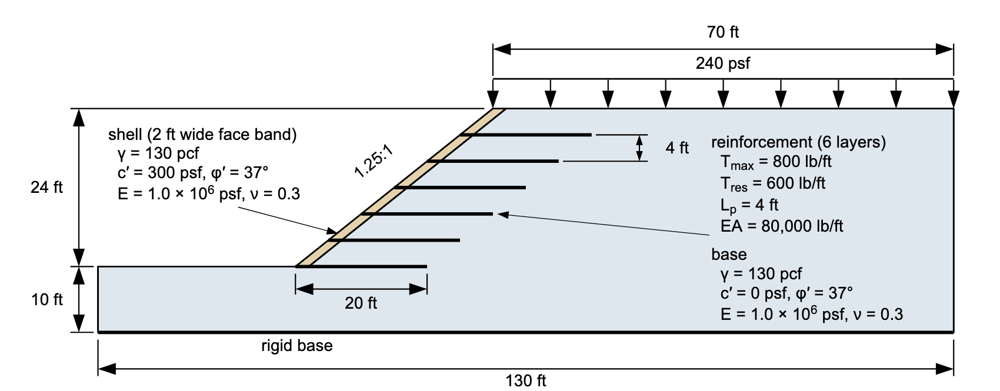{width=1000}

The fill stands **24 ft** high at **1.25:1** on a foundation that runs 10 ft
below the toe, with a **240 psf** surcharge over the 70 ft of crest behind it.
Two Mohr-Coulomb soils at the same unit weight: the fill itself is clean sand
with no cohesion at all, and the face is wrapped in a band of cohesive fill —
the `shell` — 2 ft measured horizontally, which on a 1.25:1 face is 1.25 ft
perpendicular to it; its 300 psf of cohesion keeps the search off the face. Six geogrid layers, each **20 ft** long and 4 ft apart vertically, start at
the face. Each develops **800 lb/ft** of tension over a pullout length of
**4 ft at both ends**, which is the published example's own value. It treats the
two ends as alike, and they are not — the buried end carries 4 to 16 ft of fill
and the face end almost none — so
[pullout from the overburden](#pullout-from-the-overburden) below runs the same
model with the bond read from the depth of burial instead.

The sketch shows the soils' elastic properties, E = 1.0 × 106 psf and
ν = 0.3, the geogrid's axial stiffness, *EA* = 80,000 lb/ft, and its residual
capacity, 600 lb/ft, because the finished model carries them; none of the four is
in the starter file, and all are entered on this page when the finite element run
calls for them. The geometry, the soils and the reinforcement are Example 5 from
the UTEXASED user manual, and [LEM-8](lem08_reinforced_slope.md) builds all of
it from nothing.

---

## Opening the starter file

Download [xslope_reinforced_slope_start.xlsx](files/xslope_reinforced_slope_start.xlsx)
and open it with **File → Open…**. The toolbar's mode strip opens on **LEM**,
which is where the first run happens. Units are `imperial`, so lengths read in
feet, unit weights in pcf, and stresses, strengths and stiffnesses in psf.

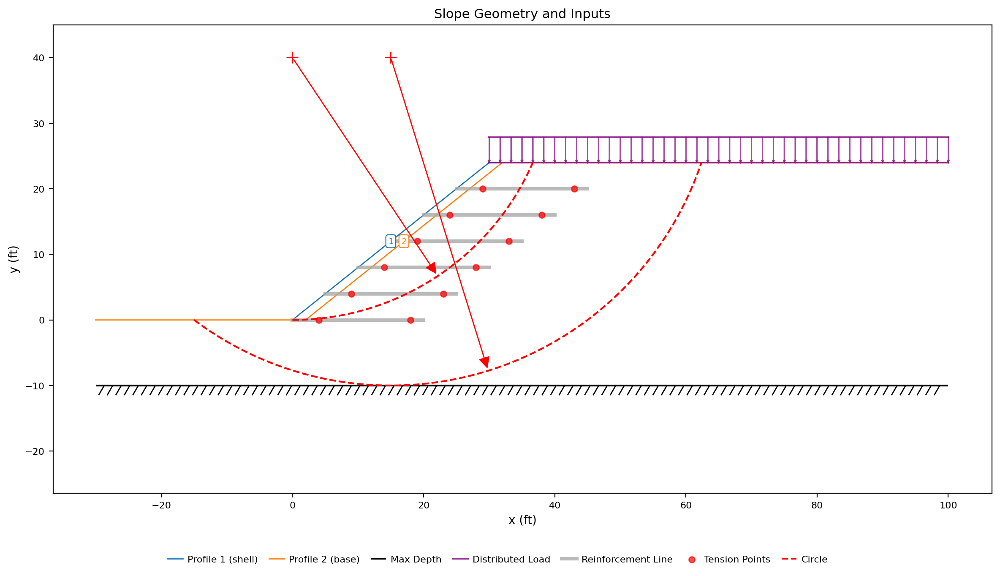{width=1000}

The Inputs plot shows the face band and the fill as two profile lines, the
hatched maximum-depth line at elevation −10, the crest surcharge as purple
arrows, and the six reinforcement lines as gray layers stepping up the face. Each
layer carries two red **tension points**, 4 ft in from each end — the points where
its capacity envelope first reaches the full 800 lb/ft. The two dashed red
arcs are the starting circles the search begins from.

---

## The limit equilibrium answer

The limit equilibrium run comes first because it gives the reference the two
finite element runs are read against, and because the starter file is already
complete for it.

Click **Run → Run LEM…**, choose **Method** = `Spencer` and **Analysis** =
`Auto search`, and leave the slice count at 40. **Model checks** reads
*No problems found for this run*.
Spencer is the method to compare against because it satisfies both force and
moment equilibrium, which makes it the closest limit equilibrium statement of
what a finite element run solves. Click **Run**.

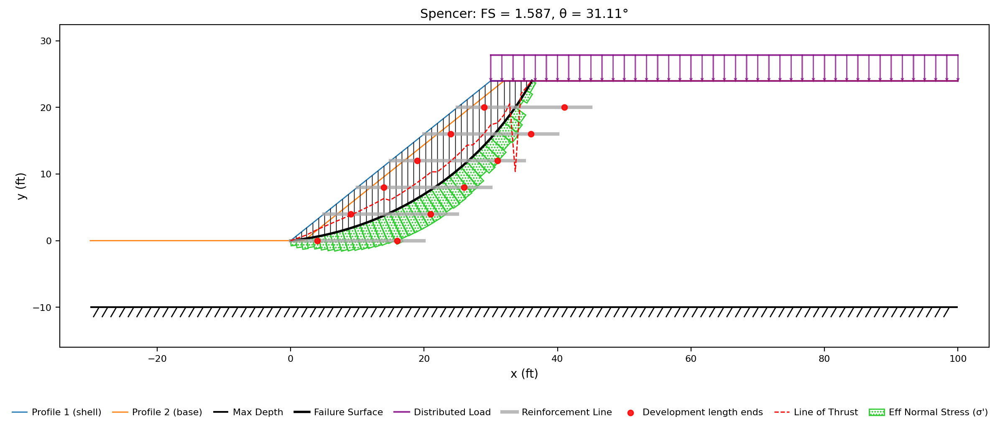{width=1000}

**Spencer's method gives FS = 1.587**, on a circle centered at (−5.13, 46.98)
with a radius of 47.26 ft. The surface daylights at the toe, cuts up through the
reinforced block and comes out on the crest at **x = 36.2**, behind the last
geogrid. It crosses five of the six layers and takes 800 lb/ft from each of
them, for 4,000 lb/ft of tension in total.
[LEM-8](lem08_reinforced_slope.md#where-the-surface-meets-the-lines) works
through that crossing-by-crossing.

---

## What a reinforcement line is to each engine

A reinforcement element is an elastic layer with **two separate limits** on the
force it can carry. The **bond limit** is the force the soil can transfer into
the layer through friction along its embedded length; when the layer force reaches
it, the layer slips. The **rupture limit** is the strength of the reinforcement
itself; when the force reaches it, the material yields. Both limits are
**perfectly plastic**: once the force reaches the limit it stays there while
the layer keeps stretching, neither rising nor falling. Below either limit the layer
is **elastic** — its force grows in proportion to how far it is stretched — so
the whole behavior is called **elastic-perfectly-plastic**: force proportional
to stretch up to the limit, then constant at it. A material can also be given a
**residual**: a lower force it drops to after rupture, instead of holding at the
limit. That two-limit structure is the standard idealization the mainstream
finite element codes share; PLAXIS, RS2 and FLAC all model reinforcement this
way. XSLOPE handles rupture the same way: `Tmax` is the rupture limit. With
`Tres` left blank, a layer that reaches it holds there — the elastic-perfectly-
plastic geogrid those codes use by default. With a `Tres` entered, a layer that
reaches `Tmax` drops to that residual and carries no more than it from then on.
The bond limit can be stated either way. Those codes compute bond from the
stress on the layer-soil interface, so the length a layer needs to develop its full
capacity depends on how deep it is buried; XSLOPE offers that form through the
`Adhesion` and `Delta` columns, and reads the length directly from the input —
the pullout lengths `Lp1` and `Lp2` — when they are left blank, which is what
this page does. The distinction between the two limits matters when the
results are read: the 1D Details panel reports whether a line reached its bond
limit (**pullout**) or its rupture limit (**yielded**), and the two mean
different things for the design.

**Bond** is the first limit. A geogrid is held by friction against the soil it
is buried in, and near a free end there is not much soil to be held by, so the
force the line can carry there is limited by its embedment rather than by its
own strength. That is what the pullout lengths `Lp1` and `Lp2` describe: the available force
ramps from zero at an end up to the full 800 lb/ft over that length, and past it
the embedment can develop the whole capacity. Here the ramp is 4 ft at each end.
(Stating `Adhesion` and `Delta` instead makes that ramp follow the effective
overburden along the line rather than rise at a fixed rate; this model uses the
lengths, and [the section below](#pullout-from-the-overburden) runs it the other
way.) The ramp
and the plateau together are the **capacity envelope**. Bond is **perfectly plastic**:
when the force reaches what the embedment can develop, the line slips there and
goes on carrying that force. Interface friction does not disappear once it has
been overcome, so nothing drops to zero.

**Rupture** is the second limit, and it is a property of the material rather
than of the burial. `Tmax`, 800 lb/ft here, is the tensile capacity of the
geogrid itself. What happens after it is reached is the `Tres` column: leave it
blank and the line holds its capacity indefinitely while the soil around it goes
on straining, which is the **elastic-perfectly-plastic** model and the industry
default; enter a number and a ruptured element drops to that residual; enter
zero and it ruptures brittly and carries nothing afterwards. This page runs the
blank case first, because it is what a published reinforced-slope analysis
assumes unless it says otherwise.

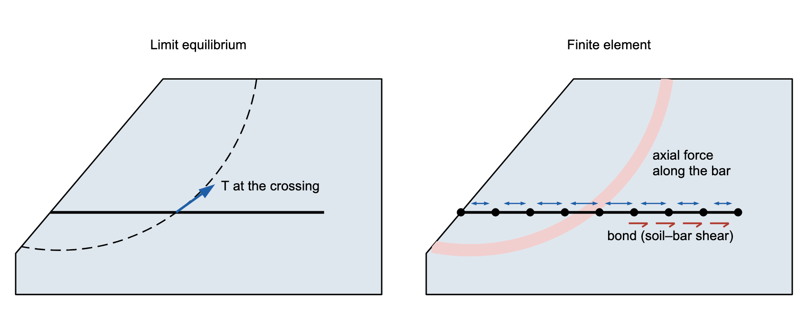{width=1000}

Both engines apply the same envelope. What differs is where they apply it.

The **limit equilibrium** engine evaluates the envelope at **one point** — where the
trial surface crosses the line — and applies that force to the sliding mass,
tangent to the surface for a flexible support like a geogrid, or along the
line's own axis for a rigid member like a soil nail (the **Dir** column). The
force is prescribed, not computed: nothing about the soil's stiffness, the layer's
stiffness or how far anything moved enters it. That is also why `Tres` has no
meaning in a limit equilibrium run: a post-peak drop depends on how far the
reinforcement has strained, and the method never computes a strain.

The **finite element** engine ties each line into the mesh as a row of tension-only
bar elements sharing nodes with the soil. The force in an element is *EA* times the
strain — the axial stiffness times how much it stretched per unit length —
capped by the envelope value at that element's own position along the line. The
layer therefore develops a force *profile*, low at the ends, high where the
mechanism crosses it, and the load that one element cannot carry is shed into
its neighbors through the soil. That profile depends on two inputs the limit equilibrium run does not use:
the reinforcement's elastic modulus `E` and its cross-sectional area `Area`.
Their product *EA* is the axial stiffness.

[Soil reinforcement in LEM](../lem/reinforcement.md) and
[soil reinforcement in FEM](../fem/reinforcement.md) carry the formulations,
the four end conditions of the envelope, and typical values by reinforcement
type.

---

## Building the mesh

The model has to be meshed before the finite element engine can run. On a
reinforced slope the mesh also sets where each bar element falls along its
line, and with it the capacity that element gets from the envelope. Two of the
Build Mesh defaults are changed here because of that.

Switch the mode strip to **FEM**. **Run → Run FEM…** stays disabled until a mesh
exists, so build one first. Click **Run → Build Mesh…**

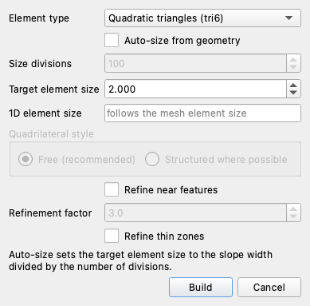

Set **Element type** to **Quadratic triangles (tri6)**. A finite element slope
stability analysis needs quadratic elements — linear ones lock and report a
factor of safety that is too high; the
[element type table](../fem/overview.md#element-type-selection-and-volumetric-locking)
in the FEM overview shows how much.

Untick **Auto-size from geometry** and set **Target element size** to `2`. That
is the size the [FEM sample problem](../fem/samples.md) for this model uses, and
it puts 10 elements on each 20 ft geogrid, which is enough to draw the force
profile along a layer. Auto-sizing would divide the 130 ft section width by 100
divisions for a 1.3 ft element instead, which is finer than this mechanism needs
and, as the next two paragraphs show, is not a neutral choice on a reinforced
model.

Untick **Refine thin zones** as well. Checked — and it is checked by default —
the mesher guarantees about four element rows across every thin material zone;
the thin zone here is the `shell`, the cohesive band down the face. On this
model the box is left off, for a reason particular to this slope. The fill is a
37° sand on a 1.25:1 face — a face slightly steeper than its friction angle —
and only the cohesive band holds the face up. Resolve that band finely enough,
by ticking the box or by shrinking the whole mesh, and the model begins to find
a second, real mechanism: shallow sloughing of the sand face, the same one a
tiny starting circle on the face would find in the limit equilibrium search.
The reported factor of safety then drifts down toward the sloughing answer
(from 1.51 at this page's mesh to 1.43 at 1 ft elements, on the run with a
residual) — a different failure, not a better estimate of this one. This page
is about the general mechanism through the reinforced block, the one Spencer's
circle finds, so it stays on the published sample's mesh, where that mechanism
governs. To study a fine mesh and still hold the search on the general
mechanism, the Run FEM dialog has the tools: **Ignore surficial (skin)
failures** with a **Min slip depth**, or an **SSR exclusion** over the face
band, which holds that zone at full strength while the rest of the model is
reduced. Leave the rest of the dialog alone and click **Build**.

The mesh comes out at **4,364 nodes and 2,101 triangles**, with the six lines
discretized into **60 bar elements**, 10 per line:

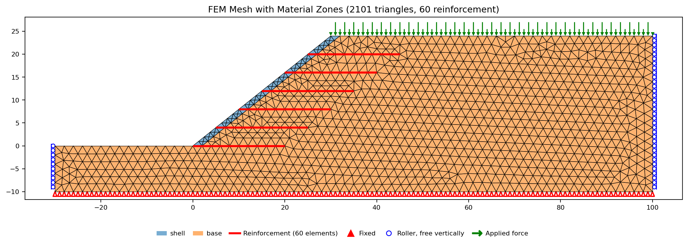{width=1000}

The reinforcement lines are drawn in red because they are part of the mesh, not
an overlay on it: each line was carried into the mesh generator as a constraint,
so every bar element lies on an edge shared with the triangles on either side of
it and its end nodes are soil nodes. The shared node is what couples the two: soil
movement stretches the layer, and the layer's tension pulls back on the soil.

The `shell` shows as a one-element-wide blue veneer down the face, which is the
thin zone the dialog offered to refine. Red triangles along the base are fixed
nodes, blue circles up both ends are rollers, and the green arrows on the crest
are the 240 psf surcharge.

---

## The stiffnesses the run needs

The mesh exists, but the run cannot start on it yet. The starter carries the
limit equilibrium model and nothing beyond it, so every input the continuum
needs is still blank: the two elastic properties on each soil, and two of the
three finite element columns on each reinforcement line. Opening **Run → Run
FEM…** now would show the same refusal
[FEM-1](fem01_strength_reduction.md#youngs-modulus-and-poissons-ratio) walked
through — errors naming each blank input, with **Run** disabled — so this
section goes straight to entering them, soils first, because what a layer's
stiffness does depends on the stiffness of the soil it is buried in.

Click **Materials** in the Inputs dock. On **Table view**, set
the **Show parameters for:** toggles to **FEM** alone, and give both soils an
elastic modulus of 1.0 × 106 psf and a Poisson's ratio of 0.3, in the
columns headed `E (psf)` and `n` (the Poisson's ratio column is labeled with a
plain `n`);
[FEM-1](fem01_strength_reduction.md#where-e-comes-from-and-what-it-changes)
covers what each of the two is and where a nominal modulus comes from when the
problem gives you nothing better.

| E (psf) | n |
|---:|---:|
| 1000000 | 0.3 |

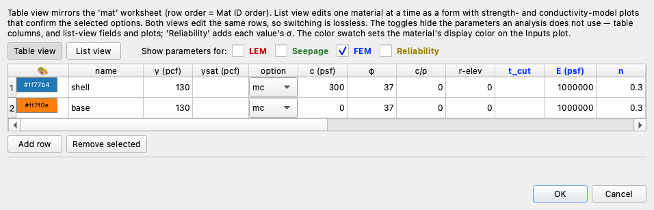

A single round modulus is used for both layers here rather than values from a
soil-type table, and
[what a stiffness does and does not change](#what-the-two-stiffnesses-change)
is measured further down, because on a reinforced model the answer is different
from the one FEM-1 reports. Click **OK**.

The reinforcement's two columns are next. Open **Reinforcement** in the Inputs
dock, and set the **Show parameters for:** toggles to **FEM** alone, as on the
materials table — the limit equilibrium inputs are complete and can stay out of
view. The three columns at the right end, in blue, are the ones only the finite
element engine reads.

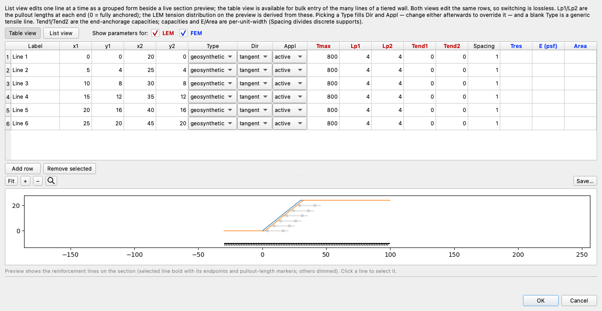

The six lines are complete on everything both engines share: 800 lb/ft of
capacity, a 4 ft pullout length at each end, no end anchorage, and a `Spacing` of
1 because geogrid properties are already per unit width. The three blue
columns are empty.

Fill `E (psf)` and `Area` on all six rows, and leave `Tres` empty:

| E (psf) | Area |
|---:|---:|
| 800000 | 0.1 |

An elastic modulus of 800,000 psf and an area of 0.1 ft² per foot of wall give
an axial stiffness *EA* = **80,000 lb/ft**, which is a typical uniaxial geogrid.
*EA* is what the run actually uses; the two columns are separate so that a
discrete support — a nail or a tieback — can carry a real modulus and a real
cross-section with its spacing dividing the area.
[Axial stiffness (EA)](../fem/reinforcement.md#axial-stiffness-ea) tabulates
values by reinforcement type.

Leaving `Tres` blank makes every line elastic-perfectly-plastic, which is the
first of the two runs. Click **OK** and save the model with **File → Save As…**
under a name of your own.

---

## The iteration budget

Two controls on the Run FEM dialog decide how long each trial is allowed to
iterate. Neither needs changing for this page, but what they do is worth
knowing before the first run.

**Max iterations per trial**, which opens at **12,000**, is the budget each
trial reduction factor starts with. It is a budget rather than a limit: a
trial that spends it while still converging — its out-of-balance force still
falling, or its displacements standing still — is given another budget's
worth, and another, up to the **Iteration ceiling**, which opens at 50,000. A
trial whose displacements are growing stops at its budget and is recorded as
failed; that is the non-convergence the method reads as failure. A trial that
reaches the ceiling still converging is reported **inconclusive**: the search
treats it as the undecided edge of the bracket rather than a failure, the
factor of safety is the bracket's midpoint as usual, and the log says so.

Because the budget extends itself, the factor of safety on this model does not
depend on it. Both runs below return the same answer from a budget of 3,000 as
from 12,000 — 1.559 elastic-perfectly-plastic and 1.512 with the residual —
from the same bracket, in the same seven bisection steps, with the same
converged field to six decimals; the trials near the critical factor simply
run past the smaller budget until they settle (3,108 iterations at *F* = 1.5,
12,726 at *F* = 1.547).

What a small budget does change is the **captured failure state**, because the
capture is one more solve and it stops at its budget. From a budget of 3,000
the elastic-perfectly-plastic run's failure field has moved 1.85 ft, 29 times
its elastic response; from 12,000 the same field has moved 6.73 ft, 107 times.
The factor of safety is the same either way, but the mechanism figure drawn
from the smaller budget shows a collapse that has barely started.

Leave both boxes as they open. Each run takes about two minutes.

---

## The elastic-perfectly-plastic run

The first of the two runs is the one that leaves `Tres` blank, which makes every
layer elastic-perfectly-plastic. It gives the finite element answer to compare
against Spencer's before any post-peak assumption is added on top of it. Click
**Run → Run FEM…** again.

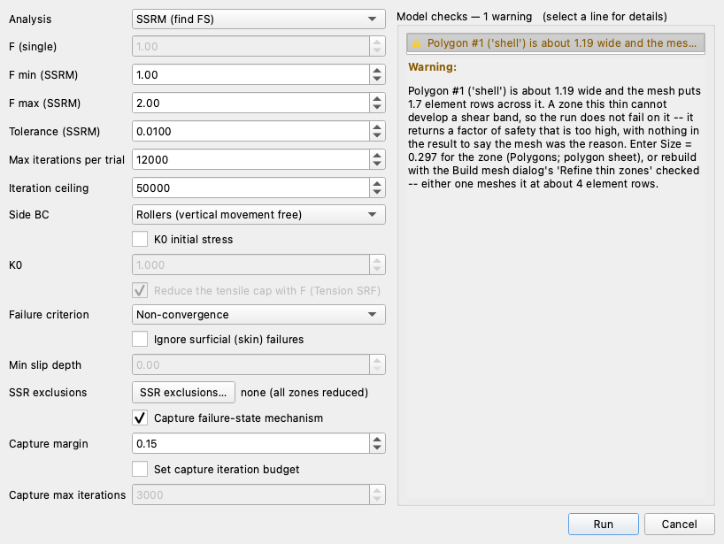

**Model checks — 2 warnings**, and **Run** is enabled. Both warnings are
expected on this model. The first is the blank tensile cutoff `t_cut`, which
lets each soil carry tension up to its Mohr-Coulomb apex —
[FEM-1](fem01_strength_reduction.md#running-the-strength-reduction) works
through what that means and when to enter a cap. The second is the thin `shell`
zone, which is the refinement declined during meshing.

The rest of the dialog opens on the defaults this run wants: **SSRM (find FS)**,
a bracket of 1.00 to 2.00, a tolerance of 0.0100, **Rollers** on the sides, and
**Non-convergence** as the failure criterion — the plain reading, that a trial
which cannot reach equilibrium has failed. FEM-1 compares it against the three
other criteria the list offers. Click **Run**.

**FS = 1.559**, from a final bracket of [1.5547, 1.5625], in seven bisection
steps. This is **1.8% below** Spencer's 1.587. The two engines solve the
problem in completely different ways, so agreement within a couple of percent
is a good check on both.

### Viscoplastic shear strain

{width=1000}

The **FEM · Results** tab opens on **At failure**, which is the state the run
captures by re-solving once at 1.15 times the factor of safety so the collapse
develops far enough to draw. The contours are viscoplastic shear strain — the
shearing left after the elastic response is subtracted — and the band they draw
runs from the toe, up behind the reinforced block, and out onto the crest near
**x = 49**. Spencer's circle came out at x = 36.2. The two mechanisms start in
the same place and end about 13 ft apart: the finite element band passes
*behind* the reinforced block, while Spencer's circle cuts through the back of
it. The two engines treat the layers differently — the limit equilibrium run
applies each layer's full capacity at the crossing, the finite element run lets
the force develop from strain — and the critical mechanism each finds follows
from that.

The layers are drawn on the same figure, colored by their axial force against the
second color layer. Every one of them reads deep red — 800 lb/ft, the full
capacity — through its middle, with pale ends of matching length where the two
4 ft pullout ramps allow less. At the captured failure state every line is fully
mobilized: the geogrid is carrying everything it has and the slope still cannot
find equilibrium.

### Reading what each layer is doing

The color layers on the shear strain plot give a first reading of each
geogrid layer's state. The **1D Details** panel gives a much more detailed
one: for every layer, its utilization, the force it carries along its whole
length against its capacity envelope, and a verdict naming how it is working.
Click **1D Details…** on the results toolbar. It opens on the **At failure**
field, where all six layers stand at 100% and read alike; set **Field state**
to **Last converged** — here the trial at *F* = 1.5547 — because that is the
last state that reached equilibrium, and it is where the layers separate.

Each row of the list names a line, gives its utilization, and says what state
the line is in. At that state five of the six read **yielded** — somewhere away
from the ends an element is at the full 800 lb/ft and holding it, which is the
whole tensile strength of the geogrid mobilized. Only line 1, the bottom layer
at the toe, reads **near capacity**: below capacity everywhere, but close to it
where it is most utilized. It is at 97%, its hardest-worked element sitting 1 ft
in from the face carrying 193 of the 200 lb/ft its embedment develops there.
That point is working against its bond limit, not its rupture limit.

Line 5 is one of the five that yield, and it carries both limits at once, so it
is the one to open:

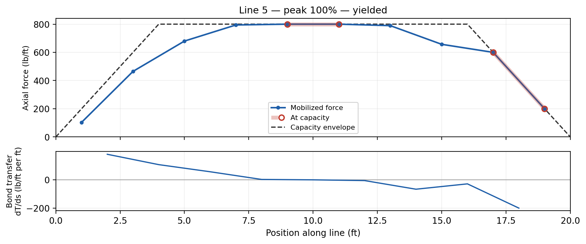{width=1000}

Position along the line runs from the face at s = 0 to the buried end at
s = 20 ft. The dashed line is the capacity envelope: it ramps from zero over the
first 4 ft, sits at 800 lb/ft along the middle of the line, and ramps back to
zero over the last 4 ft. The blue line is the force actually mobilized, with a
point at the center of each of the ten 2 ft bar elements the mesh laid along the
layer — that is where the solver reports each element's force. It climbs from almost nothing at the face, reaches the envelope at s = 9 and holds
it at 11 and 13 — those three elements are what the panel titles **yielded**, at
the full 800 lb/ft — then falls away down the buried ramp and touches the
envelope again at s = 19, where 1 ft of embedment allows only 200 lb/ft. The
ring there is the solver's record that the element reached that limit during
the run — the force is capped the moment it tries to exceed the envelope — and
the final state stands at 197 lb/ft, a hair under the cap once the surrounding
soil has finished redistributing. One line, both limits: rupture in the middle,
bond at the tip.

The lower strip is the bond transfer, dT/ds, the rate at which force passes
between the layer and the soil per foot of layer. It is positive from the face out to
the peak, where the soil is loading the layer, and negative beyond it, where the
layer is holding the soil back, crossing zero where the force is greatest. A limit
equilibrium run of the same model would have taken one number off the dashed
envelope at one crossing and stopped.

---

## The peak-residual run

The second run changes exactly one thing: what a layer does after it ruptures.
Open **Reinforcement** again and enter `600` in the `Tres` column on all six
rows, leaving everything else as it stands.

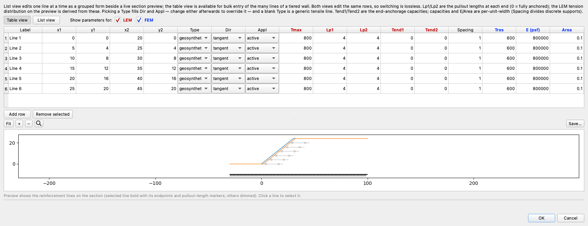

A residual of 600 lb/ft against a peak of 800 is a ratio of 0.75, a little above
the 0.3 to 0.7 usually quoted for geosynthetics. Click **OK**, then
**Run → Run FEM…** and **Run**, with nothing else on the dialog touched.

**FS = 1.512**, from a bracket of [1.5078, 1.5156]. Post-peak behavior cost
**0.047** of factor of safety, 3.0% — more than the 0.028 between Spencer's
1.587 and the elastic-perfectly-plastic 1.559.

Where it cost it is worth seeing, because the two searches walk together for six
trials and then part:

| Trial | *F* | Elastic-perfectly-plastic | *F* | With a 600 lb/ft residual |
|:---:|:---:|:---:|:---:|:---:|
| lower bound | 1.0000 | converged | 1.0000 | converged |
| upper bound | 2.0000 | failed | 2.0000 | failed |
| 1 | 1.5000 | converged | 1.5000 | converged |
| 2 | 1.7500 | failed | 1.7500 | failed |
| 3 | 1.6250 | failed | 1.6250 | failed |
| 4 | 1.5625 | failed | 1.5625 | failed |
| 5 | 1.5312 | **converged** | 1.5312 | **failed** |
| 6 | 1.5469 | converged | 1.5156 | failed |
| 7 | 1.5547 | converged | 1.5078 | converged |

They separate at *F* = 1.5312: the elastic-perfectly-plastic slope reaches
equilibrium there after 4,374 viscoplastic iterations, and the peak-residual one
gives up after 5,611. From that trial on the two are bisecting different halves
of the bracket, and the transition the second run is looking for is a little
under 0.05 lower than the first run's.

That trial is also where the residual first does anything. Solved on its own at
*F* = 1.5312, the blank-`Tres` model reaches equilibrium with 11 bar elements
standing at their capacity and none of them dropping; the `Tres` = 600 model
puts five elements over `Tmax` — interior elements on lines 3, 4 and 5, away
from either ramp — and each sheds to its 600 lb/ft residual. Their load goes to
their neighbors, more elements reach 800, and the slope never settles.

### What changed in the results, and what did not

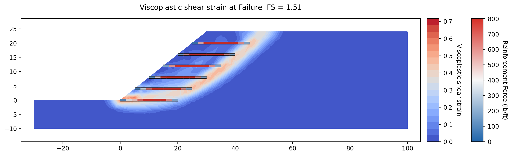{width=1000}

The band is in the same place, at a lower factor of safety, and the layers are
still red through the middle. What has changed is inside the layers, and the
converged field is where to look for it.

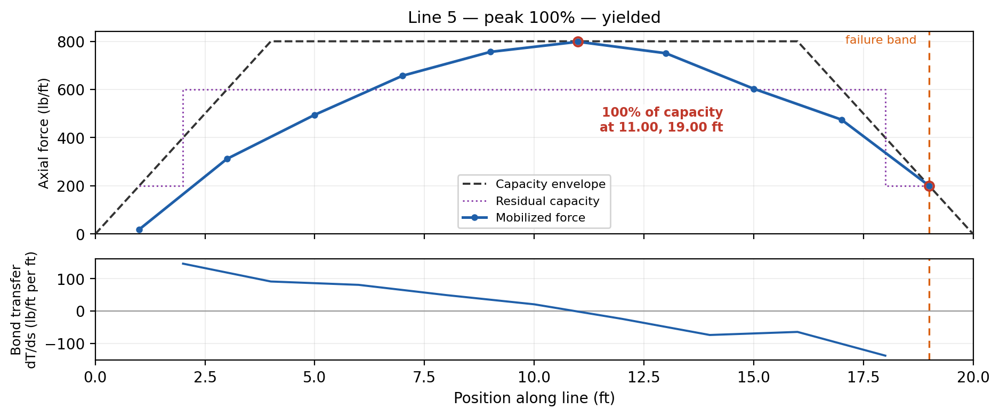{width=1000}

What is new on this profile is the dotted purple line, the **residual capacity**,
which the panel draws because there is one. It is not flat at 600: it steps —
200 lb/ft over the outer 2 ft at each end, 600 lb/ft along the middle — because
a residual is capped by the bond the embedment can develop at that point. An
element near the end of a layer cannot hold 600 lb/ft after rupturing when its
embedment could only ever develop 200.

Nothing on this line has actually dropped to it. There is no purple *Softened*
square, which is how the panel marks an element that has shed, and the line still
reads **yielded**: its interior peak is 798 of the 800 lb/ft available there, two
pounds short of the run before. The tip at s = 19 sits on its 200 lb/ft bond
limit as it did before. The residual has not changed this state — it has changed
which states are reachable above it.

That shows in the other five lines. Lines 2, 3, 4 and 6 now read **pullout**:
each has one element at the buried tip, s = 19, holding the 200 lb/ft its last
foot of embedment develops and slipping there rather than carrying more. Line 1
is **near capacity** at 84%, down from 97%. Four lines at their bond limit and
one at its rupture limit, in the same field: **pullout** and **yielded** are both
"the line has reached a limit", and only the word says which limit, which is why
the panel prints it. The same panel, left on its default **At failure** state,
reads every line at 100%:

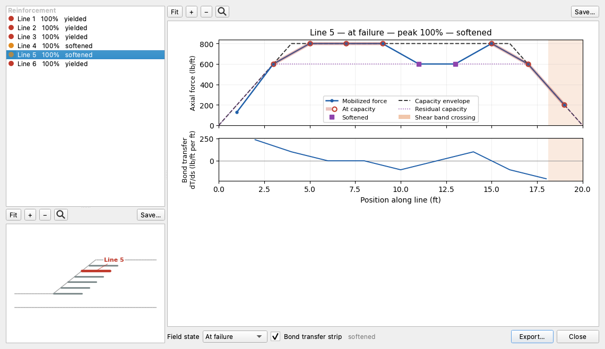

The list on the left carries all six lines with their utilization, a badge
colored by it, and the state each line is in; the map below it shows which line
is selected; and the profile is drawn on the right for the state the **Field
state** selector at the bottom names. It opens on **At failure**, which is why
every line here reads 100% and **yielded**, and why the title says *at failure*
— the state where the comparison between layers lives is **Last converged**.

### The failed state

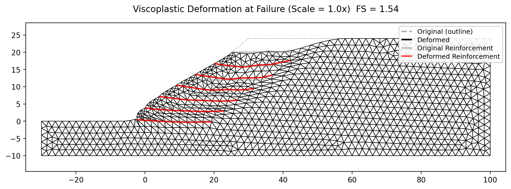{width=1000}

The deformed panel draws the mesh at its displaced position over a dashed
outline of where it started. The reinforced block has slid out over the toe and
settled at the crest, and the six layers — red where they started gray — are
stretched and rotated with it, hinging where the shear band crosses them. The
title's **Scale = 1.1x** is the exaggeration, which the panel picks so the
collapse reads at this figure size. **Scale ×** and **Auto size** on
the Display panel control that multiplier.

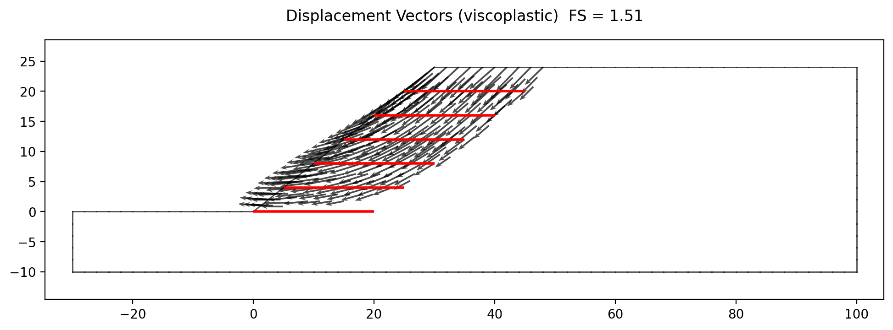{width=1000}

The vectors give the direction the same field moved in. They point down and
outward at the crest, swing through the body of the slope, and come out nearly
horizontal at the toe, and they die out a few feet behind the buried tips — the
soil beyond that is not part of the mechanism at this reduction factor.

---

## Pullout from the overburden

Everything above states the bond as a **development length**: 4 ft at each end,
with the capacity climbing at a constant rate over it. That number is a
judgement about how deep the reinforcement is buried, and it is the same
judgement for a tail under 16 ft of fill and for a tip at the face. The
`Adhesion` and `Delta` columns, left blank until now, let the model make that
judgement itself.
Filled, they state the soil–reinforcement interface strength and the resistance
follows the effective overburden along the line — per foot of a sheet with soil
bearing on both faces, *r*(s) = 2(*a* + σ′v(s) tan δ), integrated from
each end. FHWA-NHI-10-024's default pullout friction factor for a geosynthetic
with no site test data is *F*\* = (2/3) tan φ′, with a scale-effect correction
α = 0.8 for geogrids, and the FHWA form *F*\*ασ′v is this law with
**Adhesion = 0** and **Delta = arctan(*F*\*α)** — at φ′ = 37°, **22°**. Enter
those two on all six lines and `Lp1` and `Lp2` are no longer read;
[Pullout from the effective overburden](../lem/reinforcement.md#pullout-from-the-effective-overburden)
carries the formulation.

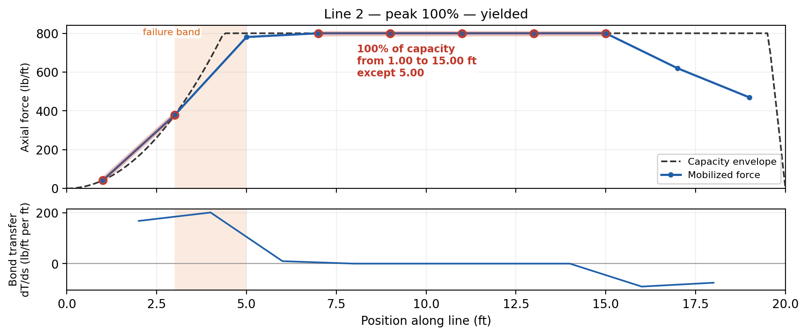{width=1000}

The envelope stops being a pair of straight ramps. σ′v grows with
depth of cover, so on a line running back from the face the resistance per foot
grows with it and the integral of a growing rate is a curve: on line 2 the law
allows **42, 168 and 378 lb/ft** at 1, 2 and 3 ft in from the face, where the
stated 4 ft ramp allowed 200, 400 and 600. At the buried end it goes the other
way — under 16 ft of fill the law reaches the full 800 lb/ft within half a foot
of the tip, and holds it at 17, 18 and 19 ft where the stated ramp is ramping
back down through 600, 400 and 200. One foot in from a tip, the two ends of the
same line are allowed 42 lb/ft and 800 lb/ft — a factor of nearly twenty, where
the stated length allows 200 at both.

The run puts line 2 at capacity at 3, 9 and 11 ft: two interior elements at
the full 800 lb/ft and the element out on the curve at 3 ft in, riding the law's
378 lb/ft. The shear band crosses it between **1.05 and 3.10 ft**, at the face,
through that element. Under the stated lengths the same line's hardest-worked
point was an interior element at the full 800 lb/ft, 7 ft in. That is the engineering content of the
comparison: a stated development length is depth-blind, so it under-rates a
deeply buried tail and over-rates a shallow one, and reinforced slopes are
critical at the face.

Both answers move, and the smaller move is the finite element one. Run
elastic-perfectly-plastic under the law and it returns **1.535** against 1.559 —
1.5%, three bisection cells. Spencer moves from 1.587 to **1.559**, 1.8%,
and that move is not a loss of capacity. On the circle Spencer already drew,
every one of the five crossings sits 8.4 ft or more from the nearer end, out
where both laws allow the full 800 lb/ft, so that surface cannot tell them apart.
What happens is that a *different* circle becomes critical: one that daylights
8.4 ft beyond the toe, passes under line 1 and clips it 2 ft from the face, where
the law offers 168 lb/ft against the stated ramp's 400. One sentence of caution on
σ′v: it is the weight of the soil column standing above the point and
nothing else, so the 240 psf crest surcharge does not count toward pullout
resistance — which is what FHWA directs for a live load.

---

## Why the two answers differ

The three runs the page compares are finished and no two of them agree. The disagreement has two
separate sources, and this section separates them: the post-peak assumption,
which the section above already measured, and the different ways the two engines
decide what force a reinforcement line carries.

Three readings of the same slope, from the same file:

| Reading | FS |
|---|:---:|
| Spencer's method, searched on this page | 1.587 |
| Strength reduction, layers elastic-perfectly-plastic | 1.559 |
| Strength reduction, layers with a 600 lb/ft residual | 1.512 |

The gap between Spencer and the peak-residual run is 0.075, and the section
above measured what post-peak behavior is worth: **0.047 of it**. The other
0.028 separates Spencer from the elastic-perfectly-plastic run, which is the
same physical assumption about the layers — hold capacity once yielded — applied
two different ways.

The difference is where the force is decided. Spencer takes the envelope value
at one crossing point and hands the sliding mass 800 lb/ft, five times over, as
a known force on a surface it chose. The finite element run lets the force
emerge along the whole of each layer from displacement compatibility, so a layer
contributes what the soil around it actually mobilized: line 1 gets no further
than 97% of what its embedment allows at the face, four of the six lines are held
at their buried tips by 200 lb/ft of bond once the residual is in play, and the
force in every layer tapers away from the shear band instead of standing at its
envelope value everywhere. Prescribing the maximum available force at one point
is the more generous of the two, and 1.8% is what that generosity is worth on
this slope.

The mechanisms differ in the same direction. Spencer's circle had to be a
circle, and the most critical circle available cuts out through the crest at
x = 36.2. The finite element band, free to take any shape, goes around the back
of the reinforced block and reaches the crest near x = 49 — a path no circular
search had on offer.

---

## What the two stiffnesses change

[FEM-1](fem01_strength_reduction.md#where-e-comes-from-and-what-it-changes)
measured that a hundredfold sweep in Young's modulus left the factor of safety
identical to every printed digit. A reinforced slope has a second stiffness in
it — the layers' — and the two do not have to move together, so that result needs
checking here rather than assuming.

The same run, at the same mesh and bracket, with the soils' modulus and the
layers' modulus scaled separately:

| Soil E | Layer E | FS |
|:---:|:---:|:---:|
| ×0.1 | ×1 | 1.5586 |
| ×1 (the file) | ×1 | 1.5586 |
| ×10 | ×1 | 1.2383 |
| ×10 | ×10 | 1.5586 |

The result does not carry over. Ten times the soil's modulus, with the geogrid
left as it is, costs **0.32 of factor of safety — 21%**. It moves in the
direction the mechanism says it should: a stiffer soil strains less under the
same load, the layers are stretched less, and the reinforcement is never asked for
the tension it is capable of. One tenth of the modulus costs nothing at all,
because at that stiffness the layers are already carrying everything the envelope
allows and there is nothing further to mobilize.

Scale the layers by the same ten as the soil and the answer returns to 1.5586, to
the printed digit and from the same bracket. What a reinforced finite element
model responds to is the **ratio** of soil stiffness to layer stiffness, not the
absolute value of either. FEM-1's invariance holds only where there is one
stiffness to sweep; put a second one in the model and the pair matters. A round
soil modulus against a catalog number for the geogrid is a modeling decision with
a real consequence for the factor of safety, and the two values should be chosen
against each other rather than one at a time.

---

## How much the residual is worth

The residual entered above, 600 lb/ft, was one choice out of a range. Running
the same model across the column — and running it blank, and running it at zero,
which is brittle rupture — measures how much the answer depends on that choice:

| `Tres` | FS |
|:---:|:---:|
| blank | 1.5586 |
| 800 | 1.5586 |
| 600 | 1.5117 |
| 400 | 1.5117 |
| 0 | 1.4883 |

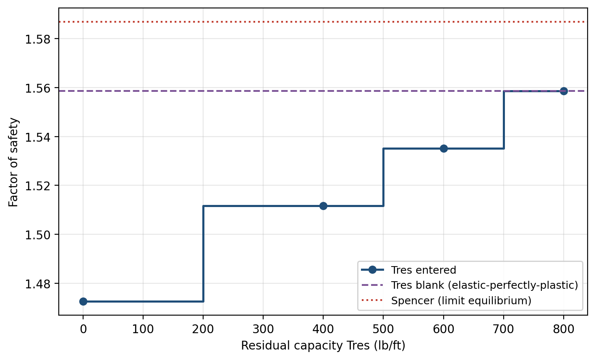{width=800}

The answer lands on **three steps**, not on a curve. `Tres` = 800 reproduces the
blank run exactly — the same factor of safety, the same bracket, the same trials
— which is the model saying what it should: a residual equal to the peak means
nothing ever drops below what it was already carrying, so the post-peak branch is
never entered. 600 and 400 give the same answer as each other, 0.047 below that.
Only a brittle zero goes lower, by a further 0.023.

Two things follow for a real design. The first is that what the entry decides is
mostly *whether* there is a residual, not how large it is: the step from holding
capacity to shedding to three quarters of it is 3% of factor of safety, and a
third of the residual range below that — 600 down to 400 — is invisible at this
bisection tolerance. The second is that the whole range, from a blank cell to a
brittle zero, is worth 0.070, about 4.5%. Leaving `Tres` blank claims the geogrid
holds its capacity once it yields, which is what the mainstream codes assume and
what most published capacities describe; entering zero claims it snaps. Neither
claim is one a catalog value settles, and the meshing step showed that the answer
under either moves with the discretization, so a residual is better treated as a
back-analysis parameter than as a design default.

---

## Conclusion

This tutorial covered:

- The two limits every reinforcement model carries — bond, which limits what the
  embedment can develop and slips perfectly plastically once reached, and
  rupture of the reinforcement itself, whose aftermath is the `Tres` column.
- What each engine does with those limits: a limit equilibrium method applies
  the envelope as a prescribed force at one crossing, and a finite element method
  meshes the line into bar elements whose force emerges from the movement of the
  soil around them.
- The three finite element reinforcement inputs, the axial stiffness *EA* two of
  them amount to, and the model checks that will not start a run without them.
- The per-trial iteration budget, the ceiling it extends to, and why neither
  decides the answer on this model — only how far the captured failure state
  develops.
- Reading a reinforced result: the mechanism out of shear strain, and each
  layer's force profile, bond transfer and verdict out of the 1D details panel at
  the last converged trial.
- What the two engines' answers are worth against each other, a residual
  capacity that lands on steps rather than a curve, and what changes when the
  bond is read from the depth of burial instead of a stated length.

**Where to go next:** [Soil reinforcement in FEM](../fem/reinforcement.md) and
[soil reinforcement in LEM](../lem/reinforcement.md) carry both formulations;
[LEM-8](lem08_reinforced_slope.md) builds this model from nothing and measures
what the geogrid is worth against the bare section;
[FEM-1](fem01_strength_reduction.md) is strength reduction on an unreinforced
embankment.
[FEM-3](fem03_piles.md) puts stabilizing piles through the same two-engine
comparison, and measures which engine a discrete row belongs in and which a
continuous wall does.
