# Tutorial FEM-3 — A Block Wall on Slip Joints

A segmental retaining wall is not one body. It is a stack of separate blocks
that can slide on the ground under them, slide and part from the fill behind
them, and slide and tip on each other. A finite element model that meshes that
stack as a single solid cannot do any of those things, and it will report the
wall as far stronger than it is.

This tutorial shows how to put each of those contacts into the model as a **slip
joint** — a line the mesh is split along, with an interface element carrying the
normal and shear stress between the two faces — and then runs the wall twice: standing on its
own blocks, and with three layers of geogrid tied into the facing.

Then it takes up a second question, which comes up on every model with a
geosynthetic in it. A sheet can be modeled two ways: as a **bar bonded into the
soil**, which carries tension across whatever surface cuts through it, or as a
**slip surface**, which the soil above it can slide along. The two give very
different answers, and Part 3 runs a pair of small models to show when each is
the right one.

The tutorial runs in three parts. **Part 1** builds the wall on its slip joints
with no geogrid and runs it, so the joints can be seen working on their own.
**Part 2** ties three geogrid layers into the same wall and runs it again.
**Part 3** leaves the wall and uses a pair of small models to show when a sheet
should be a bonded bar and when it should be a slip surface.

Strength reduction, meshing and the convergence controls are covered in
[FEM-1](fem01_strength_reduction.md); reinforcement lines, the capacity envelope
and the axial stiffness a bar needs are covered in
[FEM-2](fem02_reinforcement.md) and [LEM-8](lem08_reinforced_slope.md). Neither
is repeated here.

Analysis
Finite element

Build &amp; explore
~60 min

**Objectives** — Learn how the contacts in a block wall are entered as slip
joints, what a strength reduction does to them, how a geosynthetic layer behaves
as a bonded bar against the same layer as a slip surface, and when each is the
right model.

four materialsslip jointsjoints worksheetinterface elementblock wallelastic blockslocal element sizegeogridend tiesbonded barjointed sheethybrid criterionsweep budgetjoint slipdeformed blocks1D details

**Starter file** — [xslope_block_wall_start.xlsx](files/xslope_block_wall_start.xlsx),
the section, the four materials and the six block courses, with nothing on the
joints worksheet; this is the file the page starts from

**Completed models** — [xslope_block_wall.xlsx](files/xslope_block_wall.xlsx),
the wall on its seven joint lines, and
[xslope_block_wall_grid.xlsx](files/xslope_block_wall_grid.xlsx), the same wall
with its three geogrid layers. Part 3 has four small models of its own, linked
where it uses them

---

## The problem

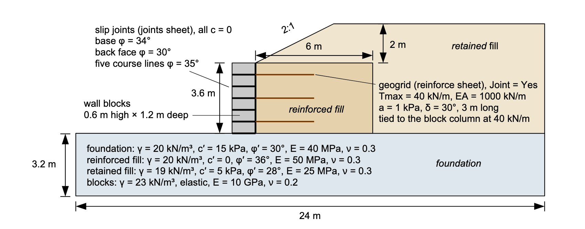{width=1000}

The wall stands **3.6 m** high in **six 0.6 m courses** of modular block
**1.2 m deep**, on a 3.2 m foundation, with a 6 m zone of reinforced granular
fill behind it and a 2:1 backfill slope rising 2 m above the crest. The section
is 24 m wide.

Four materials. Three are ordinary Mohr-Coulomb soils — the foundation, the
reinforced fill and the retained fill — with the unit weights, strengths and
elastic pairs on the drawing. The fourth is the block, and it is declared
**elastic**: a concrete unit is far stronger than anything around it, and
declaring it elastic means the strength reduction has nothing in the block to
weaken, which is the truth of the problem. The wall's strength is the strength of
its contacts, not of its blocks.

The wall is drawn with a vertical face. Real segmental walls are usually built
with a small batter, each course set back a little from the one below. That puts
a step in the back face at every course, and each step needs its own joint line.
The extra lines add entry work but change nothing about how the model is built or
read, so this tutorial keeps the face vertical.

---

## What a slip joint is

A joint line is a line the mesh is **split along**. Every node on it is given one
copy for each piece of material around it, so the material on one side of a joint
is a separate body from the material on the other. The copies are held together
by an interface element, which carries compression across the joint and
Coulomb shear along it. When the shear reaches its limit the two faces **slip**
past each other; when the normal stress goes into tension the joint **opens**
and carries nothing, until the faces meet again and it closes.

That is what makes a stack of blocks behave like a stack of blocks. Without the
joints the six courses are one concrete column that can only bend. With them,
each course can slide on the one below it, the column can slide on the
foundation, and the back face can part from the fill.

The formulation, the stiffnesses, the residual strengths and everything else on
the joints worksheet are in
[Joints and Interface Elements](../fem/joints.md), and are not repeated here.

---

## Part 1 — The wall on its slip joints, without geogrid

The wall goes in first with nothing holding it but its own blocks: the seven
slip joints and no reinforcement. This run shows what the joints do by
themselves, and it is the baseline the geogrid is measured against in Part 2.

### Entering the wall's contacts

Open [xslope_block_wall_start.xlsx](files/xslope_block_wall_start.xlsx) with
**File → Open…**. It carries the section, the four materials and the six block
polygons, and an empty joints worksheet. Units are metric.

{width=1000}

The joints worksheet is reached from the Inputs tree under **Joints**. Each row
is one line: a label, the two endpoints, and the strength of the contact. The wall
has seven contacts: one under the base of the block column, one on its back face
against the reinforced fill, and one between each pair of courses. Enter the seven
rows below, or paste them straight into the worksheet.

| Label | x1 | y1 | x2 | y2 | c | phi |
| --- | :---: | :---: | :---: | :---: | :---: | :---: |
| base | 8.0 | 0.0 | 9.2 | 0.0 | 0 | 34 |
| back face | 9.2 | 0.0 | 9.2 | 3.6 | 0 | 30 |
| course-01 | 8.0 | 0.6 | 9.2 | 0.6 | 0 | 35 |
| course-02 | 8.0 | 1.2 | 9.2 | 1.2 | 0 | 35 |
| course-03 | 8.0 | 1.8 | 9.2 | 1.8 | 0 | 35 |
| course-04 | 8.0 | 2.4 | 9.2 | 2.4 | 0 | 35 |
| course-05 | 8.0 | 3.0 | 9.2 | 3.0 | 0 | 35 |

A new row in the editor opens with `c`, `phi` and `t_cut` at 0 and every other
column blank. Enter the label, the endpoints and `phi`; leave `t_cut` at 0, since
a block contact carries no tension, and leave the rest blank. When the seven
rows are in, the editor looks like this:

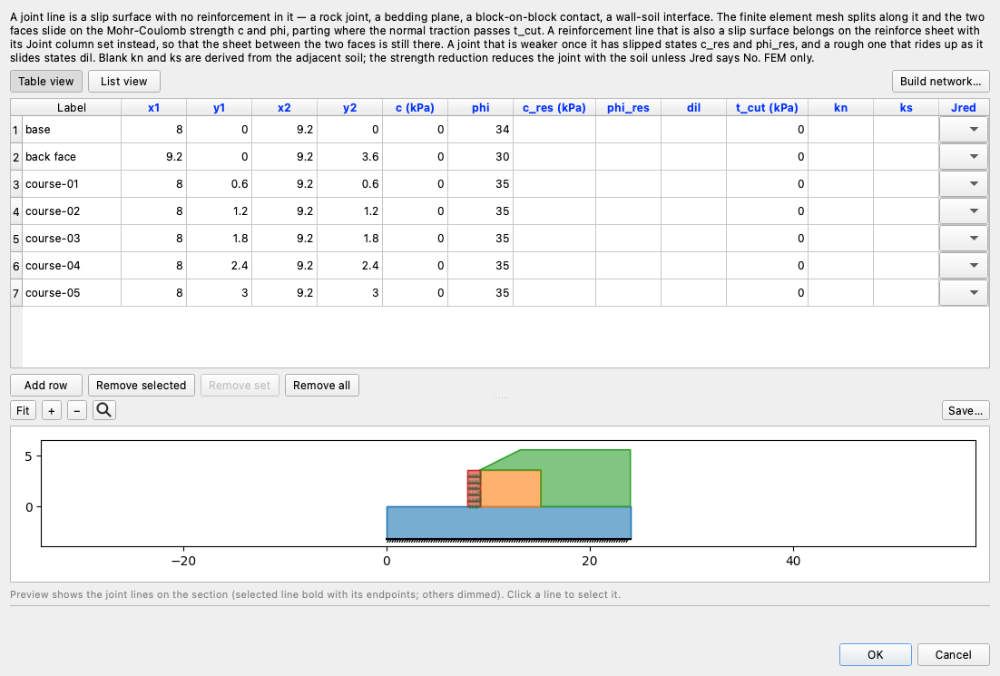{width=900}

The three friction angles differ because the three contacts do. The base is
block on compacted foundation soil at 34°; the back face is block against
granular fill at 30°, the lowest of the three because the fill is what has to
slide past it; the course joints are block on block at 35°, the manufacturer's
value for a dry, keyless unit. All seven have no cohesion: a dry block contact
and a block-on-granular-fill contact are both cohesionless.

What the columns mean, in the order they appear on the editor:

- **Label** names the line. The model checks, the results panels and the report
  use it whenever they have something to say about a joint, so a name that
  identifies the contact pays for itself the first time a check fires.
- **x1, y1, x2, y2** are the two endpoints. A joint line is straight; a contact
  that turns a corner is entered as two lines meeting at the corner.
- **c** and **phi** are the strength of the surface, in the same units as a
  soil's cohesion and friction angle. `phi` is required.
- **c_res** and **phi_res** are the strength the surface keeps after it has
  slipped once, for a rough joint that shears off its surface roughness and does
  not rebuild it. Blank means no drop: the peak strength carries throughout,
  which is the ordinary case for a manufactured block face.
- **dil** is the dilation angle, how far a rough surface rides up on itself as it
  slides. Blank is zero.
- **t_cut** is the tension the joint can carry across itself before it opens.
  Blank is zero, and zero is right for a block contact: two blocks resting on one
  another carry no tension at all.
- **kn** and **ks** are the normal and shear stiffness of the contact. Left blank
  they are derived from the softer of the two materials the line runs between,
  which is what a contact between a stiff block and a soil should use.
- **Jred** decides whether the strength reduction weakens this joint along with
  everything else. Blank means yes, which is right for a soil or rock contact. It
  is set to `No` only for a joint that stands for a construction detail rather
  than a real surface, a manufactured shear key, say, and none of these do.

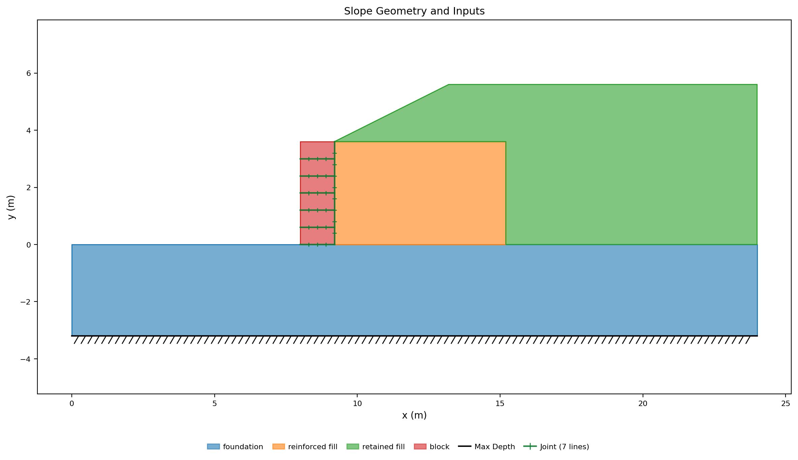{width=1000}

---

### Building the mesh

Build the mesh with **Run → Build Mesh…**: element type **tri6** and a global
target size of **0.8 m**.

A 0.6 m course cannot be resolved at a 0.8 m target size, so each block polygon
carries a local **Size** of **0.3 m** in its own row of the polygons worksheet.
That is the right way to refine a thin zone: dropping the global size to 0.3 m
would refine the whole 24 m section and cost several times the nodes for nothing.

The dialog reports **1,980 nodes, 903 elements, and 36 joint elements on 7
jointed lines**.

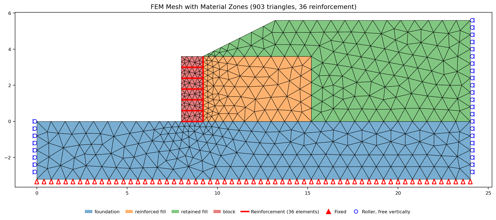{width=1000}

The split does not show on the mesh plot. Each node on a joint line has been
copied once per wedge of material around it, but the copies stand at the same
point, so the picture looks like an ordinary mesh with the jointed lines drawn
over it in their own style. That style is the only sign that the split happened.

---

### Running the wall alone

Open **Run → Run FEM…**. The analysis is **SSRM**, the bracket is *F* from
**1.0** to **2.0** and the tolerance is **0.01**, all of which are the defaults.
Two rows further down there is one setting to change, and one below it to leave
alone once you know what it does.

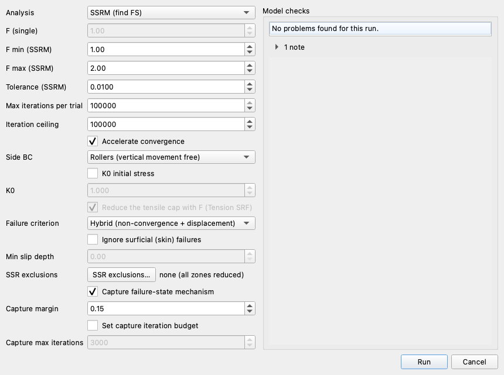{width=760}

**Max iterations per trial — change it to 100,000.** A joint reaches equilibrium
by growing slip, a little on each pass of the solver, so a jointed model settles
over tens of thousands of passes where a model without joints settles over
hundreds. A trial that runs out of passes before it has settled is recorded as
not standing, and the factor of safety then comes out low — a reading of the
budget rather than of the wall. The model checks in the column beside the dialog
say so while the budget is left lower. Raising it costs very little, because a
trial that has settled stops there and does not use the rest.

**Failure criterion — leave it on Hybrid.** The dialog opens on Hybrid for any
model that carries a joint, and this is why. A near-critical trial on a jointed
model often neither settles nor runs away: the joints go on slipping by a fixed
amount each pass while the wall itself stops moving, which is a wall standing
still behind contacts that never quite balance. Hybrid reads the slip and the
movement together and reports that as standing. The other criteria read only
whether the solver reached equilibrium, and on this wall they report every
near-critical trial as a failure — the search then walks its lower bound down to
the floor and gives no factor of safety at all.

Press **Run**. The search takes about **seven minutes** on an ordinary desktop —
nearer twelve on an install that does not carry the
[compiled kernel](../fem/overview.md#fast-kernel) — and reports

<!-- test: file=files/xslope_block_wall.xlsx, type=fem_ssrm, expected_fs=1.137, element_type=tri6, target_size=0.8, tolerance=0.01, f_min=1.0, f_max=2.0, criterion=hybrid, max_iter=100000, benchmark=FEM-3-blocks-ssrm -->

>>**FS = 1.137**

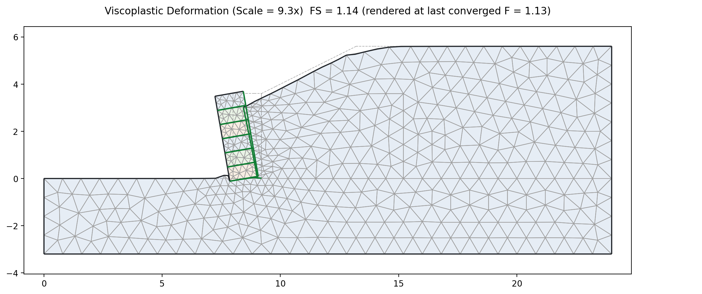{width=1000}

On a jointed model the displacement panel is the deformed section drawn as the
**blocks** the joints cut it into — each block under a faint tint of its own,
the joint faces in green colored by how far they have slid, the undeformed
outline dashed behind, and the whole thing exaggerated by the scale printed in
the title. The element grid steps back to a light gray under the blocks: on a
jointed model the movement happens at the joints, not spread through the
elements, so the faces carry the story and the grid only shows how each block
deformed inside them. Read the panel first. The block column has leaned away
from the fill behind it, and the fill has come forward into the gap.

The slip on the joint faces puts numbers on that. **1D Details…** on the results
toolbar opens one contact at a time and draws its normal stress, its shear
stress against the Coulomb limit with the slipping stations marked, and its
slip along the line. Here is the back face's:

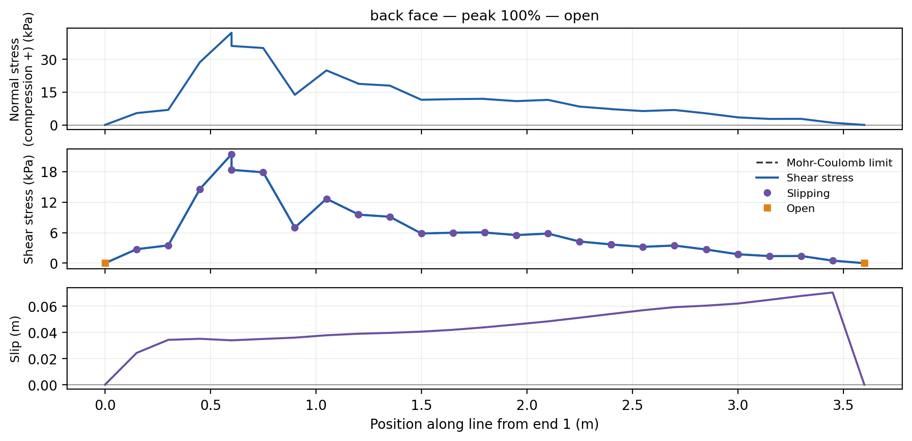{width=1000}

The middle panel marks every station that is slipping, which is all but the
two open ends, and the shear stress sits on the Coulomb limit at each of them,
so the dashed limit line lies under the solid one. The bottom panel is the slip
itself, growing from the base of the column to 70 mm just below the top.
Reading each of the seven contacts the same way gives the count of slipping
stations and the largest slip on each, and the one doing the work is the back
face:

| contact | spans slipping | largest slip |
| --- | :---: | :---: |
| back face | 28 of 30 | 70 mm |
| base | 5 of 9 | 13 mm |
| course-01 | 5 of 9 | under 0.01 mm |
| course-02 to course-05 | none | — |

**The wall failed on its back face.** The block column has slid down past the
fill along its own back, five times as far as it has slid forward on its base,
and the top four course joints have not moved on each other at all — the four
upper courses are travelling as one piece. Modeling the contacts separately is what
makes that visible. A wall meshed as a single solid can only bend, and would have
had nothing to say about which of its seven surfaces was carrying the failure.

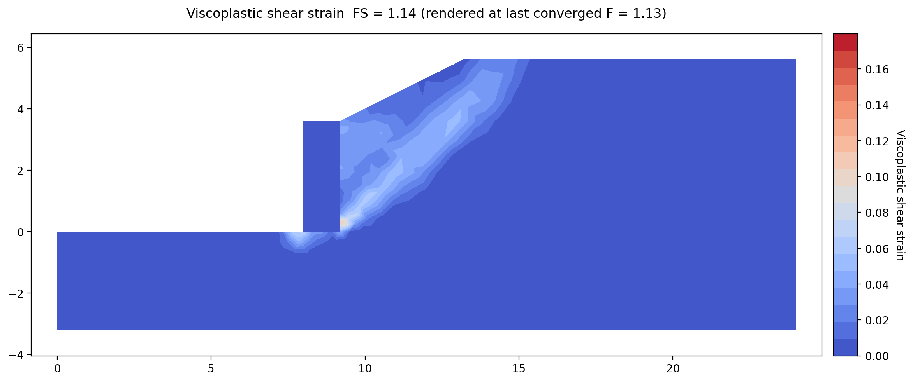{width=1000}

The shear strain shows where the soil is working. The reinforced fill behind the
blocks is straining along a surface that runs up from the heel of the wall, which
is the mass the facing has to hold back.

A factor of safety of 1.137 is not a design margin for a retaining wall. The
blocks are doing what a gravity wall does — standing on their own weight — and on
a 3.6 m wall with a backslope that is not enough. That is what the reinforcement
in the next section is for.

---

## Part 2 — The same wall with geogrid

Part 1's wall stands on its own blocks. This part ties three layers of geogrid
into the facing, runs the same wall again, and reads what the sheets add.

### Entering the three layers

Three layers of geogrid go in on the **reinforce** worksheet, reached from the
Inputs tree under **Reinforcement**. They sit on the 0.6 m, 1.8 m and 3.0 m
course joints — every second course — and run 3.0 m back into the reinforced
fill, which is about 0.8 of the wall height and ordinary practice.

Open the editor, switch it to **Table view**, and on the **Show parameters for**
row untick **LEM** and tick **FEM**. That hides the columns the limit equilibrium
methods use and nothing else reads, so the table carries only what this run
needs. Then enter the three rows below, or paste them into the worksheet.

| Label | x1 | y1 | x2 | y2 |
| --- | :---: | :---: | :---: | :---: |
| grid-01 | 9.2 | 0.6 | 12.2 | 0.6 |
| grid-02 | 9.2 | 1.8 | 12.2 | 1.8 |
| grid-03 | 9.2 | 3.0 | 12.2 | 3.0 |

Then the properties, one row per layer. The columns run from Tmax to Joint in
the order the FEM view shows them, so a paste lands each value in its own
column. Tres stays blank; the three layers are alike.

| Tmax | Lp1 | Lp2 | Adhesion | Delta | Tend1 | Tend2 | Spacing | Tres | E | Area | Joint |
| :---: | :---: | :---: | :---: | :---: | :---: | :---: | :---: | :---: | :---: | :---: | :---: |
| 40 | 0 | 0 | 1 | 30 | 40 | 0 | 1 |  | 1000000 | 0.001 | Yes |
| 40 | 0 | 0 | 1 | 30 | 40 | 0 | 1 |  | 1000000 | 0.001 | Yes |
| 40 | 0 | 0 | 1 | 30 | 40 | 0 | 1 |  | 1000000 | 0.001 | Yes |

Lp1 and Lp2 are 0 and grayed: Adhesion and Delta are filled, so the pullout
capacity comes from the overburden and the development lengths are not in use.
**kn** and **ks** stay blank so the interface takes its stiffness from the
fill the sheet lies in, as the wall's own joints do. **Jred** stays blank so
the strength reduction weakens this interface along with the soil, which is
right for a soil-geosynthetic contact: a sheet slipping through fill is a soil
failure, not a construction detail. Type, Dir and Appl are read only by the limit
equilibrium methods, so they do not matter to this run; the completed file has
Type set to Geosynthetic, which is harmless. When the three rows are in, the
editor looks like this:

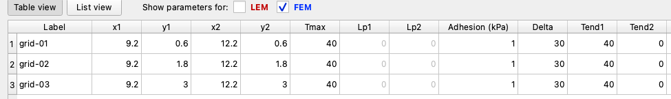{width=975}

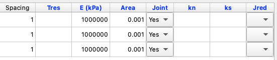{width=551}

What the columns a sheet needs mean, in the order they appear on the editor:

**Tmax** is the tensile capacity of the sheet, 40 kN/m — what it can carry before
it ruptures.

**Adhesion** and **Delta** are the strength of the interface between the sheet
and the soil around it: 1 kPa and 30°. On a bonded bar they set how much grip a
length of sheet develops. On a jointed sheet they are also the strength of the
slip surface the soil moves along, which is what makes them the most important
two numbers in this section.

**E** and **Area** give the sheet its axial stiffness, 1,000,000 kPa × 0.001 m²,
so EA = 1,000 kN/m. A sheet has to stretch before it can carry tension, and this
is what sets how much.

**Tend1** and **Tend2** are the capacities of the two ends. A blank end is free:
it can pull out of the soil, and the only thing holding it is the grip along its
length. A filled end is tied at the stated capacity. Here **Tend1 = 40 kN/m** —
the end at the block column is bolted to the facing at the full capacity of the
sheet — and **Tend2 = 0**, because the far end is simply buried and nothing holds
it but the soil.

**Joint** reads **Yes** on all three. The sheets lie on the contact between the
blocks and the fill and run back through the fill on horizontal planes, which is
exactly the geometry a mass can slide out along. [Part 3](#part-3-when-a-sheet-is-a-slip-surface-and-when-it-is-bonded)
sets out the rule.

{width=1000}

---

### What the geogrid adds

Same wall, same seven joints, same mesh settings, three sheets added. Rebuild
the mesh with **Run → Build Mesh…** at the same settings as Part 1, tri6 at
0.8 m with the 0.3 m block size still on the polygons worksheet.

The mesh grows to **2,103 nodes, 927 elements and 72 joint elements on 10 jointed
lines**. Each jointed sheet adds a jointed line of its own, and it splits the
mesh twice over — the sheet has soil above it and soil below it, so it carries
two interfaces, one against each.

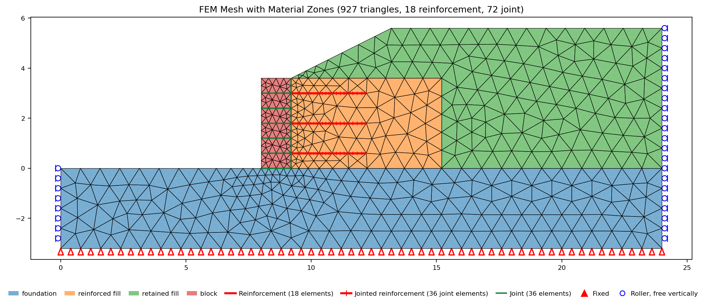{width=1000}

Then open **Run → Run FEM…** and run it exactly as Part 1 did: SSRM, the bracket
from 1.0 to 2.0, tolerance 0.01, **Max iterations per trial** at 100,000 and the
failure criterion on Hybrid. Press **Run**. It takes about eleven minutes, and
reports

<!-- test: file=files/xslope_block_wall_grid.xlsx, type=fem_ssrm, expected_fs=1.238, element_type=tri6, target_size=0.8, tolerance=0.01, f_min=1.0, f_max=2.0, criterion=hybrid, max_iter=100000, benchmark=FEM-3-grid-ssrm -->

>>**FS = 1.238**

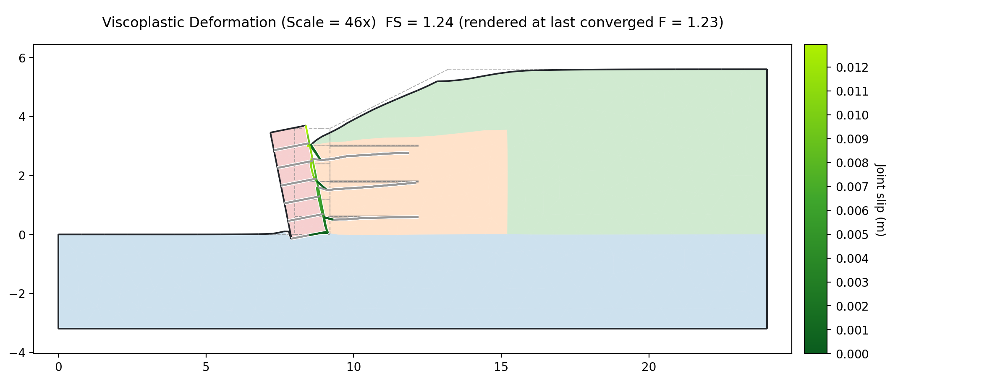{width=1000}

This panel has no element grid where Part 1's did. The blocks panel drops the
grid once a model carries more than eight jointed lines, because on a jointed
network the blocks are a few elements each and the grid would bury their
outlines. The wall alone had seven jointed lines; the three sheets make ten.
That only sets the default: **Element edges** in the display panel puts the
grid back, or takes it off the Part 1 panel. Everything else is drawn as
before. The three sheets show as green lines, the
two faces of each sheet's interface colored by their slip, with the sheet's
original position in gray behind. The
short red lengths just behind the facing are the bars themselves, drawn red in
their deformed position. Along most of each sheet the soil faces lie on the bar
and hide it; where the faces have slid along the bar, at the facing, the red
shows through.

Against 1.137 for the same wall without them, the three layers are worth 0.101 of
factor of safety, and the joint slip says exactly where it came from. The back
face's slip falls from **70 mm to 13 mm** and the base's from **13 mm to under
1 mm**. The back face is still the contact with the most slip, so the wall still
fails by sliding down its own back, but it slides a fifth as far before the
model stops standing.

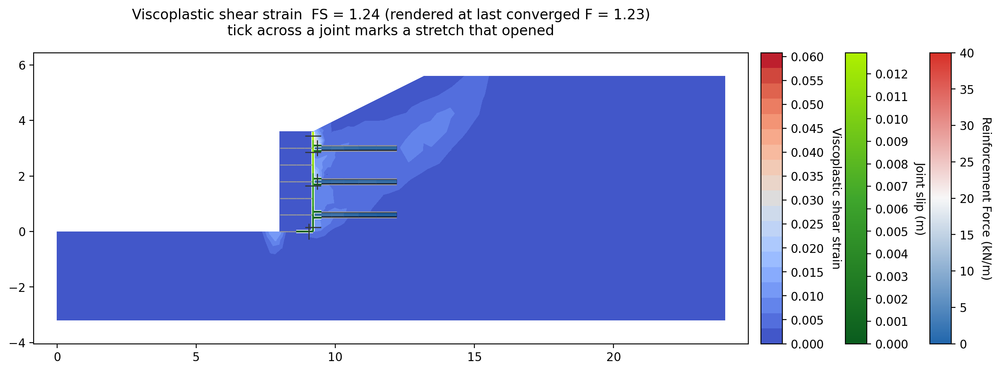{width=1000}

The shear strain panel says the same thing about the soil. Part 1's band ran up
from the heel of the wall through the reinforced fill with strains near 0.17;
here the band is in the same place but faint, and the scale tops out near 0.06.
The three layers have not moved the surface the fill wants to fail on. They have
held the mass behind the facing together so that far less of it is straining
at the critical factor, and the joint slip scale beside the strain scale has
dropped from 70 mm to 13 mm with it. The bars themselves show dark on the
reinforcement force scale: they carry little tension, which the next panel
makes exact.

**1D Details…** draws what one layer is doing along its length. Here is the
middle one:

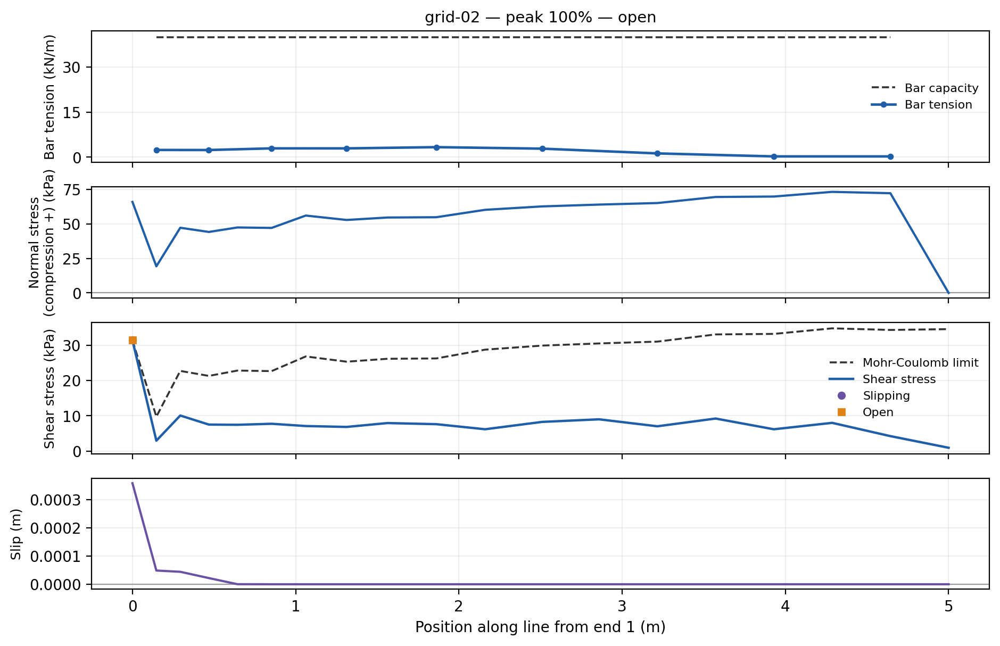{width=1000}

Look at the top panel first. The bar's capacity is a flat 40 kN/m along the
whole layer, and its tension never gets above **8%** of it. The sheet is not
being stretched, and it is nowhere near rupture. The panels below say what it is
doing instead: the interface reaches its Mohr-Coulomb limit at one station,
immediately behind the block column, and nowhere else. What the geogrid
contributes on this wall, it contributes by tying the block column to a mass of
fill that will not move — which is why **Tend1** is the number that matters.

It also says how little the jointing of the sheets matters here. Nothing slides
along them: the slip is zero beyond the first stretch, and over the rest of
the length the two faces carry their shear below the limit, which is grip, not
sliding. The sheets are jointed because they end on the back-face joint and a
bonded bar cannot stand on a split node; on this wall the interface elements
act as a stiff bond and a bonded bar with the same tie would give much the
same answer. Part 3 is where jointing changes the answer, and its models show
why.

---

## Part 3 — When a sheet is a slip surface, and when it is bonded

Part 3 leaves the wall. The question it takes up came out of Part 2, where the
geogrid layers were entered with `Joint = Yes`, and it applies to every model
with a geosynthetic in it: should a sheet be a **bonded bar** or a **slip
surface**? The two are one cell apart on the reinforce worksheet and can give
very different answers. To show when each is right, this part builds a simpler
problem than the wall: an embankment on a foundation with a single sheet at its
base, and nothing else in the section that could slide.

A sheet is entered one of two ways:

- **Bonded**, `Joint` blank or `No`. The soil above the sheet and the soil below
  it move together, and the sheet carries tension across whatever failure
  surface cuts through it. This is what [FEM-2](fem02_reinforcement.md) uses
  throughout: geogrid interlocked in granular fill, a nail wall, a circular
  surface through a reinforced slope.
- **A slip surface**, `Joint = Yes`. The mesh splits along the sheet, and the
  soil above it can slide along it. The sheet's Adhesion and Delta become the
  strength of that surface. This is fill sliding over a smooth geomembrane, a
  woven geotextile on sand whose interface friction is well below the soil's
  own, or the fill of Part 2 running out over the sheets of a block-faced wall.

Which is right depends on where the failure surface wants to go: **across** the
sheet, or **along** it. Getting it wrong in the second case is not a small
error. Two versions of the embankment show both halves of that, one at a time.
The embankment is 5 m high on 2:1 slopes with a 12 m crest, on a 4 m foundation,
with one 32 m sheet under it. Each version is built twice with the `Joint` cell
as the only difference, and each is run at the settings this page has used
throughout.

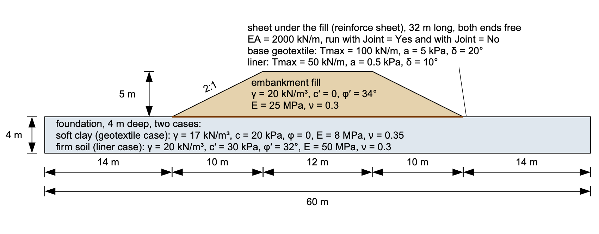{width=1000}

The fill is the same in both: γ = 20 kN/m³, c′ = 0, φ′ = 34°, E = 25 MPa,
ν = 0.3. The foundation and the sheet are what change.

### A base geotextile on soft clay

The first version is the case where the failure surface has to cut across the
sheet. The embankment sits on soft clay, γ = 17 kN/m³, c = 20 kPa, φ = 0,
E = 8 MPa, ν = 0.35, and the clay is the weak part of the section: whatever
fails here fails through it.

The sheet is a base geotextile laid on the clay under the whole fill, 32 m long
with both ends free, Tmax = 100 kN/m and EA = 2000 kN/m. Its interface with the
soil, Adhesion = 5 kPa and Delta = 20°, is stronger than the clay beneath it,
so the fill has no reason to slide along the sheet when it can shear the clay
instead.

Run it first with `Joint` blank, the sheet as a bonded bar,
[xslope_base_geotextile_bonded.xlsx](files/xslope_base_geotextile_bonded.xlsx):

<!-- test: file=files/xslope_base_geotextile_bonded.xlsx, type=fem_ssrm, expected_fs=1.356, element_type=tri6, target_size=1.2, tolerance=0.01, f_min=1.0, f_max=2.0, criterion=hybrid, max_iter=100000, benchmark=FEM-3-sheet-bonded-ssrm -->

>>**FS = 1.356**

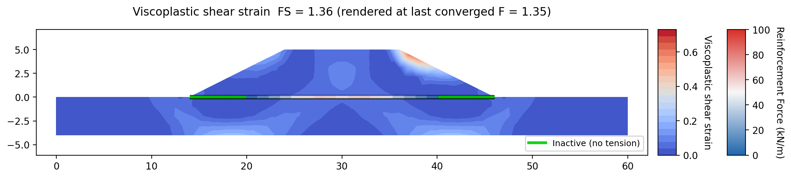{width=1000}

Then `Joint = Yes`,
the sheet as a slip surface,
[xslope_base_geotextile_jointed.xlsx](files/xslope_base_geotextile_jointed.xlsx):

<!-- test: file=files/xslope_base_geotextile_jointed.xlsx, type=fem_ssrm, expected_fs=1.356, element_type=tri6, target_size=1.2, tolerance=0.01, f_min=1.0, f_max=2.0, criterion=hybrid, max_iter=100000, benchmark=FEM-3-sheet-jointed-ssrm -->

>>**FS = 1.356**

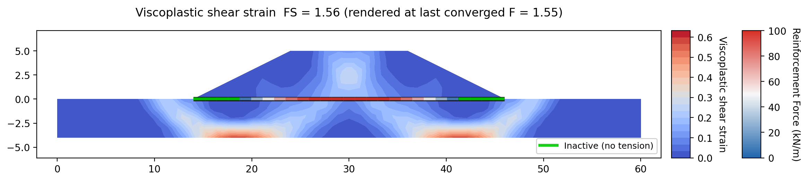{width=1000}

The two agree exactly, and the strain field says why. The failure surface
starts at the crest, goes down through the fill, crosses the sheet, runs through
the soft clay, and comes up through the foundation just outside the toe, the
same on both sides. The sheet is **crossed**, not slid along: it is loaded in
tension across that surface, which a bonded bar and a slip surface both do the
same way. The slip surface only behaves differently where soil moves along the
sheet, and the few millimetres of slip near the sheet's ends are not where this
section fails. So entering the sheet as a slip surface changes nothing about
the factor of safety.

### A smooth geomembrane liner on a firm foundation

The second version turns the first one around. It keeps the same fill and the
same geometry, but takes away the weak foundation and puts the weakness in the
sheet instead, so that the failure surface can run along the sheet if the model
lets it.

The soft clay becomes a firm foundation, γ = 20 kN/m³, c′ = 30 kPa, φ′ = 32°,
E = 50 MPa, ν = 0.3, stronger than the fill above it. Nothing fails through
that.

The base geotextile becomes a smooth geomembrane liner, still 32 m long with
both ends free, Tmax = 50 kN/m and EA = 2000 kN/m. Its interface is the weakest
thing in the section: Adhesion = 0.5 kPa and Delta = 10°, against a fill at
φ′ = 34° and a foundation at φ′ = 32°. If the fill can slide along the liner,
that is where the embankment will fail.

Run it the same two ways. First `Joint` blank, the liner as a bonded bar,
[xslope_liner_bonded.xlsx](files/xslope_liner_bonded.xlsx):

<!-- test: file=files/xslope_liner_bonded.xlsx, type=fem_ssrm, expected_fs=1.371, element_type=tri6, target_size=1.2, tolerance=0.01, f_min=1.0, f_max=2.0, criterion=hybrid, max_iter=100000, benchmark=FEM-3-liner-bonded-ssrm -->

>>**FS = 1.371**

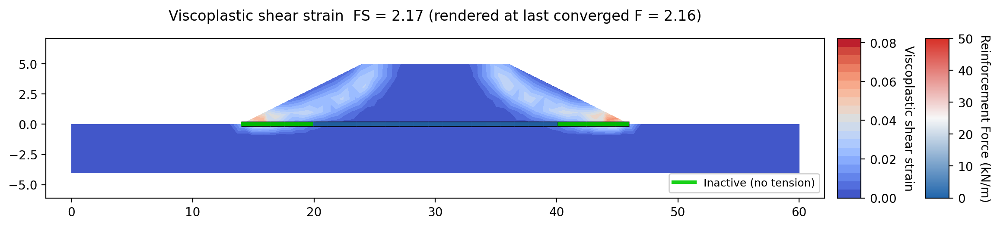{width=1000}

The bonded model has no way for the fill to move along the liner, so it puts
the strain in the soil above the sheet and reports the slope on that. Then
`Joint = Yes`, the liner as a slip surface,
[xslope_liner_jointed.xlsx](files/xslope_liner_jointed.xlsx):

<!-- test: file=files/xslope_liner_jointed.xlsx, type=fem_ssrm, expected_fs=1.059, element_type=tri6, target_size=1.2, tolerance=0.01, f_min=1.0, f_max=2.0, criterion=hybrid, max_iter=100000, benchmark=FEM-3-liner-jointed-ssrm -->

>>**FS = 1.059**

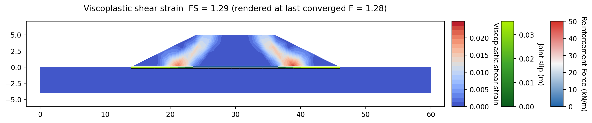{width=1000}

The jointed model lets the fill slide out along the liner instead: the strain
band collapses onto the sheet itself at both toes and 22 of its 55 spans slip,
up to 3.6 mm. That is what a mass on a smooth membrane does, and it costs a
fifth of the factor of safety. The bonded model reported a slope safer than
the model says it is.

### The rule

| model | interface δ | as a bonded bar | as a slip surface |
| --- | :---: | :---: | :---: |
| base geotextile on soft clay | 20° | 1.356 | 1.356 |
| smooth geomembrane liner | 10° | 1.371 | 1.059 |

Between them the two pairs bracket the rule. Where the surface has to cut
across the sheet, a bonded bar is adequate and cheaper — the jointed model
triples the nodes along the line and adds two interface elements per station for
an answer it already had. Where the surface can run along the sheet, only the
jointed model can find it, and the bonded one overstates the slope. When in
doubt, run it both ways: that is two runs on one file with one cell changed, and
if they agree the question is settled.

### What the model checks say before anything is run

The bonded liner does not have to be run to be caught. Open it and the checks
column beside the Run FEM dialog carries three findings, each naming the line:

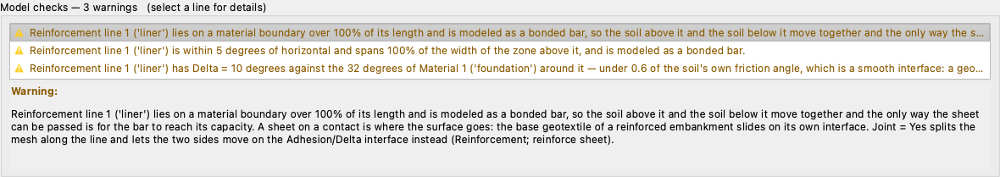{width=760}

The sheet lies on a material boundary over its whole length; it is within five
degrees of horizontal and spans the full width of the mass above it; and its
Delta of 10° is under 0.6 of the 32° friction angle of the soil around it, which
is a smooth interface rather than a soil-geosynthetic contact. Each of the three
is a way of saying the same thing: this is a plane the mass can slide on, and a
bonded bar cannot represent that.

### Why the wall's own sheets could not be run both ways

The wall of parts 1 and 2 cannot be run bonded, and a reader who tries it will
meet the refusal rather than a result. A sheet whose front end stops on the back
face of the block column **touches** that joint line. The mesh splits along a
jointed line and copies every node on it once per wedge of material around it, so
a bonded bar standing on one of those nodes would keep one wedge's copy and lose
the material on the other side of the joint. It has no defined side to attach to,
and both the model checks and the mesher refuse it by name.

That is why Part 3's comparison is made on two small models that carry no other
joint line, rather than on the wall itself. On a wall the sheets are jointed, and
the question does not arise.

---

## Conclusion

This tutorial covered:

- The contacts in a block wall entered as joint lines — under the base, on the
  back face and between every course — and the blocks declared elastic so the
  strength reduction weakens the contacts rather than the concrete.
- Every column of the joints worksheet, what a blank means in each, and where a
  contact's friction angle comes from.
- A local element size on the block polygons, which resolves a 0.6 m course
  without refining the whole section.
- The sweep budget a jointed run needs, and what leaving it at the default does
  to the answer.
- The wall standing on its own blocks against the same wall with three geogrid
  layers tied into the facing.
- The question every geosynthetic model has to answer — does the surface cut
  across the sheet or run along it — measured both ways on two small models.

**Where to go next:** the [tutorials index](index.md) lists the series.
[Joints and Interface Elements](../fem/joints.md) carries the element and the
split mesh, [Soil Reinforcement](../fem/reinforcement.md) carries the bar, the
interface and the ties, and
[Worksheet: joints](../usage/input_template.md#worksheet-joints) documents the
inputs with the rest of the template. In
[FEM-5](fem05_rock_slope_joints.md) the same element is used with no
reinforcement anywhere near it — a rock slope whose only strength is the strength
of the surfaces cutting through it.
