# Tutorial FEM-3 — A Block Wall on Slip Joints

A segmental retaining wall is not one body. It is a stack of separate blocks
that can slide on the ground under them, slide and part from the fill behind
them, and slide and tip on each other. A finite element model that meshes that
stack as a single solid cannot do any of those things, and it will report the
wall as far stronger than it is.

This tutorial shows how to put each of those contacts into the model as a **slip
joint** — a line the mesh is split along, with an interface element carrying the
normal and shear stress between the two faces — and then runs the wall, 3.6 m of
six block courses with a 2:1 backfill slope behind it, twice: standing on its own
blocks, and with three layers of geogrid tied into the facing.

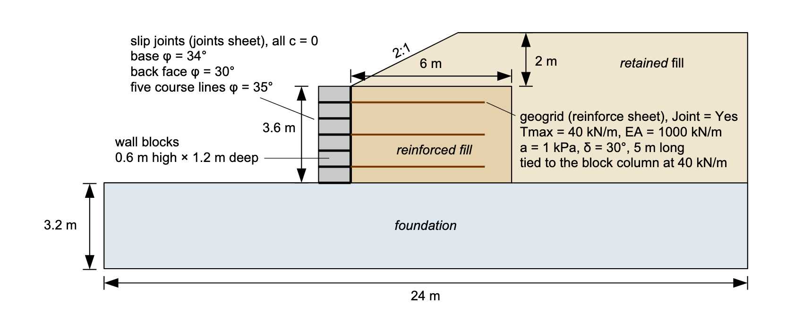{width=1000}

Then it takes up a second question, which comes up on every model with a
geosynthetic in it. A sheet can be modeled two ways: as a **bar bonded into the
soil**, which carries tension across whatever surface cuts through it, or as a
**slip surface**, which the soil above it can slide along. The two give very
different answers, and Part 3 runs a pair of small models to show when each is
the right one.

The tutorial runs in three parts. **Part 1** builds the wall on its slip joints
with no geogrid and runs it, so the joints can be seen working on their own.
**Part 2** ties three geogrid layers into the same wall and runs it again.
**Part 3** leaves the wall and uses a pair of small models to show when a sheet
should be a bonded bar and when it should be a slip surface.

Strength reduction, meshing and the convergence controls are covered in
[FEM-1](fem01_strength_reduction.md); reinforcement lines, the capacity envelope
and the axial stiffness a bar needs are covered in
[FEM-2](fem02_reinforcement.md) and [LEM-8](lem08_reinforced_slope.md). Neither
is repeated here.

Analysis
Finite element

Build &amp; explore
~60 min

**Objectives** — Learn how the contacts in a block wall are entered as slip
joints, what a strength reduction does to them, how to tell a wall that fails
from one that keeps moving, how a geosynthetic layer behaves as a bonded bar
against the same layer as a slip surface, and when each is the right model.

four materialsslip jointsjoints worksheetinterface elementblock wallelastic blockslocal element sizegeogridend tiesbonded barjointed sheethybrid criterioniteration limitjoint slipdeformed blocks1D details

**Starter file** — [xslope_block_wall_start.xlsx](files/xslope_block_wall_start.xlsx),
the section, the four materials and the six block courses, with nothing on the
joints worksheet; this is the file the page starts from

**Completed models** — [xslope_block_wall.xlsx](files/xslope_block_wall.xlsx),
the wall on its seven joint lines, and
[xslope_block_wall_grid.xlsx](files/xslope_block_wall_grid.xlsx), the same wall
with its three geogrid layers. Part 3 has four small models of its own, linked
where it uses them

---

## The problem

The wall stands **3.6 m** high in **six 0.6 m courses** of modular block
**1.2 m deep**, on a 3.2 m foundation, with a 6 m zone of reinforced granular
fill behind it and a 2:1 backfill slope rising 2 m above the crest. The section
is 24 m wide.

Four materials. Three are ordinary Mohr-Coulomb soils, the foundation, the
reinforced fill and the retained fill. The fourth is the block, and it is
declared **elastic**: a concrete unit is far stronger than anything around it,
and declaring it elastic means the strength reduction has nothing in the block
to weaken, which is the truth of the problem. The wall's strength is the
strength of its contacts, not of its blocks.

| material | γ (kN/m³) | c′ (kPa) | φ′ (°) | E (MPa) | ν |
| --- | :---: | :---: | :---: | :---: | :---: |
| foundation | 20 | 15 | 30 | 40 | 0.3 |
| reinforced fill | 20 | 0 | 36 | 50 | 0.3 |
| retained fill | 19 | 5 | 28 | 25 | 0.3 |
| block | 23 | elastic | elastic | 10,000 | 0.2 |

The wall is drawn with a vertical face. Real segmental walls are usually built
with a small batter, each course set back a little from the one below. That puts
a step in the back face at every course, and each step needs its own joint line.
The extra lines add entry work but change nothing about how the model is built or
read, so this tutorial keeps the face vertical.

---

## What a slip joint is

A joint line is a line the mesh is **split along**. Every node on it is given one
copy for each piece of material around it, so the material on one side of a joint
is a separate body from the material on the other. The copies are held together
by an interface element, which carries compression across the joint and
Coulomb shear along it. When the shear reaches its limit the two faces **slip**
past each other; when the normal stress goes into tension the joint **opens**
and carries nothing, until the faces meet again and it closes.

Without the joints the six courses are one concrete column that can only bend. With them,
each course can slide on the one below it, the column can slide on the
foundation, and the back face can part from the fill.

The formulation, the stiffnesses, the residual strengths and everything else on
the joints worksheet are in
[Joints and Interface Elements](../fem/joints.md), and are not repeated here.

---

## Part 1 — The wall on its slip joints, without geogrid

The wall goes in first with nothing holding it but its own blocks: the seven
slip joints and no reinforcement. This run shows what the joints do by
themselves, and it is the baseline the geogrid is measured against in Part 2.

### Entering the wall's contacts

Open [xslope_block_wall_start.xlsx](files/xslope_block_wall_start.xlsx) with
**File → Open…**. It carries the section, the four materials and the six block
polygons, and an empty joints worksheet. Units are metric.

{width=1000}

The joints worksheet is reached from the Inputs tree under **Joints**. Each row
is one line: a label, the two endpoints, and the strength of the contact. The wall
has seven contacts: one under the base of the block column, one on its back face
against the reinforced fill, and one between each pair of courses. Enter the seven
rows below, or paste them straight into the worksheet.

| Label | x1 | y1 | x2 | y2 | c | phi |
| --- | :---: | :---: | :---: | :---: | :---: | :---: |
| base | 8.0 | 0.0 | 9.2 | 0.0 | 0 | 34 |
| back face | 9.2 | 0.0 | 9.2 | 3.6 | 0 | 30 |
| course-01 | 8.0 | 0.6 | 9.2 | 0.6 | 0 | 35 |
| course-02 | 8.0 | 1.2 | 9.2 | 1.2 | 0 | 35 |
| course-03 | 8.0 | 1.8 | 9.2 | 1.8 | 0 | 35 |
| course-04 | 8.0 | 2.4 | 9.2 | 2.4 | 0 | 35 |
| course-05 | 8.0 | 3.0 | 9.2 | 3.0 | 0 | 35 |

A new row in the editor opens with `c`, `phi` and `t_cut` at 0 and every other
column blank. Enter the label, the endpoints and `phi`; leave `t_cut` at 0, since
a block contact carries no tension, and leave the rest blank. When the seven
rows are in, the editor looks like this:

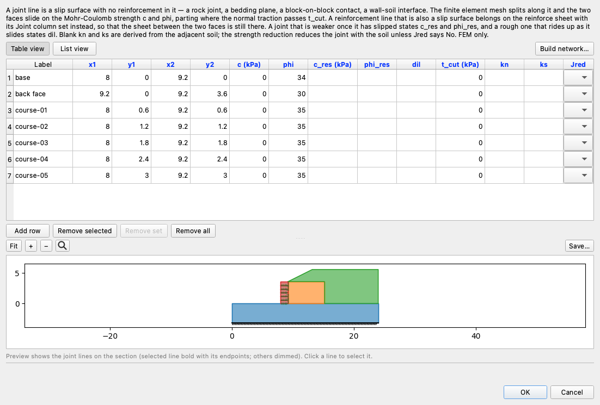{width=1102}

The three friction angles differ because the three contacts do. The base is
block on compacted foundation soil at 34°; the back face is block against
granular fill at 30°, the lowest of the three because the fill is what has to
slide past it; the course joints are block on block at 35°, the manufacturer's
value for a dry, keyless unit. All seven have no cohesion: a dry block contact
and a block-on-granular-fill contact are both cohesionless.

What the columns mean, in the order they appear on the editor:

- **Label** names the line. The model checks, the results panels and the report
  use it whenever they have something to say about a joint, so a name that
  identifies the contact pays for itself the first time a check fires.
- **x1, y1, x2, y2** are the two endpoints. A joint line is straight; a contact
  that turns a corner is entered as two lines meeting at the corner.
- **c** and **phi** are the strength of the surface, in the same units as a
  soil's cohesion and friction angle. `phi` is required.
- **c_res** and **phi_res** are the strength the surface keeps after it has
  slipped once, for a rough joint that shears off its surface roughness and does
  not rebuild it. Blank means no drop: the peak strength carries throughout,
  which is the ordinary case for a manufactured block face.
- **dil** is the dilation angle, how far a rough surface rides up on itself as it
  slides. Blank is zero.
- **t_cut** is the tension the joint can carry across itself before it opens.
  Blank is zero, and zero is right for a block contact: two blocks resting on one
  another carry no tension at all.
- **kn** and **ks** are the normal and shear stiffness of the contact. Left blank
  they are derived from the softer of the two materials the line runs between,
  which is what a contact between a stiff block and a soil should use.
- **Jred** decides whether the strength reduction weakens this joint along with
  everything else. Blank means yes, which is right for a soil or rock contact. It
  is set to `No` only for a joint that stands for a construction detail rather
  than a real surface, a manufactured shear key, say, and none of these do.

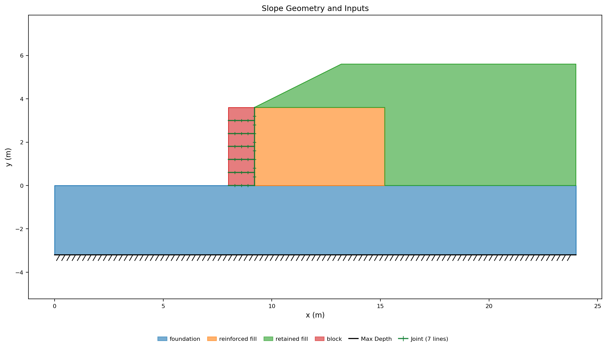{width=1000}

---

### Building the mesh

Build the mesh with **Run → Build Mesh…**: element type **tri6** and a global
target size of **0.8 m**.

A 0.6 m course cannot be resolved at a 0.8 m target size, so each block polygon
carries a local **Size** of **0.3 m** in its own row of the polygons worksheet.
That is the right way to refine a thin zone: dropping the global size to 0.3 m
would refine the whole 24 m section and cost several times the nodes for nothing.

The dialog reports **1,980 nodes, 903 elements, and 36 joint elements on 7
jointed lines**.

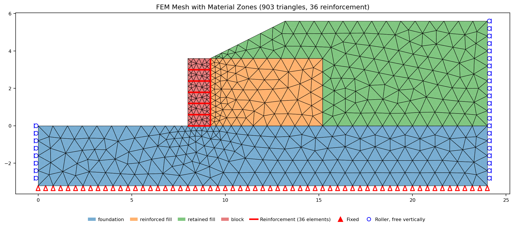{width=1000}

The split does not show on the mesh plot. Each node on a joint line has been
copied once per wedge of material around it, but the copies stand at the same
point, so the picture looks like an ordinary mesh with the jointed lines drawn
over it in their own style. That style is the only sign that the split happened.

---

### Running the wall alone

Open **Run → Run FEM…**. The analysis is **SSRM**, the bracket is *F* from
**1.0** to **2.0** and the tolerance is **0.01**, all of which are the defaults.
Two rows further down there is one setting to change, and one below it to leave
alone once you know what it does.

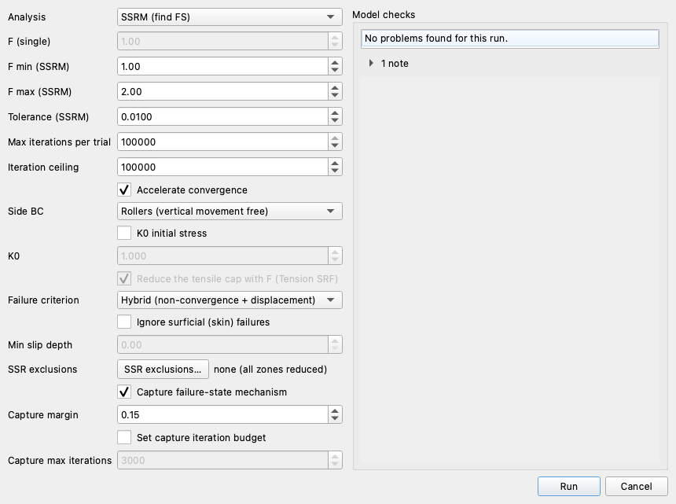{width=860}

**Max iterations per trial — change it to 100,000.** A joint reaches equilibrium
by growing slip, a little on each iteration of the solver, so a jointed model
settles over tens of thousands of iterations where a model without joints settles
over hundreds. A trial that hits the limit before it has settled is counted as
not standing, and the factor of safety then comes out low, because the limit
stopped the trial before the wall had finished moving. The model checks in the
column beside the dialog say so while the limit is left lower. Raising it costs
very little, because a trial that has settled stops there and does not use the
rest. This is the one habit a jointed model asks of you: a trial cut off early
is not a failed trial, and when the closing summary says the factor of safety
depends on the iteration limit, or reports it as "at least", the answer is a
higher limit and the patience to let the run finish.

**Accelerate convergence — leave it ticked.** It is on for any model that
carries a joint. Once the joints have settled into their states the solver
takes longer steps, which brings a jointed trial to rest in a fraction of the
iterations, and the closing summary says when it was on.

**Failure criterion — leave it on Hybrid.** The dialog opens on Hybrid for any
model that carries a joint, because a near-critical trial on a jointed model
often neither settles nor runs away: the joints go on slipping by a fixed
amount each pass while the wall itself stops moving, which is a wall standing
still behind contacts that never quite balance. Hybrid reads the slip and the
movement together and reports that as standing. The other criteria read only
whether the solver reached equilibrium, and on this wall they report every
near-critical trial as a failure — the search then walks its lower bound down to
the floor and gives no factor of safety at all.

Press **Run**. The search takes about **seven minutes** on an ordinary desktop —
nearer twelve on an install that does not carry the
[compiled kernel](../fem/overview.md#fast-kernel) — and reports

<!-- test: file=files/xslope_block_wall.xlsx, type=fem_ssrm, expected_fs=1.137, element_type=tri6, target_size=0.8, tolerance=0.01, f_min=1.0, f_max=2.0, criterion=hybrid, max_iter=100000, benchmark=FEM-3-blocks-ssrm -->

>>**FS = 1.137**

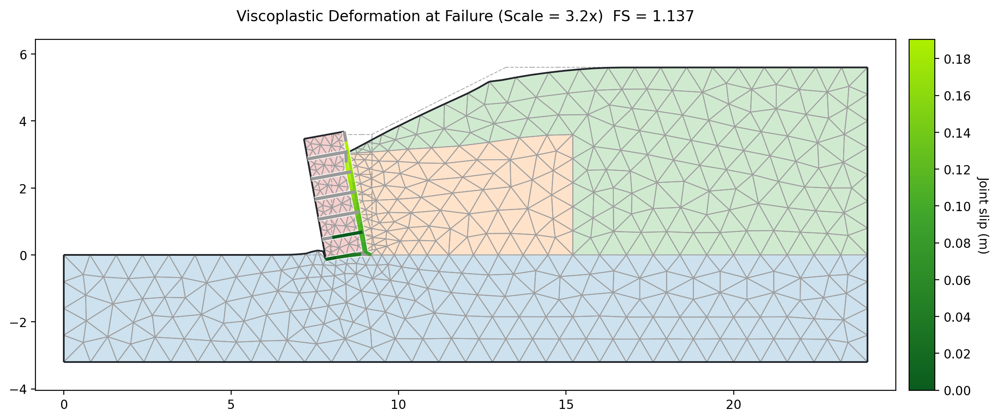{width=1005}

On a jointed model the displacement panel is the deformed section drawn as the
**blocks** the joints cut it into — each block under a faint tint of its own,
the joint faces in green colored by how far they have slid, the undeformed
outline dashed behind, and the whole thing exaggerated by the scale printed in
the title. The element grid steps back to a light gray under the blocks: on a
jointed model the movement happens at the joints, not spread through the
elements, so the faces carry the story and the grid only shows how each block
deformed inside them. Read the panel first. The block column has leaned away
from the fill behind it, and the fill has come forward into the gap.

The slip on the joint faces puts numbers on that, read at the last converged
state, the wall still standing. **1D Details…** on the results
toolbar opens one contact at a time and draws its normal stress, its shear
stress against the Coulomb limit with the slipping stations marked, and its
slip along the line. Here is the back face's:

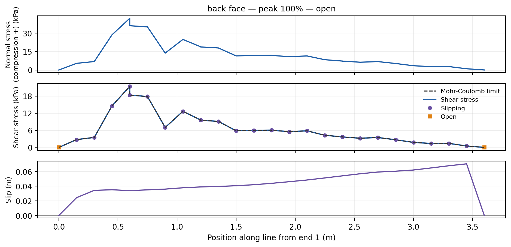{width=1000}

The middle panel marks every station that is slipping, which is all but the
two open ends, and the shear stress sits on the Coulomb limit at each of them,
so the dashed limit line lies under the solid one. The bottom panel is the slip
itself, growing from the base of the column to 70 mm just below the top.
Reading each of the seven contacts the same way gives the count of slipping
stations and the largest slip on each, and the one doing the work is the back
face:

| contact | spans slipping | largest slip |
| --- | :---: | :---: |
| back face | 28 of 30 | 70 mm |
| base | 5 of 9 | 13 mm |
| course-01 | 5 of 9 | under 0.01 mm |
| course-02 to course-05 | none | — |

**The wall failed on its back face.** The block column has slid down past the
fill along its own back, five times as far as it has slid forward on its base,
and the top four course joints have not moved on each other at all — the four
upper courses are travelling as one piece. Modeling the contacts separately is what
makes that visible. A wall meshed as a single solid can only bend, and would have
had nothing to say about which of its seven surfaces was carrying the failure.

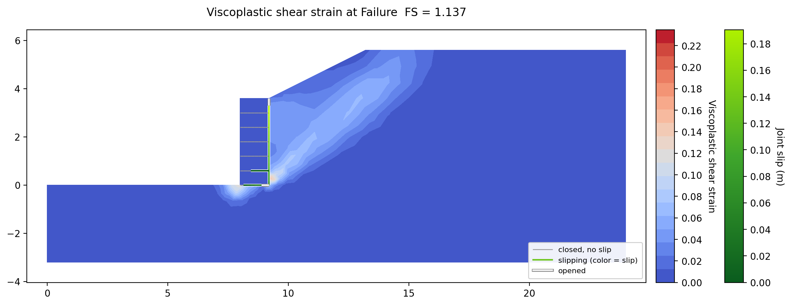{width=1000}

The shear strain shows where the soil is working. The reinforced fill behind the
blocks is straining along a surface that runs up from the heel of the wall, which
is the mass the facing has to hold back.

The fourth plot in the results view, **Displacement vs F**, shows the search
itself: every strength it tried, with the largest displacement the wall reached
there.

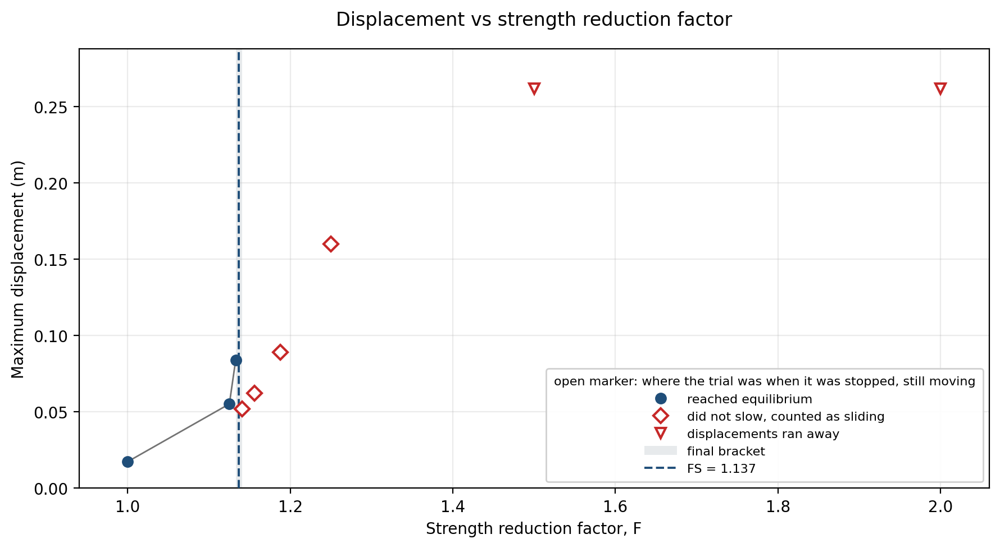{width=800}

A filled point is a strength at which the wall came to rest, and the line joins
those. An open point is a trial the run stopped while the wall was still moving,
drawn where it was when stopped. The wall rests at F = 1.0 and 1.125 with under
6 cm of movement, and at 1.133 with 8 cm. At 1.141 and every strength above it
the movement does not slow, or runs away outright, and the wall never comes to
rest. This wall has a strength limit, and the factor of safety sits where the
resting points end.
The Log says the same in words at the end of every strength reduction run:

> The factor of safety is 1.137, the midpoint of the bracket F = 1.1328 to
> 1.1406. At F = 1.1328 the slope reached equilibrium in 363 iterations. At
> F = 1.1406 it did not: over the last
> 50,000 iterations the movement did not slow (each block of 10,000 iterations
> moved the slope 92% as far as the one before), so the trial was counted as
> sliding.

Read this summary on every run. Part 2 is a run where it says something
different.

A factor of safety of 1.137 is well below what a retaining wall needs. These
blocks are holding the fill back by their own weight alone, and for a 3.6 m wall
with sloping backfill behind it that is not enough. Part 2 adds the geogrid
layers that make the wall work.

---

## Part 2 — The same wall with geogrid

Part 1's wall stands on its own blocks. This part ties three layers of geogrid
into the facing, runs the same wall again, and reads what the sheets add.

### Entering the three layers

Three layers of geogrid go in on the **reinforce** worksheet, reached from the
Inputs tree under **Reinforcement**. They sit on the 0.6 m, 1.8 m and 3.0 m
course joints — every second course — and run 5.0 m back into the reinforced
fill, about 1.4 times the wall height.

Open the editor, switch it to **Table view**, and on the **Show parameters for**
row untick **LEM** and tick **FEM**. That hides the columns the limit equilibrium
methods use and nothing else reads, so the table carries only what this run
needs. Then enter the three rows below, or paste them into the worksheet.

| Label | x1 | y1 | x2 | y2 |
| --- | :---: | :---: | :---: | :---: |
| grid-01 | 9.2 | 0.6 | 14.2 | 0.6 |
| grid-02 | 9.2 | 1.8 | 14.2 | 1.8 |
| grid-03 | 9.2 | 3.0 | 14.2 | 3.0 |

Then the properties, one row per layer. The columns run from Tmax to Joint in
the order the FEM view shows them, so a paste lands each value in its own
column. Tres stays blank; the three layers are alike.

| Tmax | Lp1 | Lp2 | Adhesion | Delta | Tend1 | Tend2 | Spacing | Tres | E | Area | Joint |
| :---: | :---: | :---: | :---: | :---: | :---: | :---: | :---: | :---: | :---: | :---: | :---: |
| 40 | 0 | 0 | 1 | 30 | 40 | 0 | 1 |  | 1000000 | 0.001 | Yes |
| 40 | 0 | 0 | 1 | 30 | 40 | 0 | 1 |  | 1000000 | 0.001 | Yes |
| 40 | 0 | 0 | 1 | 30 | 40 | 0 | 1 |  | 1000000 | 0.001 | Yes |

Lp1 and Lp2 are 0 and grayed: Adhesion and Delta are filled, so the pullout
capacity comes from the overburden and the development lengths are not in use.
**kn** and **ks** stay blank so the interface takes its stiffness from the
fill the sheet lies in, as the wall's own joints do. **Jred** stays blank so
the strength reduction weakens this interface along with the soil, which is
right for a soil-geosynthetic contact: a sheet slipping through fill is a soil
failure, not a construction detail. Type, Dir and Appl are read only by the limit
equilibrium methods, so they do not matter to this run; the completed file has
Type set to Geosynthetic, which is harmless. When the three rows are in, the
editor looks like this:

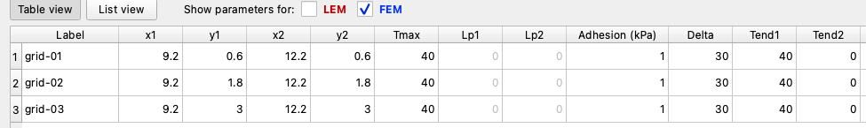{width=975}

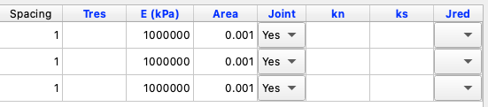{width=551}

What the columns a sheet needs mean, in the order they appear on the editor:

**Tmax** is the tensile capacity of the sheet, 40 kN/m — what it can carry before
it ruptures.

**Adhesion** and **Delta** are the strength of the interface between the sheet
and the soil around it: 1 kPa and 30°. On a bonded bar they set how much grip a
length of sheet develops. On a jointed sheet they are also the strength of the
slip surface the soil moves along, which makes them the two most important
numbers in this section.

**E** and **Area** give the sheet its axial stiffness, 1,000,000 kPa × 0.001 m²,
so EA = 1,000 kN/m. A sheet has to stretch before it can carry tension, and EA
sets how much.

**Tend1** and **Tend2** are the capacities of the two ends. A blank end is free:
it can pull out of the soil, and the only thing holding it is the grip along its
length. A filled end is tied at the stated capacity. Here **Tend1 = 40 kN/m** —
the end at the block column is bolted to the facing at the full capacity of the
sheet — and **Tend2 = 0**, because the far end is simply buried and nothing holds
it but the soil.

**Joint** reads **Yes** on all three. The sheets lie on the contact between the
blocks and the fill and run back through the fill on horizontal planes, which is
exactly the geometry a mass can slide out along. [Part 3](#part-3-when-a-sheet-is-a-slip-surface-and-when-it-is-bonded)
sets out the rule.

{width=1000}

---

### What the geogrid adds

Same wall, same seven joints, same mesh settings, three sheets added. Rebuild
the mesh with **Run → Build Mesh…** at the same settings as Part 1, tri6 at
0.8 m with the 0.3 m block size still on the polygons worksheet.

The mesh grows to **2,139 nodes, 927 elements and 90 joint elements on 10 jointed
lines**. Each jointed sheet adds a jointed line of its own, and it splits the
mesh twice over — the sheet has soil above it and soil below it, so it carries
two interfaces, one against each.

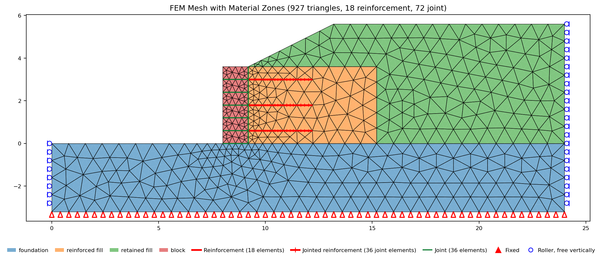{width=1000}

Then open **Run → Run FEM…** and run it exactly as Part 1 did: SSRM, the bracket
from 1.0 to 2.0, tolerance 0.01, **Max iterations per trial** at 100,000 and the
failure criterion on Hybrid. Press **Run**. It takes about twice as long as Part 1,
because the search climbs higher, and reports

<!-- test: file=files/xslope_block_wall_grid.xlsx, type=fem_ssrm, expected_fs=1.5625, fs_bound=lower, element_type=tri6, target_size=0.8, tolerance=0.01, f_min=1.0, f_max=2.0, criterion=hybrid, max_iter=100000, benchmark=FEM-3-grid-ssrm -->

>>**FS ≥ 1.56**

Not a number this time but a bound, and the Log says why:

> No failure was found up to F = 1.5703. The slope came to rest at every
> strength tried up to F = 1.5625, moving further each time; at that strength
> it had moved 0.0767 m. At F = 1.5703 it was still creeping, more slowly all
> the time, when the 100,000-iteration limit came, so the run could not tell
> whether it would stop. The factor of safety is at least 1.56. To go further,
> raise Max iterations per trial.

The wall came to rest at every strength the search confirmed, and at the next
strength up it was still creeping when the iteration limit arrived. The run does
not know whether that trial would have come to rest, so it reports the last
strength it is sure of.

You can tell in Studio that a run ended this way. The results view is titled
with the bound, **FS ≥ 1.56**, instead of a number, the Log carries the
paragraph above, and the results toolbar shows a button that is not there after
an ordinary run, **Continue with a higher limit…**, beside **1D Details…**.
Leave it alone for now. If you stop here you have a complete set of results,
and the next section reads them. The section after that presses the button.

### If you stop here

Here is the Displacement vs F plot from this run:

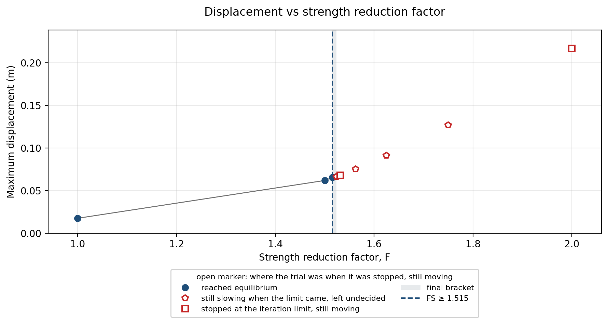{width=800}

Nothing on it is a wall giving way. Every filled point is a strength at which
the wall came to rest, and the movement grows with each one: 2 cm at 1.0, 6 cm
at 1.5, 8 cm at 1.56. The open points above 1.56 are trials that were still
creeping, more slowly all the time, when the limit came. The panels show what
the wall is doing at the last trial, the undecided one at 1.5703.

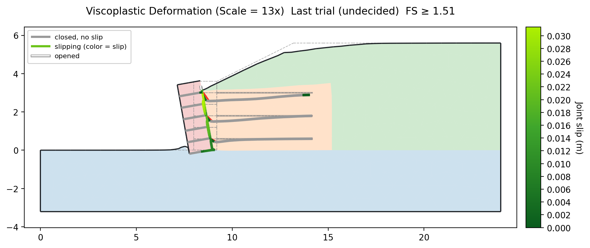{width=937}

This panel has no element grid: the blocks panel drops it once a model carries
more than eight jointed lines (the wall alone had seven; the sheets make ten),
and **Element edges** in the display panel puts it back. Otherwise it is drawn
as in Part 1: the block column 12 times deformed, the undeformed outline dashed
behind it, and every contact a line, gray where closed and not slipping, green
where slipping, shaded by how far. The three geogrid sheets are the
near-horizontal lines running back from the facing, each drawn as the two faces
of its interface: gray where the soil grips the sheet, green over the short
lengths where it has slid, at the facing on all three and near the far end of
the top sheet.

The joint slip puts numbers on what the layers do. With the soil at 64% of its
strength (F = 1.5625), the back face has slid **40 mm** and the base **10 mm**,
and the wall is at rest. Without the layers, the wall had slid 70 mm and 13 mm
with the soil still at 88% of its strength (F = 1.133), and the next step down
in strength brought it down. The layers have turned a wall that slides down its
own back face into one that stands, on a much weaker soil, having slid little
more than half as far.

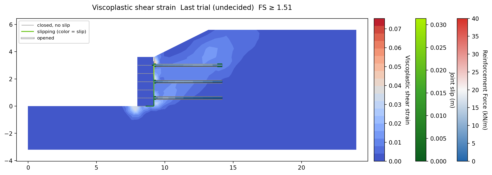{width=1000}

The shear strain panel says the same thing about the soil. Part 1's band ran up
from the heel of the wall through the reinforced fill with strains near 0.05;
here the band is in the same place but faint, and the scale tops out near 0.04.
The three layers have not moved the surface the fill wants to fail on. They have
held the mass behind the facing together so that less of it is straining. The
bars themselves show dark on the reinforcement force scale: they carry little
tension, which the next panel makes exact.

**1D Details…** draws what one layer is doing along its length. Here is the
middle one:

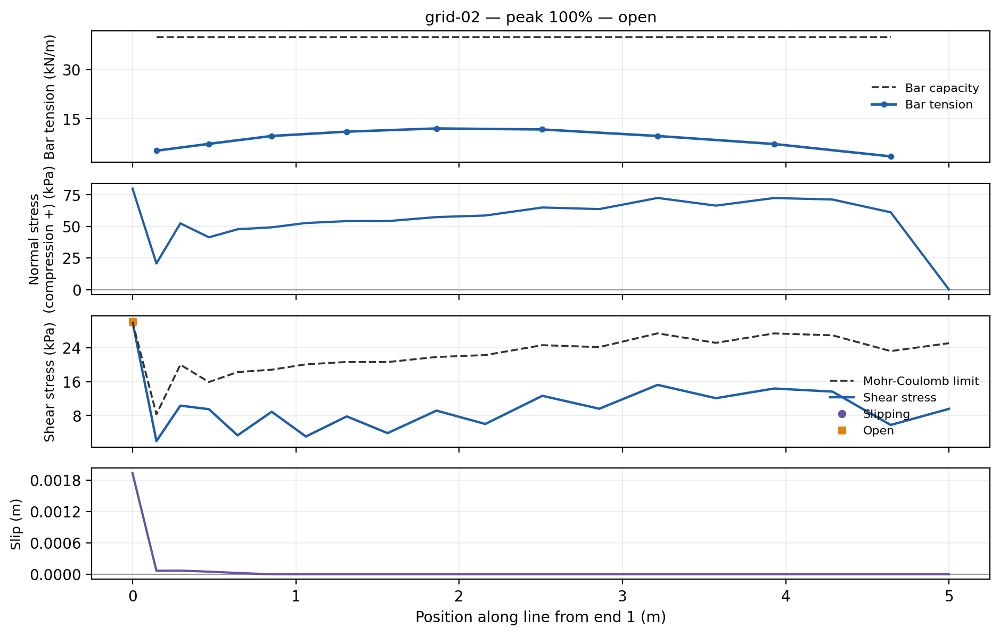{width=1000}

The top panel is the bar's tension along its length against its capacity, a
flat 40 kN/m. The tension peaks at 12 kN/m near the middle of the sheet, **30%**
of capacity: the sheet is carrying real load and has plenty in hand. The three
panels below are the interface between the sheet and the soil: the normal
stress on it, the shear stress against its Mohr-Coulomb limit, and the slip.
The shear stress reaches the limit in one place only, at the facing end, where
the interface has opened and slid 2 mm. Everywhere else the soil grips the
sheet, with the shear well below the limit and no slip. So the geogrid works as
a tie: anchored in fill that does not move, it holds the block column back, and
the force in that tie at the facing is the **Tend1** column of the details
table. The 70% of capacity the layer has in hand keeps this wall standing.

The sheets are entered as jointed sheets (`Joint = Yes`) because they are tied
into a wall whose back face is itself a joint. A bar bonded to the soil cannot
end on a surface the soil is allowed to slide along, so a sheet that meets a
joint has to be a joint too, or stop short of it. At the strength this run
stopped at, the jointing has made little difference yet. Sliding along a sheet
shows in the 1D details as the shear stress sitting on the Mohr-Coulomb limit
over a length of the sheet, with the slip rising along that length, and in the
blocks panel as the sheet's faces turning green along it; here that happens
only in the first few centimeters at the facing. It does not stay that way.
Further up the search, as the next section shows, the outer half of every
sheet slides through the soil, and by the time the wall gives way the sheets
are being dragged out of it, which is something a bonded bar cannot do. Part 3
is about models where jointing the sheet changes the answer from the start.

### If you let it run

The search stopped at 1.56 because it ran out of iterations. To go further,
press **Continue with a higher limit…** on the results toolbar and enter
1,000,000. The search picks up where its trials stopped, keeps every trial it
has already decided, and runs until the wall gives way. You can also start
over from the Run FEM dialog with **Max iterations per trial** at 1,000,000 and
the iteration ceiling raised to match; that gives the same answer. Either way
takes about an hour on an ordinary desktop. Run it if you have the time, or
just read the results below, which come from that run.

With a million iterations to work with, the search climbs all the way to 2.0
and reports

>>**FS = 1.996**

The Log's closing summary reads:

> The factor of safety is 1.996, the midpoint of the bracket F = 1.9922 to
> 2.0000. At F = 1.9922 the slope reached equilibrium in 229,503 iterations. At
> F = 2.0000 it did not: the largest displacement reached 15.0 times the elastic
> value at iteration 210,841. The run took 1 h 9 min.

The Displacement vs F plot shows how the wall got there:

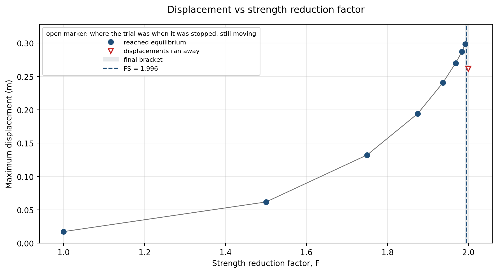{width=800}

The wall comes to rest at every strength tried up to F = 1.9922, and its
movement grows the whole way: 6 cm at 1.5, 13 cm at 1.75, 19 cm at 1.875 and
30 cm at 1.9922, a twelfth of the wall's height. At 2.0 the movement runs away.

So the wall does fail in the end, and what gives out is the geogrid. At
F = 1.9922, the last strength at which the wall came to rest, the top layer is
carrying 98.6% of its 40 kN/m capacity. The middle layer is at 72% and the
bottom layer at 57%. By then the block column has slid 80 mm down its back
face and 25 mm along its base. Here is the 1D details plot for the top layer:

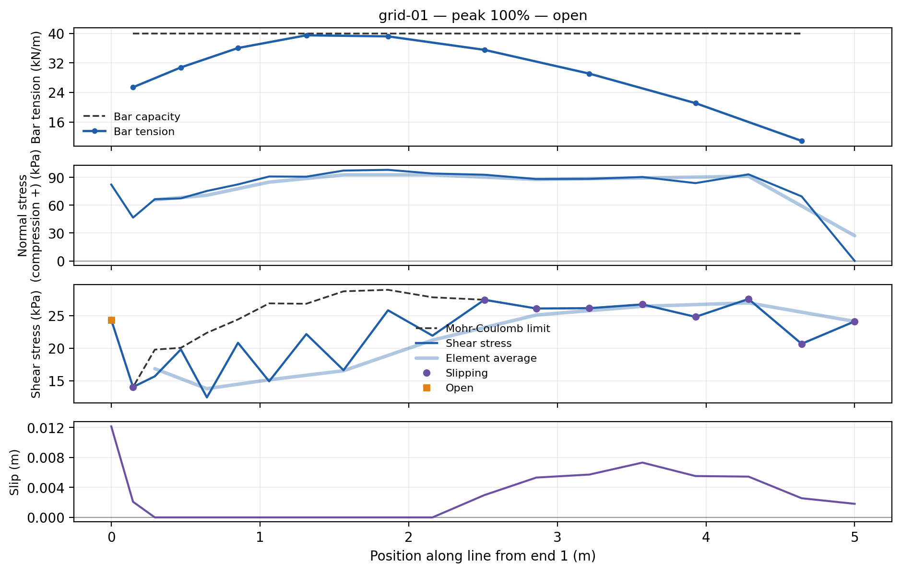{width=1000}

The bar's tension sits on its capacity line over the middle of the sheet, and
the interface beyond 2.3 m is slipping at its limit. Over the first 2.3 m,
where the sheet grips, the shear stress zigzags from station to station
between about 12 and 26 kPa. The stress along the sheet does not swing like
that. Each station reports the force passed through its node over the short
length it stands for, and the average over each element, the force the sheet
actually picks up, runs smoothly at about 17 to 20 kPa. The joints page
[explains why](../fem/joints.md#shear-zigzag). At the sheet's tip, the last
station, the normal stress plots as zero while the Mohr-Coulomb limit does not,
because the two faces of the interface meet at one node there and the limit is
taken from the soil's pressure on the sheet instead. Everywhere else the two
panels use the same stress.

One more step in strength and the top layer has nothing left to give, and the
wall goes. This is the failed state at 2.0, drawn to scale, with no
exaggeration:

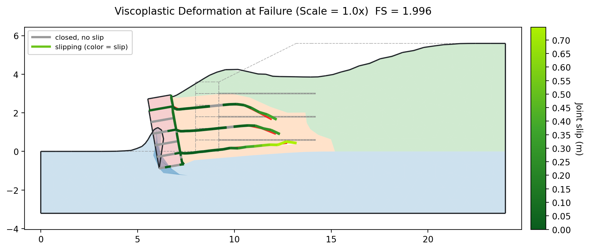{width=929}

The block column has been pushed out more than 2 m and has sunk almost a meter
into the foundation, which has heaved up in front of the toe. The fill behind
the facing has dropped with it, and the ground surface now sits about a meter
and a half below the dashed line that marks where it started. The three geogrid
sheets have gone out with the blocks, their front ends carried along by the
facing and their back ends dragged through the fill, the bottom sheet slipping
the farthest.

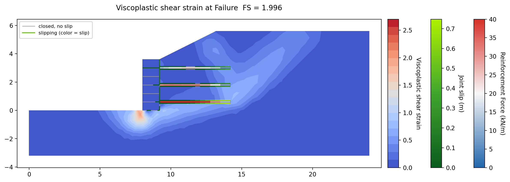{width=1000}

The shear strain is on a different scale from the default run's: it tops out
near 2.6 where the default run's topped out near 0.04. The band runs from under
the toe of the block column, where the wall is punching into the foundation, up
through the reinforced fill and out to the crest. The bars are drawn on the
reinforcement force scale, and at this state the bottom layer is at its
capacity along most of its length, with the middle layer close to it at the
facing.

### What the factor of safety means for this wall

Part 1's wall failed at one strength: the joints let go, and no amount of
waiting brought it to rest. This wall gives way only after the soil is down to
half its strength and the facing has moved 30 cm, a twelfth of its height. Each
time the facing moves it stretches the geogrid, the sheets take more of the
load, and the wall comes to rest a little further out, until the top layer
reaches its capacity.

Long before that, the wall has moved more than any wall in service is allowed
to: 2 cm at F = 1, 6 cm at 1.5, 13 cm at 1.75, 30 cm at 1.99. How much
movement is acceptable depends on what the wall carries and what stands behind
it. Once you have that number, draw it across the Displacement vs F plot; the
strength where the resting points cross that line is the factor of safety on
that criterion. At 1% of the height,
3.6 cm, the crossing lies between 1.0 and 1.5; at 2%, 7 cm, just under 1.56.
For this wall the movement decides the answer.

When modeling a wall like this, you may wish to report the movement along with
the factor of safety. The default run found a wall standing at F = 1.56 with
7.7 cm of movement and the geogrid at a third of capacity, and that says more
than the factor of safety alone.
Read the closing summary on every reinforced wall: when it says *No failure
was found* or gives the factor of safety as *at least*, you have this kind of
wall.

Furthermore, a jointed model can require a long time to solve. It settles
slowly, because each joint reaches equilibrium by slipping a little at a time,
and a trial cut off early reads as failed or undecided when it would have come
to rest. When the closing summary gives the factor of safety as "at least", or
says it depends on the iteration limit, raise the limit and let the run finish.

---

## Part 3 — When a sheet is a slip surface, and when it is bonded

In Part 2 the geogrid layers were entered with `Joint = Yes`. That raises a
question for any model with a geosynthetic in it: should the sheet be a
**bonded bar** or a **slip surface**? The choice is a single cell on the
reinforce worksheet, and the two settings can give very different answers.
Part 3 uses a simpler problem to show when each one is right: an embankment on
a foundation with one sheet at its base, and nothing else in the section that
could slide.

A sheet is entered one of two ways:

- **Bonded**, `Joint` blank or `No`. The soil above the sheet and the soil below
  it move together, and the sheet carries tension across whatever failure
  surface cuts through it. [FEM-2](fem02_reinforcement.md) uses this setting
  throughout: geogrid interlocked in granular fill, a nail wall, a circular
  surface through a reinforced slope.
- **A slip surface**, `Joint = Yes`. The mesh splits along the sheet, and the
  soil above it can slide along it. The sheet's Adhesion and Delta become the
  strength of that surface. This is fill sliding over a smooth geomembrane, a
  woven geotextile on sand whose interface friction is well below the soil's
  own, or the fill of Part 2 running out over the sheets of a block-faced wall.

Which is right depends on where the failure surface wants to go: **across** the
sheet, or **along** it. Getting it wrong in the second case is not a small
error. Two versions of the embankment show both halves of that, one at a time.
The embankment is 5 m high on 2:1 slopes with a 12 m crest, on a 4 m foundation,
with one 32 m sheet under it. Each version is built twice with the `Joint` cell
as the only difference, and each is run at the settings this page has used
throughout.

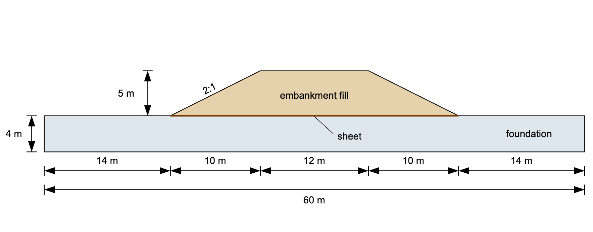{width=1000}

The fill is the same in both: γ = 20 kN/m³, c′ = 5 kPa, φ′ = 34°, E = 25 MPa,
ν = 0.3. The foundation and the sheet are what change.

### A base geotextile on soft clay

The first version is the case where the failure goes through the foundation
and the sheet is loaded across it. The embankment sits on soft clay,
γ = 17 kN/m³, c = 20 kPa, φ = 0, E = 8 MPa, ν = 0.35, and the clay is the weak
part of the section.

The sheet is a base geotextile laid on the clay under the whole fill, 32 m long
with both ends free, Tmax = 100 kN/m and EA = 2000 kN/m. Its interface with the
soil is Adhesion = 5 kPa and Delta = 20°.

Run it first with `Joint` blank, the sheet as a bonded bar,
[xslope_base_geotextile_bonded.xlsx](files/xslope_base_geotextile_bonded.xlsx):

<!-- test: file=files/xslope_base_geotextile_bonded.xlsx, type=fem_ssrm, expected_fs=1.566, element_type=tri6, target_size=1.2, tolerance=0.01, f_min=1.0, f_max=2.0, criterion=hybrid, max_iter=100000, benchmark=FEM-3-sheet-bonded-ssrm -->

>>**FS = 1.566**

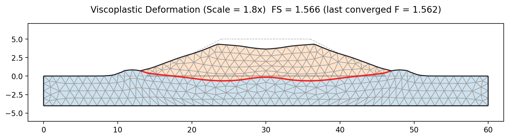{width=1000}

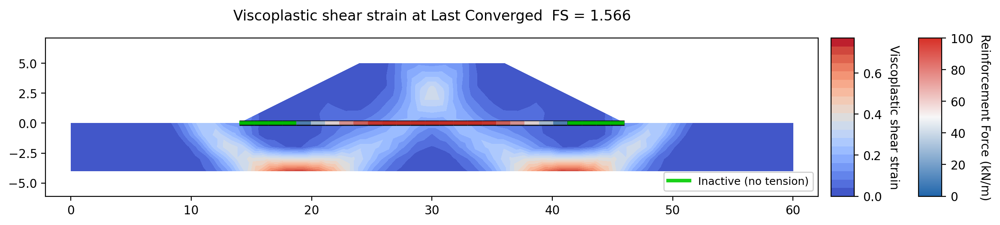{width=1000}

Then `Joint = Yes`,
the sheet as a slip surface,
[xslope_base_geotextile_jointed.xlsx](files/xslope_base_geotextile_jointed.xlsx):

<!-- test: file=files/xslope_base_geotextile_jointed.xlsx, type=fem_ssrm, expected_fs=1.566, element_type=tri6, target_size=1.2, tolerance=0.01, f_min=1.0, f_max=2.0, criterion=hybrid, max_iter=100000, benchmark=FEM-3-sheet-jointed-ssrm -->

>>**FS = 1.566**

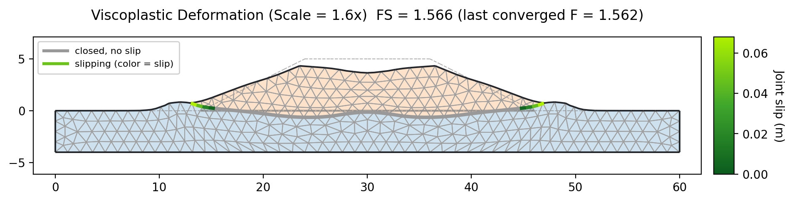{width=1000}

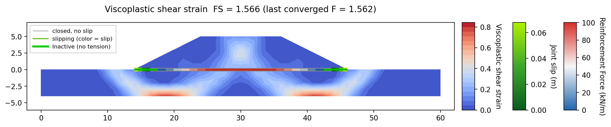{width=1000}

The two agree exactly, and the strain fields show the same failure in both.
The soft clay squeezes out from under the embankment: the strain sits deep in
the clay under both shoulders and comes up outside the
toes, while the fill above rides on it almost intact. The sheet lies across
that mechanism and is stretched by it, to its full 100 kN/m over the middle of
its length in both runs. Very little soil moves along it: 8 of its 55 spans
slip in the jointed run, near the ends. A sheet loaded across a failure is
what a bonded bar models, and the slip surface adds nothing here because
nothing slides on it.

### A smooth geomembrane liner on a firm foundation

The second version turns the first one around. The embankment and its fill
are unchanged. The foundation is made strong and the sheet's interface is made
weak, so that the failure surface can run along the sheet if the model lets
it.

The soft clay becomes a firm foundation, 5 m deep in this pair, γ = 20 kN/m³,
c′ = 30 kPa, φ′ = 32°, E = 50 MPa, ν = 0.3, stronger than the fill above it.
Nothing fails through that.

The base geotextile becomes a smooth geomembrane liner, still 32 m long with
both ends free, Tmax = 50 kN/m and EA = 2000 kN/m. Its interface is the weakest
thing in the section: Adhesion = 0.5 kPa and Delta = 10°, against a fill at
φ′ = 34° and a foundation at φ′ = 32°. If the fill can slide along the liner,
that is where the embankment will fail.

Run it the same two ways. First `Joint` blank, the liner as a bonded bar,
[xslope_liner_bonded.xlsx](files/xslope_liner_bonded.xlsx):

<!-- test: file=files/xslope_liner_bonded.xlsx, type=fem_ssrm, expected_fs=2.167, element_type=tri6, target_size=1.2, tolerance=0.01, f_min=1.0, f_max=2.0, criterion=hybrid, max_iter=100000, benchmark=FEM-3-liner-bonded-ssrm -->

>>**FS = 2.167**

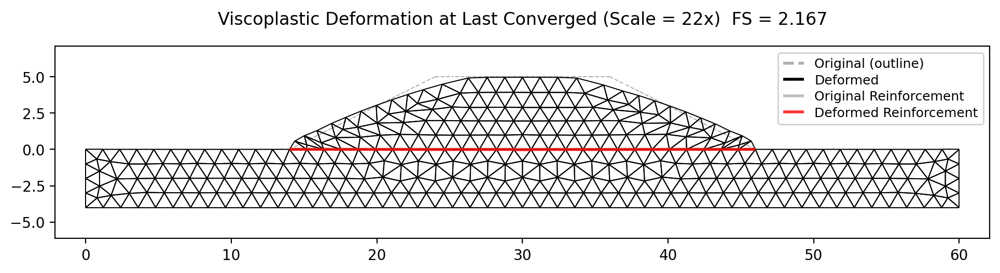{width=1000}

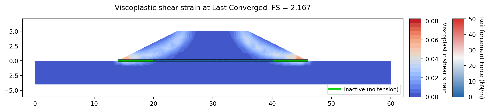{width=1000}

The bonded model has no way for the fill to move along the liner. The
foundation is too strong to fail and the sheet is held to the soil on both
faces, so the weakest thing left is the fill itself, and the strain runs down
both slope faces at 2.17.

Then `Joint = Yes`, the liner as a slip surface,
[xslope_liner_jointed.xlsx](files/xslope_liner_jointed.xlsx):

<!-- test: file=files/xslope_liner_jointed.xlsx, type=fem_ssrm, expected_fs=1.285, element_type=tri6, target_size=1.2, tolerance=0.01, f_min=1.0, f_max=2.0, criterion=hybrid, max_iter=100000, benchmark=FEM-3-liner-jointed-ssrm -->

>>**FS = 1.285**

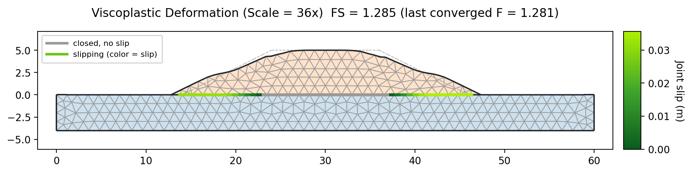{width=1000}

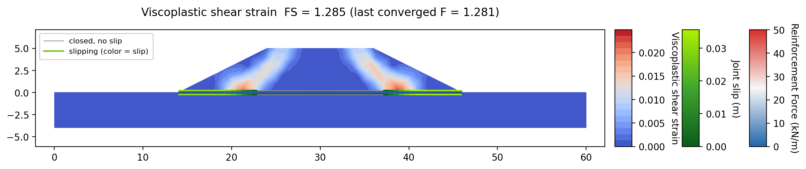{width=1000}

The jointed model lets the fill slide out along the liner instead. Two wedges
of fill, one each side, shear down from the crest edges onto the liner and
slide outward on it: 30 of its 55 spans slip, and the strain in the fill
collects where each wedge meets the sheet. The liner itself carries almost no
tension, dark blue along its whole length on the force scale. The fill slides
over it rather than gripping it, so the membrane's own strength never comes
into play and a stronger one would not help. A fill on a smooth membrane
behaves this way, and it gives way at a far lower strength than the slope
faces do: 1.285 against 2.167, forty percent less. The bonded model never saw it, and reported the slope far
safer than it is.

### The rule

| model | interface δ | as a bonded bar | as a slip surface |
| --- | :---: | :---: | :---: |
| base geotextile on soft clay | 20° | 1.566 | 1.566 |
| smooth geomembrane liner | 10° | 2.167 | 1.285 |

Between them the two pairs bracket the rule. Where the failure does not run
along the sheet, a bonded bar is adequate and cheaper — the jointed model
triples the nodes along the line and adds two interface elements per station for
an answer it already had. Where the failure can run along the sheet, only the
jointed model can find it, and the bonded one overstates the slope. When in
doubt, run it both ways: that is two runs on one file with one cell changed, and
if they agree the question is settled.

### What the model checks say before anything is run

The model checks catch the wrong choice before anything is run. Open the
bonded liner file, the one with `Joint` blank, and the checks column beside the
Run FEM dialog shows three warnings on the liner, each saying that this sheet
should be a slip surface and is entered as a bonded bar:

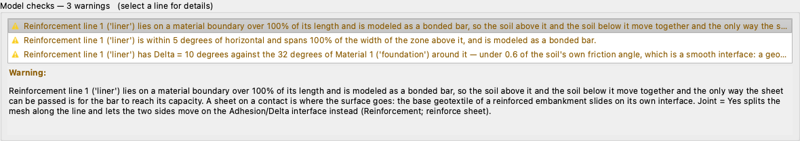{width=1000}

The sheet lies on a material boundary over its whole length. It is within five
degrees of horizontal and spans the full width of the fill above it. Its Delta
of 10° is less than 0.6 of the 32° friction angle of the soil around it, which
makes it a smooth interface rather than a soil-geosynthetic contact. All three
warnings point to the same thing: this is a plane the fill can slide on, and a
bonded bar cannot model that. Set `Joint` to Yes and the warnings go away.

### Why the wall's own sheets could not be run both ways

The geogrid layers in Part 2 cannot be run as bonded bars. Each layer ends on
the back face of the block column, which is a joint line. The mesh splits along
a joint line, so every node on it exists twice, once for the blocks and once for
the fill. A bonded bar has to attach to one node, and at the back face there is
no single node to attach to. The model checks report this, and the mesher will
not build it.

That is why the comparison in Part 3 uses two small models with no other joint
line in them. On a wall like this one the sheets have to be jointed, so the
question does not come up.

---

## Conclusion

This tutorial covered:

- The contacts in a block wall entered as joint lines — under the base, on the
  back face and between every course — and the blocks declared elastic so the
  strength reduction weakens the contacts rather than the concrete.
- Every column of the joints worksheet, what a blank means in each, and where a
  contact's friction angle comes from.
- A local element size on the block polygons, which resolves a 0.6 m course
  without refining the whole section.
- The iteration limit a jointed run needs, and how the displacement-vs-F plot
  and the closing summary tell a wall that fails from one that keeps moving.
- That a trial cut off early is not a failed trial: a jointed model settles
  slowly, and when the summary says the factor of safety depends on the limit
  or reports it as "at least", the answer is a higher limit and patience.
- The wall standing on its own blocks against the same wall with three geogrid
  layers tied into the facing.
- The question every geosynthetic model has to answer — does the surface cut
  across the sheet or run along it — measured both ways on two small models.

**Where to go next:** the [tutorials index](index.md) lists the series.
[Joints and Interface Elements](../fem/joints.md) carries the element and the
split mesh, [Soil Reinforcement](../fem/reinforcement.md) carries the bar, the
interface and the ties, and
[Worksheet: joints](../usage/input_template.md#worksheet-joints) documents the
inputs with the rest of the template. In
[FEM-5](fem05_rock_slope_joints.md) the same element is used with no
reinforcement anywhere near it — a rock slope whose only strength is the strength
of the surfaces cutting through it.
