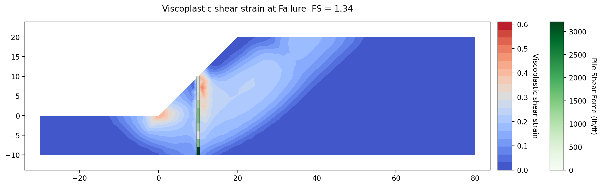
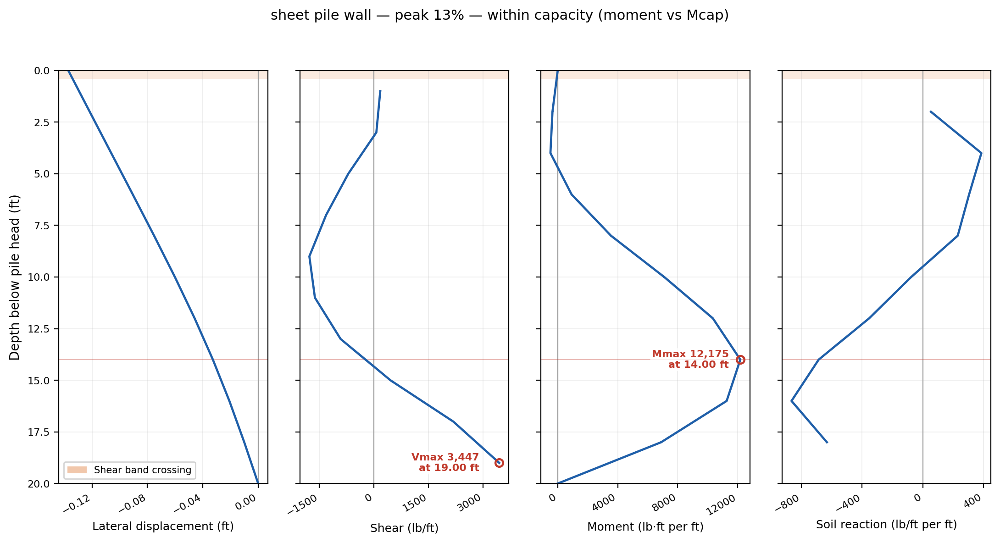
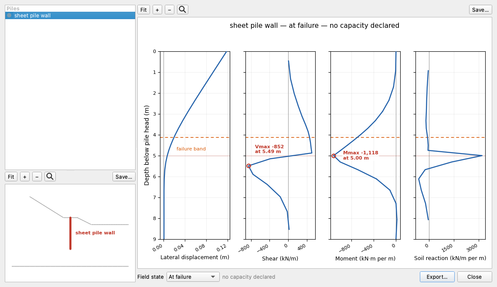

# Tutorial FEM-3 — Piles: LEM vs FEM

This tutorial shows which of XSLOPE's two engines models which kind of pile,
and why that is a question about the structural member itself — the pile row or
the wall — rather than a matter of preference.
Both engines read the same pile rows out of the same file, and they build
different things from them.

A **limit equilibrium** method adds one force where a trial surface crosses a
pile. With the **Ito & Matsui (1975)** method that force is not entered: it is
computed from the pile diameter `D` and the center-to-center spacing `S`, from a
plasticity solution for soil squeezing *between* adjacent piles, and recomputed
for every trial surface.

A **finite element** method meshes the pile into a chain of beam elements
sharing nodes with the soil around it, and divides the beam's axial stiffness
*EA* and its bending stiffness *EI* by `S` so that both are stated per unit
width of section. Nothing is prescribed. The beam carries whatever the deforming
soil pushes onto it, over its whole length rather than at one point, and the run
reports the moment, shear, deflection and soil reaction down the member.

Two things follow from that difference, and both are measured below. A
two-dimensional analysis is **plane strain**: every member in it is continuous
out of plane, so a discrete row put into the finite element engine is a wall
with no gaps for soil to squeeze through. And a beam model computes what the
limit equilibrium force assumes — whether the shaft can develop the moment its
capacity allows — which turns out to depend on what holds the pile at its ends.

Work through [LEM-12](lem12_piles.md) before this page: it builds the pile model
used in the first half and covers the Ito & Matsui force, the structural
capacities that cap it, and what spacing does to a limit equilibrium answer.
[FEM-1](fem01_strength_reduction.md) covers strength reduction, meshing for a
stability run and the controls on the Run FEM dialog. Neither is repeated here.
[LEM-9](lem09_tieback_wall.md) is useful background for the second half, where a
wall appears: it enters its soldier pile the other way, with the force stated
directly per foot of wall.

Analysis
Finite element (strength reduction)

Build &amp; explore
~60 min

**Objectives** — Learn which engine models which kind of pile: why a plane-strain
model turns a discrete row into a wall, what the pile tip is worth to each
engine, what spacing does to both, and how to model a continuous wall and read
the moment, shear and deflection it carries.

pilesIto &amp; Matsuipile spacinghead and tip fixitybeam elementssmeared stiffnessplane strainsheet pile wallcontinuous memberstrength reductionquadratic triangles1D element sizeshear strainmoment and shear profiles

**Pile row model** — [xslope_piles.xlsx](../lem/files/xslope_piles.xlsx), the
completed model from [LEM-12](lem12_piles.md), which is also
[FEM sample problem 2](../fem/samples.md). It already carries both engines'
inputs, so nothing is entered on the first half of this page

**Bare slope** — [xslope_pile_wall_start.xlsx](files/xslope_pile_wall_start.xlsx),
the slope with no structural member in it; it is run first, as the baseline both
halves measure against, and the wall half builds on it

**Wall completed model** — [xslope_pile_wall.xlsx](files/xslope_pile_wall.xlsx),
the same file with the wall row entered; open it to skip to
[the wall's run](#re-meshing-and-running-again). Neither wall file carries a
mesh, so both are meshed on the page

Each strength reduction run below takes from well under a minute to a few
minutes, depending on the machine; the page only says which runs are the slow
ones.

---

## The slope

{width=1000}

The slope is a single medium-stiff clay — γ = 120 pcf, c = 200 psf, φ = 20° —
standing 20 ft at 1:1 over a rigid base 10 ft below the toe, with no water in
it. Two rows of 2 ft drilled shafts at 6 ft centers run down through the face to
the base, the lower at 5 ft from the toe and the upper at 10 ft. Each shaft is a
reinforced concrete section with 46,000 lb of shear capacity and 60,000 lb·ft of
moment capacity.

The sketch also carries what the finite element run reads and the limit
equilibrium run does not: the clay's elastic properties, E = 2.0 × 106 psf
and ν = 0.3, and the shafts' own modulus, E = 5.184 × 108 psf. Unlike
the starter files in [FEM-1](fem01_strength_reduction.md) and
[FEM-2](fem02_reinforcement.md), this model already has all of them, so both
engines run on it as it stands.

### The slope on its own

Before either member goes in, run the slope with nothing in it, both ways. Download
[xslope_pile_wall_start.xlsx](files/xslope_pile_wall_start.xlsx) and open it with
**File → Open…** — the same slope with no structural line in it at all:

{width=1000}

The mode strip opens on **LEM**. **Run → Run LEM…**, `Spencer`, `Auto search`,
40 slices, **Run**: **FS = 1.149**, the search
[LEM-12](lem12_piles.md#what-the-two-rows-are-worth) runs on the same bare slope.

{width=1000}

The critical circle enters at the toe and exits on the crest about 6 ft behind
its edge, dipping only 3 ft below the toe — the shallow surface a 1:1 clay slope
with c = 200 psf and φ = 20° fails on.

Switch the mode strip to **FEM**, click **Run → Build Mesh…** and **Build**: the
file declares **Quadratic triangles (tri6)** with **Auto-size from geometry** off
at `2`, and the mesh comes out at **3,154 nodes and 1,509 triangles** with no
beam elements. Then **Run → Run FEM…** — the file declares the bracket too, so
**F min (SSRM)** and **F max (SSRM)** open on `1.00` and `2.00` — and **Run**.
This is one of the slower runs on the page — noticeably longer than the piled
runs that follow — because a slope closer to failing takes more iterations at
each trial to decide.
**FS = 1.160**, from [1.1563, 1.1641].

{width=1000}

The shear band starts at the toe, where the strain is highest, runs up through
the body of the slope and comes out on the crest 10 to 15 ft behind its edge —
the same surface Spencer found, drawn as a band of strain rather than a line,
and reaching a few feet farther back.

The two engines are 0.011 apart on the bare slope. Every larger difference
between them on the rest of this page comes from how each engine models the
piles or the wall, not from how it models the soil. Both halves of the page
measure against these two numbers.

## The discrete pile row

With the bare slope's two numbers in hand, the first member goes in: the two
rows of drilled shafts from the sketch above, which are already in the model
[LEM-12](lem12_piles.md) built. This half runs that model through both engines,
compares the two answers, sweeps the spacing in each, and then follows the
finite element answer down to the one input that decides it — how the shafts
are held at their toes.

### Opening the model and reading the pile rows

Download [xslope_piles.xlsx](../lem/files/xslope_piles.xlsx) and open it with
**File → Open…**. The mode strip opens on **LEM**, which is where the first run
happens.

{width=1000}

The Inputs plot draws the section, the two pile rows as green bars running from
the face down to the hatched maximum-depth line at elevation −10, and the dashed
red starting circle the file carries for the search.

Open **Piles** in the **Inputs** dock and press **Table view**. Leave both
**Show parameters for:** toggles ticked, because this model is the case where
both bands matter at once:

The columns are colored by which engine reads them. Red is limit equilibrium
only: `H`, the stated pile force, and `Appl`, how that force enters the
equations. `H` is blank on both rows, and that blank is what brings Ito & Matsui
in: with no force stated, the limit equilibrium engine computes one from `D`,
`S` and the soil around the pile; enter a number and that number is used
instead. Blue is finite element only: `E`, `I`, `Area`, and `Head` and `Tip`,
which say whether each end of the member is free to rotate. The black columns
are read by both — `D` and `S`, and also `Vcap` and `Mcap`, which cap the
per-pile force in the limit equilibrium engine and, in the finite element engine,
clip the beam shear at Vcap ÷ S and release a plastic hinge where the beam moment
reaches Mcap ÷ S. On this file every stiffness the finite element model uses
comes from `D` and `S`: `I` and `Area` are blank, so the engine derives the solid
circular section from the diameter,
I = πD⁴/64 and Area = πD²/4, and then divides *EA* and *EI* by the spacing.
That derivation is only right for a solid circular shaft. A pipe pile, an
H-pile or a hollow drilled shaft has its own I and Area, and those are computed
for the section and entered in the two cells; a value in either one overrides
the derivation from `D`. Hovering `S` says what each engine does with it:

> Center-to-center pile spacing. In the LEM, spacing is physics: it sets the
> arching between piles (Ito & Matsui) and makes Vcap/Mcap per-pile. In the FEM,
> S converts per-pile properties to per-unit-width (EA/S, EI/S) — the correct
> plane-strain stiffness of the smeared row; what it cannot model is the soil
> arching between piles.

`Appl` is `active`, meaning the computed force enters the equilibrium equations
as it stands; the alternative, `passive`, divides it by the factor of safety,
and [LEM-12](lem12_piles.md#the-pile-rows) reads the whole row column by column.
Both rows open with `Head` and `Tip` on `free`, which the spacing section below
returns to. Click **Cancel**.

### The limit equilibrium answer

The limit equilibrium run comes first because it is the reference the finite
element run is read against, and because the file is already complete for it.

Click **Run → Run LEM…**, set **Method** to `Spencer` and **Analysis** to
`Auto search`, and leave the slice count at 40. Spencer is the method to compare
against because it satisfies both force and moment equilibrium, which makes it
the closest limit equilibrium statement of what a strength reduction run solves.
Click **Run**.

{width=1000}

**FS = 1.842**, on a deep circle that leaves the ground 13.5 ft beyond the toe
and exits on the crest at x = 35. The two red dots are where it crosses the pile
rows. The rows deliver **4,367.6 lb/ft** to the slices there — 15,244 lb from
each shaft of the lower row and 10,962 lb from each of the upper, both of them
limited by the shafts' moment capacity rather than by what the soil could
supply; [LEM-12](lem12_piles.md#how-the-force-is-computed) works through that
calculation.

### The finite element answer

The same file, the same rows, the other engine. Switch the mode strip to
**FEM**. **Run → Run FEM…** stays disabled until a mesh exists, so build one
first with **Run → Build Mesh…**

Set **Element type** to **Quadratic triangles (tri6)** — a stability mesh has to
be quadratic, and [FEM-1](fem01_strength_reduction.md#building-the-mesh)
measures what linear elements cost. Untick **Auto-size from geometry** and set
**Target element size** to `2`, which is what the
[FEM sample problem](../fem/samples.md) for this model uses. Leave the rest of
the dialog alone. **Refine thin zones** stays ticked as it opens: it drives the
local element size down through any material band thinner than one element, and
this section is a single clay, so it finds nothing to act on. Click **Build**.

The mesh comes out at **3,180 nodes and 1,521 triangles**, with the two pile
rows carried in as constraints and discretized into **18 beam elements** — 8 on
the lower row and 10 on the upper one:

{width=1000}

The two rows are drawn in green, each a chain of beam elements lying on
triangle edges and sharing nodes with the clay on both sides; the base is fixed
and the two vertical boundaries are rollers.

Click **Run → Run FEM…**

**Model checks — 1 warning**, and **Run** is enabled. The warning is the blank
tensile cutoff `t_cut` on the clay, which lets it carry tension up to its
Mohr-Coulomb apex, c/tan(φ) = 549.5 psf;
[FEM-1](fem01_strength_reduction.md#running-the-strength-reduction) covers what
that means and when to enter a cap. The note below it says that the two pile
rows carry a diameter with no `Area` or `I`, so the engine is deriving the solid
circular section — the derivation described above, reported rather than assumed.

Set **F min (SSRM)** to `1.00` and **F max (SSRM)** to `2.00`. A bracket has to
contain the answer, and four of the runs below stand above 1.6 — the pile rows
with their heads fixed, the same rows with their tips fixed, and the tip-fixed
spacing sweep at all three of 3, 6 and 12 ft — so every run on this page uses the
same 1.0 to 2.0 and the answers stay comparable.
Leave everything else as it opens: tolerance 0.0100, **Max iterations per trial**
12,000, **Iteration ceiling** 50,000, **Rollers** on the sides, and
**Non-convergence** as the failure criterion. Click **Run**.

**FS = 1.363**, from a final bracket of [1.3594, 1.3672] in nine trials — two
bracket checks and seven bisections. Spencer's method gave 1.842 on the same
file.

The [FEM sample problem](../fem/samples.md) for this model reports 1.361. It is
run on a bracket of 1.0 to 1.6 rather than 1.0 to 2.0, and at 16,000 iterations
per trial rather than 12,000. A bisection stops once its bracket is narrower than
the tolerance and returns the middle of it, so an answer carries the width of
that last bracket — 0.008 here — and two brackets that start at different points
close on different points inside it. Each of the two answers sits inside the
other's final bracket.

{width=1000}

The contours are viscoplastic shear strain — the shearing left after the elastic
response is subtracted. The band runs up from the flat ground beyond the toe,
past the lower row, and concentrates on the uphill side of the upper row, where
the strain peaks at 0.75 in the element centered on (10.5, 9.0). From there it
reaches the face at the upper row's head, near (10, 10). Nowhere does it pass
*through* a row, because in plane strain there is nothing to pass through: each
row is a continuous obstruction over the full length of the slope, and the
mechanism has to climb over it.

### What spacing does to each engine

A designer adjusts the spacing once the diameter is set, and it is the input
that separates the two engines most sharply. The sweep below runs both of them
across a 4× range in spacing — 3, 6 and 12 ft, S/D 1.5 to 6 — with nothing
changing but the `S` cell on the two rows. Ito & Matsui is applicable for S/D
between about 2 and 8, so the 3 ft point sits below the band and raises the
**Model checks** warning [LEM-12](lem12_piles.md#what-the-spacing-is-worth)
discusses. Each limit equilibrium point is its own Spencer search, because
spacing changes which surface governs.

{width=800}

The limit equilibrium answer falls from 2.193 to 1.409 over that range, 36%.
At 3 ft the search's own critical circle gives 2.193, where
[LEM-12](lem12_piles.md#what-the-spacing-is-worth) reports 2.354 for the same
spacing because its sweep holds the 6 ft circle fixed. The three strength
reduction runs return the same bracket,
[1.3594, 1.3672], and so the same answer, 1.363, with the same verdict at every
trial. The purple line is a second set of strength reduction runs on the same
rows, which the next section comes to.

Run one point of it to see both. Open **Piles**, set `S` to `12` on both rows
with `H` still blank, and **OK**. Search with Spencer again: **FS = 1.409**, and
not on the deep circle the 6 ft spacing found. The 12 ft surface leaves the toe,
reaches 10.1 ft below the ground at its deepest and exits 8.5 ft behind the
crest; the 6 ft circle started 13.5 ft out in front of the toe, ran to 20.7 ft
below the ground at its deepest — elevation −5.1, more than 5 ft below the toe —
and exited 14.9 ft behind the crest. Widening the gap did not only lower the
answer, it changed which surface governs, which [LEM-12](lem12_piles.md#what-the-spacing-is-worth) covers in full.

The mesh is still good: a pile row enters the mesh only as a constraint line, so
Studio throws the mesh away when a row's endpoints move or a row is added or
removed, not when `S` or any other property on it changes. Switch to **FEM** and
**Run → Run FEM…** with the same bracket: **FS = 1.363**, the same answer as at
6 ft, on the same 3,180 nodes and 1,521 triangles.

The flat line is not the model ignoring the spacing column. Over this sweep the
smeared bending stiffness *EI*/S falls fourfold, and what the shafts carry moves
with it. Each row below is read at that spacing's captured mechanism:

| S (ft) | *EI*/S (lb·ft²) | Peak moment per unit width (lb·ft/ft) | Peak moment per shaft (lb·ft) | Fraction of Mcap |
|:---:|:---:|:---:|:---:|:---:|
| 3 | 1.357 × 108 | 4,412 | 13,235 | 22% |
| 6 | 6.786 × 107 | 4,412 | 26,470 | 44% |
| 12 | 3.393 × 107 | 4,412 | 52,941 | 88% |

The moment *per unit width of slope* does not move at all, which is the quantity
the smear holds constant. The moment *per shaft* is that number times the
spacing, so it quadruples, and at 12 ft each shaft is at 88% of its capacity.
Every quantity a designer would check responds to spacing. The factor of safety
does not.

### What the flat line is measuring

Four runs locate what is holding that answer at 1.363. Each changes one thing on
both rows, and each is the same bracket on the same mesh, so the numbers are
comparable to the 1.363 above.

| Change | FS |
|---|:---:|
| the file as it stands | 1.363 |
| shaft modulus `E` × 100 | 1.363 |
| shaft modulus `E` ÷ 100 | 1.277 |
| `Vcap` and `Mcap` cleared | 1.363 |
| `Head` set to `fixed`, tips still free | 1.793 |

Stiffness is not what holds it: a hundredfold stiffer shaft returns the same
answer to four figures, and only a hundredfold *softer* one — a shaft the clay
can bend — moves it, and then only to 1.277. The structural capacities are not
what holds it either: clearing both leaves the answer unchanged, because with
the rows as shipped nothing reaches capacity anyway. What moves the answer is
restraining rotation at an end.

That is a physical question about the shafts rather than a modeling knob. Both
rows run from the face down to the rigid base, and both open with `Head` and
`Tip` on `free`. Each row's bottom node lands on that fixed base. Its
translations are held there, but its rotation is not, so the tip behaves as a pin
and the shaft swings about it: the moment falls to zero at both ends, and at the
captured mechanism the shafts stand at 44% of their moment capacity. A drilled
shaft bearing on rock behaves that way. One socketed into the rock does not, and
`Tip` is the cell that says which it is.

Open **Piles**, set `Tip` to `fixed` on both rows, and **OK** — the mesh
survives a fixity change, as it survived the spacing change. Run the same
bracket again. This is the slowest run on the page, because its trials stand
up to a higher factor and the bracket has further to walk.

**FS = 1.793**, from [1.7891, 1.7969]. Both rows now reach their full
60,000 lb·ft over most of their length: 12 beam elements are at capacity in
bending at the last converged trial, and at the captured mechanism 14 are at
capacity in bending and one in shear. And the failure the run finds is a
different one:

{width=1000}

The deep band that ran up from the flat ground beyond the toe is gone. What is
left daylights at the upper row's head, where the strain peaks at 0.29 against
the free-tip run's 0.75, and runs back from there into the crest — up the face
above the row and along the ground surface to about x = 33 at elevation 15 to 20.
Four elements stand above half that peak, all of them between x = 10.9 and 14.1
at elevation 9.9 to 10.9. The mechanism has moved above the reinforcement
instead of passing through it.

Run the spacing sweep again with the tips fixed and it is flat too, at 1.793,
1.793 and 1.785 for 3, 6 and 12 ft — the purple line on the figure above. This
time the shafts are at their moment capacity at every spacing, the peak moment
per unit width tracking Mcap ÷ S exactly: 20,000, 10,000 and
5,000 lb·ft/ft. Whichever end condition the rows are given, the factor of safety
is decided by the mechanism the smeared wall forces the soil into, not by how
much moment each shaft carries.

Set `Tip` back to `free` on both rows, or reopen the file, before the next
section.

### Which answer is right

With the tips free the two engines are 0.48 apart. With the tips fixed they are
0.049 apart — 1.842 against 1.793, under 3%. The tip condition, not the engine,
is most of the disagreement, and each engine treats it differently.

The limit equilibrium force cannot state a tip condition. It is the smaller of
the Ito & Matsui soil force and what the shaft's structure can carry, and on this
model at 6 ft the structural cap governs: 60,000 lb·ft of moment capacity
divided by the arm from the pressure centroid to the failure surface, and then
by the 6 ft spacing, which
[LEM-12](lem12_piles.md#what-the-structural-capacity-does) works through. That
arm is a cantilever taken as fixed at the slip surface by the embedment below
it, and the limit assumes the shaft develops its full moment capacity there.

The finite element run does not assume it. It computes the moment the soil can
actually push into the member under the restraint the file states, and reports
it. With the toe free the shaft swings about the pin and reaches 44% of capacity
at elevation −4, the elevation the limit equilibrium arm is measured to; fixing
the toe makes it bend against a restraint instead, and it reaches 100%. So the
two engines agree once the model is told what the limit equilibrium method had
already assumed, and the real question is what holds the shaft — bearing on the
stratum, or socketed into it. That is a question about the design, and it is one
cell in the file.

The 3% that is left at 6 ft is a difference in mechanism rather than in force.
Spencer's search returns a deep circle that passes below the toe and daylights
on the flat ground 13.5 ft beyond it; the tip-fixed strength reduction run fails
in the patch of face above the upper row, which is a
shallower and slightly weaker mechanism, and not one the circular search
reports.

Spacing separates the engines for a related reason, and the pile report says
which limit is binding at each point of the sweep. At 3 and 6 ft the moment
capacity governs both rows, and the Ito & Matsui soil force is far above it —
26 and 55 times the force used at 3 ft, 3 and 7 times at 6 ft. Only at 12 ft
does the soil force itself govern, at 6,007 and 15,193 lb per shaft. So over
most of this sweep the falling blue curve is a structural capacity divided by a
widening spacing on a moving critical circle, and arching becomes the binding
mechanism only at the wide end — where the finite element model, having no gaps,
has nothing to represent it with.

### The one problem with a three-dimensional answer

Neither engine gives a three-dimensional answer, and the direction of the
plane-strain error is only known where a three-dimensional reference exists. One
benchmark in XSLOPE's corpus has one. Cai & Ugai (2000) analyzed a
pile-stabilized slope with a strength reduction finite element model that meshes
the individual piles, the soil between them, and the slip interface on each
pile's surface. XSLOPE runs the same slope through both of its engines in
[VP106](../verification/rocscience.md#vp106) and
[the VP106 finite-element diagnostic](../verification/rocscience.md#vp106-fem):

| Case | XSLOPE SSRM (2D beam) | Cai & Ugai 3D FE |
|---|:---:|:---:|
| No pile | 1.136 | 1.14 (−0.4%) |
| Pile at D1/D = 3, free head | 1.453 | 1.36 (+6.8%) |
| Pile, head rotation restrained | 1.570 | 1.45 (+8.3%) |

The unpiled row agrees to 0.4%, which is what makes the other two readable. With
the row in place the plane-strain model credits it ×1.279, where the
three-dimensional model credits ×1.193. On the same slope a Bishop search reads
1.143 with no pile and 1.451 with it, a credit of ×1.269. Both two-dimensional
routes sit above the three-dimensional answer by a comparable amount, and
neither recovers it. What this benchmark settles is the direction of the
plane-strain error, not a ranking of the two routes against each other.

So the reason to take a discrete row's factor of safety from the limit
equilibrium engine is not that its number is larger or smaller. It is that Ito &
Matsui is a theory *of* the three-dimensional mechanism, while the beam model is
a two-dimensional substitute for it. The finite element run on a discrete row
still tells you what the shafts are carrying, and — as the tip runs show — under
what end condition they could carry it.

---

## The continuous wall

{width=1000}

The second half is the case the finite element engine is right for: a member
that really is continuous out of plane. It is the same slope as above — the same
clay, the same 20 ft face, the same rigid base at elevation −10 — with both pile
rows taken out and one **sheet pile wall** put in on the upper row's line, from
the crest of the face at (10, 10) down to the base at (10, −10). The section
drawn above is the first half's, with that one member standing where the two
rows were.

The section is a PZ-27 steel sheet pile, and its properties are per foot of
wall rather than per member:

| Property | Value | From |
|---|---:|---|
| E | 4.176 × 109 psf | 29,000 ksi |
| I | 0.00888 ft⁴/ft | 184.20 in⁴/ft |
| Area | 0.0551 ft²/ft | 7.94 in²/ft |
| Mcap | 90,600 lb·ft/ft | Fy 36,000 psi × S 30.2 in³/ft |

The moment of inertia, the elastic section modulus S and the area are the
published PZ-27 constants, each of them already per foot of wall. The moment
capacity is Mcap = Fy × S = 36,000 psi × 30.2 in³/ft =
90,600 lb·ft/ft, the moment at first yield rather than the plastic moment
Fy × Z, which on this section's plastic modulus of 36.49 in³/ft is 21%
higher. First yield is the right cap for a beam element, because the element is
elastic up to Mcap and releases a plastic hinge at it: nothing in the
formulation carries the partial plastification of the section that lies between
first yield and the full plastic moment, so crediting Fy × Z would
credit a reserve the member never develops.

Nothing else about the model changes, so every number in this half is
comparable to the first half's.

### Adding the wall

The wall goes into the bare slope run [at the top of the page](#the-slope-on-its-own):
reopen [xslope_pile_wall_start.xlsx](files/xslope_pile_wall_start.xlsx) with
**File → Open…** if another file is open.

The wall goes in as one row of the piles table, and which cells it fills is the
content of this step. Open **Piles** in the **Inputs** dock, press **Table
view**, and click **Add row**. The new row opens with its **Label** reading
`Pile`; type `sheet pile wall` over it, which is the name the results panels
use.

Enter the geometry — `x1` 10, `y1` 10, `x2` 10, `y2` −10 — then `E`
`4176000000`, which the cell redisplays as `4.176e+09`, `I` `0.00888` and `Area`
`0.0551` from the table above, `Mcap` `90600`, and `S` `1`. Leave `H`, `D` and
`Vcap` empty.

Each of those follows from the member being continuous. A sheet pile wall has no
out-of-plane gap, so its section constants already are per foot of wall, and a
spacing of 1 passes them into the beam elements unchanged instead of smearing one
member's stiffness over a spacing. `D` is blank because there is no circular
shaft to derive a section from — `I` and `Area` are given directly, which is the
other way the engine accepts a section — and because there is no gap for soil to
squeeze through, so no arching theory applies. `Vcap` is blank because this run
checks the wall in bending only. `H` is blank because a strength reduction run
never uses a stated pile force.

A new row also opens with **Appl** on `active` and both **Head** and **Tip** on
`free`. `Appl` is inert here: it is a limit equilibrium input, and a strength
reduction run never reads it. `Head` `free` is a driven sheet pile with no
capping beam. `Tip` `free` is the wall's toe standing on the base rather than
driven into it, which is the first of the two runs below.

Click **OK**.

### Re-meshing and running again

The wall line is a mesh constraint — the beam elements have to lie on element
edges and share their nodes with the soil — so the mesh has to be built again
with it in place. **Run → Build Mesh…** and **Build**. The mesh comes out at
**3,157 nodes and 1,510 triangles**, one triangle more than the bare slope, with
the wall discretized into **10 beam elements** over its 20 ft:

{width=1000}

Click **Run → Run FEM…**

**Model checks — 1 warning**, the same blank `t_cut` on the clay, and no note
this time: the wall states its own `I` and `Area`, so nothing is derived. The
bracket is already `1.00` to `2.00`. Click **Run**.

**FS = 1.340**, from [1.3359, 1.3438]. The wall takes the slope from 1.160 to
1.340, a credit of ×1.155.

{width=1000}

The band is the pile model's: up from the flat ground beyond the toe, over the
wall, and out at the face just above the wall's head, peaking at 0.68 in the
same element at (10.5, 9.0). One continuous member at x = 10 does to the
mechanism what a smeared row at x = 10 did.

### What the wall carries

This run produces two things. The factor of safety is the first, and the second
is what the wall itself is carrying, which no limit equilibrium analysis can
report. Click **1D Details…** on the results toolbar and select the wall in the
list on the left. Set **Field state** to **Last converged**, which is the state
the numbers below are read at.

{width=1000}

Four profiles, all plotted against depth below the pile head, which is at
elevation 10 — so a depth of 14.00 ft on these axes is elevation −4.00.

The **bending moment** is zero at the head and zero at the toe, which is the
check that the profile is being read the right way round — both ends are free,
so neither can carry a moment — and it peaks at **12,175 lb·ft/ft at a depth of
14 ft**, well down the buried length. That is the shape of a wall whose toe can
turn: the moment builds through the embedded length and comes back to zero at an
end that cannot hold it. The **shear** changes sign twice — positive over the top
3 ft, negative from there to about 14 ft, and positive again below, running to
3,447 lb/ft at 19 ft — and the **soil reaction** changes sign once, between 8 and
10 ft: the clay drives the wall downslope over the upper half of its length and
pushes back over the lower. The **lateral displacement** is 0.137 ft at the head and decays smoothly to zero at the toe.

The peak moment is **13% of the 90,600 lb·ft/ft** the section can carry, which
is what the panel's title reports and why the moment panel draws no capacity
line: the dashed Mcap line appears only when the capacity is within
about three times the peak, and here it would be off the axis. The cap is not
merely unreached but inert — clearing `Mcap` and running again returns
1.340 and the same moment profile.

### Fixing the toe

The wall's toe stands on the rigid base, and the first half's runs showed what
the tip condition is worth to a member that ends there. Open **Piles**, set
`Tip` to `fixed` — a wall driven or socketed into the base rather than standing
on it — and **OK**. The mesh survives the change. Run the same bracket again;
it finishes sooner than the free-tip run, since a slope that is further from
failing decides each trial in fewer iterations.

**FS = 1.543**, from [1.5391, 1.5469]: the credit over the bare slope goes from
×1.155 to ×1.33.

{width=1000}

The band has the same shape as the free-toe run's, and the color bar reads a
different scale: 0.034 at the peak against 0.677, so the collapse the run
captured is twenty times less developed than the free-toe one.

{width=1000}

The moment profile has changed shape, not just scale. It is zero at the head and
largest at the toe — **50,762 lb·ft/ft**, 56% of capacity — which is a member
cantilevered from its base rather than one free to rotate there. The shear no
longer reverses: it holds one sign the whole length, peaking at 4,004 lb/ft at
11 ft. The head moves 0.163 ft.

Switch **Field state** to **At failure**, which is the state the panel opens on:

The moment at the toe reaches the full 90,600 lb·ft/ft, one beam element yields
in bending, and the dashed Mcap lines the moment panel draws are
what the curve is standing on. The list on the left reports the same thing as a
utilization — **100%** beside the wall's name — and the status beside the field
selector reads *at capacity (moment vs Mcap)*. Two runs of the same model, one
cell apart, and the second is the one that needs a section check.

### A finer beam

The wall is ten beam elements over 20 ft, which is the mesh's own element size.
**1D element size** on the Build Mesh dialog sets it independently.

**Run → Build Mesh…**, enter `0.5` in **1D element size**, and **Build**. The
wall is now **40 beam elements**, and the soil mesh refines with it, from 1,510
to **2,418 triangles**, because the constraint line's nodes are the soil mesh's
nodes. Run the same bracket: it takes noticeably longer than the run above.

**FS = 1.551** against 1.543, and the peak moment 49,965 lb·ft/ft against
50,762 — half a percent and one and a half percent. The profiles say where the
run time went:

{width=1000}

The moment curve is the one above. The shear and soil reaction curves are not:
at ten elements they are kinked polylines, and at forty they are smooth curves
with the soil reaction's sign change near the toe resolved. Refine the 1D size
when the profile shapes are the deliverable — a section check down the member, a soil reaction
distribution — and leave it alone when the factor of safety is.

---

## Which engine for which member

| Member | Out of plane | Engine | What it gives |
|---|---|---|---|
| Sheet pile, diaphragm or secant wall | continuous | FEM, spacing `S` = 1 | factor of safety, plus moment, shear, deflection and soil reaction down the member |
| Contiguous or very closely spaced row | nearly continuous | FEM, with the smear stated | the same, with the gap unrepresented |
| Discrete row at spacing | discrete | LEM with Ito & Matsui | factor of safety per spacing, force per row, capacity checks |

The middle row is a judgment rather than a threshold, and the bottom row has a
band of its own: the Ito & Matsui theory applies for S/D between about 2 and 8,
and XSLOPE says so in the **Model checks** panel when a spacing falls outside it
— [LEM-12](lem12_piles.md#what-the-spacing-is-worth) runs the sweep to both
edges.

Two things follow for a discrete row, and both are stated in
[LEM vs. FEM pile modeling](../lem/piles.md#lem-vs-fem-pile-modeling). Take its
factor of safety from the limit equilibrium analysis, and read the finite
element counterpart as a stiffness-and-force study — what the shafts carry, where
they yield, and what their end conditions are worth — rather than as a competing
factor of safety. And do not try to repair the plane-strain smear by adjusting
the pile stiffness or by imposing the Ito & Matsui limit pressure on the beam:
that limit pressure is a theory of the very mechanism the two-dimensional model
does not contain, so applying it there counts the same resistance twice.

Whichever engine gives the factor of safety, the pile tip is an input to state
rather than a default to accept. On the pile rows it moved the strength
reduction answer further than the spacing, the shaft stiffness and the
structural capacities together, and on the wall it was worth 0.20 of factor of
safety.

---

## Conclusion

This tutorial covered:

- What a pile row is to each engine — one computed force at the crossing in the
  limit equilibrium method, a chain of beam elements carrying whatever the soil
  pushes onto them in the finite element method.
- Why a two-dimensional model turns a discrete row into a continuous wall, seen
  in a shear strain field where the mechanism climbs over the rows rather than
  passing through them.
- Why the two engines disagreed on the pile rows: the limit equilibrium force
  assumes each shaft develops its moment capacity, and with both ends free to
  rotate the beam model computes that it does not. Socket the tips and the two
  answers close to within 3%.
- What spacing does to each engine: a 36% swing in the limit equilibrium answer
  and a change in which surface governs, against a strength reduction answer
  that does not move at either tip condition, even though the moment per shaft
  quadruples.
- How a continuous wall is entered — spacing 1, section constants per foot of
  wall, no diameter — and what its toe condition is worth: 1.340 standing on the
  base against 1.543 fixed into it, with the moment peaking inside the embedded
  length in the first case and at the toe in the second.
- What the finite element engine reports that no limit equilibrium analysis can:
  moment, shear, deflection and soil reaction down the member, at whatever
  resolution the 1D element size is set to.

**Where to go next:** [Piles and concrete piers in FEM](../fem/piles.md) carries
the beam formulation, the assembly and the applicability rule in full, and
[stabilizing piles in LEM](../lem/piles.md) carries the Ito & Matsui theory and
the same rule from the other side; [LEM-12](lem12_piles.md) is the pile row on
its own. For a sheet pile wall checked against a published analysis, see
[the SIGMA/W wall benchmark](../verification/geostudio.md#sigmaw-wall).
