# Tutorial FEM-3 — Piles: LEM vs FEM

Here we look at which of XSLOPE's two engines models which kind of pile, and why
that is a question about the structural member itself — the pile row or the wall
— rather than a matter of preference.
Both engines read the same pile rows out of the same file, and they build
different things from them.

A **limit equilibrium** method adds one force where a trial surface crosses a
pile. With the **Ito & Matsui (1975)** method that force is not entered: it is
computed from the pile diameter `D` and the center-to-center spacing `S`, from a
plasticity solution for soil squeezing *between* adjacent piles, and recomputed
for every trial surface.

A **finite element** method meshes the pile into a chain of beam elements
sharing nodes with the soil around it, and divides the beam's axial stiffness
*EA* and its bending stiffness *EI* by `S` so that both are stated per unit
width of section. Nothing is prescribed. The beam carries whatever the deforming
soil pushes onto it, over its whole length rather than at one point, and the run
reports the moment, shear, deflection and soil reaction down the member.

Two things follow from that difference, and we measure both below. A
two-dimensional analysis is **plane strain**: every member in it is continuous
out of plane, so a discrete row put into the finite element engine is a wall
with no gaps for soil to squeeze through. And a beam model computes what the
limit equilibrium force assumes — whether the shaft can develop the moment its
capacity allows — which turns out to depend on what holds the pile at its ends.

Work through [LEM-12](lem12_piles.md) first: that is where we build the pile
model used in the first half, and it covers the Ito & Matsui force, the
structural capacities that cap it, and what spacing does to a limit equilibrium
answer. Strength reduction, meshing for a stability run and the controls on the
Run FEM dialog are covered in [FEM-1](fem01_strength_reduction.md). Neither is
repeated here. [LEM-9](lem09_tieback_wall.md) is useful background for the second
half, where a wall appears: there the soldier pile is entered the other way, with
the force stated directly per foot of wall.

Analysis
Finite element (strength reduction)

Build &amp; explore
~60 min

**Objectives** — Learn which engine models which kind of pile: why a plane-strain
model turns a discrete row into a wall, what the pile tip and the shafts'
capacity do to the finite element answer, what spacing does to both engines, and
how to model a continuous wall and read the moment, shear and deflection it
carries.

pilesIto &amp; Matsuipile spacinghead and tip fixitybeam elementssmeared stiffnessplane strainsheet pile wallcontinuous memberstrength reductionquadratic triangles1D element sizeshear strainmoment and shear profiles

**Pile row model** — [xslope_piles.xlsx](../lem/files/xslope_piles.xlsx), the
completed model from [LEM-12](lem12_piles.md), which is also
[FEM sample problem 2](../fem/samples.md). It already carries both engines'
inputs, so we enter nothing in the first half

**Bare slope** — [xslope_pile_wall_start.xlsx](files/xslope_pile_wall_start.xlsx),
the slope with no structural member in it; we run it first, as the baseline both
halves measure against, and build the wall on it

**Wall completed model** — [xslope_pile_wall.xlsx](files/xslope_pile_wall.xlsx),
the same file with the wall row entered; open it to skip to
[the wall's run](#re-meshing-and-running-again). Neither wall file carries a
mesh, so both are meshed on the page

Each strength reduction run below takes from well under a minute to a few
minutes, depending on the machine; only the slow ones are called out below.

---

## The slope

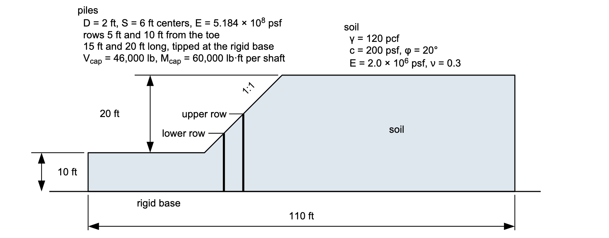{width=1000}

The slope is a single medium-stiff clay — γ = 120 pcf, c = 200 psf, φ = 20° —
standing 20 ft at 1:1 over a rigid base 10 ft below the toe, with no water in
it. Two rows of 2 ft drilled shafts at 6 ft centers run down through the face to
the base, the lower at 5 ft from the toe and the upper at 10 ft. Each shaft is a
reinforced concrete section with 46,000 lb of shear capacity and 60,000 lb·ft of
moment capacity.

The sketch also carries what the finite element run reads and the limit
equilibrium run does not: the clay's elastic properties, E = 2.0 × 106 psf
and ν = 0.3, and the shafts' own modulus, E = 5.184 × 108 psf. Unlike
the starter files in [FEM-1](fem01_strength_reduction.md) and
[FEM-2](fem02_reinforcement.md), this model already has all of them, so both
engines run on it as it stands.

### The slope on its own

Before either member goes in, we run the slope with nothing in it, both ways. Download
[xslope_pile_wall_start.xlsx](files/xslope_pile_wall_start.xlsx) and open it with
**File → Open…** — the same slope with no structural line in it at all:

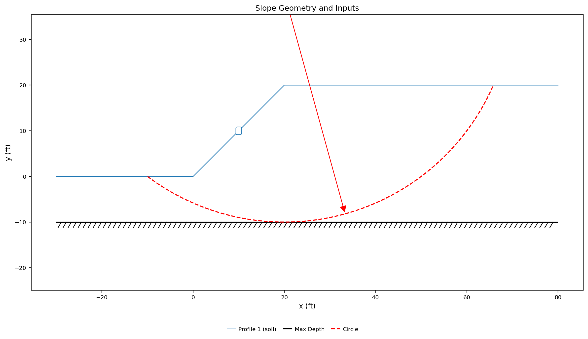{width=1000}

The mode strip opens on **LEM**. **Run → Run LEM…**, `Spencer`, `Auto search`,
40 slices, **Run**: **FS = 1.149**, the same search we run on this bare slope in
[LEM-12](lem12_piles.md#what-the-two-rows-are-worth).

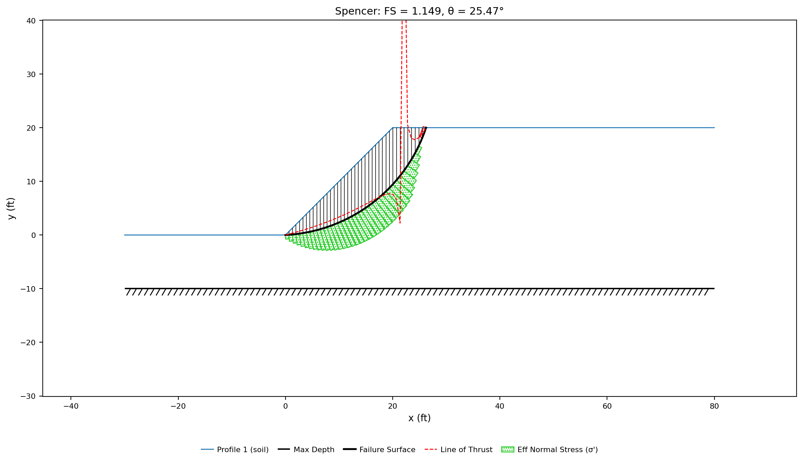{width=1000}

The critical circle enters at the toe and exits on the crest about 6 ft behind
its edge, bottoming at the toe elevation rather than below it — the shallow
surface a 1:1 clay slope with c = 200 psf and φ = 20° fails on.

<!-- test: file=files/xslope_pile_wall_start.xlsx, type=circular_search, method=spencer, num_slices=40, expected_fs=1.149, tolerance=0.005 -->

Switch the mode strip to **FEM**, click **Run → Build Mesh…** and **Build**: the
file declares **Quadratic triangles (tri6)** with **Auto-size from geometry** off
at `2`, and the mesh comes out at **3,154 nodes and 1,509 triangles** with no
beam elements. Then **Run → Run FEM…** — the file declares the bracket too, so
**F min (SSRM)** and **F max (SSRM)** open on `1.00` and `2.00` — and **Run**.
It takes longer than the piled runs that follow, because a slope closer to
failing takes more iterations at each trial to decide.
**FS = 1.137**, from [1.1328, 1.1406].

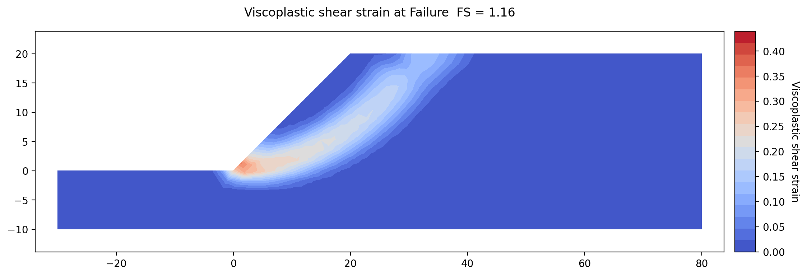{width=1000}

The shear band starts at the toe, where the strain is highest, runs up through
the body of the slope and comes out on the crest 10 to 15 ft behind its edge —
the same surface Spencer found, drawn as a band of strain rather than a line,
and reaching a few feet farther back.

<!-- test: file=files/xslope_pile_wall_start.xlsx, type=fem_ssrm, expected_fs=1.137, element_type=tri6, target_size=2, tolerance=0.01, f_min=1.0, f_max=2.0, benchmark=FEM-3-bare-ssrm -->

The two engines are 0.012 apart on the bare slope, the strength reduction run
reading the lower of the two. Every larger difference
between them on the rest of this page comes from how each engine models the
piles or the wall, not from how it models the soil. Both halves below measure
against these two numbers.

## The discrete pile row

With the bare slope's two numbers in hand, we put the first member in: the two
rows of drilled shafts from the sketch above, already in the model we built in
[LEM-12](lem12_piles.md). We run that model through both engines, compare the two
answers, sweep the spacing in each, and then follow the finite element answer
down to what decides it — how the shafts are held at their ends, and how much
moment their sections can carry.

### Opening the model and reading the pile rows

Download [xslope_piles.xlsx](../lem/files/xslope_piles.xlsx) and open it with
**File → Open…**. The mode strip opens on **LEM**, which is where our first run
happens.

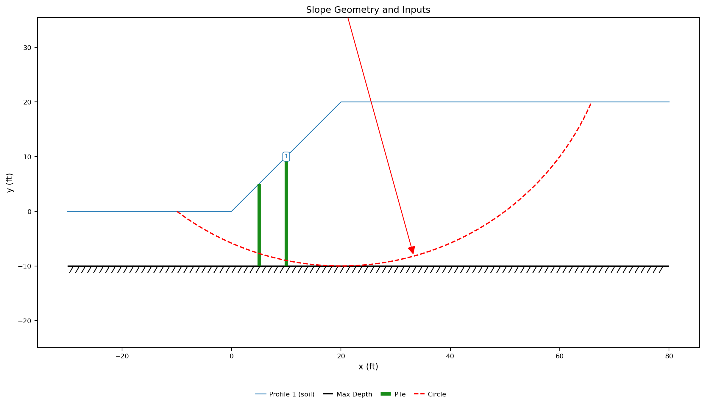{width=1000}

The Inputs plot draws the section, the two pile rows as green bars running from
the face down to the hatched maximum-depth line at elevation −10, and the dashed
red starting circle the file carries for the search.

Open **Piles** in the **Inputs** dock and press **Table view**. Leave both
**Show parameters for:** toggles ticked, because this model is the case where
both bands matter at once:

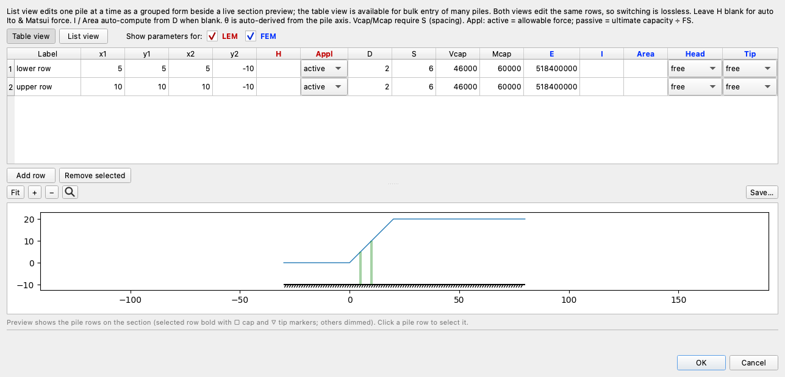

The columns are colored by which engine reads them. Red is limit equilibrium
only: `H`, the stated pile force, and `Appl`, how that force enters the
equations. `H` is blank on both rows, and that blank is what brings Ito & Matsui
in: with no force stated, the limit equilibrium engine computes one from `D`,
`S` and the soil around the pile; enter a number and that number is used
instead. Blue is finite element only: `E`, `I`, `Area`, and `Head` and `Tip`,
which say whether each end of the member is free to rotate. The black columns
are read by both — `D` and `S`, and also `Vcap` and `Mcap`, which cap the
per-pile force in the limit equilibrium engine and, in the finite element engine,
hold the beam shear to Vcap ÷ S and release a plastic hinge where the beam moment
reaches Mcap ÷ S. On this file every stiffness the finite element model uses
comes from `D` and `S`: `I` and `Area` are blank, so the engine derives the solid
circular section from the diameter,
I = πD⁴/64 and Area = πD²/4, and then divides *EA* and *EI* by the spacing.
That derivation is only right for a solid circular shaft. A pipe pile, an
H-pile or a hollow drilled shaft has its own I and Area, and those are computed
for the section and entered in the two cells; a value in either one overrides
the derivation from `D`. Hovering `S` says what each engine does with it:

> Center-to-center pile spacing. In the LEM, spacing is physics: it sets the
> arching between piles (Ito & Matsui) and makes Vcap/Mcap per-pile. In the FEM,
> S converts per-pile properties to per-unit-width (EA/S, EI/S) — the correct
> plane-strain stiffness of the smeared row; what it cannot model is the soil
> arching between piles.

`Appl` is `active`, meaning the computed force enters the equilibrium equations
as it stands; the alternative, `passive`, divides it by the factor of safety, and
the whole row is read column by column in
[LEM-12](lem12_piles.md#the-pile-rows). Both rows open with `Head` and `Tip` on
`free`; we set `Tip` for the finite element run below, and come back to it in a
later section. Click **Cancel**.

### The limit equilibrium answer

We run the limit equilibrium analysis first because it is the reference the
finite element run is read against, and because the file is already complete for
it.

Click **Run → Run LEM…**, set **Method** to `Spencer` and **Analysis** to
`Auto search`, and leave the slice count at 40. We compare against Spencer
because it satisfies both force and moment equilibrium, which makes it the
closest limit equilibrium statement of what a strength reduction run solves.
Click **Run**.

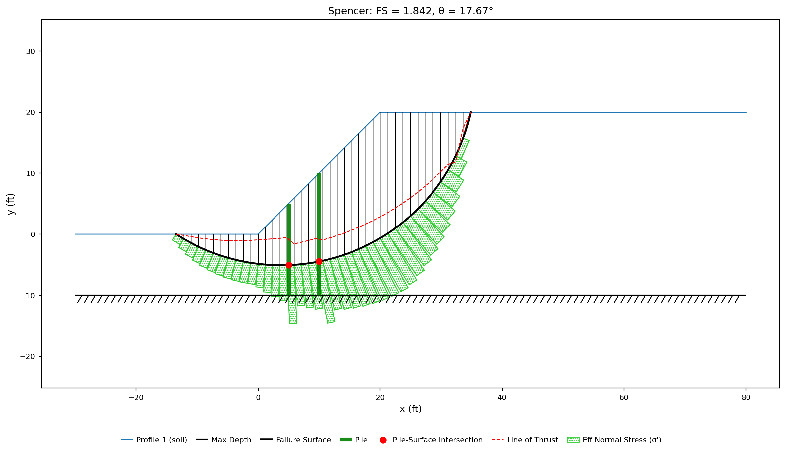{width=1000}

**FS = 1.842**, on a deep circle that leaves the ground 13.5 ft beyond the toe
and exits on the crest at x = 35. The two red dots are where it crosses the pile
rows. The rows deliver **4,367.6 lb/ft** to the slices there — 15,244 lb from
each shaft of the lower row and 10,962 lb from each of the upper, both of them
limited by the shafts' moment capacity rather than by what the soil could
supply. That calculation is worked through in
[LEM-12](lem12_piles.md#how-the-force-is-computed).

<!-- Spencer's 1.842 on this same file at 40 slices is locked by the LEM sample tag on docs/lem/samples.md (Problem 10, fs_spencer=1.842); not duplicated here. -->

### The finite element answer

The same file, the same rows, the other engine. Switch the mode strip to
**FEM**. **Run → Run FEM…** stays disabled until a mesh exists, so build one
first with **Run → Build Mesh…**

Set **Element type** to **Quadratic triangles (tri6)** — a stability mesh has to
be quadratic, and in [FEM-1](fem01_strength_reduction.md#building-the-mesh) we
measure what linear elements cost. Untick **Auto-size from geometry** and set
**Target element size** to `2`, which is what the
[FEM sample problem](../fem/samples.md) for this model uses. Leave the rest of
the dialog alone and click **Build**.

The mesh comes out at **3,180 nodes and 1,521 triangles**, with the two pile
rows carried in as constraints and discretized into **18 beam elements** — 8 on
the lower row and 10 on the upper one:

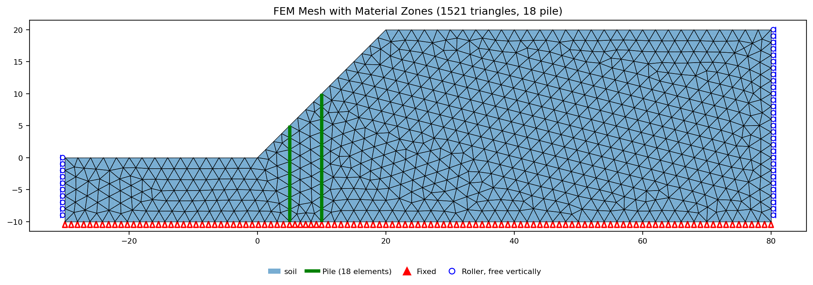{width=1000}

The two rows are drawn in green, each a chain of beam elements lying on
triangle edges and sharing nodes with the clay on both sides; the base is fixed
and the two vertical boundaries are rollers.

One input is still to be stated before the run: where the shafts end. Each row
runs to the rigid base, and a shaft standing on rock is pinned there — held in
place, free to rotate. Open **Piles**, press **Table view**, set `Tip` to
`pinned` on both rows, and **OK**. The mesh is unaffected, because a fixity is
not geometry.

Click **Run → Run FEM…**

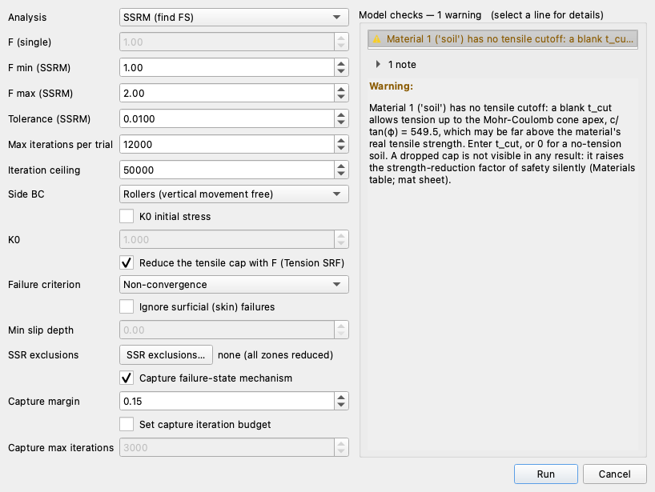

**Model checks** finds no problems, and **Run** is enabled. Two notes sit under
that line. The first says that **Tension SRF** is blank, so the clay's tensile
cutoff — `t_cut` = 0 on this file, a soil that carries no tension at all — is
divided by the trial factor along with *c* and tan φ, which is the engine
default and is the setting
[FEM-1](fem01_strength_reduction.md#running-the-strength-reduction) works
through. The second says that the two pile rows carry a diameter with no `Area`
or `I`, so the engine is deriving the solid circular section — the derivation
described above, reported rather than assumed.

Set **F min (SSRM)** to `1.00` and **F max (SSRM)** to `2.00`. A bracket has to
contain the answer, and the runs on this page range from 1.17 on the bare slope
to 1.79 on the wall of the second half, so every one of them uses the same 1.0 to
2.0 and the answers stay comparable.
Leave everything else as it is and click **Run**.

**FS = 1.363**, from a final bracket of [1.3594, 1.3672] in nine trials — two
bracket checks and seven bisections. Spencer's method gave 1.842 on the same
file.

<!-- test: file=../lem/files/xslope_piles.xlsx, type=fem_ssrm, expected_fs=1.363, element_type=tri6, target_size=2, tolerance=0.01, f_min=1.0, f_max=2.0, benchmark=FEM-3-piles-ssrm -->

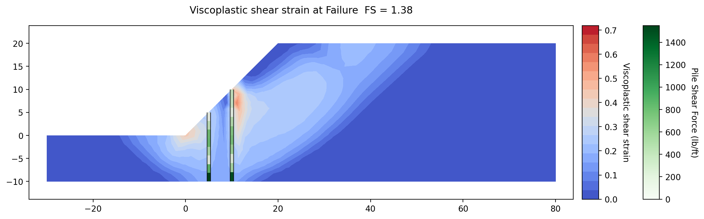{width=1000}

The contours are viscoplastic shear strain — the shearing left after the elastic
response is subtracted — and the two pile lines are drawn in green, each beam
element shaded by the shear force it carries per foot of slope, on the second
color scale. The band starts on the flat ground beyond the toe,
runs down to the rigid base at the pile tips, and comes back up the uphill side
of the upper row to the face at its head, near (10, 10), where the strain peaks
at 0.80 in the element centered on (10.5, 9.0). Nowhere does it pass *through*
a row, because in plane strain there is nothing to pass through: each row is a
continuous obstruction over the full length of the slope. The soil between the
toe and the upper row shears down to the base and carries both rows with it,
each rotating about its toe, and the mass behind the upper row shears past its
head. The shading on the piles says the same thing: the largest shear on each
shaft is at its tip, which the rigid base holds in place while the soil above
drags the shaft — the shear there is the reaction at that pinned toe, and the
shaft is free to rotate about it.

### What decides the finite element answer

Four runs locate what is holding that answer at 1.363. Each changes one thing on
both rows, on the same mesh and the same bracket, so the numbers are comparable
to the 1.363 above.

| Change | FS |
| --- | :---: |
| the file as it stands | 1.363 |
| shaft modulus `E` × 100 | 1.363 |
| shaft modulus `E` ÷ 100 | 1.363 |
| `Vcap` and `Mcap` cleared | 1.363 |
| `Head` set to `fixed`, tips still pinned | 1.496 |

Stiffness is not what holds it: a hundredfold stiffer shaft and a hundredfold
softer one both return the same answer to four figures, and the soft shaft's head
moves 1.40 ft to do it against the shipped section's 0.21 ft. The structural
capacities are not what holds it either. Where a beam element's moment reaches `Mcap` ÷ S the
engine releases a plastic hinge: that section turns freely at the capacity and
carries no more moment however far the shaft bends. Where its shear reaches
`Vcap` ÷ S the element delivers the capacity and no more. With both cells blank
the shaft stays elastic at any moment or shear, with no limit at all. Clearing
them leaves the answer unchanged, because with the rows as shipped nothing
reaches capacity anyway — the shafts peak at 48% of Mcap at the
captured mechanism, so a limit they never meet cannot be what is holding them.
What moves the answer is restraining rotation at an end, and once an end is held
the capacities are no longer spare.

That is a physical question about the shafts rather than a modeling knob. Both
rows run from the face down to the rigid base with `Tip` on `pinned`, as
entered above. Each row's bottom node lands on that fixed base. Its
translations are held there, but its rotation is not, so the tip is a pin and
the shaft swings about it. **Results → 1D Details** on the upper row, on its
default **At failure** field, shows exactly that:

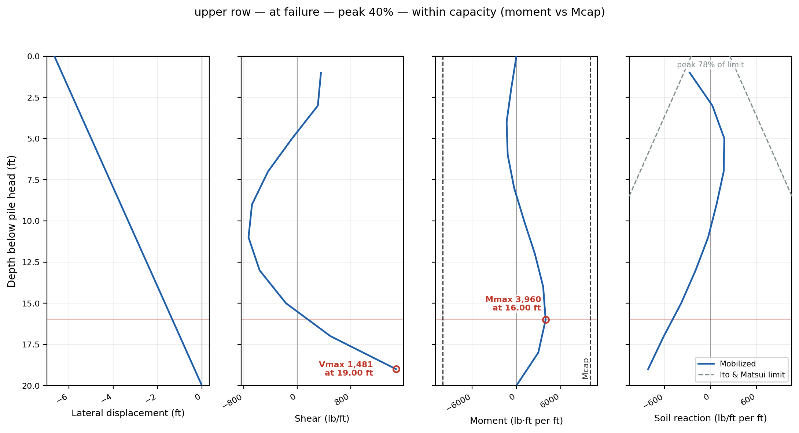{width=1000}

The lateral displacement is a straight line from the head to zero at the toe —
the shaft is rotating as a rigid bar about its pin, not bending. The moment is
zero at both ends, as it must be with neither end held, and peaks at 16 ft
below the head: 4,427 lb·ft per foot of slope, 26,562 lb·ft per shaft, 44% of
the 60,000 lb·ft capacity, with the Mcap lines well outside the curve. The
shear is largest at the toe, the pin reaction. A drilled shaft that stops at
the top of the rock and bears on it behaves that way. One
that is drilled or driven some distance *into* the rock — a rock socket, in
which the rock grips the shaft's lower length and holds it against rotation as
well as translation — does not, and the `Tip` field in the pile properties is
the cell that says which it is. The cell offers four settings, the same four `Head` offers:

| Setting | Translation | Rotation | At a tip, this is |
| --- | --- | --- | --- |
| `free` | free | free | a shaft floating in the soil, or resting on the model boundary |
| `pinned` | held | free | a shaft bearing on a hard stratum inside the mesh |
| `unrotated` | free | held | little use at a tip; offered so the two ends read alike |
| `fixed` | held | held | a shaft socketed into rock |

On this model the tip node sits on the base boundary, which already holds its
translations, so `free` and `pinned` give the same answer. Setting `fixed` is
the only setting that changes anything, and it is the one that models the
socketed shaft.

Open **Piles**, set `Tip` to `fixed` on both rows, and **OK** — the mesh
survives a fixity change, as it survived the spacing change. We run the same
bracket again.

**FS = 1.410**, from [1.4063, 1.4141]. Holding both toes is worth 0.047 here,
and what keeps it from being worth more is the shafts' own capacity: with the
toes held both rows reach the full 60,000 lb·ft, and six of the 18 beam
elements stand at their moment capacity, none at their shear capacity.

The at-failure state this run reports is a shorter one than the pinned run's,
and its title says so: **capture stopped at iteration 38 (runaway)**. Past the
critical strength the engine keeps solving to develop the mechanism its figures
are drawn from, and it stops as soon as the section is unmistakably running
away — here after 38 iterations, with the largest movement in the slope at
0.51 ft. The pinned run needs no such stop: its collapse develops steadily and
that solve runs its whole budget. With both ends of both rows held, this one
never settles, and what is kept is the state the mechanism can be read in rather
than what the arithmetic reaches later.

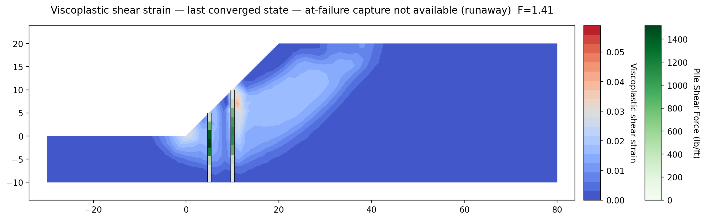{width=1000}

The failure has moved. Where the shipped file's mechanism peaked near the upper
row's head, at (10.5, 9.0), the shearing here is a compact concentration between
the two rows and below them, from about elevation −3 down to −9, peaking at 0.10
in the element centered on (8.9, −5.9), with 14 of the 1,521 elements above half
of that. Light shearing still reaches up the face, but the slope no longer fails
by carrying the rows along with it: held at both ends, the shafts stay where they
are and what mass moves has to pass under them.

Open **Results → 1D Details** on the upper row again, and switch **Field state**
to **Last converged**:

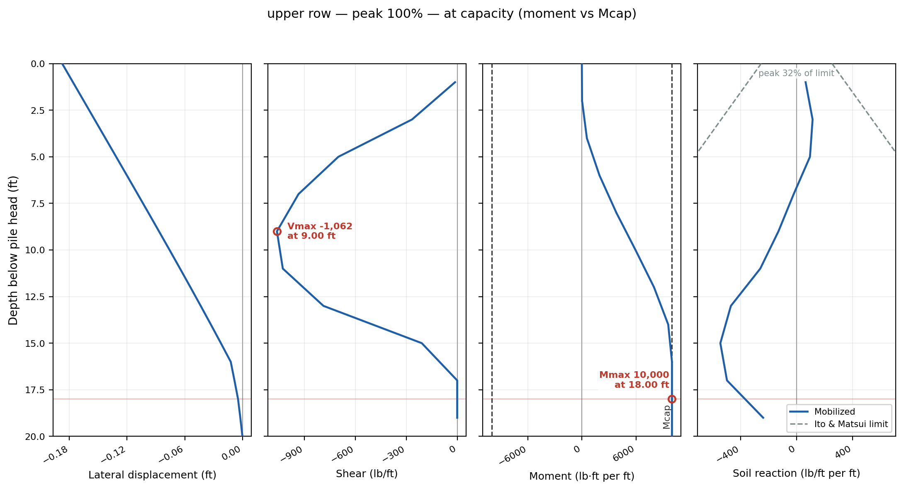{width=1000}

The panel opens on **At failure**, and on this run that field is the stopped
capture above. Its member forces are the elastic demand in a section that is no
longer in equilibrium — tens of millions of lb·ft per foot, alternating from one
element to the next, hundreds of times the capacity those sections are allowed to
carry. That is a picture of the collapse, not a reading of the shaft, so the
shaft is read at the last converged state: the figure above, and where every
number below comes from.

Every panel has changed. The head moves 0.19 ft, and the displacement profile is
curved rather than straight — the shaft is bending now, not rotating about a
pin. The moment is zero at the head, which is
still free, reaches the 10,000 lb·ft per foot that is Mcap ÷ S about
16 ft below the head, and holds it to the toe: those sections have hinged, and
they turn without carrying any more moment. The largest shear is 1,062 lb/ft at
9 ft below the head, and of the opposite sign to the pinned run's: the shaft is
being bent against its toe rather than swung about it.

The soil reaction panel reports the lateral pressure the soil is putting on the
shaft against the Ito & Matsui limit — the largest pressure the theory says soil
can exert on a pile in a row before it squeezes between the piles. The pinned
run's panel puts the peak at 42% of that limit at its captured mechanism; this
one, at the state the slope last stood at, reads 32%. In plane
strain there is no gap for soil to squeeze through, so nothing in the model would
hold that pressure under the limit; the panel reports the ratio so that a row
smeared into a wall can be checked against the theory that does describe the gap.

Held at its toe, the shaft develops the full moment capacity the limit
equilibrium method assumed all along.

Set `Tip` back to `pinned` on both rows before the next section.

### What spacing does to each engine

A designer adjusts the spacing once the diameter is set, and it is the input
that separates the two engines most sharply. The sweep below runs both of
them across a 4× range in spacing — 3, 6 and 12 ft, S/D 1.5 to 6 — with nothing
changing but the `S` cell on the two rows. Ito & Matsui is applicable for S/D
between about 2 and 8, so the 3 ft point sits below the band and raises the
**Model checks** warning discussed in
[LEM-12](lem12_piles.md#what-the-spacing-is-worth). Each limit equilibrium point
is its own Spencer search, because spacing changes which surface governs.

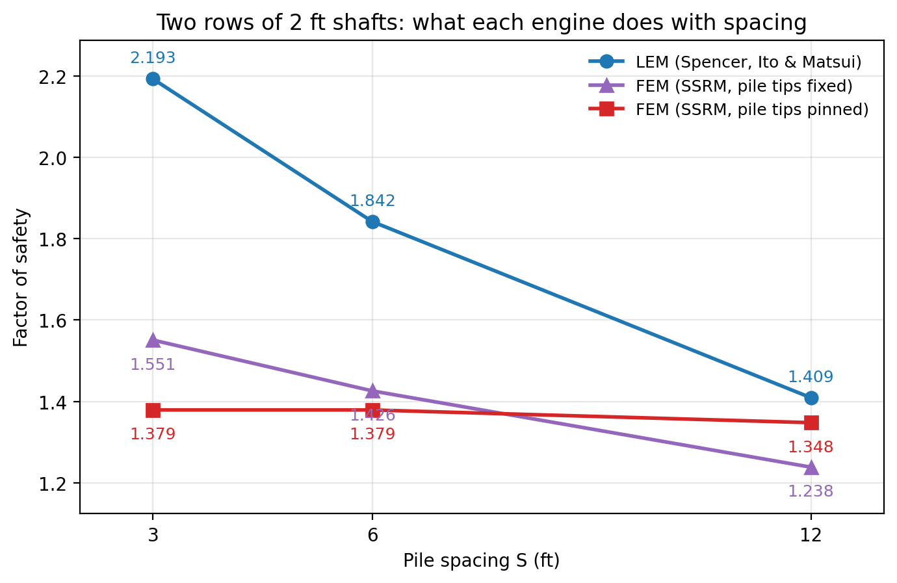{width=800}

The limit equilibrium answer falls from 2.193 to 1.409 over that range, 36%.
With the tips pinned the strength reduction answer barely moves: 1.363 at 3 ft
and again at 6 ft, on the same bracket [1.3594, 1.3672] and with the same
verdict at every trial, and 1.324 at 12 ft.

The tip-fixed rows of the last section, swept the same way, do not hold still —
1.543, 1.410 and 1.238, the upper line on the plot. Spacing reaches the finite
element model as the divisor on Mcap as well as on the stiffness, so
the wider the shafts are set the less moment the smeared row can carry per foot
of slope, and the sooner its sections hinge. At 12 ft the tip restraint has
stopped paying: the row is weaker than the same row free to turn on its toes.

The pinned-tip line is not the model ignoring the spacing column. Over this sweep the
smeared bending stiffness *EI*/S falls fourfold, and what the shafts carry moves
with it. Each row below is read at that spacing's captured mechanism:

| S (ft) | *EI*/S (lb·ft²) | Peak moment per unit width (lb·ft/ft) | Peak moment per shaft (lb·ft) | Fraction of Mcap |
| :---: | :---: | :---: | :---: | :---: |
| 3 | 1.357 × 108 | 4,752 | 14,257 | 24% |
| 6 | 6.786 × 107 | 4,752 | 28,514 | 48% |
| 12 | 3.393 × 107 | 5,093 | 61,116 | 102% |

At 3 and 6 ft the moment *per unit width of slope* does not move at all, which
is the quantity the smear holds constant, so the moment *per shaft* is that
number times the spacing and doubles when the spacing does. At 12 ft the shafts
run into their ceiling instead: Mcap ÷ S is 5,000 lb·ft per foot
there, six of the 18 beam elements have hinged at the captured mechanism, and
each shaft is carrying the whole 60,000 lb·ft it has. Every quantity a designer
would check responds to
spacing. The factor of safety follows only once the capacity binds.

### Which answer is right

Neither engine is wrong; they answer different questions about the shafts.

The limit equilibrium force assumes each shaft develops its full moment
capacity at the failure surface — it has no way to say otherwise. The finite
element run computes how much of that capacity the toe restraint actually lets
the shaft develop. At the 6 ft spacing the model was built with, a shaft that
can turn on its toe develops 48% of it and the run answers 1.363; socketing the
toe puts both rows on their capacity and the run answers 1.410. So the choice
between 1.36 and 1.41 is a question about the shaft — bearing on the rock, or
socketed into it — and it is one cell in the file. Both answers stay well under
Spencer's 1.842.

Spacing is where the engines part company for good. The limit equilibrium
answer falls with spacing because its force is a capacity divided by a widening
spacing. The finite element answer falls only where that widening thins the
row's moment capacity per foot of slope; nothing in it responds to the gap
between the shafts, because a plane-strain wall has no gap for the soil to arch
across. Ito & Matsui is the only model on this page of what happens in that gap,
and it matters most at the wide end of the sweep.

### The one problem with a three-dimensional answer

Neither engine gives a three-dimensional answer, and the direction of the
plane-strain error is only known where a three-dimensional reference exists. One
benchmark in XSLOPE's corpus has one. Cai & Ugai (2000) analyzed a
pile-stabilized slope with a strength reduction finite element model that meshes
the individual piles, the soil between them, and the slip interface on each
pile's surface. XSLOPE runs the same slope through both of its engines in
[VP106](../verification/rocscience.md#vp106) and
[the VP106 finite-element diagnostic](../verification/rocscience.md#vp106-fem):

| Case | XSLOPE SSRM (2D beam) | Cai & Ugai 3D FE |
| --- | :---: | :---: |
| No pile | 1.136 | 1.14 (−0.4%) |
| Pile at D1/D = 3, free head | 1.497 | 1.36 (+10.1%) |
| Pile, head rotation restrained | 1.587 | 1.45 (+9.4%) |

The unpiled row agrees to 0.4%, which is what makes the other two readable. With
the row in place the plane-strain model credits it ×1.318, where the
three-dimensional model credits ×1.193. On the same slope a Bishop search reads
1.143 with no pile and 1.451 with it, a credit of ×1.269. Both two-dimensional
routes sit above the three-dimensional answer by a comparable amount, and
neither recovers it. What this benchmark settles is the direction of the
plane-strain error, not a ranking of the two routes against each other.

So the reason to take a discrete row's factor of safety from the limit
equilibrium engine is not that its number is larger or smaller. It is that Ito &
Matsui is a theory *of* the three-dimensional mechanism, while the beam model is
a two-dimensional substitute for it. The finite element run on a discrete row
still tells you what the shafts are carrying, and — as the tip runs show — under
what end condition they could carry it.

---

## The continuous wall

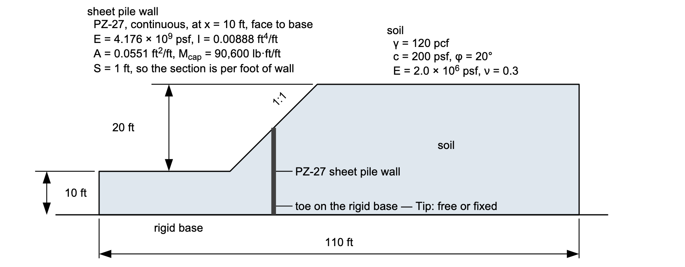{width=1000}

The second half is the case the finite element engine is right for: a member
that really is continuous out of plane. It is the same slope as above — the same
clay, the same 20 ft face, the same rigid base at elevation −10 — with both pile
rows taken out and one **sheet pile wall** put in on the upper row's line, from
the crest of the face at (10, 10) down to the base at (10, −10). The section
drawn above is the first half's, with that one member standing where the two
rows were.

The section is a PZ-27 steel sheet pile, and its properties are per foot of
wall rather than per member:

| Property | Value | From |
| --- | :---: | :---: |
| E | 4.176 × 109 psf | 29,000 ksi |
| I | 0.00888 ft⁴/ft | 184.20 in⁴/ft |
| Area | 0.0551 ft²/ft | 7.94 in²/ft |
| Mcap | 90,600 lb·ft/ft | Fy 36,000 psi × S 30.2 in³/ft |

The moment of inertia, the section modulus and the area are the published
PZ-27 constants, each already per foot of wall. The moment capacity entered is
the moment at which the steel first yields: Mcap = Fy × S
= 36,000 psi × 30.2 in³/ft = 90,600 lb·ft/ft. A steel section can carry about
20% more than that before it is fully plastic, but the beam element does not
model that reserve: it stays elastic up to Mcap and forms a hinge
there. So the capacity entered is the first-yield moment.

Nothing else about the model changes, so every number in this half is
comparable to the first half's.

### Adding the wall

The wall goes into the bare slope run [at the top of the page](#the-slope-on-its-own):
reopen [xslope_pile_wall_start.xlsx](files/xslope_pile_wall_start.xlsx) with
**File → Open…** if another file is open.

The wall goes in as one row of the piles table, and which cells it fills is what
this step is about. Open **Piles** in the **Inputs** dock, press **Table
view**, and click **Add row**. The new row opens with its **Label** reading
`Pile`; type `sheet pile wall` over it, which is the name the results panels
use.

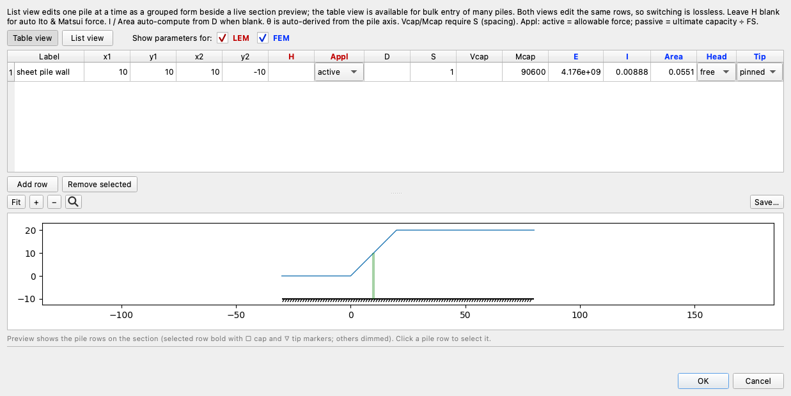

Enter the geometry — `x1` 10, `y1` 10, `x2` 10, `y2` −10 — then `E`
`4176000000`, which the cell redisplays as `4.176e+09`, `I` `0.00888` and `Area`
`0.0551` from the table above, `Mcap` `90600`, and `S` `1`. Leave `H`, `D` and
`Vcap` empty.

Each of those follows from the member being continuous. A sheet pile wall has no
out-of-plane gap, so its section constants already are per foot of wall, and a
spacing of 1 passes them into the beam elements unchanged instead of smearing one
member's stiffness over a spacing. `D` is blank because there is no circular
shaft to derive a section from — `I` and `Area` are given directly, which is the
other way the engine accepts a section — and because there is no gap for soil to
squeeze through, so no arching theory applies. `Vcap` is blank because this run
checks the wall in bending only. `H` is blank because a strength reduction run
never uses a stated pile force.

A new row also opens with **Appl** on `active` and both **Head** and **Tip** on
`free`. `Appl` is inert here: it is a limit equilibrium input, and a strength
reduction run never reads it. `Head` `free` is a driven sheet pile with no
capping beam. Set `Tip` to `fixed`: a sheet pile is driven into the base, not
stood on it, and the first half measured what that restraint does.

Click **OK**.

### Re-meshing and running again

The wall line is a mesh constraint — the beam elements have to lie on element
edges and share their nodes with the soil — so the mesh has to be built again
with it in place. **Run → Build Mesh…** and **Build**. The mesh comes out at
**3,157 nodes and 1,510 triangles**, one triangle more than the bare slope, with
the wall discretized into **10 beam elements** over its 20 ft:

{width=1000}

Click **Run → Run FEM…**

**Model checks** finds no problems, and carries the same **Tension SRF** note as
the pile run. There is no second note this time: the wall states its own `I` and
`Area`, so nothing is derived. The bracket is already `1.00` to `2.00`. Click
**Run**.

**FS = 1.723**, from [1.7188, 1.7266]. The wall takes the slope from 1.137 to
1.723, a credit of ×1.52.

<!-- test: file=files/xslope_pile_wall.xlsx, type=fem_ssrm, expected_fs=1.723, element_type=tri6, target_size=2, tolerance=0.01, f_min=1.0, f_max=2.0, benchmark=FEM-3-wall-ssrm -->

{width=1000}

The band takes much the route the pile model's did — up from the toe, over the
wall, and out on the crest behind it — and it concentrates in two places, at the
toe and on the uphill side of the wall's head. The strain peaks at the toe, at
0.36 against the pile model's 0.80.

### What the wall carries

This run produces two things. The factor of safety is the first, and the second
is what the wall itself is carrying, which no limit equilibrium analysis can
report. Click **1D Details…** on the results toolbar and select the wall in the
list on the left. Set **Field state** to **Last converged**, which is the state
the numbers below are read at.

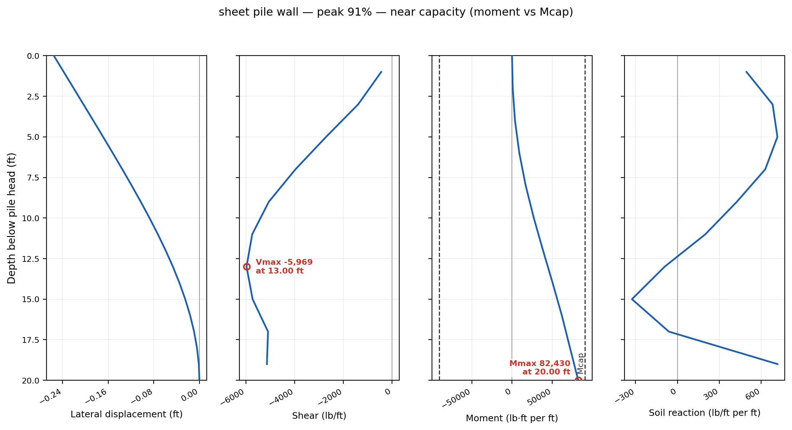{width=1000}

Four profiles, all plotted against depth below the pile head, which is at
elevation 10 — so a depth of 14.00 ft on these axes is elevation −4.00.

The **bending moment** is zero at the head, which is free, and largest at the
toe — **82,430 lb·ft/ft**, 91% of what the section can carry — which is the
shape of a member cantilevered from its base. The dashed Mcap lines on
the moment panel are the capacity, and the curve runs up to just inside the
positive one at the toe; the panel's title reads *near capacity* and gives that
91%. The panel draws those lines whenever the capacity is within about three
times the peak. The **shear** holds one sign the whole length, peaking at
5,969 lb/ft at 13 ft. The **soil reaction** changes sign near 12 ft — the clay
drives the wall downslope over its upper length and the soil below pushes back —
and swings positive again over the last 2 ft, where the fixed toe is held. The
**lateral displacement** is 0.255 ft at the head and decays smoothly to zero at
the toe.

Switch **Field state** to **At failure**, which is the state the panel opens on:

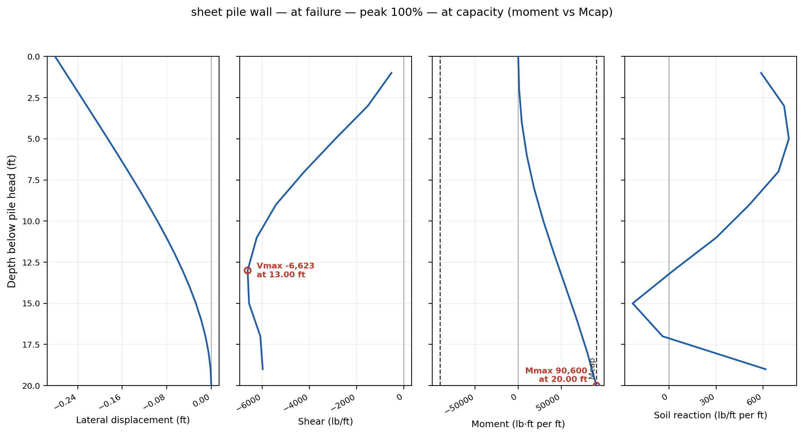{width=1000}

The extra movement takes the toe the last 9% to its capacity: the moment there
reaches the whole 90,600 lb·ft/ft, one beam element has yielded in bending, and
the title now reads *at capacity*. The shear grows with it, from 5,969 to
7,124 lb/ft, and its peak moves from 13 ft down to the toe. A wall that carries
91% of its section at the answer and the whole of it at the collapse the run
captured is one to check the section of.

### A finer beam

The profiles above are drawn from ten beam elements over 20 ft — one every
2 ft, because the wall was meshed at the soil's element size. That is enough
to put the moment where it belongs, but the shear and soil-reaction curves are
polylines with a kink every 2 ft, and a section check reads those curves. The
wall can be meshed finer than the soil without refining the whole model:
**1D element size** on the Build Mesh dialog sets the element length along
every reinforcement and pile line on its own.

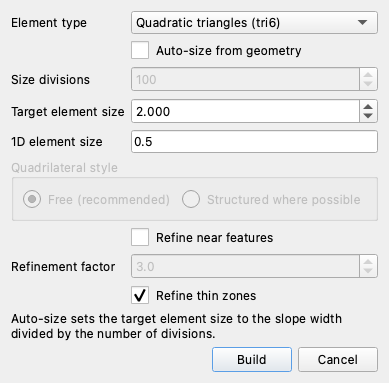

**Run → Build Mesh…**, enter `0.5` in **1D element size**, and **Build**. The
wall is now **40 beam elements**, and the soil mesh refines with it, from 1,510
to **2,418 triangles**, because the constraint line's nodes are the soil mesh's
nodes. Run the same bracket: it takes noticeably longer than the run above.

**FS = 1.676**, from [1.6719, 1.6797], and the peak moment 74,546 lb·ft/ft
against 90,600. Both moved: the answer came down 0.047, and the toe moment that
stood at 91% of capacity on ten beam elements stands at 82% on forty. The
profiles say where the rest of the run time went:

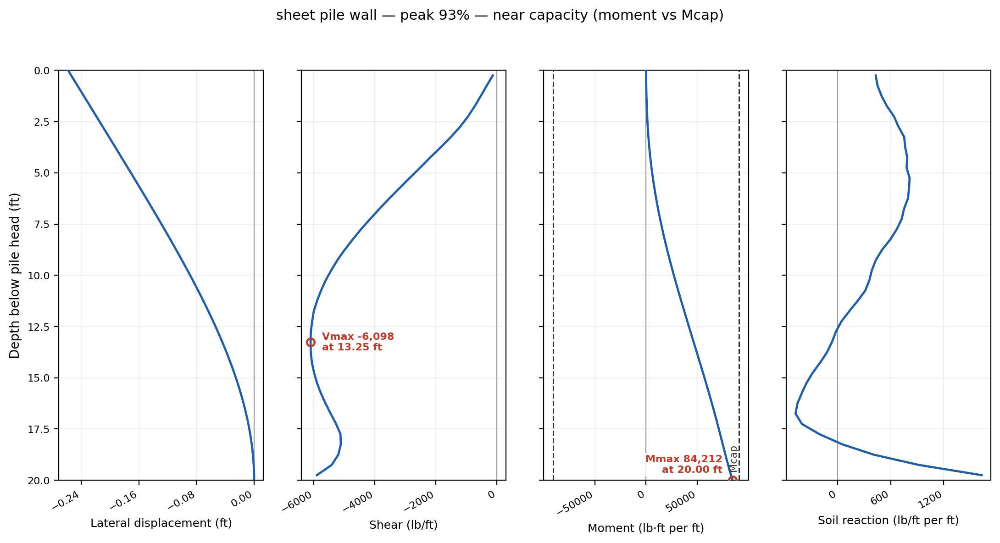{width=1000}

The moment curve is the same shape, stopping farther short of the capacity line.
The shear and soil reaction curves are the ones that change: at
ten elements they are kinked polylines, and at forty they are continuous curves,
with the soil reaction's second sign change near the toe and its rise to about
1,600 lb/ft per ft against the toe resolved. Refine the 1D size when the profile
shapes are the deliverable — a section check down the member, a soil reaction
distribution — and read the factor of safety off the refined run too: on this
wall refining the beam moved it by 0.047.

---

## Which engine for which member

| Member | Engine | What it gives |
| --- | --- | --- |
| Continuous wall (sheet pile, diaphragm, secant) | FEM, `S` = 1 | FS plus the wall's moment, shear, deflection, soil reaction |
| Contiguous or very close row | FEM, smear stated | the same, gap unrepresented |
| Discrete row at spacing | LEM, Ito & Matsui | FS per spacing, force per row, capacity checks |

The line between "very close" and "discrete" is a judgment. Ito & Matsui's
theory holds for S/D between about 2 and 8, and XSLOPE warns in the **Model
checks** panel when a spacing falls outside that range.

For a discrete row, take the factor of safety from the limit equilibrium run.
Use the finite element run to learn what the shafts carry, where they yield,
and what their end conditions do — not as a second factor of safety. Do not
try to fix the plane-strain wall by softening the piles or by putting the Ito &
Matsui limit pressure on the beam; that pressure describes the soil squeezing
between piles, which the two-dimensional model has no gap for, so adding it
counts the same resistance twice.

Whichever engine gives the factor of safety, say how the pile ends are held and
enter the section's capacities. The finite element answer on this page moved
with both: restraining an end raises the moment the shaft is asked to carry, and
the capacity sets how much of it the shaft actually carries.

---

## Conclusion

This tutorial covered:

- What a pile row is to each engine: one computed force at the crossing in the
  limit equilibrium method, a chain of beam elements in the finite element
  method.
- Why a plane-strain model turns a discrete row into a continuous wall.
- Why the engines disagree on the pile rows, and what the toe condition and the
  shafts' own moment capacity each contribute to the finite element answer.
- What spacing does to each engine: a 36% swing in the limit equilibrium
  answer, and almost none in the finite element one until the shafts reach their
  moment capacity.
- How a continuous wall is entered and what the finite element engine reports
  for it that no limit equilibrium analysis can: moment, shear, deflection and
  soil reaction down the member.

**Where to go next:** [Piles and concrete piers in FEM](../fem/piles.md) carries
the beam formulation, the assembly and the applicability rule in full, and
[stabilizing piles in LEM](../lem/piles.md) carries the Ito & Matsui theory and
the same rule from the other side; in [LEM-12](lem12_piles.md) the pile row is
analyzed on its own. For a sheet pile wall checked against a published analysis,
see
[the SIGMA/W wall benchmark](../verification/geostudio.md#sigmaw-wall).
