# Tutorial FEM-5 — A Rock Slope on Its Joints

In a rock slope the strength that decides the answer is usually not the rock's.
Intact rock is strong; the bedding planes, the joints and the faults that cut
through it are not, and a rock slope nearly always fails by moving along them.
This tutorial shows how to put those surfaces into a finite element stability
run as **joint lines** — lines the mesh is split along, with an interface element
holding the two faces together — and how to read the answer a strength reduction
gives when the joints are the only thing it can weaken.

We do it twice on the same face. **Part 1** takes a slope cut by two joints,
where the mechanism is a single slab sliding out and the factor of safety can be
checked by hand on the back of an envelope. **Part 2** takes the same slope cut
by a whole set of them, generated from a dip and a spacing rather than typed one
line at a time, where the rock breaks into columns that tip instead of sliding.

Strength reduction itself, the mesh and the convergence controls are covered in
[FEM-1](fem01_strength_reduction.md), and are not repeated here. There is a
second way to model a rock slope, in which the rock mass gets a strength of its
own and no discontinuities are drawn at all; that is
[LEM-13](lem13_rock_slope.md), and it answers a different question. Here the rock
is inert and the surfaces carry everything.

Analysis
Finite element

Build &amp; explore
~30 min

**Objectives** — Learn how the discontinuities in a rock slope are entered as
joint lines, how to check a jointed answer against a closed-form solution, how to
generate a joint network instead of typing one, and which rock slope problems
this method can solve.

one materialelastic rockjoints worksheetbedding planerelease jointplane failureclosed-form checkstrength reductionhybrid criterionsweep budgetjoint regiongenerated networkparallel setblock topplingjoint slipdeformed blocks

**Starter file** — [xslope_rock_joints_start.xlsx](files/xslope_rock_joints_start.xlsx),
the section and the rock with nothing on the joints worksheet; this is the file
the page starts from

**Completed models** — [xslope_rock_joints.xlsx](files/xslope_rock_joints.xlsx),
part 1's slab on its two joint lines, and
[xslope_rock_toppling.xlsx](files/xslope_rock_toppling.xlsx), part 2's generated
column set. The toppling model ships with its mesh and its solved strength
reduction beside it, so it can be opened and read without running anything

---

## Part 1 — A slab on two joints

The first pass is the simplest jointed slope there is: one slab, sitting on a
bedding plane it can slide along, with a release joint behind it that lets it
go. It is small enough to check by hand, and that is the point. The run has to
reproduce a number we can work out on paper before the method is trusted on
anything larger.

### The slope and its two joints

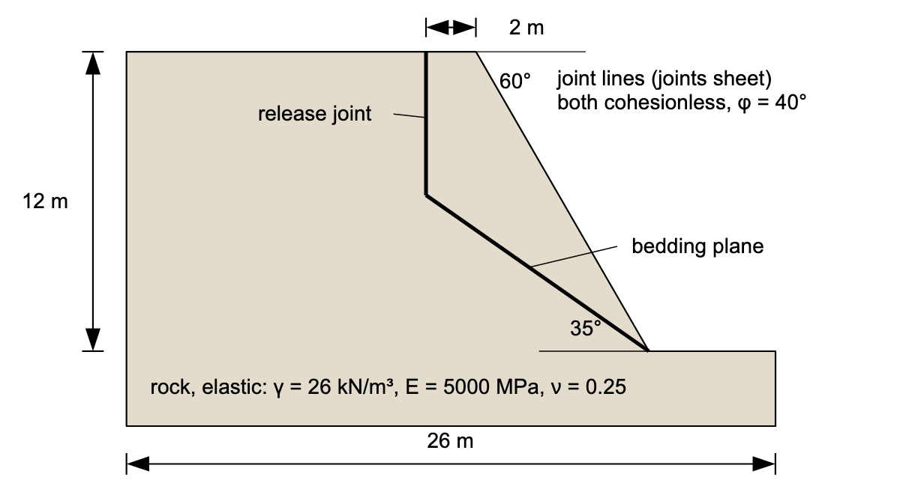{width=1000}

The face stands **12 m** high, cut at **60°**, on a 44 m section with 3 m of
rock below the toe. There is one material, and it is declared **elastic**: no
cohesion, no friction angle, just a unit weight of 26 kN/m³ and the elastic pair
E = 5,000 MPa and ν = 0.25.

Two surfaces cut a slab out of that face. The **bedding plane** dips 35° out of
the face and daylights at the toe. The **release joint** stands vertically 2 m
behind the crest and runs from the bedding plane up to the ground surface —
without it the slab has nothing to separate from, and the block cannot come out.
Both are cohesionless with a friction angle of 40°.

The slope is not a published case. It is made up so that its answer can be
worked out on paper and compared against the run's, which
[the hand check](#checking-the-answer-by-hand) below does.

---

### Opening the starter file

Download
[xslope_rock_joints_start.xlsx](files/xslope_rock_joints_start.xlsx) and open it
with **File → Open…**. Its units are metric, so lengths read in metres, unit
weights in kN/m³, and strengths and stiffnesses in kPa.

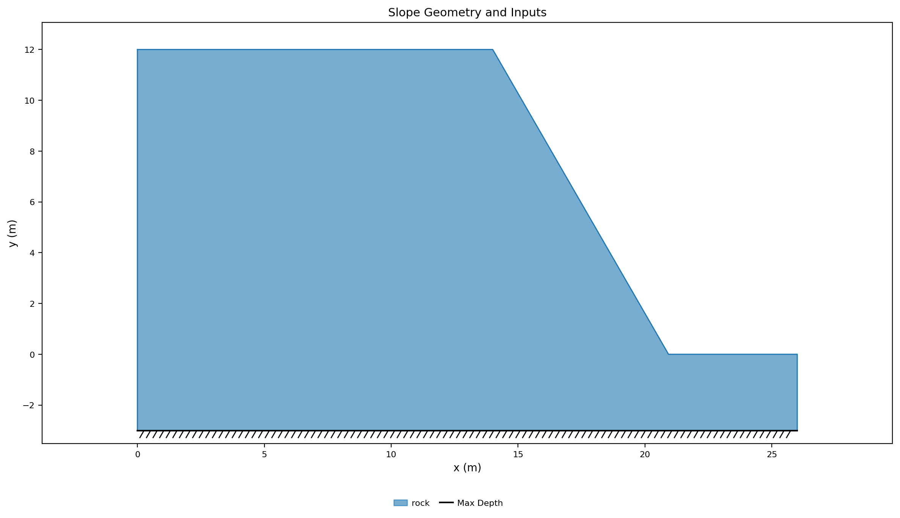{width=1000}

The section is entered as a single closed polygon of rock; a profile line would
have done as well, and either way the mesh is one zone. The rock's properties
are already filled in. The joints worksheet is empty; we fill it next.

---

### Entering the two joint lines

A joint line is a straight segment with a strength on it. Studio keeps them on
the **joints** worksheet, which is reached from the Inputs tree under
**Joints**, and every row is one line: a label, the two endpoints, and the
strength of the surface between the two faces.

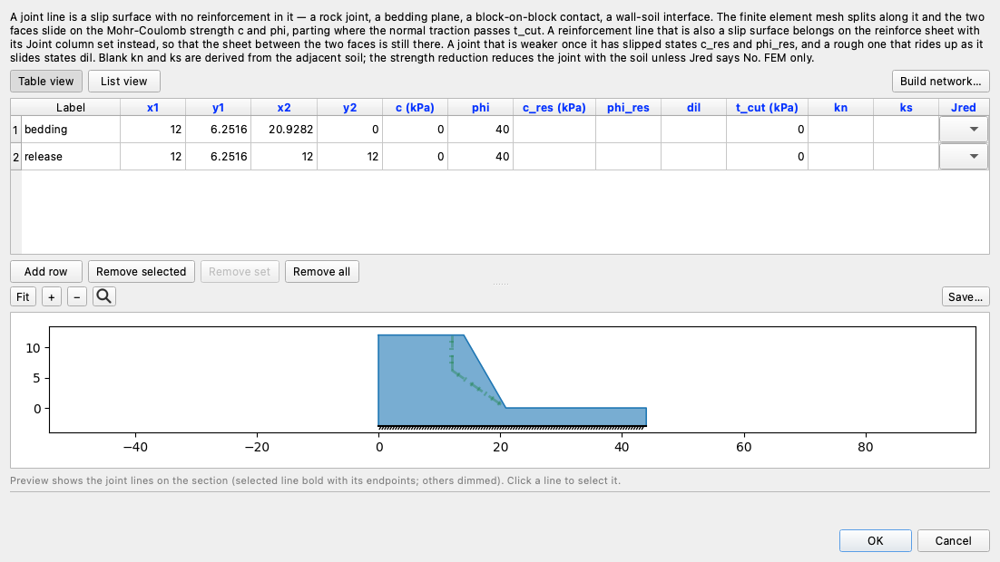{width=900}

Only the endpoints and `phi` have to be filled in. `c` blank is a cohesionless
joint, and the rest of the row — the residual strengths, the dilation angle, the
tension cutoff and the two stiffnesses — is left blank here and covered on the
[Joints and Interface Elements](../fem/joints.md) page.

The endpoints are not free choices — they follow from the shape of the slope.
The face runs from the crest at x = 14 down to the toe, and at 60° that toe is
at

>>x = 14 + 12 / tan 60° = **20.928**

The bedding plane daylights there and rises at 35° behind it, so at the release
joint's x = 12 it stands

>>(20.928 − 12) × tan 35° = **6.252**

above the base. That point is where the two lines meet: the release joint runs
from it straight up to the ground surface at elevation 12.

Enter the two rows below, or paste them straight into the worksheet.

| Label | x1 | y1 | x2 | y2 | c | phi |
| --- | :---: | :---: | :---: | :---: | :---: | :---: |
| bedding | 12.000 | 6.252 | 20.928 | 0.000 | 0 | 40 |
| release | 12.000 | 6.252 | 12.000 | 12.000 | 0 | 40 |

A new row opens with `c`, `phi` and `t_cut` at 0 and every other column blank;
leave `t_cut` at 0 and the rest blank. With the two rows in, the Inputs plot draws
the joint lines in their own style, distinct from profile lines and reinforcement:

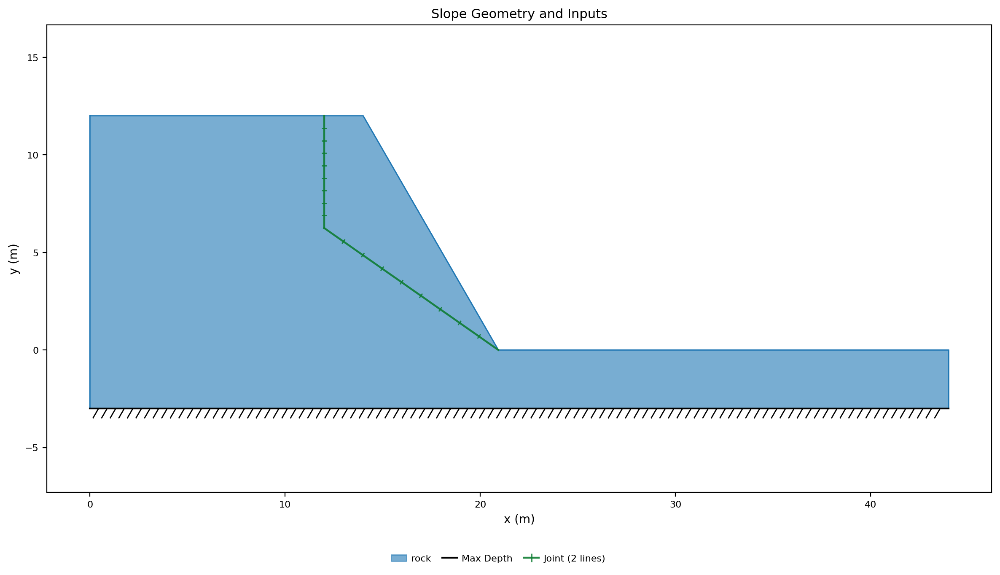{width=1000}

---

### Why the rock is elastic

The rock carries the **elastic** strength option, and that turns this run into a
test of the joints. A strength reduction divides every strength it can
find by the trial factor; an elastic material has none, so the only things
weakening as the run climbs are the joints' cohesion and friction angle. The
factor of safety that comes out is a factor on the joints alone, which is what
the hand check below can be compared against.

The alternative is to give the rock a Mohr-Coulomb or Hoek-Brown strength, in
which case the run weakens the rock and the joints together. That is the design
case — a real rock mass can shear through a bridge of intact rock between two
joints — but it has no closed-form answer, so it is not where a first jointed
model should start.

---

### Building the mesh

Build the mesh with **Run → Build Mesh…**: element type **tri6** and a target
size of **1.5 m**, which is about an eighth of the height of the face and fine
enough to put a dozen interface elements on the two joint lines. Quadratic
elements are a requirement for a stability mesh rather than a preference, for the
reason [FEM-1](fem01_strength_reduction.md) gives.

The dialog reports what it built: **900 nodes, 398 elements, and 12 joint
elements on 2 jointed lines.**

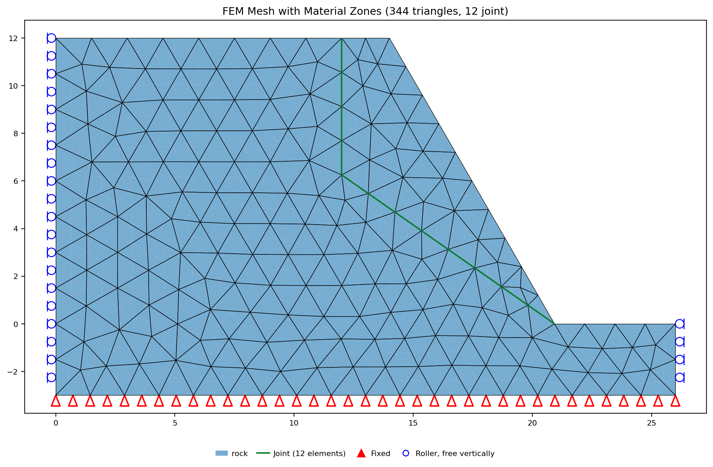{width=1000}

Along a joint line the mesher gives every node one copy for each piece of
material around it, so the rock above the bedding plane and the rock below it no
longer share any nodes at all. That split does not show on the mesh plot,
because the copies stand at the same point; the jointed lines are drawn over the
mesh in their own style instead, which is how to tell that the split happened.

---

### Running the slab

Open **Run → Run FEM…**. The analysis is **SSRM**, the bracket is *F* from
**1.0** to **2.0** and the tolerance is **0.01**, all of which are the defaults.
Two settings further down the dialog matter for a jointed model: **Max iterations
per trial**, which has to be raised, and **Failure criterion**, which the dialog
has already set to Hybrid;
[FEM-3](fem03_block_wall_joints.md#running-the-wall-alone) explains both.

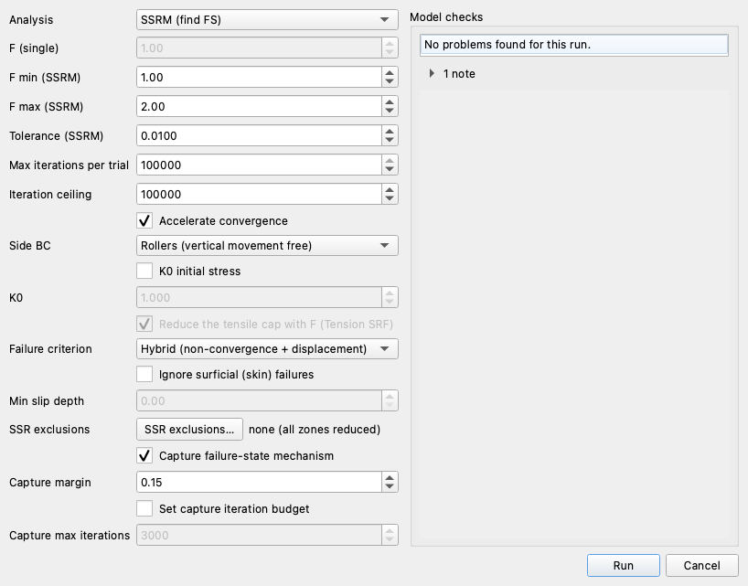{width=760}

Set **Max iterations per trial** to **100,000**: a joint reaches equilibrium by
growing slip, a little on each pass, so a jointed model needs tens of thousands
of passes where a slope without joints needs hundreds, and a trial that runs out
of them is recorded as not standing. Leave **Failure criterion** on **Hybrid**,
which is what the dialog opens on for a model that carries joints.

Press **Run**. The search takes about **two minutes** on an ordinary desktop —
nearer three on an install that does not carry the
[compiled kernel](../fem/overview.md#fast-kernel) — and reports

<!-- test: file=files/xslope_rock_joints.xlsx, type=fem_ssrm, expected_fs=1.199, element_type=tri6, target_size=1.5, tolerance=0.01, f_min=1.0, f_max=2.0, criterion=hybrid, max_iter=100000, benchmark=FEM-5-slab-ssrm -->

>>**FS = 1.199**

The results view shows one panel at a time, picked from **Plot type** in the
display panel: **Shear strain**, **Deformed mesh** or **Displacement vectors**,
the same three every finite element tutorial reads. On this model they come down
to two pictures. The rock is elastic, so no part of it can strain plastically
and there is no strain field to draw; everything that happened, happened on the
two lines, and **Shear strain** draws as **Joint slip** instead: the section a
flat gray, and the only colorbar the slip on the joints, in metres.

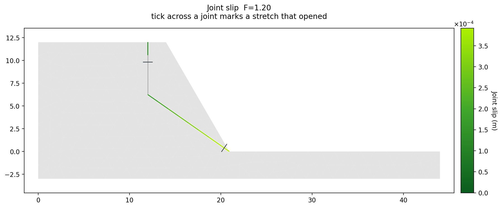{width=1000}

The color is the slip, and it reads the way the slab moved: along the bedding
plane it grows from 0.18 mm at the release joint to 0.39 mm at the toe, the
whole plane sliding as one surface. The release joint is gray because it has not
slid; it has **opened**. A joint whose two faces have parted carries no normal
stress and so no shear, and the panel draws a parted stretch as its two faces
apart: two thin lines with a gap between them, along the whole length that
parted. The key in the corner names the three states a joint can be in — closed
and not slipping, slipping, opened. The release joint
has opened along nearly its whole height, from where it meets the bedding plane
up to just under the crest — the slab has pulled away from the rock behind it,
which is what a release joint is for — and only its top, under the crest, is
still closed and sliding, the one green length on it.

**Deformed mesh** is the second picture. On a jointed model it is the deformed
section drawn as the **blocks** the joints cut it into, with the slab under a
tint of its own, the joint faces colored by how far they have slid, and the
undeformed outline dashed behind it. On a jointed model, **Displacement
vectors** shows this same picture.

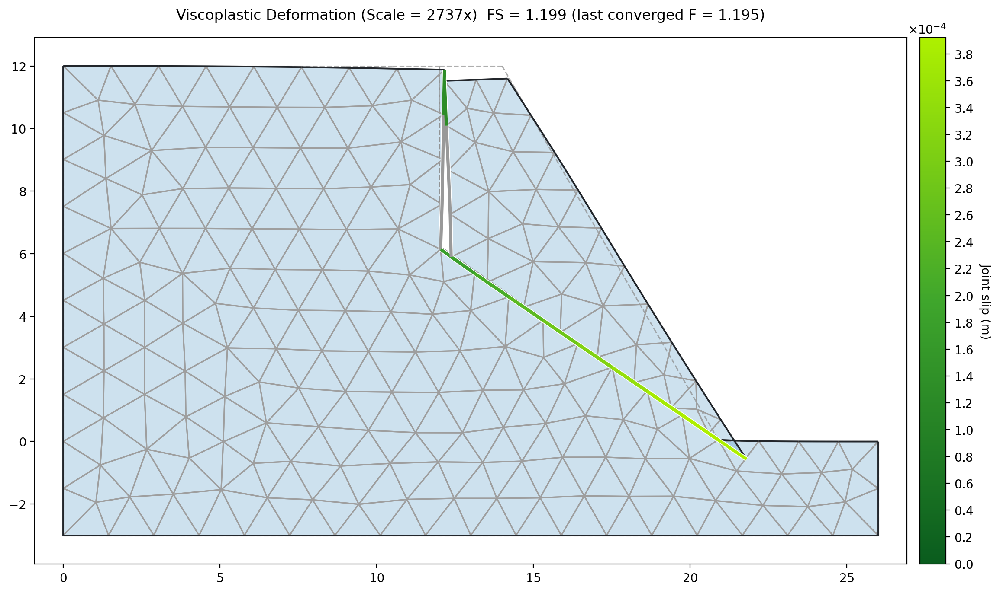{width=1000}

The slab has moved as one body. It slid down the bedding plane and parted from
the release joint, and every bit of that movement was taken up on the two lines;
nothing inside the slab deformed at all.

---

### Checking the answer by hand

A slab sliding on a plane has a factor of safety short enough to write on one
line, so we can work it out before looking at what the run reported.

Take the slab as a dry block resting on a plane that dips at β, with a joint that
has no cohesion. The weight *W* resolves into a component *W* sin β driving it
down the plane and *W* cos β pressing it onto the plane. The resistance the joint
offers is that normal force times tan φ, so

>>FS = (*W* cos β tan φ) / (*W* sin β) = tan φ / tan β

The weight cancels. Nothing about the size or the shape of the slab survives —
which is why the release joint's position does not change the answer, and why the
slope could be 12 m high or 120 m and read the same. With φ = 40° on the bedding
plane and a dip of β = 35°,

>>FS = tan 40° / tan 35° = **1.198**

against the run's **1.199**.

The hand check uses only the bedding plane's friction angle. The release
joint's does not appear, and the joint slip figure shows why: the release joint
has opened, and an open joint carries no normal force, so it has no friction to
offer whatever its φ. The model agrees. Change the release joint's `phi` from
40° to 25° and run again: the factor of safety comes back **1.199**, unchanged.

---

## Part 2 — Generating a joint network

One slab on two lines is the smallest jointed problem there is. A real jointed
rock mass is not described one line at a time: it is described by **sets** — a
dip, a spacing, and how far the joints persist — and the same slope with a set of
joints through it fails by a different mechanism entirely.

Two inputs make a set. The first says *where* in the section the set exists,
and there are three ways to say it:

- **Nothing.** Leave the region blank and the set fills the whole section.
- **A material**, or several. The set fills the zones that carry it — a bedding
  set confined to one rock unit.
- **A joint region**: a polygon whose **Type** is `joints`, for ground that no
  material boundary outlines. It is only an outline, with no material and no
  strength of its own.

This model needs the third, because the columns belong to the wedge of rock
above the base plane, which is not a material of its own.

The region is entered in the polygons editor, reached from the Inputs tree
under **Polygons**, the same editor the section itself is in. Add a polygon, set
its **Type** to `joints`, name it `Toppling zone`, and enter or paste its four
vertices. The shape is the wedge the base plane cuts off, the counterpart of
Part 1's slab: from the base plane's upper tip at (9, 6.887), down the plane to
the toe at (20.928, 0), up the face to the crest at (14, 12), and back along the
ground surface to (9, 12) above the tip.

| x | y |
| ---: | ---: |
| 9.000 | 6.887 |
| 20.928 | 0.000 |
| 14.000 | 12.000 |
| 9.000 | 12.000 |

The second input to build a joint network is the **Build network…** dialog,
which says *what* the set is. Open the joints editor from the Inputs tree under
**Joints**, as in Part 1, and press the **Build network…** button beside its
list of rows.

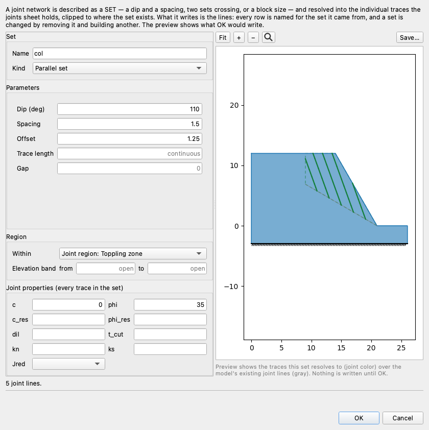{width=760}

**Name** is the set's name, and it matters more than it looks. Keep it short:
`col`. Every row the dialog writes is named from it — `col-01`, `col-02`, and
so on, in the order the traces come out — and that name follows the rows onto
the Inputs plot, the results panels, the 1D details view and the report, so a
network of a hundred lines reads as one set rather than a hundred anonymous
rows. It is also how the set is found again: the rows of one network can be
selected and removed together by their name.

**Kind** selects the generator. `Parallel set` is one set of parallel traces at a
stated dip; the other two are `Cross-jointed`, which crosses two sets, and
`Voronoi`, which fills the region with a tessellated block mass at no preferred
orientation. This set is a parallel one.

**Dip** is the orientation, measured anticlockwise from horizontal, so a dip
between 0 and 90 leans out of the face and a dip between 90 and 180 leans back
into it. **110°** here is a set standing 70° from horizontal and leaning back
into the slope, which is what makes the rock above the base plane a stack of
columns rather than a pile of slabs.

**Spacing** is the perpendicular distance between one trace and the next,
1.5 m. **Offset** says where the traces sit: with an offset of 0, one trace of
the set passes through the origin (0, 0) and the rest stand at multiples of the
spacing either side of it; the offset shifts that whole pattern along the set's
own normal by the distance given. 1.25 m here moves the traces to where they
leave a whole column at each end of the region rather than a sliver. Changing
the offset moves the set; it does not change the spacing.

**Within** is where the set exists, the choice from the list above: the whole
section, a material, or a joint region. Pick `Toppling zone`. **Elevation band**
cuts whatever is chosen there to a range of elevations — "the sandstone above
elevation 40" — and is left open at both ends here.

The dialog previews the traces on the canvas as the fields change, and **OK**
writes exactly what the preview showed to the joints worksheet — the same
worksheet the two lines of Part 1 were typed into — one row per trace, named
`col-01` onward. Over this region that set comes to **five** traces, so five
rows. They are ordinary rows from then on, and can be edited like any other
row. The description that produced them is not
stored, so a set is changed by deleting its rows and building another.

The base of the stack is typed by hand, because it is one surface rather than a
set: a **base plane** dipping 30° out of the face, from its upper tip down to
the toe, cohesionless at φ = 35°. Enter the row below in the joints editor, or
paste it in; the generated traces take the same strength.

| Label | x1 | y1 | x2 | y2 | c | phi |
| --- | :---: | :---: | :---: | :---: | :---: | :---: |
| base plane | 9.000 | 6.887 | 20.928 | 0.000 | 0 | 35 |

Close the joints editor. The Inputs plot now shows six joint lines — the base
plane and the five columns standing on it — with the joint region's outline
dashed behind them:

{width=1000}

---

### Running the toppling stack

The joints have changed, so the mesh has to be built again: **Run → Build
Mesh…**, **tri6** at **1.5 m** as before. The dialog reports **1,071 nodes, 452
elements, and 41 joint elements on 6 jointed lines** — six lines from one typed
row and five generated ones. Then **Run → Run FEM…** with the same settings as
Part 1: SSRM, the bracket from 1.0 to 2.0, tolerance 0.01, **Max iterations per
trial** at 100,000, and the failure criterion on Hybrid. Press **Run**. It takes
about a minute and a half and reports

<!-- test: file=files/xslope_rock_toppling.xlsx, type=fem_ssrm, expected_fs=1.105, element_type=tri6, target_size=1.5, tolerance=0.01, f_min=1.0, f_max=2.0, criterion=hybrid, max_iter=100000, benchmark=FEM-5-topple-ssrm -->

>>**FS = 1.105**

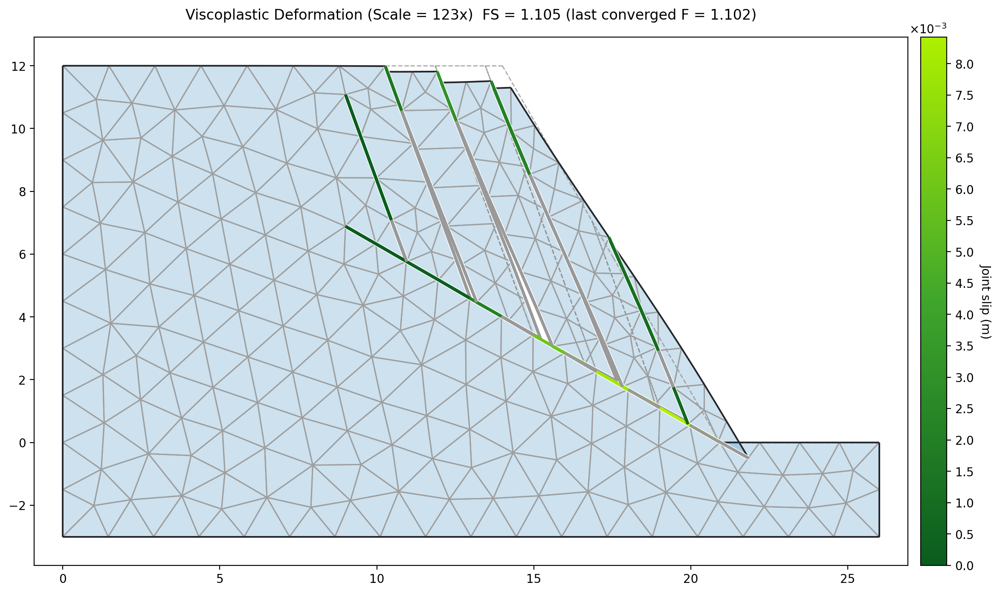{width=1000}

Read the deformed-block figure first. The columns are separate bodies and they
move as bodies, but they do not slide down the base plane the way Part 1's slab
slid down its bedding plane. Each column rotates
forward about its own downslope corner, opening the joint behind it and closing
the joint in front. That is **block toppling**, and it is the mechanism the
method was built for: every bit of the movement is taken up on the contacts, and
the factor of safety is the factor by which the contacts have to be weakened
before the stack starts to go over.

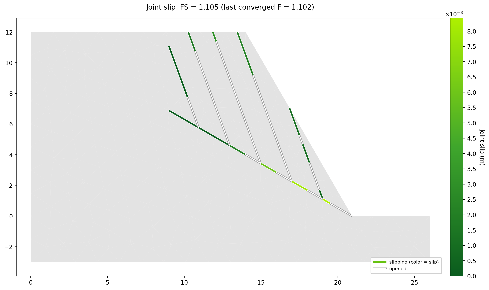{width=1000}

The joint slip figure shows the same mechanism as contact states. Each column
joint has opened along its lower part and is in contact only near the top: a
column pivoting forward on its toe lifts off the joint behind it at the base and
leans on the column in front at the crest, and the short green lengths there,
slips of 1 to 3 mm, are the two columns sliding against each other as they lean.
The base plane reads differently. It is slipping along most of its length, up to
8 mm, the largest slip in the model, as the columns' feet slide forward on it
while they rotate, and it has opened under the lowest column near the toe, where
that column has lifted off it. Nothing on the plot says the stack is sliding
away as one body; everything says it is going over.

---

### What a network costs

A joint network is cheap to describe and not cheap to solve. Every trace splits the mesh,
every split copies the nodes along it, and every pair of copies carries an
interface element that has to reach an equilibrium of its own. Here is the same
region at three spacings, meshed at the same 1.5 m target size:

| Spacing | Traces | Nodes | Joint elements |
| --- | :---: | :---: | :---: |
| 3 m | 2 | 966 | 25 |
| 1.5 m | 5 | 1,071 | 41 |
| 0.75 m | 11 | 1,133 | 70 |

The node count barely moves, because the region is a small part of a 44 m
section. The interface count is what grows, and it is the interfaces that set
the cost: a joint reaches equilibrium by growing slip a little at a time, so the
sweeps a trial needs go up with them. On the shipped model at 1.5 m the trials
that stand settle in a few hundred sweeps, while the two that fail run 21,241
and 27,641 — and there are twice as many interfaces to carry at 0.75 m.

So start coarse. Describe the set at a spacing two or three times what the rock
really has, get the mechanism and the factor of safety, and only then refine —
and check that the answer has stopped moving before trusting the fine one.

The `Voronoi` generator sits at the far end of that trade. It fills a region with
a tessellated block mass at no preferred orientation, which is the right picture
of a blocky rock mass with no dominant joint set. Over this slope's toppling
zone, at a block size of 2 m, it writes **58 joint lines** — about fifteen cells
— where the parallel set wrote five:

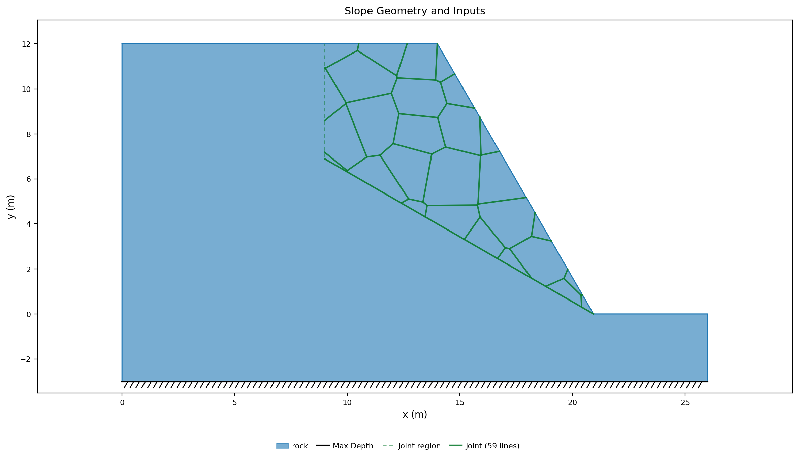{width=1000}

That is a picture of the generator rather than a model to run here. The
mechanism it describes is real, but a section with that many contacts in it is a
run measured in hours rather than minutes, and the place to meet it is on a
machine and a schedule that can take it.

---

## What this method can and cannot do

The interface element is a small-strain contact between **fixed pairs of nodes**.
Each pair carries compression across the joint and Coulomb shear along it, opens
when the joint goes into tension, slips when the shear reaches its limit, and
closes again when the two faces meet. A pair keeps the partner it started with
for the whole run.

That covers a great deal. Blocks slide on their contacts, part at them, tip about
them and settle back onto them, and as long as the blocks keep the same contacts
throughout, the answer the run gives is the answer rigid-block statics gives —
which is exactly what part 1 demonstrated to three figures. Plane failure, block
and flexural toppling, a step-path surface running from one joint to the next, a
slab plowing into the block below it, and a mass cut into many small blocks are
all within reach.

What it cannot do follows from the same construction. A corner cannot travel
along a face, so a contact cannot move or shorten as a block moves. No new
contact forms between two faces that were not paired to begin with, so a block
cannot come to rest against something it was not already touching. Rotations have
to stay small, because the element is written on the undeformed section. And the
joint obeys Mohr-Coulomb with a residual strength and a dilation angle rather
than a softening law.

The short version for practice: this method answers whether a jointed mass
starts to move, and on which surfaces — not how far the blocks travel, where
they come to rest, or what they strike on the way. Those questions need a
distinct element program such as UDEC, in which blocks separate, rotate through
large angles and make new contacts as they go, or a rockfall program that
follows each block down the slope.

[Joints and Interface Elements](../fem/joints.md) carries the formulation, the
full input list and the rest of the reading.

---

## Conclusion

This tutorial covered:

- Discontinuities entered as joint lines on the joints worksheet, with their
  endpoints set by the geometry of the mechanism rather than chosen.
- Elastic rock, which leaves the strength reduction nothing but the joints to
  weaken, and what giving the rock a strength instead would buy and cost.
- The two settings a jointed run needs: the Hybrid failure criterion, and a
  sweep budget large enough for the joints to reach equilibrium.
- A factor of safety checked against tan φ / tan β by hand, and what that check
  does and does not depend on.
- A joint set generated from a dip and a spacing over a joint region, and the
  toppling mechanism the set produces on a slope that slid before.
- What this kind of joint element can model, and where a different tool is
  needed.

**Where to go next:** the [tutorials index](index.md) lists the series.
[Joints and Interface Elements](../fem/joints.md) carries the element, the split
mesh and every column of the joints worksheet, and
[Worksheet: joints](../usage/input_template.md#worksheet-joints) documents the
inputs with the rest of the template. In
[FEM-3](fem03_block_wall_joints.md) the same element holds a structure together
rather than a rock mass — a segmental block wall whose every contact is a joint —
and in [LEM-13](lem13_rock_slope.md) a rock slope is solved the other way, with a
Hoek-Brown strength given to the rock mass itself and no discontinuities drawn in
it at all.
