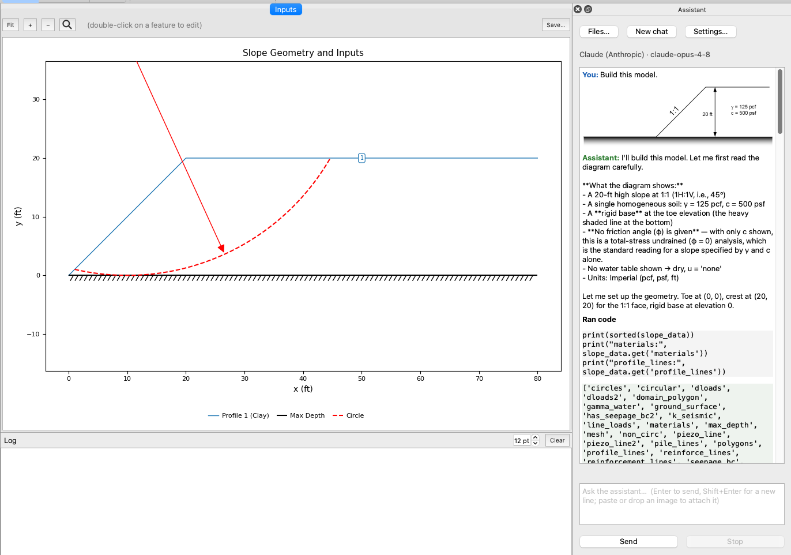
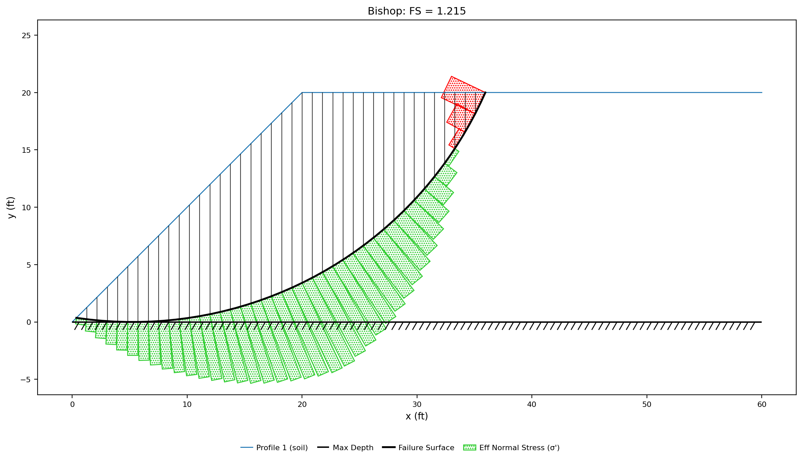
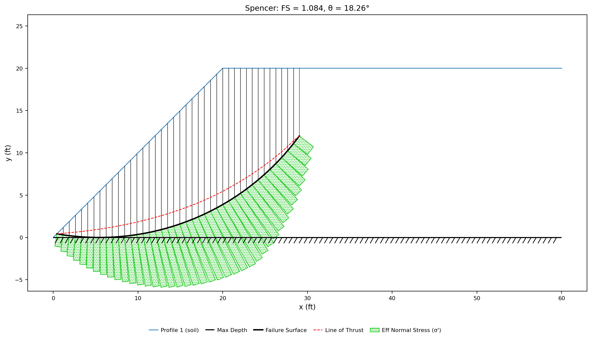

# Tutorial LEM-1 — Simple Embankment

The section below is a 20 ft embankment on a rigid foundation, one soil throughout,
with a 1:1 face and a level crest. Its strength is a cohesion of 500 psf and no
friction angle — a **total-stress undrained** strength.

{width=700}

<div class="tut-glance" markdown>
<div class="tgt-row">
<div class="tgt-tile"><span class="tg-label">Analysis</span><p>Limit equilibrium</p></div>
<div class="tgt-tile"><span class="tg-label">Assistant</span><p>~10 min</p></div>
<div class="tgt-tile"><span class="tg-label">By hand</span><p>25–30 min</p></div>
</div>
<div class="tgm-obj" markdown>
**Objectives** — Build the embankment from scratch — the smallest complete XSLOPE
model — find its critical circular failure surface with Spencer's method, and read
the results carefully enough to catch what the first model gets wrong.
</div>
<p><span class="tg-pill">profile lines</span><span class="tg-pill">one material</span><span class="tg-pill">Mohr-Coulomb</span><span class="tg-pill">starting circles</span><span class="tg-pill">circular search</span><span class="tg-pill">tension crack</span></p>
<div class="tgm-model" markdown>**Completed model** — [xslope_simple_embankment.xlsx](../lem/files/xslope_simple_embankment.xlsx) — the same file used by [LEM Sample Problem 1](../lem/samples.md#1-simple-embankment)</div>
</div>

---

## The problem

The problem features the following geometry and material properties:

**Material** — one material, Mohr-Coulomb (`mc`):

| Mat ID | Name | γ (pcf) | c (psf) | φ (deg) | Pore pressure |
|---|---|---:|---:|---:|---|
| 1 | `soil` | 125 | 500 | 0 | `none` |

**Geometry** — one profile line, on material 1:

| Point | x (ft) | y (ft) | |
|---|---:|---:|---|
| 1 | 0 | 0 | the toe |
| 2 | 20 | 20 | the crest break — 20 ft up over 20 ft across, a 1:1 face |
| 3 | 60 | 20 | the back of the crest |

Maximum depth = `0`, the elevation of the rigid base.

---

## Choose how you want to build it

There are three ways to get this model into XSLOPE. They produce the same model —
pick one and skip the other two.

1. **[Build it with the AI assistant](#a-building-it-with-the-ai-assistant)** — hand
   Studio's assistant the drawing (or a sentence describing the slope) and let it
   build the model, then check its work. The fastest path by a wide margin.
2. **[Build the Excel input file](#b-building-the-excel-file)** — fill in the
   template worksheet by worksheet. The next-fastest path, the most explicit one,
   and the one that shows you exactly what the file contains.
3. **[Build it in Studio](#c-building-the-problem-in-studio)** — enter the data
   through Studio's editors, watching the section redraw as you go.

Whichever you choose, rejoin at [Running the analysis](#running-the-analysis).

---

## A — Building it with the AI assistant {#a-building-it-with-the-ai-assistant}

### What you need first

The assistant is bring-your-own-model: it needs a provider and an API key before it
will do anything. The packaged app bundles the provider library; a pip install needs
the `ai` extra — see
[Getting the assistant](../studio/assistant.md#getting-the-assistant). Either way,
open the assistant dock and press **Settings…** to choose a provider and enter a key,
stored in your operating system's keychain — see
[Choosing a model](../studio/assistant.md#choosing-a-model). With no API key to be
had, choose **Ollama**, which runs a model on your own machine.

### Give it the problem

The drawing at the top of this page carries what the assistant needs — height, face
inclination, unit weight, strength.

1. Right-click the problem figure at the top of this page and choose **Copy image**.
2. Click in the assistant's chat box and press Ctrl/Cmd+V to attach it.
3. Type `Build this model` and press **Enter**.

{width=1000}

A geometry this simple is faster to describe than to paste, and a sentence works with
a model that has no vision. Use this instead if you prefer:

<div class="prompt-block" markdown>
```text
Build a model for a simple slope on a rigid foundation. The slope is 20 ft high and the slope face is at an inclination of 1:1, with a level crest extending 40 ft back from the top of the slope. The slope is a uniform soil with a unit weight of 125 pcf and an undrained strength of c = 500 psf, phi = 0. Add a starting circle for a critical-surface search.
```
</div>

The assistant builds into the open project, not into a file: its work appears on the
canvas immediately and lands on the undo stack as one labeled step. Nothing is saved
until you use **Save As**.

### Check its work

This is the part that teaches. Read what it built against the section it was given,
and correct it in the same conversation — plain sentences work, and each correction
is undoable.

- **φ = 0.** Check this first: it is the judgment the drawing leaves to you, and the
  likeliest miss, because the drawing never states it. If the assistant supplied a
  friction angle, say: *"c = 500 psf is an undrained strength. Set phi to 0 and leave
  the pore pressure option at none."*
- **One material**, γ = `125` pcf, c = `500` psf, strength option `mc`.
- **No water.** There should be no piezometric line. If one was added, have it
  removed — with φ = 0 it cannot change the answer, and a water table nobody asked
  for is an input you will have to explain later.
- **The ground surface** rises 20 ft over a 20 ft run, then runs level. The origin
  does not matter, only the height and the 1:1 face.
- **The maximum depth is at the toe elevation.** The hatched band under the toe is a
  rigid foundation, and it is easy to miss. If the maximum depth is blank or below
  the toe, say: *"The foundation is rigid — set the maximum depth to the elevation of
  the toe."*
- **A starting circle exists**, with its center above and behind the face — and its
  lowest point no lower than the maximum depth. On a rigid base the deep circle is
  *tangent* to the base, never past it. If a circle dips below, say: *"That circle's
  bottom is below the rigid base — set its depth to the base elevation."*
- **Units are declared Imperial**, so the plots label their axes in feet.

Then open the [completed model](../lem/files/xslope_simple_embankment.xlsx) beside
yours and compare. Continue at [Running the analysis](#running-the-analysis).

---

## B — Building the Excel file {#b-building-the-excel-file}

Start from [input_template.xlsx](../inputs/input_template.xlsx) and save a copy under
a name of your own.

Fill the worksheets in the order the model depends on them: `main` first, since the
unit system it declares is what every number after it means; then materials; then
geometry; then the failure surface.

### 1. The `main` worksheet

Most of this sheet is already right:

1. Confirm `main!D8` **Units** is `Imperial`. Choosing a unit system fills
   `main!D10` **Unit weight of water** with that system's value, `62.4` pcf here.
   XSLOPE never converts between systems — the declaration states what the numbers
   you type already mean, and drives the unit labels on the plots.
2. Leave **Tension crack depth**, **Depth of water in crack** and **Seismic
   coefficient** at `0`.
3. Leave `main!D23` **Water loads** at `auto`, which derives the weight of standing
   water from the water table rather than from a load you type. There is no water
   here, so it changes nothing — but it is the setting to leave alone.
4. Leave **LEM method** and **Number of slices** blank. A blank run option means
   *unspecified — use the default*, which is not the same as zero; you choose the
   method and the slice count at run time.


### 2. The `mat` worksheet

In the `mat` worksheet, we name each of the materials in the model and enter their
properties, including unit weight and strength parameters. For this problem, we have
one material, so we'll use the first row of the table:

1. `mat!A11` = `1` and `mat!B11` = `soil` — the ID the geometry will reference, and
   a name for the legends.
2. `mat!C11` **γ** = `125`.
3. `mat!E11` **option** = `mc`, the traditional Mohr-Coulomb envelope.
4. `mat!F11` **c** = `500` and `mat!G11` **φ** = `0`. Together these are the
   undrained strength: the envelope is flat, so the strength is 500 psf at every
   depth.
5. `mat!O11` **u** = `none`. There is no pore pressure to compute.
6. Leave every other column in the row blank.


### 3. The `profile` worksheet

A profile line is the *top* of a material layer: everything below it, down to the
next profile line or the maximum depth, is that layer's material. That is why
entering the ground surface here defines the whole body of the embankment — one line
on material 1, with the rigid base closing it from below.

1. `profile!B2` **Max Depth** = `0`. This is an *elevation*, not a thickness: it
   places a horizontal rigid base at the toe of the slope.
2. `profile!B5` **Mat ID** = `1` for Profile Line #1 — the ID you gave the material
   above.
3. Enter the three ground-surface points in the `x` / `y` columns beneath, left to
   right: `0, 0` then `20, 20` then `60, 20`.


The sheet carries table blocks for many profile lines; this model uses only the
first, and the rest stay empty.

### 4. The `circles` worksheet

Next, we enter a starting circle for the search. A starting circle is a *guess* at
the critical surface, and the search will refine it. A good strategy: put the
center's x-coordinate above the middle of the slope face, put its y-coordinate at
twice the slope's height, and size the circle so it just touches the rigid base.

1. `circles!B3` **Xo** = `10` and `circles!C3` **Yo** = `40` — the center of the
   trial circle, above the middle of the face at twice the slope height.
2. `circles!D3` **Option** = `Depth`, and `circles!E3` **Depth** = `0`.
   **Depth** is the *elevation of the circle's lowest point*, not a distance below
   ground — so `0` sets the circle tangent to the rigid base, and the loader forms
   the radius as R = Yo − Depth = 40.


Save the file, and continue at [Running the analysis](#running-the-analysis) —
open the file in Studio, or run it from Python as shown there.

---

## C — Building the problem in Studio {#c-building-the-problem-in-studio}

Start with **File → New**, an empty project. Work down the **Inputs** tree in the
order the model depends on: settings, then the material, then the geometry, then
the starting circle.

### 1. Global parameters

The global parameters declare what every number after them means. Click
**Global parameters** and set **Units** to `Imperial` — XSLOPE never converts
between unit systems; the declaration states what the numbers you type already
mean, and drives the unit labels on the plots. The unit weight of water fills
itself with `62.4`. Leave the tension crack and seismic fields at `0`, and click
**OK**.

### 2. Materials

Here you name each material in the model and enter its properties — unit weight
and strength parameters. Everything else will reference the material by its ID,
which is why it comes first. This problem has one material. Click **Materials** →
**Add**, then switch to **List view**:

1. **Name** = `soil`.
2. **γ** = `125`.
3. **Model (option)** = `mc`, **c** = `500`, **φ** = `0`.
4. **Model (u)** = `none`. There is no pore pressure to compute.

Together c = 500 and φ = 0 are the undrained strength: the envelope is flat, so
the strength is 500 psf at every depth, whatever the normal stress.


The strength plot beside the fields redraws as you type. Here it is a flat line at
τ = 500 — the picture of an undrained strength, and confirmation you entered the
one you meant.

### 3. Profile lines

A profile line is the *top* of a material layer: everything below it, down to the
next profile line or the maximum depth, is that layer's material. Entering the
ground surface here therefore defines the whole body of the embankment — one line
on the material you just created, closed from below by the rigid base. Click
**Profile lines**, then **Add line**:

1. Set **Max depth (bottom boundary elevation)** to `0`. This is an *elevation*,
   not a thickness: it places a horizontal rigid base at the toe of the slope.
2. Set **Material** to `1: soil`.
3. **Add row** three times and enter `0, 0` / `20, 20` / `60, 20` — the toe, the
   crest break at the top of the 1:1 face, and the back of the crest.


The preview redraws as you type, so a mistyped vertex shows up before you commit
it: the line in the material's color, and the hatched **Max depth** line at y = 0
beneath it. Click **OK**, and the canvas draws the same two things. Profile-line
geometry is drawn as lines; the shaded material zones you may have seen in other
XSLOPE figures are how *polygon* input is drawn.


### 4. The starting circle

A starting circle is a *guess* at the critical surface, and the search will refine
it. A good guess puts the center's x-coordinate above the middle of the slope
face, its y-coordinate at twice the slope's height, and sizes the circle so it
just touches the rigid base. You can type that — or have it built for you.

Click **Circles**, then press **Generate starting circles…**. The generator reads
the geometry you just entered and proposes the circle this page's Excel path types
by hand — center (10, 40), above the middle of the face at twice the slope height,
tangent to the rigid base.

Its rule is the one to learn: **one circle through the toe, and one at the base of
each layer**. Here the two candidates share a center and differ only in radius,
and the one that survives is the layer-base circle: R = 40, tangent to the rigid
base at y = 0. Reaching the toe from that same center would take R = 41.23, which
puts the bottom of the circle 1.23 ft *below* the base, on ground the model does
not contain — the candidate the generator reports dropping *"for not daylighting
inside the model"*.


Audit what it made — the same check-its-work step the assistant path teaches —
and click **OK**.

Continue below.

## Running the analysis

However you built it, you now hold the same model. Open Studio's Inputs view and
compare against this before running anything — a geometry error is far cheaper to
find here than in a factor of safety:

{width=1000}

The circle's center is at (10, 40), above the top of the frame; the red arrow is its
radius, drawn from the center down to the arc.

Click **Run LEM…**. Choose:


1. **Method** = `Spencer's Method` — the method that satisfies both force and moment
   equilibrium, and the one to reach for by default.
2. **Surface** = `Auto search`, `Circular`. The search starts from your circle and
   refines toward the critical one.
3. Leave the slice count at its default of 40.
4. Click **Run**.

From Python, the same run is:

```python
from xslope.fileio import load_slope_data
from xslope.search import circular_search
from xslope.plot import plot_solution

sd = load_slope_data("my_embankment.xlsx")
fs_cache, _, path, circles = circular_search(sd, "spencer", num_slices=40)
crit = fs_cache[0]
plot_solution(sd, crit["slices"], crit["failure_surface"], crit["solver_result"])
```

---

## Exploring the results

### The search result — and the warnings that come with it

{width=1000}

The search plot shows every circle it tried in grey, the path its center walked in
green, and the critical circle it settled on. Spencer's answer:

{width=1000}

**FS = 1.276** — but do not stop at the number. The solution arrives with an amber
strip across the top listing *admissibility warnings*: interslice tension, and a
line of thrust outside the slices on about half the boundaries. Warnings like these
are not decoration. They are the analysis telling you that the solution required the
soil to do something soil cannot do — here, carry tension.

### Reading the anomaly

Run the same search again with **Method** = `Bishop's Simplified`. Bishop satisfies
moment equilibrium only, and for a φ = 0 soil that has a useful consequence: on any
one circle, every moment-equilibrium method — Bishop, Spencer, Morgenstern-Price —
computes exactly the same factor of safety. They cannot disagree about a circle;
they can only disagree about which circles they managed to solve.

{width=1000}

Bishop finds **FS = 1.215** on a circle deeper into the crest — a *lower* answer
than Spencer's on the same model. Look at the crest end of the surface: the last few
slices' base-stress bars are drawn in red, meaning the computed normal stress on the
base is negative. The model is asking the top of the slope to hold itself together
in tension.

That tension is why the two searches disagree. On the circles nearest the true
minimum, Spencer's stricter equilibrium — force *and* moment, with one interslice
force inclination — has no solution at all: no inclination can balance slices that
are being pulled apart. The search can only report the best circle it could solve,
which is how a method that agrees with Bishop circle-for-circle came back with a
higher number.

The search says this out loud. Its run output includes the line:

```text
[⚠️ unsolved trials] Spencer could not solve 56 of 211 trial surfaces (56 admit no admissible solution); 26 of them rank lower than the reported minimum by the moment measure.
```

Fifty-six trial circles admit no solution that keeps every slice's forces
admissible, and twenty-six of those rank below the reported 1.276 — Bishop's 1.215
circle is one of them. The disagreement, the amber warnings, the red bars and the
unsolved-trials line are all the same message: **something about this model is not
physical.**

### The fix is in the ground, not the settings

An undrained soil with cohesion but no friction cannot carry tension near a free
surface — in the field, it cracks. The theoretical depth of that tension crack is

$$ z_c = \frac{2c}{\gamma} = \frac{2 \times 500}{125} = 8 \text{ ft} $$

Add the crack to the model:

- **Studio** — open **Global parameters** and set **Tension crack depth** = `8`
  (leave **Depth of water in crack** at `0`; the crack is dry).
- **Excel** — `main!D11` **Tension crack depth** = `8`, `main!D12` = `0`.
- **Assistant** — say: *"Add a dry tension crack 8 ft deep."*

The crack truncates every trial surface where it reaches 8 ft below the crest — the
model stops counting shear strength along the stretch the soil would have cracked
away from.

Run the Spencer search again:

{width=1000}

**FS = 1.084**, and this time the solution is clean: no amber strip, no red bars,
and the line of thrust (the dashed red curve) stays inside the sliding mass. Run
Bishop or Morgenstern-Price on the cracked model and they land on the *same* circle
and the *same* 1.084 — once the model stops asking the soil to carry tension, the
methods stop disagreeing.

Two things worth carrying out of this:

- **The cracked answer is lower.** 1.276 → 1.084 is a 15% drop: the uncracked model
  was counting cohesion along a stretch of surface that the soil would in reality
  have already torn open. The warnings were flagging an answer biased high.
- **The warnings did their job.** The amber strip, the red bars and the
  method disagreement all pointed at the same modeling omission. Reading them — not
  silencing them — is what turned a plausible-looking 1.276 into a defensible 1.084.

### How deep does the crack really need to be?

The theoretical depth $z_c = 2c/\gamma$ is a hand-calculation estimate, and it
usually overshoots: it is derived for a level ground surface at active failure, and
the tension zone behind a real slope crest is shallower. A crack just deep enough
to eliminate the tension is the smallest change that fixes the model — anything
deeper removes strength the soil actually has.

You can find that depth with the tool you just learned: re-run the search at a few
trial depths and watch for the shallowest clean solution. On this slope the
warnings persist at 4 ft, and clear at about **4¾ ft** — well short of the
theoretical 8. Spencer there gives **FS = 1.107**, about 2% above the 8-ft
answer, with no tension anywhere.

Which to use is an engineering call, and a mild one — the two depths differ by 2%
in factor of safety. The verge depth is the most defensible model of the soil; the
theoretical depth is the conservative habit. What is not defensible is the
uncracked model: both cracked answers sit far below its 1.276.

The [sample page](../lem/samples.md#1-simple-embankment) catalogues the uncracked
variant of this model; the cracked model is yours — keep it with **Save As**.

---

## Conclusion

This tutorial demonstrated:

- The smallest complete XSLOPE model: one material, one profile line, a maximum
  depth, and a starting circle.
- Three ways to build it — the AI assistant (and how to audit its work), the Excel
  template, and Studio's editors — all producing the same model.
- A starting circle is a guess; the automated search refines it to the critical
  surface.
- Spencer's method as the default: full equilibrium, and admissibility warnings
  that tell you when the solution required impossible soil behavior.
- Reading a result past its factor of safety: tension at the crest of a φ = 0
  slope is a modeling omission, fixed with a tension crack at $z_c = 2c/\gamma$,
  after which every method agrees on a lower, defensible answer.

**Where to go next:** Tutorial LEM-2 adds loads to this same section — a surcharge
on the crest and water above the toe.
