# Tutorial LEM-1 — Simple Embankment

{width=700}

**Objectives** — Build a single-material embankment from scratch and find its critical
circular failure surface: the smallest complete XSLOPE model.

| | |
|---|---|
| **Analysis** | Limit equilibrium |
| **Features covered** | Profile-line geometry · one material · Mohr-Coulomb strength · starting circles · automated circular search |
| **Prerequisites** | None. You need either [XSLOPE Studio](../getting_started/install.md) or the Excel template and a Python install. |
| **Time** | ~10 minutes with the assistant · 25–30 minutes by hand |
| **Completed model** | [xslope_simple_embankment.xlsx](../lem/files/xslope_simple_embankment.xlsx) — the same file used by [LEM Sample Problem 1](../lem/samples.md#1-simple-embankment) |

---

## The problem

The section above is a 20 ft embankment on a rigid foundation, one soil throughout,
with a 1:1 face and a level crest. Its strength is a cohesion of 500 psf and no
friction angle — a **total-stress undrained** strength. The drawing never says
"φ = 0"; reading a bare cohesion that way is the first real judgment this problem
asks of you, and the first thing to check in anything you or an assistant builds.

That reading decides more than one input: with φ = 0 the strength on the slip surface
is 500 psf wherever it goes, whatever the normal stress and pore pressure — so this
model needs no water table at all.

Expect a factor of safety of **1.281** on the starting circle you enter, and **1.215**
for the critical circle a search finds. Land 20% away from those and an input is
wrong, not the method.

All three paths need the same numbers:

**Material** — one material, Mohr-Coulomb (`mc`):

| Mat ID | Name | γ (pcf) | c (psf) | φ (deg) | Pore pressure |
|---|---|---:|---:|---:|---|
| 1 | `soil` | 125 | 500 | 0 | `none` |

**Geometry** — one profile line, on material 1:

| Point | x (ft) | y (ft) | |
|---|---:|---:|---|
| 1 | 0 | 0 | the toe |
| 2 | 20 | 20 | the crest break — 20 ft up over 20 ft across, a 1:1 face |
| 3 | 60 | 20 | the back of the crest |

Maximum depth = `0`, the elevation of the rigid base.

**Starting circle** — a center, and the elevation of the circle's lowest point:

| Xo | Yo | Option | Depth |
|---:|---:|---|---:|
| 10 | 40 | `Depth` | 0 |

---

## Choose how you want to build it

There are three ways to get this model into XSLOPE. They produce the same model —
pick one and skip the other two.

1. **[Build it with the AI assistant](#a-building-it-with-the-ai-assistant)** — hand
   Studio's assistant the drawing (or a sentence describing the slope) and let it
   build the model, then check its work. The fastest path by a wide margin.
2. **[Build the Excel input file](#b-building-the-excel-file)** — fill in the
   template worksheet by worksheet. The next-fastest path, the most explicit one,
   and the one that shows you exactly what the file contains.
3. **[Build it in Studio](#c-building-the-problem-in-studio)** — enter the data
   through Studio's editors, watching the section redraw as you go.

Whichever you choose, rejoin at [Running the analysis](#running-the-analysis).

---

## A — Building it with the AI assistant {#a-building-it-with-the-ai-assistant}

### What you need first

The assistant is bring-your-own-model: it needs a provider and an API key before it
will do anything. The packaged app bundles the provider library; a pip install needs
the `ai` extra — see
[Getting the assistant](../studio/assistant.md#getting-the-assistant). Either way,
open the assistant dock and press **Settings…** to choose a provider and enter a key,
stored in your operating system's keychain — see
[Choosing a model](../studio/assistant.md#choosing-a-model). With no API key to be
had, choose **Ollama**, which runs a model on your own machine.

### Give it the problem

The drawing at the top of this page carries what the assistant needs — height, face
inclination, unit weight, strength.

1. Right-click the problem figure at the top of this page and choose **Copy image**.
2. Click in the assistant's chat box and press Ctrl/Cmd+V to attach it.
3. Type `Build this model` and press **Enter**.

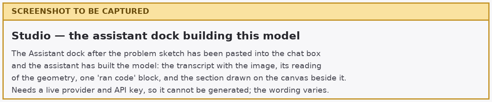

A geometry this simple is faster to describe than to paste, and a sentence works with
a model that has no vision. Use this instead if you prefer:

```text
Build a model for a simple slope on a rigid foundation. The slope is 20 ft high
and the slope face is at an inclination of 1:1, with a level crest extending 40 ft
back from the top of the slope. The slope is a uniform soil with a unit weight of
125 pcf and an undrained strength of c = 500 psf, phi = 0. Add a starting circle
for a critical-surface search.
```

The assistant builds into the open project, not into a file: its work appears on the
canvas immediately and lands on the undo stack as one labeled step. Nothing is saved
until you use **Save As**.

### Check its work

This is the part that teaches. Read what it built against the section it was given,
and correct it in the same conversation — plain sentences work, and each correction
is undoable.

- **φ = 0.** Check this first: it is the judgment the drawing leaves to you, and the
  likeliest miss, because the drawing never states it. If the assistant supplied a
  friction angle, say: *"c = 500 psf is an undrained strength. Set phi to 0 and leave
  the pore pressure option at none."*
- **One material**, γ = `125` pcf, c = `500` psf, strength option `mc`.
- **No water.** There should be no piezometric line. If one was added, have it
  removed — with φ = 0 it cannot change the answer, and a water table nobody asked
  for is an input you will have to explain later.
- **The ground surface** rises 20 ft over a 20 ft run, then runs level. The origin
  does not matter, only the height and the 1:1 face.
- **The maximum depth is at the toe elevation.** The hatched band under the toe is a
  rigid foundation, and it is easy to miss. If the maximum depth is blank or below
  the toe, say: *"The foundation is rigid — set the maximum depth to the elevation of
  the toe."*
- **A starting circle exists**, with its center above and behind the face.
- **Units are declared Imperial**, so the plots label their axes in feet.

Then open the [completed model](../lem/files/xslope_simple_embankment.xlsx) beside
yours and compare. Continue at [Running the analysis](#running-the-analysis).

---

## B — Building the Excel file {#b-building-the-excel-file}

Start from [input_template.xlsx](../inputs/input_template.xlsx) and save a copy under
a name of your own.

Fill the worksheets in the order the model depends on them: `main` first, since the
unit system it declares is what every number after it means; then materials, because
geometry points at a material ID; then geometry; then the failure surface, because a
sensible starting circle depends on the geometry it cuts through.

### 1. The `main` worksheet

Most of this sheet is already right:

1. Confirm `main!D8` **Units** is `Imperial`. Choosing a unit system fills
   `main!D10` **Unit weight of water** with that system's value, `62.4` pcf here.
   XSLOPE never converts between systems — the declaration states what the numbers
   you type already mean, and drives the unit labels on the plots.
2. Leave **Tension crack depth**, **Depth of water in crack** and **Seismic
   coefficient** at `0`.
3. Leave `main!D23` **Water loads** at `auto`, which derives the weight of standing
   water from the water table rather than from a load you type. There is no water
   here, so it changes nothing — but it is the setting to leave alone.
4. Leave **LEM method** and **Number of slices** blank. A blank run option means
   *unspecified — use the default*, which is not the same as zero; you choose the
   method and the slice count at run time.

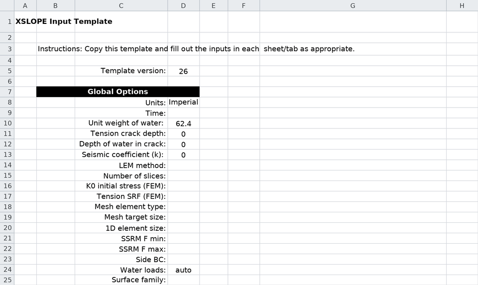

### 2. The `mat` worksheet

One material, first row of the table:

1. `mat!A11` = `1` and `mat!B11` = `soil` — the ID the geometry will reference, and
   a name for the legends.
2. `mat!C11` **γ** = `125`.
3. `mat!E11` **option** = `mc`, the traditional Mohr-Coulomb envelope.
4. `mat!F11` **c** = `500` and `mat!G11` **φ** = `0`. Together these are the
   undrained strength: the envelope is flat, so the strength is 500 psf at every
   depth.
5. `mat!O11` **u** = `none`. There is no pore pressure to compute.

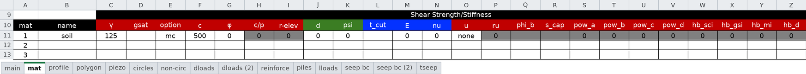

The rest of this 42-column sheet belongs to analyses this problem does not run.
Columns your choices make inert grey themselves out: the c/p pair once the option is
`mc`, and `ru` once **u** is `none`. The screenshot is of the completed file, which a
script wrote and which carries an explicit `0` in columns these steps never mention —
`d`, `psi`, `E`, `nu` and the power-curve and Hoek-Brown groups. Typing your own,
leave them blank; on this sheet a blank in one of those columns reads as zero.

### 3. The `profile` worksheet

1. `profile!B2` **Max Depth** = `0`. This is an *elevation*, not a thickness: it
   places a horizontal rigid base at the toe of the slope.
2. `profile!B5` **Mat ID** = `1` for Profile Line #1 — the ID you gave the material
   on the `mat` sheet.
3. Enter the three ground-surface points in the `x` / `y` columns beneath, left to
   right: `0, 0` then `20, 20` then `60, 20`.

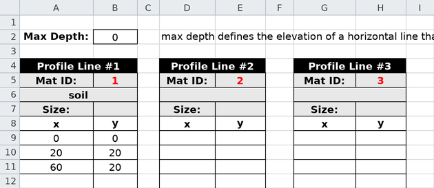

A profile line is the *top* of a material layer: everything below it, down to the next
line or to the maximum depth, is that material.

### 4. The `circles` worksheet

1. `circles!B3` **Xo** = `10` and `circles!C3` **Yo** = `40` — the center of the
   trial circle, above and behind the face.
2. `circles!D3` **Option** = `Depth`, and `circles!E3` **Depth** = `0`.

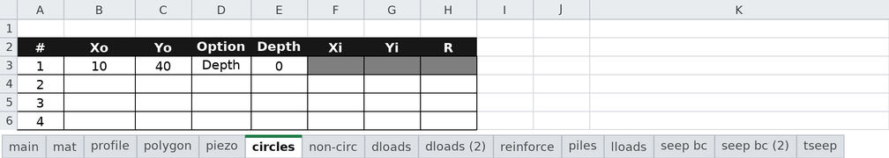

**Depth** is the *elevation of the bottom of the circle*, not a depth below the ground
surface — the name invites the other reading. The radius follows as R = Yo − Depth, so
this circle has R = 40 and just touches the rigid base. The other two options size a
circle by its radius, or by a point it passes through.

Save the workbook and continue at [Running the analysis](#running-the-analysis).

---

## C — Building the problem in Studio {#c-building-the-problem-in-studio}

Start with **File → New**, an empty project. Work down the **Inputs** tree in the
order the model depends on: materials, then geometry, then the failure surface.

### 1. Global parameters

Click **Global parameters** and set **Units** to `Imperial`. The unit weight of water
fills itself with `62.4`; leave the tension crack and seismic fields at `0`, and
click **OK**.

### 2. Materials

Click **Materials** → **Add**, then switch to **List view**:

1. **Name** = `soil`.
2. **γ** = `125`.
3. **Model (option)** = `mc`, **c** = `500`, **φ** = `0`.
4. **Model (u)** = `none`.

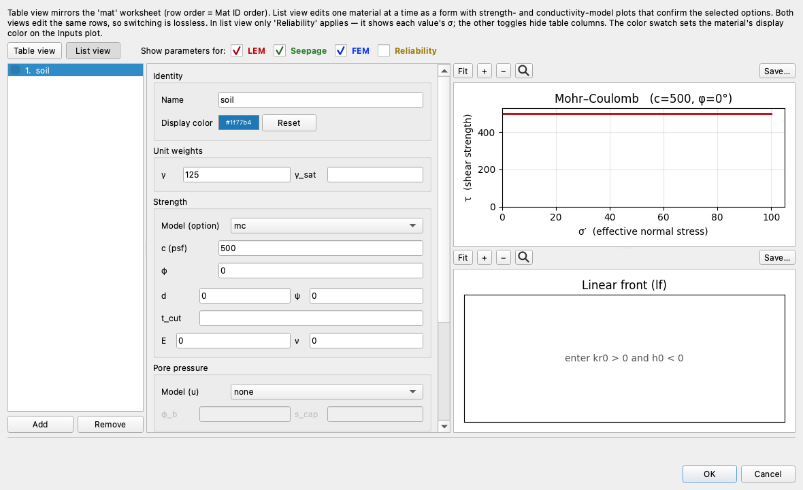

The strength plot beside the fields redraws as you type. Here it is a flat line at
τ = 500 — the picture of an undrained strength, and confirmation you entered the one
you meant.

### 3. Profile lines

Click **Profile lines**, then **Add line**:

1. Set **Max depth (bottom boundary elevation)** to `0`.
2. Set **Material** to `1: soil`.
3. **Add row** three times and enter `0, 0` / `20, 20` / `60, 20`.

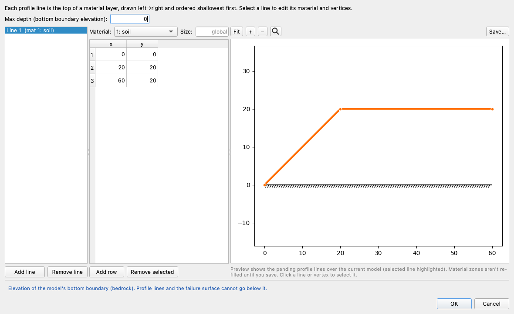

The preview redraws as you type, so a mistyped vertex shows up before you commit it:
the line in the material's color, and the hatched **Max depth** line at y = 0 beneath
it. Click **OK**, and the canvas draws the same two things. Profile-line geometry is
drawn as lines; the shaded material zones you may have seen in other XSLOPE figures
are how *polygon* input is drawn.

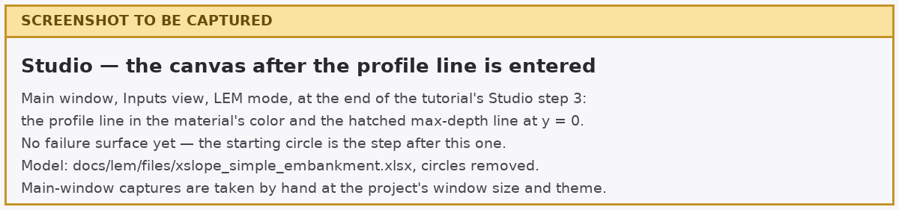

### 4. The starting circle

Studio builds the failure surface from the geometry you just entered. Click
**Run LEM…** with no surface yet:

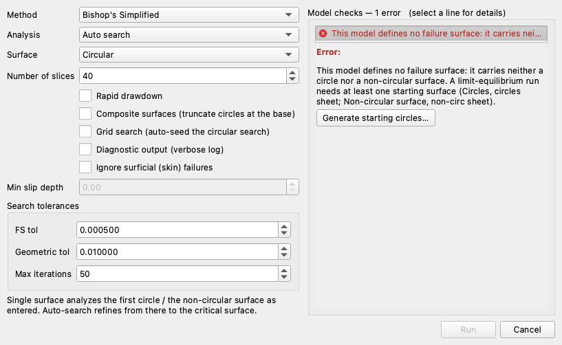

The **Model checks** column reports one error — no failure surface — and **Run** stays
disabled. Under the finding is a **Generate starting circles…** button.

1. Press **Generate starting circles…**. It shows what it would change before it
   changes anything: *"Add 1 starting circle…"*, with the circle it proposes.
2. Apply it, and close the dialog.

Its rule is the one to learn: **one circle through the toe, and one at the base of
each layer**. Here the two candidates share a center — above the middle of the face,
at twice the slope height — and differ only in radius, and the one that survives is
the layer-base circle: R = 40, tangent to the rigid base at y = 0. Reaching the toe
from that same center would take R = 41.23, which puts the bottom of the circle
1.23 ft *below* the base, on ground the model does not contain. That is the candidate
the dialog reports dropping *"for not daylighting inside the model"*.

Now audit what it made. Click **Failure surfaces** in the Inputs tree:

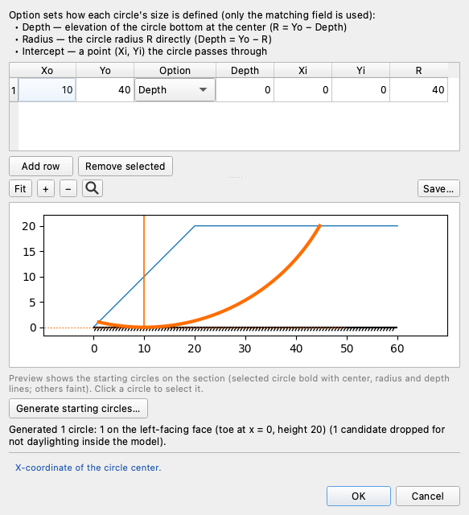

One circle at `(10, 40)`, **Option** `Depth`, **Depth** = `0` — so R = Yo − Depth = 40,
just reaching the base.

Save the project with **File → Save As**.

---

## Running the analysis

All three paths end in the same place: this model open in Studio. If you built the
workbook by hand, open it now with **File → Open**. Whichever path you took, the
Inputs view is now the same picture — the profile line, the hatched base at y = 0, and
the arc of the starting circle between the two points where it daylights.

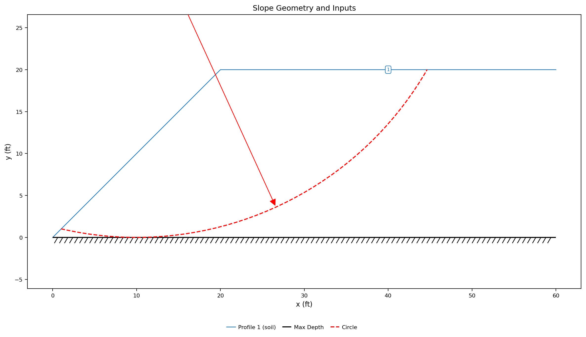

The circle's center is at (10, 40), above the top of the frame; the red arrow is its
radius, drawn from the center down to the arc. Compare this against your own screen
before running anything — a geometry error is far cheaper to find here than in a
factor of safety.

Run the starting circle on its own first — a single, understood surface, solved before
the search adds moving parts.

1. Click **Run LEM…**.
2. **Method** = `Bishop's Simplified`. On a circular surface Bishop satisfies moment
   equilibrium about the circle center, which is the equilibrium condition this
   problem turns on.
3. **Analysis** = `Single surface`, which analyzes the first circle exactly as
   entered.
4. **Surface** = `Circular`, **Number of slices** = `40`.
5. Leave every checkbox clear. **Composite surfaces** is the one worth understanding
   here: it lets a circle deeper than the base of the model be truncated at it and
   run along the base between the crossings. This circle does not reach below the
   base, so the option changes nothing — but where the base is real bedrock it is how
   the critical mechanism gets found.

    

6. Click **Run**.

Then run it again with **Analysis** = `Auto search`, which starts from your circle and
refines toward the critical one.

!!! note "From a script or a notebook"
    The same two runs, without Studio: `generate_slices(slope_data, circle=...)`
    followed by `solve_selected("bishop", slice_df)` for the single surface, and
    `circular_search(slope_data, "bishop")` for the search. See
    [Colab Notebooks](../usage/notebooks.md).

---

## Exploring the results

### The single circle

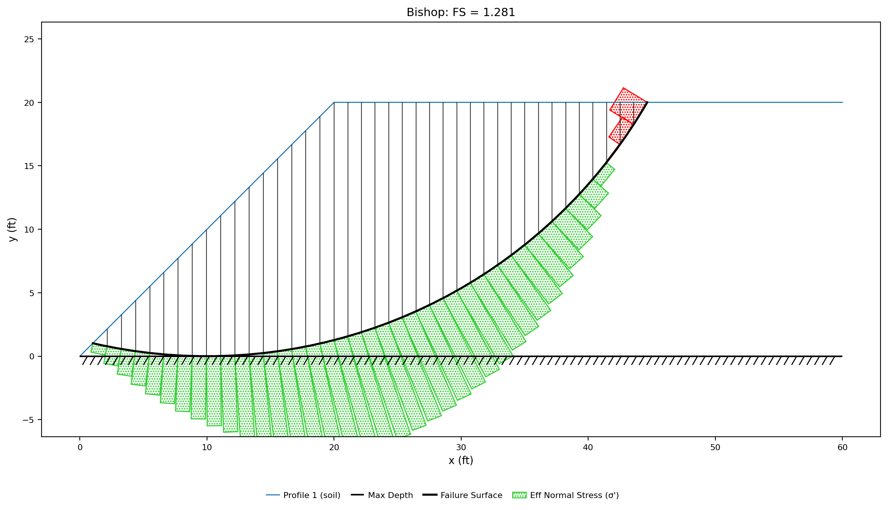

FS = **1.281**, and the plot is worth reading before moving on. The surface enters at
the crest, cuts through the embankment and daylights just above the toe. The green
bars drawn outward from each slice base are the effective normal stress there,
swelling under the tall middle of the slide mass and shrinking toward both ends. The
last few slices at the crest, where the surface is steepest, are drawn red instead:
their bases are in tension.

Now switch **Method** to `Ordinary Method of Slices (OMS)`, `Spencer` or
`Morgenstern-Price`. Every one returns **1.281**. With φ = 0 the resisting force on a
slice base is `c · Δl` whatever normal force acts on it, and on a circular surface the
normal forces all point at the center and take no moment about it — so every method
that takes moments about the center solves the same equation. The force-equilibrium
methods `Janbu (Corrected)`, `Corps of Engineers` and `Lowe & Karafiath` do not, and
report higher values on this very same circle: 1.394, 1.393 and 1.329.

!!! note "If you run Spencer here"
    Spencer and Morgenstern-Price return the same 1.281, but with an amber strip
    across the top of the solution listing admissibility warnings: interslice
    tension, and a line of thrust that leaves the slices on about half the
    boundaries. They say the internal force distribution behind the answer is
    strained, not that the factor of safety is wrong — a circle this steep at the
    crest strains any method that solves for interslice forces. See
    [Interpreting the Admissibility Warnings](../lem/spencer.md#interpreting-the-admissibility-warnings).

### The search

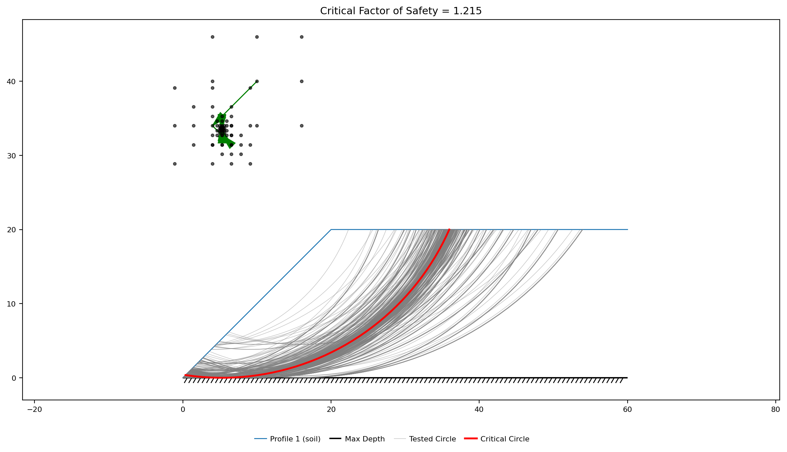

The search tests a family of circles around the one you gave it, moves the center
downhill in factor of safety, and refines the grid it moves on until the answer stops
improving. Here it converges in 12 iterations, from your center at (10, 40) to one
near (5.3, 33.5) — the green track on the plot — at a critical FS = **1.215**. Every
trial surface is drawn in grey behind it, which is the quickest way to see whether the
search explored the slope or sat still.


Both circles bottom out on the rigid base at y = 0: with the strength the same at
every depth there is nothing to be gained by going deeper, and nothing below y = 0
to cut. So what the search moves is the center, back and down — and the circle it
lands on is the *smaller* of the two, not the bigger. The radius falls from 40 ft to
33.5 ft, the arc from 50.9 ft to 43.7 ft, and the slide mass from 61,000 to
43,400 lb per foot of slope, 29% lighter. With φ = 0 the resisting moment is
c · L · R, so it loses both of the lengths it is built from — 28% in all — while the
driving moment loses only 24%, because the lighter mass hangs on a slightly longer
average lever arm about the new center. Resistance falls faster than drive, and the
factor of safety with it.

That 5% drop is a fair warning of how much a hand-placed circle can flatter a slope —
and of how much it matters, since a search refines from where you point it.
[Automated search algorithms](../lem/search.md) covers the grid-seeded search that
protects against a seed in the wrong family.

All seven methods, each on its own critical surface, are tabulated on
[LEM Sample Problem 1](../lem/samples.md#1-simple-embankment). Read that spread
against what you just measured: on any one surface the moment-equilibrium methods
agree, and the force-equilibrium methods do not — they differ on the starting circle
and on the critical circle alike, before any search is involved.

---

## Conclusion

This tutorial demonstrated:

- **The build order** — materials, then geometry, then the failure surface — and why
  it is that order.
- **Profile-line geometry**: one line as the top of one material layer, with the
  maximum depth as a rigid base at the toe elevation.
- **Reading an undrained strength** out of a bare cohesion, and what φ = 0 then makes
  irrelevant: the water table, and the pore-pressure option.
- **Starting circles**, the `Depth` option as an *elevation*, and Studio's generator
  as a worked example of where circles belong.
- **A single surface before a search**, and reading the drop from 1.281 to 1.215.
- **Why φ = 0 makes the moment-equilibrium methods agree** on a given circle, and why
  the force-equilibrium methods still do not.

**Where to go next.**
[LEM Sample Problem 1](../lem/samples.md#1-simple-embankment) carries a second version
of this embankment — a distributed load on the crest, a water-filled tension crack,
and 10 ft of standing water against the face, for a factor of safety below 1.0. Open
it beside your own file and compare the worksheets.
