# Tutorial LEM-2 — Loads on the Crest

A stockpile is going on the crest of [LEM-1](lem01_simple_embankment.md)'s
embankment: 750 psf over a 10 ft strip, set back 5 ft from the top of the face.
The slope, the soil and the rigid base are unchanged — the load is the only new
input, and it is the one that decides the answer.

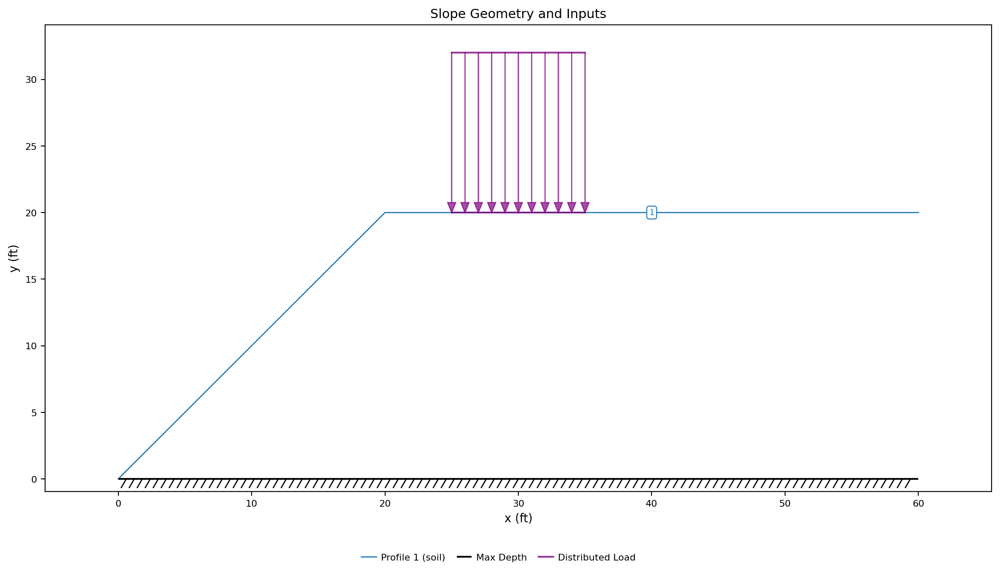{width=1000}

<div class="tut-glance" markdown>
<div class="tgt-row">
<div class="tgt-tile"><span class="tg-label">Analysis</span><p>Limit equilibrium</p></div>
<div class="tgt-tile"><span class="tg-label">Assistant</span><p>~5 min</p></div>
<div class="tgt-tile"><span class="tg-label">By hand</span><p>15–20 min</p></div>
</div>
<div class="tgm-obj" markdown>
**Objectives** — Load an existing model four ways — spread over an area, gathered
onto a point, pushed perpendicular to the ground or straight down, and shaken —
read what each does to the factor of safety and to the critical surface, then run
the sweep that says what strength would carry the load at a target factor of
safety.
</div>
<p><span class="tg-pill">distributed loads</span><span class="tg-pill">line loads</span><span class="tg-pill">load direction</span><span class="tg-pill">seismic coefficient</span><span class="tg-pill">design mode</span></p>
<div class="tgm-model" markdown>**Completed model** — [xslope_crest_surcharge.xlsx](../lem/files/xslope_crest_surcharge.xlsx) — LEM-1's embankment with the surcharge added</div>
</div>

---

## The problem

This tutorial starts from a model that already exists. Build it in
[LEM-1](lem01_simple_embankment.md), or open that page's completed file
directly — [xslope_simple_embankment.xlsx](../lem/files/xslope_simple_embankment.xlsx)
— and save a copy under a name of your own. Nothing in it changes here:

| | |
|---|---|
| **Material** | one Mohr-Coulomb soil, γ = 125 pcf, c = 500 psf, φ = 0 |
| **Geometry** | a 20 ft embankment, 1:1 face, level crest, rigid base at y = 0 |
| **Failure surface** | one starting circle, centre (10, 40), tangent to the base |

The surcharge is a **distributed load**: an intensity in force per unit area,
applied along a line of points on the ground surface, per unit width of slope.
Two points are the whole load here, because the intensity is uniform between
them:

| X (ft) | Y (ft) | N (psf) |
|---:|---:|---:|
| 25 | 20 | 750 |
| 35 | 20 | 750 |

Between x = 25 and x = 35 the ground carries 750 psf; outside that strip it
carries nothing. **A distributed load stops where its points stop** — the
intensity is not spread over the rest of the crest, and it is not tapered at the
ends unless you enter a point saying so.

The table is the input, laid out exactly as the `dloads` worksheet and Studio's
loads editor are — **X**, **Y**, **N**, one point per row. Select the two rows
of values, copy, and paste them straight into the sheet or editor rather than
retyping them.

---

## Choose how you want to build it

Three ways to add the load to the model you opened. They produce the same file —
pick one and skip the other two.

1. **[Add it with the AI assistant](#a-adding-the-load-with-the-ai-assistant)** —
   describe the surcharge in a sentence and check what it entered.
2. **[Add it in the Excel file](#b-adding-the-load-in-the-excel-file)** — one
   worksheet, four cells.
3. **[Add it in Studio](#c-adding-the-load-in-studio)** — the loads editor, with
   the section redrawing beside it.

Whichever you choose, rejoin at [Running the analysis](#running-the-analysis).

---

## A — Adding the load with the AI assistant {#a-adding-the-load-with-the-ai-assistant}

Open your copy of the embankment in Studio and say what is going on the crest:

<div class="prompt-block" markdown>
```text
Add a distributed load of 750 psf to the crest, from x = 25 to x = 35.
```
</div>

The assistant edits the open project, so the load appears on the canvas
immediately and lands on the undo stack as its own labeled step. Nothing is
written to disk until you use **Save As**.

### Check its work

- **The strip is 10 ft wide**, from x = 25 to x = 35 — not the whole crest. Two
  points, both at y = 20, both at 750 psf.
- **The intensity is a pressure**, 750 psf, not a total force. If it entered
  7500, say: *"750 psf is the intensity along the strip, not the total. Set both
  points' Normal to 750."*
- **The points sit on the ground surface**, at the crest elevation y = 20. A load
  line floating above the ground is applied where you drew it, not where the
  ground is.
- **The points run left to right**, x = 25 first and x = 35 second. The
  intensity between two points is interpolated along the line, so the order
  decides which end carries which value on a load that is not uniform. If they
  came back reversed, say: *"List the load points in increasing x."*
- **Nothing else moved.** The material, the profile line, the maximum depth and
  the starting circle are LEM-1's, unchanged.

Continue at [Running the analysis](#running-the-analysis).

---

## B — Adding the load in the Excel file {#b-adding-the-load-in-the-excel-file}

Open your copy of the embankment workbook and go to the **dloads** worksheet.
Everything else in the file is already right.

The sheet carries six load blocks side by side, four columns apart — **X**,
**Y**, **N**, then a gap. This model uses the first, and the rest stay empty.
Enter (or copy-paste) the two load points from the table above, and leave
`dloads!D5` **Direction** blank. A blank cell means `normal` — the load acts
perpendicular to its own line — and on a level crest that is straight down
anyway. It is the [face load](#which-way-the-load-pushes) further down this
page where the word starts to matter.

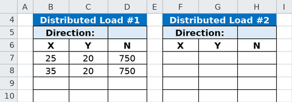

**Points run left to right.** The loader re-orients a line entered the other way
round, but the intensity between two points is interpolated along the line, so
the order is what decides which end carries which value on a load that is not
uniform.

Save the file and continue at [Running the analysis](#running-the-analysis).

---

## C — Adding the load in Studio {#c-adding-the-load-in-studio}

Open your copy of the embankment and click **Distributed loads** in the
**Inputs** tree, then **Add load**.

The editor holds two sets on tabs — **Set 1** and **Set 2 (rapid drawdown)**.
Set 1 is what an ordinary analysis uses; Set 2 is the second stage of a rapid
drawdown, and stays empty here.

1. Press **Add row** twice and enter `25, 20, 750` and `35, 20, 750` under **X**,
   **Y** and **Normal**.
2. Leave **Direction:** at **Normal (perpendicular to the line)**. On the level
   crest the perpendicular *is* straight down, so the two options describe the
   same force — the choice is made further down this page, on the face.

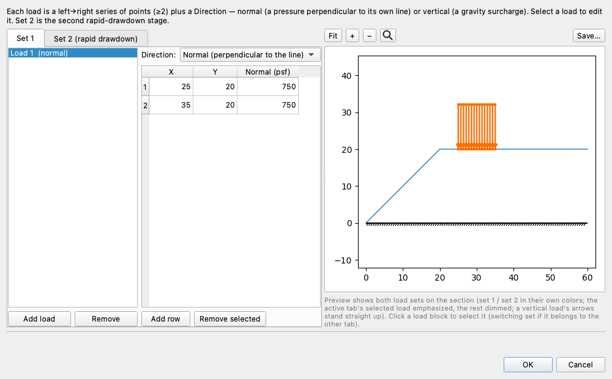

The preview draws the load on the section as you type, which is where a mistyped
X shows up: the arrows should stand on the crest between 25 and 35, not hang in
the air above it. Click **OK**.

Continue below.

## Running the analysis

However you added it, you now hold the same model:

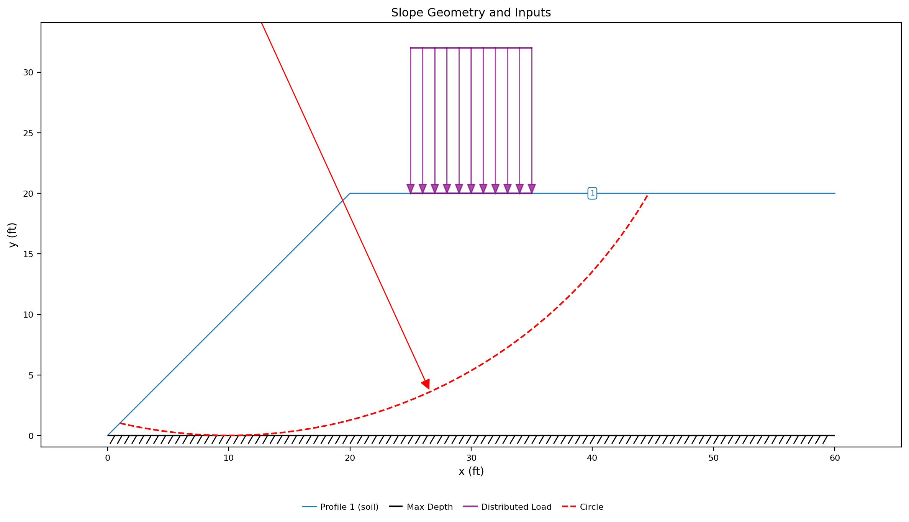{width=1000}

Click **Run LEM…** and choose **Method** = `Spencer` and **Analysis** =
`Auto search`, with the slice count left at 40. **Surface** is not a choice on
this model: it reads `Circular` as a fixed label, because the model defines
circles and no non-circular surface.

---

## Exploring the results

### What the surcharge did

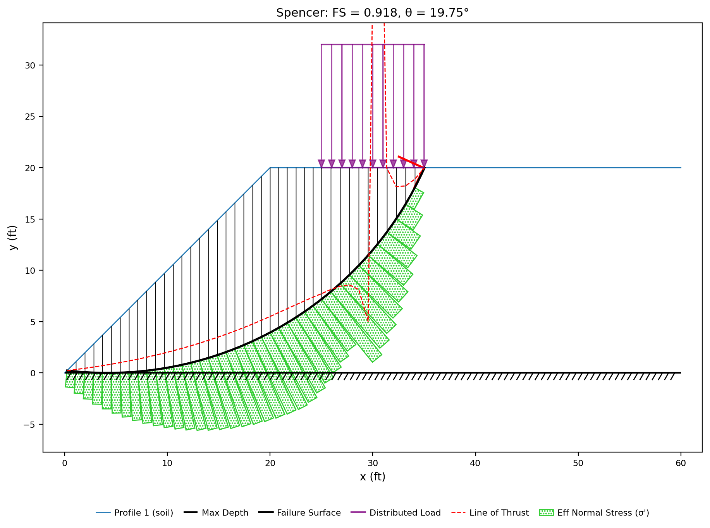{width=1000}

**FS = 0.918.** The unloaded slope stood at 1.276; 750 psf over 10 ft of crest
takes 28% off it and puts the embankment below 1. That is a large answer from a
small-looking input, and the reason is visible in the figure rather than in the
number: **the surface moved to find the load.**

| | unloaded | with the surcharge |
|---|---:|---:|
| Factor of safety (Spencer) | 1.276 | 0.918 |
| Circle radius (ft) | 40.4 | 33.8 |
| Surface exits the crest at x = | 44.5 | 35.0 |
| Length of the surface (ft) | 50.8 | 42.8 |
| Weight of the sliding mass (lb/ft) | 60,436 | 40,925 |

The critical circle is *smaller* than the unloaded one and reaches a third less
soil, yet it is the more critical of the two. It exits the crest at x = 35.0 —
the far edge of the loaded strip, to the inch. The search settled on the surface
that carries the entire surcharge and no soil beyond it, because past x = 35
every extra foot of arc adds strength without adding load: with φ = 0 the
resistance is c times the length of the surface, and this one is 8 ft shorter
than the unloaded critical surface while carrying 7500 lb/ft more force.

### The warnings LEM-1 left behind

LEM-1's uncracked embankment could not be solved cleanly: Spencer and Bishop
disagreed (1.276 against 1.215) because the crest slices were being asked to
carry tension, and 26 of the trial circles that ranked below the reported minimum
admitted no solution at all. Run the loaded model with Bishop, OMS or
Morgenstern-Price and all three return **0.918 on the same circle** as Spencer,
and no trial circle below the minimum goes unsolved.

The surcharge is what changed: pressing down on the crest is the opposite of the
tension that was breaking those solutions, and it shows up between the slices
rather than under them. On LEM-1's critical surface Spencer's most tensile
interslice force was −3258 lb/ft against a largest compression of 5568 — 58% of
it. Under the surcharge it is −822 lb/ft against 6234, or 13%, and Spencer's
line-of-thrust warning clears. The base itself barely moves: the most tensile
base stress goes from −666 psf to −561 psf. So the interslice tension warning is
still there, smaller — the crest of a φ = 0 slope is a place where tension is
always near, and Morgenstern-Price still puts its line of thrust outside the
slice on 15% of the boundaries — but no tensile boundary now decides which
surface the search is able to report.

### The same force as a line load

A **line load** is a concentrated force per unit width, acting at one point on
the ground surface: a footing, or the weight of a wall facing. The surcharge
above amounts to 750 psf × 10 ft = **7500 lb/ft**. Put all of it on the single
point at the middle of the strip instead — one row, in the columns the `lloads`
worksheet and Studio's line-loads editor share:

| Label | x (ft) | y (ft) | P (lb/ft) | Angle (deg) |
|---|---:|---:|---:|---:|
| footing | 30 | 20 | 7500 | -90 |

- **Studio** — click **Line loads** in the **Inputs** tree, **Add row**, and
  enter the row above.
- **Excel** — on the **lloads** worksheet, paste the row into `B3:F3`. Delete
  the distributed load from `dloads`.
- **Assistant** — say: *"Replace the distributed load with a line load of 7500
  lb/ft at x = 30, pointing straight down."*

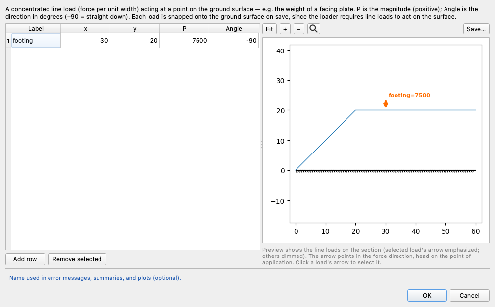

**Angle is measured from horizontal**, and −90 is straight down — the default a
blank cell takes, and the only value a dead weight ever needs. `P` is a
magnitude and must be positive; the direction lives entirely in the angle.

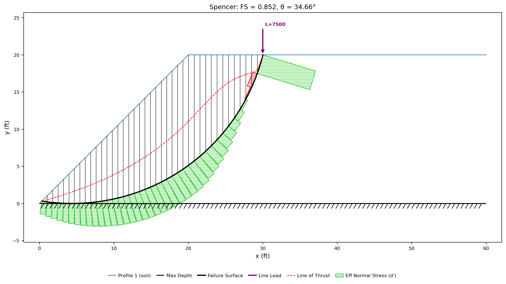{width=1000}

**FS = 0.852**, against 0.918 for the same total force spread over the strip. The
concentrated form is the more severe of the two, and the reason is the same one
as before: the critical surface stops where the load stops. It exits the crest at
x = 30.0 — the load point — where the spread version had to run out to x = 35 to
collect the last of the strip. That is 3.7 ft less arc, and with φ = 0 arc length
*is* resistance: 19,552 lb/ft of it against 21,418. Identical resultants, and the
concentrated one lets the slope fail on a shorter surface.

### Which way the load pushes {#which-way-the-load-pushes}

Every distributed load carries a **Direction**, and it has two settings:

- **`normal`** — the load acts perpendicular to its own line. This is a pressure
  on a surface, and it is what water does. It is what a blank cell means.
- **`vertical`** — the same intensity acts straight down. This is what a dead
  weight does: a stockpile presses down under gravity whatever the ground beneath
  it is doing.

On the level crest the two are the same force, which is why nothing above turned
on the choice. Move the stockpile onto the 1:1 face — the same 750 psf, between
elevations 5 and 15 — and they are not:

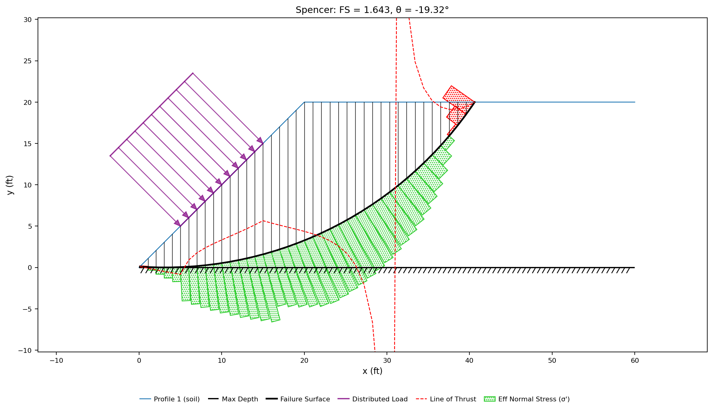{width=1000}

**FS = 1.643** with **Direction** = `normal`. The arrows in that figure point
into the hill at 45°, because perpendicular to a 1:1 face is 45° from vertical:
the reading gives the load a horizontal component equal to its own magnitude,
shoving the slope sideways into itself. The answer comes out *above* the unloaded
1.276 — the surcharge is holding the slope up.

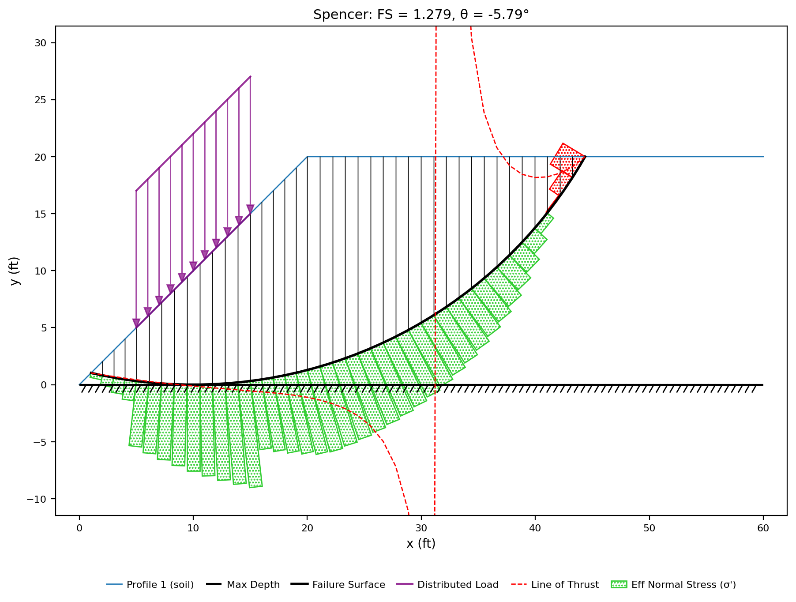{width=1000}

**FS = 1.279** with **Direction** = `vertical`. The same stockpile, the same
total force, pointed the way gravity points: essentially the unloaded answer,
which is what a weight added to the middle of a face does — it drives and resists
in almost equal measure.

**The two readings differ by 28% here, and one of them is wrong for a
stockpile.** A pile of gravel does not push horizontally into a hillside. Choose
`normal` for a pressure — ponded water, a reservoir, anything acting *on* a
surface — and `vertical` for anything whose load is its own weight. On level
ground the choice is free; on a face it is worth a quarter of the factor of
safety.

### A second kind of demand

A **seismic coefficient** applies a horizontal force of k × W to every slice, at
the slice's centre of gravity — the pseudo-static way of asking what an
earthquake would do. It is a single global number:

- **Studio** — open **Global parameters** and set **Seismic coefficient k**.
- **Excel** — `main!D13`.
- **Assistant** — say: *"Set the seismic coefficient to 0.15."*

With the crest surcharge back in place:

| k | 0.00 | 0.10 | 0.15 |
|---|---:|---:|---:|
| Factor of safety (Spencer) | 0.918 | 0.817 | 0.774 |

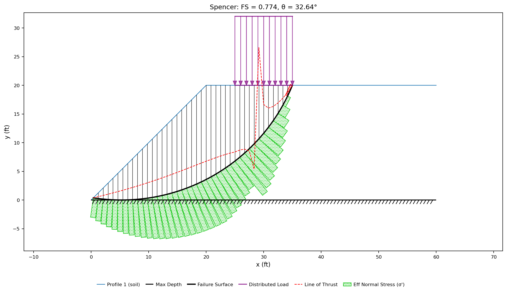{width=1000}

**k is unconditionally driving.** It is applied in the direction that reduces the
factor of safety, and it acts on the whole sliding mass rather than on the loaded
strip: at k = 0.15 that is 0.15 × 40,925 = 6,139 lb/ft of horizontal force,
against the 7,500 lb/ft the surcharge itself weighs. Pushed sideways rather than
pressed down, the same order of force costs less — 0.144 off the factor of
safety, where the surcharge took 0.358.

### What strength would carry it

The model as it stands is not supportable: 0.918 is below 1 before any
earthquake. The question an engineer asks next is not *what is the factor of
safety* but *what would it take to reach the one I need* — and that is a sweep,
not a guess.

**Design mode** varies one input across a range, solves the model at every step,
and reports the value where the answer crosses a target. Ask it what cohesion
would hold FS = 1.5 under the surcharge.

In Studio, click **Run → Parametric…**:

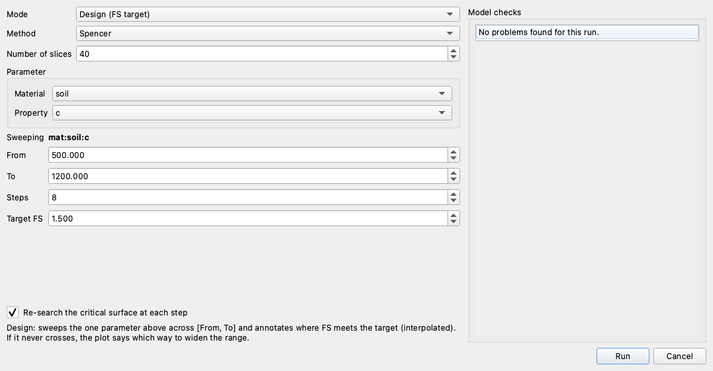

1. **Mode** = `Design (FS target)`.
2. Under **Parameter**, **Material** = `soil` and **Property** = `c`. The
   **Sweeping** line echoes back what that resolves to, `mat:soil:c`.
3. **From** `500`, **To** `1200`, **Steps** `8`, **Target FS** `1.5`.
4. Leave **Re-search the critical surface at each step** ticked. On this model it
   changes nothing: one uniform φ = 0 soil, so raising c raises the resistance
   along every surface at once and every step comes back on the same circle.
   That is the exception. **Give the model layers, or a friction angle, and the
   critical surface migrates as the parameter moves** — and a sweep that
   re-solves one fixed surface is then answering about a surface that stopped
   being critical several steps ago.
5. **Run**.

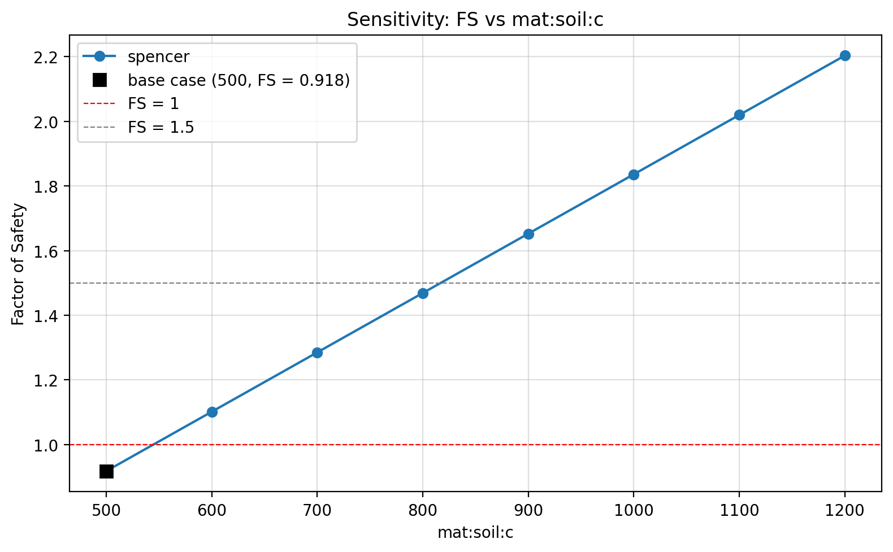{width=1000}

**c = 817 psf.** The soil would have to be 63% stronger than the 500 psf it has
to carry this stockpile at a factor of safety of 1.5.

Two things about the curve are worth reading:

- **It is a straight line.** With φ = 0 the strength along the surface is c ×
  length and the driving side does not involve c at all; the search returns the
  same circle at every step, so that length is the same one throughout and the
  factor of safety is exactly proportional to cohesion. A sweep on a φ > 0 soil,
  or one whose critical surface moves, bends.
- **The target is bracketed.** The sweep crossed 1.5 inside the range it was
  given, so 817 psf is interpolated between two solved points rather than
  extrapolated past the last one. A target that never crosses is reported as
  such, with the direction to widen the range — a design sweep never invents an
  answer outside what it solved.

Cohesion is only the parameter that was asked about. The same sweep runs on the
unit weight, on the seismic coefficient, or — through **Back-Analysis**, the same
dialog with the target fixed at FS = 1.0 — backwards out of a slope that has
already failed. Flattening the face, shrinking the stockpile or moving it further
back from the crest are the other three answers to the same question, and each of
them is a model you now know how to build.

---

## Conclusion

This tutorial demonstrated:

- Distributed loads as an intensity along a line of points on the ground surface,
  applied only between the points that carry it.
- Line loads as a concentrated force per unit width at one point, with the
  direction carried by an angle measured from horizontal.
- Load direction: `normal` is a pressure perpendicular to the loaded line,
  `vertical` is a dead weight — identical on level ground, worth 28% of the
  factor of safety on a 1:1 face.
- The seismic coefficient as a second kind of demand, applied to every slice as
  k × W and always driving.
- Design mode: sweeping one input across a range to find the value that meets a
  target factor of safety, re-searching the critical surface at every step.
- Reading a load through the surface it moves: the critical circle reorganised
  itself around the loaded strip, and the compression it added narrowed the
  disagreement between the methods from 9.9% to 3.8% — LEM-1's crest tension is
  reduced, not gone.

**Where to go next:** [Tutorial LEM-3](lem03_layered_slope.md) gives the ground
under the slope a second material — the case this page's design sweep names as
the one where the critical surface migrates as the parameter moves.
[Design Mode](../parametric/design.md) and
[Back-Analysis](../parametric/back_analysis.md) carry the sweep above further —
every parameter it can vary, and what a sweep that never reaches its target
reports instead.
