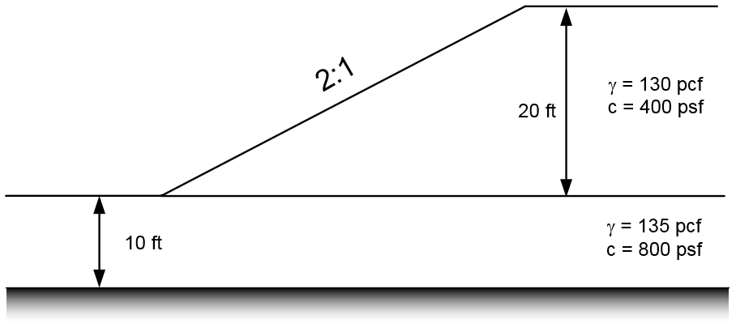
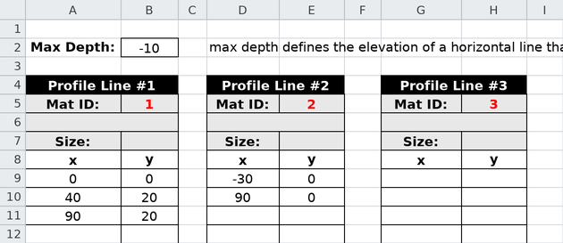
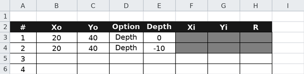
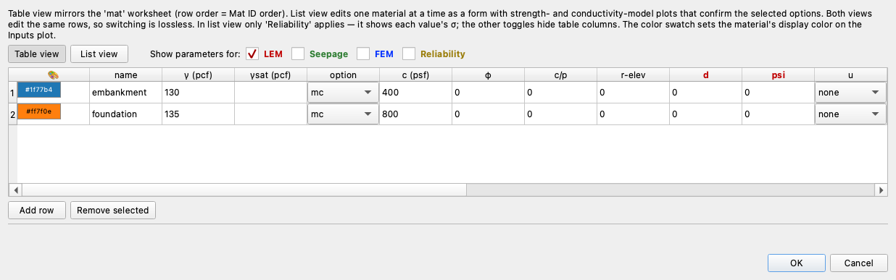
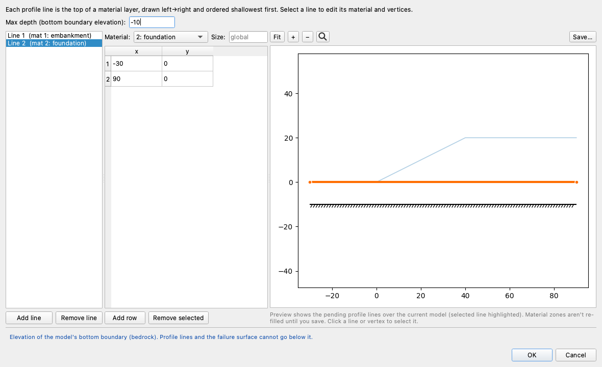
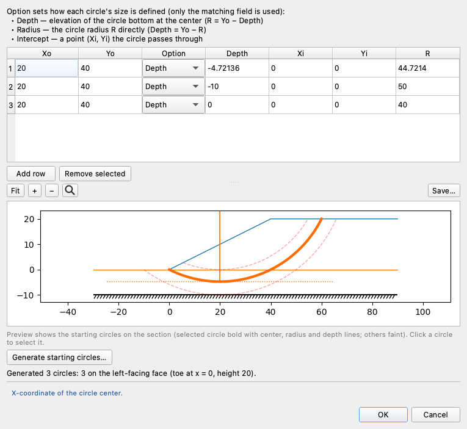
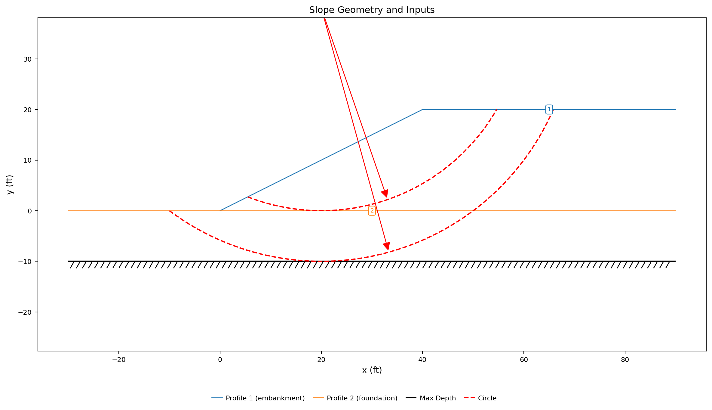
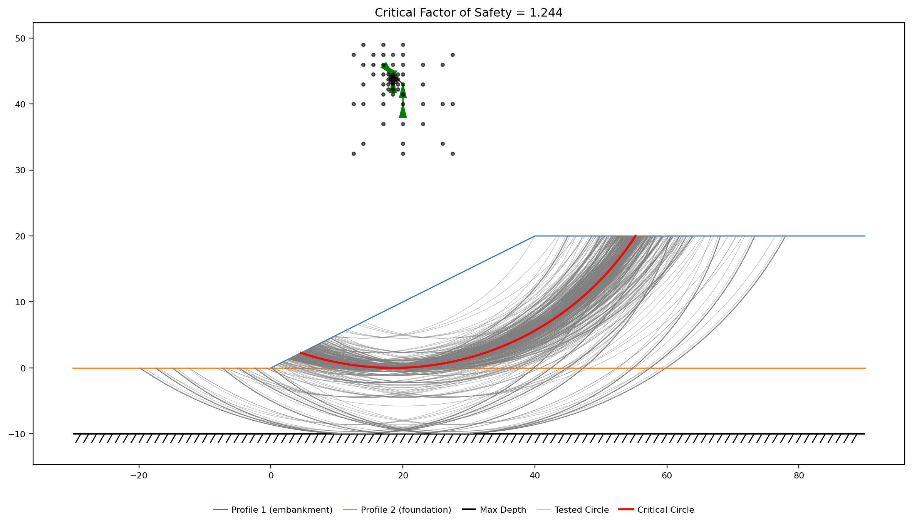
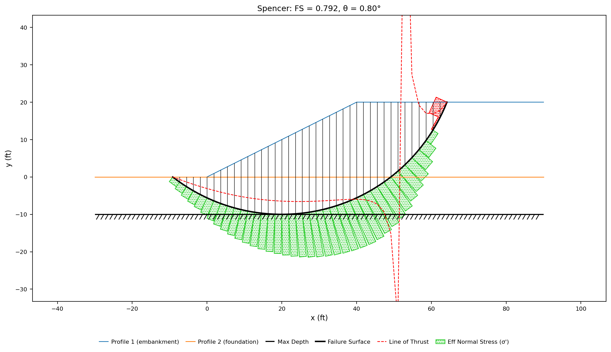

# Tutorial LEM-3 — A Layered Slope

A 20 ft embankment with a 2:1 face, built on a 10 ft foundation layer over rigid
rock. Two soils, both undrained, and the fill is the weaker of them: c = 400 psf
against the foundation's 800. Nothing in the geometry says how deep the failure
surface will go — **the contact between the two layers decides that**, and the
model has to be built so the search can ask about both sides of it.

{width=700}

<div class="tut-glance" markdown>
<div class="tgt-row">
<div class="tgt-tile"><span class="tg-label">Analysis</span><p>Limit equilibrium</p></div>
<div class="tgt-tile"><span class="tg-label">Assistant</span><p>~5 min</p></div>
<div class="tgt-tile"><span class="tg-label">By hand</span><p>15–20 min</p></div>
</div>
<div class="tgm-obj" markdown>
**Objectives** — Build a section with two material zones, put a profile line on
the boundary between them and a starting circle at the base of each, and read the
search result at depth: which layer the critical surface runs in, why it stops
where it does, and what would have to change for the deeper circle to be the
answer.
</div>
<p><span class="tg-pill">two materials</span><span class="tg-pill">profile lines</span><span class="tg-pill">per-layer starting circles</span><span class="tg-pill">generated circles</span><span class="tg-pill">circular search</span></p>
<div class="tgm-model" markdown>**Completed model** — [xslope_simple_mult_layers.xlsx](../lem/files/xslope_simple_mult_layers.xlsx) — the same file used by [LEM Sample Problem 3](../lem/samples.md#3-simple-slope-with-multiple-layers)</div>
</div>

---

## The problem

**Materials** — two Mohr-Coulomb (`mc`) soils, both undrained. Unit weights are
pcf and cohesions psf; the row order is the Mat ID the profile lines reference,
and neither soil carries pore pressures — `u` stays `none` — so the table ends
at φ:

| name | γ | γsat | option | c | φ |
|---|:---:|:---:|---|:---:|:---:|
| `embankment` | 130 |  | `mc` | 400 | 0 |
| `foundation` | 135 |  | `mc` | 800 | 0 |

**Geometry** — a profile line is the *top* of a material layer: everything below
it, down to the next line or the maximum depth, is that layer's material, so a
two-layer section takes two lines and the second is the boundary between the
layers. Geometry can be entered as profile lines or as polygons — one closed
region per material — but profile lines are the faster input for simple layered
sections like this one. One line per material, listed top down, each table one
vertex per row in the paired `x` / `y` columns its worksheet block carries.

**Profile Line 1 — material 1 (`embankment`):**

| x (ft) | y (ft) |
|:---:|:---:|
| 0 | 0 |
| 40 | 20 |
| 90 | 20 |

**Profile Line 2 — material 2 (`foundation`):**

| x (ft) | y (ft) |
|:---:|:---:|
| -30 | 0 |
| 90 | 0 |

Line 1 is the ground surface: the toe, the crest break at the top of the 2:1
face, and the back of the crest. Line 2 is the contact — the top of the
foundation, running the full width of the section. Maximum depth = `-10`, the
elevation of the rigid rock.

**Lines go where the material changes, and nowhere else.** The toe and the crest
break are corners of the ground surface, not layer boundaries: they are vertices
of line 1.

The ground runs 30 ft past the toe at elevation 0 because the foundation
continues there. A surface that dips into the foundation has to come back up
somewhere, and it comes up on that flat ground — a section that stopped at the
toe would have nowhere to put the deep mechanism this problem is about.

**Starting circles** — two, sharing a center above the middle of the face at
twice the slope height, one tangent to the base of each layer:

| Xo | Yo | Option | Depth |
|:---:|:---:|---|:---:|
| 20 | 40 | Depth | 0 |
| 20 | 40 | Depth | -10 |

The tables are the model, and each is laid out exactly as its destination is —
the template's worksheets and Studio's editors, same columns in the same order.
Select a table's block of values, copy, and paste it straight into the sheet or
editor rather than retyping it.

---

## Choose how you want to build it

Three ways to get this model into XSLOPE. They produce the same model — pick one
and skip the other two.

1. **[Build it with the AI assistant](#a-building-it-with-the-ai-assistant)** —
   describe both layers in a sentence and audit what it entered.
2. **[Build the Excel input file](#b-building-the-excel-file)** — three
   worksheets, a second row in each.
3. **[Build it in Studio](#c-building-it-in-studio)** — the editors, with the
   section redrawing beside them.

Whichever you choose, rejoin at [Running the analysis](#running-the-analysis).

---

## A — Building it with the AI assistant {#a-building-it-with-the-ai-assistant}

The drawing at the top of this page carries what the assistant needs — layer
thicknesses, the face inclination, both unit weights, both strengths. Paste it
into the chat box and type `Build this model`, or describe it:

<div class="prompt-block" markdown>
```text
Build a model for a 20 ft embankment with a 2:1 face on a 10 ft foundation layer over rigid rock. The embankment is 130 pcf with c = 400 psf, phi = 0; the foundation is 135 pcf with c = 800 psf, phi = 0. The crest runs 50 ft back from the top of the face, and the ground continues 30 ft beyond the toe. Add starting circles for a critical-surface search.
```
</div>

### Check its work

- **Two materials, the fill first.** The order fixes the Mat IDs, and the profile
  lines reference materials by ID — so an embankment entered second is a section
  built upside down.
- **φ = 0 in both.** The drawing gives a cohesion and no friction angle, which is
  an undrained strength; it never says so. If a friction angle appeared, say:
  *"Both strengths are undrained. Set phi to 0 in both materials and leave the
  pore pressure option at none."*
- **Two profile lines, one per material.** The ground surface on material 1, and
  the contact at y = 0 on material 2. A model with a single line has one layer,
  whatever the material table says.
- **The foundation's line spans the whole section**, from x = −30 to x = 90 —
  including the 30 ft beyond the toe, where the foundation is the ground surface.
- **The maximum depth is the elevation of the rock**, `-10`, not a thickness and
  not the toe elevation. If it came back at 0, say: *"The rigid base is 10 ft
  below the toe — set the maximum depth to -10."*
- **One starting circle at the base of each layer**, both centered above the
  middle of the face. If only one arrived, say: *"Add a second starting circle
  tangent to the base of the foundation, at the same center."*

Continue at [Running the analysis](#running-the-analysis).

---

## B — Building the Excel file {#b-building-the-excel-file}

Start from [input_template.xlsx](../inputs/input_template.xlsx) and save a copy
under a name of your own. Confirm `main!D8` **Units** is `Imperial` and leave the
rest of that sheet alone — no tension crack, no seismic coefficient, and the run
options blank.

### 1. The `mat` worksheet

One row per material, and the row number is the ID. Enter (or copy-paste) the
material properties from the table above, as shown below:


**Rows are ordered top down.** The first row is the material at the surface and
the second the one beneath it, which is the order the profile lines below
assume.

### 2. The `profile` worksheet

1. `profile!B2` **Max Depth** = `-10`. This is an *elevation*: it puts the rigid
   base 10 ft below the toe.
2. Profile Lines #1 and #2 — set each line's **Mat ID** and enter (or
   copy-paste) its vertices from the geometry tables above, one line per
   material, top down.



The second line needs only its two endpoints because it is straight, and it is
the one input that turns a single-material section into a layered one:
everything between it and the maximum depth is now the foundation.

### 3. The `circles` worksheet

Two starting circles, sharing a center above the middle of the face at twice the
slope height — x = 20, y = 40 — and differing only in how deep they reach. Enter
(or copy-paste) the two circles from the table above, as shown below:



**Depth is the elevation of the circle's lowest point**, so `0` is a circle
tangent to the top of the foundation and `-10` one tangent to the rock. One per
layer base is the rule on layered ground: each circle asks about the mechanism
that rides that layer's bottom, and the search reports whichever turns out to be
worse.

Save the file and continue at [Running the analysis](#running-the-analysis).

---

## C — Building it in Studio {#c-building-it-in-studio}

Start with **File → New** and work down the **Inputs** tree.

### 1. Materials

Click **Materials**. The editor opens on **Table view**, which mirrors the `mat`
worksheet one material per row — the right shape here, because the two soils are
read against each other and the row order is what fixes the Mat IDs.

Press **Add row** twice and enter (or copy-paste) the two materials from the
table above — the block starts at the first `name` cell, and its columns are the
editor's own:



The swatch at the left of each row is the color that material's zone takes on
every plot. Click **OK**.

### 2. Profile lines

Click **Profile lines**, and set **Max depth (bottom boundary elevation):** to
`-10` — an elevation, which puts the rigid base 10 ft below the toe.

1. Press **Add line**, set **Material:** to `1: embankment`, and **Add row**
   three times for `0, 0` / `40, 20` / `90, 20`.
2. Press **Add line** again, set **Material:** to `2: foundation`, and **Add
   row** twice for `-30, 0` and `90, 0`.

The second line is the contact: by the [top-of-a-layer rule](#the-problem),
everything below it down to the maximum depth is foundation. With it selected,
the editor holds its two vertices and the preview draws it running the full
width of the section:



The preview redraws as you type: two lines in the two materials' colors, and the
hatched line marking the bottom boundary at elevation −10 beneath both. Click
**OK**.

### 3. Starting circles

Click **Circles**, then press **Generate starting circles…**. The generator
reads the geometry and proposes a set from it — one circle through the toe, one
at the base of each layer, all centered above the middle of the face at twice the
slope height.



On this section that is **three circles**, and the summary line under the button
says so: *"Generated 3 circles: 3 on the left-facing face (toe at x = 0, height
20)."* Read the **Depth** column, which is the elevation each one reaches:

| # | Depth | What it is |
|---|:---:|---|
| 1 | −4.72136 | the toe circle — from this center, the arc through the toe bottoms out 4.7 ft inside the foundation |
| 2 | −10 | tangent to the rigid rock, the base of the foundation |
| 3 | 0 | tangent to the top of the foundation, the base of the embankment |

The summary reports all three candidates kept — on a section where a circle
cannot daylight inside the model, it says so instead. Click **OK**.

Continue below.

## Running the analysis

However you built it, you now hold the same model:

{width=1000}

The two profile lines are drawn in their materials' colors, and the two dashed
red arcs are the starting circles: the shallow one bottoming out on the contact,
the deep one on the rock. Their radius arrows run off the top of the frame: the
center the two circles share, (20, 40), sits above it — twice the height of a 20
ft slope.

Click **Run LEM…** and choose **Method** = `Spencer` and **Analysis** =
`Auto search`, with the slice count left at 40:


---

## Exploring the results

### What the starting circles say before anything is searched

Each starting circle is a complete failure surface in its own right, and solving
the three of them — the two the file carries, plus the generator's toe circle —
is the fastest read on which mechanism this section has. **The table below is
this page's own comparison, not something the program prints.** Each row is a
run you can repeat: solve that circle alone with **Run LEM…** and **Analysis** =
`Single surface`; the factor of safety is the number on that run's solution
plot, and the weight is ΣW summed over the run's slices:

| Circle | Depth | Factor of safety | Weight of the sliding mass (lb/ft) |
|---|:---:|:---:|:---:|
| Base of the embankment | 0 | **1.247** | 61,224 |
| Through the toe | −4.72 | 1.646 | 100,872 |
| Base of the foundation | −10 | 1.656 | 157,486 |

The deep circles carry up to 2.57 times the weight of the shallow one and are
still a third safer, because everything they add is in the foundation:
twice the cohesion of the fill along every extra foot of base. On this section
the shallow mechanism controls before the search starts.

### The search result

When the search completes, the search-results plot shows every circle it tried and
the critical one in red:

{width=1000}

The grey circles show both families being tried — the shallow set clustered on
the contact, the deep set running down to the rock. The green arrows trace the
center's walk from the two circles' shared start at (20, 40) to (18.5, 43.75):
both seeds are refined together, and both end on the same surface.

{width=1000}

**FS = 1.244**, on a circle centered at (18.5, 43.75) with a radius of 43.75. Its
lowest point is at elevation 0.000: the critical surface is tangent to the
contact, running along the top of the foundation without entering it. Every one
of the 40 slice bases carries c = 400 psf, the fill's strength.

The solution carries two admissibility warnings — interslice tension (a most
tensile −1436 lb/ft against a largest compression of 7382) and a line of thrust
outside the slice on 15% of the boundaries. This is the crest tension of a φ = 0
slope that [LEM-1](lem01_simple_embankment.md) diagnoses and fixes with a tension
crack; adding one here at z<sub>c</sub> = 2c/γ = 6.15 ft gives a clean solution at
**FS = 1.175**, on a circle still tangent to the contact. It changes nothing
about which surface is critical, and unlike LEM-1's uncracked embankment it never
prevented one from being solved: Spencer answered on all 529 trial surfaces the
search tried.

### Guarding against local minima

A search walks downhill from its starting circle, so what it returns is the best
surface in the neighborhood it started in — not necessarily the model's minimum.
The guard is simple: **try several starting circle locations and confirm they
agree.** That is what the per-layer set is for. Run the search from the shallow
circle, the deep circle, or the generator's toe circle and every one returns the
same surface here — tangent to the contact, FS = 1.244.

The failure this guards against looks like success. Seed the search with an arc
wildly out of scale with the section — a center 220 ft above the slope, R = 269
ft — and it converges without complaint, reporting **1.784**, 43% high, on a
long flat surface that is only a local minimum. Nothing in the output says so.
Circles built from the section, like the generated per-layer set, keep the
start in scale; agreement across several starts is the check.

Some sections genuinely hold two competing mechanisms, and layering is the
usual way to get one — [Sample Problem 13](../lem/samples.md#13-multiple-local-minima)
is a cohesionless embankment on soft clay where a free search collapses onto a
shallow sliver on the face and the deep foundation mechanism has to be seeded to
be found at all. Which is why the rule is per layer rather than per model: the
circle you can argue was unnecessary costs one row on a worksheet, and the one
you left out costs the answer.

### When the deep circle is the answer

Which layer is weak is a property of the soils, not of the geometry, and it is
the whole question. Take the same section and give the foundation c = 300 psf —
below the fill's 400 — with everything else unchanged:

{width=1000}

**FS = 0.792**, and it is a different mechanism entirely. The critical circle is
now tangent to the rock at elevation −10; it exits 9 ft beyond the toe, on the
flat ground the section provides for it, and reaches back to x = 64 in the crest.
It weighs 152,758 lb/ft against the 61,393 of the answer above, and its base runs
through both soils. Deeper is now lower: a circle held at the contact gives
1.250 against the 0.792 at the rock.

Two things follow. **A layered model has one candidate mechanism per layer**, and
a set of starting circles that names them all is how the model states that — the
circle that looked redundant here is the whole answer under a different soil.
And **a search cannot be audited by its own number**: 1.244 and 0.792 come from
the same geometry, the same three build paths and the same run settings, and the
only thing that tells them apart is reading how deep the reported surface went
and what it ran through.

### What the other methods say

The search finds each method its own critical circle:

| OMS | Bishop | Janbu | Corps | Lowe | Spencer | M-P |
|:---:|:---:|:---:|:---:|:---:|:---:|:---:|
| 1.244 | 1.244 | 1.313 | 1.326 | 1.285 | 1.244 | 1.244 |

The four methods that satisfy moment equilibrium — OMS, Bishop, Spencer and
Morgenstern-Price — land on the same circle and the same 1.244. With φ = 0 they
cannot disagree about a circle, and here nothing stopped any of them solving the
critical one. The three force-equilibrium procedures each settle on a flatter,
larger-radius circle of their own (Janbu R = 45.6, Lowe 47.7, Corps 52.9, against
Spencer's 43.75) and come out 3–7% higher. Spencer satisfies both force and
moment equilibrium and is the one to report.

---

## Conclusion

This tutorial demonstrated:

- A section with two material zones: one profile line per material, placed at the
  boundary where the material changes and nowhere else.
- Starting circles at the base of each layer, sharing a center above the middle
  of the face — and the generator that derives that set, plus a toe circle, from
  the geometry.
- Reading a search result at depth: the critical surface is tangent to the
  contact with its base entirely in the weaker fill — and trying several
  starting circle locations to confirm the search found the minimum, not a
  local one.
- Why a strong layer under a weak one puts a floor under the answer, and why
  softening it to 300 psf moves the critical surface to the base of the
  foundation and the factor of safety from 1.244 to 0.792.
- Moment-equilibrium methods agreeing exactly on a φ = 0 circle, with the
  force-equilibrium procedures 3–7% higher on circles of their own.

**Where to go next:** [Tutorial LEM-4](lem04_water_in_the_slope.md) adds the
input every layer here went without — a piezometric line through a three-layer
section, and a measure of what the pore pressure it produces is worth on the
critical circle. The sample problems carry the layering further —
[three layers with a piezometric line](../lem/samples.md#5-slope-with-multiple-materials-and-piezometric-line)
through them, a section whose
[layers are polygons](../lem/samples.md#11-polygon-input-with-a-sloping-bottom)
rather than profile lines because its base dips, and
[the two-basin slope](../lem/samples.md#13-multiple-local-minima) where the
starting circles decide the answer.
