# Tutorial LEM-4 — Water in the Slope

A 44 ft slope in three soil layers, with a piezometric line falling from
elevation 80 behind the crest to the toe. Every strength here is an **effective
stress** strength — a c′ and a φ′ — so every one of them is read against the
pore pressure on the failure surface, and the water is the input the answer
turns on: the critical circle reads **1.667 with the pore pressures switched
off and 1.301 with them on.**

{width=700}

<div class="tut-glance" markdown>
<div class="tgt-row">
<div class="tgt-tile"><span class="tg-label">Analysis</span><p>Limit equilibrium</p></div>
<div class="tgt-tile"><span class="tg-label">Assistant</span><p>~5 min</p></div>
<div class="tgt-tile"><span class="tg-label">By hand</span><p>15–20 min</p></div>
</div>
<div class="tgm-obj" markdown>
**Objectives** — Build a layered section whose materials read their pore
pressure from a piezometric line, search it for the critical circle, and hold
that circle while the water assumptions change around it: the line and the u it
produces on every slice base, the two unit-weight columns and the weight they
split, the r<sub>u</sub> alternative, and a held-surface parametric sweep on a
saturated unit weight.
</div>
<p><span class="tg-pill">three materials</span><span class="tg-pill">piezometric line</span><span class="tg-pill">effective stress</span><span class="tg-pill">saturated unit weight</span><span class="tg-pill">circular search</span><span class="tg-pill">sensitivity sweep</span></p>
<div class="tgm-model" markdown>**Completed model** — [xslope_method_slices_problem.xlsx](../lem/files/xslope_method_slices_problem.xlsx) — the same file used by [LEM Sample Problem 5](../lem/samples.md#5-slope-with-multiple-materials-and-piezometric-line)</div>
</div>

---

## The problem

**Materials** — three Mohr-Coulomb (`mc`) soils, listed top down, every one an
effective-stress strength reading the piezometric line. Each states **two** unit
weights: γ, what the soil weighs above the water table, and γ_sat, what it
weighs below it.

| Mat ID | Name | γ (pcf) | γ_sat (pcf) | c′ (psf) | φ′ (deg) | Pore pressure |
|---|---|---:|---:|---:|---:|---|
| 1 | `soil 1` | 125 | 130 | 400 | 30 | `piezo` |
| 2 | `soil 2` | 122 | 127 | 600 | 28 | `piezo` |
| 3 | `soil 3` | 115 | 118 | 900 | 12 | `piezo` |

The third soil — the drawing's **Foundation** — is the one to watch: a soft
clay, φ′ = 12°, carrying almost all of its strength as cohesion. It is weaker
than the two layers above it, and it is where the critical surface goes.

**Geometry** — entered as profile lines, one per material and each the top of
its layer (the faster of the two geometry inputs for layered ground; polygons
are the other), with the maximum depth at `0`, the elevation of the rigid base.
Each table is one vertex per row, in the paired `x` / `y` columns its worksheet
block carries.

**Profile Line 1 — material 1 (`soil 1`):**

| x (ft) | y (ft) |
|---:|---:|
| 0 | 84 |
| 150 | 84 |
| 174.7 | 64 |

**Profile Line 2 — material 2 (`soil 2`):**

| x (ft) | y (ft) |
|---:|---:|
| 0 | 64 |
| 174.7 | 64 |
| 204.3 | 40 |

**Profile Line 3 — material 3 (`soil 3`):**

| x (ft) | y (ft) |
|---:|---:|
| 0 | 40 |
| 320 | 40 |

The ground surface is the top edge of the section the three lines make
together: level crest at 84, a face falling through the break at (174.7, 64)
to the toe at (204.3, 40), then flat ground at 40 running out to x = 320. By
the [top-of-a-layer rule](lem03_layered_slope.md#the-problem), lines 2 and 3
are the contacts — soil 1 is 20 ft thick, soil 2 is 24 ft, and soil 3 runs 40
ft down to the base.

**Water** — a piezometric line of eight points, spanning the full section, one
point per row as the `piezo` worksheet and Studio's editor take them:

| x (ft) | y (ft) |
|---:|---:|
| 0 | 80 |
| 75 | 79 |
| 112 | 76 |
| 140 | 70 |
| 170 | 61 |
| 189.5 | 52 |
| 204.3 | 40 |
| 320 | 40 |

It starts 4 ft below the crest, steepens as it approaches the face, and comes
down to the toe — from x = 189.5 on, it lies *on* the lower face and the flat
ground beyond it. That stretch is where the water reaches the surface.

**The starting circle** — one seed for the search to begin from; the surface
this page measures is the one the search finds, not this one:

| Xo | Yo | Option | Depth |
|---:|---:|---|---:|
| 195 | 150 | Depth | 18.1 |

Every number the model needs is in the tables above, and each table is laid out
exactly as its destination is — the template's worksheets and Studio's editors,
same columns in the same order. Select a table's block of values, copy, and
paste it straight into the sheet or editor rather than retyping it; the
eight-point piezometric line is the one most worth pasting.

---

## Choose how you want to build it

Three ways to get this model into XSLOPE. They produce the same model — pick
one and skip the other two.

1. **[Build it with the AI assistant](#a-building-it-with-the-ai-assistant)** —
   describe the layers and the water line in a sentence and audit what it
   entered.
2. **[Build the Excel input file](#b-building-the-excel-file)** — four
   worksheets, one of them the piezometric line.
3. **[Build it in Studio](#c-building-it-in-studio)** — the editors, with the
   line drawing itself across the section as you type.

Whichever you choose, rejoin at [Running the analysis](#running-the-analysis).

---

## A — Building it with the AI assistant {#a-building-it-with-the-ai-assistant}

The problem drawing above carries the layers, the strengths and the water
line, but not the coordinates. Paste it into the chat box with the
numbers, or describe the whole model:

<div class="prompt-block" markdown>
```text
Build a model with three horizontal soil layers over a rigid base at elevation 0. Layer 1: top at elevation 84, moist unit weight 125 pcf, saturated unit weight 130 pcf, c = 400 psf, phi = 30. Layer 2: top at 64, 122 pcf moist, 127 pcf saturated, c = 600 psf, phi = 28. Layer 3: top at 40, 115 pcf moist, 118 pcf saturated, c = 900 psf, phi = 12. The ground surface runs level at 84 from x = 0 to 150, drops through (174.7, 64) to a toe at (204.3, 40), then runs level at 40 out to x = 320. All three soils take their pore pressure from a piezometric line through (0, 80), (75, 79), (112, 76), (140, 70), (170, 61), (189.5, 52), (204.3, 40), (320, 40). Add one starting circle centered at (195, 150) with the bottom of the circle at elevation 18.1.
```
</div>

### Check its work

- **Three materials, top down**, and every one of them `u` = `piezo`. The
  strengths are effective-stress pairs — a c′ *and* a φ′ — and an
  effective-stress strength without a pore-pressure source reads u = 0
  everywhere. If any material came back with `none`, say: *"All three soils
  read the piezometric line — set every pore pressure option to piezo."*
- **One piezometric line, eight points, spanning x = 0 to 320.** A line that
  stops short of the surface's reach is an error at run time, not a warning.
- **The line never rises above the ground.** Here it touches the ground at the
  toe and runs along it. A piezometric line *above* the ground surface means
  standing water, and the weight of standing water is a distributed load —
  XSLOPE derives it automatically when `main!D23` **Water loads** is `auto` —
  not something to skip.
- **Both unit-weight columns are filled**, and γ_sat is the larger of the pair
  in every row. A saturated soil weighs more than the same soil moist, never
  less, and neither number is ever a buoyant weight —
  [what the pair does](#the-two-unit-weight-columns) is split each slice's
  weight at the water table.
- **The maximum depth is `0`** — the elevation of the rigid base, not a
  thickness.
- **The circle's Depth is `18.1`**, an *elevation*: the loader forms
  R = Yo − Depth = 131.9. A circle entered with a 18.1 ft radius is a
  different, far smaller surface.
- **Units are declared Imperial.**

Continue at [Running the analysis](#running-the-analysis).

---

## B — Building the Excel file {#b-building-the-excel-file}

Start from [input_template.xlsx](../inputs/input_template.xlsx) and save a copy
under a name of your own. Confirm `main!D8` **Units** is `Imperial`, confirm
`main!D23` **Water loads** is `auto`, and leave the rest of that sheet alone.

### 1. The `mat` worksheet

One row per material, and the row number is the ID:

1. `mat!A11` = `1`, `mat!B11` = `soil 1`, `mat!C11` **γ** = `125`,
   `mat!D11` **gsat** = `130`, `mat!E11` **option** = `mc`, `mat!F11` **c** =
   `400`, `mat!G11` **φ** = `30`, `mat!O11` **u** = `piezo`.
2. `mat!A12` = `2`, `mat!B12` = `soil 2`, γ = `122`, gsat = `127`,
   option = `mc`, c = `600`, φ = `28`, u = `piezo`.
3. `mat!A13` = `3`, `mat!B13` = `soil 3`, γ = `115`, gsat = `118`,
   option = `mc`, c = `900`, φ = `12`, u = `piezo`.

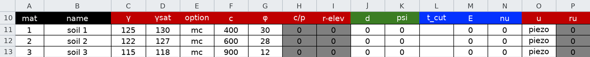

Two parts of this row are the subject of this page. **`u` is where each
material's pore pressure comes from** — `piezo` reads the piezometric line,
`none` reads nothing, and the [other two options](#r_u-a-pore-pressure-without-a-line)
appear later. And the pair **C:D** are the unit-weight columns: **γ** is what
the soil weighs above the water table, **gsat** what it weighs below it, and
filling both is what lets the engine
[split each slice's weight](#the-two-unit-weight-columns) at the line. Leaving
**gsat** blank is legal and means *γ throughout*.

### 2. The `profile` worksheet

1. `profile!B2` **Max Depth** = `0`. This is an *elevation*.
2. Profile Line #1 — `profile!B5` **Mat ID** = `1`, then `0, 84` / `150, 84` /
   `174.7, 64` in the `x` / `y` columns.
3. Profile Line #2 — `profile!E5` **Mat ID** = `2`, then `0, 64` /
   `174.7, 64` / `204.3, 40`.
4. Profile Line #3 — `profile!H5` **Mat ID** = `3`, then `0, 40` and
   `320, 40`.

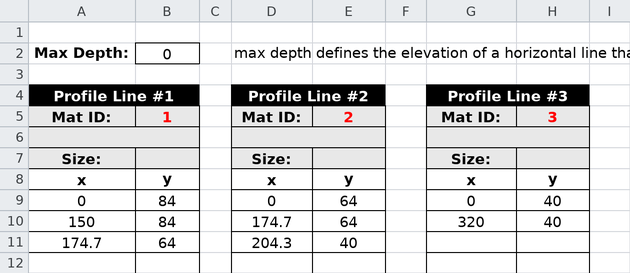

Lines 1 and 2 each carry a stretch of the face, which is why they take three
points; line 3 is the flat top of the bottom layer, and two points draw it.

### 3. The `piezo` worksheet

`piezo!B3` **Type:** = `piezo`, then the eight points in the `x` / `y`
columns, left to right: `0, 80` / `75, 79` / `112, 76` / `140, 70` /
`170, 61` / `189.5, 52` / `204.3, 40` / `320, 40`.

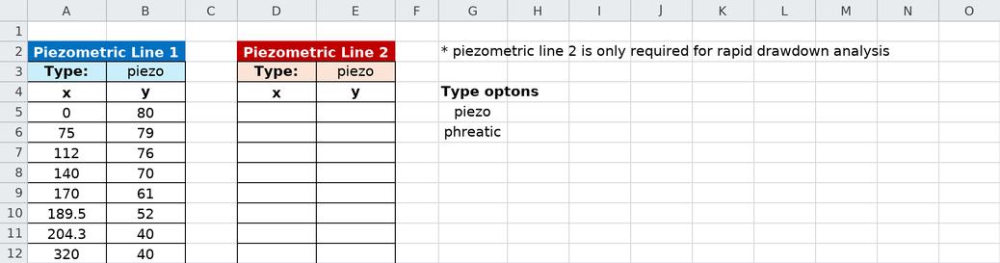

A piezometric line is the model's water table, given as its own polyline: the
pore pressure at a point on the failure surface is γ<sub>w</sub> times the
vertical distance below the line, and zero above it. The sheet's own legend
(columns G) lists the two **Type** settings: `piezo` is that static-head
reading, and `phreatic` reduces the head under an inclined stretch of line by
cos² of its local slope — the correction for steady seepage flowing parallel
to the line. This problem's source states heads, so `piezo` is the right
reading. **Piezometric Line 2 stays empty**; it is the second stage of a rapid
drawdown analysis, which this model is not.

### 4. The `circles` worksheet

One circle, as the problem specifies it: `circles!B3` **Xo** = `195`,
`circles!C3` **Yo** = `150`, `circles!D3` **Option** = `Depth`,
`circles!E3` **Depth** = `18.1` — the elevation of the circle's lowest point,
18.1 ft above the rigid base and 21.9 ft below the toe.

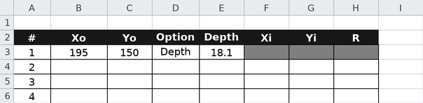

Save the file and continue at [Running the analysis](#running-the-analysis).

---

## C — Building it in Studio {#c-building-it-in-studio}

Start with **File → New** and work down the **Inputs** tree.

### 1. Materials and profile lines

Click **Materials**, and in **Table view** press **Add row** three times for
the three soils in the order the table above lists them — the row order fixes
the Mat IDs. Fill both unit-weight columns, **γ** and **gsat**, and set every
row's **u** to `piezo`. Then **Profile lines**: set
**Max depth (bottom boundary elevation):** to `0`, and press **Add line**
three times, each line taking its **Material:** and its vertices from the
geometry tables above. The mechanics are
[LEM-3's](lem03_layered_slope.md#c-building-it-in-studio), one line more.

### 2. The piezometric line

Click **Piezometric lines**. The editor holds the two lines on tabs — the
water table on **Line 1**, and **Line 2 (rapid drawdown)**, which stays empty
here. Press **Add row** eight times and enter the points from the table above,
left to right.

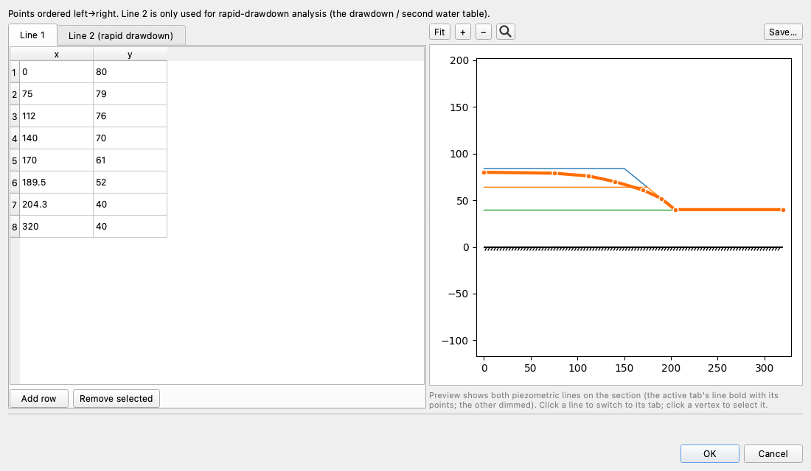

The preview draws the line on the section as you type, which is where a
mistyped elevation shows up: the points should fall smoothly from 80 at the
left edge to 40 at the toe, not jump. The help line above the table states the
one rule the table has — points ordered left to right. Click **OK**.

### 3. The circle

Click **Circles**, press **Add row**, and enter **Xo** `195`, **Yo** `150`,
**Option** `Depth`, **Depth** `18.1`. The preview draws it bottoming out 21.9 ft
below the toe elevation. One circle is enough here: it is the seed the search
starts from, and the search moves it. Click **OK**.

Continue below.

## Running the analysis

However you built it, you now hold the same model:

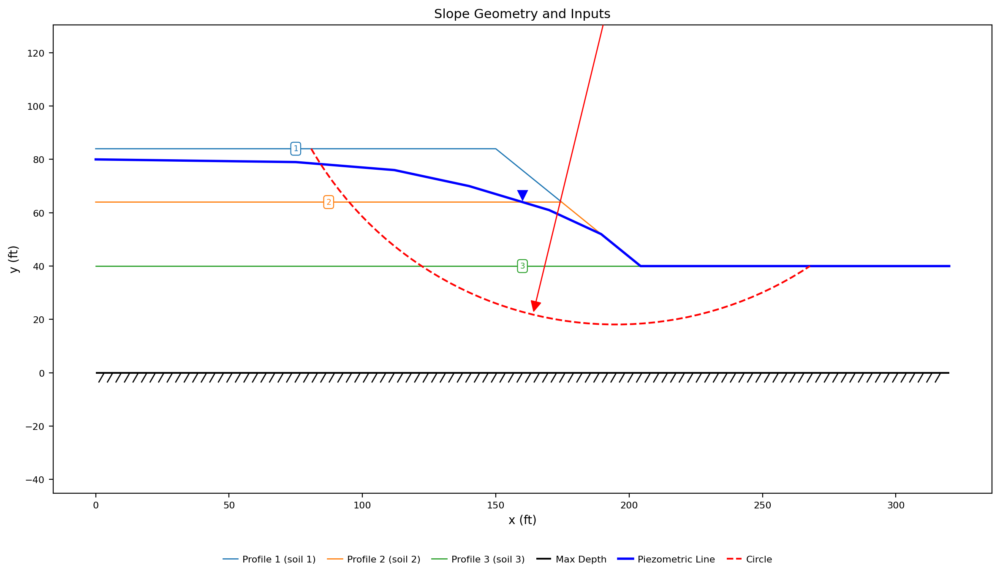{width=1000}

The three profile lines are drawn in their materials' colors, the heavy blue
line is the piezometric line — note it merging with the ground surface from
the lower face outward — and the red dashed arc is the circle, its center at
(195, 150) above the frame.

Click **Run LEM…** and choose **Method** = `Spencer` and **Analysis** =
`Auto search`, with the slice count left at 40. **Surface** reads `Circular`
as a fixed label — the model defines circles and no non-circular surface.
From Python:

```python
from xslope.fileio import load_slope_data
from xslope.search import circular_search
from xslope.plot import plot_circular_search_results

sd = load_slope_data("my_water_slope.xlsx")
fs_cache, _, path, circles = circular_search(sd, "spencer", num_slices=40)
plot_circular_search_results(sd, fs_cache, path, circle_cache=circles)
```

---

## Exploring the results

### What the search finds

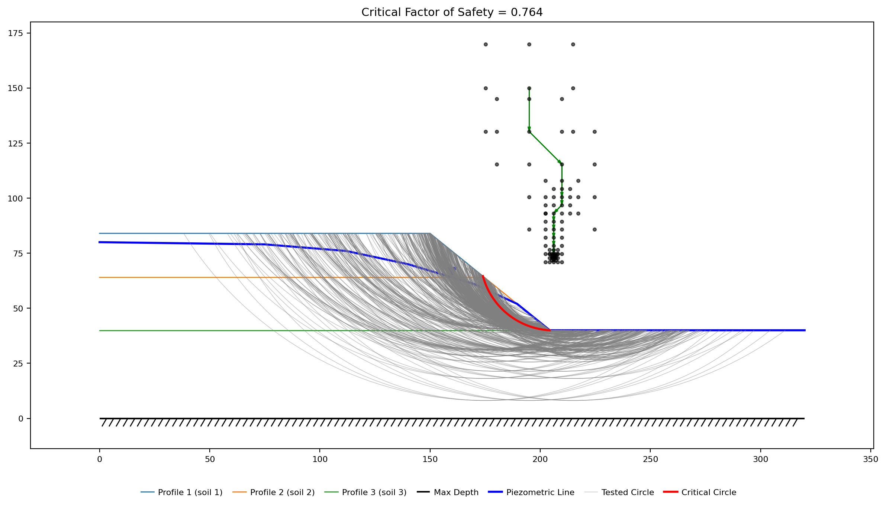{width=1000}

**FS = 1.301**, and the critical circle is not the one you entered. The search
walked the seed's center down and to the left and settled on a deep foundation
mechanism: **Xo = 182.37, Yo = 88.32, Depth = 26.90**. It enters the crest at
x = 121.1, bottoms out at elevation 26.9 — 13.1 ft down into soil 3 — and
exits on the flat ground at x = 220.3, well beyond the toe. Its base is
131.4 ft long: 19.1 ft of that in soil 1, 30.5 ft in soil 2 and **81.7 ft in
soil 3**, and the mass above it weighs 349,677 lb/ft.

That is the soft foundation clay doing what soft foundation clay does. Soil 3
is the weakest soil in the section and the only one carrying nearly all of its
strength as cohesion (φ′ = 12°), and a circle that dives into it trades a
longer, heavier arc for 82 ft of weak sliding base. Circles that stay out of it
do not compete: sweep centers across the face for circles tangent to the top of
the foundation at elevation 40 — sliding entirely through soil 1 and soil 2, on
two-thirds of the base and 38% of the weight — and the lowest they give is
about **1.37**.

Read the figure with the search path in mind. The grey arcs are the circles
the search tried, the black dots are their centers, the green line is the path
its refinement took from the seed at (195, 150), and the red arc is the winner.
A search that ends with its critical center in the middle of a well-populated
cloud of dots has genuinely bracketed the minimum; one that ends on the edge of
its own grid has not.

### Holding the circle still {#holding-the-circle-still}

Everything below asks *what is the water worth on this slope*, and the way to
ask a question about one variable is to change one variable. So put the circle
the search found into the model and stop searching.

There is no need to read the circle off the picture: the search states it when
it converges, in Studio's **Log** pane and on the console from Python, as
`at (x=182.37, y=88.32, depth=26.90)`. Those are the three numbers to enter:

- **Studio** — open **Circles**, and set the one row to **Xo** `182.37`,
  **Yo** `88.32`, **Option** `Depth`, **Depth** `26.9`. Then **Run LEM…** with
  **Analysis** = `Single surface`, which solves the first circle exactly as
  entered.
- **Excel** — `circles!B3` = `182.37`, `circles!C3` = `88.32`, `circles!E3` =
  `26.9`.
- **Assistant** — say: *"Replace the circle with the critical one: Xo 182.37,
  Yo 88.32, Depth 26.9, and run a single-surface analysis."*

From Python, the circle comes straight off the search:

```python
from xslope.plot import plot_solution
from xslope.slice import generate_slices
from xslope.solve import solve_selected

crit = fs_cache[0]
circle = {"Xo": crit["Xo"], "Yo": crit["Yo"], "Depth": crit["Depth"],
          "R": crit["Yo"] - crit["Depth"]}
ok, (slice_df, surface) = generate_slices(sd, circle=circle, num_slices=40)
result = solve_selected("spencer", slice_df)
plot_solution(sd, slice_df, surface, result)
```

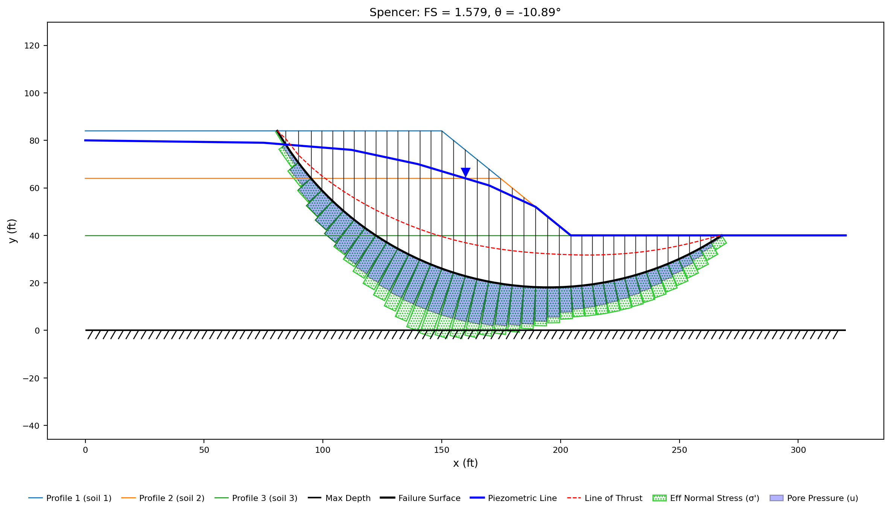{width=1000}

**FS = 1.301** — the search's answer, reproduced on a surface that will now sit
still. The blue bars on the slice bases are the legend's **Pore Pressure (u)**,
and on 38 of the 39 slice bases they are not zero. Each one is the piezometric
reading — u = γ<sub>w</sub> × the vertical distance from the base to the line
— and the largest, **2064 psf at x = 163.6**, is a base sitting 33.1 ft below
the line (62.4 × 33.1). Only the first slice reads zero: the circle enters the
crest at elevation 84 and that slice's base, at 77.5, is still above the line.

### What the water costs

Now take the water out of the strength calculation. Set every material's pore
pressure option to `none` and leave everything else exactly as it is:

- **Studio** — open **Materials** and set each row's **u** to `none`.
- **Excel** — `mat!O11`, `mat!O12`, `mat!O13` = `none`.
- **Assistant** — say: *"Set every material's pore pressure option to none."*

Run the same single surface again:

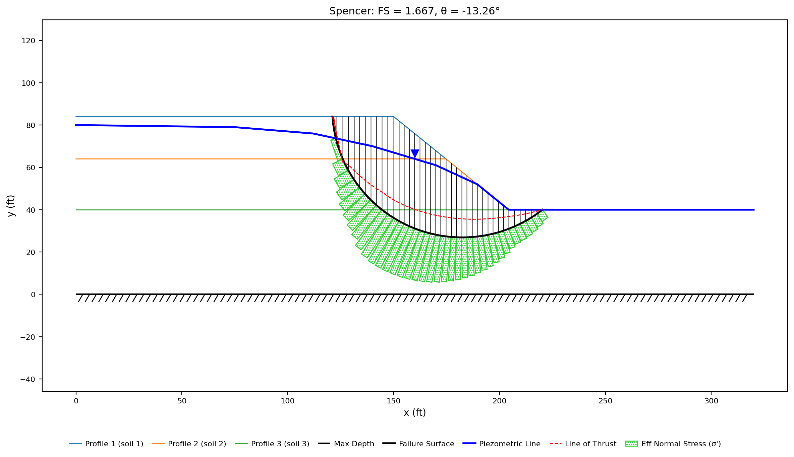{width=1000}

**FS = 1.667.** Same circle, same 131.4 ft of base, same 349,677 lb/ft of soil
— the pore pressure is worth **22% of the factor of safety** and nothing else
moved. (The weight is identical because the piezometric line is still there
doing its *other* job, [splitting the weight](#the-two-unit-weight-columns);
switching `u` off stops the line producing pressure, not the soil below it
being saturated.) The green bars are the legend's **Eff Normal Stress (σ')**,
and with u = 0 everywhere the effective normal stress *is* the total normal
stress: every pound of it earns frictional strength at tan φ′.

The mechanics are one line long: τ = c′ + (σ − u) tan φ′. Cohesion is untouched
— c′ Δℓ summed over the base is **99,507 lb/ft** in both states, because
neither c′ nor the base changed — so every pound the water costs comes out of
friction, and it is countable: Σ u Δℓ tan φ′ over the 39 slices is
**46,471 lb/ft** of frictional resistance that the pore pressure erases. In the
wet figure the blue bars visibly hollow out the green ones.

Run the other methods on both states and the pattern holds everywhere:

| | OMS | Bishop | Janbu | Corps | Lowe | Spencer | M-P |
|---|---:|---:|---:|---:|---:|---:|---:|
| u = `none` | 1.502 | 1.696 | 1.633 | 2.084 | 1.810 | 1.667 | 1.669 |
| Piezometric line | 1.115 | 1.328 | 1.266 | 1.690 | 1.421 | 1.301 | 1.303 |

Two readings worth taking. **Spencer and Morgenstern-Price agree to 0.2% wet or
dry** — the two methods that satisfy force *and* moment equilibrium, and
Spencer is the one to report. Bishop, which satisfies moment equilibrium alone,
sits 2% above them on this circle. And **the water widens the spread**: OMS
sits 10% under Spencer dry but 14% under it wet. OMS computes
each slice's normal force from the weight alone and then subtracts the full
u·dℓ from it, and on a deep circle under high pore pressure that
approximation sheds too much normal force — a known conservatism of the
method, at its worst exactly here.

One thing a held surface cannot show: the water does not only change the
strength of a mechanism, it changes *which* mechanism is critical. Set the
three `u` cells to `none` and run **Auto search** rather than the single
surface, and the dry slope's own critical circle is a shorter, shallower one
that never reaches as far into the foundation — 1.651, on a mass of
241,357 lb/ft. Isolating a variable and finding the critical surface are two
different runs, and they answer two different questions.

Put the water back — the three cells, returned to `piezo` — before going on.

### The two unit-weight columns {#the-two-unit-weight-columns}

The `mat` sheet carries two unit weights per material and this model fills
both. **γ** is the total unit weight of the soil as it sits above the water
table — solids plus whatever moisture it holds. **gsat** is the total unit
weight when the voids are full, which is what the soil below the water table
actually weighs; a saturated soil is typically a few pcf heavier. Given both,
the engine splits each slice's column at the water table — γ above, γ_sat
below, with the piezometric line serving as the water table. With **gsat**
blank it uses **γ** for the whole column instead.

That split is already in every number on this page. To see what it is worth,
clear the three **gsat** cells and run the held circle again:

| | ΣW (lb/ft) | FS (Spencer) |
|---|---:|---:|
| γ only (gsat blank) | 340,385 | 1.311 |
| γ above the line, γ_sat below | 349,677 | 1.301 |

The sliding mass gains 2.7% of its weight, all of it below the water table,
and the factor of safety falls 0.8%. Both effects are small and neither
direction is a rule: added weight adds driving moment, but it also adds normal
stress on a base whose pore pressure is fixed by the line, and which of the two
wins depends on where the extra weight sits on the arc. The
[sweeps below](#how-much-does-gsat-matter) take that apart one layer at a
time, and the three layers do not agree.

Note what did **not** change: `u`. Pore pressure comes from the line's
elevation and the base's, never from what the soil weighs — the two columns and
the `u` option are separate inputs about the same water.

What γ_sat is **not** is a buoyant unit weight. Both columns are *total* unit
weights, and the water's effects enter the analysis explicitly — the weight of
the pore water through γ_sat, and its pressure through u — never by
pre-subtracting them into an effective weight. A γ_sat entered as
γ − 62.4 builds a model that is wrong twice: the slices weigh too little,
and u is still subtracted from a normal stress that no longer contains the
water it removes. If the two effects are to cancel, the analysis is where
they cancel, not the input file.

Restore the three **gsat** cells (or undo) before going on.

### r_u — a pore pressure without a line {#r_u-a-pore-pressure-without-a-line}

The `u` column has two more settings. `seep` reads pore pressures from a
finite element seepage solution — the subject of the
[seepage documentation](../seep/overview.md), and the step to take when the
flow field matters. `ru` needs no companion at all: it computes
u = r<sub>u</sub> × σ<sub>v</sub> on each slice base, where σ<sub>v</sub> is
the vertical stress of the soil column above it and r<sub>u</sub> is a
per-material ratio entered in the column beside `u` (`mat!P`). It is the
classic chart parameter — Bishop and Morgenstern's stability coefficients are
tabulated against it — and it survives as a quick global estimate
("pore pressures run about a third of overburden") where no line has been
drawn. Note what it couples: an r<sub>u</sub> pore pressure *scales with the
soil weight*, where a piezometric line's u is pure geometry — the two models
answer weight questions differently, which is one reason the line, when you
have one, is the better input.

### How much does γ_sat matter? {#how-much-does-gsat-matter}

A saturated unit weight is rarely measured; it is usually inferred from a void
ratio and a specific gravity, and an input you had to infer is an input to
sweep. The question is narrow — *on this circle, how much does the answer move
as one saturated unit weight moves?* — and narrow is exactly what a
held-surface sweep answers.

Click **Run → Parametric…** and set it up:

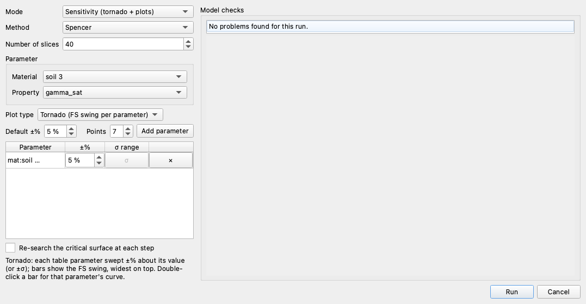

1. **Mode** = `Sensitivity (tornado + plots)`, **Method** = `Spencer`.
2. Under **Parameter**, **Material** = `soil 3` and **Property** =
   `gamma_sat` — the foundation clay, the layer 81.7 ft of this base runs
   through.
3. **Default ±%** = `5`, **Points** = `7` — a ±6 pcf band about 118, about
   the width of a defensible inference. Press **Add parameter**, and the
   parameter lands in the table.
4. **Untick "Re-search the critical surface at each step."** The circle in the
   model is the one the search found and the one every reading above was taken
   on, so re-solving it is what keeps this curve comparable with them.
5. **Run**, then double-click the tornado's one bar — the dialog's own note
   says so: *"Double-click a bar for that parameter's curve."*

From Python, the same sweep:

```python
from xslope.sensitivity import sensitivity
from xslope.plot import plot_sensitivity

sd["circles"] = [circle]        # the circle the search found, held
success, result = sensitivity(sd, param="mat:soil 3:gamma_sat",
                              rel_range=0.05, n=7, search=False,
                              methods=("spencer",), num_slices=40)
plot_sensitivity(result["df"])
```

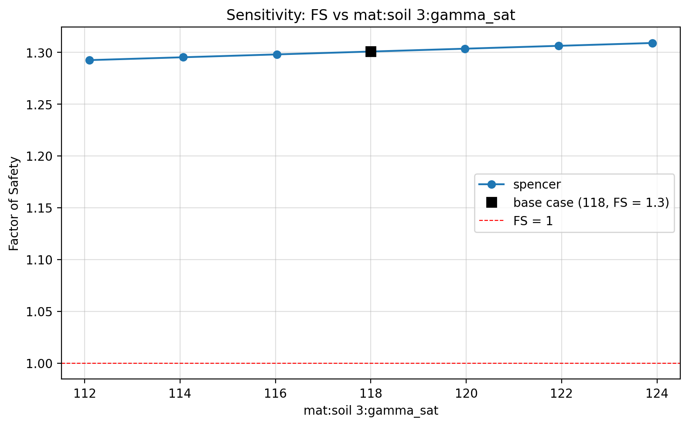{width=1000}

The curve is a straight line from **1.292 at 112.1 pcf to 1.309 at 123.9 pcf**
— 0.0014 of factor of safety per pcf, the base case marked at (118, 1.30). The
whole ±5% band is worth **1.3%** of the answer, on the same circle where the
existence of the pore pressures was worth 22%. That is the license to stop
agonizing over the third digit of γ_sat.

The *direction* is not a law of nature but a property of this arc. Here a
heavier foundation clay helps: its weight sits under the deep, flat-bottomed
middle of the base, where the extra normal stress buys more friction than the
extra weight costs in drive. Sweep soil 2's γ_sat instead — the same ±5%,
about 120.6 to 133.3 pcf — and the answer moves the other way, **1.313 down to
1.288**, because that soil's mass sits over the driving half of the arc. Unit
weights move a wet-slope answer by little, in whichever direction the geometry
decides.

Tick **Re-search the critical surface at each step** and run it again: the
curve comes back the same, 1.292 to 1.308. The critical mechanism does not move
as the foundation clay's saturated weight changes, so the two questions have
one answer here — which is a fact about this model, not a reason to stop asking.
The checkbox earns its keep whenever the *entered* surface and the *critical*
surface are different surfaces, and this model shows that too: put the original
starting circle back in the table — (195, 150), **Depth** `18.1` — and sweep
with re-search unticked, and the curve runs 1.446 to 1.477 about a base of
**1.462**. Every point of it is correct, and every point of it is about a
surface 11% stronger than the one that governs.

Before saving, confirm the three `u` cells read `piezo` and put back whichever
circle you want the file to carry.

---

## Conclusion

This tutorial demonstrated:

- A piezometric line as the model's water table — its own polyline, spanning
  the section, entered once and read by every material whose `u` option is
  `piezo` — and pore pressure as γ<sub>w</sub> times depth below it, drawn on
  every slice base of the solution plot.
- A search finding the mechanism a layered section really has: a deep circle
  through the soft foundation clay at 1.301, 81.7 ft of its base in that one
  layer, against about 1.37 for the best circle that stays above it.
- Effective stress doing the work: the same circle reads 1.667 with `u` off and
  1.301 with the line on, with c′, φ′ and the driving weight identical — 22% of
  the factor of safety, all of it out of friction (Σ u Δℓ tan φ′ =
  46,471 lb/ft) and none out of cohesion.
- The two unit-weight columns: **γ** above the water table, **gsat** below it
  (blank = **γ** throughout), both *total* unit weights — never buoyant —
  worth 2.7% of the sliding weight and −0.8% of the factor of safety here.
- r<sub>u</sub> as the chart-era alternative — u = r<sub>u</sub> σ<sub>v</sub>
  per material, no line required, scaling with weight where a line does not.
- A held-surface parametric sweep: a ±5% γ_sat band moving Spencer by 1.3%,
  the sign of that movement set by where the layer sits on the arc, and the
  re-search checkbox as the difference between sweeping the surface you entered
  and sweeping the one that governs.

**Where to go next:** [Tutorial LEM-5](lem05_weak_layer_noncircular.md) puts the
failure surface itself in your hands — a 2 ft seam of soft clay no circle can
follow, entered as a table of vertices.
[Sample Problem 5](../lem/samples.md#5-slope-with-multiple-materials-and-piezometric-line)
carries this same section into a three-seed search and reports every method on
both surfaces, and the
[seepage documentation](../seep/overview.md) replaces the hand-drawn line
with a computed flow field — the `seep` setting the `u` column left unused.
