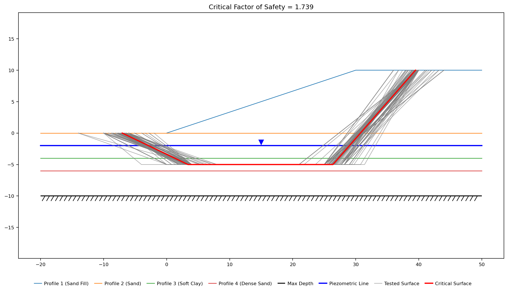

# Tutorial LEM-5 — A Weak Layer, Non-Circular

A 10 ft sand embankment on a 3:1 face, built over a layered foundation with a
water table 2 ft down. Four feet below the toe there is a 2 ft seam of soft clay:
S<sub>u</sub> = 200 psf, against friction angles φ′ of 33° and 37° in the sands
above and below it. **The mechanism follows the seam**, and a circle cannot run
flat along a seam — so the failure surface is entered as a list of points.

{width=700}

<div class="tut-glance" markdown>
<div class="tgt-row">
<div class="tgt-tile"><span class="tg-label">Analysis</span><p>Limit equilibrium</p></div>
<div class="tgt-tile"><span class="tg-label">Assistant</span><p>~5 min</p></div>
<div class="tgt-tile"><span class="tg-label">By hand</span><p>15–20 min</p></div>
</div>
<div class="tgm-obj" markdown>
**Objectives** — Build a four-layer section with a weak seam and a water table,
enter its failure surface as a table of vertices rather than a circle, and search
it: read where the search moved each vertex and why, which methods can run on a
polyline at all, how steep an end ramp a search will start from, and how deep in
the seam the track belongs.
</div>
<p><span class="tg-pill">four materials</span><span class="tg-pill">piezometric line</span><span class="tg-pill">non-circular surface</span><span class="tg-pill">non-circular search</span><span class="tg-pill">Movement options</span><span class="tg-pill">weak-zone generator</span></p>
<div class="tgm-model" markdown>**Completed model** — [xslope_noncircular.xlsx](../lem/files/xslope_noncircular.xlsx) — the same file used by [LEM Sample Problem 7](../lem/samples.md#7-non-circular-failure-surface)</div>
</div>

---

## The problem

**Materials** — four Mohr-Coulomb (`mc`) soils, listed top down:

| Mat ID | Name | γ (pcf) | c (psf) | φ (deg) | Pore pressure |
|---|---|---:|---:|---:|---|
| 1 | `Sand Fill` | 120 | 0 | 37 | `piezo` |
| 2 | `Sand` | 123 | 0 | 33 | `piezo` |
| 3 | `Soft Clay` | 118 | 200 | 0 | `none` |
| 4 | `Dense Sand` | 131 | 0 | 37 | `piezo` |

The primes in the drawing are the strength story. Every sand is marked c′/φ′ —
drained, effective-stress strengths — because sand is highly permeable: pore
water drains as fast as the soil is loaded, any excess pressure dissipates, and
what governs is the drained strength read against the pore pressure standing in
the ground. That is why all three sands carry `u` = `piezo`, the fill included —
above the water table the reading is simply zero. The seam's S<sub>u</sub>
carries no prime because it is the opposite case: a clay this soft loads far
faster than it can drain, so its strength is undrained — a total-stress
S<sub>u</sub> that no pore pressure enters, which is why its `u` option is
`none`.

**Geometry** — entered as profile lines, one per material and each the top of
its layer (the faster of the two geometry inputs for layered ground; polygons
are the other), with the maximum depth at `-10`. Each table is one vertex per
row, in the paired `x` / `y` columns its worksheet block carries.

**Profile Line 1 — material 1 (`Sand Fill`):**

| x (ft) | y (ft) |
|---:|---:|
| 0 | 0 |
| 30 | 10 |
| 50 | 10 |

**Profile Line 2 — material 2 (`Sand`):**

| x (ft) | y (ft) |
|---:|---:|
| -20 | 0 |
| 50 | 0 |

**Profile Line 3 — material 3 (`Soft Clay`):**

| x (ft) | y (ft) |
|---:|---:|
| -20 | -4 |
| 50 | -4 |

**Profile Line 4 — material 4 (`Dense Sand`):**

| x (ft) | y (ft) |
|---:|---:|
| -20 | -6 |
| 50 | -6 |

Line 1 is the ground surface — the toe, the crest break at the top of the 3:1
face, and the back of the crest — and the other three are horizontal contacts
running the full width of the section. By the
[top-of-a-layer rule](lem03_layered_slope.md#the-problem), line 3 at y = −4 and
line 4 at y = −6 are what make the clay a 2 ft seam.

**Water** — a piezometric line, level at elevation −2 across the full section,
one point per row as the `piezo` worksheet and Studio's editor take them:

| x (ft) | y (ft) |
|---:|---:|
| -20 | -2 |
| 50 | -2 |

All three sands read it — that is what their `piezo` option means, and for the
fill, which sits entirely above the line, the reading is zero. The clay does
not: τ = S<sub>u</sub> whatever the pore pressure, so its `u` is `none`.

**The failure surface** — four points, ordered left to right, in the three
columns the `non-circ` worksheet and Studio's editor share:

| X (ft) | Y (ft) | Movement |
|---:|---:|---|
| -10 | 0 | Free |
| 0 | -5 | Horiz |
| 25 | -5 | Horiz |
| 40 | 10 | Free |

The two interior points sit inside the clay, so the segment between them is 25 ft
of base running flat along the middle of the seam. The two end segments are
ramps: one down from the flat ground 10 ft beyond the toe, one up to the back of
the crest. That shape — ramp down, run along the seam, ramp up — is the whole of
a weak-layer mechanism, and it is the shape no circle has.

The third column, **Movement**, is each vertex's instruction to the automated
search: what the search may do with that point when it walks the surface
looking for a lower one. `Free` lets the point move without restriction,
`Horiz` lets it slide horizontally only, and `Fixed` pins it. The settings
here are the weak-layer pattern: the two end points are `Free`, so a search
can walk the entry and exit along the ground, and the two seam points are
`Horiz`, so the flat run can shift along the seam but never climb out of it.
The column binds only once a search runs, and
[what these settings do to one](#what-the-search-found) is the first thing this
page measures. The surface does not have to be drawn by
hand, either: Studio's non-circular editor can derive this shape from the
geometry with its **Generate from the weak zone…** button, as the
[Studio path below](#3-generating-the-surface-instead) shows.

The tables are the model, and each is laid out exactly as its destination is —
the template's worksheets and Studio's editors, same columns in the same order.
Select a table's block of values, copy, and paste it straight into the sheet or
editor rather than retyping it.

Three rules govern the non-circular failure surface table:

- **The points are joined by straight segments, ordered left to right — and the
  solver enforces the order itself.** Before slicing, it sorts the vertices by X
  and clips the polyline to the ground surface, without a warning: a table typed
  in the wrong order, or one that doubles back on itself, solves as the sorted
  surface, not the drawn one — cleanly, and for a shape nobody drew.
- **The first and last point sit on the ground surface, with their Y written
  out.** Here that is (−10, 0) on the flat ground beyond the toe and (40, 10) on
  the crest. **A blank Y is not "put it on the ground for me"** — it reaches the
  slicer as a `TypeError`, and an empty cell that loads as a blank number gets as
  far as *"Failed to generate surface:Expected at least 2 intersection points,
  but got 1."* A Y typed off the ground fails the other way — no error at all:
  the clipping moves that end to where the polyline crosses the ground, and the
  numbers come back clean for a surface with a different end.
- **Movement binds the search, not this solve.** The column is a property of
  the search's freedom, never of the surface being solved, and a blank cell
  does not mean unrestricted — it means `Fixed`.

---

## Choose how you want to build it

Three ways to get this model into XSLOPE. They produce the same model — pick one
and skip the other two.

1. **[Build it with the AI assistant](#a-building-it-with-the-ai-assistant)** —
   describe the seam in a sentence and audit the surface it entered.
2. **[Build the Excel input file](#b-building-the-excel-file)** — four
   worksheets, the last of them the vertex table.
3. **[Build it in Studio](#c-building-it-in-studio)** — the editors, including
   the generator that derives the surface from the geometry.

Whichever you choose, rejoin at [Running the analysis](#running-the-analysis).

---

## A — Building it with the AI assistant {#a-building-it-with-the-ai-assistant}

The drawing at the top of this page carries what the assistant needs — the layer
thicknesses, the face inclination, every unit weight and every strength, and the
water table. Paste it into the chat box and type `Build this model`, or describe
it:

<div class="prompt-block" markdown>
```text
Build a model for a 10 ft sand embankment with a 3:1 face over a layered foundation. The fill is 120 pcf with phi = 37, c = 0. Below the toe: 4 ft of sand at 123 pcf, phi = 33, c = 0, then a 2 ft layer of soft clay at 118 pcf with Su = 200 psf, then dense sand at 131 pcf, phi = 37, c = 0, down to elevation -10. The water table is at elevation -2; the sands are drained and take their pore pressure from it, and the clay is undrained. The crest runs 20 ft back from the top of the face and the ground continues 20 ft beyond the toe. The failure surface follows the clay layer, so use a non-circular surface through (-10, 0), (0, -5), (25, -5), (40, 10).
```
</div>

### Check its work

- **Four materials, top down.** The order fixes the Mat IDs, and the profile
  lines reference materials by ID — so a foundation entered above the fill is a
  section built upside down.
- **The clay is undrained.** S<sub>u</sub> = 200 psf is a cohesion with no
  friction angle. If a friction angle appeared in that row, say: *"The clay is an
  undrained strength: c = 200, phi = 0."*
- **Every sand reads the piezometric line.** The three sands are drained,
  effective-stress strengths, so each one's pore pressure option is `piezo` —
  the fill included, even though it sits above the line where the reading is
  zero: the option states the physics, not the geometry. Only the clay's is
  `none`, because an undrained strength reads no pore pressure. If a sand came
  back `none`, say: *"The sands are drained — set every sand's pore pressure
  option to piezo. Only the clay is none."*
- **Four profile lines**, at the ground surface, y = 0, y = −4 and y = −6. The
  two that bracket the clay are the ones the whole problem turns on: a section
  missing either of them has no seam.
- **The failure surface is the problem's four points** — (−10, 0), (0, −5),
  (25, −5), (40, 10), the interior pair mid-seam at y = −5, between the
  contacts at −4 and −6. Another track inside the seam is a legal surface but a
  different one, with a different answer, and every number on this page is
  about this one. If any point differs, say: *"Set the failure surface to
  (-10, 0), (0, -5), (25, -5), (40, 10)."*
- **Both end points carry an explicit Y on the ground surface** — (−10, 0) and
  (40, 10). If either Y is blank, say: *"Give the entry and exit points their
  ground-surface elevations: −10 is at y = 0 and 40 is at y = 10."*
- **The ends ramp, they do not drop.** The segment from the entry point into the
  seam should stand at roughly 45° − φ/2 ≈ 28° and the exit at 45° + φ/2. If
  either end came back near vertical, say: *"Move the entry point out to x = −10
  so the leading segment ramps at about 27 degrees."* A search
  [will not start](#the-end-ramps-a-search-will-start-from) from a steeper one.

Continue at [Running the analysis](#running-the-analysis).

---

## B — Building the Excel file {#b-building-the-excel-file}

Start from [input_template.xlsx](../inputs/input_template.xlsx) and save a copy
under a name of your own. Confirm `main!D8` **Units** is `Imperial` and leave the
rest of that sheet alone — no tension crack, no seismic coefficient, and the run
options blank.

### 1. The `mat` worksheet

One row per material, and the row number is the ID. Enter (or copy-paste) the
material properties from the table above, as shown below:


**`u` is per material, not per model.** The three sand rows read the
piezometric line — drained strengths, read against the pore pressure in the
ground, which is zero for the fill above the line — and the undrained clay's
row reads nothing.

The **E** and **nu** columns in the figure carry stiffness values, and the
sheet's own colour legend marks them *FEM only*: a limit equilibrium run never
reads them, and they may be left empty.

### 2. The `profile` worksheet

1. `profile!B2` **Max Depth** = `-10`. This is an *elevation*.
2. Profile Lines #1–#4 — set each line's **Mat ID** and enter (or copy-paste)
   its vertices from the geometry tables above, one line per material, top
   down.


Lines 3 and 4 are 2 ft apart, and that gap is the seam.

### 3. The `piezo` worksheet

Select `piezo` for the **Type**, and enter (or copy-paste) the two coordinates
from the table above, as shown below:


A piezometric line is a water table given as its own polyline: pore pressure at a
point on the failure surface is γ<sub>w</sub> times the vertical distance below
it. It spans the full section because the water table does.

### 4. The `non-circ` worksheet

The vertex table, one point per row, left to right — enter (or copy-paste) the
four points from the table above, as shown below:


The sheet carries its own legend for the third column, in `E2:F5` — the three
Movement options against what each one does. **Leave the `circles` worksheet
empty.** A model defines one failure-surface family or the other, and this one is
non-circular.

Save the file and continue at [Running the analysis](#running-the-analysis).

---

## C — Building it in Studio {#c-building-it-in-studio}

Start with **File → New** and work down the **Inputs** tree.

### 1. Materials, profile lines and water

Click **Materials**, and in **Table view** press **Add row** four times for the
four soils in the order the table above lists them — the row order is what fixes
the Mat IDs. Then **Profile lines**: set **Max depth (bottom boundary
elevation):** to `-10`, and press **Add line** four times, each line taking its
**Material:** and its vertices from the geometry tables above. The mechanics are
[LEM-3's](lem03_layered_slope.md#c-building-it-in-studio), twice over.

Click **Piezometric lines** and, on the **Line 1** tab, **Add row** twice for
`-20, -2` and `50, -2`. **Line 2 (rapid drawdown)** stays empty.

### 2. The failure surface

Click **Non-circular pts** in the **Inputs** tree. The editor is a vertex table
with the preview beside it, and its help line states the two rules the table has
to obey: *"Points ordered left→right. Entry/exit points use Movement='Free'."*

Press **Add row** four times and fill them from the table above: `-10, 0, Free`,
`0, -5, Horiz`, `25, -5, Horiz`, `40, 10, Free`.


The preview draws the polyline on the section, in the order the rows were
entered, and marks each vertex with the shape of its Movement — ○ Free,
◇ Horiz-only, □ Fixed — which is where a mistyped Y shows up: the two interior
vertices should sit between the green and red contacts, not above or below them.
Like the inputs plot, it draws the rows as entered, so a doubled-back table
shows up here as a tangle — the solver sorts the vertices before slicing, so the
results plot will not show it. Clicking a vertex selects its row, and selecting
a row enlarges the vertex.

### 3. Generating the surface instead

The same editor carries **Generate from the weak zone…**, which builds a surface
from the geometry rather than from a drawing. It ranks the material zones by the
shear strength each can mobilise *at the stress it actually carries* — the one
quantity comparable across an undrained clay and a frictional sand — lays a track
just above the base of the weakest, and ramps up to the ground at both ends.


On an empty table it fills it without asking, and reports what it did under the
button:

> Generated 4 points: seeding on 'Soft Clay' -- mobilisable strength 200 against
> 570 for the next weakest ('Sand Fill'); a 4-point surface tracking 10% of the
> zone's thickness above its base from x = 0 to 39.1221, with a 28 degree ramp to
> the ground at the toe; a 60 degree ramp to the ground at the crest.

Every part of that line is auditable, and [worth auditing](#where-the-track-belongs-inside-the-seam):
the zone it chose and the margin it chose it by, where in the seam the track
runs, how far it reaches, and the angle of each end ramp. The rows land in the
table, so they can be edited before **OK**, and **Cancel** discards them.

Four points is the whole shape: two on the ground and two where the end ramps
meet the track. The seam here is flat, so a vertex partway along the track would
sit on a straight horizontal run — it would not bend the surface, and the search
could not use it either, since an interior vertex may only slide horizontally and
that slide would leave it on the same line. On a seam that dips, the same track
keeps its intermediate vertices, because there sliding one does change the shape.

What it proposes is not what this page runs. The generator derives a viable shape
from the geometry — a track near the base of the seam, at y = −5.8 — where the
taught surface runs mid-seam at −5, and the two are different surfaces with
different answers, [measured below](#the-surface-the-generator-proposes). Before
leaving the editor, delete the generated rows and enter (or copy-paste) the four
points from the table above, so the model you carry forward is the one every
number on this page reads.

Continue below.

## Running the analysis

However you built it, you now hold the same model:

{width=1000}

The four profile lines are drawn in their materials' colors, the piezometric line
is the heavy blue one at elevation −2, and the red dashed polyline is the failure
surface — dropping from the flat ground beyond the toe, running 25 ft along the
middle of the clay, and climbing to the back of the crest.

Click **Run LEM…** and choose **Method** = `Spencer` and **Analysis** =
`Auto search`, with the slice count left at 40:


**Surface** is not a choice on this model: it reads `Non-circular` as a fixed
label, because the model defines a non-circular surface and no circles. Three
controls are dimmed for the same reason — composite surfaces, grid seeding and
the geometric refinement tolerance are circular-search settings with no
non-circular counterpart.

The dialog's own note says what the two analyses do — *"Single surface analyzes
the first circle / the non-circular surface as entered. Auto-search refines from
there to the critical surface."* **Auto search is the normal way to run a model,
and it is what this page runs first**: the four points entered are where a search
begins, not what it answers. `Single surface` solves them exactly as typed, and
this page uses it further down — announced each time — wherever a comparison has
to hold the surface still.

---

## Exploring the results

### What the search found {#what-the-search-found}

{width=1000}

**FS = 1.739.** Grey is every surface the search tried; red is the one it kept.
It starts from the four points the model carries and walks them, taking whatever
move lowers the factor of safety — and the **Movement** column is what says how
each point may walk:

| Point | As entered | Where the search left it | Movement |
|---|---|---|---|
| toe end | (−10.00, 0.00) | (−7.05, 0.00) | `Free` |
| seam | (0.00, −5.00) | (3.38, −5.00) | `Horiz` |
| seam | (25.00, −5.00) | (26.38, −5.00) | `Horiz` |
| crest end | (40.00, 10.00) | (39.49, 10.00) | `Free` |

Both seam points slid along the seam — 3.4 ft and 1.4 ft — and neither left
y = −5. That is `Horiz` doing its work: the flat run shortened from 25.0 ft to
23.0 ft and moved bodily toward the crest without ever climbing out of the clay.
The two end points travelled 3.0 ft and 0.5 ft and stayed on the ground surface,
at y = 0 and y = 10, which is what an entry or exit point does whatever its
Movement says — `Free` is what lets it travel there at all.

Change the column and the search answers differently. With all four `Free` the
interior points fall out of the middle of the seam onto its base, y = −6.00 and
−5.97, for **1.687**. With the interior pair `Fixed` they cannot move at all, the
ends still slide, and the best the search reaches is **1.779**. A blank cell is
`Fixed`, not a default.

{width=1000}

The critical surface carries 42,713 lb/ft of soil on a 54.5 ft base, split
**26.6 ft in the clay**, 14.6 ft in the sand and 13.3 ft in the fill — half the
base in a layer 2 ft thick, which is what a weak-layer mechanism is. Spencer
returns no admissibility warnings on it: no interslice tension, no base tension,
no line of thrust outside a slice. The results plot draws the surface that was
*solved*, and after a search that is not the surface that was entered — read the
black line against the shape you meant before reading the number on it.

### Which methods can run a polyline {#which-methods-can-run-a-polyline}

Ask for the same search with the Ordinary Method of Slices and the run is refused
before it starts:

> A non-circular search cannot be run with the Ordinary Method of Slices: it takes
> moments about a circle center, which a non-circular surface does not have, so
> every trial surface would be rejected. Methods valid for a non-circular surface:
> Janbu Method, Corps of Engineers Method, Lowe & Karafiath Method, Spencer's
> Method, Morgenstern-Price Method.

**OMS and Bishop are circle methods.** Both satisfy moment equilibrium by summing
moments about the center a circle has and a polyline does not, so on this family
they are not conservative or approximate — they are undefined. That is why the
sample page's factor-of-safety table shows a dash in their two columns rather than
a number. The five that remain, each one run as its own search:

| Janbu | Corps | Lowe | Spencer | M-P |
|---:|---:|---:|---:|---:|
| 1.657 | 1.794 | 1.369 | **1.739** | 1.710 |

Every entry is a separate search that found its own critical surface, which is the
only sound way to compare methods: a method's factor of safety on another method's
surface is not that method's answer. **Spencer satisfies both force and moment
equilibrium and is the one to report.**

They spread 31% low to high — much wider than five methods differing on one shared
surface, because here the surfaces differ too. Lowe & Karafiath's 1.369 is the
outlier, and its surface says why: its search drove the toe ramp to 64.6°, hard
against the limit below, where the other four ramps sit between 25.6° and 36.7°.

### The end ramps a search will start from {#the-end-ramps-a-search-will-start-from}

A non-circular surface is steepest where it breaks out at the ground, and those
two end ramps are the part of the shape a search is most particular about. Pull
the crest point in from x = 40 to x = 30 — which stands the exit ramp up from 45°
to 71.6° — leave everything else alone, and press **Run**. What comes back is a
box titled **LEM run failed**:

> Search produced no valid surfaces.

and the Log pane carries the reason:

> [❌ noncircular_search] the starting surface is not viable (slice generation or
> the solver failed on it) — adjust the non_circ starting points.

Nothing was searched at all. The search rejects any trial surface with a base
segment steeper than **65°**, and the first surface it tests is the one entered,
so a seed over that limit never yields a first factor of safety to improve on.
The line is sharp: an exit ramp of 64.9° searches normally and reaches the same
1.739, and 65.1° is refused. It is geometric rather than a property of Spencer —
all five methods refuse the 71.6° seed.

What is Spencer's, and every other method's, is what happens if that shape is
solved anyway. Hold the 71.6° surface still — **Analysis** = `Single surface` —
and the five read 1.977 (Janbu), 2.126 (M-P), 2.326 (Spencer), 2.782 (Corps) and
4.622 (Lowe & Karafiath): a factor of 2.3 across one geometry. At an 82.4° exit
Janbu and Lowe return no solution at all while the Corps method reports 7.165.
Those are the answers the 65° cap exists to keep a search from reporting as
critical surfaces.

Sixty-five degrees is the active-wedge inclination 45° + φ/2 for a φ of about 40°,
the steep end of real soils. **The generator's ramps sit under it deliberately** —
its hard ceiling is 60°, chosen below the search's limit — and on this section it
builds 28° at the toe and 60° at the crest, so a surface from **Generate from the
weak zone…** is always a seed a search will start from.

### Where the track belongs inside the seam {#where-the-track-belongs-inside-the-seam}

**This comparison holds the surface still.** Every row below is a `Single surface`
run on the four points as typed, with only the two interior Y values changed. No
search anywhere: a search would move the ends and the track together and each row
would be an answer about a different shape, where the question here is what the
depth alone is worth.

| Track elevation | −4.2 | −4.5 | **−5.0** | −5.5 | −5.8 | −6.0 |
|---|---:|---:|---:|---:|---:|---:|
| Factor of safety (Spencer) | 1.893 | 1.851 | **1.789** | 1.734 | 1.705 | 1.686 |

**The lower in the seam the track runs, the lower the answer**, across the whole
2 ft: 1.893 a couple of inches under the top contact, 1.686 at the base, 12%
apart. The mechanism is not choosing between clay and sand there — every one of
these tracks is in the clay, at the same S<sub>u</sub> = 200 psf. What changes is
everything *around* the base: a deeper track carries more soil above it and
shortens both end ramps, and the ramps are where the frictional sands do their
resisting. This is what the generator's *"tracking 10% of the zone's thickness
above its base"* means, and why: 10% above a base at −6 is y = −5.8, low in that
column and clear of the contact itself.

### What a circle gets on the same section {#what-a-circle-gets-on-the-same-section}

The seam is what the non-circular surface was drawn for, so the fair question is
what a circle makes of the same ground — and the fair comparison is search against
search. Add starting circles derived from the geometry and run the ordinary
circular search with the same method:

{width=1000}

**FS = 1.769**, on a circle centered at (11.59, 18.66) with a radius of 24.66,
whose lowest point is at elevation **−6.000** — tangent to the base of the clay.
The generated set is six circles: one through the toe, one tangent to the base of
each layer and to the maximum depth (elevations 0, −4, −6 and −10), and one
skimming the sandy face down to −19.6. The search settles on the one that reaches
the bottom of the seam, and 20.0 ft of its 47.4 ft base lies inside the weak
layer.

That is 1.7% above the 1.739 the non-circular search found. **A circle is not
automatically far off a weak-layer mechanism**, and here it is not: the seam is
shallow and only 2 ft thick, so an arc can be made nearly tangent to its base and
pick up most of the same weak ground. What the circle cannot do is *stay* in the
seam — it touches the bottom at one point and curves away on both sides, where the
polyline runs 23 ft along it.

### The surface the generator proposes {#the-surface-the-generator-proposes}

The weak-zone generator lays its track at y = −5.8, near the base of the seam,
and ramps to the ground at both ends. Solve that surface as it comes —
`Single surface` again, and said out loud because the number is only comparable
to the hand-drawn one if neither shape is allowed to move:

{width=1000}

**FS = 2.022**, against 1.789 for the four points this page teaches. The track is
in the right place; the ends are not the same ones. The generator lands its toe
end at x = 0, because that is where the zone it is tracking meets the slope, while
the hand-drawn surface starts 10 ft further out on the flat ground — which
lengthens the sliding mass and finds a worse mechanism.

Neither number is the section's answer. Search from the generator's surface and
Spencer comes down to **1.656**, below the 1.739 the file's own four points lead
to, on a track it keeps at −5.8. Two reasonable starting shapes, two different
minima, and both of them below what either shape returns standing still: a
generated surface is a viable shape, not a critical one — **hence the need to do
a search**, and to try more than one starting surface when a section matters.

---

## Conclusion

This tutorial demonstrated:

- A failure surface entered as a table of vertices rather than a circle: points
  left to right, straight segments between them, ramps at the ends and a flat run
  through the weak layer between — with the entry and exit points carrying
  explicit ground-surface elevations, because a blank Y is a slicing error rather
  than a request to snap to the ground.
- The automated search as the first analysis to run, at **FS = 1.739** by
  Spencer's method, and the **Movement** column as what shapes it: `Horiz` sliding
  the seam points 3.4 ft and 1.4 ft along the clay without letting either leave
  it, `Free` walking the ends along the ground surface, and a blank cell meaning
  `Fixed`.
- OMS and Bishop declining a non-circular surface outright — both take moments
  about a circle center — and the five methods that remain, each searched
  separately, spreading 31% because each one found its own critical surface.
- The 65° limit on a base segment: a starting surface with a steeper end ramp is
  refused before the search begins, because surfaces in that range return answers
  that differ by a factor of two between methods.
- Two comparisons made deliberately on a held surface: where the track belongs
  inside the seam, worth 12% between the top of the clay and its base, and what
  the weak-zone generator proposes — a viable shape whose own search reaches
  1.656, below the 1.739 the taught points lead to.
- The best circle the same section admits, searched the same way, coming to 1.769
  on an arc tangent to the base of the seam: on a shallow 2 ft layer the two
  families are close, and what the polyline adds is the 23 ft it spends *inside*
  the clay.

**Where to go next:** this page closes the tutorial series — the
[tutorials index](index.md) lists all five, and the sample problems carry each one
further. [Sample Problem 7](../lem/samples.md#7-non-circular-failure-surface)
catalogues this same model and its per-method searches, and
[Sample Problem 13](../lem/samples.md#13-multiple-local-minima) is the circular
counterpart of the same hazard — a section where the surface a search settles on
depends entirely on where it was started.
