# Tutorial LEM-5 — A Weak Layer, Non-Circular

A 10 ft sand embankment on a 3:1 face, built over a layered foundation with a
water table 2 ft down. Four feet below the toe there is a 2 ft seam of soft clay:
S<sub>u</sub> = 200 psf, against friction angles φ′ of 33° and 37° in the sands
above and below it. **The mechanism follows the seam**, and a circle cannot run
flat along a seam — so the failure surface is entered as a list of points.

{width=700}

<div class="tut-glance" markdown>
<div class="tgt-row">
<div class="tgt-tile"><span class="tg-label">Analysis</span><p>Limit equilibrium</p></div>
<div class="tgt-tile"><span class="tg-label">Assistant</span><p>~5 min</p></div>
<div class="tgt-tile"><span class="tg-label">By hand</span><p>15–20 min</p></div>
</div>
<div class="tgm-obj" markdown>
**Objectives** — Build a four-layer section with a weak seam and a water table,
enter its failure surface as a table of vertices rather than a circle, solve that
one surface, and learn to read it: which methods can run on it at all, how deep
in the seam the track belongs, and what a surface drawn with too steep an end
looks like when the answer it returns is meaningless.
</div>
<p><span class="tg-pill">four materials</span><span class="tg-pill">piezometric line</span><span class="tg-pill">non-circular surface</span><span class="tg-pill">Movement options</span><span class="tg-pill">weak-zone generator</span></p>
<div class="tgm-model" markdown>**Completed model** — [xslope_noncircular.xlsx](../lem/files/xslope_noncircular.xlsx) — the same file used by [LEM Sample Problem 7](../lem/samples.md#7-non-circular-failure-surface)</div>
</div>

---

## The problem

**Materials** — four Mohr-Coulomb (`mc`) soils, listed top down:

| Mat ID | Name | γ (pcf) | c (psf) | φ (deg) | Pore pressure |
|---|---|---:|---:|---:|---|
| 1 | `Sand Fill` | 120 | 0 | 37 | `piezo` |
| 2 | `Sand` | 123 | 0 | 33 | `piezo` |
| 3 | `Soft Clay` | 118 | 200 | 0 | `none` |
| 4 | `Dense Sand` | 131 | 0 | 37 | `piezo` |

The primes in the drawing are the strength story. Every sand is marked c′/φ′ —
drained, effective-stress strengths — because sand is highly permeable: pore
water drains as fast as the soil is loaded, any excess pressure dissipates, and
what governs is the drained strength read against the pore pressure standing in
the ground. That is why all three sands carry `u` = `piezo`, the fill included —
above the water table the reading is simply zero. The seam's S<sub>u</sub>
carries no prime because it is the opposite case: a clay this soft loads far
faster than it can drain, so its strength is undrained — a total-stress
S<sub>u</sub> that no pore pressure enters, which is why its `u` option is
`none`.

**Geometry** — entered as profile lines, one per material and each the top of
its layer (the faster of the two geometry inputs for layered ground; polygons
are the other), with the maximum depth at `-10`. Each table is one vertex per
row, in the paired `x` / `y` columns its worksheet block carries.

**Profile Line 1 — material 1 (`Sand Fill`):**

| x (ft) | y (ft) |
|---:|---:|
| 0 | 0 |
| 30 | 10 |
| 50 | 10 |

**Profile Line 2 — material 2 (`Sand`):**

| x (ft) | y (ft) |
|---:|---:|
| -20 | 0 |
| 50 | 0 |

**Profile Line 3 — material 3 (`Soft Clay`):**

| x (ft) | y (ft) |
|---:|---:|
| -20 | -4 |
| 50 | -4 |

**Profile Line 4 — material 4 (`Dense Sand`):**

| x (ft) | y (ft) |
|---:|---:|
| -20 | -6 |
| 50 | -6 |

Line 1 is the ground surface — the toe, the crest break at the top of the 3:1
face, and the back of the crest — and the other three are horizontal contacts
running the full width of the section. By the
[top-of-a-layer rule](lem03_layered_slope.md#the-problem), line 3 at y = −4 and
line 4 at y = −6 are what make the clay a 2 ft seam.

**Water** — a piezometric line, level at elevation −2 across the full section,
one point per row as the `piezo` worksheet and Studio's editor take them:

| x (ft) | y (ft) |
|---:|---:|
| -20 | -2 |
| 50 | -2 |

All three sands read it — that is what their `piezo` option means, and for the
fill, which sits entirely above the line, the reading is zero. The clay does
not: τ = S<sub>u</sub> whatever the pore pressure, so its `u` is `none`.

**The failure surface** — four points, ordered left to right, in the three
columns the `non-circ` worksheet and Studio's editor share:

| X (ft) | Y (ft) | Movement |
|---:|---:|---|
| -10 | 0 | Free |
| 0 | -5 | Horiz |
| 25 | -5 | Horiz |
| 40 | 10 | Free |

The two interior points sit inside the clay, so the segment between them is 25 ft
of base running flat along the middle of the seam. The two end segments are
ramps: one down from the flat ground 10 ft beyond the toe, one up to the back of
the crest. That shape — ramp down, run along the seam, ramp up — is the whole of
a weak-layer mechanism, and it is the shape no circle has.

The third column, **Movement**, is each vertex's instruction to the automated
search: what the search may do with that point when it walks the surface
looking for a lower one. `Free` lets the point move without restriction,
`Horiz` lets it slide horizontally only, and `Fixed` pins it. The settings
here are the weak-layer pattern: the two end points are `Free`, so a search
can walk the entry and exit along the ground, and the two seam points are
`Horiz`, so the flat run can shift along the seam but never climb out of it.
On the single-surface run this page teaches, the column is inert — it binds
only once a search runs, and [what each setting does](#what-movement-is-for)
is measured at the end of the page. The surface does not have to be drawn by
hand, either: Studio's non-circular editor can derive this shape from the
geometry with its **Generate from the weak zone…** button, as the
[Studio path below](#3-generating-the-surface-instead) shows.

The tables are the model, and each is laid out exactly as its destination is —
the template's worksheets and Studio's editors, same columns in the same order.
Select a table's block of values, copy, and paste it straight into the sheet or
editor rather than retyping it.

Three rules govern the non-circular failure surface table:

- **The points are joined by straight segments, ordered left to right — and the
  solver enforces the order itself.** Before slicing, it sorts the vertices by X
  and clips the polyline to the ground surface, without a warning: a table typed
  in the wrong order, or one that doubles back on itself, solves as the sorted
  surface, not the drawn one. What that does to a result is
  [demonstrated below](#the-surface-the-solver-read).
- **The first and last point sit on the ground surface, with their Y written
  out.** Here that is (−10, 0) on the flat ground beyond the toe and (40, 10) on
  the crest. **A blank Y is not "put it on the ground for me"** — it reaches the
  slicer as a `TypeError`, and an empty cell that loads as a blank number gets as
  far as *"Failed to generate surface:Expected at least 2 intersection points,
  but got 1."* A Y typed off the ground fails the other way — no error at all:
  the clipping moves that end to where the polyline crosses the ground, and the
  numbers come back clean for a surface with a different end.
- **Movement binds the search, not this solve.** The column is a property of
  the search's freedom, never of the surface being solved, and a blank cell
  does not mean unrestricted — it means `Fixed`.

---

## Choose how you want to build it

Three ways to get this model into XSLOPE. They produce the same model — pick one
and skip the other two.

1. **[Build it with the AI assistant](#a-building-it-with-the-ai-assistant)** —
   describe the seam in a sentence and audit the surface it entered.
2. **[Build the Excel input file](#b-building-the-excel-file)** — four
   worksheets, the last of them the vertex table.
3. **[Build it in Studio](#c-building-it-in-studio)** — the editors, including
   the generator that derives the surface from the geometry.

Whichever you choose, rejoin at [Running the analysis](#running-the-analysis).

---

## A — Building it with the AI assistant {#a-building-it-with-the-ai-assistant}

The drawing at the top of this page carries what the assistant needs — the layer
thicknesses, the face inclination, every unit weight and every strength, and the
water table. Paste it into the chat box and type `Build this model`, or describe
it:

<div class="prompt-block" markdown>
```text
Build a model for a 10 ft sand embankment with a 3:1 face over a layered foundation. The fill is 120 pcf with phi = 37, c = 0. Below the toe: 4 ft of sand at 123 pcf, phi = 33, c = 0, then a 2 ft layer of soft clay at 118 pcf with Su = 200 psf, then dense sand at 131 pcf, phi = 37, c = 0, down to elevation -10. The water table is at elevation -2; the sands are drained and take their pore pressure from it, and the clay is undrained. The crest runs 20 ft back from the top of the face and the ground continues 20 ft beyond the toe. The failure surface follows the clay layer, so use a non-circular surface through (-10, 0), (0, -5), (25, -5), (40, 10).
```
</div>

### Check its work

- **Four materials, top down.** The order fixes the Mat IDs, and the profile
  lines reference materials by ID — so a foundation entered above the fill is a
  section built upside down.
- **The clay is undrained.** S<sub>u</sub> = 200 psf is a cohesion with no
  friction angle. If a friction angle appeared in that row, say: *"The clay is an
  undrained strength: c = 200, phi = 0."*
- **Every sand reads the piezometric line.** The three sands are drained,
  effective-stress strengths, so each one's pore pressure option is `piezo` —
  the fill included, even though it sits above the line where the reading is
  zero: the option states the physics, not the geometry. Only the clay's is
  `none`, because an undrained strength reads no pore pressure. If a sand came
  back `none`, say: *"The sands are drained — set every sand's pore pressure
  option to piezo. Only the clay is none."*
- **Four profile lines**, at the ground surface, y = 0, y = −4 and y = −6. The
  two that bracket the clay are the ones the whole problem turns on: a section
  missing either of them has no seam.
- **The failure surface is the problem's four points** — (−10, 0), (0, −5),
  (25, −5), (40, 10), the interior pair mid-seam at y = −5, between the
  contacts at −4 and −6. Another track inside the seam is a legal surface but a
  different one, with a different answer, and every number on this page is
  about this one. If any point differs, say: *"Set the failure surface to
  (-10, 0), (0, -5), (25, -5), (40, 10)."*
- **Both end points carry an explicit Y on the ground surface** — (−10, 0) and
  (40, 10). If either Y is blank, say: *"Give the entry and exit points their
  ground-surface elevations: −10 is at y = 0 and 40 is at y = 10."*
- **The ends ramp, they do not drop.** The segment from the entry point into the
  seam should stand at roughly 45° − φ/2 ≈ 28° and the exit at 45° + φ/2. If
  either end came back near vertical, say: *"Move the entry point out to x = −10
  so the leading segment ramps at about 27 degrees."* The reason is
  [at the end of this page](#when-the-shape-stops-meaning-anything).

Continue at [Running the analysis](#running-the-analysis).

---

## B — Building the Excel file {#b-building-the-excel-file}

Start from [input_template.xlsx](../inputs/input_template.xlsx) and save a copy
under a name of your own. Confirm `main!D8` **Units** is `Imperial` and leave the
rest of that sheet alone — no tension crack, no seismic coefficient, and the run
options blank.

### 1. The `mat` worksheet

One row per material, and the row number is the ID. Enter (or copy-paste) the
material properties from the table above, as shown below:

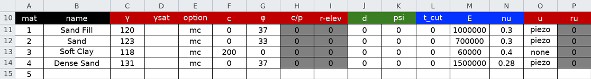

**`u` is per material, not per model.** The three sand rows read the
piezometric line — drained strengths, read against the pore pressure in the
ground, which is zero for the fill above the line — and the undrained clay's
row reads nothing.

The **E** and **nu** columns in the figure carry stiffness values, and the
sheet's own colour legend marks them *FEM only*: a limit equilibrium run never
reads them, and they may be left empty.

### 2. The `profile` worksheet

1. `profile!B2` **Max Depth** = `-10`. This is an *elevation*.
2. Profile Lines #1–#4 — set each line's **Mat ID** and enter (or copy-paste)
   its vertices from the geometry tables above, one line per material, top
   down.

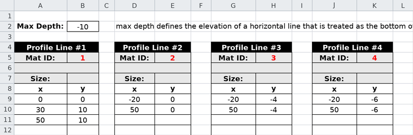

Lines 3 and 4 are 2 ft apart, and that gap is the seam.

### 3. The `piezo` worksheet

Select `piezo` for the **Type**, and enter (or copy-paste) the two coordinates
from the table above, as shown below:

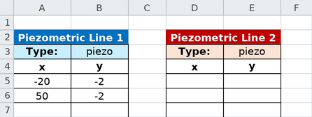

A piezometric line is a water table given as its own polyline: pore pressure at a
point on the failure surface is γ<sub>w</sub> times the vertical distance below
it. It spans the full section because the water table does.

### 4. The `non-circ` worksheet

The vertex table, one point per row, left to right — enter (or copy-paste) the
four points from the table above, as shown below:

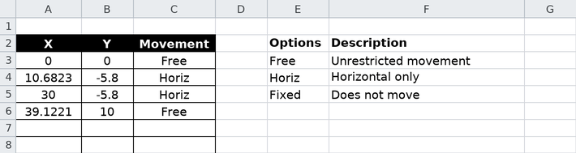

The sheet carries its own legend for the third column, in `E2:F5` — the three
Movement options against what each one does. **Leave the `circles` worksheet
empty.** A model defines one failure-surface family or the other, and this one is
non-circular.

Save the file and continue at [Running the analysis](#running-the-analysis).

---

## C — Building it in Studio {#c-building-it-in-studio}

Start with **File → New** and work down the **Inputs** tree.

### 1. Materials, profile lines and water

Click **Materials**, and in **Table view** press **Add row** four times for the
four soils in the order the table above lists them — the row order is what fixes
the Mat IDs. Then **Profile lines**: set **Max depth (bottom boundary
elevation):** to `-10`, and press **Add line** four times, each line taking its
**Material:** and its vertices from the geometry tables above. The mechanics are
[LEM-3's](lem03_layered_slope.md#c-building-it-in-studio), twice over.

Click **Piezometric lines** and, on the **Line 1** tab, **Add row** twice for
`-20, -2` and `50, -2`. **Line 2 (rapid drawdown)** stays empty.

### 2. The failure surface

Click **Non-circular pts** in the **Inputs** tree. The editor is a vertex table
with the preview beside it, and its help line states the two rules the table has
to obey: *"Points ordered left→right. Entry/exit points use Movement='Free'."*

Press **Add row** four times and fill them from the table above: `-10, 0, Free`,
`0, -5, Horiz`, `25, -5, Horiz`, `40, 10, Free`.

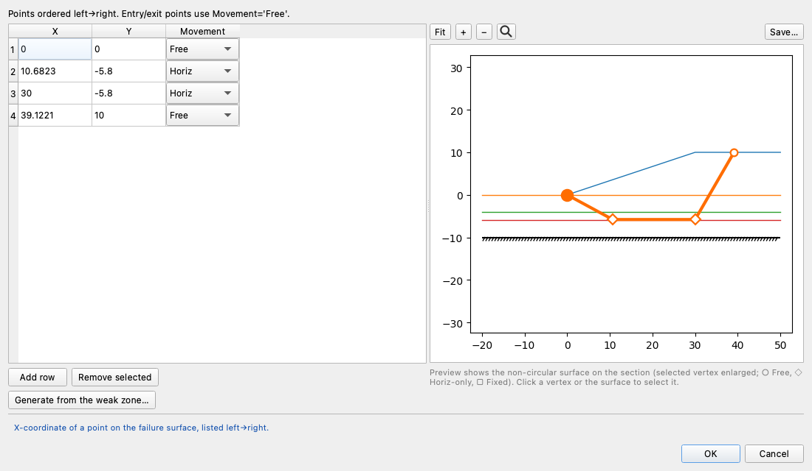

The preview draws the polyline on the section, in the order the rows were
entered, and marks each vertex with the shape of its Movement — ○ Free,
◇ Horiz-only, □ Fixed — which is where a mistyped Y shows up: the two interior
vertices should sit between the green and red contacts, not above or below them.
Like the inputs plot, it draws the rows as entered, so a doubled-back table
shows up here as a tangle — the solver
[sorts the vertices before slicing](#the-surface-the-solver-read), so the
results plot will not show it. Clicking a vertex selects its row, and selecting
a row enlarges the vertex.

### 3. Generating the surface instead

The same editor carries **Generate from the weak zone…**, which builds a surface
from the geometry rather than from a drawing. It ranks the material zones by the
shear strength each can mobilise *at the stress it actually carries* — the one
quantity comparable across an undrained clay and a frictional sand — lays a track
just above the base of the weakest, and ramps up to the ground at both ends.

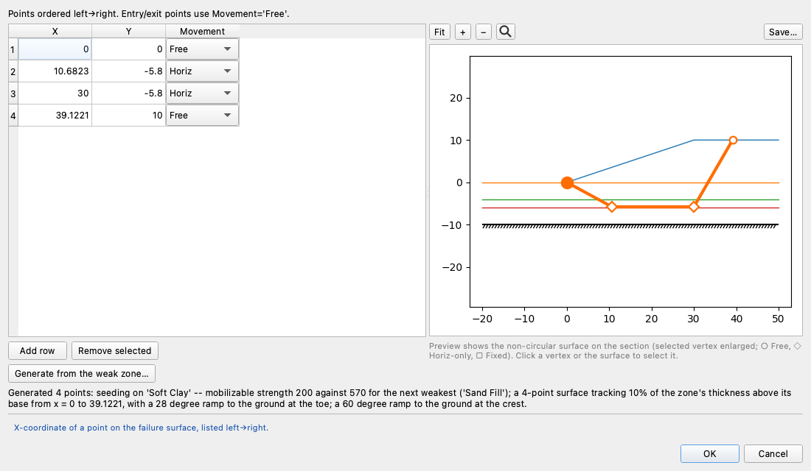

On an empty table it fills it without asking, and reports what it did under the
button:

> Generated 6 points: seeding on 'Soft Clay' -- mobilisable strength 200 against
> 570 for the next weakest ('Sand Fill'); a 6-point surface tracking 10% of the
> zone's thickness above its base from x = 0 to 39.1221, with a 28 degree ramp to
> the ground at the toe; a 60 degree ramp to the ground at the crest.

Every part of that line is auditable, and [worth auditing](#where-the-track-belongs-inside-the-seam):
the zone it chose and the margin it chose it by, where in the seam the track
runs, how far it reaches, and the angle of each end ramp. The rows land in the
table, so they can be edited before **OK**, and **Cancel** discards them.

What it proposes is not what this page runs. The generator derives a viable
shape from the geometry — six points tracking near the base of the seam, at
y = −5.8 — where the taught surface runs mid-seam at −5, and the two are
different surfaces with different answers:
[the results below](#where-the-track-belongs-inside-the-seam) measure the
generated shape at 2.022 against 1.789 for the surface as drawn. Before
leaving the editor, delete the generated rows and enter (or copy-paste) the
four points from the table above, so the model you carry forward is the one
every number on this page reads.

Continue below.

## Running the analysis

However you built it, you now hold the same model:

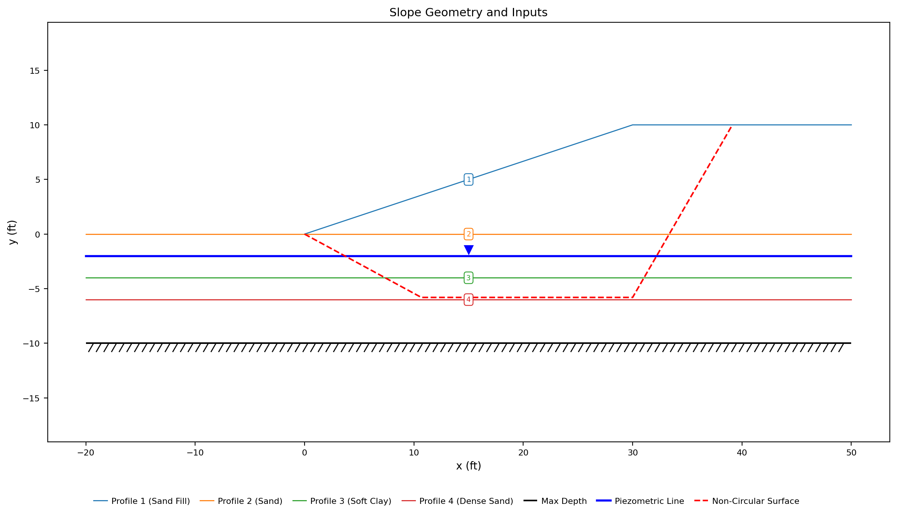{width=1000}

The four profile lines are drawn in their materials' colors, the piezometric line
is the heavy blue one at elevation −2, and the red dashed polyline is the failure
surface — dropping from the flat ground beyond the toe, running 25 ft along the
middle of the clay, and climbing to the back of the crest.

Click **Run LEM…** and choose **Method** = `Spencer` and **Analysis** =
`Single surface`, with the slice count left at 40:

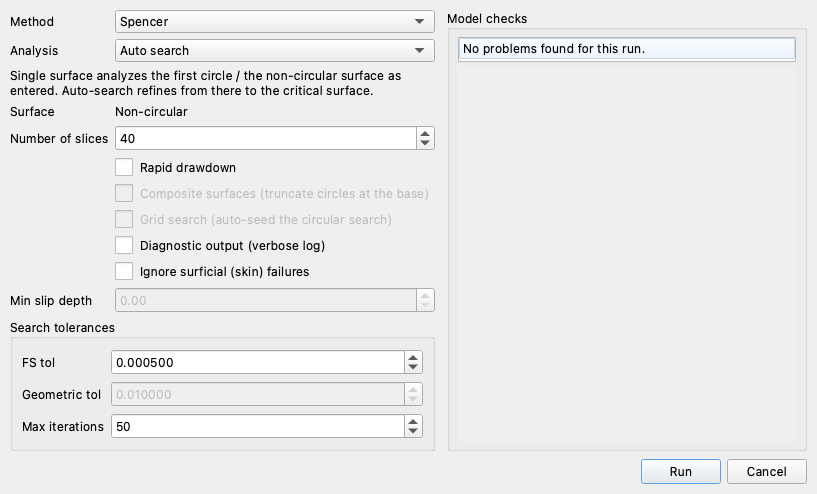

**Surface** is not a choice on this model: it reads `Non-circular` as a fixed
label, because the model defines a non-circular surface and no circles. The
dialog's own note says what the two analyses do — *"Single surface analyzes the
first circle / the non-circular surface as entered. Auto-search refines from
there to the critical surface."* **Single surface** solves the surface entered without perturbing it as part of
a search algorithm.

---

## Exploring the results

### The surface as drawn

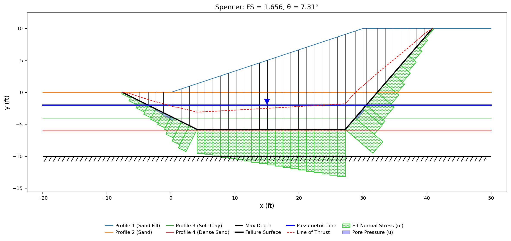{width=1000}

**FS = 1.789**, on the four points as they were typed. The sliding mass weighs
43,855 lb/ft and its base is 57.4 ft long, split three ways: **28.7 ft in the
clay**, 14.6 ft in the sand and 14.1 ft in the fill. Half the surface is in a
layer 2 ft thick, which is what a weak-layer mechanism is.

Spencer returns no admissibility warnings on it — no interslice tension, no base
tension, no line of thrust outside a slice. On a surface whose shape is a free
choice rather than three numbers, those warnings are the main defence against a
polyline that cannot carry its own equilibrium.

Two of the seven methods decline to run at all:

> the Ordinary Method of Slices takes moments about a circle center, so it cannot
> be used with a non-circular surface. Methods valid for a non-circular surface:
> Janbu Method, Corps of Engineers Method, Lowe & Karafiath Method, Spencer's
> Method, Morgenstern-Price Method.

**OMS and Bishop are circle methods.** Both satisfy moment equilibrium by summing
moments about the center a circle has and a polyline does not, so on this family
they are not conservative or approximate — they are undefined. That is why the
sample page's factor-of-safety table shows a dash in their two columns rather
than a number. The five that remain:

| Janbu | Corps | Lowe | Spencer | M-P |
|---:|---:|---:|---:|---:|
| 1.761 | 1.883 | 1.728 | 1.789 | 1.766 |

They span 9.0%, low to high, and the three force-equilibrium procedures sit on
either side of Spencer rather than above it. **Spencer satisfies both force and
moment equilibrium and is the one to report.** That 9.0% is what five methods do
when they are all describing the same mechanism.

### The surface the solver read {#the-surface-the-solver-read}

1.789 is the answer for the surface the solver read, and on this table that is
also the surface that was typed — but the two are not the same thing by
construction. The solver sorts the table's vertices by X and clips the polyline
to the ground surface before slicing, and neither step reports itself:

- **This same table entered in reverse** — (40, 10) in the first row down to
  (−10, 0) in the last — sorts back into the surface above and returns the
  identical five numbers.
- **The exit mistyped above the ground at (40, 14)** returns a clean
  **FS = 1.788** — for a surface whose exit the clipping moved to (36.8, 10),
  where the typed polyline crosses the crest: 5.1 ft from the typed point,
  3.2 ft of it back along the crest. The five methods spread 11.0% instead of
  9.0%, and every warning list on the run is empty.
- **A seam run typed doubled back** — its interior rows at x = 25 and then
  x = 10 — draws a polyline that crosses itself. Sorted, it becomes a clean
  surface entering the seam at x = 10, and solves to **FS = 1.871**, again
  without complaint.

Three tables the preview draws exactly as typed — the third as a visible
tangle — and three sets of clean numbers, each for the sorted, clipped surface
rather than the drawn one. So the check is not the vertex table, and it is not
the preview: **the results plot draws the surface that was solved.** Read that
line against the surface you meant before reading the number on it.

### What a circle gets on the same section

The seam is what the non-circular surface was drawn for, so the fair question is
what a circle makes of the same ground. Add starting circles derived from the
geometry and run the ordinary circular search on them:

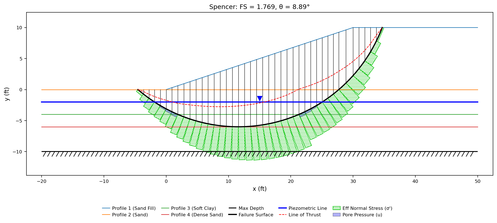{width=1000}

**FS = 1.769**, on a circle centered at (11.59, 18.66) with a radius of 24.66 —
and its lowest point is at elevation **−6.000**, tangent to the base of the clay.
The generated set is six circles — one through the toe, one tangent to the base
of each layer and to the maximum depth (elevations 0, −4, −6 and −10), and one
skimming the sandy face, reaching −19.6 — and the search settles on the one that
reaches the bottom of the seam: 20.0 ft of its 47.4 ft base lies inside the weak
layer.

It also comes within 1.1% of the polyline drawn by hand. **A circle is not
automatically far off a weak-layer mechanism**, and here it is not: the seam is
shallow and only 2 ft thick, so an arc can be made nearly tangent to its base and
pick up most of the same weak ground. What the circle cannot do is *stay* in the
seam — it touches the bottom at one point and curves away on both sides, where
the polyline runs 25 ft along it.

### Where the track belongs inside the seam

The four points put the flat run at y = −5, the middle of the clay. Nothing in
the geometry requires that. Move both interior points up and down inside the seam
— everything else unchanged — and the answer slides monotonically:

| Track elevation | −4.2 | −4.5 | **−5.0** | −5.5 | −5.8 | −6.0 |
|---|---:|---:|---:|---:|---:|---:|
| Factor of safety (Spencer) | 1.893 | 1.851 | **1.789** | 1.734 | 1.705 | 1.686 |

**The lower in the seam the track runs, the lower the answer**, over the whole 2
ft: 1.893 a couple of inches under the top contact, 1.686 at the base, 12%
apart. The
mechanism is not choosing between clay and sand there — every one of these tracks
is in the clay, at the same S<sub>u</sub> = 200 psf. What changes is everything
*around* the base: a deeper track carries more soil above it and shortens both
end ramps, and the ramps are where the frictional sands do their resisting.

This is what the generator's *"tracking 10% of the zone's thickness above its
base"* means, and why: 10% above a base at −6 is y = −5.8, near the bottom of
that column and clear of the contact itself. Solve the generator's whole surface,
though, and it reads higher than the hand-drawn one:

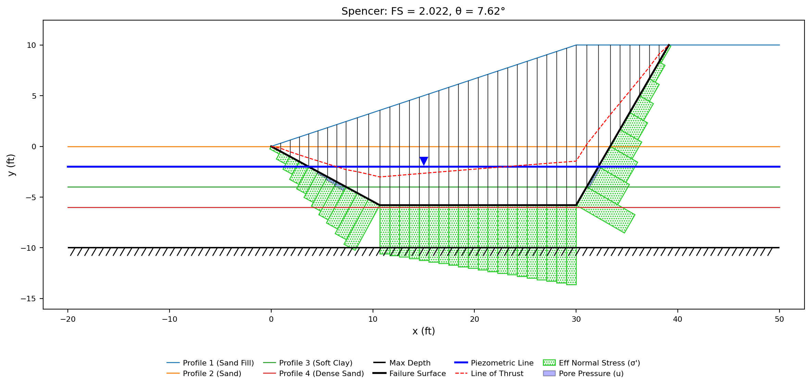{width=1000}

**FS = 2.022** against 1.789. The track is in the right place; the ends are not
the same ones. The generator lands its entry at the toe, x = 0, because that is
where the zone it is tracking meets the slope — while the hand-drawn surface
enters 10 ft further out on the flat ground, which lengthens the sliding mass and
finds a worse mechanism. The two disagree by 13%, and neither of them is the
section's answer: **a generated surface is a viable shape, not a critical one.**

### When the shape stops meaning anything {#when-the-shape-stops-meaning-anything}

The entry point is a free choice — anywhere on the ground left of the toe — and
it is the easiest of the four points to get wrong. Walk it in from x = −10
toward the toe, leaving the seam track and the exit alone. The leading segment
stands up as it goes:

| Entry X (ft) | Leading segment | FS (Spencer) | Spread across the five methods | Base tension |
|---|---:|---:|---:|---|
| **−10** — the file's | 26.6° | **1.789** | 9.0% | — |
| −8 | 32.0° | 1.792 | 11.7% | — |
| −6 | 39.8° | 1.829 | 17.2% | — |
| −4 | 51.3° | 1.988 | 32.2% | — |
| −3 | 59.0° | 2.258 | 144% | — |
| −2 | 68.2° | 1.424 | 32.9% | yes |
| −1 | 78.7° | 2.892 | 126% | yes |
| −0.5 | 84.3° | no solution | — | — |

Three things happen in that table, in order, and they are three different
failures.

**Up to about 40° the surface is simply not critical.** It solves cleanly, every
method agrees to within 17.2%, and the factor of safety rises because the sliding
mass is getting smaller — 43,855 lb/ft at the entry the file carries, 42,627 at
x = −6. Nothing is wrong with those answers; they are just answers about worse
surfaces.

**By 51° the methods have stopped agreeing.** At an entry of x = −3, where the
leading segment stands at 59°, the same surface reads 0.925 by Janbu and 2.258 by
Spencer — a factor of 2.4 on one geometry. Spencer's warning list on its 2.258
is genuinely empty; Janbu's 0.925 has no warning list to be empty, because its
result carries none. **Method spread is the first tell**, and it comes earlier
than any warning: five
procedures that differ by 9% on a well-shaped surface and by 144% on this one are
not describing the same mechanism.

**By 68° the solutions go into tension.** Spencer's own warnings say so —
*"base tension on 2 cohesionless slice(s), worst N' = -875.6 at slice 2"* — and
that sentence is the physical statement of the whole problem. The leading slices
now stand on a base inclined at 68°; equilibrium can only be satisfied by pulling
them onto it, and their soil is a sand with c = 0, which cannot be pulled. At
84° there is no solution to be had at all: *"Spencer's method: only solutions
with anomalous base tension found (5.2x cohesive capacity, θ=18.3°)"*.

Pulled in to x = −1, the entry segment stands at 78.7° and the two leading slices
are slivers of sand — the second of them 0.4 ft wide and 3.0 ft tall — standing
on a base that is nearly a wall:

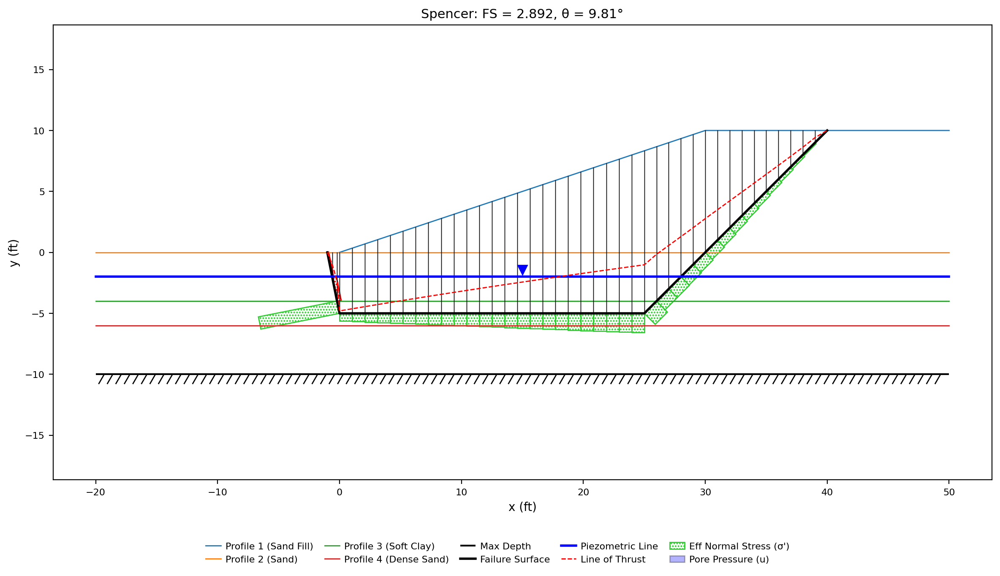{width=1000}

**FS = 2.892** — higher than the surface as drawn, higher than the best circle
the section admits, from a shape that is not a mechanism. Nothing about the
figure's *shape* is illegal — the polyline
starts on the ground, ends on the ground, runs through the seam, and slices
without complaint. What the figure shows is why the answer is not: the effective
normal stress, drawn perpendicular to each base, lies almost horizontally on
those leading slices. The force across a base at 78.7° is a thrust into the
hillside rather than a weight onto a slope, and those two slices are the
cohesionless ones the tension warning names.

So a non-circular result is read in three passes, and the number comes last:

- **The end ramps.** They belong near the Rankine wedge inclinations — 45° − φ/2
  for the wedge pushing out at the toe, 45° + φ/2 for the one dropping in behind
  the crest, or about 28° and 63° in these sands. Those are the angles the soil
  itself breaks on, and they are what the generator builds (capping the steeper
  end at 60°, since a starting surface a search would reject on sight is worse
  than none). Anything much steeper is a surface the ground has no reason to
  choose.
- **The warnings.** Base tension on a cohesionless slice, or no solution at all,
  means the surface has been drawn into a shape that cannot carry its own
  equilibrium. It is not a conservative answer or a rough one; it is not an
  answer.
- **The spread between methods.** Run more than one. On a surface worth
  reporting they land within a few percent of each other, and a spread that opens
  to tens of percent is the surface talking, not the methods.

### What Movement is for {#what-movement-is-for}

Nothing above turned on the **Movement** column, because a single-surface run
never moves a vertex. Movement is read by the automated
search, which walks the vertices to look for a lower surface: `Free` moves a
point perpendicular to the surface, `Horiz` slides it sideways only, and `Fixed`
pins it. The same model, searched with Spencer four ways:

| Movement on the four points | Factor of safety | Where the interior points end up |
|---|---:|---|
| `Free`, `Horiz`, `Horiz`, `Free` — the file | 1.739 | y = −5, −5: slid along the seam |
| `Free`, `Free`, `Free`, `Free` | 1.687 | y = −6.00, −5.97: dropped to the bottom of the seam |
| `Free`, `Fixed`, `Fixed`, `Free` | 1.779 | y = −5, −5, x unmoved |
| blank, blank, blank, blank | 1.779 | identical to `Fixed` |

`Horiz` is the setting for a point inside a seam — it may slide along the layer
but not out of it — and it is what the sheet's four rows carry. The two end
points are entry and exit: whatever their Movement says, the search slides them
along the ground surface, which is why the convention is to give them `Free` and
why their Y must be a real ground elevation. And **a blank Movement is not a
default, it is `Fixed`** — the last row of that table shows both facts at once:
with every vertex pinned that the column can pin, the search still slid the
entry 0.77 ft and the exit 1.58 ft along the ground, and its 1.779 is the answer
for that shifted surface, not the 1.789 of the surface as drawn.

The search itself is a separate subject, and a harder one. The same section's
[sample page](../lem/samples.md#7-non-circular-failure-surface) reports it method
by method: Spencer's search reaches 1.739, 2.8% below the 1.789 of the surface as
drawn, on a shape much like it. Lowe & Karafiath's reaches 1.369, and it gets
there on a surface whose entry segment stands at 64.6° — a steep leading wedge
arrived at by a search rather than typed by hand, and one to read against the
three passes above before believing. Lock that surface and run all five methods
on it: they spread 182%, from 1.043 by Janbu to 2.941 by Spencer — the spread
test failing a searched surface exactly as it fails a typed one.

---

## Conclusion

This tutorial demonstrated:

- A failure surface entered as a table of vertices rather than a circle: points
  left to right, straight segments between them, ramps at the ends and a flat run
  through the weak layer between.
- The entry and exit points carrying explicit ground-surface elevations, because
  a blank Y is a slicing error rather than a request to snap to the ground.
- The solver sorting the vertices by X and clipping the polyline to the ground
  before it slices — a reversed table solving to the identical numbers, a
  doubled-back one to a clean answer for a surface never drawn — so the solved
  surface on the results plot, not the typed table, is what gets read against
  the surface that was meant.
- OMS and Bishop declining a non-circular surface outright — both take moments
  about a circle center — and the five methods that remain agreeing to 9.0% on
  the surface as drawn, at **FS = 1.789** by Spencer's method.
- The best circle the same section admits coming to 1.769 on an arc tangent to
  the base of the seam: on a shallow 2 ft layer the two families are close, and
  what the polyline adds is the 25 ft it spends *inside* the clay.
- Where the track belongs inside the seam — 12% between the top of the clay and
  its base — and the generator that places it there, names the zone it chose and
  reports the margin it chose it by.
- Reading a non-circular result before its number: the end ramps against
  45° ∓ φ/2, the base-tension warnings, and the spread between methods, which
  opens from 9% to 144% on a surface whose leading segment has been stood up to
  59°.

**Where to go next:** this page closes the tutorial series — the
[tutorials index](index.md) lists all five, and the sample problems carry each
one further.
[Sample Problem 7](../lem/samples.md#7-non-circular-failure-surface)
carries this same model into an automated search, and
[Sample Problem 13](../lem/samples.md#13-multiple-local-minima) is the circular
counterpart of the same hazard — a section where the surface a search settles on
depends entirely on where it was started.
