# Tutorial LEM-6 — Polygon Geometry

A 20 ft embankment on a foundation whose bedrock is not level: the base of the
section falls from elevation −5 at the right-hand edge to −15 at the left. A
profile-line model cannot say that. Its bottom boundary is one number, a single
horizontal elevation — so **the geometry is entered as closed polygons instead**,
one per material zone, and the base of the model is whatever the polygons draw.

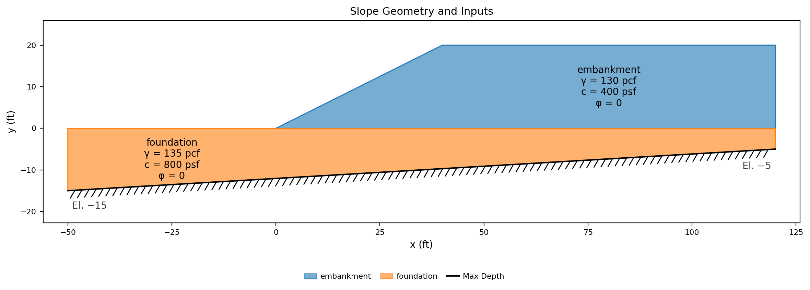{width=700}

<div class="tut-glance" markdown>
<div class="tgt-row">
<div class="tgt-tile"><span class="tg-label">Analysis</span><p>Limit equilibrium</p></div>
<div class="tgt-tile"><span class="tg-label">Assistant</span><p>~5 min</p></div>
<div class="tgt-tile"><span class="tg-label">By hand</span><p>15–20 min</p></div>
</div>
<div class="tgm-obj" markdown>
**Learning objectives** — Enter a section as material-zone polygons rather than profile
lines, on a base that dips too much for a maximum depth to describe; search it
for the critical circle; and read what the base does to that search — the
circles it refuses, the option that lets a circle be truncated against it
instead, and the change in soil that puts the critical surface on it.
</div>
<p><span class="tg-pill">two materials</span><span class="tg-pill">polygons</span><span class="tg-pill">dipping base</span><span class="tg-pill">composite surfaces</span><span class="tg-pill">circular search</span></p>
<div class="tgm-model" markdown>**Completed model** — [xslope_sloping_bottom.xlsx](../lem/files/xslope_sloping_bottom.xlsx) — the same file used by [LEM Sample Problem 11](../lem/samples.md#11-polygon-input-with-a-sloping-bottom)</div>
</div>

---

## The problem

**Geometry** — a section's geometry is entered one of two ways, and this is the
page for the second. **Profile lines** give the *top* of each material layer and
a single maximum depth beneath them all, which is the faster input wherever the
layers lie flat and span the section — the geometry of
[LEM-3](lem03_layered_slope.md), [LEM-4](lem04_water_in_the_slope.md) and
[LEM-5](lem05_weak_layer_noncircular.md). **Polygons** give each material zone as
a closed region drawn in its own right. Reach for them when a layer's bottom is
not a horizontal line — dipping or irregular bedrock, as here — and equally for a
lens or a pod of soft material with soil on every side, a zoned embankment whose
core and shells stand side by side rather than stacked, or a section that arrives
from CAD already drawn as closed regions. The two are alternatives, never mixed:
a model uses one sheet or the other.

Two zones here. Each is one small `x` / `y` table, one vertex per row, in the
paired columns its worksheet block carries:

**Polygon 1 — material 1 (`embankment`):**

| x (ft) | y (ft) |
|:---:|:---:|
| 0 | 0 |
| 40 | 20 |
| 120 | 20 |
| 120 | 0 |

**Polygon 2 — material 2 (`foundation`):**

| x (ft) | y (ft) |
|:---:|:---:|
| -50 | 0 |
| 120 | 0 |
| 120 | -5 |
| -50 | -15 |

**A polygon is a closed region, and it closes itself.** The last vertex joins
back to the first, so each ring is listed once around and the first point is
never repeated at the end. Either direction round works — the `polygon` sheet
says so in its own instruction line, *"Polygons coordinates can be input in CW or
CCW order."*

Read the two rings against the drawing. The embankment is the toe at (0, 0), the
crest break at the top of the 2:1 face, the back of the crest, and down the
right-hand edge to elevation 0 — its fourth side is the flat contact it sits on.
The foundation starts 50 ft left of the toe, runs the full width at elevation 0,
drops to −5 at the right-hand edge, and closes along the base back to −15 at the
left. That last edge is the dipping bedrock: 10 ft of fall over 170 ft, a slope
of 3.4°.

**Nothing here states a ground surface, and nothing states a maximum depth.**
Both come out of the zones. The section's outline is the union of the two
polygons — the *domain* — and the ground surface is its upper edge, the
foundation from x = −50 to the toe and then the embankment's face and crest. The
lower edge of that same union is the base of the model, drawn hatched on every
plot. No material exists below it, so no failure surface may pass through it: the
role a maximum depth plays in a profile-line model is played here by a boundary
the zones drew themselves, and it does not have to be flat.

**Materials** — two Mohr-Coulomb (`mc`) soils, both undrained, the fill weaker
than the ground it stands on:

Unit weights are pcf and cohesions psf; the row order is the Mat ID the polygon
rings reference, and neither soil carries pore pressures — `u` stays `none` —
so the table ends at φ:

| name | γ | γsat | option | c | φ |
|---|:---:|:---:|---|:---:|:---:|
| `embankment` | 130 |  | `mc` | 400 | 0 |
| `foundation` | 135 |  | `mc` | 800 | 0 |

**Starting circles** — two, sharing a center above the middle of the face at
twice the slope height:

| Xo | Yo | Option | Depth |
|:---:|:---:|---|:---:|
| 20 | 40 | Depth | 0 |
| 20 | 40 | Depth | -10.7887 |

The first is tangent to the contact between the two soils. The second is as deep
as a circle from that center can be and still fit inside the domain: its lowest
point sits at elevation −10.7887, and the bedrock beneath the center is at
−10.88. **Depth is an elevation**, and on a dipping base a circle tangent to that
base touches it at a single point rather than running along it — which is what
the [last section](#circles-that-will-not-fit) of this page is about.

Every number the model needs is in the tables above, and each is laid out exactly
as its destination is — the template's worksheets and Studio's editors, same
columns in the same order. Select a table's block of values, copy, and paste it
straight into the sheet or editor rather than retyping it.

---

## Choose how you want to build it

Three ways to get this model into XSLOPE. They produce the same model — pick one
and skip the other two.

1. **[Build it with the AI assistant](#a-building-it-with-the-ai-assistant)** —
   describe the two zones and the dipping base in a sentence, and audit what it
   entered.
2. **[Build the Excel input file](#b-building-the-excel-file)** — three
   worksheets, one of them the `polygon` sheet.
3. **[Build it in Studio](#c-building-it-in-studio)** — the polygons editor, with
   the zones redrawing beside them.

Whichever you choose, rejoin at [Running the analysis](#running-the-analysis).

---

## A — Building it with the AI assistant {#a-building-it-with-the-ai-assistant}

The drawing at the top of this page carries the shape and both strengths. Paste
it into the chat box and type `Build this model`, or describe it:

<div class="prompt-block" markdown>
```text
Build a model for a 20 ft embankment with a 2:1 face on a foundation whose bedrock dips: the base of the section is at elevation -15 at x = -50 and rises to -5 at x = 120. Enter the geometry as polygons, one zone per material. The embankment is 130 pcf with c = 400 psf, phi = 0, sitting on the foundation at elevation 0 and running from the toe at x = 0 back to x = 120; the foundation is 135 pcf with c = 800 psf, phi = 0, and its top runs from x = -50 to x = 120 at elevation 0. Add starting circles for a critical-surface search.
```
</div>

### Check its work

- **The geometry is on the `polygon` sheet, not the `profile` sheet.** A model
  states its geometry one way or the other; a dipping base entered as profile
  lines has lost the dip, because a profile-line model's bottom boundary is a
  single elevation. If both sheets came back filled, say: *"Use polygons only —
  clear the profile sheet."*
- **Two zones, the fill first.** The order fixes the Mat IDs, and each polygon
  names its material by ID.
- **Each ring is listed once**, four vertices apiece, with no repeated closing
  point.
- **The zones meet along elevation 0** and neither overlaps the other. The
  embankment's fourth side and the foundation's top edge are the same contact,
  and a gap between them is a hole in the domain.
- **The base dips the right way** — deeper at the left (−15 at x = −50), shallower
  at the right (−5 at x = 120). Reversed, the model is a different problem with
  the same numbers in it.
- **φ = 0 in both.** The drawing gives a cohesion and no friction angle, which is
  an undrained strength; it never says so. If a friction angle appeared, say:
  *"Both strengths are undrained. Set phi to 0 in both materials and leave the
  pore pressure option at none."*
- **No maximum depth was invented.** Polygon input has none, and a value entered
  anyway is an input the loader has no use for.

Continue at [Running the analysis](#running-the-analysis).

---

## B — Building the Excel file {#b-building-the-excel-file}

Start from [input_template.xlsx](../inputs/input_template.xlsx) and save a copy
under a name of your own. Confirm `main!D8` **Units** is `Imperial` and leave the
rest of that sheet alone — no tension crack, no seismic coefficient, and the run
options blank.

### 1. The `mat` worksheet

One row per material, and the row number is the ID. Enter (or copy-paste) the
material properties from the table above, as shown below:

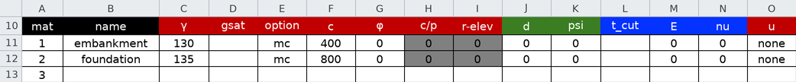

### 2. The `polygon` worksheet

The `profile` sheet stays empty; this is the sheet that replaces it. Set each
polygon's **Mat ID** and enter (or copy-paste) its vertices from the geometry
tables above, one block per zone:

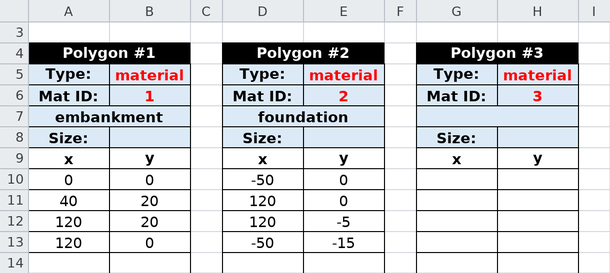

Leave **Type** at `material` in both blocks. It is the cell that says what a
polygon *is*: the other settings on its list make a region an SSR analysis
overlay or a mesh refinement zone, neither of which is geometry. **Size** is
optional and blank here — it sets a local mesh element size inside the zone, which
matters to a finite element run and not to this one.

There is no Max Depth cell on this sheet, and the one on the `profile` sheet is
not read for a polygon model. The base of the section is the bottom of Polygon 2,
which is why that ring's last two vertices carry the two bedrock elevations.

### 3. The `circles` worksheet

Enter (or copy-paste) the two starting circles from the table above, as shown
below:


Save the file and continue at [Running the analysis](#running-the-analysis).

---

## C — Building it in Studio {#c-building-it-in-studio}

### 1. Materials

Click **Materials** in the **Inputs** tree. The editor opens on **Table view**;
press **Add row** twice and enter (or copy-paste) the two materials from the
table above — the block starts at the first `name` cell. The row order fixes the
Mat IDs the polygons reference next:

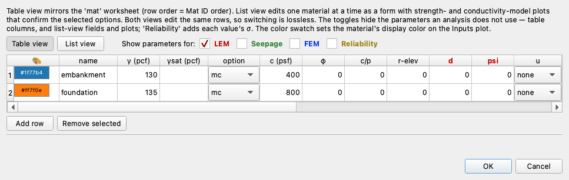{width=1000}

### 2. Polygons

Click **Polygons**. On a new project the editor opens empty: **Add polygon**
starts the first zone — which makes this a polygon project — and **Add row**
adds vertices, though a pasted block brings its own. Enter the embankment ring
from the table above, or click the first `x` cell and paste it; set
**Material:** to `1: embankment`, and leave **Type:** at `material`.
**Add polygon** again for the foundation ring, on `2: foundation`:

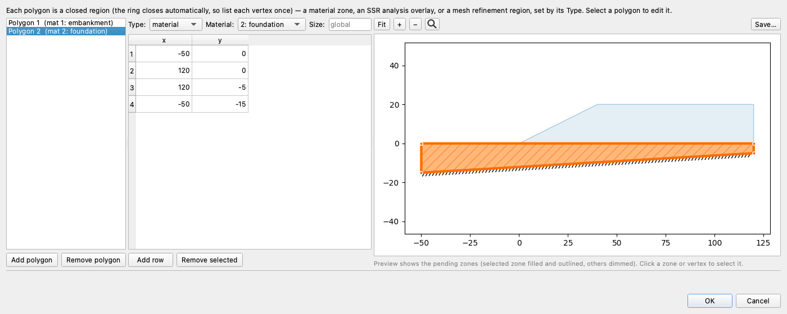

The help line above the rows states the rule the table depends on: *"Each
polygon is a closed region (the ring closes automatically, so list each vertex
once)."*

Two things the profile-lines editor has are missing here, and both are the
point. There is no **Max depth** field, because a polygon model's bottom
boundary is drawn rather than typed. And the preview beside the table draws
filled zones instead of lines — the selected zone outlined and hatched, the
other dimmed — with the hatched base beneath them following the dip. Click a
zone or a vertex in that preview to select it. Click **OK**.

Geometry drawn in CAD takes the same road in: **File → Import DXF…** builds a
polygon project from a drawing's closed regions —
[DXF Import/Export](../usage/dxf.md#importing-polygons-from-a-dxf).

### 3. Starting circles

Click **Circles** and press **Generate starting circles…** — on this section
it proposes two circles at the shared center (20, 40): one through the toe and
one tangent to the layer contact. What it cannot propose is the deep seed —
a dipping polygon base has no single base elevation to target — so change the
toe circle's **Depth** to `-10.7887`, reaching down toward the bedrock. The
table then matches the one above, and the preview draws the deeper arc reaching
under the dipping base:

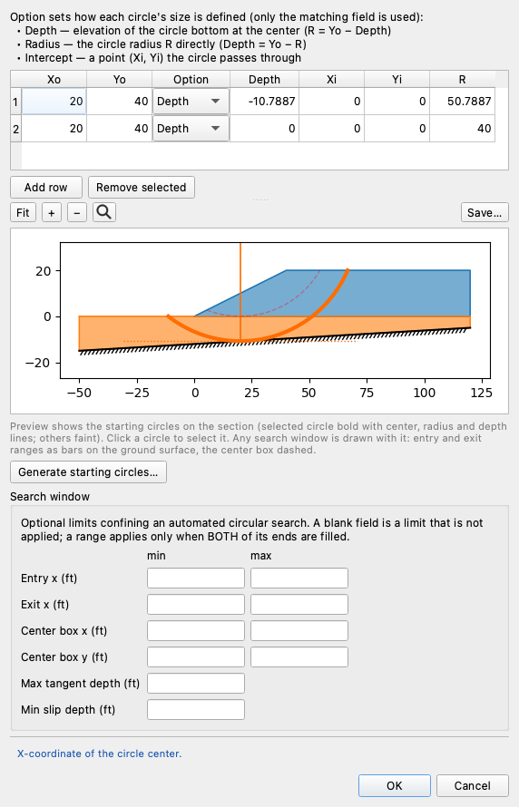

The search starts from both candidate mechanisms. Click **OK**.

Continue below.

## Running the analysis

However you built it, you now hold the same model:

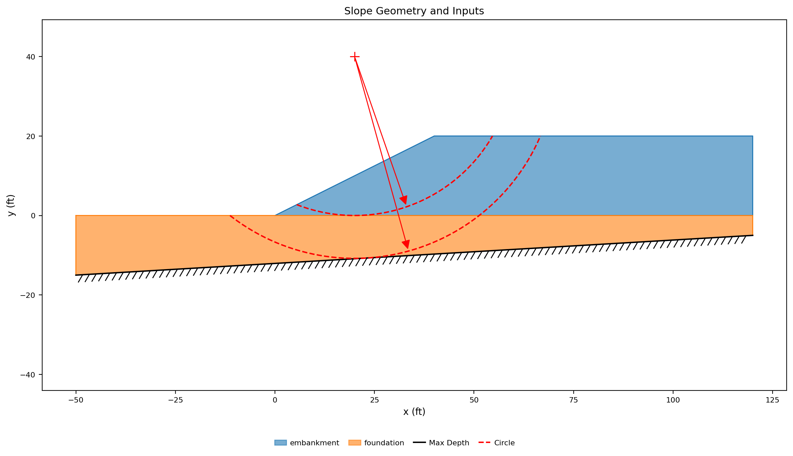{width=1000}

The two zones are filled in their materials' colors, the hatched line under them
is the base of the domain — falling left to right across the whole section — and
the two dashed red arcs are the starting circles. Their radius arrows run off the
top of the frame: the center the two share, (20, 40), sits above it.

Click **Run LEM…** and choose **Method** = `Spencer` and **Analysis** =
`Auto search`, with the slice count left at 40:


---

## Exploring the results

### What the search finds

When the search completes, the search-results plot shows every circle it
tried in gray, the path its refinement walked in green, and the critical
circle in red:

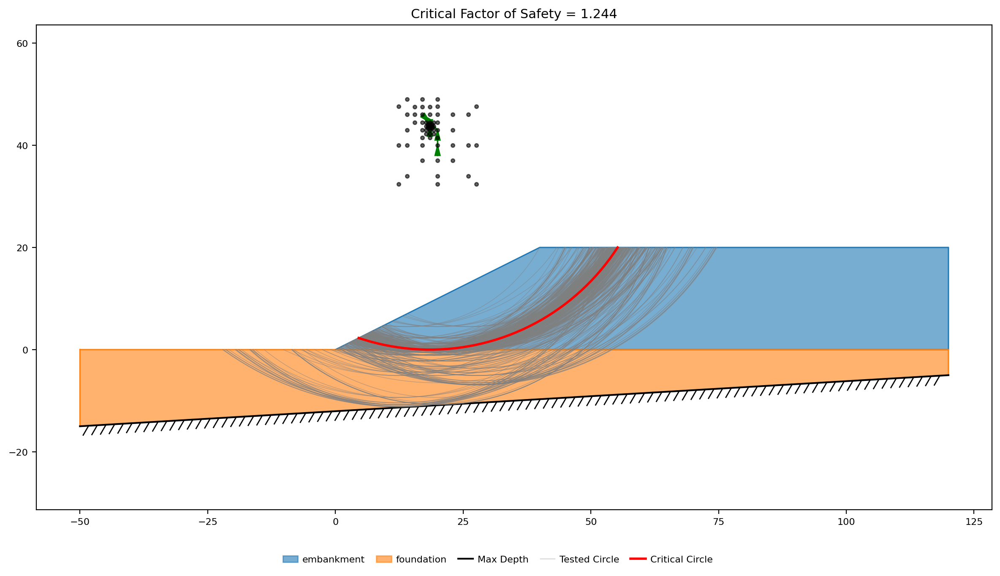{width=1000}

**FS = 1.244**, on a circle centered at (18.5, 43.75) with a radius of 43.75.
Notice how the gray family thins out and stops as it approaches the hatched
line: a circle that would cut below the domain is not a surface this model
has, so the dipping base bounds what the search can try.

The solution plot draws the critical circle with the slice base stresses:

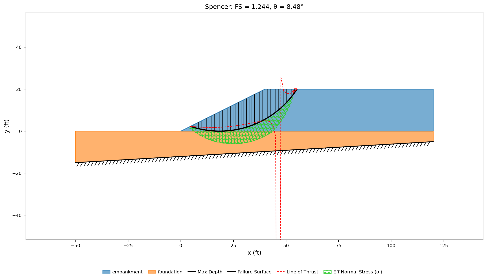{width=1000}

Its lowest point is at elevation 0.000 — tangent to the contact between the two
soils, running along the top of the foundation without entering it. All 40 slice
bases carry c = 400 psf, the fill's strength (the green bars are the effective
normal stress on each base; the dashed red curve is the line of thrust), and
the sliding mass weighs 61,393 lb/ft. The dipping base is nowhere near it:
beneath the circle's lowest point the bedrock is at −10.97, so this answer
would be the same under a level base at any elevation below −11. Solved on its
own, the deeper of the two starting circles — the deepest that fits — comes to
1.655, carrying 167,130 lb/ft against the critical circle's 61,393 and still a
third safer, because everything it adds is foundation at twice the fill's
cohesion.

The solution carries the interslice-tension and line-of-thrust warnings a φ = 0
crest produces, which [LEM-1](lem01_simple_embankment.md) diagnoses and fixes
with a tension crack.

### What the other methods say

Each method gets its own search and its own critical circle:

| OMS | Bishop | Janbu | Corps | Lowe | Spencer | M-P |
|:---:|:---:|:---:|:---:|:---:|:---:|:---:|
| 1.244 | 1.244 | 1.313 | 1.326 | 1.285 | 1.244 | 1.244 |

The four that satisfy moment equilibrium — OMS, Bishop, Spencer and
Morgenstern-Price — land on the same circle and the same 1.244; with φ = 0 they
cannot disagree about one. The three force-equilibrium procedures each settle on
a flatter, larger-radius circle of their own and come out 3–7% higher. Spencer
satisfies both force and moment equilibrium and is the one to report.

### Circles that will not fit {#circles-that-will-not-fit}

Take the second starting circle, whose lowest point grazes the bedrock, and push
it 1.2 ft deeper — **Depth** `-12` in place of `-10.7887` — then run it as a
**Single surface**. There is no answer:

> **LEM run failed** — Failure surface extends outside the domain polygon

That is the domain rule enforced. The arc would leave the model between roughly
x = 12 and x = 34, and there is no soil down there to shear.

The alternative to refusing such a circle is to cut it off at the boundary, and
the Run LEM dialog has a checkbox for exactly that: **Composite surfaces
(truncate circles at the base)**. Tick it and run the same circle again:

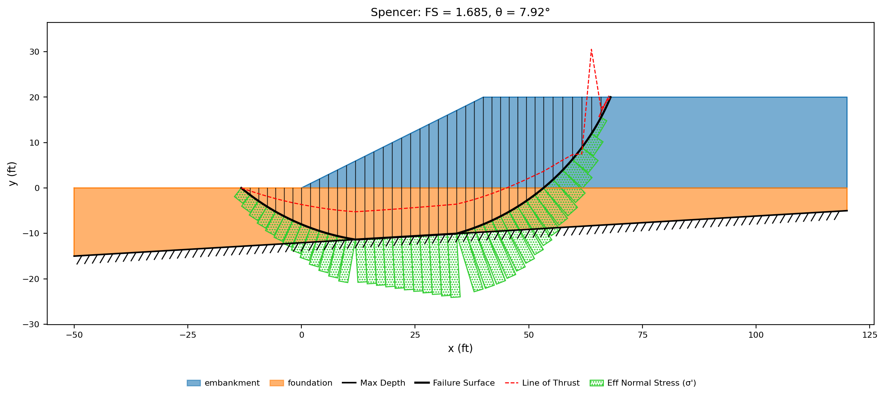{width=1000}

**FS = 1.685.** The surface follows the arc down until it meets the bedrock at
x = 11.87, runs *along* the bedrock for 22.3 ft to x = 34.10, and climbs back out
on the arc — 11 of its 41 slice bases sitting on the dipping base itself, each
inclined at the base's own 3.4° rather than at the circle's tangent. A surface
built this way is a **composite surface**; the mechanics are in
[Composite Failure Surfaces](../lem/overview.md#composite-failure-surfaces).

The box is off by default, and the reason is what the bottom of a model means.
Here it is real bedrock, so a mechanism riding along it is a mechanism the slope
genuinely has. In a profile-line model the floor is the maximum depth — a bound
on how deep you chose to look — and truncating circles against an arbitrary
search bound would answer nothing.

Running the search itself with the box ticked returns **1.244**, on the same
circle as before. Nothing changed, because the critical mechanism here never
approaches the base. The option matters where the base is what the failure
follows.

### When the base decides

Which layer is weak is a property of the soils, not of the geometry. Give the
foundation c = 300 psf — below the fill's 400 — with everything else unchanged,
and search again:

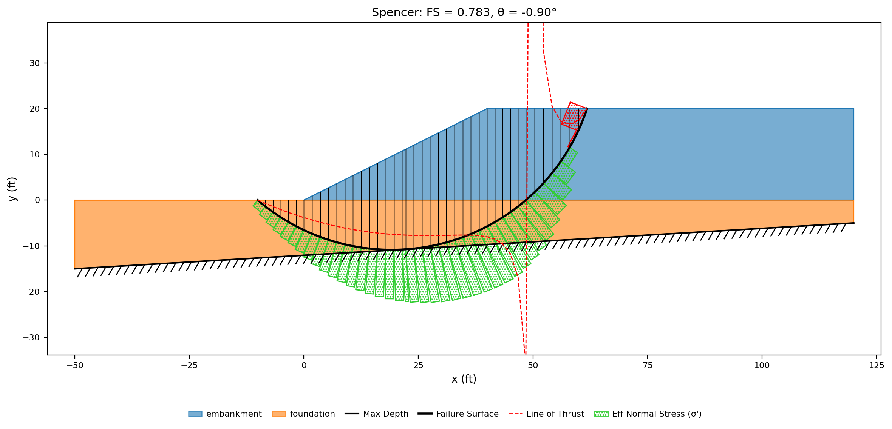{width=1000}

**FS = 0.784**, and the mechanism is a different one: the critical circle now
bottoms out at elevation −10.85, grazing the bedrock, with 162,210 lb/ft of soil
above it and most of its base in the foundation. This is the surface the second
starting circle was there to describe, and the search reached it from that seed.

Run this one with composite surfaces on and it returns 0.782 — two tenths of a
percent. A 3.4° dip is gentle enough that an ordinary circle can hug it for most
of its length, so there is little left for truncation to add. The gap opens on a
base that is steep or irregular, or on a soft seam lying directly on rock, where
the mechanism runs flat along the boundary for tens of feet and no circle can
follow it at all.

---

## Conclusion

This tutorial demonstrated:

- Material-zone polygons as the alternative geometry input: one closed ring per
  zone, each vertex listed once in either direction, chosen over profile lines
  when the base dips or is irregular, when a lens or a zoned section will not
  stack into layers, or when the geometry arrives from CAD.
- A model with no maximum depth and no entered ground surface — both are read off
  the union of the zones, whose upper edge is the ground and whose lower edge is
  a bedrock boundary that is free to dip.
- A search on that section settling at **FS = 1.244**, tangent to the contact
  with its base entirely in the weaker fill and 11 ft clear of the bedrock, with
  the moment-equilibrium methods agreeing exactly and the force-equilibrium
  procedures 3–7% higher on circles of their own.
- The domain as a hard constraint on the search: a circle 1.2 ft too deep is
  refused outright, and the **Composite surfaces** option is what truncates it
  against the bedrock instead — 22.3 ft of base running along the dip, at 1.685
  where the circle alone had no answer.
- The change that puts the critical surface on the base: softening the foundation
  to 300 psf drops the answer to 0.784 on a circle grazing the bedrock, where
  truncation is worth 0.2% on a 3.4° dip and much more on a steep or irregular
  one.

**Where to go next:**
[LEM-8 — A Reinforced Slope](lem08_reinforced_slope.md) builds a slope that only
stands because of what is buried in it. The [tutorials index](index.md) lists the
series, and the sample problems carry each page further.
[Sample Problem 11](../lem/samples.md#11-polygon-input-with-a-sloping-bottom)
catalogues this model, [DXF Import/Export](../usage/dxf.md) is the route from a
CAD drawing to the `polygon` sheet this page filled by hand, and
[Composite Failure Surfaces](../lem/overview.md#composite-failure-surfaces)
derives what the truncated surface does to the moment methods that assumed a
constant radius.
