# Tutorial LEM-7 — Strength Options Beyond Mohr-Coulomb

Two slopes whose soil strength is not a pair of numbers. Part A is a 6 m
compacted-clay slope where the same triaxial data set is fitted twice — once as
a curved power envelope, once as the straight Mohr-Coulomb line — and the two
fits disagree about whether the slope stands up. Part B is a layered undrained
slope whose lowest clay gets stronger the deeper the surface cuts, and where
flattening that profile to a single strength moves the failure to the bottom of
the model. **The strength model is an input, and it decides the answer as
firmly as the geometry does.**

Analysis
Limit equilibrium

Open &amp; run
~15 min

**Objectives** — Open a completed model carrying a non-linear strength
envelope, run it, and then swap the strength option for the linear fit of the
same data and watch the factor of safety and the critical surface both change
(Part A); and read a strength that varies with elevation, replace it with a
constant, and measure what the search does when depth no longer buys strength
(Part B).

power-curve envelopeMohr-Coulombstrength with depthundrained strengthstarting circlescircular search

**Completed models** — [xslope_baker_clay.xlsx](../lem/files/xslope_baker_clay.xlsx), the compacted-clay slope of [verification problem VP44](../verification/rocscience.md#vp44) carrying its power-curve envelope, and [xslope_low_clay.xlsx](../lem/files/xslope_low_clay.xlsx), the layered undrained slope of [verification problem VP23](../verification/rocscience.md#vp23) carrying its depth-varying strength

---

## Part A — A curved envelope and its straight-line fit

A straight 43° slope, H = 6 m, cut in compacted Israeli clays at
γ = 18 kN/m³, dry, with no layering: one soil, one profile line, a maximum
depth 4 m below the toe, and a single starting circle. This is example problem
1 of Baker (2003), and the whole problem is the strength.

The clay was tested in triaxial compression, and the results were fitted twice.
The completed file carries the first fit — a **power curve**, τ = 1.107·σ′^0.86
(Baker's A = 0.58, n = 0.86, T = 0), which curves down toward the origin and
gives the soil no strength at all at zero normal stress. The second fit, the
one the reader enters later, is the straight Mohr-Coulomb envelope through the
same test points: c′ = 11.64 kPa, φ′ = 24.7°, which at zero normal stress still
promises 11.64 kPa of cohesion.

### Opening the model

Download
[xslope_baker_clay.xlsx](../lem/files/xslope_baker_clay.xlsx) and open it in
Studio — **File → Open**. The Inputs plot draws the section: one profile line,
the hatched maximum depth at elevation −4, and the starting circle the file
carries.

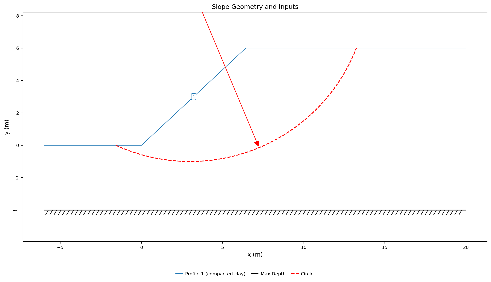{width=1000}

Open **Materials** and switch to **List view**, which puts the strength
parameters beside a plot of the envelope they define. The clay's
**Model (option)** is `pow`, and the four coefficients under it are the power
curve's — `pow_a` = 1.107 and `pow_b` = 0.86, with `pow_c` and `pow_d` at zero:

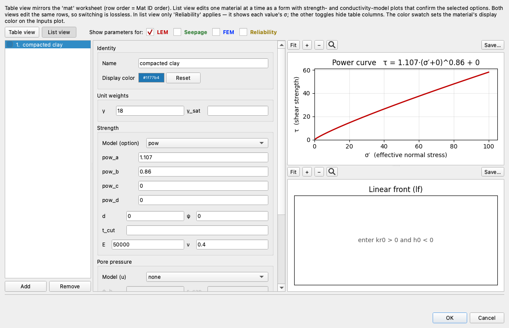

The plot's title spells out the law those cells assemble,
τ = 1.107·(σ′+0)^0.86 + 0, and the curve beneath it is the check that the
coefficients were entered as intended. `pow_d` shifts the normal stress before
the power is taken and `pow_c` adds a constant strength on top; both are zero
here, so the curve passes through the origin.

### Running the analysis

Click **Run LEM…** and choose **Method** = `Spencer` and **Analysis** =
`Auto search`, with the slice count left at 40:

Click **Run**. The search refines the file's circle onto a surface that hugs
the slope face:

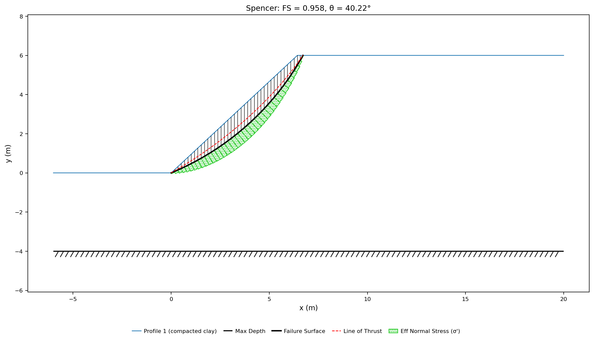{width=1000}

**FS = 0.958** — below one, on a circle centered at (−5.22, 12.61) tangent at
elevation −1.04, 9.18 m of failure surface carrying 98.6 kN/m of soil. Slide
reports 0.960 on this case and Baker's own solution is 0.97. The surface is
shallow, and the effective normal stress along its slice bases averages
8.3 kPa: the low-stress end of the envelope, where a curve running into the
origin has almost nothing left to give.

### Enter the linear fit

Open **Materials** again, and on the same clay change **Model (option)** from
`pow` to `mc`, then enter Baker's fitted envelope. In the `mat` worksheet these
are three adjacent cells:

| option | c | φ |
|---|:---:|:---:|
| mc | 11.64 | 24.7 |

The power-curve coefficients can be left on the row — under `mc` nothing reads
them, and the answer is the same whether they are cleared or not. In Studio's
list view they leave the form entirely, replaced by the two fields the new
option uses:

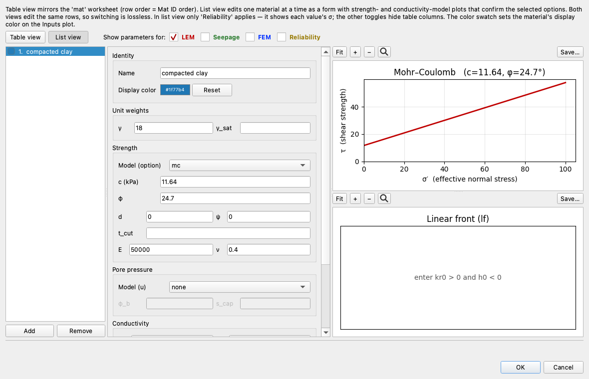

The plot is now a straight line, meeting the strength axis at c′ = 11.64 kPa.
Click **OK** and run the same Spencer auto search again:

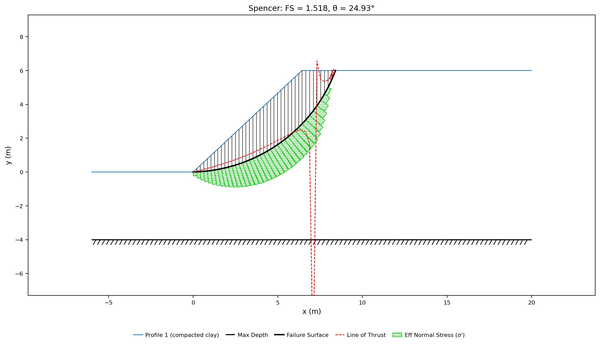{width=1000}

**FS = 1.518** — Slide reports 1.536 and Baker 1.50 — on a circle centered at
(−0.23, 9.22), tangent to elevation 0.00 and 10.96 m long, carrying
306.7 kN/m of soil. That is three times the mass of the surface the power curve
found, and it is why the two answers differ so far: the straight envelope's
cohesion holds the shallow, low-stress mechanism shut, so the critical surface
retreats to a deeper one where the friction term is doing the work.

Same slope, same soil, same triaxial data — 0.958 against 1.518. The two
envelopes cross at σ′ = 89.4 kPa and give the same strength there, so the fits
agree wherever the clay was tested hard. But 6 m of this clay generates at most
γH = 18 × 6 = 108 kPa of vertical stress, and the surfaces the search actually
chooses run far below that: 8.3 kPa on average along the power curve's, 24.2
along the Mohr-Coulomb one. At 10 kPa the curve offers 8.02 kPa of shear
strength where the line promises 16.24, and nearly all of the line's share is
the 11.64 kPa of cohesion it carries unchanged down to zero stress. **The
straight fit is being extrapolated into a stress range no test covered**, and
there it credits the clay with a strength the curve says it does not have.
That is Baker's point in the example, and it is what makes the difference
between a slope that is failing and one that reads a comfortable 1.5.

### London clay, where the two fits agree

The extrapolation is the danger, not the curvature. Baker's example problem 3,
[verification problem VP61](../verification/rocscience.md#vp61), is the same
43°, 6 m slope with strength functions fitted to Perry's CD triaxial data on
London clay — a power curve τ = 3.39344·(σ′+0.152)^0.6 (Baker A = 0.535,
n = 0.60, T = 0.0015) and a fitted Mohr-Coulomb envelope c′ = 6.0 kPa,
φ′ = 32°. This data set includes measurements at very low normal stress, so
neither fit has to be extended past what was measured.

Spencer's search on the power curve:

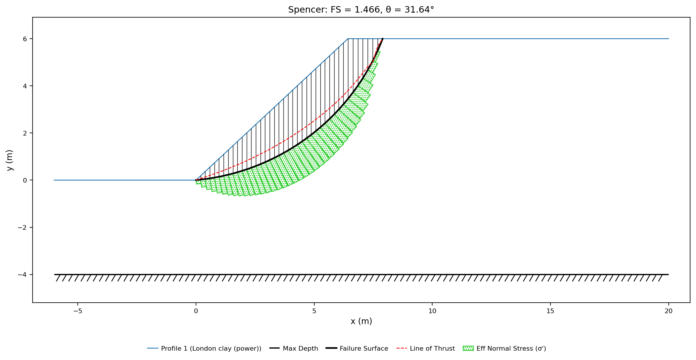{width=1000}

**FS = 1.466**, against Slide's 1.468 and Baker's 1.48. And on the fitted
Mohr-Coulomb envelope:

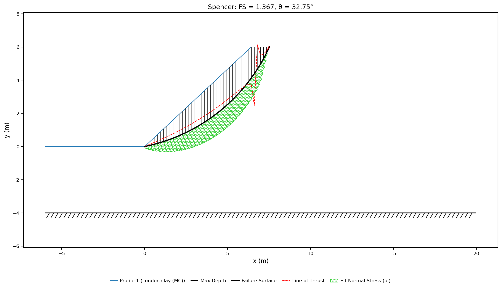{width=1000}

**FS = 1.367**, against Slide's 1.366 and Baker's 1.35. The curve reads 7%
above the line here, where on the compacted clay it read 58% below it, and the
two critical surfaces are nearly the same shape and depth. Where the tests
reach the stresses the slope actually applies, the choice between a curve and a
line is a detail; where they do not, it is the answer.

---

## Part B — Strength that grows with depth

A 2:1 slope 8 m high, standing on a bench at elevation 8 and topping out at
16, over two soft clays that reach down to a rigid base at elevation 0. This is
Low (1989)'s three-layer problem,
[verification problem VP23](../verification/rocscience.md#vp23).

The slope body itself is a stiff soil — γ = 20 kN/m³, c = 95 kPa, φ = 15° —
and the clay directly beneath it, from elevation 8 down to 4, is undrained at a
constant c = 15 kPa with φ = 0. The lowest clay, elevation 4 down to 0, is the
one this part is about: its undrained strength is not one number but a line,
15 kPa at its top growing to 30 kPa at the base of the model. Real normally
consolidated clay behaves this way, because the strength it has is a fraction
of the effective overburden pressing on it, and that pressure grows with depth.

### Opening the model

Download [xslope_low_clay.xlsx](../lem/files/xslope_low_clay.xlsx) and open it
in Studio. The Inputs plot draws the three profile lines in their materials'
colors, the rigid base at elevation 0, and the starting circle the file
carries:

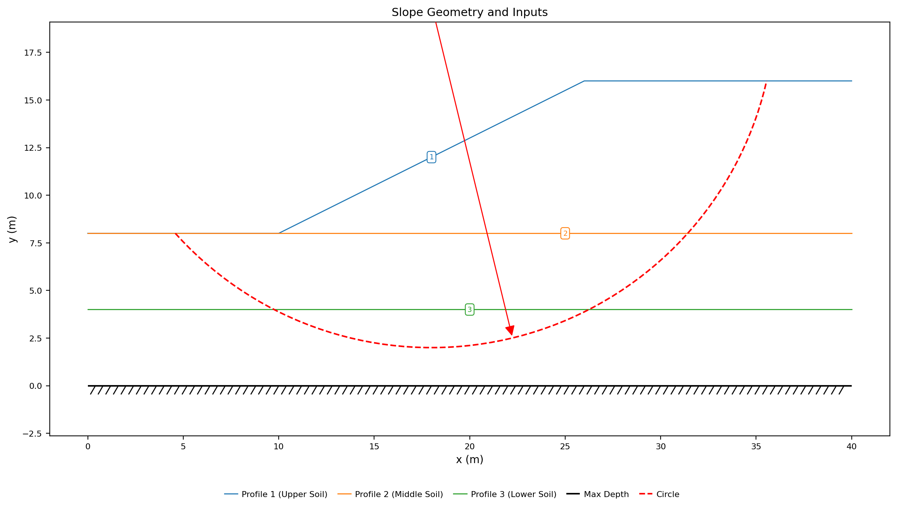{width=1000}

Open **Materials**, switch to **List view**, and select the third row. Its
**Model (option)** is `cp` — undrained strength varying linearly with
elevation — and the three fields under it are what that law needs:

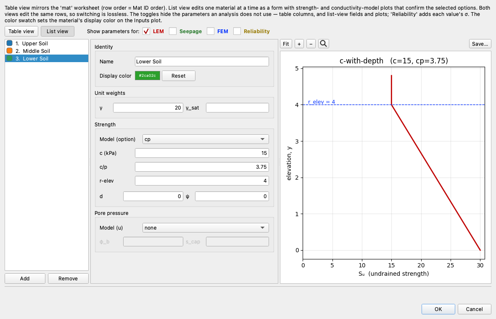

`c` = 15 is the strength at the reference elevation, `r-elev` = 4 is that
elevation, and `c/p` = 3.75 is the rate the strength gains per unit of
elevation below it:
su = c + c/p·max(0, r-elev − y), so at or above elevation 4 the
strength is simply c. The plot beside the fields draws it as a profile against
elevation, with the reference elevation marked, running from 15 kPa at the top
of the layer to 30 kPa at the model floor.

### Running the analysis

Click **Run LEM…** and choose **Method** = `Bishop's Simplified` and
**Analysis** = `Auto search`, raising **Number of slices** to `50`:

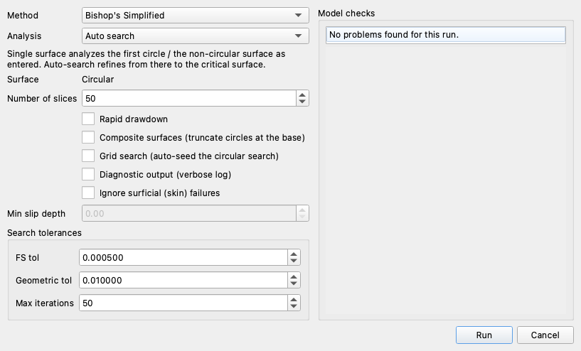

Click **Run**:

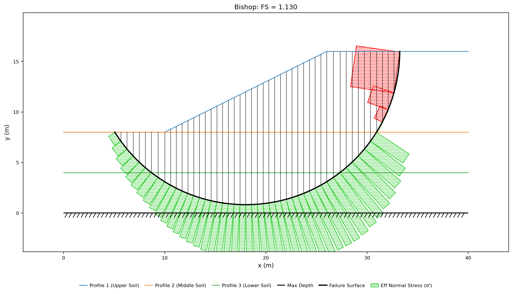{width=1000}

**FS = 1.130**, against Slide's 1.192, Low's published 1.14 and Kim's 1.17 —
the published values themselves spread 1.14 to 1.19 on this deep φ = 0
problem. The circle is centered at (18.00, 16.04), 38.09 m of surface carrying
4943.5 kN/m of soil, and the number to watch is where it stops: **tangent at
elevation 0.82**, four fifths of a metre above the rigid base it could have
reached. Of the 38.09 m of surface, 20.05 m lies in the lowest clay, and the
strength mobilized along that stretch averages 22.91 kPa.

### Flatten the profile

The search stopped short of the base because going deeper costs more than it
gains: every metre down adds driving weight, but it also buys 3.75 kPa of
strength along the part of the arc that goes there. Take that trade away and
the balance changes.

Open **Materials**, select the third row again, and change **Model (option)**
from `cp` to `mc` with a single constant strength — the average of the layer's
15 kPa top and 30 kPa bottom, which is what an engineer reaching for one number
would use:

| option | c | φ |
|---|:---:|:---:|
| mc | 22.5 | 0 |

The `c/p` and `r-elev` fields leave the form with the option that read them,
and the plot flattens to a horizontal line:

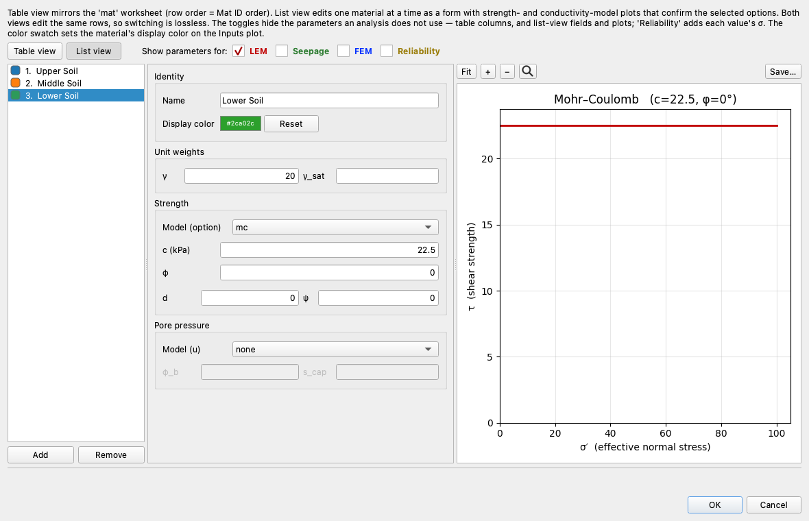

Click **OK** and run the same Bishop auto search at 50 slices:

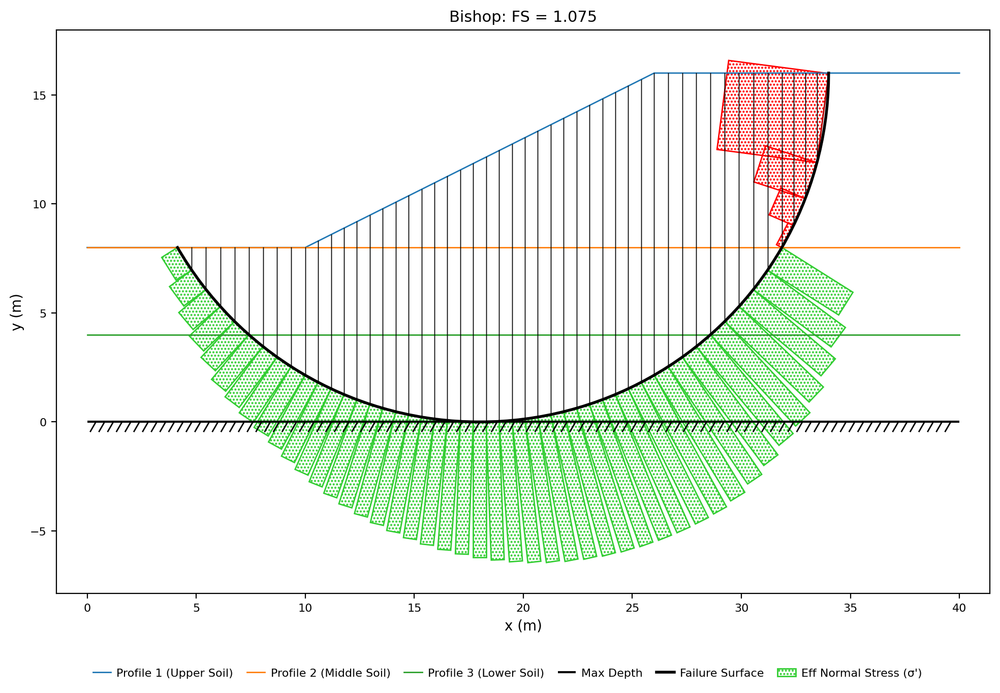{width=1000}

**FS = 1.075**, and the critical circle now sits **tangent to elevation 0** —
flat on the rigid base, the deepest surface the model allows. It is 40.63 m
long against 38.09 m, and 23.12 m of it runs through the lowest clay. Nothing
holds it up any more: with a constant strength there is no longer any reward
for staying shallow, so the search takes the largest circle the geometry
permits.

The lost 5% is not simply the constant being too low. Running the same edit at
four different constants isolates that:

| Lower-layer strength | su (kPa) | Bishop FS | Tangent elevation |
|---|:---:|:---:|:---:|
| Constant, layer top | 15.00 | 0.872 | 0.00 |
| Constant, layer average | 22.50 | 1.075 | 0.00 |
| Constant, mobilized average | 22.91 | 1.086 | 0.00 |
| Growing 15 → 30 (`cp`) | — | **1.130** | **0.82** |

The third row is the honest comparison: 22.91 kPa is the strength the `cp`
profile actually mobilized, length-weighted, along its own critical surface. Set
as a constant it still gives only 1.086, because the surface does not stay
where it was — freed from the penalty on depth, it drops to the base, lengthens
by 2.5 m, and picks up 654 kN/m more soil to drive it. **Matching the average
strength on the old surface does not reproduce the old answer, because the
strength profile was choosing the surface.** A constant taken from the top of
the layer reads 0.872 and one taken from the bottom reads 1.268 — the second
45% above the first, on one section, on the strength of a modelling choice
alone.

---

## Conclusion

This tutorial demonstrated:

- The `pow` strength option, entered as the four coefficients of
  τ = a·(σ′+d)^b + c, with Studio's list view drawing the envelope those cells
  define.
- Baker's compacted clay at **0.958** on its fitted power curve — a shallow,
  9.18 m surface carrying 98.6 kN/m — against **1.518** on the Mohr-Coulomb
  line fitted to the same triaxial data, on a deeper surface carrying
  306.7 kN/m. The linear fit is extrapolated below the stresses the tests
  covered, and there it credits the clay with cohesion the curve denies it.
- The same comparison on London clay ([VP61](../verification/rocscience.md#vp61)),
  whose data reaches low normal stress: **1.466** and **1.367**, 7% apart on
  nearly the same surface, because neither fit is extended past what was
  measured.
- The `cp` strength option — su = c + c/p·(r-elev − y) — reading
  15 kPa to 30 kPa across Low's lowest clay, and holding the critical surface
  at elevation 0.82 for **FS = 1.130**.
- What replacing that profile with a constant costs: **1.075** at the layer
  average, **1.086** even at the strength the profile actually mobilized, with
  the critical circle dropping to the rigid base in both cases. The profile was
  selecting the surface, not just scaling the resistance.

**Where to go next:** the [tutorials index](index.md) lists the series.
[LEM-4](lem04_water_in_the_slope.md) covers the other input that changes the
strength on a slice base — the pore pressure that turns total stress into
effective — and the [Limit Equilibrium Method overview](../lem/overview.md)
gives each strength option's equation, including the `hb` Hoek-Brown envelope
for rock that this page did not use.
</content>
