# Tutorial LEM-7 — Strength Options Beyond Mohr-Coulomb

Two slopes whose soil strength is not a pair of numbers. Part A is a 6 m
compacted-clay slope where the same triaxial data set is fitted twice — once as
a curved power envelope, once as the straight Mohr-Coulomb line — and the two
fits give opposite results on whether the slope stands. Part B is a layered undrained
slope whose lowest clay gets stronger the deeper the surface cuts, and where
flattening that profile to a single strength moves the failure to the bottom of
the model. The choice of strength model can change the answer as much as the
geometry can.

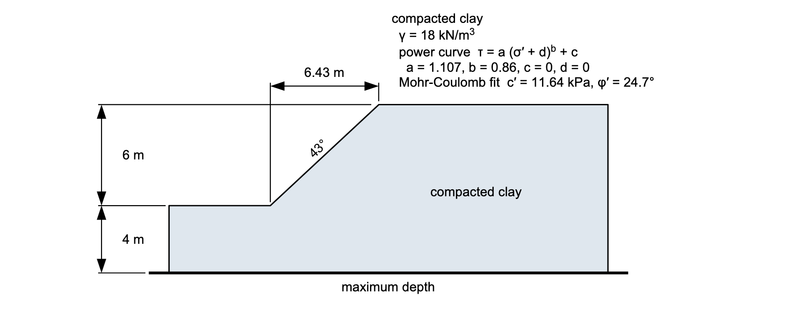{width=1000}

Analysis
Limit equilibrium

Open &amp; run
30–40 min

**Objectives** — Learn how to use strength options beyond Mohr-Coulomb: how to
enter a non-linear envelope and a strength that varies with elevation, and how
to measure what each choice does to the factor of safety and the critical
surface against its linear or constant stand-in.

power-curve envelopeMohr-Coulombstrength with depthundrained strengthstarting circlescircular search

**Completed models** — [xslope_baker_clay.xlsx](../lem/files/xslope_baker_clay.xlsx), the compacted-clay slope of [verification problem VP44](../verification/rocscience.md#vp44) with its power-curve envelope, and [xslope_low_clay.xlsx](../lem/files/xslope_low_clay.xlsx), the layered undrained slope of [verification problem VP23](../verification/rocscience.md#vp23) with its depth-varying strength

---

## Part A — A curved envelope and its straight-line fit

A straight 43° slope, H = 6 m, cut in compacted Israeli clays at
γ = 18 kN/m³, dry, with no layering: one soil, one profile line, a maximum
depth 4 m below the toe, and a single starting circle. This is example problem
1 of Baker (2003), "Inter-relations between experimental and computational
aspects of slope stability analysis" (International Journal for Numerical and
Analytical Methods in Geomechanics 27, 379–401).

The clay was tested in triaxial compression, and the results were fitted twice.
The completed file contains the first fit — a **power curve**, τ = 1.107·σ′^0.86
(Baker's A = 0.58, n = 0.86, T = 0), which curves down toward the origin and
gives the soil no strength at all at zero normal stress. The second fit, which
we enter later, is the straight Mohr-Coulomb envelope through the same test
points: c′ = 11.64 kPa, φ′ = 24.7°, which at zero normal stress still gives
11.64 kPa of cohesion.

### Opening the model

We start by downloading
[xslope_baker_clay.xlsx](../lem/files/xslope_baker_clay.xlsx) and opening it in
Studio — **File → Open**. The Inputs plot draws the section: one profile line,
the hatched maximum depth at elevation −4, and the starting circle in the
file.

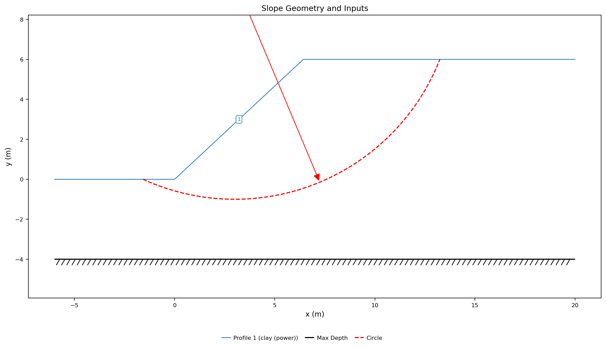{width=1000}

Open **Materials** and switch to **List view**, which puts the strength
parameters beside a plot of the envelope they define. The clay's
**Model (option)** is `pow`, and the four coefficients under it are the power
curve's. The option's full form is

$$\tau = a\,(\sigma' + d)^{\,b} + c$$

and here `pow_a` = 1.107 and `pow_b` = 0.86 with `pow_c` and `pow_d` at zero,
which reduces it to τ = 1.107·σ′^0.86:

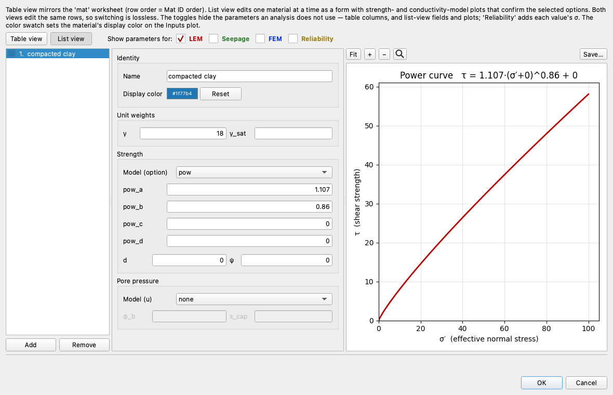

The plot's title shows the equation those cells define,
τ = 1.107·(σ′+0)^0.86 + 0, and the curve beneath it shows whether the
coefficients were entered as intended. `pow_d` shifts the normal stress before
the power is taken and `pow_c` adds a constant strength on top; both are zero
here, so the curve passes through the origin.

### Running the analysis

Now we run the search. Click **Run LEM…** and choose **Method** = `Spencer` and
**Analysis** = `Auto search`, with the slice count left at 40:

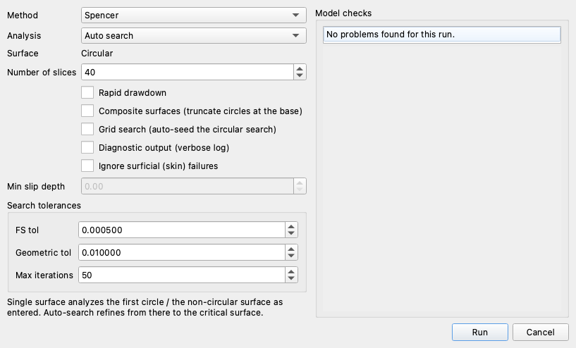

Click **Run**. The search refines the file's circle onto a surface close to
the slope face:

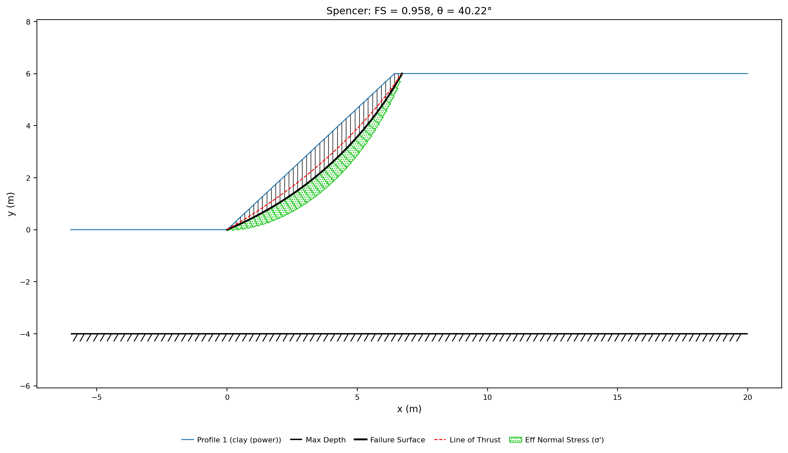{width=1000}

**FS = 0.958** — below one, on a circle centered at (−5.22, 12.61) tangent at
elevation −1.04, 9.18 m of failure surface carrying 98.6 kN/m of soil. Those
two totals print with the factor of safety when the run completes —
`Sliding mass = 98.6 kN/m over 9.18 m of failure surface` in Studio's Log
pane, or on the console for a scripted run — and the slice table a
**Reports…** export builds itemizes them slice by slice. We read the mass
figures quoted through the rest of this page the same way. Slide
reports 0.960 on this case and Baker's own solution is 0.97. The surface is
shallow, and the effective normal stress along its slice bases averages
8.3 kPa: the low-stress end of the envelope, where a curve passing through the
origin gives very little strength.

<!-- test: file=../lem/files/xslope_baker_clay.xlsx, type=circular_search, method=spencer, num_slices=40, expected_fs=0.958, tolerance=0.005 -->

### Entering the linear fit {#enter-the-linear-fit}

Next we swap in the straight-line fit. Open **Materials** again, and on the same
clay change **Model (option)** from `pow` to `mc`, then enter Baker's fitted
envelope. In the `mat` worksheet these are three adjacent cells:

| option | c | φ |
| --- | :---: | :---: |
| mc | 11.64 | 24.7 |

The power-curve coefficients do not need to be deleted — under `mc` nothing
reads them, and the answer is the same whether they are cleared or not. In the
list view they leave the form with the option that read them, replaced by the
two fields `mc` uses:

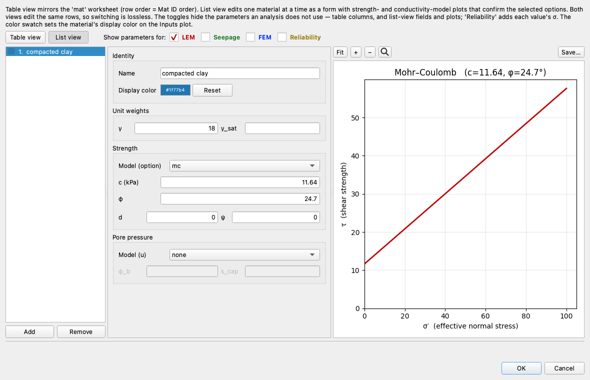

The plot is now a straight line, meeting the strength axis at c′ = 11.64 kPa.
Click **OK**, then run the same Spencer auto search again:

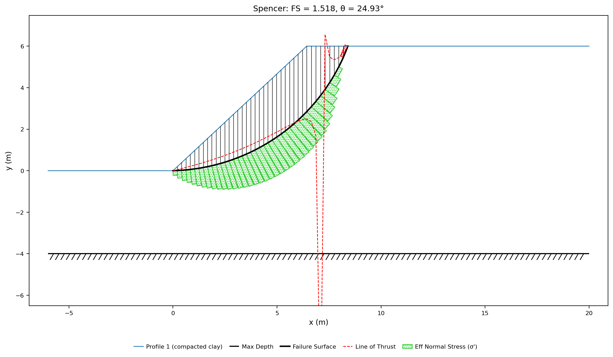{width=1000}

**FS = 1.518** — Slide reports 1.536 and Baker 1.50 — on a circle centered at
(−0.23, 9.22), tangent to elevation 0.00 and 10.96 m long, carrying
306.7 kN/m of soil. That is three times the mass of the surface the power curve
found, and it explains why the two answers differ so much: the straight
envelope's cohesion gives the shallow, low-stress surface enough strength that
the critical surface moves to a deeper one, where friction contributes more of
the strength.

Same slope, same soil, same triaxial data — 0.958 against 1.518. The two
envelopes cross at σ′ = 89.4 kPa and give the same strength there, so the fits
agree at the high stresses where the clay was tested. But 6 m of this clay generates at most
γH = 18 × 6 = 108 kPa of vertical stress, and the surfaces the search actually
chooses run far below that: 8.3 kPa on average along the power curve's, 24.2
along the Mohr-Coulomb one. At 10 kPa the curve gives 8.02 kPa of shear
strength where the line gives 16.24, and most of the line's value is the
11.64 kPa of cohesion, which it keeps unchanged down to zero stress. The
straight fit is extrapolated into a stress range no test covered, and there it
gives the clay a strength the curve does not. Baker makes this point with the
example: the extrapolated cohesion is the difference between a factor of safety
below one and one of 1.5.

### London clay, where the two fits agree

The difference on the compacted clay comes from extrapolating the straight fit beyond the
tested range, not from the curvature itself. Baker's example problem 3,
[verification problem VP61](../verification/rocscience.md#vp61), is the same
43°, 6 m slope with strength functions fitted to Perry's CD triaxial data on
London clay — a power curve τ = 3.39344·(σ′+0.152)^0.6 (Baker A = 0.535,
n = 0.60, T = 0.0015) and a fitted Mohr-Coulomb envelope c′ = 6.0 kPa,
φ′ = 32°. This data set includes measurements at very low normal stress, so
neither fit has to be extended past what was measured.

Each fit is its own model, and both are in the verification corpus:
[vp061a.xlsx](../verification/files/rocscience/vp061a.xlsx) has the power
curve and [vp061b.xlsx](../verification/files/rocscience/vp061b.xlsx) the
straight line, with the same geometry under both. Open the first and run
Spencer's search on the power curve:

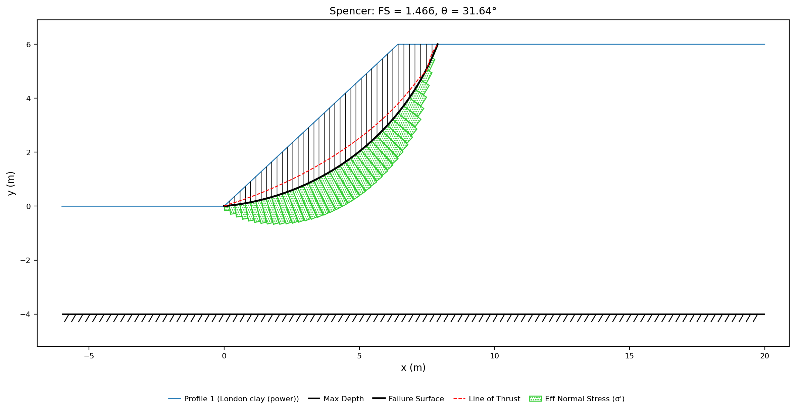{width=1000}

**FS = 1.466**, against Slide's 1.468 and Baker's 1.48. And on the second
model, the fitted Mohr-Coulomb envelope:

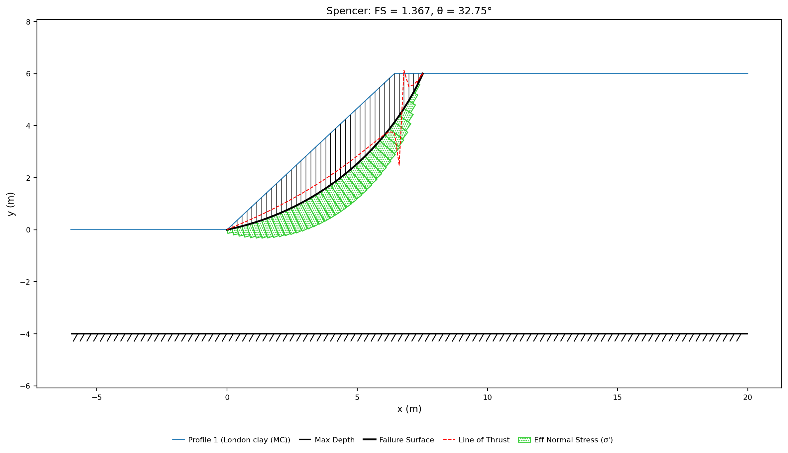{width=1000}

**FS = 1.367**, against Slide's 1.366 and Baker's 1.35. The curve gives a
factor of safety 7% above the line's here, where on the compacted clay the
line's was 58% above the curve's, and the two critical surfaces are nearly the
same shape and depth. Where the tests cover the stresses on the critical
surface, the choice between a curve and a line makes little difference; where
they do not, it can change the result substantially.

---

## Part B — Strength that grows with depth

In this problem, a 2:1 slope 8 m high stands on a bench at elevation 8 and
tops out at 16, over two soft clays that reach down to a rigid base at
elevation 0. This is
a worked example from Low (1989), "Stability analysis of embankments on soft
ground" (ASCE Journal of Geotechnical Engineering 115(2)) — a paper on
undrained clays whose strength grows with the overburden pressing on them — and
it is [verification problem VP23](../verification/rocscience.md#vp23) in the
Slide2 corpus.

The slope body itself is a stiff soil — γ = 20 kN/m³, c = 95 kPa, φ = 15° —
and the clay directly beneath it, from elevation 8 down to 4, is undrained at a
constant c = 15 kPa with φ = 0. The lowest clay, elevation 4 down to 0, is where
the depth-varying strength comes in: its undrained strength is not one number
but a line, 15 kPa at its top growing to 30 kPa at the base of the model. Real
normally consolidated clay behaves this way, because the strength it has is a
fraction of the effective overburden pressing on it, and that pressure grows
with depth.

### Opening the model

We download [xslope_low_clay.xlsx](../lem/files/xslope_low_clay.xlsx) and open
it in Studio. The Inputs plot draws the three profile lines in their materials'
colors, the rigid base at elevation 0, and the starting circle in the
file:

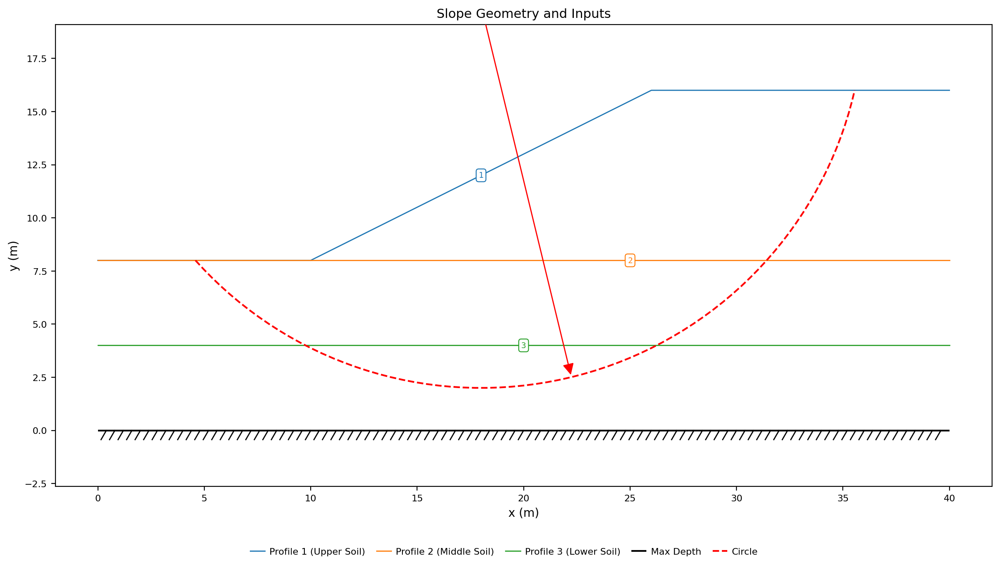{width=1000}

Open **Materials**, switch to **List view**, and select the third row. Its
**Model (option)** is `cp` — undrained strength varying linearly with
elevation — and the three fields under it define that relation:

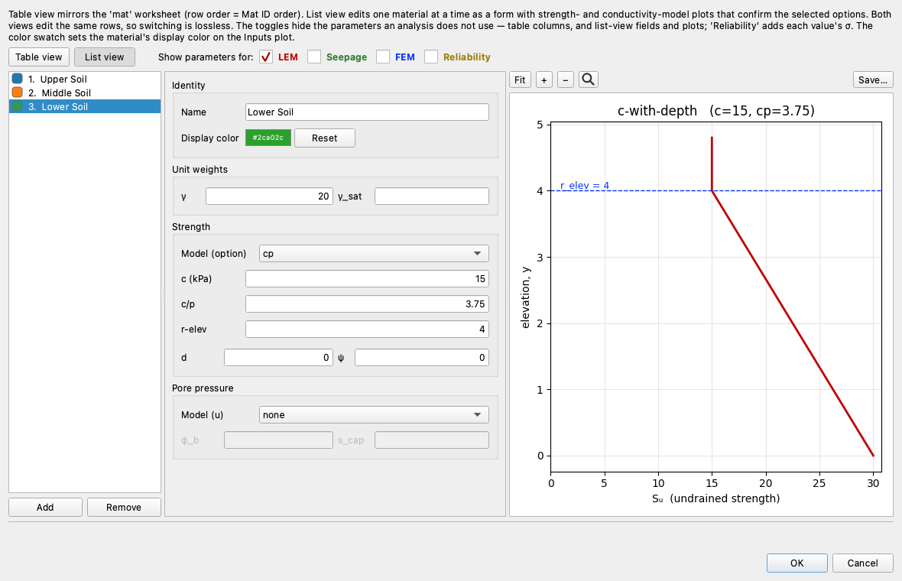

`c` = 15 is the strength at the reference elevation, `r-elev` = 4 is that
elevation, and `c/p` = 3.75 is the rate the strength gains per unit of
elevation below it:
su = c + c/p·max(0, r-elev − y), so at or above elevation 4 the
strength is simply c. The option's name is the classical **c/p ratio** — c the
undrained strength, p the effective overburden pressure — the proportionality
a normally consolidated clay holds as both grow with depth. The plot beside the fields draws it as a profile against
elevation, with the reference elevation marked, running from 15 kPa at the top
of the layer to 30 kPa at the model floor.

### Running the analysis

Now we search this section. Click **Run LEM…** and choose **Method** =
`Bishop's Simplified` and **Analysis** = `Auto search`, raising **Number of
slices** to `50`:

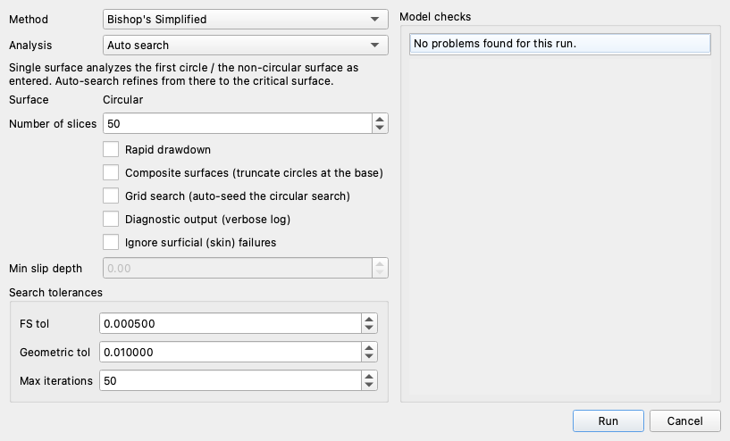

Click **Run**:

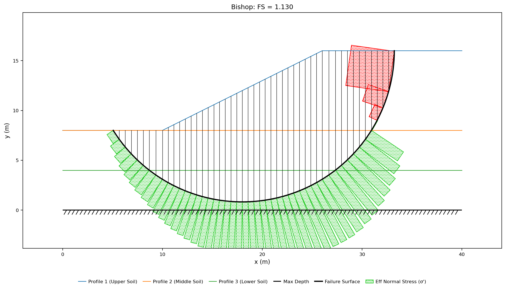{width=1000}

**FS = 1.130**, against Low's published 1.14, the 1.17 that Kim, Salgado &
Lee (2002) later found for the same section by finite-element limit analysis,
and Slide's 1.192 — the published values themselves spread 1.14 to 1.19 on
this deep φ = 0 problem, and the
[VP23 page](../verification/rocscience.md#vp23) measures where the spread
comes from. The circle is centered at (18.00, 16.04), 38.09 m of surface carrying
4943.5 kN/m of soil, and its lowest point is at **elevation 0.82**, four fifths
of a meter above the rigid base, although the search could have reached the
base. Of the 38.09 m of surface, 20.05 m lies in the lowest clay, and the
strength mobilized along that stretch averages 22.91 kPa.

<!-- test: file=../lem/files/xslope_low_clay.xlsx, type=circular_search, method=bishop, num_slices=50, expected_fs=1.130, tolerance=0.005 -->

### Replacing the profile with a constant strength {#flatten-the-profile}

The search stopped short of the base because a deeper surface has a higher
factor of safety here: every meter down adds driving weight, but it also adds
3.75 kPa of strength along the part of the arc that goes there. Next we replace
the depth-varying strength with a constant one and see how the critical surface
changes.

Open **Materials**, select the third row again, and change **Model (option)**
from `cp` to `mc` with a single constant strength — the average of the layer's
15 kPa top and 30 kPa bottom, a typical choice for a single value:

| option | c | φ |
| --- | :---: | :---: |
| mc | 22.5 | 0 |

The `c/p` and `r-elev` fields leave the form with the option that read them,
and the plot flattens to a horizontal line:

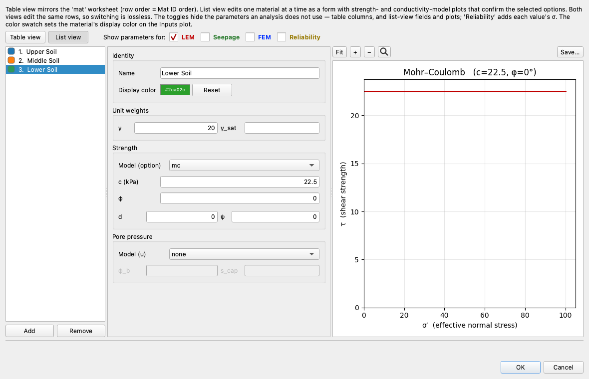

Click **OK** and run the same Bishop auto search at 50 slices:

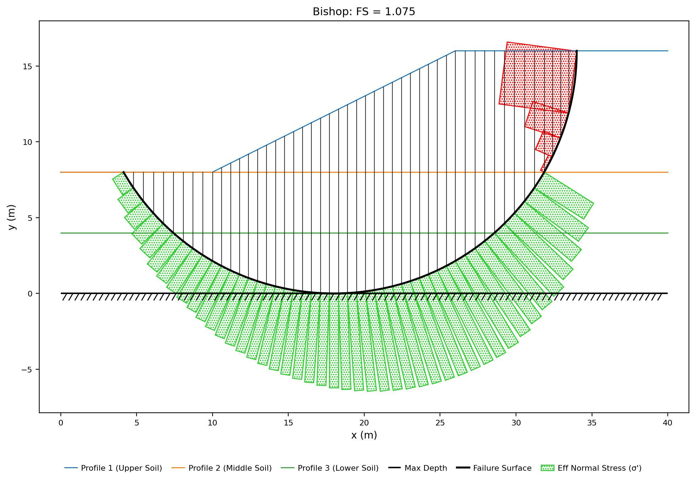{width=1000}

**FS = 1.075**, and the critical circle now sits **tangent to elevation 0** —
flat on the rigid base, the deepest surface the model allows. It is 40.63 m
long against 38.09 m, and 23.12 m of it runs through the lowest clay. With a
constant strength a shallower surface has no advantage, so the search takes the
largest circle the geometry permits.

The 5% drop is not only because the constant is too low. To separate the two
effects, we run the same edit at four different constants:

| Lower-layer strength | su (kPa) | Bishop FS | Tangent elevation |
| --- | :---: | :---: | :---: |
| Constant, layer top | 15.00 | 0.872 | 0.00 |
| Constant, layer average | 22.50 | 1.075 | 0.00 |
| Constant, mobilized average | 22.91 | 1.086 | 0.00 |
| Growing 15 → 30 (`cp`) | — | **1.130** | **0.82** |

The third row makes the fairest comparison: 22.91 kPa is the strength the `cp`
profile actually mobilized, length-weighted, along its own critical surface. Set
as a constant it still gives only 1.086, because the surface does not stay
where it was — with no gain in strength with depth, it drops to the base,
lengthens by 2.5 m, and picks up 654 kN/m more soil to drive it. Matching the
average strength on the old surface does not reproduce the old answer, because
the strength profile determined which surface was critical. A constant taken
from the top of the layer gives 0.872 and one taken from the bottom gives 1.268
— the second 45% above the first, on one section, from the modeling choice
alone.

---

## Conclusion

This tutorial covered:

- The `pow` strength option — a curved envelope from four coefficients, drawn
  live in the materials editor.
- A curved fit against a straight line through the same triaxial data: the
  linear fit extrapolates cohesion the tests never measured, and on shallow
  surfaces it can overstate the answer badly.
- The `cp` option for an undrained strength that grows with depth.
- Replacing a strength profile with a constant changes the surface the search
  selects, not just the number it reports.

**Where to go next:** the [tutorials index](index.md) lists the series.
In [LEM-4](lem04_water_in_the_slope.md) we cover the other input that changes
the strength on a slice base — the pore pressure that turns total stress into
effective — and the [Limit Equilibrium Method overview](../lem/overview.md)
gives each strength option's equation.
In [LEM-13](lem13_rock_slope.md) we take the third nonlinear option, the `hb`
Hoek-Brown envelope for rock, through both engines.
