# Tutorial LEM-8 — A Reinforced Slope (Geogrids)

A 24 ft embankment of clean sand — c = 0, φ = 37° — standing at 1.25:1 under a
240 psf surcharge. Sand alone cannot stand that steep at those numbers; six
layers of geogrid do, each 20 ft long, 4 ft apart vertically, developing 800
lb/ft of tension. The face is wrapped in a 2 ft band of cohesive fill, and the
base of the problem is 10 ft below the bottom of the slope — not pictured in
the drawing. The
problem and the drawing below are Example 5 from the UTEXASED user manual,
S. G. Wright's educational version of UTEXAS.

{width=700}

<div class="tut-glance" markdown>
<div class="tgt-row">
<div class="tgt-tile"><span class="tg-label">Analysis</span><p>Limit equilibrium</p></div>
<div class="tgt-tile"><span class="tg-label">Assistant</span><p>~5 min</p></div>
<div class="tgt-tile"><span class="tg-label">By hand</span><p>15–20 min</p></div>
</div>
<div class="tgm-obj" markdown>
**Objectives** — Enter soil reinforcement as lines carrying a tensile capacity,
with the pullout length that develops it and the support type that sets how its
force acts; search the reinforced section for its critical circle; and read the
result against the same slope with the lines taken out, against the force each
crossing actually mobilizes, and against the one layer the critical surface
never touches.
</div>
<p><span class="tg-pill">two materials</span><span class="tg-pill">distributed load</span><span class="tg-pill">reinforcement lines</span><span class="tg-pill">capacity envelope</span><span class="tg-pill">pullout length</span><span class="tg-pill">support types</span><span class="tg-pill">circular search</span></p>
<div class="tgm-model" markdown>**Completed model** — [xslope_reinforce.xlsx](../lem/files/xslope_reinforce.xlsx) — the same file used by [LEM Sample Problem 9](../lem/samples.md#9-reinforced-slope)</div>
</div>

---

## The problem

**Materials** — two Mohr-Coulomb (`mc`) soils at the same unit weight, told
apart by their cohesion:

Unit weights are pcf and cohesions psf; the row order is the Mat ID the profile
lines reference, and the columns neither soil uses stay blank:

| name | g | gsat | option | c | f | c/p | r-elev | d | psi | t_cut | E | nu | u |
|---|:---:|:---:|---|:---:|:---:|:---:|:---:|:---:|:---:|:---:|:---:|:---:|---|
| `shell` | 130 |  | `mc` | 300 | 37 |  |  |  |  |  |  |  | `none` |
| `base` | 130 |  | `mc` | 0 | 37 |  |  |  |  |  |  |  | `none` |

The reinforced fill is material 2 — clean sand, no cohesion at all. Material 1
is the 2 ft band of cohesive fill along the face, and its 300 psf is there to
keep the search off the face itself: a c = 0 sand at 1.25:1 has an unlimited
supply of shallow surfaces skimming the surface, and every one of them would be
more critical than the mechanism the reinforcement is designed for.

**Geometry** — a profile line is the *top* of a material layer, so the face band
and the fill beneath it take one line each, listed top down, one vertex per row
in the paired `x` / `y` columns:

**Profile Line 1 — material 1 (`shell`):**

| x (ft) | y (ft) |
|:---:|:---:|
| 0 | 0 |
| 30 | 24 |
| 32 | 24 |

**Profile Line 2 — material 2 (`base`):**

| x (ft) | y (ft) |
|:---:|:---:|
| -30 | 0 |
| 2 | 0 |
| 32 | 24 |
| 100 | 24 |

Line 1 is the toe, the top of the 1.25:1 face and 2 ft of crest behind it. Line
2 runs 30 ft out in front of the toe at elevation 0, then climbs the face 2 ft
behind line 1 and carries the crest back to x = 100. The band between the two
is the face wrap. Maximum depth = `-10`, the elevation of the bottom of the
model.

**Surcharge** — 240 psf over the crest, from the crest break to the right-hand
edge:

| X | Y | N |
|:---:|:---:|:---:|
| 30 | 24 | 240 |
| 100 | 24 | 240 |

The direction is left blank, which means the load acts normal to the ground
surface; on a level crest that is straight down.

**Reinforcement** — six lines. A reinforcement line is a straight segment
between two endpoints carrying a tensile capacity: wherever a trial failure
surface crosses one, that tension is applied to the sliding mass at the
crossing point. Each line here starts on the face and runs 20 ft back into the
fill, the lowest at the toe:

| Label | x1 | y1 | x2 | y2 |
|---|:---:|:---:|:---:|:---:|
| Line 1 | 0 | 0 | 20 | 0 |
| Line 2 | 5 | 4 | 25 | 4 |
| Line 3 | 10 | 8 | 30 | 8 |
| Line 4 | 15 | 12 | 35 | 12 |
| Line 5 | 20 | 16 | 40 | 16 |
| Line 6 | 25 | 20 | 45 | 20 |

**Type** comes next in the sheet, and it is `Geosynthetic` on every line — a
preset over two settings:

| Type | Dir | Appl |
|---|---|---|
| Geosynthetic | Tangent | Active |
| Nail | Axial | Passive |
| Tieback | Axial | Active |
| Anchor | Axial | Active |

**Dir** is the direction the force acts in at the crossing. *Tangent*, which
`Geosynthetic` sets, is flexible reinforcement: a geogrid cannot resist bending,
so as the mass moves the sheet deforms with it and pulls along the slip surface
whatever its own inclination. *Axial* is a nail or a tieback, stiff enough to
hold its own line. **Appl** is whether the force is divided by the factor of
safety: *Active* is an allowable working load applied against the driving side,
*Passive* an ultimate capacity that mobilizes with the soil.
[Soil Reinforcement in LEM](../lem/reinforcement.md) derives both. A line left
with no Type at all is a generic tensile line, and behaves as *Tangent* and
*Active* — the same physics, without saying what the reinforcement is.

**Dir and Appl are not typed.** Both are formula columns that read Type and fill
themselves from the table above, which is why the values below start again at
**Tmax** rather than running on from the endpoints: the paste goes in as two
blocks, one either side of the three columns the preset owns.

**How much force is available depends on where the surface crosses.** A geogrid
does not carry its full capacity at its free end — the tension is developed by
friction against the soil, over some length of embedment. That is what the second
block says, the same six values on every line:

| Tmax | Lp1 | Lp2 | Tend1 | Tend2 | Spacing |
|:---:|:---:|:---:|:---:|:---:|:---:|
| 800 | 4 | 4 | 0 | 0 | 1 |
| 800 | 4 | 4 | 0 | 0 | 1 |
| 800 | 4 | 4 | 0 | 0 | 1 |
| 800 | 4 | 4 | 0 | 0 | 1 |
| 800 | 4 | 4 | 0 | 0 | 1 |
| 800 | 4 | 4 | 0 | 0 | 1 |

**Tmax** is the rupture capacity, 800 lb/ft. **Lp1** and **Lp2** are the pullout
lengths at each end: the tension available rises from zero at an end to the full
Tmax 4 ft in, so a crossing within 4 ft of either end mobilizes only its share.
**Tend1** and **Tend2** are end anchorage — a bearing plate, a facing
connection — and 0 is the friction-only case these geogrids are. **Spacing** is
for discrete supports installed at a spacing out of the page; geogrid properties
are already per foot of slope, so it stays at 1. Together the five make the
line's *capacity envelope*, whose breakpoints are drawn on every plot as tension
points.

**Starting circles** — two, sharing a center above the face at twice the slope
height:

| Xo | Yo | Option | Depth |
|:---:|:---:|---|:---:|
| 0 | 40 | Depth | 0 |
| 15 | 40 | Depth | -10 |

The first is tangent to the toe elevation, the second to the bottom of the
model. **Depth is an elevation**, not a thickness.

The tables are the model, and each is laid out exactly as its destination is —
the template's worksheets and Studio's editors, same columns in the same order.
Select a table's block of values, copy, and paste it straight into the sheet or
editor rather than retyping it.

---

## Choose how you want to build it

Three ways to get this model into XSLOPE. They produce the same model — pick one
and skip the other two.

1. **[Build it with the AI assistant](#a-building-it-with-the-ai-assistant)** —
   describe the fill and the six layers in a sentence, and audit what it
   entered.
2. **[Build the Excel input file](#b-building-the-excel-file)** — five
   worksheets, one of them the `reinforce` sheet.
3. **[Build it in Studio](#c-building-it-in-studio)** — the reinforcement
   editor, with the lines redrawing beside them.

Whichever you choose, rejoin at [Running the analysis](#running-the-analysis).

---

## A — Building it with the AI assistant {#a-building-it-with-the-ai-assistant}

The drawing at the top of this page carries the geometry, both strengths, the
surcharge and the reinforcement layout. Paste it into the chat box and type
`Build this model`, or describe it:

<div class="prompt-block" markdown>
```text
Build a model for a 24 ft embankment with a 1.25:1 face, toe at (0, 0) and crest break at (30, 24). The fill is 130 pcf sand with c = 0, phi = 37; a 2 ft wide band along the face is the same 130 pcf with c = 300 psf, phi = 37. The crest runs back to x = 100 and the ground continues 30 ft in front of the toe; the bottom of the model is elevation -10. Put a 240 psf surcharge on the crest from x = 30 to x = 100. Add six horizontal geogrid layers of support type Geosynthetic at elevations 0, 4, 8, 12, 16 and 20, each starting on the slope face and 20 ft long, with a tensile capacity of 800 lb/ft and a pullout length of 4 ft at each end. Add starting circles for a critical-surface search.
```
</div>

### Check its work

- **Six reinforcement lines, all 20 ft long.** Each starts *on the face*, so its
  first x is 1.25 times its elevation: 0, 5, 10, 15, 20, 25. A layer that starts
  at the same x on every row is a stack of lines hanging in space at the bottom
  and buried at the top.
- **Type is `Geosynthetic` on all six lines.** It is the column that says what
  the reinforcement *is*, and it fills `Dir` with tangent and `Appl` with
  active. If it came back empty, say: *"Set the support type to Geosynthetic on
  every reinforcement line."*
- **Both ends have a pullout length.** `Lp1` and `Lp2` = 4 on every line. A
  blank or 0 means *fully anchored* — the whole 800 lb/ft available right at the
  free end on the face, which is the opposite of what a geogrid does. If they
  came back empty, say: *"Set the pullout length to 4 ft at both ends of every
  reinforcement line."*
- **Tmax is per foot of slope**, 800 lb/ft, with the spacing left at 1. Geogrid
  capacities are quoted that way already.
- **c = 0 in the fill.** The reinforcement exists because the sand has no
  cohesion; a fill that came back with cohesion in it is a slope that would
  stand without any of this.
- **The face band is a separate material**, 2 ft wide, on its own profile line —
  not a property of the fill and not the ground surface.
- **The surcharge sits on the crest only**, starting at the crest break, and its
  direction is left blank.

Continue at [Running the analysis](#running-the-analysis).

---

## B — Building the Excel file {#b-building-the-excel-file}

Start from [input_template.xlsx](../inputs/input_template.xlsx) and save a copy
under a name of your own. Confirm `main!D8` **Units** is `Imperial` and leave
the rest of that sheet alone.

### 1. The `mat` worksheet

One row per material, and the row number is the ID. Enter (or copy-paste) the
material properties from the table above, as shown below:

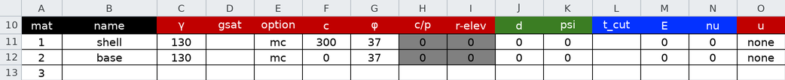

### 2. The `profile` worksheet

One block per profile line, with its **Mat ID** above the coordinates. Enter (or
copy-paste) the vertices from the geometry tables above, and set `profile!B2`
**Max Depth** to `-10`:

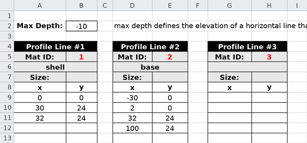

**Max Depth** is an elevation — `-10` is the bottom of the model, not a
thickness below the toe.

### 3. The `dloads` worksheet

Enter (or copy-paste) the two surcharge points from the table above:

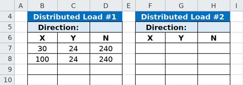

`dloads!B5` **Direction** stays blank, which applies the load normal to the
ground surface.

### 4. The `reinforce` worksheet

One row per line, the row number is the line number, and the row is entered in
two blocks. Enter (or copy-paste) the endpoints into the `Label` through `y2`
columns and the capacity values into `Tmax` through `Spacing`:

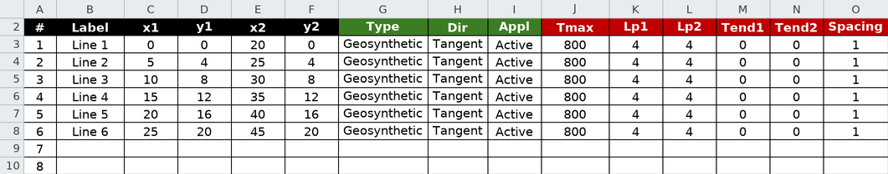

Pick `Geosynthetic` from the **Type** drop-down, and **leave Dir and Appl
alone**: both hold a formula that reads Type and answers on its own. Typing into
either replaces the formula, which is how a preset gets overridden deliberately;
pasting blanks across them erases it for nothing.

The header colors say which engine reads a column: green for the LEM alone, red
for both, blue for the FEM alone — `Tres`, `E` and `Area` model the lines as
truss elements in a finite element run and are ignored here.

### 5. The `circles` worksheet

Enter (or copy-paste) the two starting circles from the table above:


Save the file and continue at [Running the analysis](#running-the-analysis).

---

## C — Building it in Studio {#c-building-it-in-studio}

### 1. Materials

Click **Materials** in the **Inputs** tree, press **Add row** twice, and enter
(or copy-paste) the two materials from the table above — both at γ = 130 and
φ = 37, told apart by c = 300 and 0:

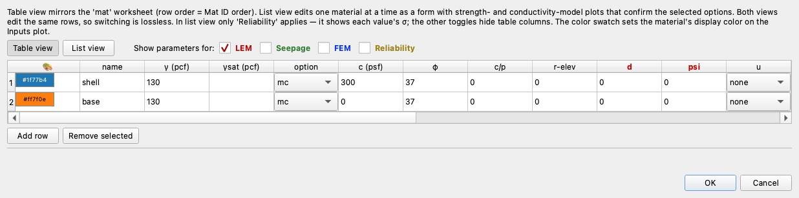{width=1000}

### 2. Profile lines

Click **Profile lines**. Two lines, top down — the face band's three vertices,
then the base's four — each on its material, with **Max depth (bottom boundary
elevation):** set to `-10`. With the face band selected, the preview draws it as
the narrow wedge along the face, line 2 running out in front of the toe and back
along the crest behind it:

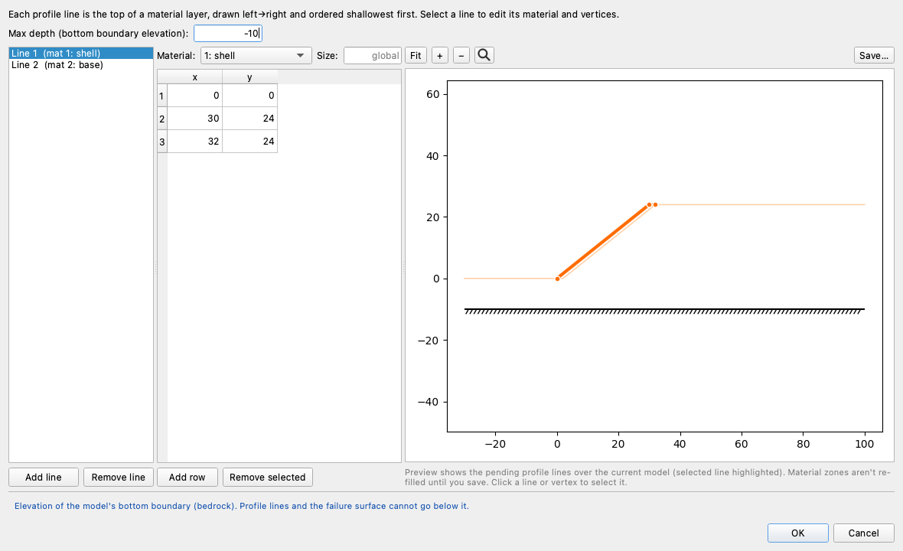

### 3. The surcharge

Click **Distributed loads** and enter the two points from the table above,
leaving **Direction:** at `Normal (perpendicular to the line)` — on the level
crest that is straight down. The preview draws the arrows standing on the crest
from the crest break to the right-hand edge:

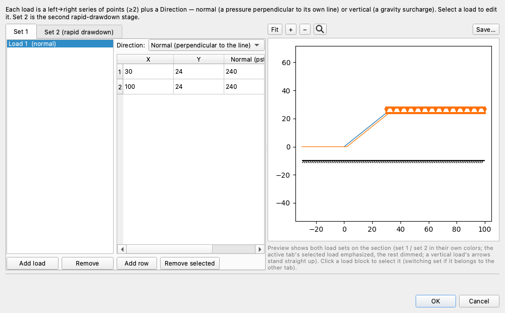

### 4. Reinforcement lines

Open **Reinforcement lines** in the **Inputs** tree and press **Table view** —
the columns are the worksheet's, in the same order, so the two blocks from the
tables above paste straight in. Paste the endpoint block (`Label` through `y2`)
into the first cell — the rows come with it — then set each row's **Type** to
`geosynthetic`, which fills **Dir** and **Appl** on its own, and paste the
capacity block into the first `Tmax` cell:

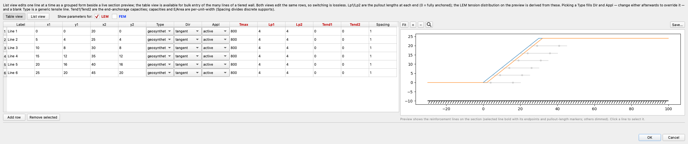

Press **List view** to read what was entered one line at a time, as a form in
five groups — Identity, Geometry, Capacity, Anchorage, Type — beside a preview
that draws the lines on the section:

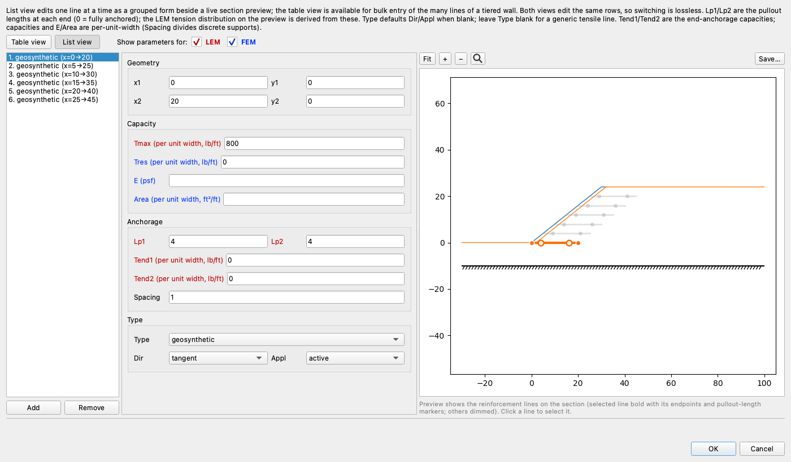{width=1000}

The capacity fields carry their units — `Tmax (per unit width, lb/ft)` — so a
per-element capacity entered without a spacing is visible as the wrong
quantity. The preview draws the selected line bold with a marker at each end
and at its pullout breakpoints: the shape of its capacity envelope, in place on
the slope. Click a line in the preview to select it, and click **OK** when the
six lines read as the tables above.

### 5. Starting circles

Click **Circles** and enter the two circles from the table above, or paste the
block into the first cell — its four columns are the editor's first four, and
the rows come with it. **Depth is an elevation**: 0 is the toe, -10 the bottom
of the model. The `R` column answers on its own, and the preview draws both arcs
on the section:

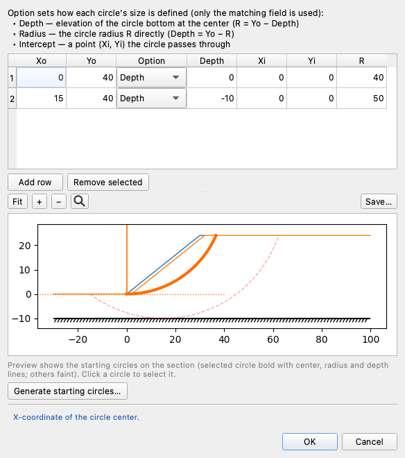

Continue below.

## Running the analysis

However you built it, you now hold the same model:

{width=1000}

The six grey lines step up the face, each with a red tension point 4 ft in from
either end — the points where its envelope reaches the full 800 lb/ft. The
purple arrows are the crest surcharge, and the two dashed red arcs are the
starting circles.

Click **Run LEM…** and choose **Method** = `Spencer` and **Analysis** =
`Auto search`, with the slice count left at 40:

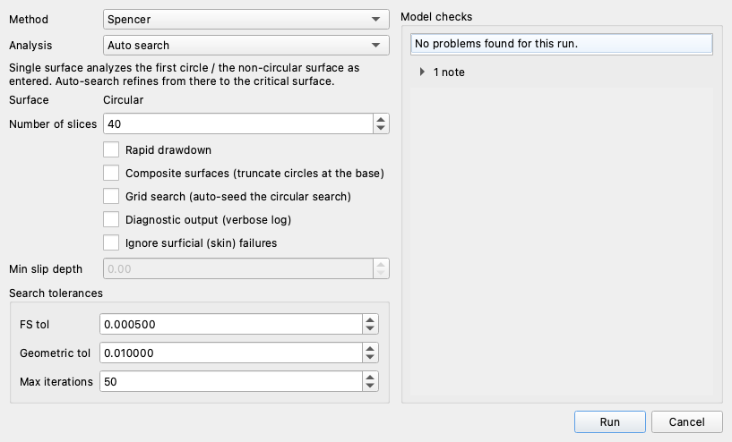

**Surface** reads `Circular` as a fixed label — the model defines circles and no
non-circular surface. The model checks beside the controls report one warning on
this file: the six lines carry a tensile capacity but no axial stiffness, which
is complete for a limit-equilibrium run and incomplete for a finite element one.

---

## Exploring the results

### What the search finds

When the search completes, the search-results plot shows the circles it tried
in grey and the critical circle in red:

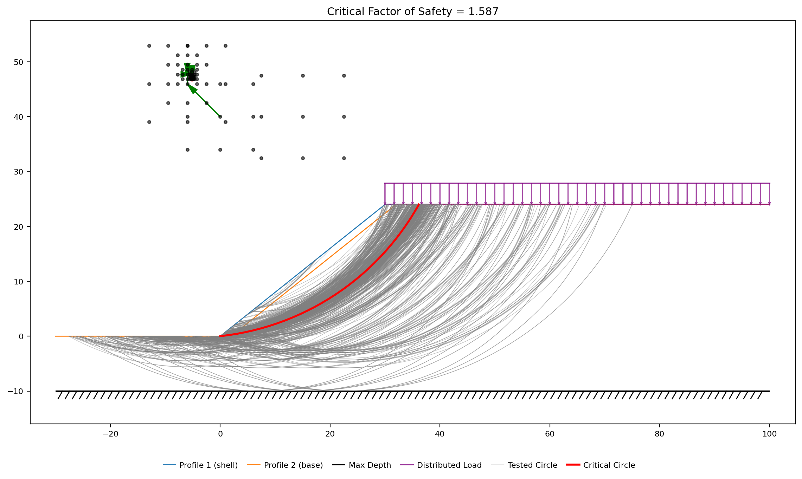{width=1000}

**FS = 1.587**, on a circle centered at (−5.13, 46.98) with a radius of 47.26.
The solution plot draws that circle with the base stresses, the reinforcement
lines it crosses (grey bars, tension points in red), and the line of thrust:

{width=1000}

The surface daylights at the toe, cuts up through the reinforced block and
comes out on the crest at x ≈ 36, behind the last geogrid. It weighs 29,706
lb/ft, and the reinforcement it crosses contributes 4,000 lb/ft of tension —
five lines at the full 800.

### What the other methods say

Each method gets its own search and its own critical circle:

| OMS | Bishop | Janbu | Corps | Lowe | Spencer | M-P |
|:---:|:---:|:---:|:---:|:---:|:---:|:---:|
| 1.480 | 1.594 | 1.524 | 1.381 | 1.598 | 1.587 | 1.587 |

Spencer and Morgenstern-Price agree to four figures on the same circle and are
the ones to report. The spread below them is the usual one for a frictional
slope: OMS neglects the interslice forces and comes out 7% low, and the Corps of
Engineers procedure settles on a far deeper circle of its own, bottoming out at
elevation −9.7, just above the base of the model.

### What the reinforcement is worth

Take the six lines out and search the same section again — same soils, same
surcharge, same starting circles, a separate search with its own critical
circle:

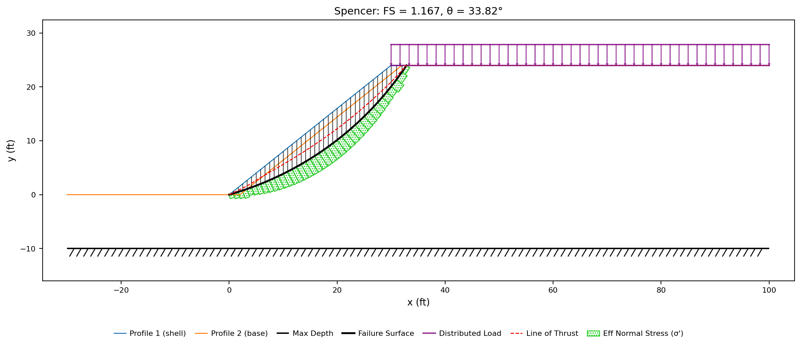{width=1000}

**FS = 1.167** against 1.587: the six layers raise the factor of safety by 36%.
The mechanism changes with them. Without the lines the critical surface is a thin
sliver behind the face, 17,376 lb/ft of soil; with them, the cheapest mechanism
left is the deeper, heavier one above, which has to cut the whole reinforced
block.

Solved on the reinforced model's own critical circle instead — one surface, no
search — the unreinforced section returns 1.247. The gap between that and the
searched 1.167 is the part of the loss that comes from the slope having a worse
mechanism available, not from the missing tension.

### Where the surface meets the lines

The critical circle crosses five of the six layers, and the capacity envelope
decides what each one gives:

| Line | Crossing x | To the nearer end (ft) | T (lb/ft) |
|:---:|:---:|:---:|:---:|
| 2 | 14.52 | 9.52 | 800 |
| 3 | 21.59 | 8.41 | 800 |
| 4 | 26.65 | 8.35 | 800 |
| 5 | 30.56 | 9.44 | 800 |
| 6 | 33.67 | 8.67 | 800 |

Every crossing lands more than 8 ft from the nearer end of its line, twice the
4 ft it takes to develop the full capacity, so pullout limits nothing here and
all five deliver 800 lb/ft.

To see the pullout lengths at work, solve this same circle as a **Single
surface** run — no search, so changing `Lp1` and `Lp2` is the only thing that
moves — at two other values. At `Lp1` = `Lp2` = 0, fully anchored, the answer
stays **1.587**: anchorage had nothing to add. At 10 ft, a longer development
length than this fill would give, the five crossings fall inside their
development zones, mobilize 3,553 lb/ft between them rather than 4,000, and
the factor of safety drops to **1.539**.

Line 1 gives nothing at all. It runs from the toe at elevation 0, and the
surface daylights at the toe and climbs away from it, so the whole line lies in
the soil below the sliding mass. A layer the critical surface never crosses is
not in the analysis — which is what makes the plotted lines worth reading
against the plotted surface rather than counting the rows in the sheet.

### How long the lines have to be

Re-cut all six layers to a different length and search again — the face end of
each line held, the back end moved, so length is the only thing changing. Every
length gets its own search and its own critical circle:

| Line length (ft) | FS | Tension mobilized (lb/ft) | Lines crossed |
|:---:|:---:|:---:|:---:|
| 10 | 1.270 | 532 | 2 of 6 |
| 15 | 1.426 | 1,466 | 4 of 6 |
| 20 | 1.587 | 4,000 | 5 of 6 |
| 25 | 1.587 | 4,000 | 5 of 6 |
| 30 | 1.587 | 4,000 | 5 of 6 |
| 40 | 1.587 | 4,000 | 5 of 6 |

Beyond 20 ft the answer stops moving, and the four searches that produced it say
why: each settles on the same circle — center (−5.13, 46.98), the same five
crossings at the same x — and every one of those crossings already lies at least
8.4 ft from the nearer end of its line, twice the 4 ft it takes to develop Tmax.
All five deliver the full 800 lb/ft before anything is lengthened. Adding length
moves the back end further from crossings the back end never governed. What caps
the reinforcement on this section is rupture capacity, and length cannot buy more
of it.

Short lines fail the other way. At 10 ft the critical surface passes *behind* the
back ends of most of the layers:

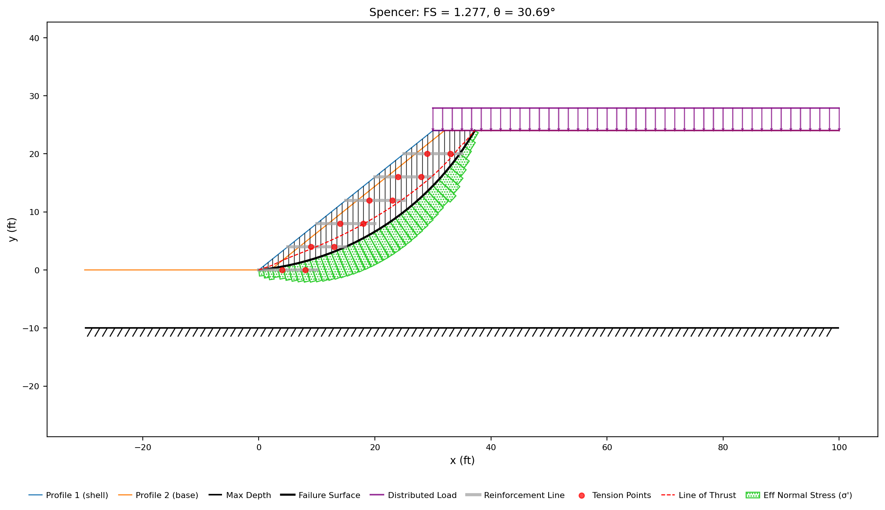{width=1000}

The grey bars stop well short of the surface in the middle of the face: only two
of the six lines are crossed at all, and both crossings are caught within 1.7 ft
of a tip, inside the pullout ramp, where they mobilize 193 and 340 lb/ft instead
of 800. At 1.270 that section is barely better than the 1.167 of no reinforcement at
all. Between the two regimes — 15 ft, four crossings, 1,466 lb/ft — length is
buying reach and anchorage together, and it is the only part of the range where
lengthening a geogrid changes the answer.

### What Dir and Appl change

Both settings are per line, and both move this answer. Switch all six lines to
`Axial` — the direction a nail or a tieback would use — and the search returns
**1.606**: the horizontal geogrids now pull along their own axis rather than
along the slip surface, which delivers less force down the slice bases but
presses the mass onto them, and on a φ = 37° sand that trade is worth a little
more than it costs. Switch instead to `Passive`, so the same 800 lb/ft is
treated as an ultimate capacity divided by the factor of safety, and the search
returns **1.453**. Neither is a correction to the other; they are two published
conventions, which is why the type presets set them together and the reference
page states which support wants which.

---

## Conclusion

This tutorial demonstrated:

- Soil reinforcement entered as lines: two endpoints and a tensile capacity per
  line, with the force applied to the sliding mass wherever a trial surface
  crosses one — six geogrid layers holding up a c = 0 sand fill at 1.25:1.
- The capacity envelope as the thing that decides how much of Tmax is available:
  the pullout lengths that taper the tension toward each free end, the end
  anchorage that starts it above zero, and the spacing that turns a per-element
  capacity into force per foot of slope.
- The **Type** presets — Geosynthetic, Nail, Tieback, Anchor — as one column
  filling **Dir** (tangent to the slip surface, or along the line's own axis)
  and **Appl** (a working load, or an ultimate capacity divided by F): these six
  lines are Geosynthetic, worth **1.587** against 1.606 axial and 1.453
  passive.
- A search settling at **FS = 1.587** with 4,000 lb/ft of tension on it, against
  **1.167** for the same section searched with the lines removed — and a
  different mechanism at that number, a face sliver rather than a surface
  through the block.
- Reading the lines against the surface that was found: five crossings well
  clear of their development zones and unaffected by pullout, one layer at the
  toe the surface never reaches, and 1.539 on the same circle once the pullout
  lengths are long enough to bite.
- A length study, searched at each length: **1.270** at 10 ft, **1.426** at 15 ft
  and **1.587** from 20 ft on, flat to 40 — because past 20 ft every crossing is
  already outside its pullout ramp and carrying the full 800 lb/ft, so the limit
  is rupture capacity rather than embedment.

**Where to go next:** [LEM-9](lem09_tieback_wall.md) is the other reinforced
problem — a tieback wall, where the support is discrete and stiff rather than
continuous and flexible, and the Type preset that describes it changes both **Dir**
and **Appl**. The [tutorials index](index.md) lists the series, and the sample
problems carry each page further.
[Sample Problem 9](../lem/samples.md#9-reinforced-slope) catalogues this model
alongside the published solution it comes from,
[Soil Reinforcement in LEM](../lem/reinforcement.md) derives the capacity
envelope and the per-method equations the force enters, and
[Piles and Concrete Piers](../lem/piles.md) is the other support family — where
shear and bending govern rather than tension.
