# Tutorial LEM-9 — A Tieback Wall

A 30 ft vertical cut held open by a soldier-pile wall, with the ground behind it
rising another 50 ft to a plateau. Two rows of grouted tiebacks, declined 25° into
the slope, hold the face — the manual's 120,344.9 and 164,217.3 lb bars on 8 ft
centers, 15,043 and 20,527 lb per foot of wall. The soldier pile at the face carries their
heads and 5,900 lb/ft of shear across any surface that cuts it. The problem comes from the Caltrans SNAILZ
reference manual, by way of the Rocscience Slide2 verification corpus — it is
[verification problem VP49](../verification/rocscience.md#vp49), and this page
reproduces that row's locked values.

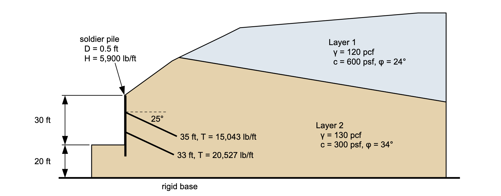{width=1000}

<div class="tut-glance" markdown>
<div class="tgt-row">
<div class="tgt-tile"><span class="tg-label">Analysis</span><p>Limit equilibrium</p></div>
<div class="tgt-tile"><span class="tg-label">Assistant</span><p>~5 min</p></div>
<div class="tgt-tile"><span class="tg-label">By hand</span><p>15–20 min</p></div>
</div>
<div class="tgm-obj" markdown>
**Objectives** — Learn how to model a tieback wall: how to enter grouted anchors
with the Anchor preset and per-foot-of-wall capacities, how to search for the
critical wedge and solve a specified one, and how to read what the anchors are
worth and the two ways their force can be applied.
</div>
<p><span class="tg-pill">two materials</span><span class="tg-pill">reinforcement lines</span><span class="tg-pill">support types</span><span class="tg-pill">anchors</span><span class="tg-pill">piles</span><span class="tg-pill">non-circular search</span><span class="tg-pill">active vs passive</span></p>
<div class="tgm-model" markdown>**Completed model** — [vp049.xlsx](../verification/files/rocscience/vp049.xlsx) — the same file used by [verification problem VP49](../verification/rocscience.md#vp49)</div>
</div>

---

## The problem

A tieback is a steel bar or strand grouted into a hole drilled back through the
failing mass into ground that is not moving, stressed against a plate on the wall
face. The machinery that puts it into an analysis is the machinery
[LEM-8](lem08_reinforced_slope.md) builds — a line with two endpoints and a
tensile capacity, applied to the sliding mass wherever a trial surface crosses
it — and three things about it are different from a geogrid:

- **It is stiff, and it holds its own line.** A grouted bar does not deform onto
  the slip surface the way a sheet of geogrid does, so its force acts along the
  bar's own axis, 25° below horizontal here, rather than tangent to the surface.
- **Its ends are not alike.** At the wall the bar bears on a plate, so the full
  capacity is there at the face. At the far end the load is transferred to the
  ground through the grout bond, over a length that grows with the capacity being
  developed.
- **It is a discrete element at a spacing**, one anchor every 8 ft along the wall,
  where a geogrid is continuous. Its capacity has to reach the analysis as a force
  per foot of wall.

**Materials** — two Mohr-Coulomb (`mc`) soils: the upper one more cohesive, the
lower one more frictional and heavier.

Unit weights are pcf, cohesions psf and φ degrees; the row order is the Mat ID,
and neither soil carries pore pressures — `u` stays `none` — so the table ends
at φ:

| name | γ | γsat | option | c | φ |
| --- | :---: | :---: | --- | :---: | :---: |
| `Layer 1` | 120 | 120 | `mc` | 600 | 24 |
| `Layer 2` | 130 | 130 | `mc` | 300 | 34 |

**Geometry** — a profile line is the *top* of a material layer. Layer 1 is the
upper wedge of ground, so its line is the ground surface behind the wall; Layer 2
runs beneath it and carries the wall face itself, a vertical run from (0, 0) to
(0, 30).

**Profile Line 1 — material 1 (Layer 1):**

| x (ft) | y (ft) |
| :---: | :---: |
| 33 | 53 |
| 60 | 66 |
| 70 | 71 |
| 178 | 80 |
| 195 | 80 |

**Profile Line 2 — material 2 (Layer 2):**

| x (ft) | y (ft) |
| :---: | :---: |
| -20 | 0 |
| 0 | 0 |
| 0 | 30 |
| 29 | 51 |
| 33 | 53 |
| 195 | 26 |

Line 2 begins 20 ft out in front of the wall, climbs the 30 ft face as two points
at the same x, continues up the cut slope to (33, 53), and then dives to elevation
26 at the right-hand edge — the contact between the two layers. Maximum depth =
`-20`, the elevation of the bottom of the model.

**Tiebacks** — two lines, each entered by its two endpoints. The upper anchor
starts at elevation 20 on the face and runs 35 ft back; the lower one starts at
elevation 8 and runs 33 ft. Both are declined 25°:

| Label | x1 | y1 | x2 | y2 |
| --- | :---: | :---: | :---: | :---: |
| tieback y=20 | 0 | 20 | 31.7208 | 5.20836 |
| tieback y=8 | 0 | 8 | 29.9082 | -5.9464 |

**Type** comes next in the sheet, and it is `Anchor` on both lines — a preset
over two settings:

| Type | Dir | Appl |
| --- | --- | --- |
| Geosynthetic | Tangent | Active |
| Nail | Axial | Passive |
| Tieback | Axial | Active |
| Anchor | Axial | Active |

Picking `Anchor` fills **Dir** with `Axial` — the force acts along the bar, not
along the slip surface — and **Appl** with `Active`, meaning the capacity is an
allowable working load applied as it stands rather than an ultimate capacity
divided by the factor of safety. [Soil Reinforcement in LEM](../lem/reinforcement.md)
derives what each choice does to the equilibrium equations.

**Dir and Appl are not entered.** Choosing a Type sets both — in the worksheet
by formula, in Studio's editor by the same preset — and either can be overtyped
afterwards to override it. That is why the capacity values below are their own
table rather than running on from the endpoints: Type and its two settings sit
between.

| Tmax | Lp1 | Lp2 | Adhesion | Delta | Tend1 | Tend2 | Spacing |
| :---: | :---: | :---: | :---: | :---: | :---: | :---: | :---: |
| 15043.1 | 0 | 8.86735 |  |  | 0 | 0 | 1 |
| 20527.2 | 0 | 12.1 |  |  | 0 | 0 | 1 |

**Tmax is per foot of wall** — the anchor's bar capacity divided by the 8 ft
horizontal spacing between anchors — which is why **Spacing** stays at 1: the
division has already been done.

**Lp1 = 0 is the plate.** A pullout length of zero means *fully anchored*: the
whole capacity is available right at that end, which is what a bearing plate on
the wall face provides. **Lp2** is the far end's bond length — the length of grout
it takes to develop Tmax — so the tension available tapers from full capacity down
to zero over the last 8.87 ft of the upper anchor and the last 12.1 ft of the
lower one. **Adhesion** and **Delta** stay blank, which is what keeps the bond lengths in
force; they are the alternative law, where the grout's resistance would follow the
effective overburden instead. **Tend1** and **Tend2**, the end anchorage
capacities, are 0 because
the plate is already expressed as Lp1 = 0.

**Soldier pile** — a separate input, on its own sheet and its own editor, because
a pile resists in shear and bending rather than in tension:

| Label | x1 | y1 | x2 | y2 | H | θp | Appl | D | S |
| --- | :---: | :---: | :---: | :---: | :---: | :---: | --- | :---: | :---: |
| soldier pile | 0.5 | 30 | 0.5 | -7 | 5900 |  |  | 0.5 | 1 |

A real soldier-pile wall is discrete — piles at intervals along the wall, with
the anchors seating on them. The reference states no pile spacing; it models
the row as Slide does, a micro-pile smeared per foot of wall, and this row
enters it the same way. **H** = 5900 is the reference's shear resistance, per
foot of wall, delivered to any surface that crosses the pile axis; **S** = 1
because the division by spacing is already in that number — a
continuous-equivalent of the discrete row, exactly as the anchors are entered —
and **D** = 0.5 is the pile diameter. `θp` and `Appl` stay empty, and blank
means what this model wants: the force acts along the pile's own axis, applied
`active` — an allowable working load, the same meaning it has on an anchor.

`H` does not have to be given. Left blank, xslope computes the limiting force
itself by the Ito & Matsui (1975) method, which treats the soil uphill of the
pile row as squeezing plastically through the gaps between piles and integrates
the resulting pressure on the pile from the ground surface down to each trial
surface. That is the route to take when the design gives a diameter and spacing
but no resistance number, and [Piles and Concrete Piers](../lem/piles.md)
derives it. Here the reference publishes the 5,900 lb/ft itself, so the row
uses it directly.

**Failure surface** — a bilinear wedge from the wall toe, given by the reference
manual this problem comes from, entered as three points:

| X | Y | Movement |
| :---: | :---: | --- |
| 0 | 0 | Free |
| 37 | 33.6 | Free |
| 61 | 67.069 | Free |

`Free` lets a search move a point, and the two end vertices can never leave
the ground: the search walks an end point horizontally and re-anchors its Y to
the ground surface at the new x, so a `Free` end tracks the ground
automatically — the behavior some programs mark with an `Auto` vertex is built
in. [LEM-5](lem05_weak_layer_noncircular.md) covers the column and what the
other two options do.

The tables are the model, and each is laid out exactly as its destination is — the
template's worksheets and Studio's editors, same columns in the same order. Select
a table's block of values, copy, and paste it straight into the sheet or editor
rather than retyping it.

---

## Choose how you want to build it

Three ways to get this model into XSLOPE. They produce the same model — pick one
and skip the other two.

1. **[Build it with the AI assistant](#a-building-it-with-the-ai-assistant)** —
   describe the wall and the two anchor rows, then audit what it entered.
2. **[Build the Excel input file](#b-building-the-excel-file)** — five worksheets,
   two of them the support sheets.
3. **[Build it in Studio](#c-building-it-in-studio)** — the reinforcement and
   piles editors, with the section redrawing beside them.

Whichever you choose, rejoin at [Running the analysis](#running-the-analysis).

---

## A — Building it with the AI assistant {#a-building-it-with-the-ai-assistant}

The drawing at the top of this page carries the geometry, both strengths and the
anchor layout. Paste it into the chat box and type `Build this model`, or describe
it:

<div class="prompt-block" markdown>
```text
Build a model for a 30 ft vertical soldier-pile wall with its toe at (0, 0), ground running 20 ft out in front at elevation 0, and a cut slope above the wall from (0, 30) through (29, 51) to (33, 53), then ground rising to (60, 66), (70, 71) and (178, 80). Layer 1 is the upper wedge above a contact from (33, 53) to (195, 26): 120 pcf, c = 600 psf, phi = 24. Layer 2 is everything below it: 130 pcf, c = 300 psf, phi = 34. Bottom of the model is elevation -20. Add two grouted tiebacks of type Anchor starting on the wall face at elevations 20 and 8, both declined 25 degrees, 35 ft and 33 ft long, with capacities of 15043.1 and 20527.2 lb per foot of wall, fully anchored at the wall end and bond lengths of 8.86735 ft and 12.1 ft at the far end. Add a vertical soldier pile at x = 0.5 from elevation 30 to elevation -7 carrying 5900 lb/ft of shear, diameter 0.5, spacing 1. Enter a non-circular failure surface through (0, 0), (37, 33.6) and (61, 67.069).
```
</div>

### Check its work

- **Type is `Anchor` on both lines.** A blank Type is a generic tensile line, and
  it acts *tangent* to the slip surface — a flexible geogrid, not a grouted bar.
  If the Type column came back empty, say: *"Set the support type to Anchor on
  both reinforcement lines."*
- **Lp1 = 0 and Lp2 is the bond length.** The plate end is fully anchored and the
  grouted end tapers. Both pullout lengths equal, or both zero, is a different
  anchor from this one.
- **The capacities are per foot of wall**, not per anchor. An anchor at 8 ft
  centers delivers an eighth of its bar capacity to each foot of wall, and the
  numbers above already carry that division with Spacing left at 1.
- **The pile is on the piles sheet, not the reinforcement sheet.** A soldier pile
  is a shear element; entering its 5,900 lb/ft as a tensile capacity would apply
  it in the wrong direction entirely.
- **The wall face is vertical**, two profile-line points at x = 0 and elevations 0
  and 30. A face that came back battered is a different problem.
- **No water.** Both materials take `none` for pore pressure.

Continue at [Running the analysis](#running-the-analysis).

---

## B — Building the Excel file {#b-building-the-excel-file}

Start from [input_template.xlsx](../inputs/input_template.xlsx) and save a copy
under a name of your own. Confirm `main!D8` **Units** is `Imperial` and leave the
rest of that sheet alone.

### 1. The `mat` worksheet

One row per material, and the row number is the ID. Enter (or copy-paste) the
material properties from the table above:

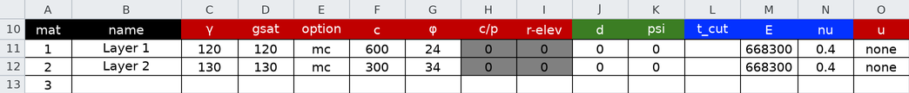

### 2. The `profile` worksheet

One block per profile line, with its **Mat ID** above the coordinates. Enter (or
copy-paste) the vertices from the geometry tables above:

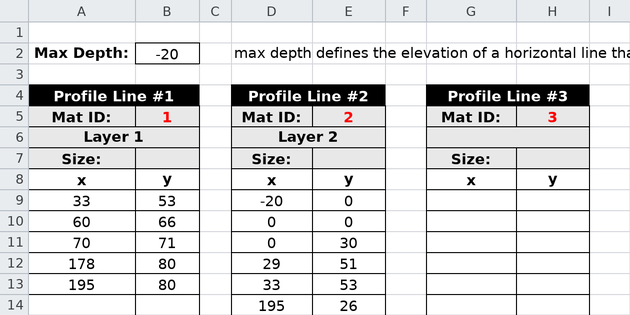

`profile!B2` **Max Depth** is an elevation — `-20`, the bottom of the model, not a
thickness below the toe.

### 3. The `reinforce` worksheet

One row per anchor. Enter (or copy-paste) the endpoints into the `Label` through
`y2` columns, pick `Anchor` from the **Type** drop-down, and enter (or copy-paste)
the capacity values from `Tmax` through `Spacing`:

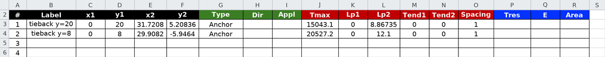

**Leave Dir and Appl alone.** Typing into either replaces the formula, which is
how a preset gets overridden deliberately, and pasting blanks across them erases
it for nothing.

### 4. The `piles` worksheet

One row for the soldier pile. Enter (or copy-paste) it from the table above:

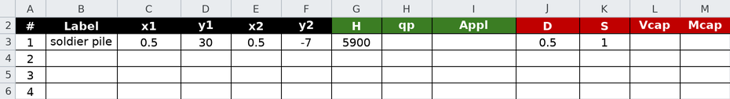

### 5. The `non-circ` worksheet

Select `Free` in the **Movement** column for each of the three points, and enter
(or copy-paste) the coordinates as shown below:

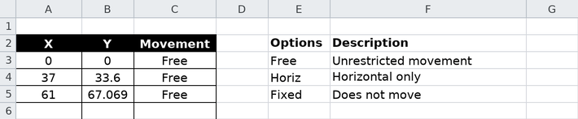

Save the file and continue at [Running the analysis](#running-the-analysis).

---

## C — Building it in Studio {#c-building-it-in-studio}

### 1. Materials and profile lines

Build them as [LEM-3](lem03_layered_slope.md#c-building-it-in-studio) does. In
**Materials**, two rows take the table above, both unit-weight columns filled at
the same value because there is no water in this model:

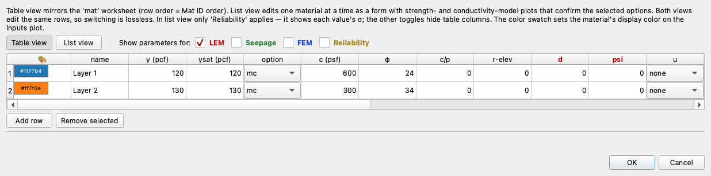{width=1000}

In **Profile lines**, paste each layer's block from the table above as its own
line. The lower layer's block includes the wall face — the vertical run at
x = 0 — and the preview draws the finished line against the ground surface
behind it:

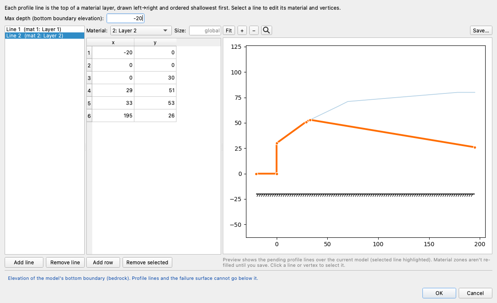

### 2. The failure surface

Build it as [LEM-5](lem05_weak_layer_noncircular.md#2-the-failure-surface) does:
**Non-circular pts**, three rows from the table above, `Free` on every one. The
preview draws the wedge running back and up from the wall toe:

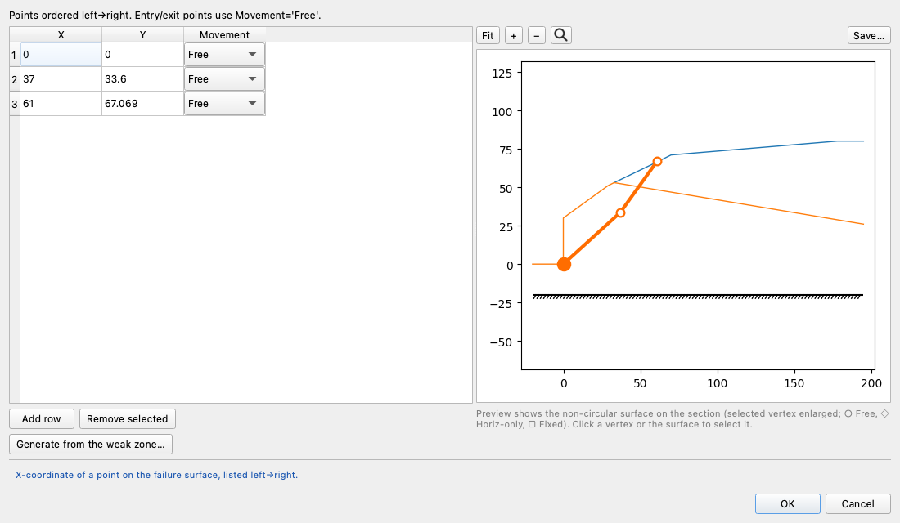

### 3. Reinforcement lines

Open **Reinforcement lines** in the **Inputs** tree and press **Table view** —
the columns are the worksheet's, in the same order, so the two blocks from the
table above paste straight in. Paste the endpoint block (`Label` through `y2`)
into the first cell — the rows come with it — then set each row's **Type** to
`anchor`, which fills **Dir** with `axial` and **Appl** with `active` on its
own, and paste the capacity block into the first `Tmax` cell:

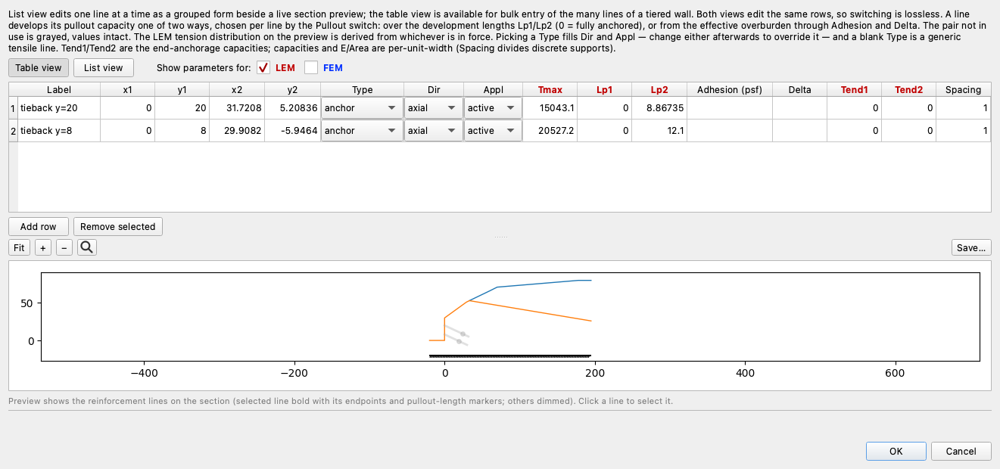

Press **List view** to read what was entered one line at a time, as a form in
five groups — **Identity**, **Geometry**, **Capacity**, **Anchorage**, **Type**
— with the list on the left labelling each line by its support type and the
x-range it spans:

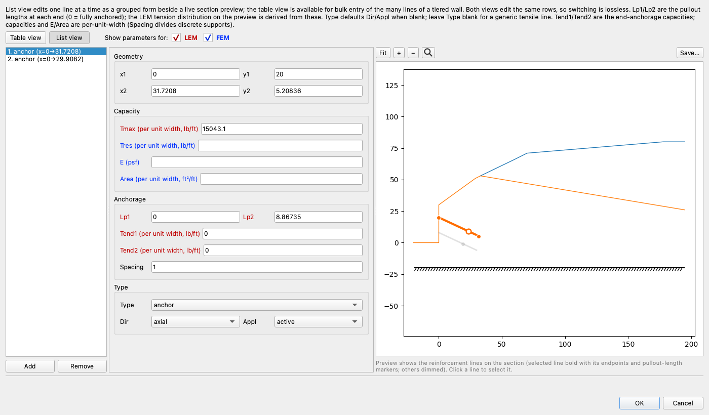{width=1000}

In the **Type** group the preset shows its work: **Dir** reads `axial` and
**Appl** `active` beside the `anchor` Type; typing over either afterwards keeps
what you typed, and choosing the Type again puts the preset back. The preview
draws the anchors on the section with the selected one bold: a marker at each
end, and one more where its capacity envelope reaches full Tmax, 8.87 ft in
from the grouted end. There is no such marker at the wall end, because Lp1 = 0
puts full capacity there already. Both views edit the same lines, so switching
between them loses nothing. Click **OK**.

### 4. The soldier pile

Open **Piles** in the same tree and press **Table view**. Its columns are the
piles worksheet's except `θp`, which Studio derives from the pile's endpoints —
so the row from the table above pastes in as two pieces: `Label` through `H` at
the first cell, then `D` and `S` at the `D` cell:

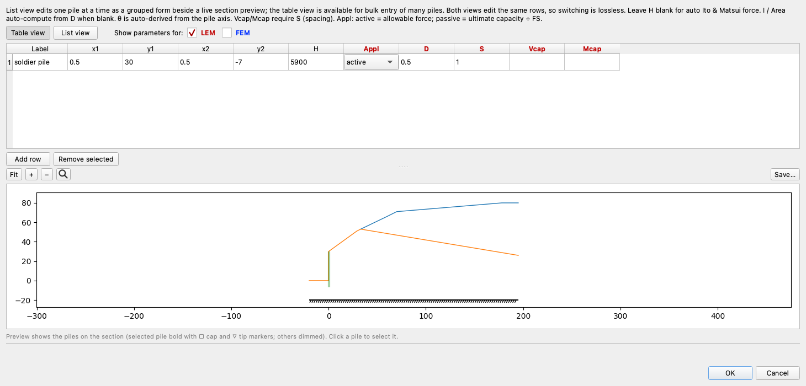

Press **List view** to read the row as a form — **Identity**, **Geometry**,
**Capacity / design**, **Behavior**, with `H`, `D` and `S` the three fields
this problem fills beyond the endpoints — beside the preview drawing the pile
on the section:

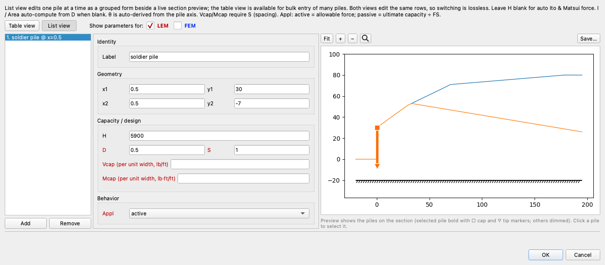{width=1000}

Click **OK**.

Continue below.

## Running the analysis

However you built it, you now hold the same model:

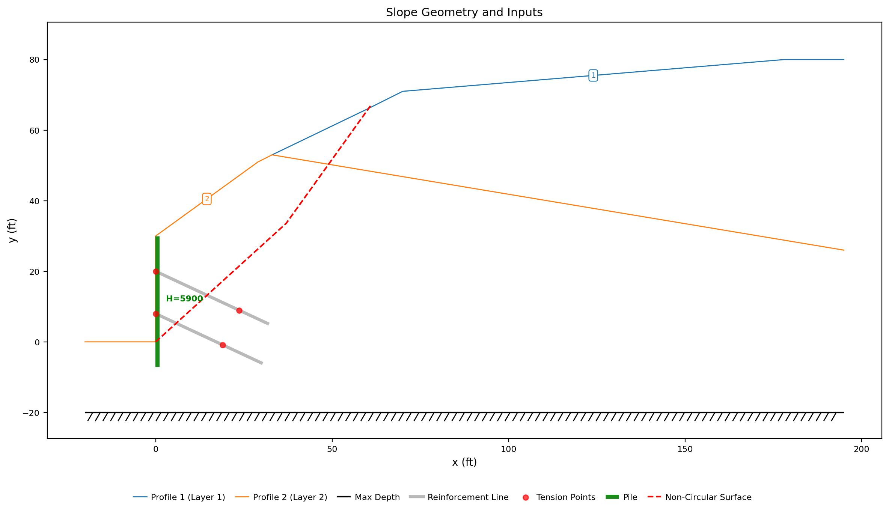{width=1000}

The two gray lines run back and down from the wall face, each with a red tension
point where its envelope reaches full capacity; the green bar at x = 0.5 is the
soldier pile, labeled with its 5,900 lb/ft; and the red dashed polyline from the
wall toe is the failure surface as entered.

Click **Run LEM…** and choose **Method** = `Janbu (Corrected)` — the method
both of this problem's references report their factor of safety in, so the
results here read directly against theirs — and **Analysis** = `Auto search`,
with the slice count left at 40:

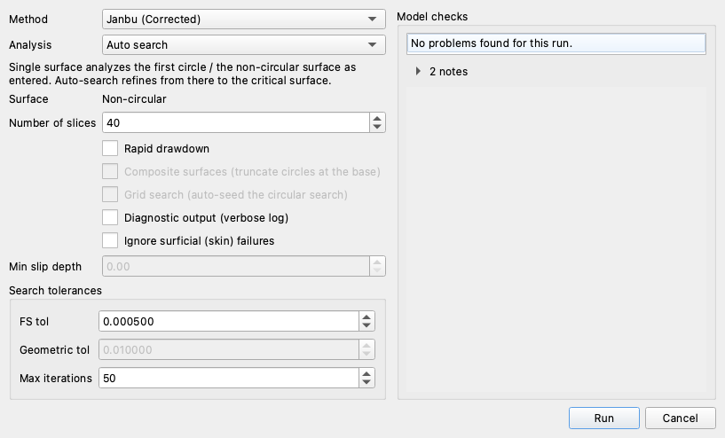


---

## Exploring the results

### What the search finds

The search starts from the three points the model carries and walks them, and the
plot draws every surface it tried in gray with the one it kept in red:

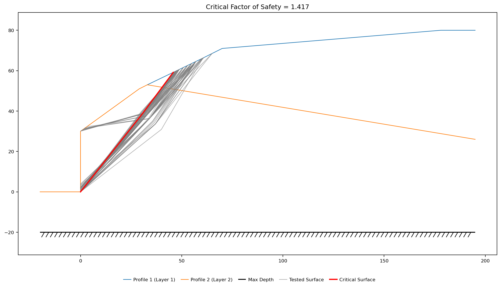{width=1000}

**FS = 1.431**, on a surface that runs from the wall toe at (0, 0) through
(32.64, 37.52) and out at (55.05, 63.62). The kink barely bends it — the lower leg
rises at 49.0° and the upper at 49.4° — so the search has straightened the manual's
two-part wedge into what is very nearly a single plane from the toe, and pulled
the exit point 6 ft closer to the wall.

The solution plot draws that surface with its base stresses, the anchors it
crosses, and the point where it cuts the pile:

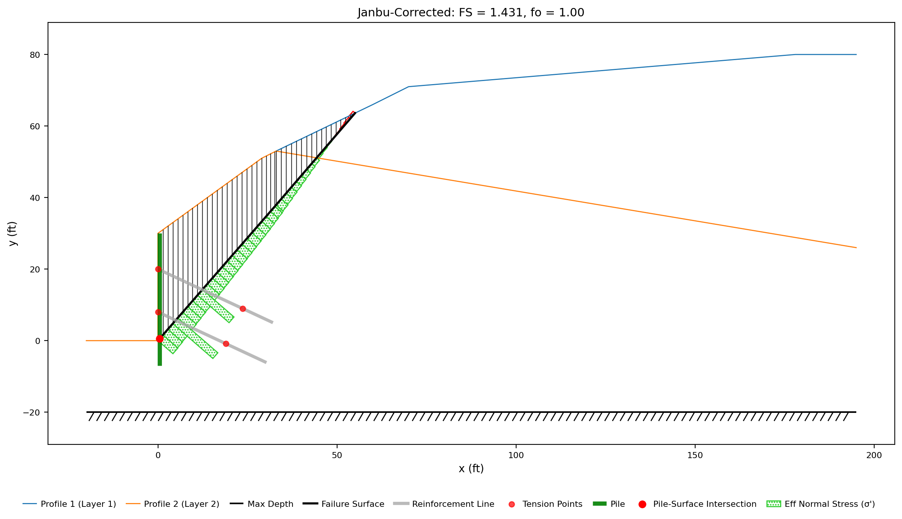{width=1000}

The sliding mass weighs 119,150 lb/ft on an 84.1 ft base. The surface crosses the
lower anchor 5.0 ft out from the face and the upper one 12.4 ft out, and both
deliver their full capacity — 35,570 lb/ft between them, which at 25° below
horizontal resolves into 32,238 lb/ft holding the mass back and 15,033 lb/ft
pressing down on it. Neither crossing is anywhere near a bond zone: more than 20 ft
of each anchor lies behind the surface, against the 8.87 ft and 12.1 ft it takes to
develop the bar, so both are governed by the steel rather than by the grout. The
pile adds its 5,900 lb/ft of shear where the surface passes it at the toe.

Each method runs its own search and finds its own critical surface:

| Janbu | Corps | Lowe | Spencer |
| :---: | :---: | :---: | :---: |
| 1.431 | 1.415 | 1.412 | 1.412 |

All four land between 1.412 and 1.431. The Ordinary Method of Slices and Bishop's
simplified method are not on the list: both take moments about a circle center,
which a polyline does not have, so they refuse the run rather than approximate it.
Morgenstern–Price is absent for a different reason — its solver fails on the
starting wedge itself, so the search never starts and the run reports that the
starting surface is not viable.

### Why not a circle?

The wedge family is a modeling choice, and it can be tested. Open **Circles**
and click **Generate starting circles…** to give the search one circular seed —
the model now holds both surface families, so **Surface** in the Run dialog
becomes a choice — and run the same Janbu auto search on `Circular`:

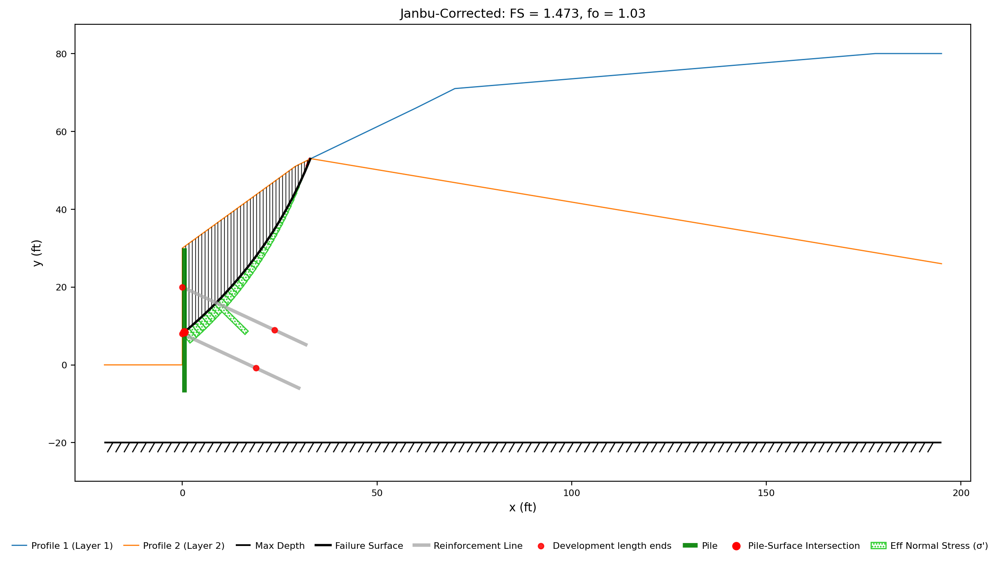{width=1000}

The best circle bottoms out deep and climbs back to the crest break, because a
circle cannot run flat along a plane. It reads **FS = 1.473, 3% above the
wedge's 1.431**, and the other methods agree: Spencer 1.473 against 1.412, and
Bishop — which joins the list because a circle restores its moment arm — 1.487.
Searched only in circles, this wall would look 3 to 4% safer than it is; the
non-circular surface is not a nicety, it is the mechanism.

### The wedge the reference manual gives

The three points entered are a specified surface from the manual this problem
comes from, and evaluating it is a **single-surface run — no search, the surface
exactly as typed**. Set **Analysis** to `Single surface` and raise the slice count
to 60:

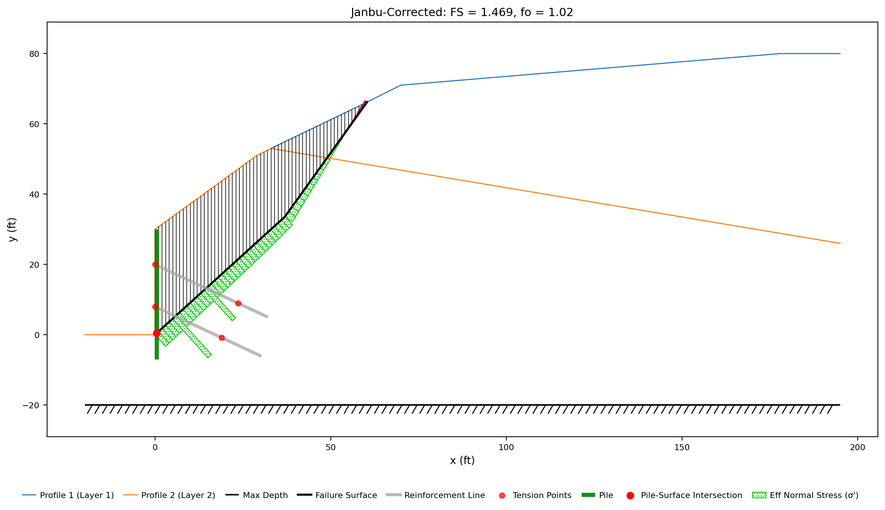{width=1000}

**FS = 1.469** with Janbu's correction factor f₀ = 1.024 applied, 1.434 without
it, and 1.439 with Spencer's method — the values
[verification problem VP49](../verification/rocscience.md#vp49) records against
the published solutions. The wedge carries 157,936 lb/ft on a 90.1 ft base, 33%
more soil than the searched surface, and takes the same 35,570 lb/ft from the
anchors, since a crossing anywhere in the free length gives full capacity. Its
lower leg leaves the toe at 42° against the search's 49°. A specified surface is a
candidate, not an answer, which is why the search comes first.

### What the tiebacks are worth

Take both anchors out and search the same wall again — same soils, same pile, same
starting points, a separate search with its own critical surface:

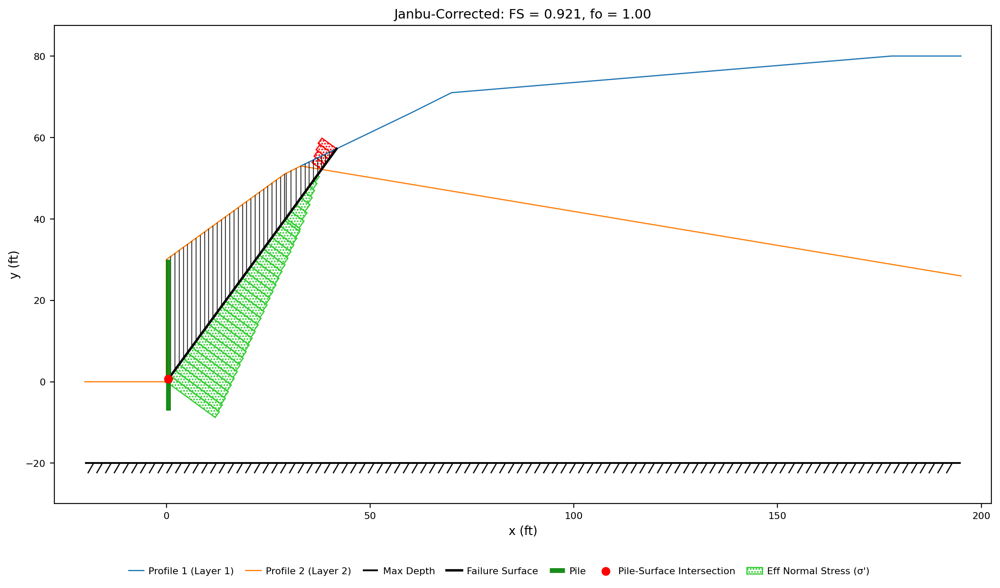{width=1000}

**FS = 0.921** against 1.431 — an unstable wall. The mechanism moves with the
anchors, not just the number: without them the critical surface exits at
(41.77, 57.22) on the cut slope, 13 ft closer to the wall, and cuts 87,264 lb/ft
of soil against 119,150.

Removing supports one at a time separates the two contributions, each answer on
its own searched surface:

| Support present | Janbu FS |
| --- | :---: |
| Anchors and pile | 1.431 |
| Anchors only | 1.325 |
| Pile only | 0.921 |
| Neither | 0.831 |

The wall does not stand at all without the anchors, and the pile is worth about
0.11 on top of them.

### Active or passive

**Appl** decides whether the capacity entered is an allowable force applied as it
stands, or an ultimate capacity that mobilizes with the soil and is therefore
divided by the factor of safety. The
[VP85 verification problem](../verification/rocscience.md#vp85) is the same slope
published both ways — a 20 ft cut in saturated clay, γ = 98 pcf, c = 350 psf,
φ = 0, with one horizontal tieback carrying 9,000 lb/ft — and each case is
evaluated on the circle its source prints for it:

| Model | Appl | XSLOPE FS |
| --- | --- | :---: |
| `vp085a` | Active | 1.567 |
| `vp085b` | Passive | 1.319 |

Those two answers sit on two different circles, so isolating the setting means
holding the surface still. On vp085a's circle — **one surface, no search, Bishop,
only Appl changing** — active reads 1.567 and passive 1.331, against 0.914 with no
anchor at all. Passive delivers about six-tenths of what active is worth here, and
that fraction is not a constant, since the divisor is the factor of safety being
solved for. Neither convention is a correction of the other, which is why the Type
presets set it rather than leaving it to habit: `Geosynthetic`, `Tieback` and
`Anchor` are active, `Nail` is passive.

---

## Conclusion

This tutorial covered:

- Grouted tiebacks entered with the **Anchor** preset — force along the bar's
  own axis, applied as a working load.
- Anchorage different at the two ends: a plate at the wall face, a grout bond
  length developing the far end.
- A discrete anchor's capacity divided by its spacing into force per foot of
  wall.
- A soldier pile as a separate shear contribution beside the tensile rows.
- The wall searched with and without its support, and the active/passive
  application difference measured on one held surface.

**Where to go next:** [LEM-10](lem10_global_minimum.md) searches a section that
holds two competing mechanisms, where the surface a search returns depends on the
circle it started from. The [tutorials index](index.md) lists the series.
[VP49](../verification/rocscience.md#vp49) catalogs this model against the
published solutions it comes from, [Soil Reinforcement in LEM](../lem/reinforcement.md)
derives the capacity envelope and the per-method equations the anchor force enters,
and [Piles and Concrete Piers](../lem/piles.md) covers the support family the
soldier pile belongs to.
