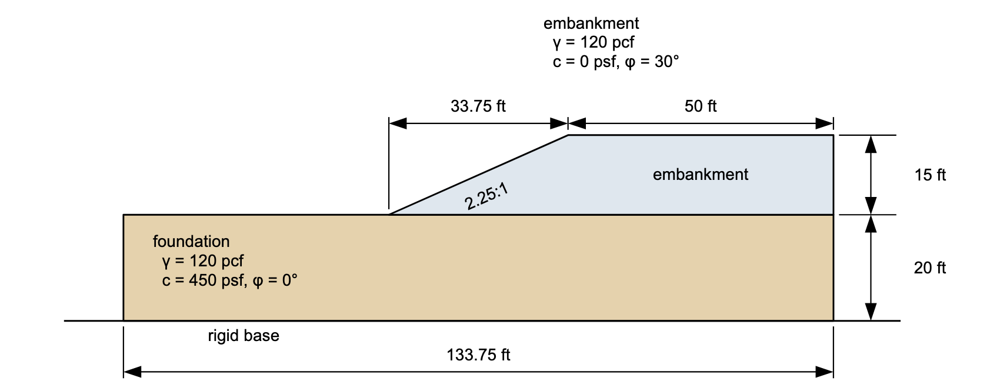
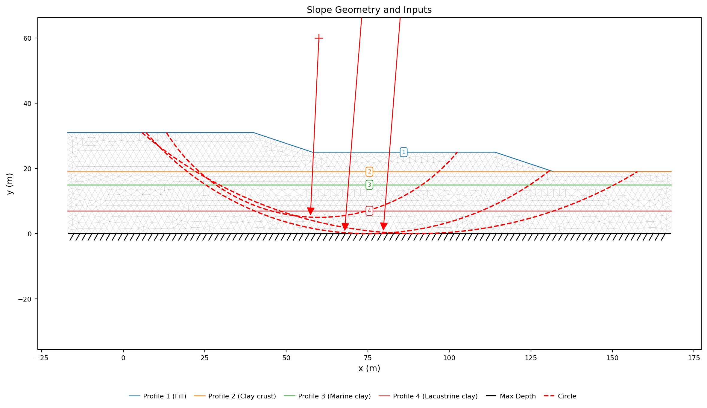
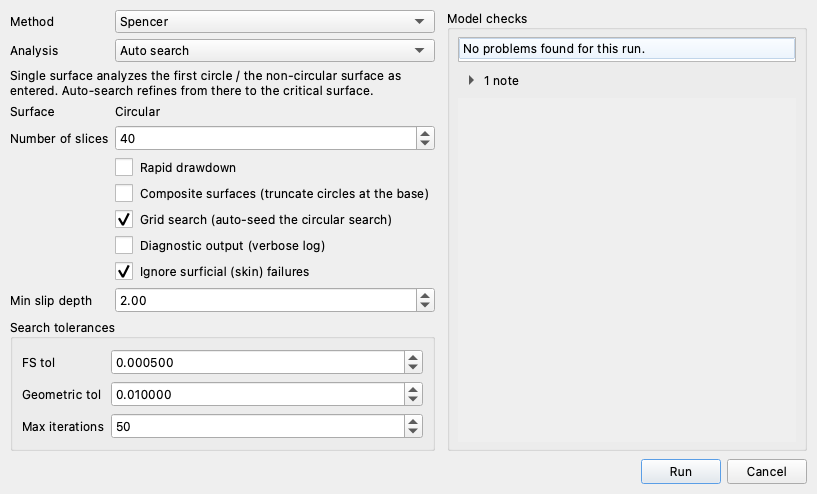

# Tutorial LEM-10 — Finding the Global Minimum

Two slopes that each hold more than one failure mechanism, and searches that
return whichever one their starting circles sit nearest. Part A is a 15 ft
cohesionless embankment on 20 ft of soft clay — a shallow slide in the sand
face against a deep failure through the foundation. Part B is the same trap at
full scale on a real section, the James Bay dyke, where a single credible seed
reads 23% high. **The lower of the two numbers is not necessarily the
answer.**

{width=1000}

Analysis
Limit equilibrium

Open & run
~10 min

**Objectives** — Learn how to find the global minimum rather than a local one:
how the seed circle steers what a search finds, how a minimum slip depth rejects
surficial slivers, and when grid seeding beats any hand-placed seed.

two materialsprofile linesstarting circlescircular searchgrid seedingminimum slip depth

**Completed models** — [xslope_mult_min_KEY.xlsx](../lem/files/xslope_mult_min_KEY.xlsx) (the same file used by [LEM Sample Problem 13](../lem/samples.md#13-multiple-local-minima)) and, for Part B, [xslope_james_bay.xlsx](../lem/files/xslope_james_bay.xlsx) — the James Bay dyke of [verification problem VP75](../verification/rocscience.md#vp75), with a single mid-depth starting circle

---

## Part A — An embankment on soft clay

A 15 ft embankment of clean sand — 120 pcf, cohesionless, φ = 30° — stands at
2.25:1 on 20 ft of soft undrained clay, 120 pcf with c = 450 psf and φ = 0.
**c = 0 in the fill** is what makes the section interesting: nothing in the
embankment resists a shallow slide except friction along its base, so a slab
of sand of any thickness — including a vanishingly thin one — has the same
factor of safety against sliding down the face, while the soft clay puts a
second, deep mechanism underneath. The completed file carries the section as
two profile lines with the maximum depth at the bottom of the clay, and one
starting circle, centered above the face and reaching the bottom of the
foundation. That circle is the one input this part changes.

### Opening the model

Download
[xslope_mult_min_KEY.xlsx](../lem/files/xslope_mult_min_KEY.xlsx) and open it
in Studio — **File → Open**. (It is an ordinary input workbook: the same file
opens in Excel, one worksheet per input.) The Inputs plot draws what loaded:

{width=1000}

The two profile lines are drawn in their materials' colors and the dashed red arc
is the starting circle, bottoming out on the hatched maximum depth at elevation
−20.

---

### Running the analysis

Click **Run LEM…** and choose **Method** = `Spencer` and **Analysis** =
`Auto search`, with the slice count left at 40:

The circle the file carries reaches the bottom of the clay, and the search it
seeds finds the deep mechanism:

{width=1000}

**FS = 1.376**, on a circle centered at (16.90, 26.22) with a radius of 46.22 —
tangent to the limiting depth at elevation −20, entering at the crest and exiting
21 ft beyond the toe, 82.9 ft of failure surface carrying 204,041 lb/ft of soil.
The starting circle is a seed and not an answer — solved as entered it gives
1.426, and the search deepens and lengthens it to 1.376.

### Move the seed and the answer moves

[LEM-3's rule](lem03_layered_slope.md#guarding-against-local-minima) is one
starting circle per layer, and this model's second layer has a mechanism of its
own. Open **Circles** and replace the file's circle with one that belongs to
the embankment — tangent to the top of the foundation instead of the bottom of
the clay:

| Xo | Yo | Option | Depth |
|:---:|:---:|---|:---:|
| 16.875 | 30 | Depth | 0 |

Click **OK** and run the same Spencer auto search again:

{width=1000}

**FS = 1.299.** The gray arcs are the trial circles, fanning across the fill and
shrinking toward the face as the search walks its center up and left; the red
critical circle is the short mark high on the slope — 1.2 ft long, never more
than 0.01 ft below the ground surface, moving 1 lb/ft of sand.

That number is not an artifact of the search. On a cohesionless face the factor
of safety against an infinitely shallow slide is tan φ′ / tan β, which is
tan 30° / tan 23.96° = **1.299** for this 2.25:1 face. The search is converging on
a real limit — and the limit belongs to a slide with no mass in it. It is the
minimum of this model and not a mechanism anything is designed against. Two
searches on one model, 6% apart, on mechanisms that share almost nothing: the
sliver rides the sand face; the deep circle cuts the full depth of the clay.

### The surficial filter

**Ignore surficial (skin) failures**, with a **Min slip depth** beside it, is
the filter that removes slides like the sliver: a trial surface whose deepest
point is less than that far below the ground is rejected during the search.
Back in **Run LEM…**, tick the box and set the depth to `5`:

From the embankment seed, the search now returns **1.455**, on a 33 ft circle
that stays inside the fill — deeper than the sliver it rejected, still clear
of the foundation:

{width=1000}

Only at 8 ft does the embankment seed reach 1.376. The filter decides which
surfaces are admissible; the seeding decides which of them the search ever
looks at. Commercial searches carry the same filter for the same reason: on
[verification problem VP107](../verification/rocscience.md#vp107), Slide2's
unfiltered optimization reports minima near 1.03 on small surfaces at a gabion
wall's face, and the manual excludes them with its own limit sets before
reporting the answer.

### Which answer the model reports

Run every circle in one search and it reports the lowest surface any seed
reached — here, the 1.299 sliver. **Several starting circles, and agreement
between them, is the check**; where they disagree, the surfaces decide, and the
design number is the deep one.

---

## Part B — The James Bay dyke

The same lesson at full scale, on a real section.
[Verification problem VP75](../verification/rocscience.md#vp75) is one of the
planned James Bay dykes, from Duncan & Wright's Fig. 7.16, in metric units: a
granular fill embankment — c′ = 0, φ′ = 30° — with a wide berm, resting on
three soft φ = 0 clays: a 4 m crust at c = 41 kN/m², 8 m of marine clay at
34.5 kN/m², and 7 m of lacustrine clay at 31.2 kN/m². Two deep mechanisms
compete here too: a circle that exits through the wide berm, and a wider one
that runs beneath it and daylights beyond.

### Opening the model

Download
[xslope_james_bay.xlsx](../lem/files/xslope_james_bay.xlsx) — the dyke's
model, carrying a single starting circle an engineer might reasonably place:
centered over the slope face, reaching mid-depth into the clays — and open it
in Studio with **File → Open**. The Inputs plot draws the four profile lines
in their materials' colors with that one seed:

{width=1000}

### Running the analysis

Click **Run LEM…** and choose **Method** = `Spencer` and **Analysis** =
`Auto search`, with **Ignore surficial (skin) failures** on and
**Min slip depth** = `2` — the metric counterpart of Part A's 5 ft:

Click **Run**:

{width=1000}

**FS = 1.744**, and nothing about it looks wrong: the circle bottoms on the
base of the model, cuts all three clays, and converged cleanly. It exits
through the berm — and that is exactly what is wrong with it, because the berm
is there to hold that mechanism.

### Grid search

Now the seeding-independent tool. **Grid search (auto-seed the circular
search)**, the checkbox beside the surficial filter, sweeps a grid of circle
centers against a range of tangent elevations before refining, instead of
refining only the neighborhood of the circles on the sheet. Back in
**Run LEM…**, tick it — the grid ignores the circles sheet entirely, so it
does not matter what is seeded:

Run again:

{width=1000}

**FS = 1.420**, on a wider circle that runs under the berm and daylights beyond
it — 23% below the single seed's answer, against Slide's 1.464 and Duncan &
Wright's published 1.45. The wrongly seeded search missed by far more than the
programs and the textbook differ among themselves, and it reported nothing
unusual. The full **Generate starting circles…** set also finds 1.420 with the
2 m filter on — the deep member of the per-layer family reaches it, which is
[LEM-3's rule](lem03_layered_slope.md#guarding-against-local-minima) doing its
job. Grid search is the version of that rule that does not depend on any
circle having been placed at all.

---

## Conclusion

This tutorial covered:

- A section with two genuine minima, where the search returns whichever
  mechanism its starting circle sits nearest.
- The surficial skin slide a cohesionless face produces — a real minimum, and
  not a design case.
- **Min slip depth** to reject the skin, and **Grid search** to sweep the whole
  section with no seed at all.
- Reading a search by the surface it converged on, since two answers on one
  model can describe entirely different failures.
- The same trap at full scale on the James Bay dyke, where a single credible
  seed converged 23% high.

**Where to go next:** the [tutorials index](index.md) lists the series.
[Sample Problem 13](../lem/samples.md#13-multiple-local-minima) catalogs this
model, [LEM-3](lem03_layered_slope.md) is where the per-layer starting-circle rule
is built, and [Automated Search](../lem/search.md) documents the search itself.
