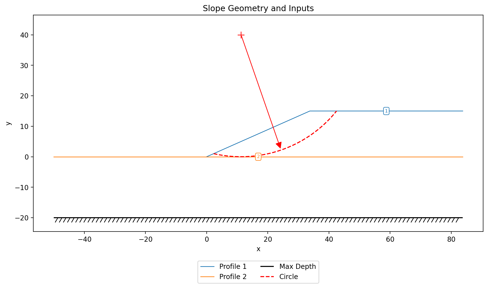
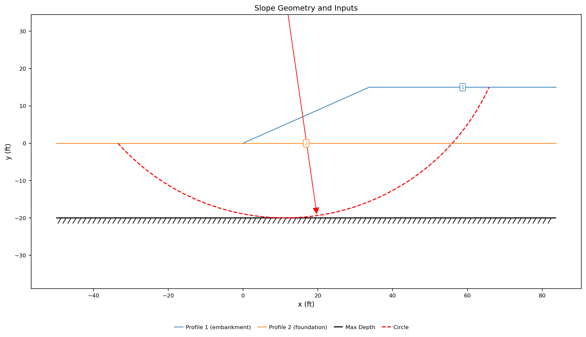
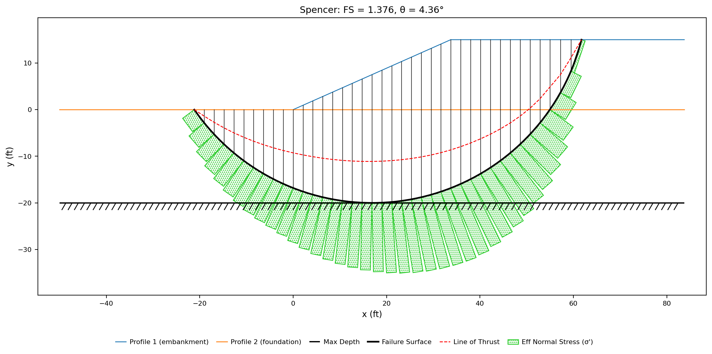
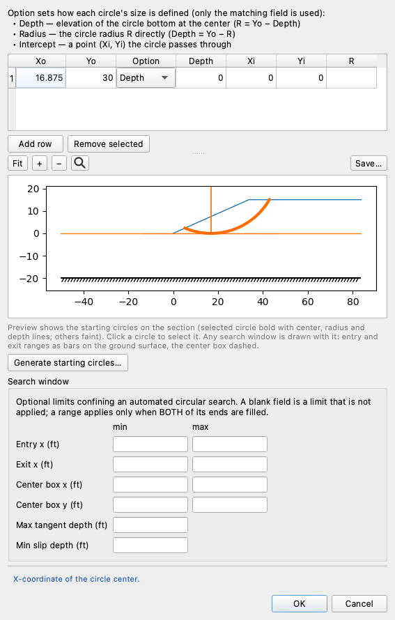
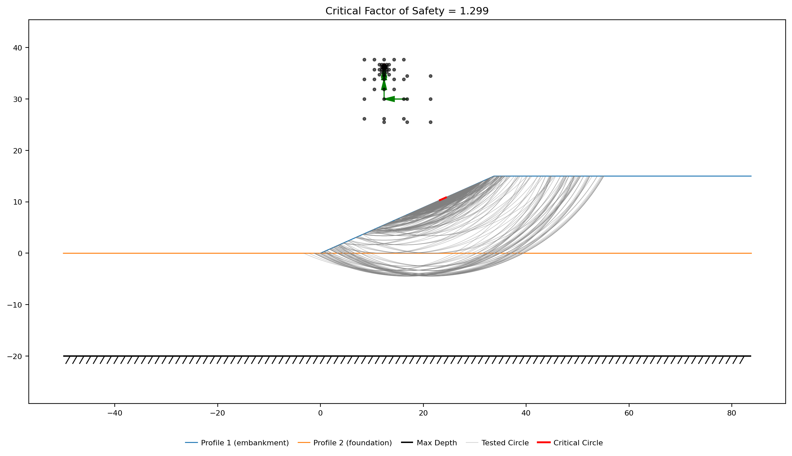
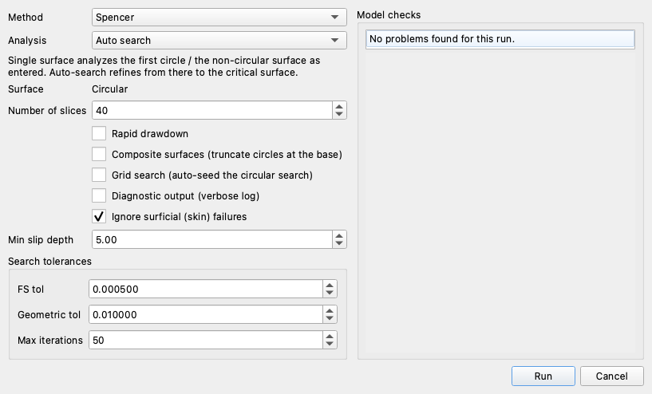
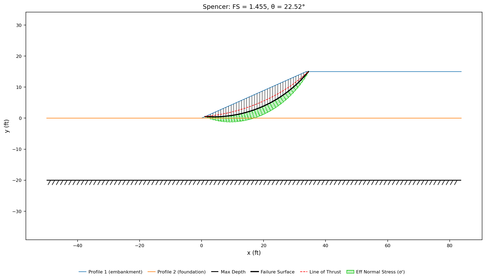
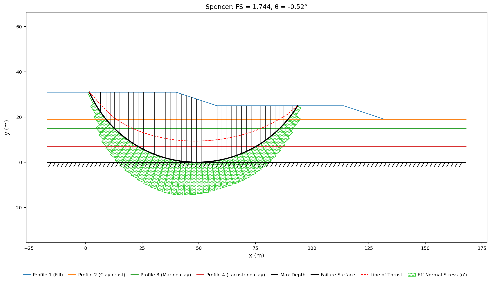
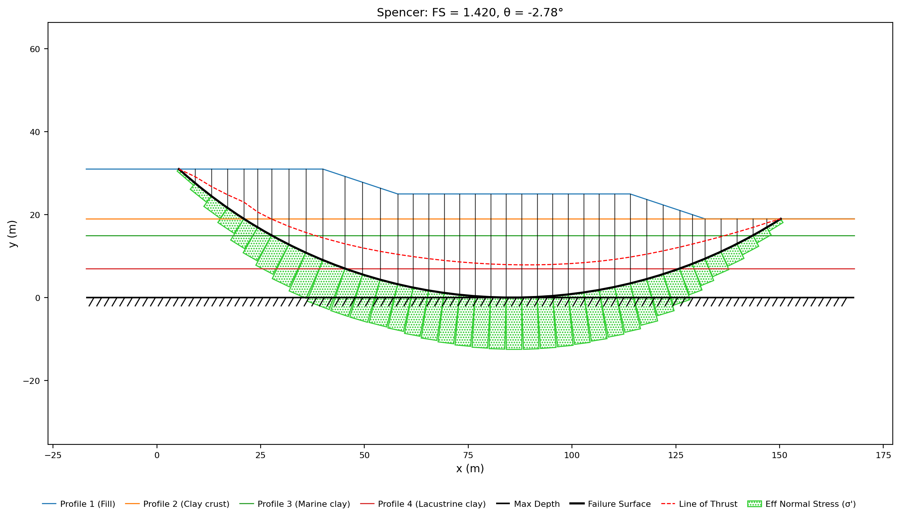

# Tutorial LEM-10 — Finding the Global Minimum

A 15 ft cohesionless embankment on 20 ft of soft clay. Two mechanisms compete
here — a shallow slide in the sand face and a deep one through the foundation —
and an automated search returns whichever of them its starting circle is near.
**The lower of the two numbers is not the answer.**

{width=700}

Analysis
Limit equilibrium

Open & run
~10 min

**Objectives** — Open the completed model and search it from the circle the
file carries — the deep foundation seed — then move the seed into the
embankment and get a different answer; read why the two searches disagree, and
use grid seeding and a minimum slip depth to find the mechanism a design is
sized for.

two materialsprofile linesstarting circlescircular searchgrid seedingminimum slip depth

**Completed models** — [xslope_mult_min_KEY.xlsx](../lem/files/xslope_mult_min_KEY.xlsx) (the same file used by [LEM Sample Problem 13](../lem/samples.md#13-multiple-local-minima)) and, for the closing example, [vp075.xlsx](../verification/files/rocscience/vp075.xlsx), the James Bay dyke of [verification problem VP75](../verification/rocscience.md#vp75)

---

## The problem

**Materials** — a drained cohesionless fill on an undrained clay:

| Mat ID | Name | γ (pcf) | c (psf) | φ (deg) | Pore pressure |
|---|---|:---:|:---:|:---:|---|
| 1 | `embankment` | 120 | 0 | 30 | `none` |
| 2 | `foundation` | 120 | 450 | 0 | `none` |

**c = 0 in the fill.** Nothing in the embankment resists a shallow slide except
friction along its base, so a slab of sand of any thickness — including a
vanishingly thin one — has the same factor of safety against sliding down the
face.

**Geometry** — two profile lines, each the *top* of its material layer, as in
[LEM-3](lem03_layered_slope.md#the-problem). Maximum depth = `-20`, the elevation
of the bottom of the soft clay.

**Profile Line 1 — material 1 (`embankment`):**

| x (ft) | y (ft) |
|:---:|:---:|
| 0 | 0 |
| 33.75 | 15 |
| 83.75 | 15 |

**Profile Line 2 — material 2 (`foundation`):**

| x (ft) | y (ft) |
|:---:|:---:|
| -50 | 0 |
| 83.75 | 0 |

Line 1 is the ground surface: toe, crest break at the top of the 2.25:1 face,
back of the crest. Line 2 is the contact, carried 50 ft past the toe so a deep
surface has ground to come up on.

**Starting circle** — one, centered above the face and reaching the bottom of the
foundation:

| Xo | Yo | Option | Depth |
|:---:|:---:|---|:---:|
| 11.25 | 40 | Depth | -20 |

This tutorial starts from the completed file rather than building it: the
tables above are what the file already holds, laid out as the worksheets and
Studio's editors show them. The starting circle is the one input the tutorial
changes.

---

## Opening the model

Download
[xslope_mult_min_KEY.xlsx](../lem/files/xslope_mult_min_KEY.xlsx) and open it
in Studio — **File → Open**. (It is an ordinary input workbook: the same file
opens in Excel, one worksheet per table above.) The Inputs plot draws what
loaded:

{width=1000}

The two profile lines are drawn in their materials' colors and the dashed red arc
is the starting circle, bottoming out on the hatched maximum depth at elevation
−20.

---

## Running the analysis

Click **Run LEM…** and choose **Method** = `Spencer` and **Analysis** =
`Auto search`, with the slice count left at 40:

The circle the file carries reaches the bottom of the clay, and the search it
seeds finds the deep mechanism:

{width=1000}

**FS = 1.376**, on a circle centered at (16.90, 26.22) with a radius of 46.22 —
tangent to the limiting depth at elevation −20, entering at the crest and exiting
21 ft beyond the toe, 82.9 ft of failure surface carrying 204,041 lb/ft of soil.
The starting circle is a seed and not an answer — solved as entered it gives
1.426, and the search deepens and lengthens it to 1.376.

---

## Exploring the results

### Move the seed and the answer moves

[LEM-3's rule](lem03_layered_slope.md#guarding-against-local-minima) is one
starting circle per layer, and this model's second layer has a mechanism of its
own. Open **Circles** and replace the file's circle with one that belongs to
the embankment — tangent to the top of the foundation instead of the bottom of
the clay:

| Xo | Yo | Option | Depth |
|:---:|:---:|---|:---:|
| 16.875 | 30 | Depth | 0 |

Click **OK** and run the same Spencer auto search again:

{width=1000}

**FS = 1.299.** The grey arcs are the trial circles, fanning across the fill and
shrinking toward the face as the search walks its center up and left; the red
critical circle is the short mark high on the slope — 1.2 ft long, never more
than 0.01 ft below the ground surface, moving 1 lb/ft of sand.

That number is not an artifact of the search. On a cohesionless face the factor
of safety against an infinitely shallow slide is tan φ′ / tan β, which is
tan 30° / tan 23.96° = **1.299** for this 2.25:1 face. The search is converging on
a real limit — and the limit belongs to a slide with no mass in it. It is the
minimum of this model and not a mechanism anything is designed against. Two
searches on one model, 6% apart, on mechanisms that share almost nothing: the
sliver rides the sand face; the deep circle cuts the full depth of the clay.

### Two tools for exactly this section

**Grid search (auto-seed the circular search)**, a checkbox in the **Run LEM…**
dialog, sweeps a grid of circle centers against a range of tangent elevations
before refining, instead of refining only the neighborhood of the circles on the
sheet. It removes the dependence on where the seeds were put, and here it returns
**1.327** on a face slide 11.8 ft long and 0.75 ft deep — a global sweep still
lands in the surficial family, because that family really does hold the model's
lowest surfaces.

**Ignore surficial (skin) failures**, with a **Min slip depth** beside it, is the
filter that removes them: a trial surface whose deepest point is less than that
far below the ground is rejected during the search. Back in **Run LEM…**, tick
both boxes and set the depth to `5`:

With grid seeding on and a minimum slip depth of `5`, the search returns
**1.376** on the deep circle — the foundation mechanism, found without being
seeded. From the embankment circle alone, the same 5 ft filter returns
**1.455**, on a 33 ft circle that stays inside the fill — deeper than the
sliver it rejected, still clear of the foundation:

{width=1000}

Only at 8 ft does the embankment seed reach 1.376. The filter decides which
surfaces are admissible; the seeding decides which of them the search ever
looks at. Commercial searches carry the same filter for the same reason: on
[verification problem VP107](../verification/rocscience.md#vp107), Slide2's
unfiltered optimization reports minima near 1.03 on small surfaces at a gabion
wall's face, and the manual excludes them with its own limit sets before
reporting the answer.

### Which answer the model reports

Run every circle in one search and it reports the lowest surface any seed
reached — here, the 1.299 sliver. **Several starting circles, and agreement
between them, is the check**; where they disagree, the surfaces decide, and the
design number is the deep one.

---

## The same lesson at full scale: the James Bay dyke

The section above was built to hold two mechanisms.
[Verification problem VP75](../verification/rocscience.md#vp75) is a real one
that does: one of the planned James Bay dykes, from Duncan & Wright's
Fig. 7.16 — a granular fill embankment with a wide berm resting on three soft
φ = 0 clays, in metric units. Download
[vp075.xlsx](../verification/files/rocscience/vp075.xlsx) and open it.

Replace the file's three circles with a single one an engineer might
reasonably place — mid-depth, under the crest:

| Xo | Yo | Option | Depth |
|:---:|:---:|---|:---:|
| 86 | 43 | Depth | 15 |

Run **Spencer**, `Auto search`, with **Ignore surficial failures** on and
**Min slip depth** = `2` — the metric counterpart of the last section's 5 ft:

{width=1000}

**FS = 1.744**, and nothing about it looks wrong: the circle bottoms on the
base of the model, cuts all three clays, and converged cleanly. It exits
through the berm — and that is exactly what is wrong with it, because the berm
is there to hold that mechanism.

Now tick **Grid search** and run again; the grid ignores the circles sheet, so
it does not matter what is seeded:

{width=1000}

**FS = 1.420**, on a wider circle that runs under the berm and daylights beyond
it — 23% below the single seed's answer, against Slide's 1.464 and Duncan &
Wright's published 1.45. The wrongly seeded search missed by far more than the
programs and the textbook differ among themselves, and it reported nothing
unusual. The full **Generate starting circles…** set also finds 1.420 with the
2 m filter on — the deep member of the per-layer family reaches it, which is
[LEM-3's rule](lem03_layered_slope.md#guarding-against-local-minima) doing its
job. Grid search is the version of that rule that does not depend on any
circle having been placed at all.

---

## Conclusion

This tutorial demonstrated:

- A section with two genuine minima — a cohesionless embankment on soft clay —
  where the search returns whichever mechanism its starting circle sits nearest.
- The surficial limit a c = 0 face produces: **1.299** on a surface 1.2 ft long
  carrying 1 lb/ft, matching tan φ′ / tan β for the face angle — a real minimum
  and not a design case.
- The deep foundation failure at **1.376**, tangent to the bottom of the clay and
  moving 204,041 lb/ft, found by seeding a circle at that depth.
- **Grid search** as the seeding-independent sweep (**1.327** here, still
  surficial) and **Min slip depth** as the filter that rejects the skin, the two
  together returning **1.376**.
- Reading a search by the surface it converged on, since two answers on one model
  can be 6% apart and describe entirely different failures.
- The James Bay dyke ([VP75](../verification/rocscience.md#vp75)) at full
  scale: a single credible seed converging at **1.744** — 23% above the
  **1.420** that grid seeding, the generated per-layer set, Slide (1.464) and
  Duncan & Wright (1.45) all agree on.

**Where to go next:** the [tutorials index](index.md) lists the series.
[Sample Problem 13](../lem/samples.md#13-multiple-local-minima) catalogues this
model, [LEM-3](lem03_layered_slope.md) is where the per-layer starting-circle rule
is built, and [Automated Search](../lem/search.md) documents the search itself.
