# Tutorial LEM-11 — Reliability

Every tutorial before this one ends in a single number: enter the best
estimate of each soil property and a deterministic analysis returns one factor
of safety. A stochastic analysis starts from **more** data, not less. A site
investigation yields not just a best estimate of each property but a sense of
its spread — the scatter of the tests, the range two engineers would defend —
and a standard deviation entered beside the value puts that knowledge into the
model instead of leaving it in the report. The analysis carries it through the
computation, and the answer comes back correspondingly richer: a distribution
of factors of safety, summarized by a **probability of failure** and a
**reliability index** rather than by one number.
[Reliability Analysis](../reliability/index.md) gives the theory behind both.

A probability is also the more meaningful number to act on. In design and
retrofitting, "FS = 1.35" says nothing about how likely the slope is to fail
or what a proposed fix buys — one slope at 1.35 can be far riskier than
another at the same value — while "one chance in six, and the retrofit takes
it to one in a hundred" is a statement a decision can rest on, and one that
can be weighed against cost and consequence.

This page's slope — 30 ft of undrained clay standing under 40 ft of water —
makes the difference concrete. The deterministic answer is FS = 1.354; the
stochastic answer is that the slope has roughly one chance in six of failing.
**The factor of safety does not change; what changes is what is known about
it.**

Analysis
Limit equilibrium

Open &amp; run
~15 min

**Objectives** — Read the standard-deviation columns a reliability analysis runs
on, estimate the reliability index and probability of failure two ways — the
Taylor series over 1 + 2N searches and a 10,000-realization Monte Carlo campaign
— on one model and one surface, measure which of the two uncertainties actually
drives the answer, and halve it.

one materialundrained strengthdistributed loadstandard deviationsTaylor series (TSPM)Monte Carlovariance Paretocircular search

**Completed model** — [xslope_reliability.xlsx](../lem/files/xslope_reliability.xlsx) — essentially the same problem as [LEM Sample Problem 15](../lem/samples.md#15-reliability-analysis-submerged-slope), with the standing water entered as a piezometric line instead of hand-typed surface loads

---

## The slope

One soil: an undrained clay, γ = 120 pcf, c = 400 psf, φ = 0, over a rigid base
20 ft below the toe. The face rises 30 ft at 1.5:1, and the whole section is
under water — the free surface stands at elevation 40, so there is 40 ft of water
on the flat in front of the toe and 10 ft over the crest. The water surface is
entered once, as a flat piezometric line at elevation 40, and the model's
**Water loads** option is `auto`: at solve time the engine turns the standing
water above the ground into the surface loads it is. The clay's **u** stays
`none`, because a total-stress φ = 0 analysis carries no pore pressures on its
slice bases — here the line defines the reservoir, not a pore-pressure field.
[LEM-4](lem04_water_in_the_slope.md) covers the pore-pressure inputs this model
deliberately does without.

What makes the slope a reliability problem is the two extra pieces of data
beside those strengths: the site investigation supports a standard deviation of
8 pcf on the unit weight and 100 psf on the cohesion — 7% and 25% of their own
values — and the sheet carries them where a deterministic model would have
carried nothing.

### Opening the model

Download
[xslope_reliability.xlsx](../lem/files/xslope_reliability.xlsx)
and open it in Studio — **File → Open**. The Inputs plot draws the section, the
starting circle the file carries, the piezometric line at elevation 40 with the
water-table symbol on it, and the surface loads the water derives — drawn in
water blue and labelled as derived, because they are computed from the line
rather than entered:

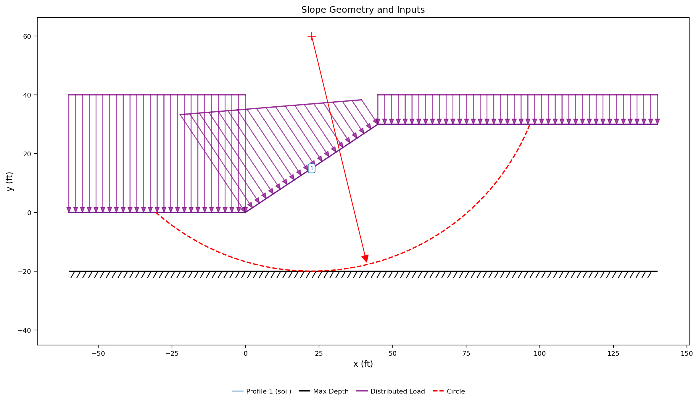{width=1000}

The arrows are longest on the flat at elevation 0, where the water is 40 ft deep
and presses 2496 psf, and shortest over the crest at elevation 30, where 10 ft of
water presses 624 psf. Along the face between them the load tapers linearly with
the depth of water above each point.

### The standard deviations

Open **Materials** and switch to **List view**. Above the form, the row of
checkboxes labelled **Show parameters for:** decides which inputs the editor
shows; **Reliability** is the one that is off by default, and ticking it puts a
**± σ** box beside every parameter that can carry a standard deviation:

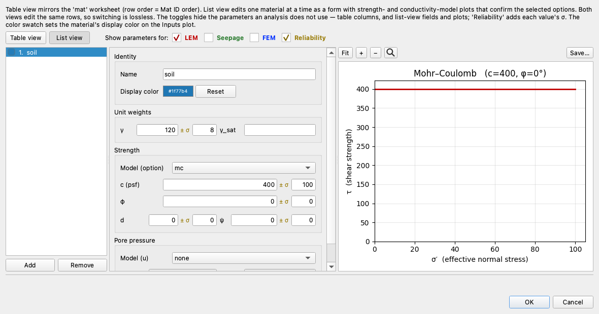

The clay reads **γ** = `120` **± σ** `8` and **c** = `400` **± σ** `100`. Those
are the mat sheet's `s(g)` and `s(c)` columns, which the table view shows as two
columns in a **Standard Deviations** block at the right of the sheet and which
the list view puts next to the values they belong to. A blank or zero σ means the
parameter is treated as known exactly and is not varied.

A standard deviation is easier to judge as a fraction of its own value — the
**coefficient of variation**, σ/x — which is 8/120 = 6.7% for the unit weight and
100/400 = 25% for the cohesion. Both sit inside the ranges published for those
properties: 3–10% for unit weight, 15–50% for undrained shear strength. The
[Reliability Analysis](../reliability/index.md#parameter-uncertainty) page
tabulates the rest and gives the two rules of thumb for estimating a σ from a
high and a low estimate rather than from a data set.

---

## The deterministic run

Click **Run LEM…** and choose **Method** = `Spencer` and **Analysis** =
`Auto search`, with the slice count left at 40:

Click **Run**. The search deepens the file's circle onto the base of the model:

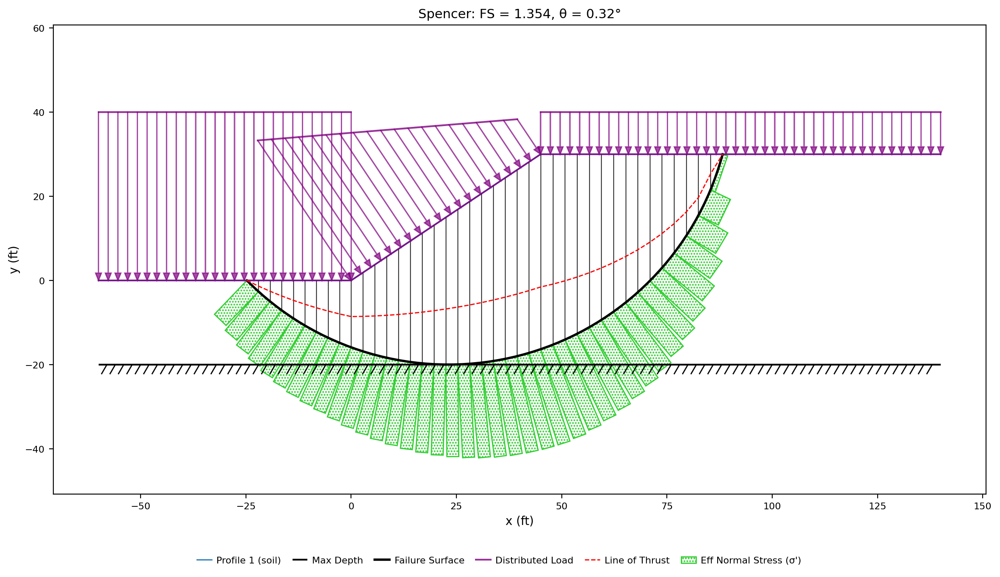{width=1000}

**FS = 1.354**, on a circle centered at (23.14, 47.36), tangent to the rigid base
at elevation −20, 141.27 ft of failure surface carrying 370,624 lb/ft of clay.
This is the answer every deterministic analysis in the previous ten tutorials
would stop at, and it is the number the rest of this page is about: not whether
1.354 is right, but how much of it is real.

---

## The Taylor series

**Reliability…** sits beside **Parametric…** on the **Run** menu and on the
toolbar. Where a parametric sweep answers deterministic what-ifs, this one turns
the σ columns into a reliability index. Open it and leave the **Method** on
`Taylor series (TSPM)`, with **LEM method** = `Spencer` and 40 slices:

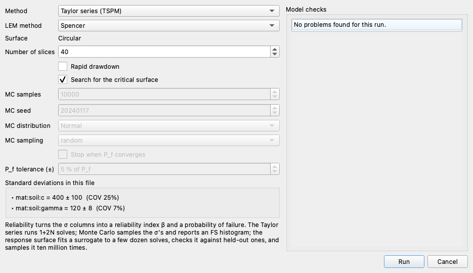

The search is not done once. The Taylor series solves the model 1 + 2N
times — once at the most-likely values, then twice more for each uncertain
parameter, at MLV + σ and at MLV − σ — and with **Search for the critical
surface** ticked, **every one of those solves is a fresh search**: each
perturbed model finds its own critical surface. Leave it ticked here.
Unticked, every solve evaluates the circle entered on the sheet instead —
the right mode when the surface itself is prescribed, as on a published
benchmark's circle, an observed failure surface, or a bedding-controlled
plane, where the question is that surface's own reliability. Below the controls, **Standard deviations in
this file** lists what the run will actually vary — `mat:soil:c = 400 ± 100
(COV 25%)` and `mat:soil:gamma = 120 ± 8 (COV 7%)`. If that box says no standard
deviations are set, **Run** is disabled; a reliability analysis with nothing
uncertain in it has no question to answer.

Click **Run**. The result view carries the reliability statistics in its title
over the surface they were computed on:

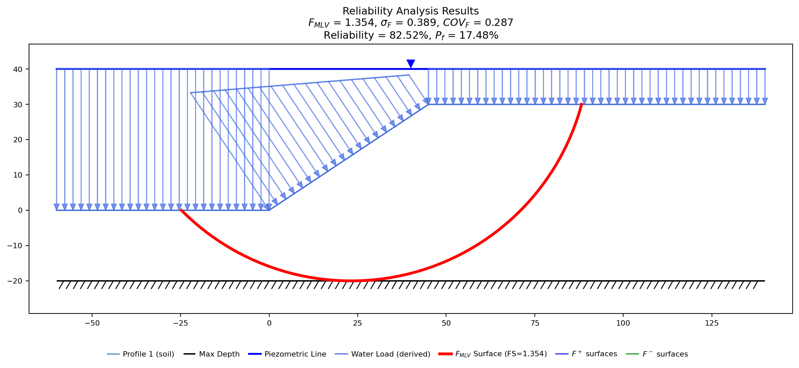{width=1000}

The Taylor Series Probability Method evaluates the factor of safety at the
most-likely values and then once more at ±σ for each uncertain parameter — 1 + 2N
solves, five of them here — and combines the swings into a variance. The
per-parameter table is written to the Log pane:

| Parameter | MLV | σ | F⁺ | F⁻ | ΔF |
|---|:---:|:---:|:---:|:---:|:---:|
| soil γ | 120 | 8 | 1.189 | 1.572 | 0.383 |
| soil c | 400 | 100 | 1.692 | 1.015 | 0.677 |

The unit-weight row runs the other way from the strength row: heavier clay is a
larger driving moment, so **F⁺ is the lower** of its pair. Only the size of
each swing enters the variance, σF² = Σ(ΔF/2)², which here gives
**σF = 0.389** and **COVF = 0.287**. From the factor of
safety and its coefficient of variation comes the lognormal reliability index
**βLN = 0.935**, a **reliability of 82.52%** and a **probability of
failure of 17.48%**.

The plot's legend names F⁺ and F⁻ surfaces that cannot be found on it, and that
is the result rather than a drawing fault: all five searches returned the same
circle, center (23.14, 47.36) tangent at elevation −20, so the perturbation
surfaces lie exactly under the FMLV surface drawn over them. On a
single-material φ = 0 slope neither scaling the strength nor scaling the weight
moves the critical circle — both scale the resisting and driving terms of every
trial surface the same way. On a layered slope the perturbed surfaces separate,
and where they separate a long way the parameter is moving the mechanism and not
just the number.

---

## Monte Carlo

Open **Reliability…** again and change **Method** to `Monte Carlo`. The
controls below the surface options come live:

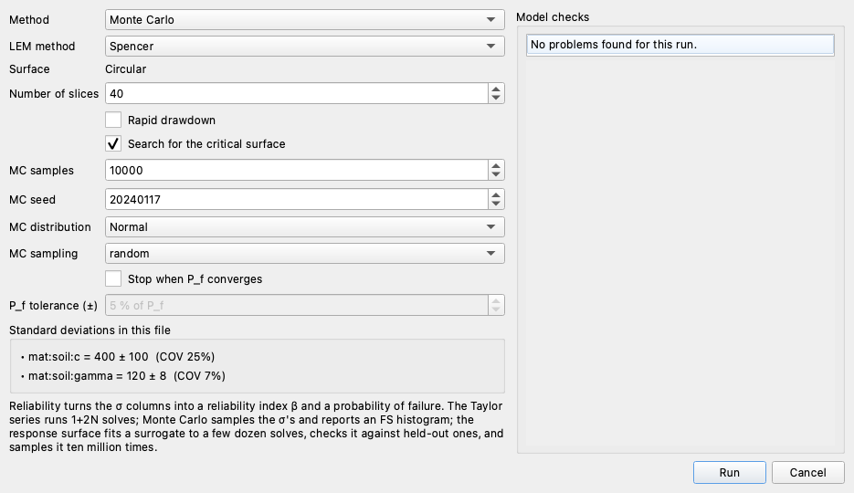

**MC samples** `10000` is the number of realizations, **MC seed** `20240117` is
the random seed — fixed rather than taken from the clock, so the run reproduces
exactly — and **MC distribution** `Normal` is how each σ is read: as the standard
deviation of a normal distribution about the material's own value, truncated at
zero so a draw can never hand the solver a negative strength. **MC sampling**
chooses how the draws are laid down: `Random` is independent draws; `Latin
hypercube` cuts each distribution into equal-probability bins with one draw
per bin, which the [Monte Carlo page](../reliability/monte_carlo.md) measures
at roughly three times the information per realization on this model. **Stop when P_f
converges** ends the campaign early once the probability of failure is known
to a stated fraction of itself — at the default ±5%, this model stops at
7,600 realizations — with the samples field as the cap; the
[Monte Carlo page](../reliability/monte_carlo.md) gives the rule and its
convergence plot. Leave it unticked here, and **Run**.

Ten thousand solves take appreciably longer than five. What comes back is not an
estimate of the distribution but the distribution itself:

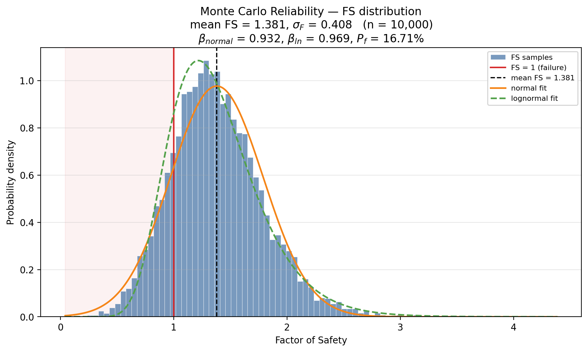{width=1000}

**Mean FS = 1.381, σF = 0.408**, and the shaded tail left of the
FS = 1 line holds **1,671 of the 10,000 realizations — Pf = 16.71%**,
counted rather than inferred. The reliability index comes in two conventions:
βnormal = (F̄ − 1)/σF = **0.932**, and the lognormal
βLN = **0.969** computed from the same sample moments as the Taylor
series uses.

Against 17.48% from five solves, 16.71% from ten thousand. The two estimators
agree to eight tenths of a percentage point on the answer that matters, which is
the ordinary result — the [reliability
overview](../reliability/index.md#when-to-use-monte-carlo-versus-the-taylor-series)
sets out the cases where they part company, and
[VP29](../verification/rocscience.md#vp29) reaches the same conclusion on
Duncan's LASH terminal, where the choice of σ inputs moves the probability of
failure further than the choice of estimator does.

The one visible disagreement is the mean: the Taylor series reports
FMLV = 1.354 and Monte Carlo a mean of 1.381, 2% higher. Both are
right about different things. FMLV is the factor of safety *at* the
mean inputs; the Monte Carlo mean is the *mean of* the factors of safety, and
those differ whenever F curves. The Taylor table above measures the curvature
directly, one parameter at a time, by averaging each parameter's own F⁺ and F⁻
against FMLV. The cohesion's pair averages to 1.354, returning
FMLV to seven digits, because with φ = 0 the factor of safety is
exactly linear in c and a symmetric perturbation of it cancels. The unit weight's
pair averages **+0.0266 above** FMLV, and the Monte Carlo mean sits
**+0.0268 above** it. **The whole gap is the curvature in γ**, which a
first-order method drops by construction and a sampling method does not.

---

## The response surface

Ten thousand real solves resolved Pf to about ±0.7 percentage
points. The third engine gets rid of the count altogether: it solves the real
model a **handful** of times, fits a quadratic to those answers, and samples
the fitted surface ten million times — arithmetic, not solves. Open
**Reliability…** once more and set **Method** to `Response surface (RS)`; the
sample count and convergence stop gray out, because a surrogate's realizations
are nearly free:

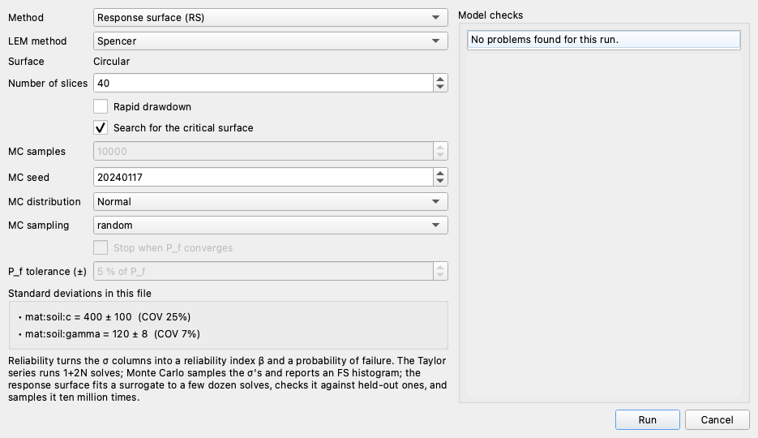

Click **Run**. On this model the engine makes 9 design solves (two uncertain
parameters), then 700 more to *check itself* — 500 across the whole
distribution and 200 in the failure region — and reports in about four
seconds: **Pf = 16.6%**, βLN = 0.998, with the fit's
credentials beside the answer: R² = 0.998, an rms fit error of 0.018 on the
factor of safety, and 1 of the 500 checked draws on the wrong side of
FS = 1. Paired against thirty thousand real solves of the identical draws,
the surrogate's Pf is 0.10 percentage points low — the sampling
error is gone and the *fit* error is what remains, measured. The
[response-surface section](../reliability/monte_carlo.md#sampling-a-fitted-response-surface)
draws the fitted surface, the sample cloud and the F = 1 boundary in one
figure, and states the gate that makes the engine refuse a model it cannot
fit honestly.

---

## Reading β against Pf

The reliability index and the probability of failure are two spellings of one
result. β is the distance from the mean factor of safety to failure, measured in
standard deviations of the factor of safety — on the lognormal scale the
[reliability overview](../reliability/index.md#reliability-equation) gives — and
Pf is the area of that distribution below FS = 1, so
Pf = Φ(−β) and the two always move together:

| Estimator | F | σF | β | Pf |
|---|:---:|:---:|:---:|:---:|
| Taylor series (TSPM) | 1.354 | 0.389 | 0.935 (lognormal) | 17.48% |
| Monte Carlo, 10,000 samples | 1.381 | 0.408 | 0.969 (lognormal) | 16.71% (counted) |

β is the more stable of the two to quote, because Pf is exponentially
sensitive to it: β = 0.935 is 17.5%, β = 2 is 2.3%, β = 3 is 0.13%. The
consequence for a sampled estimate is a resolution limit. Each of the 10,000
realizations is worth 0.01% of Pf, so the 16.71% above rests on 1,671
of them and is solid, while a Pf near 0.05% would rest on five and
would move by a fifth of itself if one realization landed differently. The same
limit is visible from the other side on
[VP28](../verification/rocscience.md#vp28), where SLOPE/W's own 10⁴-sample
campaign reports a 0.04% probability of failure that is four realizations.
Resolving a small Pf by counting means paying for the samples; the
Taylor series gets there by extrapolating a fitted tail from β, which costs
nothing and assumes the tail's shape.

---

## Which uncertainty is worth reducing

σF = 0.389 is built from two contributions, and they are not equal.
The **Parametric…** dialog computes the split: set **Method** to `Spencer` and
**Plot type** to `Variance Pareto (σ)`, which is offered only for a model that
carries standard deviations. The sweep table below it stays empty — this plot
reads every σ-carrying material and ignores the table, as the note under it says:

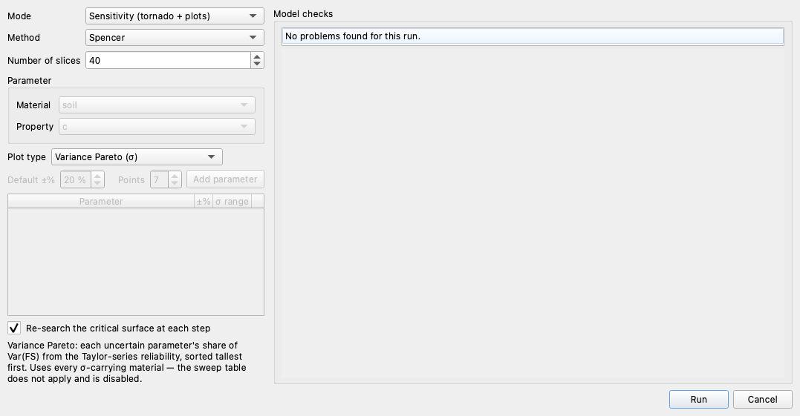

Click **Run**. The bars are the two parameters, tallest first, with the running
total over them:

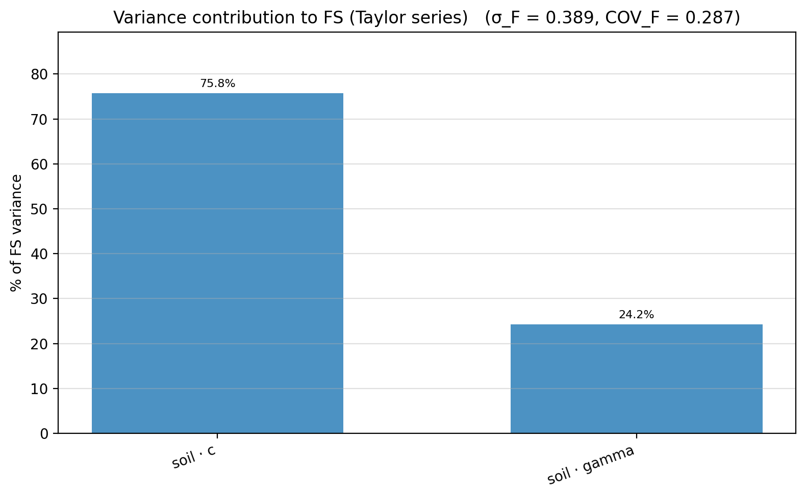{width=800}

Each bar is that parameter's own (ΔF/2)² term as a share of σF², which
is the same arithmetic the Taylor series already did — the cohesion carries
**75.8%** of the variance and the unit weight **24.2%**. Cohesion dominates on
the width of its uncertainty and not on the slope's sensitivity to it. Divide
each ΔF by the coefficient of variation that produced it and the unit weight is
the more powerful parameter: 0.383 over 6.7% is 0.057 of factor of safety per 1%
of γ, against 0.677 over 25% for 0.027 per 1% of c. Per unit of change γ moves
the answer twice as far — but c is asked over an interval nearly four times
wider, and the variance is what the interval is squared into.

Three quarters of the uncertainty in the answer is therefore in one number, and
that number is the one further site investigation would narrow. Another round of
undrained testing on this clay would buy a smaller s(c) and nothing else.

### Halve it

Open **Materials**, select the clay, and change the **± σ** beside **c** from
`100` to `50`. In the table view — and on the mat sheet — this is the second cell
of the two-column **Standard Deviations** block:

| s(g) | s(c) |
|:---:|:---:|
| 8 | 50 |

Nothing else on the row moves: **γ** is still `120`, its σ still `8`, and the
cohesion itself is still `400`:

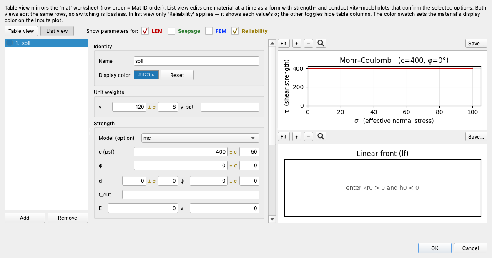

Click **OK** and run **Reliability…** again on the Taylor series, then a second
time on Monte Carlo, with everything else as before:

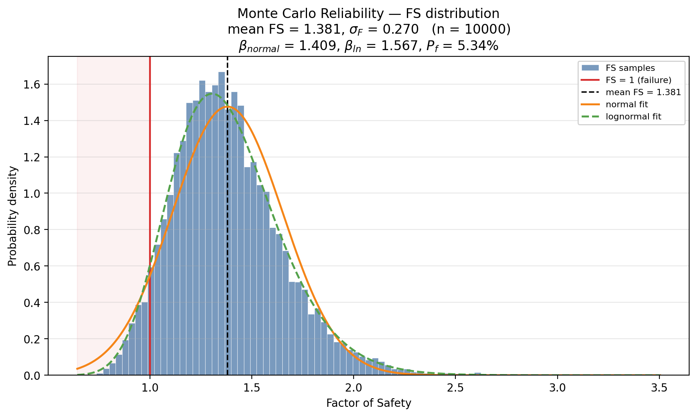{width=1000}

The histogram is the same shape drawn on a narrower base. Beside the run before
it:

| Run | F | σF | βLN | Pf |
|---|:---:|:---:|:---:|:---:|
| TSPM, s(c) = 100 | 1.354 | 0.389 | 0.935 | 17.48% |
| TSPM, s(c) = 50 | 1.354 | 0.256 | 1.526 | 6.36% |
| Monte Carlo, s(c) = 100 | 1.381 | 0.408 | 0.969 | 16.71% |
| Monte Carlo, s(c) = 50 | 1.381 | 0.270 | 1.567 | 5.34% |

**The factor of safety is unchanged at 1.354, to every digit.** Nothing about the
slope moved — the same clay at the same strength on the same critical circle. The
probability of failure fell from roughly one in six to roughly one in sixteen,
11.1 percentage points, and the failed count in the Monte Carlo campaign fell
from 1,671 realizations to 534. What was bought was not strength but knowledge of
it, and only a probabilistic analysis can be shown that purchase at all.

The unit weight's contribution is what remains. Its ΔF is 0.383 before the edit
and 0.383 after — untouched, because nothing about γ changed — and it now carries
56% of a smaller variance instead of 24% of a larger one. A second halving of
s(c) would buy correspondingly less; the parameter to attack next is the one the
Pareto puts first *after* the edit, which is why the measurement is worth
repeating rather than doing once.

---

## When to use which

All three engines read the same σ columns and none needs an input the others do
not, so the choice is about cost and about what is being asked.

| Engine | Real solves here | What it returns | What it assumes |
|---|:---:|---|---|
| Taylor series | 5 | β, lognormal Pf, the per-parameter table | F is first-order near the means |
| Monte Carlo | 2,000–10,000 | the whole distribution; Pf *counted* | only the input distributions |
| Response surface | ~710 | MC-grade statistics with sampling error removed | F is quadratic — and it *checks* |

- **The Taylor series** is the screen: five solves, seconds, and the engine
  behind both the variance Pareto and the finite-element reliability path. It
  summarizes F by its slope at the mean values, and everything above shows what
  that discards (the curvature in γ) and what it keeps (the ranking, the
  variance, β itself).
- **Monte Carlo** is the reference: nothing assumed about the shape of F, the
  tail counted rather than fitted. The convergence stop sets its cost to the
  resolution actually asked, and Latin hypercube stretches each solve about
  three-fold. It is the engine to reach for when the first-order assumptions
  break — a coefficient of variation so large that x − σ is not a physical
  value ([VP34](../verification/rocscience.md#vp34), a fill whose friction
  angle carries a 124% COV), a strongly non-linear response, or a wanted
  empirical tail — and it is the arbiter when the other two disagree.
- **The response surface** is the precision instrument: tail resolution no
  count can afford, for a few hundred real solves — *when its gate accepts*.
  It refuses exactly the models Monte Carlo exists for (VP34's gate finds a
  third of the surrogate's failures have no real solution, and refuses), and
  its β differs from Monte Carlo's in the third decimal because a quadratic
  slightly under-disperses σF. Quote its Pf with the
  gate credentials it prints beside it.

A working habit: screen with the Taylor series, decide with Monte Carlo at the
default convergence stop, and reach for the response surface when the tail
itself is the question — checking it against a Monte Carlo run once, since the
two sampling engines share their draws by construction.

No engine randomizes the failure surface — the slip surface is a decision, not
a random variable. The Taylor series searches at every one of its 1 + 2N
solves, each perturbation finding its own critical surface; the two sampling
engines find the surface once, at the most-likely values, and hold it across
their realizations, which is what the commercial limit-equilibrium codes do in
their probabilistic modes.

---

## Conclusion

This tutorial demonstrated:

- The **± σ** boxes the materials editor's **Reliability** toggle reveals, on
  this clay's `s(g)` = 8 and `s(c)` = 100 — coefficients of variation of 6.7% and
  25%.
- A deterministic Spencer search at **FS = 1.354** on a circle tangent to the
  rigid base, and the Taylor series over that same search: **σF =
  0.389**, **βLN = 0.935**, **Pf = 17.48%** from 1 + 2N =
  five solves.
- Monte Carlo on the same surface: **mean FS = 1.381**, **σF =
  0.408**, **βLN = 0.969**, and **Pf = 16.71%** counted as
  1,671 of 10,000 realizations — within a percentage point of the Taylor series.
- Where the two means differ: the +0.027 gap is the curvature in γ, matched to
  the digit by the average of the Taylor table's own γ perturbations.
- The variance Pareto measuring **75.8%** of σF² onto the cohesion and
  **24.2%** onto the unit weight, and what halving the dominant σ does — Pf
  from **17.48% to 6.36%** (TSPM) and **16.71% to 5.34%** (Monte Carlo) with the
  factor of safety fixed at 1.354.
- The response surface reaching the same answer from **709 real solves** —
  Pf = 16.6% with its fit credentials printed beside it — and the
  three-engine habit: screen with the Taylor series, decide with Monte Carlo,
  bring in the response surface when the tail is the question.

**Where to go next:** the [tutorials index](index.md) lists the series.
[Reliability Analysis](../reliability/index.md) gives the theory and the equation
each index is built from, the [Taylor Series](../reliability/taylor.md) and
[Monte Carlo](../reliability/monte_carlo.md) pages document the two engines, and
[Reliability Analysis (FEM)](../reliability/fem.md) runs the same Taylor series
with a strength-reduction factor of safety in place of a limit-equilibrium
search.
