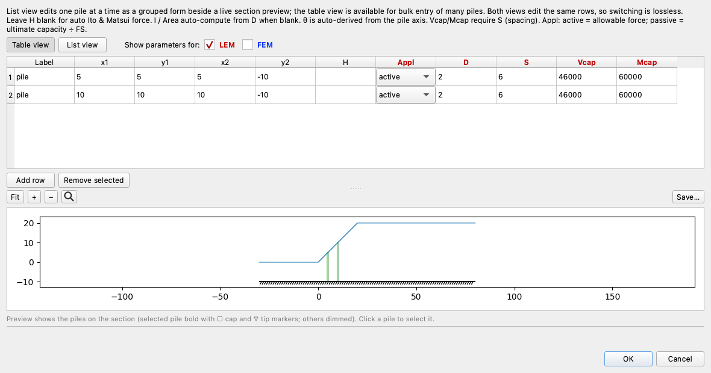
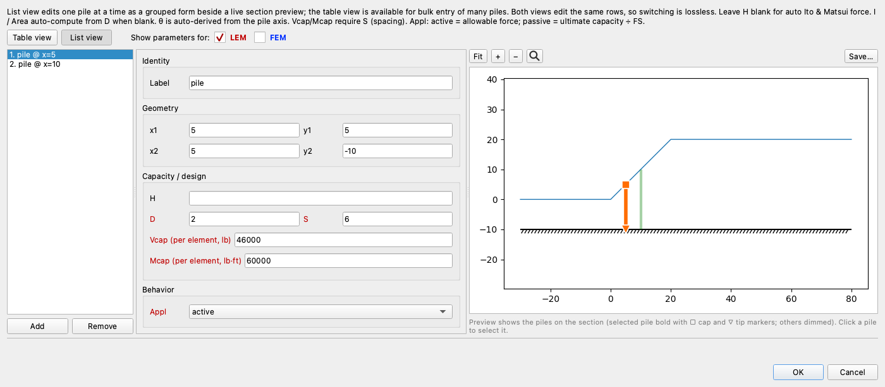
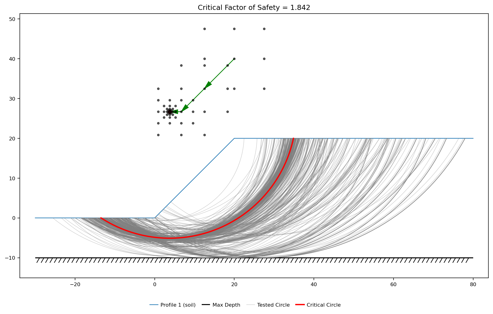
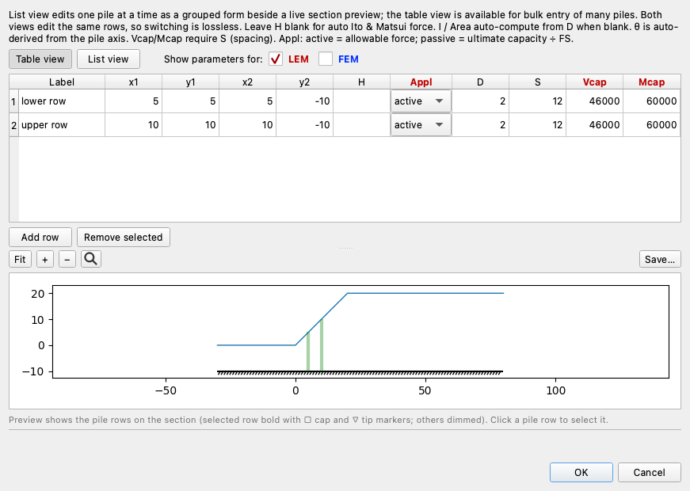
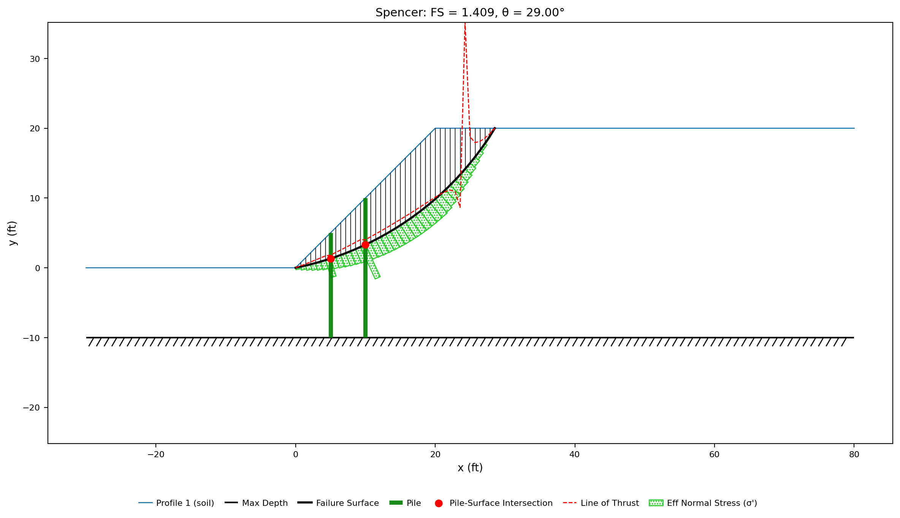
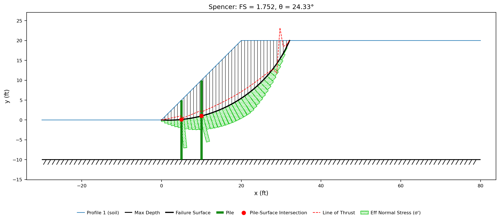
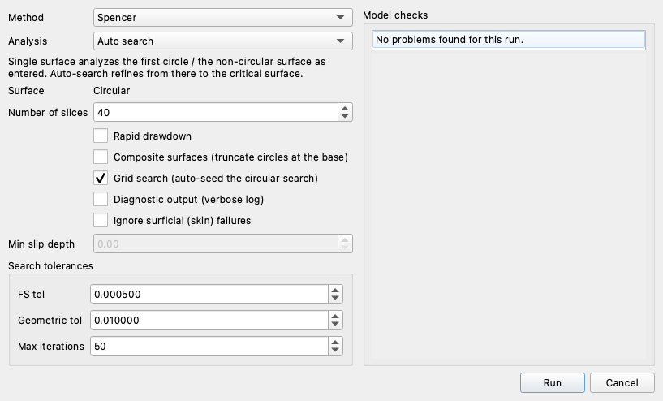
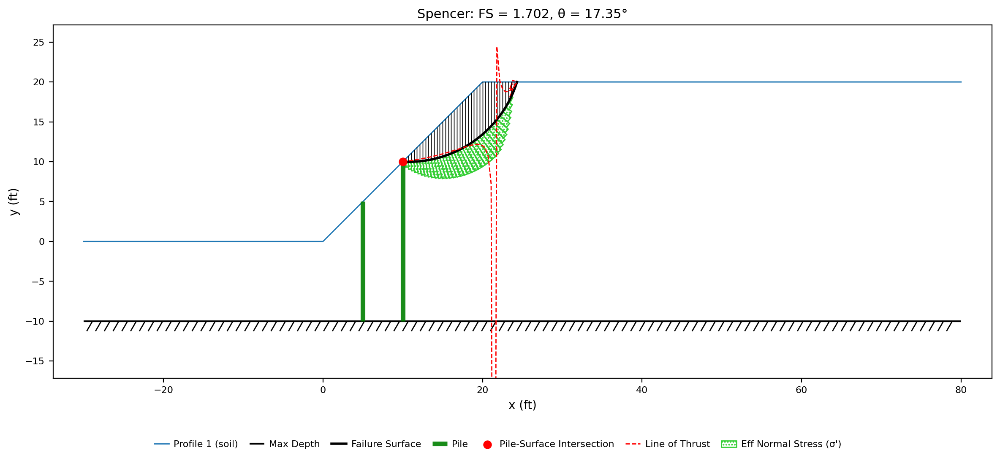

# Tutorial LEM-12 — Piles

This tutorial shows how to model stabilizing piles in a limit equilibrium
analysis. The example is a 20 ft slope in medium-stiff clay that stands at a
factor of safety of 1.149 on its own; two rows of 2 ft drilled shafts
through the face bring it to 1.842. The pile force is not entered anywhere
in the model. The force column, `H`, is left blank, which tells XSLOPE to
compute the lateral force the soil can push onto each pile — from the pile diameter
and the center-to-center spacing, by the Ito & Matsui (1975) method — and to
recompute it for every trial surface the search tries. This is the second of
the two ways XSLOPE models a pile: the tieback wall tutorial
([LEM-9](lem09_tieback_wall.md)) entered its soldier pile the other way,
with the force stated directly, and this page compares the two routes.

Analysis
Limit equilibrium

Open &amp; explore
~15 min

**Objectives** — Model two rows of drilled shafts whose lateral force XSLOPE
computes by the Ito & Matsui method, find the computed force in the analysis
report, measure what the piles are worth and what widening their spacing
costs, see the shafts' moment capacity reduce the soil force to a fifth of
its value, and check for the shallow surface that slides over the top of the
pile row.

one materialpilesIto &amp; Matsuipile spacingstructural capacityspecified pile forcecircular searchgrid seeding

**Completed model** — [xslope_piles.xlsx](../lem/files/xslope_piles.xlsx), the same file used by [LEM Sample Problem 10](../lem/samples.md#10-slope-stabilized-with-piles)

---

## The slope

The slope itself is kept simple so that everything interesting on this page
comes from the piles. It is a single soil — a medium-stiff clay with γ = 120 pcf,
c = 200 psf, and φ = 20° — over a rigid
base 10 ft below the toe. The face rises 20 ft at 1:1 from (0, 0) to (20, 20),
with level ground either side. There is no water — the clay's **u** is `none` —
so the section is analyzed dry and the strength on every slice base is the
Mohr-Coulomb pair above.

Two rows of drilled shafts stand vertically through the face, 2 ft in
diameter at 6 ft centers, each row running along the length of the slope and
taken down to the rigid base. The 2D section models each row per foot of
slope — a pair of isolated piles would be a three-dimensional problem and
does not belong in a tool like this. The upper row is at
x = 10, where the ground is at elevation 10; the lower at x = 5, where it is at
elevation 5.

### Opening the model

Download [xslope_piles.xlsx](../lem/files/xslope_piles.xlsx) and open it in
Studio — **File → Open**. The Inputs plot draws the section, the starting circle
the file carries, and the two pile rows as green bars:

{width=1000}

The piles carry no force label, because on this model the force is not an input.
Where a pile states its own force — the soldier pile of
[LEM-9](lem09_tieback_wall.md#running-the-analysis) does — the Inputs plot prints
it beside the bar.

### The pile rows

Everything XSLOPE needs to know about the two pile rows sits in two rows of
the piles sheet. Read them closely before running anything. Open
**Piles** in the **Inputs** tree and press **Table view**. Its columns match
the piles worksheet; with **Show parameters for:** set to **LEM**, the
columns only the finite element engine reads (`E`, `I`, `Area`, `Fixity`)
are hidden:

Each row of the sheet describes one pile row. The columns after the
endpoints control how the pile force is computed, limited, and applied:

| Label | x1 | y1 | x2 | y2 | H | Appl | D | S | Vcap | Mcap |
|---|:---:|:---:|:---:|:---:|:---:|---|:---:|:---:|:---:|:---:|
| `lower row` | 5 | 5 | 5 | -10 | | | 2 | 6 | 46000 | 60000 |
| `upper row` | 10 | 10 | 10 | -10 | | | 2 | 6 | 46000 | 60000 |

**H is empty on both rows.** `H` is the pile force per foot of slope — the
lateral resistance a row contributes to the equilibrium equations. Leaving
it blank while giving a diameter `D` and a spacing `S` tells XSLOPE to
compute that force by the Ito & Matsui method; entering a number in `H`
uses that number instead.
The direction of the pile force is not entered: XSLOPE takes it
perpendicular to the pile's own axis, which for these vertical shafts means
horizontal — the usual case for a stabilizing pile. A blank `Appl` means
`active`: the force enters the equilibrium equations as it stands. The sheet
leaves the cell blank, and Studio's table shows the resolved choice —
`active` in its dropdown — rather than the blank, which is why the table
above and the editor screenshot below disagree at a glance. The
alternative, `passive`, treats the force as a resistance and divides it by
the factor of safety, so the support carries the same margin as the soil
strength.

**Vcap and Mcap are properties of one shaft**, not of a foot of slope: 46,000 lb
of shear capacity and 60,000 ft·lb of moment capacity, consistent with a 2 ft
reinforced concrete section at f′c = 4,000 psi. They bound whatever
the soil calculation produces, and on this model they bind hard.

Press **List view** to read one shaft at a time, as a form in four groups —
**Identity**, **Geometry**, **Capacity / design**, **Behavior** — with the
preview drawing the selected pile bold on the section:

{width=1000}

The **Capacity / design** group puts the empty **H** directly above the **D** and
**S** it will be computed from, and the two capacity fields carry their own
per-shaft units in their labels: **Vcap (per element, lb)** and
**Mcap (per element, lb·ft)**.

---

## Running the analysis

With the inputs understood, run the search and see what the piled slope
does. Click **Run LEM…** and choose **Method** = `Spencer` and **Analysis** =
`Auto search`, with the slice count left at 40:

Click **Run**. The search walks the circle the file carries down onto the rigid
base, and the plot draws every circle it tried in gray with the one it kept in
red:

{width=1000}

**FS = 1.842**, on a circle centered at (3.79, 26.69) with a radius of 31.79,
tangent at elevation −5.10. The solution plot draws that surface with its base
stresses and marks the two points where it cuts the piles:

{width=1000}

The surface enters 13.5 ft out in front of the toe, exits 14.9 ft behind the
crest and carries 62,198 lb/ft of clay on 61.27 ft of base. The two red dots are
the pile crossings, at elevation −5.07 on the lower shaft and −4.48 on the upper
one — 10.07 ft and 14.48 ft of soil above the surface at each pile, which is the
depth the force is computed over.

### What the two rows are worth

FS = 1.842 describes the reinforced slope, but it does not say what the
piles contributed. Measuring that takes two comparisons: first the slope
without any piles, then the same surface with each row removed in turn.

Taking the piles out and searching the same slope again — same clay, same
geometry, same starting circle, a separate search with its own critical surface —
gives the slope on its own:

{width=1000}

**FS = 1.149** on a shallower circle from the toe, tangent at elevation −0.04,
moving 21,166 lb/ft against the piled surface's 62,198. The piles raise the
factor of safety by 0.69, and they also change the failure mechanism: the surface the
search settles on with them present is deeper, longer and three times the mass,
because the shallower one now has two shafts across it.

To separate the two rows' contributions, hold the surface still. On the piled search's
own critical circle — **one surface, no search, only which piles are present
changing** — each row can be removed on its own:

| Piles present | Spencer FS |
|---|:---:|
| Neither | 1.481 |
| Lower row only | 1.675 |
| Upper row only | 1.613 |
| Both | 1.842 |

The lower row is worth slightly more than the upper one on this surface even
though it is the shallower of the two, because its crossing sits nearer the toe
where the base is flatter and the force resolves more directly against sliding.

---

## Where the computed force appears

So far the pile force has been invisible: the plot shows its effect on the
factor of safety, but not the force itself. To see the number, generate the
**Analysis Report**. With the run still loaded, **File → Generate Report…** writes a Word
document whose limit equilibrium section carries the pile inputs and the solved
slice table ([Analysis Report](../studio/reports.md) documents the whole
document).

In the report's **Piles** table, the `H` cell of both rows reads
**computed**, meaning the force was calculated rather than entered:

| Label | Top (x, y) | Bottom (x, y) | H (lb/ft) | θ (deg) | D (ft) | Spacing (ft) |
|---|:---:|:---:|:---:|:---:|:---:|:---:|
| lower row | (5, 5) | (5, −10) | computed | 0 | 2 | 6 |
| upper row | (10, 10) | (10, −10) | computed | 0 | 2 | 6 |

The computed force appears in the slice table under Spencer's method, in the column
**Hp**, whose legend reads *pile resistance mobilized at the slice
base, per unit thickness*. Two of the forty slices carry one: slice 16, whose
center is at x = 5.29, takes **2,540.7 lb/ft**, and slice 20, at x = 10.00,
takes **1,827.0 lb/ft**. The column total at the foot of the table is
**4,367.6 lb/ft** — the whole of what the pile row delivers to this surface, on
one line.

---

## How the force is computed

The report says what the piles delivered. This section explains where those
numbers come from, because understanding the calculation is what makes the
rest of the page — the capacity limits, the spacing study — predictable
rather than mysterious.

Ito & Matsui treat the soil between two adjacent piles as squeezing plastically
through the gap between them, and derive from Mohr-Coulomb plasticity the lateral
pressure that flow puts on each pile. The pressure at depth z is
p(z) = c·A₁ + γz·A₂, with A₁ and A₂ arching coefficients that depend only on the
friction angle and on the ratio of the center-to-center spacing S to the clear
gap S − D. On this clay at φ = 20° with D = 2 and S = 6, they are **A₁ = 7.569
ft** and **A₂ = 4.755 ft**.

The force on one pile is that pressure integrated from the ground surface down to
the failure surface, and the per-foot-of-slope force is that divided by the
spacing. **Both depend on where the trial surface is**, so both are recomputed at
every surface a search evaluates — a deeper surface means a taller soil column
pushing on the pile. On the critical surface above:

| | Lower row | Upper row |
|---|:---:|:---:|
| Depth to the surface, zf (ft) | 10.07 | 14.48 |
| Soil force per pile, Fpile (lb) | 44,178 | 81,729 |
| Soil force per foot of slope, Fpile/S (lb/ft) | 7,363.0 | 13,621.5 |

The deeper the surface, the larger the force: the upper row, whose head
stands 5 ft higher on the
face, has 44% more soil above the surface and develops 85% more force per shaft.
[Piles and Concrete Piers](../lem/piles.md#ito-matsui-1975-theory)
gives the derivation, the coefficients in full and the φ = 0 and c = 0 special
cases; the method is applicable for S/D between about **2 and 8**, and this
model's S/D = 3 sits in the middle of that band.

Neither of the forces above is what reached the slice table. The 7,363.0 and
13,621.5 lb/ft the soil is capable of delivering became 2,540.7 and 1,827.0 by
the time they were applied, and the reason is the shafts themselves.

---

## What the structural capacity does

The Ito & Matsui force is the soil's capacity to push, not the pile's capacity to
resist. `Vcap` and `Mcap` are the second half of the answer: the force actually
used is the lesser of the soil force, the shear capacity, and the force the
moment capacity permits, Mcap/Lm, where Lm is the
arm from the centroid of the computed pressure distribution down to the failure
surface.

On the critical surface both shafts are governed by bending:

| | Lower row | Upper row |
|---|:---:|:---:|
| Soil force per pile (lb) | 44,178 | 81,729 |
| Shear limit, Vcap (lb) | 46,000 | 46,000 |
| Moment arm, Lm (ft) | 3.94 | 5.47 |
| Bending limit, Mcap/Lm (lb) | 15,244 | 10,962 |
| Force used, per pile (lb) | 15,244 | 10,962 |
| Force used, per foot of slope (lb/ft) | 2,540.7 | 1,827.0 |

The lower shaft's soil force is inside its shear capacity and still nearly three
times what its section can carry in bending; the upper shaft exceeds both — by
78% in shear and by a factor of seven and a half in bending. The caps cut the
delivered force by 65% and 87%, and the deeper pile — the one the soil pushes
hardest on — ends up delivering *less* than the shallower one, because its
pressure centroid sits further above the failure surface and the same moment
capacity buys a smaller force at a longer arm.

To see how much the caps matter, remove them. This too is a **single-surface
run on the search's own critical circle, with only the two capacity cells
changing**:

| Capacities given | ΣH (lb/ft) | Spencer FS |
|---|:---:|:---:|
| Vcap and Mcap (as shipped) | 4,367.6 | 1.842 |
| Mcap only | 4,367.6 | 1.842 |
| Vcap only | 15,029.7 | 4.207 |
| Neither | 20,984.6 | 12.739 |

Bending alone reproduces the shipped answer exactly, so the moment capacity is
doing all of the limiting on this surface. Left uncapped, the soil force would
report a factor of safety of 12.739 on a slope that stands at 1.149 without the
piles — an answer that asks the two shafts to carry three and seven and a half
times the moment their sections are designed for.

---

## What the spacing is worth

The capacities are fixed by the concrete section, but the spacing is a
choice — it is the main variable a designer adjusts once the diameter is
set. Pile spacing affects the computed force in two ways: closer piles arch more
strongly, so each pile takes a larger share of the
soil force, and closer spacing puts more shafts under each foot of slope. Both
effects work in the same direction.

Widening the spacing to 12 ft is one cell on each row — **S** from `6` to `12`,
with **H** still blank so the force is recomputed at the new spacing:

Sweeping the spacing across the applicable band is a **held-surface study: one
circle, the search's own critical surface, and nothing changing but S**. The
diameter stays at 2 ft, so S/D runs from 1.5 to 8. The soil-force column is the
uncapped Ito & Matsui force, lower row then upper row; ΣH is what survives the
capacities and reaches the slices:

| S (ft) | S/D | A₁ (ft) | A₂ (ft) | Soil force per pile (lb) | ΣH used (lb/ft) | Spencer FS |
|:---:|:---:|:---:|:---:|:---:|:---:|:---:|
| 3 | 1.5 | 41.709 | 17.181 | 188,549 / 336,891 | 8,386.6 | 2.354 |
| 4 | 2.0 | 15.184 | 7.526 | 76,378 / 138,639 | 6,405.7 | 2.072 |
| 5 | 2.5 | 9.792 | 5.564 | 53,580 / 98,345 | 5,192.2 | 1.929 |
| 6 | 3.0 | 7.569 | 4.755 | 44,178 / 81,729 | 4,367.6 | 1.842 |
| 8 | 4.0 | 5.621 | 4.046 | 35,938 / 67,165 | 3,316.3 | 1.741 |
| 10 | 5.0 | 4.741 | 3.725 | 32,217 / 60,588 | 2,673.4 | 1.684 |
| 12 | 6.0 | 4.241 | 3.544 | 30,104 / 56,854 | 2,239.4 | 1.648 |
| 16 | 8.0 | 3.695 | 3.345 | 27,796 / 52,774 | 1,690.7 | 1.604 |

The arching coefficients fall steeply as the gap opens — A₁ loses nine tenths of
its value between S/D = 1.5 and 8 — and the force per foot of slope falls with
them, from 8,386.6 lb/ft to 1,690.7. The two rows at the top of the table are
outside the method's applicability: at S/D = 1.5 the piles are close enough to act
as a continuous wall rather than as a row soil can flow between, and XSLOPE prints
a warning that the computed force is very large. Above S/D = 8 the arching the
theory is built on is no longer there to compute.

Widening the spacing does not only lower the number on this surface. Searching
the model at 12 ft — a separate search with its own critical surface — puts the
answer somewhere else entirely:

{width=1000}

**FS = 1.409**, and the surface is not the deep one the table's 1.648 was measured
on: it leaves the toe, reaches 10.1 ft below the ground at its deepest, exits
8.5 ft behind the crest, and carries 20,525 lb/ft against the deep surface's
62,198. Weakening the pile row hands the slope back to a
mechanism the piles were holding — which is why the held sweep is for reading
the trend, and any spacing actually being considered gets its own search.
[VP106](../verification/rocscience.md#vp106) is this same sweep on Cai & Ugai's
pile-reinforced slope, at four spacings, with the computed forces checked against
Slide2 and against the paper.

---

## Giving the force yourself

Everything so far has used the computed path. The other way to enter a pile
is to state its force outright, as
[LEM-9's soldier pile](lem09_tieback_wall.md#the-problem) does — a number from
a p-y analysis (a lateral load–deflection model of the shaft), a structural
check or a published chart, entered per foot of slope.
Typing one into **H** turns the Ito & Matsui calculation off for that row; nothing
else changes.

A natural test is to enter the forces the automatic run computed — the
two values the report printed:

| H |
|:---:|
| 2540.7 |
| 1827.0 |

**Solved on the search's own critical circle — one surface, no search, only the
H column changing — the two paths give the same answer**, 1.842 either way: a
stated force and a computed force enter the equilibrium equations identically.
The difference is not in the arithmetic but in what happens when the surface
moves.

Searching with the stated forces shows the difference:

{width=1000}

**FS = 1.752**, on a shallower circle from the toe — tangent at elevation −0.04,
14.5 ft below the ground at its deepest, carrying 32,929 lb/ft. Held on that
circle, the two ways of entering the pile no longer agree:

| Surface | Computed (H blank) | Stated (2,540.7 / 1,827.0) | No piles |
|---|:---:|:---:|:---:|
| The auto search's critical circle | 1.842 | 1.842 | 1.481 |
| The shallower circle above | 1.896 | 1.752 | 1.213 |

On the shallow circle the computed path develops **5,178.6 lb/ft**, more than the
4,367.6 the stated numbers freeze in, and neither shaft's share is what it was.
The lower one now has only 4.88 ft of soil above the surface, so its soil force
of 14,189 lb passes both capacities untouched and it delivers 2,364.9 lb/ft. The
upper one is still bending-limited, but at a 3.55 ft arm instead of a 5.47 ft
one, so the same 60,000 ft·lb buys 16,882 lb of force and it delivers 2,813.7.
The stated numbers were correct for one depth and are 16% low at another, and a
search cannot tell: it returns 1.752 as the minimum because the frozen force is
under-crediting the very surface it settles on. A force stated per surface has to
be stated for the surface that governs, which is not known until the search is
done. [VP54](../verification/rocscience.md#vp54) is the verified case of the
stated-force route, a micro-pile row entered with its shear resistance given
directly.

---

## Looking above the pile row

One question remains before the design can be trusted: did the search look
everywhere it should? Every search so far started from the circle on the
sheet, and that circle
reaches the rigid base. **Grid search (auto-seed the circular search)** ignores
the circles sheet and sweeps a grid of centers against a range of tangent
elevations instead ([LEM-10](lem10_global_minimum.md#grid-search) is where that
tool is built). Back in **Run LEM…**, tick it and leave everything else:

Run again:

{width=1000}

**FS = 1.702**, below the 1.842 the seeded search reported, on a surface that
never engages the piles. It daylights (cuts back up to the ground surface)
at (10.00, 10.00), the head of the upper shaft, runs back to the crest at
x = 24.3, and is 6.5 ft deep at its deepest,
moving 6,867 lb/ft. The depth from the ground surface to the failure surface at
the pile is zero, so the Ito & Matsui integral over that depth is zero: the whole
pile row contributes **0.04 lb/ft** to a surface that slides over the top of it.

This is an important check for any pile design. The piles hold the deep mechanism, and
holding it promotes whatever the next mechanism is; here the next one runs above
the pile heads and takes nothing from them. It is not a numerical artifact —
**Min slip depth** at 5 ft leaves it untouched, because 6.5 ft of clay is moving —
and the same slope searched without piles at all returns 1.149 from either
seeding, so it is adding the piles that makes the shallow surface critical.
The same behavior is
recorded on [VP54](../verification/rocscience.md#vp54), where a free search on a
micro-piled slope finds a circle exiting upslope of the pile row.

Raising the pile heads, lengthening the row upslope, or adding a row above the
crest are the design answers; each is a change to the model, and each has to be
searched again from a grid.

---

## Conclusion

This tutorial demonstrated:

- A pile row whose **H is blank**, which is what puts the run on the Ito & Matsui
  path: the lateral force computed from the 2 ft diameter and the 6 ft spacing,
  at the depth each trial surface reaches at each shaft, and recomputed for every
  surface a search evaluates.
- Where that force is readable — the report's **Piles** table saying `computed`
  where an input would be, and the slice table's **Hp** column carrying
  **2,540.7** and **1,827.0 lb/ft** on the two slices the piles cross, totalling
  **4,367.6 lb/ft**.
- A Spencer search at **FS = 1.842** against **1.149** for the same slope with the
  piles removed, and each row's own share measured on one held circle: 1.675 for
  the lower alone, 1.613 for the upper, 1.481 for neither.
- The structural capacities cutting the soil force by 65% and 87% — 44,178 and
  81,729 lb per shaft down to 15,244 and 10,962 — with the moment capacity
  governing both, against **12.739** for the uncapped soil force alone.
- Spacing swept from S/D = 1.5 to 8 on one held surface: the force per foot of
  slope from **8,386.6 lb/ft to 1,690.7**, the factor of safety from **2.354 to
  1.604**, and a searched answer of **1.409** at 12 ft spacing on a mechanism the
  closer spacing had suppressed.
- A stated force against a computed one: identical at **1.842** on the surface the
  stated numbers came from, and **1.752 against 1.896** one surface away, where
  the frozen force is 16% below what the same piles would develop.
- The shallow bypass — grid seeding finding **1.702** on a wedge that daylights at
  a pile head and takes **0.04 lb/ft** from the row it slides over.

**Where to go next:** the [tutorials index](index.md) lists the series.
[Piles and Concrete Piers](../lem/piles.md) derives the Ito & Matsui equations,
the capacity checks and the per-unit-width convention;
[Sample Problem 10](../lem/samples.md#10-slope-stabilized-with-piles) catalogues
this model with its factor of safety by every method;
[LEM-9](lem09_tieback_wall.md) enters a pile with its force stated, beside the
tieback anchors it carries; and [VP106](../verification/rocscience.md#vp106) and
[VP54](../verification/rocscience.md#vp54) check the computed and stated routes
against published solutions.
