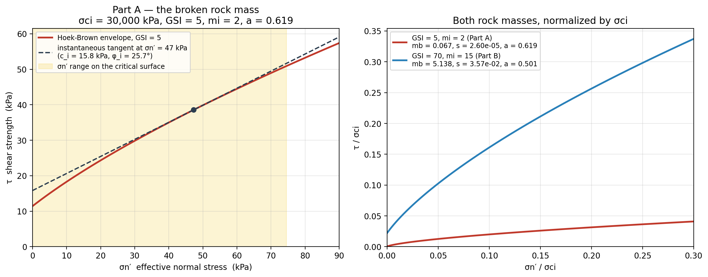
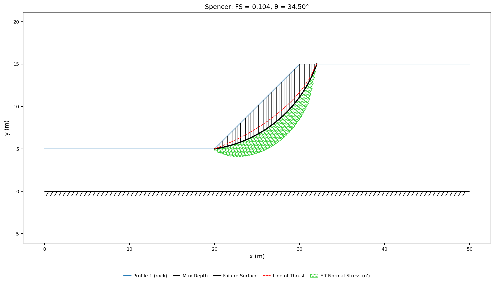
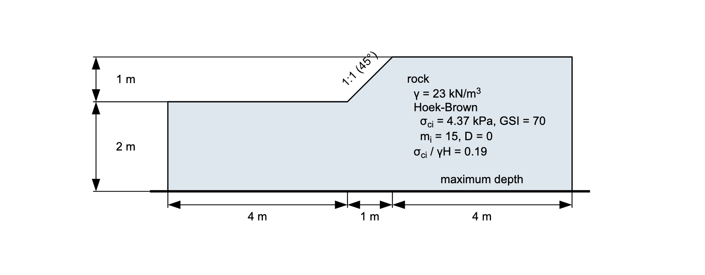
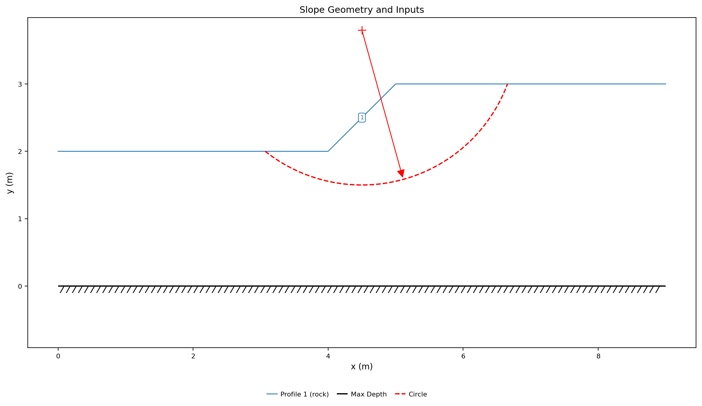
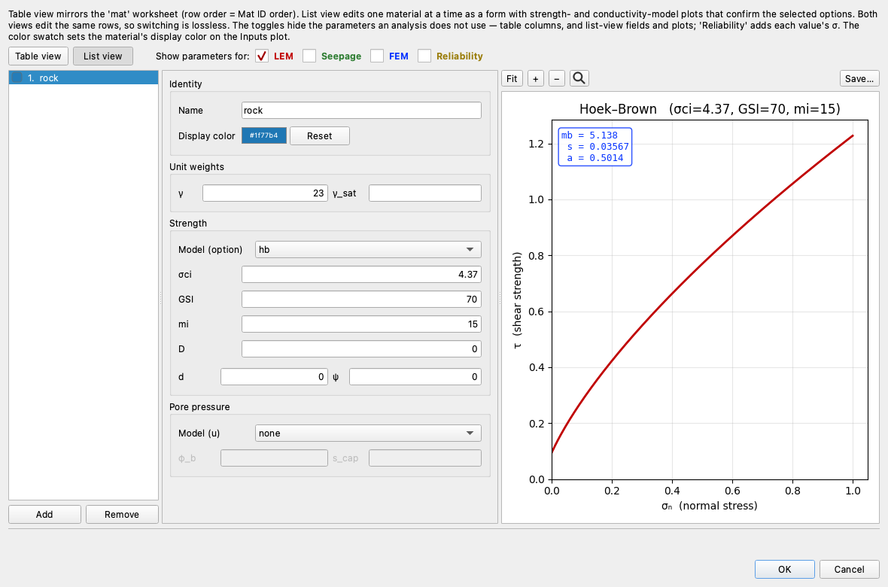
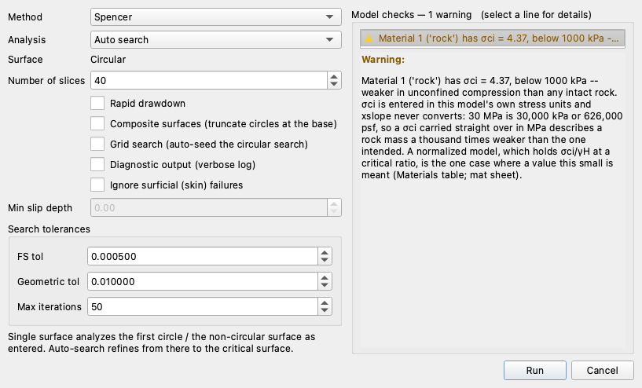
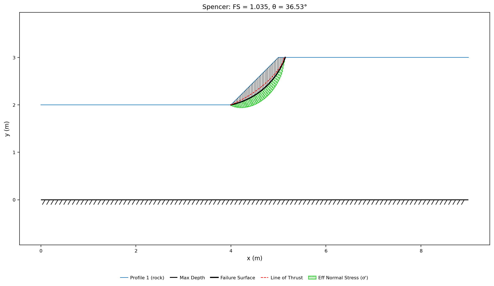
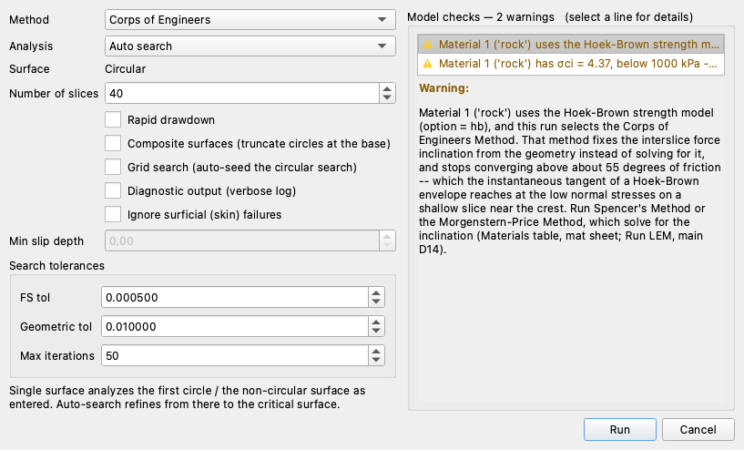

# Tutorial LEM-13 — A Rock Slope (Hoek-Brown)

Two rock slopes, neither of which has a cohesion or a friction angle to enter.
Part A is a 10 m cut at 45° in a rock mass so heavily jointed that its strength
is a small fraction of the intact rock's, taken through Spencer's method and then
through finite element strength reduction on the same file — and read once more
with its intact strength typed in the megapascals the literature quotes rather
than the kilopascals the model works in. Part B is a slope in the opposite
material, strong rock with widely spaced joints, stated in the normalized form
rock-slope charts use. **A rock mass gets its strength from a curve, and the four
numbers that curve is built from are field observations, not laboratory
constants.**

{width=1000}

Analysis
Limit equilibrium, finite element

Open &amp; run
~20 min

**Objectives** — Learn how to analyze a rock slope with the generalized
Hoek-Brown criterion: what the four inputs mean and where they come from, what
XSLOPE derives from them, how the criterion reaches a method of slices that wants
a cohesion and a friction angle, and what stress units cost when the criterion is
carried over from the literature.

one materialHoek-BrownGSIdisturbance factorinstantaneous tangentcircular searchquadratic trianglesstrength reductionmodel checks

**Completed models** — [xslope_rock_slope.xlsx](files/xslope_rock_slope.xlsx),
the weak rock mass of [the Hoek-Brown verification problem](../verification/rs2.md#hoek-brown),
and [xslope_rock_slope_li.xlsx](files/xslope_rock_slope_li.xlsx), the strong rock
mass of [verification problem RS2-60](../verification/rs2.md#rs2-60). Neither
carries a mesh, so Part A's meshing step is done on the file as downloaded

---

## Part A — A rock mass broken almost to rubble

A straight 45° slope, H = 10 m, in one rock mass at γ = 25 kN/m³, dry, over a
foundation that runs 5 m below the toe with 20 m of level ground on either side.
This is example 1 of Hammah, Yacoub, Corkum & Curran (2005), "The shear strength
reduction method for the generalized Hoek-Brown criterion" (Proc. 40th U.S.
Symposium on Rock Mechanics, ARMA/USRMS Paper 05-810) — the paper that introduced
strength reduction on this criterion — and it is the verification case XSLOPE
locks the `hb` option against in both engines.

### Why a rock mass has no cohesion and no friction angle

The strength of a jointed rock mass comes from two things that a triaxial test on
a core sample cannot separate: how strong the intact blocks are, and how badly the
mass is broken up by the joints between them. A Mohr-Coulomb pair describes
neither. The **generalized Hoek-Brown criterion** describes both, and it is
written in principal stresses rather than as a shear envelope:

$$\sigma'_1 = \sigma'_3 + \sigma_{ci}\left(m_b \dfrac{\sigma'_3}{\sigma_{ci}} + s\right)^{a}$$

Four inputs go into it, and each is something a geologist records rather than
computes:

- **σci** — the uniaxial compressive strength of the **intact** rock,
  from a point-load index or an unconfined compression test on a core. Here
  30 MPa, a weak rock in its own right.
- **GSI**, the **Geological Strength Index** — a single number from 0 to 100
  describing how broken and how weathered the mass is, read off a chart against
  the blockiness of the outcrop and the condition of the joint surfaces. 100 is
  intact rock; 5, the value here, is a mass with no interlocking structure left.
- **mi** — the intact Hoek-Brown constant, a rock-type property that
  runs from about 4 for a claystone to 25 for a granite. Here 2, at the very soft
  end.
- **D**, the **disturbance factor** — from 0 for a surface excavated by careful
  presplit blasting or by machine, to 1 for a heavily blast-damaged face. Here 0.

From those four, XSLOPE derives the three rock-mass constants the equation
actually uses, by the relations of Hoek, Carranza-Torres & Corkum (2002):

$$m_b = m_i \exp\!\left(\frac{GSI - 100}{28 - 14D}\right), \quad
s = \exp\!\left(\frac{GSI - 100}{9 - 3D}\right), \quad
a = \tfrac12 + \tfrac16\!\left(e^{-GSI/15} - e^{-20/3}\right)$$

mb, *s* and *a* are never entered. **The GSI is what does the work in
all three**: it drops mb from mi toward zero as the mass
breaks up, drops *s* from 1 toward zero, and lifts the exponent *a* from the
classical 0.5 toward 0.65.

The method of slices needs shear strength as a function of the normal stress on a
slice base, which the principal-stress form does not give directly. XSLOPE
converts it with **Balmer's (1952) transformation** into the equivalent Mohr
envelope, then linearizes that envelope at each slice's own normal stress into an
**instantaneous tangent** — a cohesion ci and a friction angle
φi that reproduce the curve exactly at that one stress. Every solution
method carries an outer iteration around this: solve with the current tangents,
update the normal stresses from the solution, re-linearize, and repeat until the
factor of safety stops moving. The
[Hoek-Brown section of the LEM overview](../lem/overview.md#hoek-brown-strength)
carries Balmer's equations and the closed form for the tangent.

### Opening the model

Download [xslope_rock_slope.xlsx](files/xslope_rock_slope.xlsx) and open it in
Studio — **File → Open**. The Inputs plot draws the section: one profile line, the
hatched maximum depth at elevation 0, and the starting circle the file carries.

{width=1000}

Open **Materials** and switch to **List view**, which puts the strength
parameters beside a plot of the envelope they define:

The rock's **Model (option)** is `hb`, and the four fields under it are the four
observations: **σci** = 30000, **GSI** = 5, **mi** = 2, **D** = 0. σci
reads 30000 rather than 30 because **XSLOPE never converts units**: every stress
in a model is in the model's own stress unit, kPa here, and 30 MPa is 30,000 kPa.
The box at the top left of the plot reads out what those four produce —
mb = 0.0672, *s* = 2.60 × 10−5, *a* = 0.619 — reproducing
Hammah's Table 1 (0.067, 2.5 × 10⁻⁵, 0.619) to its printed digits. Watch the
exponent: at *a* = 0.619 the envelope is a long way from the classical
square-root shape, which is what makes this a demanding case for the criterion
rather than for the geometry.

The curve beside the fields draws the envelope those constants define, in
τ–σn space over the stress range σci implies. The left panel
below redraws it over the stresses this slope actually generates:

{width=1000}

That envelope is nowhere a straight line. It rises steeply out of the origin and
flattens as the confinement grows, and it starts from almost nothing: the
unconfined strength of the rock **mass** is σci·sa, which at
this GSI comes to 43.5 kPa out of the intact rock's 30,000 — about one part in
700. Almost none of the laboratory strength survives the jointing, and what the
slope stands on instead is confinement.

The two elastic properties the finite element half of this page needs, E = 5,000
MPa and ν = 0.3, are already in the file. They sit behind the **FEM** toggle above
the form, which is unticked here because a limit equilibrium run reads neither.

### Running the analysis

The limit equilibrium answer comes first, because it is the reference the strength
reduction run is read against. Click **Run LEM…** and choose **Method** =
`Spencer` and **Analysis** = `Auto search`, with the slice count left at 40:

**Model checks** reads *No problems found for this run*. Spencer's method solves
for the inclination of the interslice forces rather than fixing it before it
starts, which matters on a rock slope:
[Part B](#a-friction-angle-steep-enough-to-stop-a-method) covers the two methods a
Hoek-Brown envelope can defeat. Click **Run**. The search refines the file's circle
onto a surface that exits at the toe:

{width=1000}

**FS = 1.152**, against Hammah's published 1.152, on a circle centered at
(18.39, 19.93) tangent at elevation 4.92, 16.93 m of failure
surface carrying 954 kN/m of rock. Bishop's simplified method on the same file
gives 1.150 against the paper's 1.153.

### What the criterion supplied along the surface

Every slice base on that surface got its own cohesion and friction angle, because
every slice base sits at its own normal stress. Across the 40 slices the
effective normal stress reaches 74.5 kPa at the deepest part of the arc
and falls to −2.3 kPa at the crest, where the surface is nearly vertical
and there is almost nothing standing on it. The tangent XSLOPE linearized at those
stresses runs from ci = 11.4 to 18.9 kPa with
φi from 23.2° to 36.9°; the steepest of them,
36.9°, is the envelope's own slope at zero confinement, which is where
the criterion is evaluated for any slice the solution puts in tension.
Length-weighted along the surface the pair averages ci = 15.9
kPa and φi = 26.7°, at a mean normal stress of 47.3
kPa — the dashed line on the left panel of the envelope figure above, which touches
the curve at that stress and nowhere else.

That single pair is not a substitute for the criterion. Entered as a
Mohr-Coulomb material it would over-credit the lightly loaded slices near the
crest and under-credit the heavily loaded ones near the toe, which is the whole
reason the outer iteration exists: **the equivalent Mohr-Coulomb pair is an output
of the analysis, one per slice, not an input to it.**

### The MPa slip

Every σci in the rock-mechanics literature is quoted in megapascals,
and this model's stress unit is the kilopascal, so the number most likely to be
copied wrong is the one the paper prints. Try it. Open **Materials**, change
**σci** from `30000` to `30` — Hammah's 30 MPa, typed as the paper gives it —
click **OK**, and open **Run LEM…** again with the same Spencer auto search:

**Model checks — 1 warning**, and it names exactly this mistake:

> Material 1 ('rock') has σci = 30, below 1000 kPa — weaker in unconfined
> compression than any intact rock. σci is entered in this model's own stress units
> and xslope never converts: 30 MPa is 30,000 kPa or 626,000 psf, so a σci carried
> straight over in MPa describes a rock mass a thousand times weaker than the one
> intended. A normalized model, which holds σci/γH at a critical ratio, is the one
> case where a value this small is meant.

**Run** stays enabled, because the entry is implausible rather than invalid. Click
**Run**:

{width=1000}

**FS = 0.104**, against 1.152 on the same file a moment earlier. The mechanism is
recognizably the same one — toe to crest, tangent at elevation 4.83 — but there is
almost nothing holding it: ci now runs from 0.09 to 1.59 kPa where the
correct entry gave 11.4 to 18.9, and φi from 2.4° to 10.9° instead of
23.2° to 36.9°. The unconfined strength of the mass, σci·sa,
scales straight through with σci: 0.0435 kPa against 43.5.

A factor of safety of a tenth is its own alarm, and the check named the cause
before the run started. Change **σci** back to `30000` before going on.

### The same file through strength reduction

The second half of Part A solves this slope again, in the finite element engine,
by reducing the strength until it will no longer stand. Hoek-Brown needs no
special handling there: the tangent is what gets divided by the trial factor, not
σci. Switch the mode strip to **FEM**. **Run → Run FEM…** stays disabled
until a mesh exists, so build one first — click **Run → Build Mesh…**

**Element type** opens on **Quadratic triangles (tri6)**, which is what a strength
reduction run needs; linear elements lock and report a factor of safety that is too
high. **Auto-size from geometry** is unticked and **Target element size** reads
`0.900`, because the file declares that size and a declared size is what turns
auto-sizing off. Leave the rest alone and click **Build**. The mesh comes out at
**3,112 nodes and 1,485 triangles**:

{width=1000}

Now click **Run → Run FEM…**

**Model checks — 1 warning**, and **Run** is enabled. The warning is the blank
tensile cutoff `t_cut`, which lets the rock carry tension up to its Mohr-Coulomb
cone apex; [FEM-1](fem01_strength_reduction.md#running-the-strength-reduction)
covers what that means and when to enter a cap. The dialog opens on **SSRM (find
FS)** with the bracket the file declares, **F min (SSRM)** = 0.80 and **F max
(SSRM)** = 1.60, a **Tolerance (SSRM)** of 0.0100, the iteration budget and ceiling
at their own 12,000 and 50,000, **Rollers** on the sides, **K0 initial stress**
ticked at 1.000, and **Non-convergence** as the failure criterion. Click **Run**.
The run takes a few minutes on an ordinary laptop.

**FS = 1.166**, from a final bracket of [1.1625, 1.1688] in
seven bisection steps. Hammah et al. report 1.15 for the same slope,
solved both with the generalized criterion and with an equivalent Mohr-Coulomb
fit.

{width=1000}

The **FEM · Results** tab opens on **At failure**, the state the run captures by
re-solving beyond the critical factor so the collapse develops far enough to draw.
The contours are viscoplastic shear strain, and the band they draw runs from the
toe up through the face and out onto the crest — the same mechanism Spencer's
circle found, on a surface the finite element run was free to shape any way it
liked.

{width=1000}

The vectors give the direction that field moved in: down and outward at the crest,
swinging through the body of the slope, and nearly horizontal where the band
reaches the toe.

Three readings of one file:

| Reading | XSLOPE | Hammah et al. |
|---|:---:|:---:|
| Bishop's simplified | 1.150 | 1.153 |
| Spencer's method | 1.152 | 1.152 |
| Strength reduction | 1.166 | 1.15 |

The two engines agree to 1.2% on a slope whose strength is nonlinear everywhere,
and each lands within 1.4% of the value the paper published for it. They get there
from completely different discretizations of the same curve: the limit equilibrium
run linearizes the envelope at the base normal stress on each of 40 slices, and the
finite element run linearizes it at every Gauss point on every viscoplastic
iteration.

---

## Part B — The same criterion in strong rock

The second slope runs the same criterion at the other end of its range. GSI = 70
and mi = 15 describe a blocky, lightly jointed mass of a competent rock —
the material Part A's would be if the joints were widely spaced and the surfaces
unweathered. The section is a 45° face 1 m high on a 2 m foundation, with 4 m of
level ground either side, at γ = 23 kN/m³. This is the β = 45° case of

> [Li, A.J., Merifield, R.S., & Lyamin, A.V. (2008)](https://doi.org/10.1016/j.ijrmms.2007.08.010).
> "Stability charts for rock slopes based on the Hoek-Brown failure criterion."
> *International Journal of Rock Mechanics and Mining Sciences* 45(5), 689–700.

and it is [verification problem RS2-60](../verification/rs2.md#rs2-60) in the RS2
corpus.

{width=1000}

### A slope stated as a ratio

A 1 m rock slope is not a design problem, and it is not meant to be. Li's charts
work in the dimensionless ratio σci/(γH), which is the only quantity a
Hoek-Brown slope's stability depends on once the angle and the rock-mass constants
are fixed. A 1 m slope in 4.37 kPa rock and a 100 m slope in 437 kPa rock are the
same problem with the same factor of safety. Every case in Li's tables sits at a
*critical* ratio — the value at which the slope is just at the point of collapse —
so each one should read close to 1.

Download [xslope_rock_slope_li.xlsx](files/xslope_rock_slope_li.xlsx) and open it:

{width=1000}

Open **Materials** and switch to **List view** again:

**σci** = 4.37, **GSI** = 70, **mi** = 15, **D** = 0, and the readout beside the
plot shows what GSI does. Two of the three derived constants move by orders of
magnitude between the two rock masses:

| | Part A (GSI 5) | Part B (GSI 70) |
|---|:---:|:---:|
| mb | 0.0672 | 5.138 |
| *s* | 2.60 × 10−5 | 0.0357 |
| *a* | 0.619 | 0.501 |
| σci·sa | 43.5 kPa | 0.822 kPa |

**The exponent sets the envelope's shape and *s* sets how far above the origin it
starts.** At GSI = 70, *a* = 0.501 — within a thousandth of the classical
Hoek-Brown value of 0.5, so the curve is essentially the original 1980
square-root form. At GSI = 5 it is 0.619, and the curve flattens noticeably
faster. *s* decides the strength at zero confinement, σci·sa:
0.822 kPa of Li's 4.37 here, against 43.5 kPa of Hammah's 30,000. The right panel
of the envelope figure in Part A draws both curves on normalized axes,
τ/σci against σn′/σci, which is the only way to
see them side by side — one rock is a 30,000 kPa material and the other a 4.37 kPa
one.

### Running it

Li's cases are stated at the ratio where the slope is on the point of collapse, so
the run below has a number to hit before it has anything to compare against. Click
**Run LEM…**, choose **Method** = `Spencer` and **Analysis** = `Auto search`, and
leave the slice count at 40:

**Model checks — 1 warning**, and it is the same σci magnitude check
[the MPa slip](#the-mpa-slip) tripped in Part A — read here and left alone, because
a normalized model is the one case the message itself names where a value that
small is meant. Click **Run**:

{width=1000}

**FS = 1.035**, against Slide2's Spencer 1.035 on the same section and
Li's own reference value of 1.0 for a critical ratio. The circle is centered at
(3.67, 3.53) and tangent at elevation 1.97, 1.59 m of surface
carrying 6.3 kN/m — a shallow toe mechanism, which is what Li reports for this
angle.

### A friction angle steep enough to stop a method

One more property of this rock mass decides which methods can solve it. A
Hoek-Brown envelope is steep where the confinement is low, and at GSI = 70 it is
very steep: on the critical surface above, φi reaches 56.9° on
the lightly loaded slices near the crest, against 36.9° at the same place
on Part A's broken mass. The Corps of Engineers and Lowe & Karafiath methods fix
the inclination of the interslice forces before solving rather than solving for
it, and above about 55° they can fail to reach a solution at all — a property of
those two force-equilibrium methods rather than of Hoek-Brown, since a plain
Mohr-Coulomb material at φ > 55° defeats them the same way. Selecting either one
on a Hoek-Brown material puts the pairing in the checks column before the run
starts:

Spencer's method and the Morgenstern-Price method solve for the inclination
instead of fixing it, which is why this page runs Spencer throughout. Bishop's
simplified method avoids the difficulty another way, by carrying no interslice
shear at all — which is why Part A's Bishop run converged on the same section.

---

## Conclusion

This tutorial covered:

- The four Hoek-Brown inputs — σci, GSI, mi and D — and the
  three rock-mass constants mb, *s* and *a* that XSLOPE derives from
  them and the reader never enters.
- The instantaneous tangent: a cohesion and a friction angle recomputed at every
  slice's own normal stress, as an output of the analysis rather than an input to
  it.
- One rock slope solved by Spencer's method and by finite element strength
  reduction from the same file, the two engines agreeing to 1.2% and both landing
  within 1.4% of the published values.
- What GSI does to the envelope's shape, from a nearly classical square-root curve
  at GSI = 70 to a distinctly flatter one at GSI = 5.
- σci entered in the model's own stress units, the model check that
  reports a value small enough to have been carried over in MPa, and the 0.104 a
  slope reads once its rock mass has been mis-keyed a thousandfold weak.

**Where to go next:** the [tutorials index](index.md) lists the series.
[LEM-7](lem07_strength_envelopes.md) covers the other two nonlinear strength
options — a power-curve envelope and an undrained strength that grows with depth —
and the [Limit Equilibrium Method overview](../lem/overview.md#hoek-brown-strength)
carries Balmer's transformation and the two cautions a rock slope raises: the
methods that struggle against steep instantaneous friction angles, and the shallow
crest mechanism a very weak rock mass invites.
[FEM-1](fem01_strength_reduction.md) is strength reduction on its own, on an
embankment.
