# Tutorial LEM-13 — A Rock Slope (Hoek-Brown)

One rock slope, with no cohesion and no friction angle to enter. Part A is a 10 m
cut at 45° in a mass so heavily jointed that its strength is a small fraction of
the intact rock's, taken through Spencer's method and then through finite element
strength reduction on the same file — and read once more with its intact strength
typed in the megapascals the literature quotes rather than the kilopascals the
model works in. Part B sweeps the two inputs that are judgments rather than
measurements, to see which of the four the answer turns on. **A rock mass gets its
strength from a curve, and the four numbers that curve is built from are field
observations, not laboratory constants.**

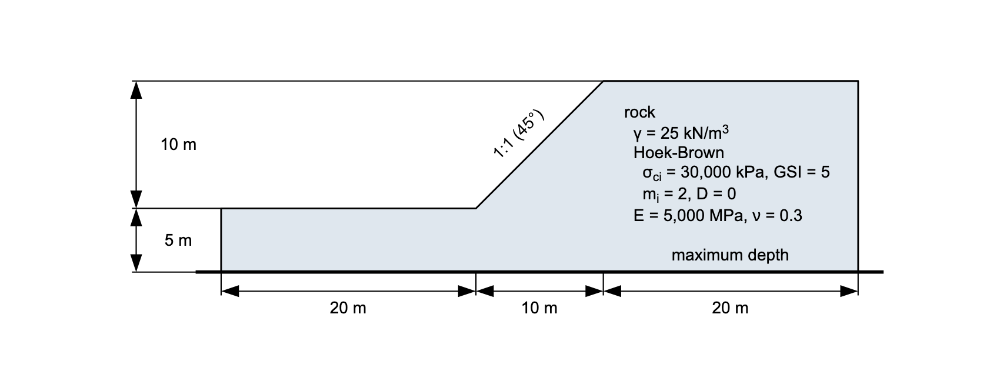{width=1000}

Analysis
Limit equilibrium, finite element

Open &amp; run
~25 min

**Objectives** — Learn how to analyze a rock slope with the generalized
Hoek-Brown criterion: what the four inputs mean and where they come from, what
XSLOPE derives from them, how the criterion reaches a method of slices that wants
a cohesion and a friction angle, and which of the four field inputs the factor
of safety is actually sensitive to.

one materialHoek-BrownGSIdisturbance factorinstantaneous tangentcircular searchquadratic trianglesstrength reductionparametric studydesign sweepmodel checks

**Completed model** — [xslope_rock_slope.xlsx](files/xslope_rock_slope.xlsx),
the weak rock mass of [the Hoek-Brown verification problem](../verification/rs2.md#hoek-brown).
It carries no mesh, so the meshing step is done on the file as downloaded

---

## Part A — A rock mass broken almost to rubble

A straight 45° slope, H = 10 m, in one rock mass at γ = 25 kN/m³, dry, over a
foundation that runs 5 m below the toe with 20 m of level ground on either side.
This is example 1 of Hammah, Yacoub, Corkum & Curran (2005), "The shear strength
reduction method for the generalized Hoek-Brown criterion" (Proc. 40th U.S.
Symposium on Rock Mechanics, ARMA/USRMS Paper 05-810) — the paper that introduced
strength reduction on this criterion — and it is the verification case XSLOPE
locks the `hb` option against in both engines.

### Why a rock mass has no cohesion and no friction angle

The strength of a jointed rock mass comes from two things that a triaxial test on
a core sample cannot separate: how strong the intact blocks are, and how badly the
mass is broken up by the joints between them. A Mohr-Coulomb pair describes
neither. The **generalized Hoek-Brown criterion** describes both, and it is
written in principal stresses rather than as a shear envelope:

$$\sigma'_1 = \sigma'_3 + \sigma_{ci}\left(m_b \dfrac{\sigma'_3}{\sigma_{ci}} + s\right)^{a}$$

Four inputs go into it, and each is something a geologist records rather than
computes:

- **σci** — the uniaxial compressive strength of the **intact** rock,
  from a point-load index or an unconfined compression test on a core. Here
  30 MPa, a weak rock in its own right.
- **GSI**, the **Geological Strength Index** — a single number from 0 to 100
  describing how broken and how weathered the mass is, read off a chart against
  the blockiness of the outcrop and the condition of the joint surfaces. 100 is
  intact rock; 5, the value here, is a mass with no interlocking structure left.
- **mi** — the intact Hoek-Brown constant, a rock-type property that
  runs from about 4 for a claystone to 25 for a granite. Here 2, at the very soft
  end.
- **D**, the **disturbance factor** — from 0 for a surface excavated by careful
  presplit blasting or by machine, to 1 for a heavily blast-damaged face. Here 0.

From those four, XSLOPE derives the three rock-mass constants the equation
actually uses, by the relations of Hoek, Carranza-Torres & Corkum (2002):

$$m_b = m_i \exp\!\left(\frac{GSI - 100}{28 - 14D}\right), \quad
s = \exp\!\left(\frac{GSI - 100}{9 - 3D}\right), \quad
a = \tfrac12 + \tfrac16\!\left(e^{-GSI/15} - e^{-20/3}\right)$$

mb, *s* and *a* are never entered. **The GSI is what does the work in
all three**: it drops mb from mi toward zero as the mass
breaks up, drops *s* from 1 toward zero, and lifts the exponent *a* from the
classical 0.5 toward 0.65.

The method of slices needs shear strength as a function of the normal stress on a
slice base, which the principal-stress form does not give directly. XSLOPE
converts it with **Balmer's (1952) transformation** into the equivalent Mohr
envelope, then linearizes that envelope at each slice's own normal stress into an
**instantaneous tangent** — the straight line that touches the curved envelope
at that one stress, read as a cohesion ci (its intercept) and a
friction angle φi (its slope). Every solution
method carries an outer iteration around this: solve with the current tangents,
update the normal stresses from the solution, re-linearize, and repeat until the
factor of safety stops moving. The
[Hoek-Brown section of the LEM overview](../lem/overview.md#hoek-brown-strength)
carries Balmer's equations and the closed form for the tangent.

### Opening the model

Download [xslope_rock_slope.xlsx](files/xslope_rock_slope.xlsx) and open it in
Studio — **File → Open**. The Inputs plot draws the section: one profile line, the
hatched maximum depth at elevation 0, and the starting circle the file carries.

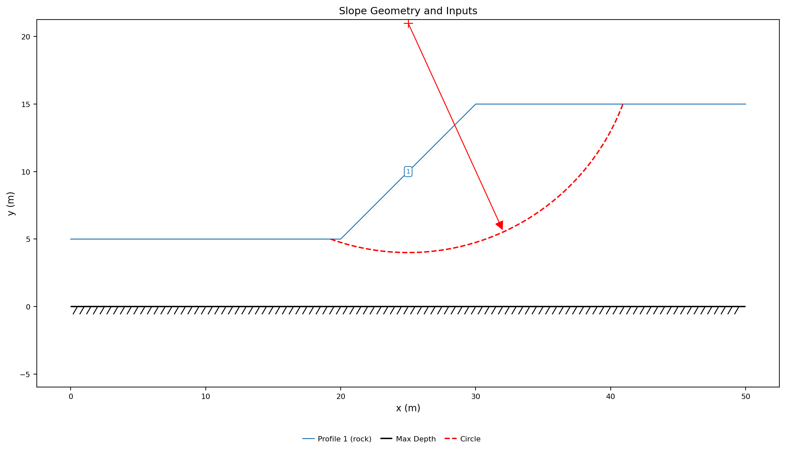{width=1000}

Open **Materials** and switch to **List view**, which puts the strength
parameters beside a plot of the envelope they define:

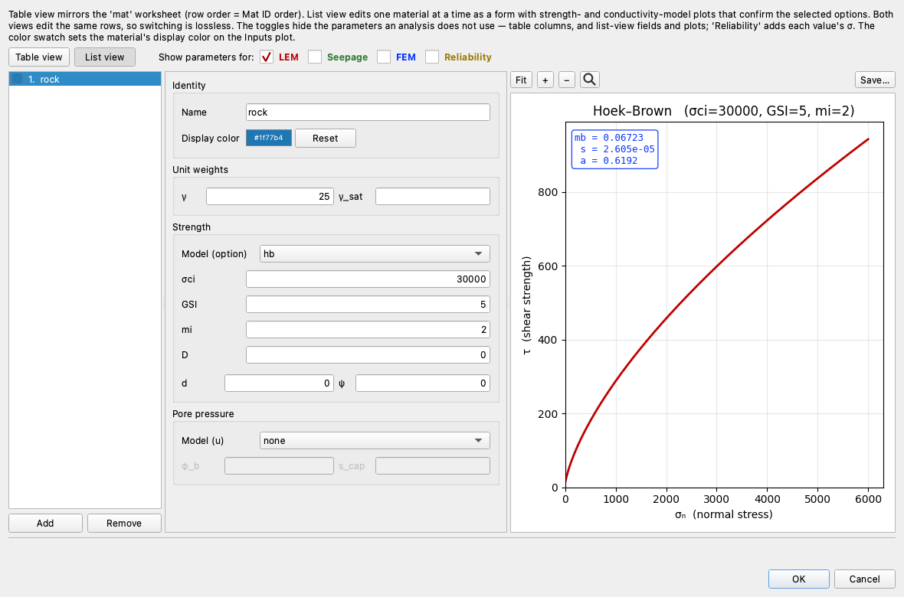

The rock's **Model (option)** is `hb`, and the four fields under it are the four
observations: **σci** = 30000, **GSI** = 5, **mi** = 2, **D** = 0 (σci is in
the model's stress units — kPa here — so it is 30000, not the 30 MPa the paper
prints; typed as 30, the model checks report a units warning). σci
reads 30000 rather than 30 because **XSLOPE never converts units**: every stress
in a model is in the model's own stress unit, kPa here, and 30 MPa is 30,000 kPa.
The box at the top left of the plot reads out what those four produce —
mb = 0.0672, *s* = 2.60 × 10−5, *a* = 0.619 — reproducing
Hammah's Table 1 (0.067, 2.5 × 10⁻⁵, 0.619) to its printed digits. Watch the
exponent: at *a* = 0.619 the envelope is a long way from the classical
square-root shape, which is what makes this a demanding case for the criterion
rather than for the geometry.

The curve beside the fields draws the envelope those constants define, in
τ–σn space over the stress range σci implies. The figure
below redraws it over the stresses this slope actually generates:

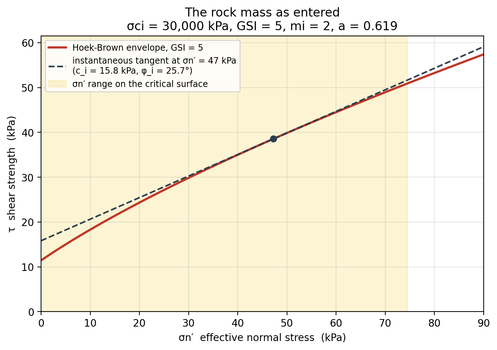{width=800}

The red curve is the envelope, and the shaded band is the range of effective
normal stress the critical surface found in the next section actually carries,
0 to 75 kPa. The curve is not a straight line: it is steepest near zero and
flattens as the confinement grows, so the cohesion and friction angle it implies
change from one slice base to the next. The dashed line shows how one slice
is handled, using 47 kPa as the example — chosen only because it is the average
base stress over the critical surface. A slice at that stress is solved with the
straight line that touches the curve there: cohesion ci = 15.8 kPa
(the line's intercept) and friction angle φi = 25.7° (its slope). Any
other stress would give a different line — a slice at 20 kPa a steeper line with
a smaller intercept, a slice at 70 kPa a flatter one with a larger intercept.
Every slice is solved with its own line at its own base stress. Note the
scale: tens of kPa of shear strength from a rock whose intact strength is 30,000.
The unconfined strength of the rock **mass**, σci·sa, is
43.5 kPa at this GSI, about one part in 700 of the laboratory value; the jointing
has removed almost all of it, and what the slope stands on instead is
confinement.

### Running the analysis

The limit equilibrium answer comes first, because it is the reference the strength
reduction run is read against. Click **Run LEM…** and choose **Method** =
`Spencer` and **Analysis** = `Auto search`, with the slice count left at 40:

**Model checks** reads *No problems found for this run*. Spencer's method solves
for the inclination of the interslice forces rather than fixing it before it
starts, which matters on a rock slope:
[Part B](#a-friction-angle-steep-enough-to-stop-a-method) covers the two methods a
Hoek-Brown envelope can defeat. Click **Run**. The search refines the file's circle
onto a surface that exits at the toe:

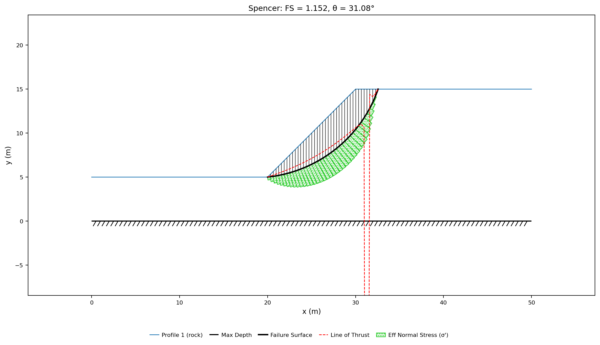{width=1000}

**FS = 1.152**, against Hammah's published 1.152, on a circle centered at
(18.39, 19.93) tangent at elevation 4.92, 16.93 m of failure
surface carrying 954 kN/m of rock. Bishop's simplified method on the same file
gives 1.150 against the paper's 1.153.

### What the criterion supplied along the surface

Every slice base on that surface got its own cohesion and friction angle, because
every slice base sits at its own normal stress. Across the 40 slices the
effective normal stress reaches 74.5 kPa at the deepest part of the arc
and falls to −2.3 kPa at the crest, where the surface is nearly vertical
and there is almost nothing standing on it. The tangent XSLOPE linearized at those
stresses runs from ci = 11.4 to 18.9 kPa with
φi from 23.2° to 36.9°; the steepest of them,
36.9°, is the envelope's own slope at zero confinement, which is where
the criterion is evaluated for any slice the solution puts in tension.
Length-weighted along the surface the pair averages ci = 15.9
kPa and φi = 26.7°, at a mean normal stress of 47.3
kPa — the dashed line on the envelope figure above, which touches
the curve at that stress and nowhere else.

That single pair is not a substitute for the criterion. Entered as a
Mohr-Coulomb material it would over-credit the lightly loaded slices near the
crest and under-credit the heavily loaded ones near the toe, which is the whole
reason the outer iteration exists: **the equivalent Mohr-Coulomb pair is an output
of the analysis, one per slice, not an input to it.**

### The same file through strength reduction

The second half of Part A solves this slope again, in the finite element engine,
by reducing the strength until it will no longer stand. Hoek-Brown needs no
special handling there: the tangent is what gets divided by the trial factor, not
σci. The two elastic properties the run needs, E = 5,000 MPa and
ν = 0.3, are already on the materials table behind its **FEM** toggle. Switch the
mode strip to **FEM**. **Run → Run FEM…** stays disabled
until a mesh exists, so build one first — click **Run → Build Mesh…**

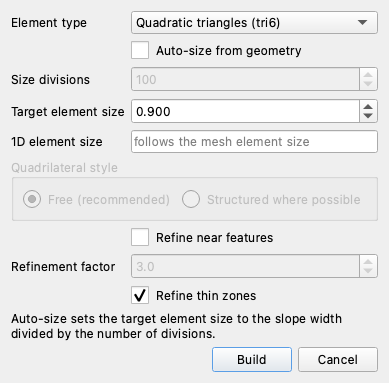

**Element type** opens on **Quadratic triangles (tri6)**, which is what a strength
reduction run needs; linear elements lock and report a factor of safety that is too
high. **Auto-size from geometry** is unticked and **Target element size** reads
`0.900`, because the file declares that size and a declared size is what turns
auto-sizing off. Leave the rest alone and click **Build**. The mesh comes out at
**3,112 nodes and 1,485 triangles**:

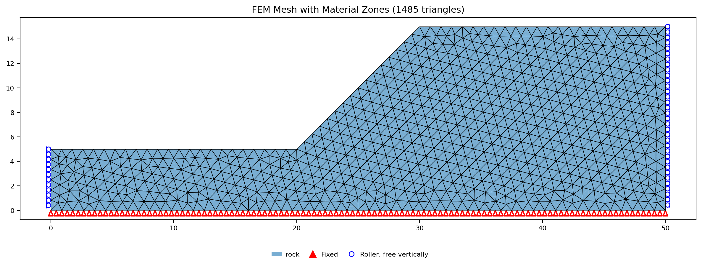{width=1000}

Now click **Run → Run FEM…**

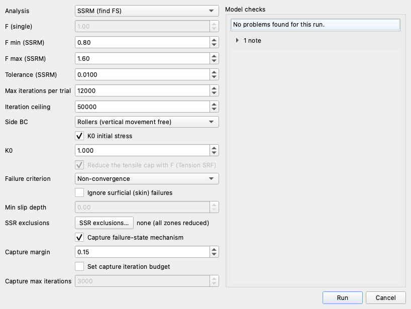

**Model checks — 1 warning**, and **Run** is enabled. The warning is the blank
tensile cutoff `t_cut`, which lets the rock carry tension up to its Mohr-Coulomb
cone apex; [FEM-1](fem01_strength_reduction.md#running-the-strength-reduction)
covers what that means and when to enter a cap. The dialog opens on **SSRM (find
FS)** with the bracket the file declares, **F min (SSRM)** = 0.80 and **F max
(SSRM)** = 1.60, a **Tolerance (SSRM)** of 0.0100, the iteration budget and ceiling
at their own 12,000 and 50,000, **Rollers** on the sides, **K0 initial stress**
ticked at 1.000, and **Non-convergence** as the failure criterion. Click **Run**.
The run takes a few minutes on an ordinary laptop.

**FS = 1.166**, from a final bracket of [1.1625, 1.1688] in
seven bisection steps. Hammah et al. report 1.15 for the same slope,
solved both with the generalized criterion and with an equivalent Mohr-Coulomb
fit.

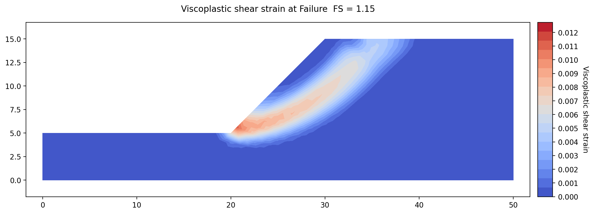{width=1000}

The **FEM · Results** tab opens on **At failure**, the state the run captures by
re-solving beyond the critical factor so the collapse develops far enough to draw.
The contours are viscoplastic shear strain, and the band they draw runs from the
toe up through the face and out onto the crest — the same mechanism Spencer's
circle found, on a surface the finite element run was free to shape any way it
liked.

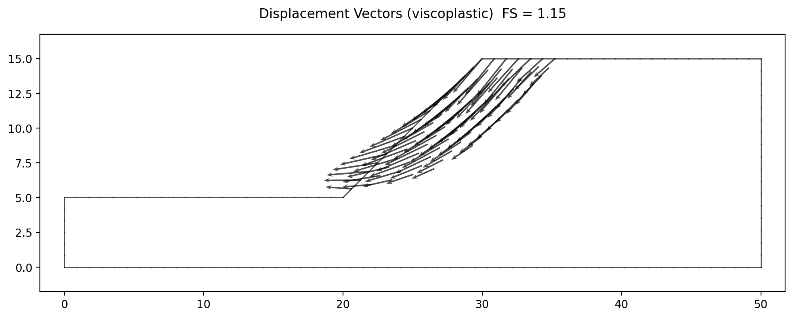{width=1000}

The vectors give the direction that field moved in: down and outward at the crest,
swinging through the body of the slope, and nearly horizontal where the band
reaches the toe.

Three readings of one file:

| Reading | XSLOPE | Hammah et al. |
|---|:---:|:---:|
| Bishop's simplified | 1.150 | 1.153 |
| Spencer's method | 1.152 | 1.152 |
| Strength reduction | 1.166 | 1.15 |

The two engines agree to 1.2% on a slope whose strength is nonlinear everywhere,
and each lands within 1.4% of the value the paper published for it. They get there
from completely different discretizations of the same curve: the limit equilibrium
run linearizes the envelope at the base normal stress on each of 40 slices, and the
finite element run linearizes it at every Gauss point on every viscoplastic
iteration.

---

## Part B — Which inputs move the answer

Four numbers describe this rock, and they are not four numbers of the same kind.
σci comes off a core in a laboratory press, and mi is read
from a table once the rock type is named. **GSI and D are judgments made standing
at the outcrop** — how broken the mass looks, and how roughly it was excavated —
and they are where the uncertainty in a rock slope actually lives. So the question
worth asking of this model is which of them the answer is sensitive to.

Studio answers it with a **Parametric study**, which re-solves the model across a
range of one input. Any numeric material property can be swept, including the
Hoek-Brown columns, and the sweep re-runs the search at every step so the critical
surface is allowed to move as the rock changes.

### Sweeping the Geological Strength Index

Click **Run → Parametric…** Set **Mode** to `Design (FS target)`, which sweeps one
parameter between explicit bounds and reports where the curve meets a target,
rather than the percentage band `Sensitivity` uses. Leave **Method** on `Spencer`
and **Number of slices** at 40. Under **Parameter**, set **Material** to `rock` and
**Property** to `hb_gsi` — the **Sweeping** row echoes `mat:rock:hb_gsi`, the
reference the run will vary. Then set **From** `5`, **To** `20`, **Steps** `6` and
**Target FS** `1.5`, and leave **Re-search the critical surface at each step**
ticked:

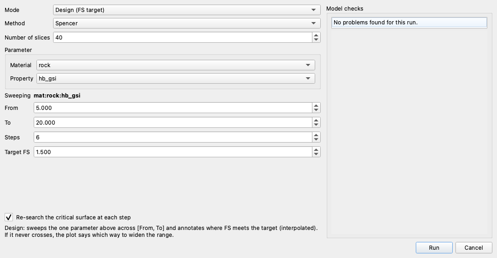

GSI runs to 100, but the sweep stops at 20 on purpose. The factor of safety is
1.152 at GSI 5 and already 2.698 at GSI 20, and above that the rock cannot fail
at all — a search over a slope with no critical surface to find wanders the whole
domain before it settles, and each step takes many times longer than the ones
below it.

Click **Run**. Each step is a full circular search, so give it several minutes:

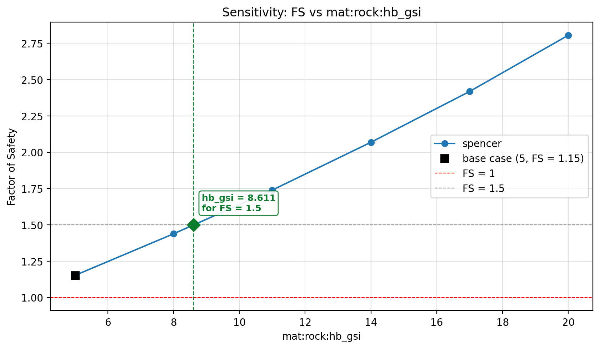{width=800}

Six searches, and the factor of safety more than doubles across them: 1.152 at
the file's own GSI = 5, then 1.439, 1.740, 2.069 and 2.419 at each further step of
three, and 2.698 at GSI = 20. The green marker reads the target off the solved
points — **GSI = 8.611 for FS = 1.5** — so three and a half points of a chart-read
index separate this cut from the factor of safety a permanent rock slope is asked
for. Each step solved with its own rock-mass constants:

| GSI | mb | *s* | *a* | σci·sa (kPa) | FS |
|:---:|:---:|:---:|:---:|:---:|:---:|
| 5 | 0.0672 | 2.60 × 10−5 | 0.619 | 43.5 | 1.152 |
| 8 | 0.0748 | 3.64 × 10−5 | 0.598 | 66.7 | 1.439 |
| 11 | 0.0833 | 5.07 × 10−5 | 0.580 | 97.0 | 1.740 |
| 14 | 0.0927 | 7.08 × 10−5 | 0.565 | 135 | 2.069 |
| 17 | 0.1032 | 9.88 × 10−5 | 0.553 | 182 | 2.419 |
| 20 | 0.1149 | 1.38 × 10−4 | 0.544 | 239 | 2.698 |

### Why the index carries it

GSI sets all three rock-mass constants at once:

$$m_b = m_i \exp\!\left(\frac{GSI - 100}{28 - 14D}\right), \quad
s = \exp\!\left(\frac{GSI - 100}{9 - 3D}\right), \quad
a = \tfrac12 + \tfrac16\!\left(e^{-GSI/15} - e^{-20/3}\right)$$

The one that matters most here is *s*, because it sets the strength of the mass
at low confinement, and this slope is a low-confinement problem: its critical
surface carries an average normal stress of only 47 kPa. The table's
σci·sa column is the mass's strength at zero confinement,
and it climbs from 43.5 kPa at GSI 5 to 239 kPa at GSI 20 — five and a half times
as much for fifteen points of GSI. Drawn at GSI 5, 30 and 70 — the file's rock
and the same rock at two better ratings — the envelopes look like this:

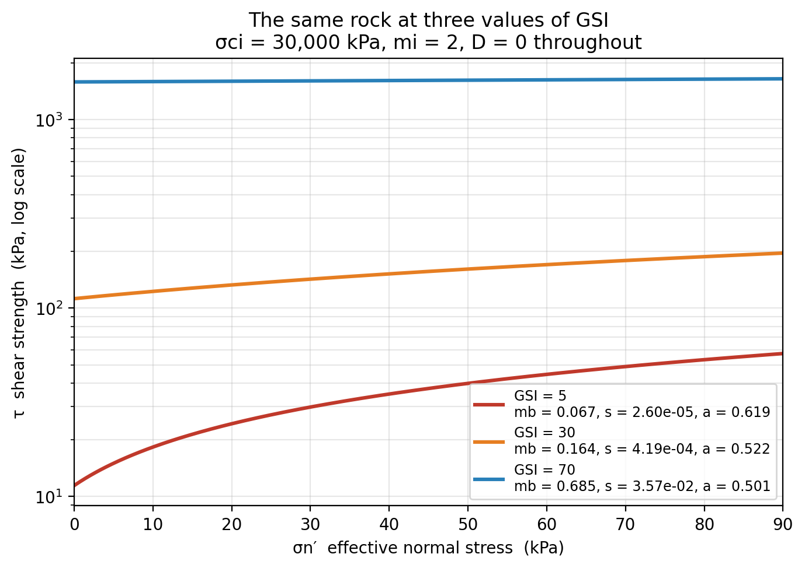{width=800}

The three curves are not one curve scaled: they start at different heights and
bend by different amounts, which is why one field judgment moves the factor of
safety as far as it does.

### The disturbance factor

D describes how much the excavation damaged the mass beyond its natural jointing:
0 for a face cut by machine or careful presplit blasting, 1 for one wrecked by
production blasting. It appears in the denominators above, so raising it shrinks
both mb and *s* — the same collapse GSI causes, from the other
direction.

Open **Run → Parametric…** again and change three things: **Property** to `hb_d`,
**From** `0`, **To** `1`, **Steps** `5`. Everything else stays. Click **Run**:

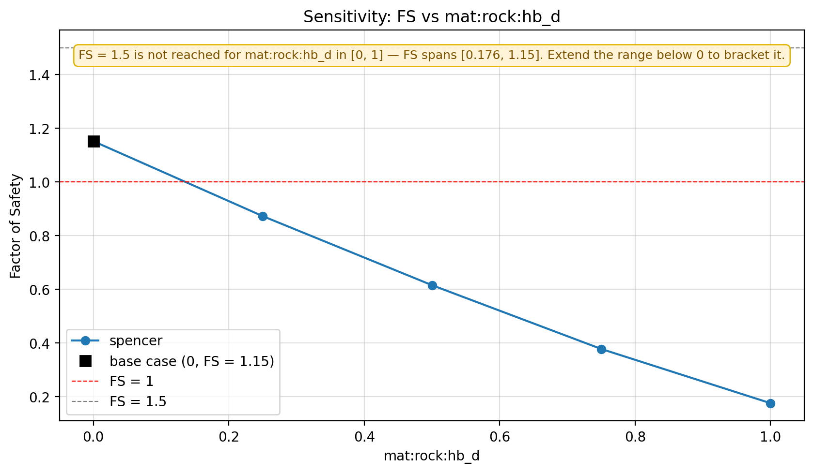{width=800}

Five searches, and the answer falls the whole way down: 1.152 at D = 0, then
0.873, 0.616 and 0.378, and 0.176 at D = 1. The target is never bracketed, and the
banner across the top of the figure says so rather than extrapolating a value past
the last solved point — the factor of safety spans [0.176, 1.15] over the entire
range D has. The curve crosses FS = 1 instead, between D = 0 and D = 0.25:

| D | mb | *s* | σci·sa (kPa) | FS |
|:---:|:---:|:---:|:---:|:---:|
| 0 | 0.0672 | 2.60 × 10−5 | 43.5 | 1.152 |
| 0.25 | 0.0414 | 9.98 × 10−6 | 24.0 | 0.873 |
| 0.50 | 0.0217 | 3.15 × 10−6 | 11.8 | 0.616 |
| 0.75 | 0.0088 | 7.72 × 10−7 | 4.92 | 0.378 |
| 1 | 0.0023 | 1.33 × 10−7 | 1.66 | 0.176 |

Nothing about the rock changed across those five runs — only how the face was
excavated. Blast damage lowers mb and *s* the way a lower GSI does
(the mass's unconfined strength falls from 43.5 kPa at D = 0 to 1.66 kPa at
D = 1), and the factor of safety falls with them, 1.152 to 0.176.

The two sweeps end differently. GSI reaches the 1.5 target inside its range, at
8.6. D never does: the best face this rock can be given, D = 0, is the 1.152 Part
A solved, and every value above that is worse. **A mass at GSI 5 will not stand a
45° cut at a factor of safety of 1.5 however carefully it is excavated** — the
rock has to be better, or the slope flatter.

### A friction angle steep enough to stop a method

A Hoek-Brown envelope is steepest where the confinement is lowest, and how steep
it gets there is set by mi rather than by GSI. This rock's
mi = 2 sits at the very soft end of the table, so its envelope never
gets steep: the instantaneous friction angle at zero confinement is
36.9° at GSI = 5 and 34.7° at GSI = 70, peaking at only
46.7° in between. Put a granite's mi = 25 in the same cells and
the same two ends read 72.5° and 71.9°.

That second case is the one to know about before running a competent rock. The
Corps of Engineers and Lowe & Karafiath methods fix the inclination of the
interslice forces before solving rather than solving for it, and above about 55°
they can fail to reach a solution at all — a property of those two
force-equilibrium methods rather than of Hoek-Brown, since a plain Mohr-Coulomb
material at φ > 55° defeats them the same way. Selecting either one on a
Hoek-Brown material puts the pairing in the checks column before the run starts,
whatever the constants happen to be:

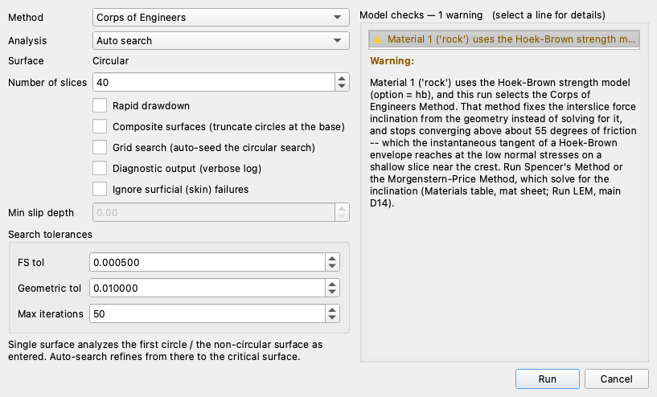

Spencer's method and the Morgenstern-Price method solve for the inclination
instead of fixing it, which is why this page runs Spencer throughout. Bishop's
simplified method avoids the difficulty another way, by carrying no interslice
shear at all — which is why Part A's Bishop run converged on this section.

One last note on the σci check from Part A: it fires on any
σci below 1000 kPa, which includes models stated deliberately in
normalized form — the Li, Merifield & Lyamin (2008) rock-slope charts hold
σci/(γH) at a critical ratio and reach σci values of a few
kilopascals, and [verification problem RS2-60](../verification/rs2.md#rs2-60)
carries three of them. There the check is read and ignored, which is the one case
its own message names.

---

## Conclusion

This tutorial covered:

- The four Hoek-Brown inputs — σci, GSI, mi and D — and the
  three rock-mass constants mb, *s* and *a* that XSLOPE derives from
  them and the reader never enters.
- The instantaneous tangent: a cohesion and a friction angle recomputed at every
  slice's own normal stress, as an output of the analysis rather than an input to
  it.
- One rock slope solved by Spencer's method and by finite element strength
  reduction from the same file, the two engines agreeing to 1.2% and both landing
  within 1.4% of the published values.
- A Design sweep in the Parametric study: which of the four field inputs the
  factor of safety turns on, and why the Geological Strength Index has the leverage
  it does — *s* collapses about three times as fast as mb, and a slope
  this size lives at the low confinement where *s* decides the answer.

**Where to go next:** the [tutorials index](index.md) lists the series.
[LEM-11](lem11_reliability.md) turns the same kind of input uncertainty into a
probability of failure instead of a sweep.
[LEM-7](lem07_strength_envelopes.md) covers the other two nonlinear strength
options — a power-curve envelope and an undrained strength that grows with depth —
and the [Limit Equilibrium Method overview](../lem/overview.md#hoek-brown-strength)
carries Balmer's transformation and the two cautions a rock slope raises: the
methods that struggle against steep instantaneous friction angles, and the shallow
crest mechanism a very weak rock mass invites.
[FEM-1](fem01_strength_reduction.md) is strength reduction on its own, on an
embankment.
